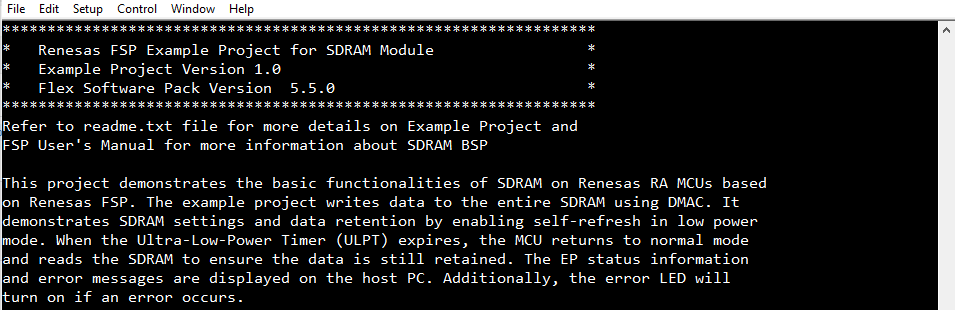
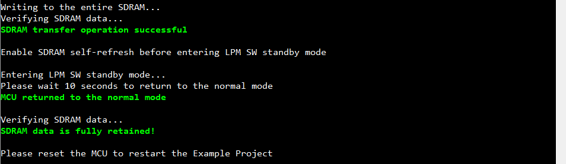
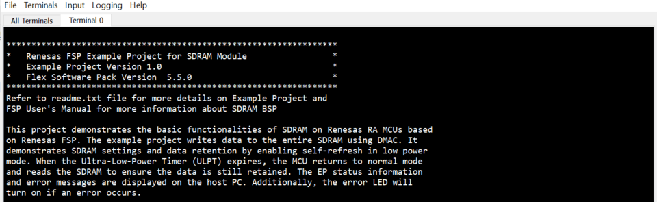
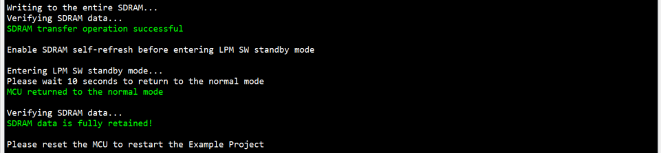

# Introduction #
This project demonstrates the basic functionalities of SDRAM on Renesas RA MCUs based on Renesas FSP. The example project writes data to the entire SDRAM using DMAC. It demonstrates SDRAM settings and data retention by enabling self-refresh in low power mode. When the Ultra-Low-Power Timer (ULPT) expires, the MCU returns to normal mode and reads the SDRAM to ensure the data is still retained. The EP status information and error messages are displayed on the host PC. Additionally, the error LED will turn on if an error occurs.

**NOTE:**
- To display information, users can choose between the SEGGER J-Link RTT Viewer and the Serial Terminal (UART)with J-Link OB VCOM. It is important to note that the user should only operate a single terminal application at a time to avoid conflicts or data inconsistencies. 
- For instructions on how to switch between these options, please refer to the "Verifying Operation" section in this file.
- By default, EP information is printed to the host PC using the Serial Terminal for boards that support J-Link OB VCOM.

  For the RA boards that do not support J-Link OB VCOM, EP uses the SEGGER J-Link RTT Viewer by default instead.
- RA boards supported for J-Link OB VCOM: EK-RA8D1

Please refer to the [Example Project Usage Guide](https://github.com/renesas/ra-fsp-examples/blob/master/example_projects/Example%20Project%20Usage%20Guide.pdf) 
for general information on example projects and [readme.txt](./readme.txt) for specifics of operation.

## Required Resources ## 
The following resources are needed to build and run the SDRAM example project.

### Hardware Requirements ###
Supported RA Boards: EK-RA8D1
* 1 x Host PC.
* 1 x Renesas RA board.
* 1 x Micro USB cable for programming and debugging.

### Hardware Connections ###
* EK-RA8D1:
  * Connect RA board to Host PC by Micro USB cable.
  * For EK-RA8D1: Set the configuration switches (SW1) as below.

| SW1-1 PMOD1 | SW1-2 TRACE | SW1-3 CAMERA | SW1-4 ETHA | SW1-5 ETHB | SW1-6 GLCD | SW1-7 SDRAM | SW1-8 I3C |
|-------------|-------------|--------------|------------|------------|------------|-------------|-----------|
| OFF | OFF | OFF | OFF | OFF | OFF | ON | OFF |

### Software ###
* Renesas Flexible Software Package (FSP): Version 6.0.0
* E2 studio: Version 2025-04.1
* SEGGER J-Link RTT Viewer: Version 8.44a
* GCC ARM Embedded Toolchain: Version 13.2.1.arm-13-7
* Serial Terminal Console Application: Tera Term or a similar application (for boards that support J-Link OB VCOM)

Refer to the software required section in [Example Project Usage Guide](https://github.com/renesas/ra-fsp-examples/blob/master/example_projects/Example%20Project%20Usage%20Guide.pdf)

## Related Collateral References ##
The following documents can be referred to for enhancing your understanding of 
the operation of this example project:
- [FSP User Manual on GitHub](https://renesas.github.io/fsp/)
- [FSP Known Issues](https://github.com/renesas/fsp/issues)

# Project Notes #

## System Level Block Diagram ##
High level block diagram of the system is shown below:
 

## FSP Modules Used ##
List all the various modules that are used in this example project. Refer to the FSP User Manual for further details on each module listed below.

| Module Name | Usage | Searchable Keyword  |
|-------------|-----------------------------------------------|-----------------------------------------------|
| DMAC | DMAC is used to write data from SDRAM and read back to verification without CPU. | r_dmac |
| Low Power Modes | LPM is used to configure power cancellation, mode selection and return the MCU to low power mode to reduce power consumption. | r_lpm |
| Ultra-Low-Power Timer | ULPT is used to wake up CPU from Low Power Mode. | r_ulpt |
| I/O Port | I/O Port is used to control LED onboard. | r_ioport |

**Configuration Properties for SDRAM transfer (DMAC)**
|   Module Property Path and Identifier   |   Default Value   |   Used Value   |   Reason   |
|-----------------------------------------|-------------------|----------------|------------|
| configuration.xml > Stacks > Properties > g_sdram_transmission Transfer (r_dmac) No ELC Trigger > Settings > Property > Module g_sdram_transmission Transfer (r_dmac) No ELC Trigger > Channel | 0 | 0 | Select DMAC channel. |
| configuration.xml > Stacks > Properties > g_sdram_transmission Transfer (r_dmac) No ELC Trigger > Settings > Property > Module g_sdram_transmission Transfer (r_dmac) No ELC Trigger > Mode | Normal | Normal | Select the transfer mode. |
| configuration.xml > Stacks > Properties > g_sdram_transmission Transfer (r_dmac) No ELC Trigger > Settings > Property > Module g_sdram_transmission Transfer (r_dmac) No ELC Trigger > Transfer Size | 2 Bytes | 4 Bytes | Select the transfer size. |
| configuration.xml > Stacks > Properties > g_sdram_transmission Transfer (r_dmac) No ELC Trigger > Settings > Property > Module g_sdram_transmission Transfer (r_dmac) No ELC Trigger > Destination Address Mode | Fixed | Incremented | Select the address mode for the destination. |
| configuration.xml > Stacks > Properties > g_sdram_transmission Transfer (r_dmac) No ELC Trigger > Settings > Property > Module g_sdram_transmission Transfer (r_dmac) No ELC Trigger > Source Address Mode | Fixed | Incremented | Select the address mode for the source. |
| configuration.xml > Stacks > Properties > g_sdram_transmission Transfer (r_dmac) No ELC Trigger > Settings > Property > Module g_sdram_transmission Transfer (r_dmac) No ELC Trigger > Number of Transfers | 1 | 1024 | Select the address mode for the source. |
| configuration.xml > Stacks > Properties > g_sdram_transmission Transfer (r_dmac) No ELC Trigger > Settings > Property > Module g_sdram_transmission Transfer (r_dmac) No ELC Trigger > Callback | NULL | transmission_sdram_callback | The callback function is called at the end of the transfer. |
| configuration.xml > Stacks > Properties > g_sdram_transmission Transfer (r_dmac) No ELC Trigger > Settings > Property > Module g_sdram_transmission Transfer (r_dmac) No ELC Trigger > Transfer End Interrupt Priority | Disable | Priority 2 | Select the transfer end interrupt priority. |
| configuration.xml > Stacks > Properties > g_sdram_transmission Transfer (r_dmac) No ELC Trigger > Settings > Property > Module g_sdram_transmission Transfer (r_dmac) No ELC Trigger > Interrupt Frequency | Interrupt after all transfers have completed | Interrupt after all transfers have completed | Select to have interrupt after each transfer or after last transfer. |

**Configuration Properties for SW standby mode LPM instance**
|   Module Property Path and Identifier   |   Default Value   |   Used Value   |   Reason   |
|-----------------------------------------|-------------------|----------------|------------|
| configuration.xml > Stacks > Properties > g_sw_standby Low Power Modes (r_lpm) > Settings > Property > Module g_sw_standby Low Power Modes (r_lpm) > General > Low Power Mode | Sleep mode | Software Standby mode | Select Software Standby mode for this LPM instance. |
| configuration.xml > Stacks > Properties > g_sw_standby Low Power Modes (r_lpm) > Settings > Property > Module g_sw_standby Low Power Modes (r_lpm) > General > Output port state in standby and deep standby | No change | No change | Retained state of the output pins after entering SW Standby mode. |
| configuration.xml > Stacks > Properties > g_sw_standby Low Power Modes (r_lpm) > Settings > Property > Module g_sw_standby Low Power Modes (r_lpm) > Deep Sleep and Standby Options > Wake Sources > ULPT0 Underflow Interrupt | ☐ | ☑ | Select ULPT0 Underflow Interrupt as the source to cancel SW Standby mode. |
| configuration.xml > Stacks > Properties > g_sw_standby Low Power Modes (r_lpm) > Settings > Property > Module g_sw_standby Low Power Modes (r_lpm) > RAM Retention Control (Not available on every MCU) > RAM retention in Standby mode > Supply power to RAM Region 0 [0x22000000, 0x2201FFFF] | ☐ | ☑  | Retained this memory region in SW Standby mode. |
| configuration.xml > Stacks > Properties > g_sw_standby Low Power Modes (r_lpm) > Settings > Property > Module g_sw_standby Low Power Modes (r_lpm) > RAM Retention Control (Not available on every MCU) > RAM retention in Standby mode > Supply power to RAM Region 1 [0x22020000, 0x2203FFFF] | ☐ | ☑  | Retained this memory region in SW Standby mode. |
| configuration.xml > Stacks > Properties > g_sw_standby Low Power Modes (r_lpm) > Settings > Property > Module g_sw_standby Low Power Modes (r_lpm) > RAM Retention Control (Not available on every MCU) > RAM retention in Standby mode > Supply power to RAM Region 2 [0x22040000, 0x2205FFFF] | ☐ | ☑  | Retained this memory region in SW Standby mode. |
| configuration.xml > Stacks > Properties > g_sw_standby Low Power Modes (r_lpm) > Settings > Property > Module g_sw_standby Low Power Modes (r_lpm) > RAM Retention Control (Not available on every MCU) > RAM retention in Standby mode > Supply power to RAM Region 3 [0x22060000, 0x2207FFFF] | ☐ | ☑  | Retained this memory region in SW Standby mode. |
| configuration.xml > Stacks > Properties > g_sw_standby Low Power Modes (r_lpm) > Settings > Property > Module g_sw_standby Low Power Modes (r_lpm) > RAM Retention Control (Not available on every MCU) > RAM retention in Standby mode > Supply power to RAM Region 4 [0x22080000, 0x2209FFFF] | ☐ | ☑  | Retained this memory region in SW Standby mode. |
| configuration.xml > Stacks > Properties > g_sw_standby Low Power Modes (r_lpm) > Settings > Property > Module g_sw_standby Low Power Modes (r_lpm) > RAM Retention Control (Not available on every MCU) > RAM retention in Standby mode > Supply power to RAM Region 5 [0x220A0000, 0x220BFFFF] | ☐ | ☑  | Retained this memory region in SW Standby mode. |
| configuration.xml > Stacks > Properties > g_sw_standby Low Power Modes (r_lpm) > Settings > Property > Module g_sw_standby Low Power Modes (r_lpm) > RAM Retention Control (Not available on every MCU) > RAM retention in Standby mode > Supply power to RAM Region 6 [0x220C0000, 0x220DFFFF] | ☐ | ☑  | Retained this memory region in SW Standby mode. |
| configuration.xml > Stacks > Properties > g_sw_standby Low Power Modes (r_lpm) > Settings > Property > Module g_sw_standby Low Power Modes (r_lpm) > RAM Retention Control (Not available on every MCU) > TCM retention in Deep Sleep and Standby modes | Supply power to TCM | Supply power to TCM  | Retained TCM in SW Standby mode. |
| configuration.xml > Stacks > Properties > g_sw_standby Low Power Modes (r_lpm) > Settings > Property > Module g_sw_standby Low Power Modes (r_lpm) > RAM Retention Control (Not available on every MCU) > Standby RAM retention in Standby and Deep Standby modes | Supply power to Standby RAM | Supply power to Standby RAM  | Retained Standby RAM in SW Standby mode. |

**Configuration Properties for using ULPT**
|   Module Property Path and Identifier   |   Default Value   |   Used Value   |   Reason   |
|-----------------------------------------|-------------------|----------------|------------|
| configuration.xml > g_timer_cancel_lpm Timer, Ultra-Low-Power (r_ulpt) > Settings > Property > Module g_timer_cancel_lpm Timer, Ultra-Low-Power (r_ulpt) > General > Channel | 0 | 0 | Use ULPT Channel 0 to cancel LPM modes. |
| configuration.xml > g_timer_cancel_lpm Timer, Ultra-Low-Power (r_ulpt) > Settings > Property > Module g_timer_cancel_lpm Timer, Ultra-Low-Power (r_ulpt) > General > Mode | Periodic | Periodic | Configure the ULPT timer in periodic mode. |
| configuration.xml > g_timer_cancel_lpm Timer, Ultra-Low-Power (r_ulpt) > Settings > Property > Module g_timer_cancel_lpm Timer, Ultra-Low-Power (r_ulpt) > General > Period | 0x10000 | 10 | Set the periodic value for the ULPT timer. |
| configuration.xml > g_timer_cancel_lpm Timer, Ultra-Low-Power (r_ulpt) > Settings > Property > Module g_timer_cancel_lpm Timer, Ultra-Low-Power (r_ulpt) > General > Period Unit | Raw Counts | Seconds | Set the periodic for the ULPT timer to 10 seconds. |
| configuration.xml > g_timer_cancel_lpm Timer, Ultra-Low-Power (r_ulpt) > Settings > Property > Module g_timer_cancel_lpm Timer, Ultra-Low-Power (r_ulpt) > General > Count Source | LOCO | LOCO | Select LOCO as ULPT clock source to operate in LPM mode. |

**SDRAM setups in BSP Configuration**
|   Module Property Path and Identifier   |   Default Value   |   Used Value   |   Reason   |
|-----------------------------------------|-------------------|----------------|------------|
| configuration.xml > BSP > Properties > Settings > Property > RA8D1 Family > SDRAM > SDRAM Support | Disable | Enable | Initialize SDRAM. |

**Enable Data cache in BSP Configuration**
|   Module Property Path and Identifier   |   Default Value   |   Used Value   |   Reason   |
|-----------------------------------------|-------------------|----------------|------------|
| configuration.xml > BSP > Properties > Settings > Property > RA8D1 Family > Cache setting > Data cache | Disable | Enable | Enable Data cache to improve performance. |

**Configuration Properties for using the Serial Terminal (UART)**
|   Configure interrupt event path   |   Default Value   |   Used Value   |   Reason   |
|-----------------------------------------|-------------------|----------------|------------|
| configuration.xml > Interrupts > Interrupts Configuration > New User Event > SCI > SCI9 > SCI9 RXI (Receive data full) | empty | sci_b_uart_rxi_isr | Assign the UART receive ISR (Receive data full) to the interrupt vector table. |
| configuration.xml > Interrupts > Interrupts Configuration > New User Event > SCI > SCI9 > SCI9 TXI (Transmit data empty) | empty | sci_b_uart_txi_isr | Assign the UART transfer ISR (Transmit data empty) to the interrupt vector table. |
| configuration.xml > Interrupts > Interrupts Configuration > New User Event > SCI > SCI9 > SCI9 TEI (Transmit end) | empty | sci_b_uart_tei_isr | Assign the UART transfer ISR (Transmit end) to the interrupt vector table. |
| configuration.xml > Interrupts > Interrupts Configuration > New User Event > SCI > SCI9 > SCI9 ERI (Receive error) | empty | sci_b_uart_eri_isr | Assign the UART receive ISR (Receive error) to the interrupt vector table. |

**Configure SCICLK in Clock Configuration**
|   Configure Clock path   |   Default Value   |   Used Value   |   Reason   |
|-----------------------------------------|-------------------|----------------|------------|
| configuration.xml > Clocks > Clocks Configuration | SCICLK Disable | SCICLK Src:PLL1P | Enable operating clock for SCI module by PLL1P clock source. |

## API Usage ##
The table below lists the FSP provided API used at the application layer in this example project.

| API Name    | Usage                                                                          |
|-------------|--------------------------------------------------------------------------------|
| R_DMAC_Open | This API is used to initialize the DMAC module. |
| R_DMAC_Reset | This API is used to reset the transfer source, destination of DMAC module. |
| R_DMAC_SoftwareStart | This API is used to trigger transfer data by software. |
| R_DMAC_Close | This API is used to de-initialize the DMAC module. |
| R_LPM_Open | This API is used to initialize the LPM module. |
| R_LPM_LowPowerModeEnter | This API is used to enter low power mode. |
| R_LPM_Close | This API is used to de-initialize the LPM module. |
| R_ULPT_Open | This API is used to initialize the ULPT module. |
| R_ULPT_Start | This API is used to start the ULPT timer. |
| R_ULPT_Stop | This API is used to stop the ULPT timer. |
| R_ULPT_Close | This API is used to de-initialize the ULPT module. |
| R_IOPORT_PinWrite | This API is used to control LEDs on-board. |
| R_BSP_SoftwareDelay | This API is used to delay a specified period of time. |
| R_BSP_SdramSelfRefreshEnable | This API is used to enable SDRAM self-refresh. |
| R_BSP_SdramSelfRefreshDisable | This API is used to disable SDRAM self-refresh. |
| SCB_CleanDCache_by_Addr | This API is used to clean data cache. |
| SCB_InvalidateDCache_by_Addr | This API is used to reflect data from memory to data cache. |

For using the Serial Terminal (UART):
| API Name    | Usage                                                                          |
|-------------|--------------------------------------------------------------------------------|
| R_SCI_B_UART_Open | This API is used to initialize SCI UART module. |
| R_SCI_B_UART_Write | This API is used to perform a write operation. |
| R_SCI_B_UART_Close | This API is used to de-initialize SCI UART module. |

## Verifying Operation ##
1. Import the example project. 

    By default, the EP supports Serial terminal for RA boards that support J-link OB VCOM

    * Define USE_VIRTUAL_COM=1 macro in Project Properties -> C/C++ Build -> Settings -> Tool Settings -> GNU ARM Cross C Compiler -> Preprocessor

    To use SEGGER J-Link RTT Viewer, please follow the instructions below:

    * Define USE_VIRTUAL_COM=0 macro in Project Properties -> C/C++ Build -> Settings -> Tool Settings -> GNU ARM Cross C Compiler -> Preprocessor

2. Generate, and build the example project.
3. Before running the example project, make sure hardware connections are completed.
4. Connect the RA MCU debug port to the host PC via a micro USB cable.
5. Open a Serial terminal application on the host PC and connect to the COM Port provided by the J-Link on-board or 
   Open J-Link RTT Viewer (In case the user selected SEGGER J-Link RTT Viewer or RA boards do not support J-Link OB VCOM).
   * Note: For using the serial terminal:
        * Please ensure that the connection to the SEGGER J-Link RTT Viewer has been terminated.
        * The COM port is provided by the J-Link onboard, with a baud rate of 115200 bps, a data length of 8 bits, no parity check, one stop bit, and no flow control.
6. Debug or flash the EP project to the RA board to view output log.

The below images showcase the output on the Serial terminal application (Tera Term):

The below images showcase the output on the SEGGER J-Link RTT Viewer:

