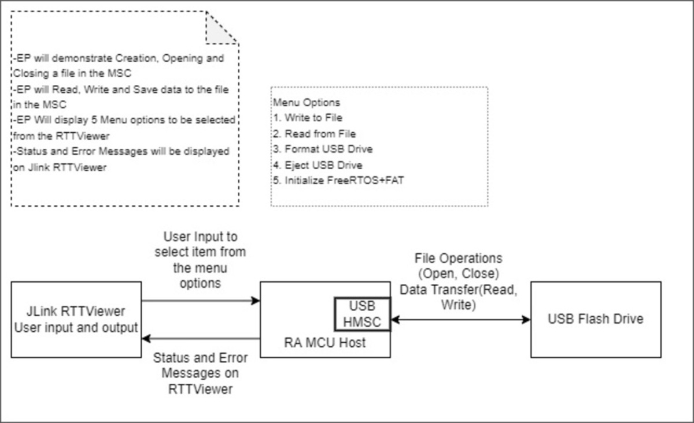
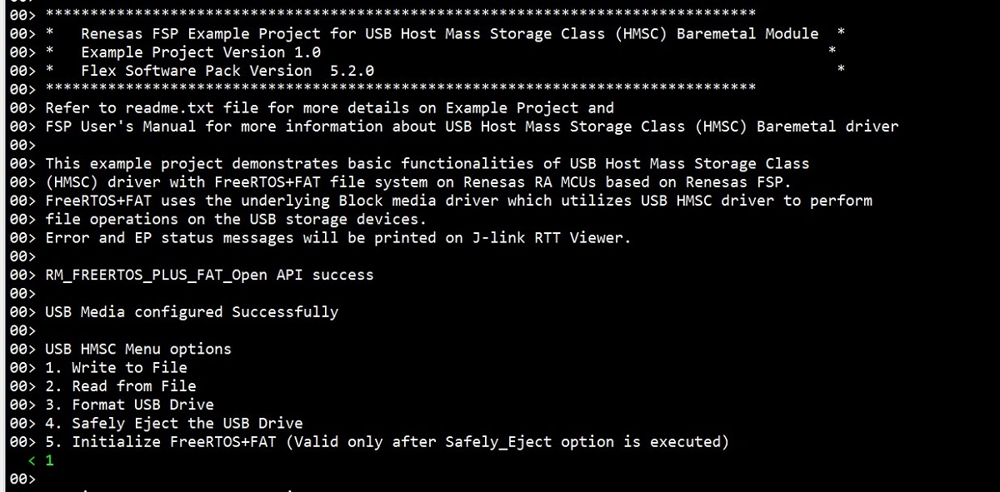
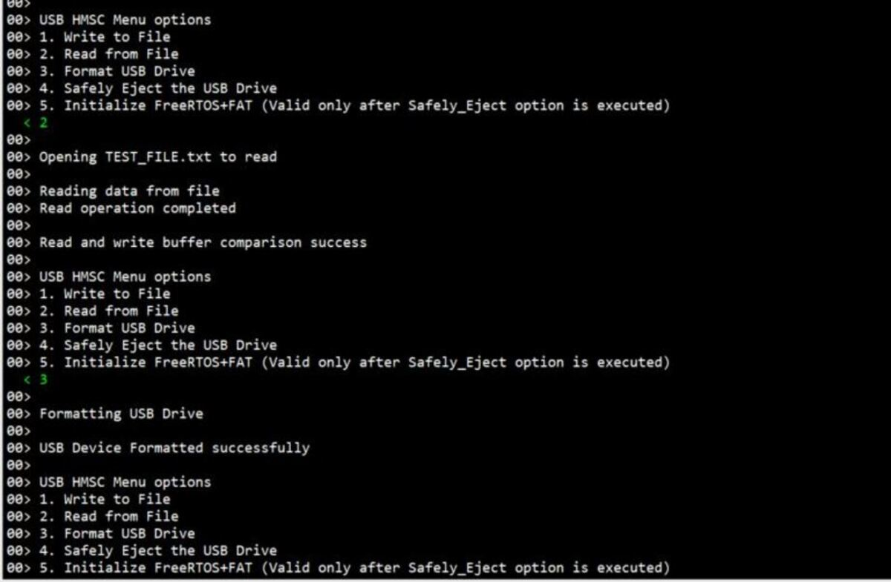
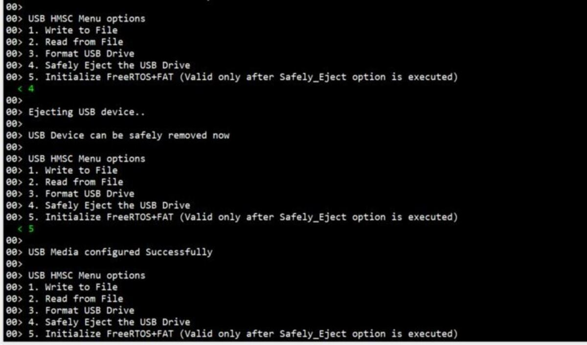

# Introduction #

This example project demonstrates basic functionalities of USB Host Mass Storage Class (HMSC) driver with FAT file system with Baremetal
using FreeRTOS+FAT on Renesas RA MCUs based on Renesas FSP. FreeRTOS+FAT uses the blockmedia driver, which uses an underlying USB HMSC driver
to perform file operations on the storage devices. The project performs basic file operations (open, read, write, format and close) on
the USB Flash drive. Error and EP status messages will be printed on J-link RTT Viewer.
         
Please refer to the [Example Project Usage Guide](https://github.com/renesas/ra-fsp-examples/blob/master/example_projects/Example%20Project%20Usage%20Guide.pdf) 
for general information on example projects and [readme.txt](./readme.txt) for specifics of operation.

## Required Resources ##
To build and run the example project, the following resources are needed.

### Hardware ###
* Renesas RA board: EK-RA4M2/EK-RA4M3/EK-RA6M3/EK-RA6M3G/EK-RA6M4/EK-RA6M5/EK-RA8M1/EK-RA8D1
* 1 x Micro USB cable for programming and debugging
* 1 x USB 2.0 Flash Drive - Supported formats - FAT32
* 1 x USB OTG Cable (Micro USB to USB Host)

Refer to [readme.txt](./readme.txt) for information on how to connect the hardware.

### Software ###
* Renesas Flexible Software Package (FSP): Version 6.1.0
* e2 studio: Version 2025-07
* SEGGER J-Link RTT Viewer: Version 8.58
* GCC ARM Embedded Toolchain: Version 13.2.1.arm-13-7

Refer to software requirements mentioned in [Example Project Usage Guide](https://github.com/renesas/ra-fsp-examples/blob/master/example_projects/Example%20Project%20Usage%20Guide.pdf)

## Related Collateral References ##
The following documents can be referred to for enhancing your understanding of 
the operation of this example project:
- [FSP User Manual on GitHub](https://renesas.github.io/fsp/)
- [FSP Known Issues](https://github.com/renesas/fsp/issues)

# Project Notes #

## System Level Block Diagram ##

Note: Menu option 5 is valid only after menu option 4 is executed.

## FSP Modules Used ##
List all the various modules that are used in this example project. Refer to the FSP User Manual for further details on each module listed below.

| Module Name | Usage  | Searchable Keyword (using New Stack > Search) |
|-------------|-----------------------------------------------|-----------------------------------------------|
| FreeRTOS+FAT | This module provides the hardware port layer for FreeRTOS+FAT file system and the file system can be used using APIs.
                 FreeRTOS+FAT stack is used to enable media driver to perform I/O operations on media connected by user through a Baremetal Application| freertos |

## Module Configuration Notes ##
This section describes FSP Configurator properties that are important or different from those selected by default. 

**Common Configuration Properties**

|   Module Property Path and Identifier   |   Default Value   |   Used Value   |   Reason   |
| :-------------------------------------: | :---------------: | :------------: | :--------: |
|   configuration.xml > BSP > Property > Main Stack Size(bytes)  |  0   | 0x800  |   Modified main stack size to accommodate function call operations according to FSP User Manual |
|   configuration.xml > BSP > Property > Heap Size(bytes)  |  0   | 0x800|  Change heap size to accommodate file operations in the EP and avoid any runtime errors according to FSP User Manual |
|   configuration.xml > BSP > Property > Parameter Checking  |  Disabled   | Enabled|  The Parameter Checking is enabled to ensure no invalid parameters are passed |
|   configuration.xml > FreeRTOS+FAT > Settings > Property > Long Function Names  >  LFN Support | Disabled | Enabled | This support is enabled to use wide range of file names |
|   configuration.xml > rm_freertos_plus_fat > Settings > Property > Module FreeRTOS+FAT port for RA  >  Total number of sectors | 31293440 | 77244 | Total number of sectors modified based on the connected device |
|   configuration.xml > FreeRTOS+FAT > Settings > Property > Long Function Names  >  LFN Support | Disabled | Enabled | This support is enabled to recognise case bits while using short names |

**Configuration Properties if USB Speed as High Speed**

|   Module Property Path and Identifier   |   Default Value   |   Used Value   |   Reason   |
| :-------------------------------------: | :---------------: | :------------: | :--------: |
| configuration.xml > g_basic USB (r_usb_basic) > Settings > Property > Common > DMA Source Address| DMA Disabled | HS Address | USB basic driver is configured **USB Speed** as **Hi Speed**. Accordingly, DMA Source Address should provide with **HS Address**.|
| configuration.xml > g_basic USB (r_usb_basic) > Settings > Property > Common > DMA Destination Address| DMA Disabled | HS Address | USB basic driver is configured **USB speed** as **Hi Speed**. Accordingly, DMA Destination Address should provided with **HS Address**.|
| configuration.xml > g_basic USB (r_usb_basic) > Settings > Property > Module g_basic0 USB Driver on r_usb_basic > USB Speed| Full Speed | Hi Speed | USB Speed is configured as **Hi Speed**.|
| configuration.xml > g_basic USB (r_usb_basic) > Settings > Property > Module g_basic0 USB Driver on r_usb_basic > USB Module Number| USB_IP0 Port | USB_IP1 Port | This property is used to specify USB module number to be used as per configured USB speed.|
| configuration.xml > g_transfer0 Transfer (r_dmac) > Settings > Property > Module g_transfer0 Transfer driver > Transfer Size| 2 | 4 |The transfer size of DMA for **High Speed** requires **4 Bytes**.|
| configuration.xml > g_transfer0 Transfer (r_dmac) > Settings > Property > Module g_transfer0 Transfer driver > Activation Source| No ELC Trigger | USBHS FIFO 1 (DMA Transfer request 1)  |This is an event trigger for DMA transfer 0 instance for destination pointer address. |
| configuration.xml > g_transfer1 Transfer (r_dmac) > Settings > Property > Module g_transfer1 Transfer driver > Transfer Size| 2 | 4 |The transfer size of DMA for **High Speed** requires **4 Bytes**.
| configuration.xml > g_transfer1 Transfer (r_dmac) > Settings > Property > Module g_transfer1 Transfer driver > Activation Source| No ELC Trigger | USBHS FIFO 0 (DMA Transfer request 0)  |This is an event trigger for DMA transfer 1 instance for source pointer address.|

**Configuration Properties if USB Speed as Full Speed.**

Below settings should be adjusted after resetting all modules values to the default values.

|   Module Property Path and Identifier   |   Default Value   |   Used Value   |   Reason   |
| :-------------------------------------: | :---------------: | :------------: | :--------: |
| configuration.xml > g_basic USB (r_usb_basic) > Settings > Property > Common >DMA Source Address| DMA Disabled | FS Address | USB basic driver is configured **USB Speed** as **Full Speed**. Accordingly, DMA Source Address should provide with **FS Address**.|
| configuration.xml > g_basic USB (r_usb_basic) > Settings > Property > Common >DMA Destination Address| DMA Disabled | FS Address | USB basic driver is configured **USB speed** as **Full Speed**. Accordingly, DMA Destination Address should provided with **FS Address**.|
| configuration.xml > g_basic USB (r_usb_basic) > Settings > Property > Module g_basic0 USB Driver on r_usb_basic > USB Speed| Full Speed | Full Speed | USB Speed is configured as **Full Speed**.|
| configuration.xml > g_basic USB (r_usb_basic) > Settings > Property > Module g_basic0 USB Driver on r_usb_basic > USB Module Number| USB_IP0 Port | USB_IP0 Port | This property is used to specify USB module number to be used as per configured USB speed.|
| configuration.xml > USBX paud Thread Stacks > g_transfer0 Transfer Driver on r_dmac Instance > Properties > Settings > Property > Module g_transfer0 Transfer driver > Transfer Size| 2 | 2 |The transfer size of DMA for **Full Speed** requires **2 Bytes**.|
| configuration.xml > USBX paud Thread Stacks > g_transfer0 Transfer Driver on r_dmac Instance > Properties > Settings > Property > Module g_transfer0 Transfer driver > Activation Source| No ELC Trigger | USBFS FIFO 1 (DMA Transfer request 1)  |This is an event trigger for DMA transfer 0 instance for destination pointer address. |
| configuration.xml > USBX paud Thread Stacks > g_transfer1 Transfer Driver on r_dmac Instance > Properties > Settings > Property > Module g_transfer1 Transfer driver > Transfer Size| 2 | 2 |The transfer size of DMA for **Full Speed** requires **2 Bytes**.
| configuration.xml > USBX paud Thread Stacks > g_transfer1 Transfer Driver on r_dmac Instance > Properties > Settings > Property > Module g_transfer1 Transfer driver > Activation Source| No ELC Trigger | USBFS FIFO 0 (DMA Transfer request 0)  |This is an event trigger for DMA transfer 1 instance for source pointer address.|ty is used to specify USB module number to be used as per configured USB speed.|

## API Usage ##

The table below lists the USB basic APIs used at the application layer by this example project.

| API Name    | Usage                                                                          |
|-------------|--------------------------------------------------------------------------------|
|RM_FREERTOS_PLUS_FAT_Open | Initializes lower layer media device.|
|RM_FREERTOS_PLUS_FAT_Close| Closes media device. |
|RM_FREERTOS_PLUS_FAT_MediaInit| Initializes the media device. |
|RM_FREERTOS_PLUS_FAT_DiskInit| Initializes a FreeRTOS+FAT disk structure|
|RM_FREERTOS_PLUS_FAT_DiskDeinit| De-initializes a FreeRTOS+FAT disk structure |
|FF_Mount| Mounts the disk |
|FF_FS_Add| Add the disk to the file system |
|FF_Format| Formats the disk |
|ff_fopen| Opens a file in the FAT file system |
|ff_stat| Populates the stat structure members like cluster number, device details, size of object, mode of file or directory |
|ff_fread| Reads data from the current read/write position within an open file  |
|ff_fwrite| Writes data to the current read/write position within an open file |
|ff_fclose| Flushes then closes a file |

## Verifying operation ##
* Import, Build and Debug the EP(see section Starting Development of **FSP User Manual**).
* Connect USB cables, connecting wires, USB Drive as mentioned in the readme file [readme.txt](./readme.txt)
* Run the EP and then open J-Link RTT Viewer to see the output status of the EP.
* Open J-Link RTT Viewer and the menu displays
* Based on user input the relevant file operation is performed
* The status messages will be displayed in Jlink RTTViewer as depicted below:

Note: "TEST_FILE.txt" is the file created while calling File open before doing write operation

	

	

	

	

	

