# Introduction #

The example project showcases how the FileX file system operates on the SDRAM block media of the RA MCU. The project will perform various FileX file system operations based on the user's selection from the menu options, such as media management (format), directory management (create, get properties, delete), and file management (create, write, read, delete). The terminal application is used as the user interface. The menu options and system messages (errors and information messages) will be printed on the terminal application during the execution of the project.

**NOTE:**
- To display information, users can choose between the SEGGER J-Link RTT Viewer and the Serial Terminal (UART) with J-Link OB VCOM. It is important to note that the user should only operate a single terminal application at a time to avoid conflicts or data inconsistencies. 
- For instructions on how to switch between these options, please refer to the "Verifying Operation" section in this file.
- By default, EP information is printed to the host PC using the Serial Terminal for boards that support J-Link OB VCOM. Vice versa, for the RA boards that do not support J-Link OB VCOM, EP uses the SEGGER J-Link RTT Viewer by default instead.
- RA boards supported for J-Link OB VCOM: EK-RA8D1, EK-RA8P1, EK-RA8D2.

The menu options:
1. Format Media.
2. Create Directory.
3. Get Directory Properties.
4. Delete Directory.
5. Create Empty File.
6. Write To File.
7. Read From File.
8. Delete File.

Please refer to the [Example Project Usage Guide](https://github.com/renesas/ra-fsp-examples/blob/master/example_projects/Example%20Project%20Usage%20Guide.pdf) for general information on example projects and [readme.txt](./readme.txt) for specifics of operation.

## Required Resources ## 
The following resources are needed to build and run the FileX_block_media_sdram example project.

### Software ###
* Renesas Flexible Software Package (FSP): Version 6.3.0
* e2 studio: Version 2025-12
* SEGGER J-Link RTT Viewer: Version 8.92
* LLVM Embedded Toolchain for ARM: Version 21.1.1
* Terminal Console Application: Tera Term or a similar application (for boards that support J-Link OB VCOM)

Refer to the software required section in [Example Project Usage Guide](https://github.com/renesas/ra-fsp-examples/blob/master/example_projects/Example%20Project%20Usage%20Guide.pdf)

### Hardware ###
Supported RA boards: EK-RA8D1, EK-RA8P1, EK-RA8D2

* 1 x Renesas RA board.
* 1 x Type-C USB cable for programming and debugging.

### Hardware Connections  ###
  * Connect the USB Debug port on the RA board to the host PC via a Type-C USB cable. 
  * For EK-RA8D1: Set the configuration switches (SW1) as below.

| SW1-1 PMOD1 | SW1-2 TRACE | SW1-3 CAMERA | SW1-4 ETHA | SW1-5 ETHB | SW1-6 GLCD | SW1-7 SDRAM | SW1-8 I3C |
|-------------|-------------|--------------|------------|------------|------------|-------------|-----------|
| OFF | OFF | OFF | OFF | OFF | OFF | ON | OFF |

## Related Collateral References ##
The following documents can be referred to for enhancing your understanding of the operation of this example project:
- [FSP User Manual on GitHub](https://renesas.github.io/fsp/)
- [FSP Known Issues](https://github.com/renesas/fsp/issues)

# Project Notes #

## System Level Block Diagram ##
 High level block diagram of the system is as shown below:
 

## FSP Modules Used ##
List all the various modules that are used in this example project. Refer to the FSP User Manual for further details on each module listed below.

| Module Name | Usage | Searchable Keyword  |
|-------------|-----------------------------------------------|-----------------------------------------------|
| Azure RTOS FileX on Block Media | Azure RTOS FileX on Block Media is used to configure the FileX system and media properties. | FileX |
| Block Media RAM Implementation | Middleware that implements a block media interface using internal RAM as a media area. | rm_block_media_ram |

## Module Configuration Notes ##
This section describes FSP configuration properties that are important or different from those selected by default.

**Configuration Properties for using Azure RTOS FileX on Block Media**

|   Module Property Path and Identifier   |   Default Value   |   Used Value   |   Reason   |
|-----------------------------------------|-------------------|----------------|------------|
| configuration.xml > Stacks > Threads > FileX Thread > g_fx_media Azure RTOS FileX on Block Media > Properties > Settings > Property > Module g_fx_media Azure RTOS FileX on Block Media > Volume Name | Volume 1 | RA SDRAM | Set the volume label for the media. |
| configuration.xml > Stacks > Threads > FileX Thread > g_fx_media Azure RTOS FileX on Block Media > Properties > Settings > Property > Module g_fx_media Azure RTOS FileX on Block Media > Number of FATs | 1 | 1 | Set the number of FATs in the media to 1. |
| configuration.xml > Stacks > Threads > FileX Thread > g_fx_media Azure RTOS FileX on Block Media > Properties > Settings > Property > Module g_fx_media Azure RTOS FileX on Block Media > Directory Entries | 256 | 256 | Set the number of directory entries in the root directory. |
| configuration.xml > Stacks > Threads > FileX Thread > g_fx_media Azure RTOS FileX on Block Media > Properties > Settings > Property > Module g_fx_media Azure RTOS FileX on Block Media > Hidden Sectors | 0 | 0 | Set the number of sectors hidden. |
| configuration.xml > Stacks > Threads > FileX Thread > g_fx_media Azure RTOS FileX on Block Media > Properties > Settings > Property > Module g_fx_media Azure RTOS FileX on Block Media > Total Sectors | 65536 | 131072 | Set the total number of sectors in the media. |
| configuration.xml > Stacks > Threads > FileX Thread > g_fx_media Azure RTOS FileX on Block Media > Properties > Settings > Property > Module g_fx_media Azure RTOS FileX on Block Media > Bytes per Sector | 512 | 512 | Set the number of bytes per sector. |
| configuration.xml > Stacks > Threads > FileX Thread > g_fx_media Azure RTOS FileX on Block Media > Properties > Settings > Property > Module g_fx_media Azure RTOS FileX on Block Media > Sectors per Cluster | 1 | 1 | Set the number of sectors in each cluster. |
| configuration.xml > Stacks > Threads > FileX Thread > g_fx_media Azure RTOS FileX on Block Media > Properties > Settings > Property > Module g_fx_media Azure RTOS FileX on Block Media > Working media memory size | 512 | 512 | Set the memory allocated for the file system. |

**Configuration Properties for using Block Media RAM Implementation**

|   Module Property Path and Identifier   |   Default Value   |   Used Value   |   Reason   |
|-----------------------------------------|-------------------|----------------|------------|
| configuration.xml > Stacks > Threads > FileX Thread > g_rm_block_media Block Media RAM Implementation (rm_block_media_ram) > Properties > Settings > Property > Common > RAM Media Size | 65536 | 67108864 | Select the memory storage size for the block media. |
| configuration.xml > Stacks > Threads > FileX Thread > g_rm_block_media Block Media RAM Implementation (rm_block_media_ram) > Properties > Settings > Property > Common > Memory Storage Section |.bss | .sdram_noinit | Select the SDRAM as the memory storage section. |

**SDRAM setups in BSP Configuration**

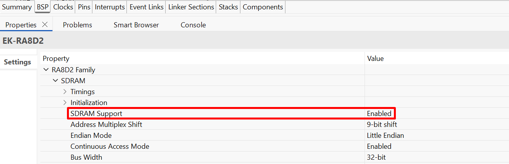

**Configuration Properties for using the Serial Terminal (UART):**

|   Configure Interrupt Event Path        |   Default Value   |   Used Value   |   Reason   |
|-----------------------------------------|-------------------|----------------|------------|
| configuration.xml > Interrupts > Interrupts Configuration > New User Event > SCI > SCI8 > SCI8 ERI (Receive error) | empty | sci_b_uart_eri_isr | Assign the UART receive ISR (Receive error) to the interrupt vector table. |
| configuration.xml > Interrupts > Interrupts Configuration > New User Event > SCI > SCI8 > SCI8 RXI (Receive data full) | empty | sci_b_uart_rxi_isr | Assign the UART receive ISR (Receive data full) to the interrupt vector table. |
| configuration.xml > Interrupts > Interrupts Configuration > New User Event > SCI > SCI8 > SCI8 TEI (Transmit end) | empty | sci_b_uart_tei_isr | Assign the UART transfer ISR (Transfer end) to the interrupt vector table. |
| configuration.xml > Interrupts > Interrupts Configuration > New User Event > SCI > SCI8 > SCI8 TXI (Transmit data empty) | empty | sci_b_uart_txi_isr | Assign the UART transfer ISR (Transfer data empty) to the interrupt vector table. |

**Configure SCICLK in Clock Configuration**
|   Configure Clock path   |   Default Value   |   Used Value   |   Reason   |
|-----------------------------------------|-------------------|----------------|------------|
| configuration.xml > Clocks > Clocks Configuration | SCICLK Src:PLL2R | SCICLK Src:PLL2R | Enable operating clock for SCI module by PLL2R clock source. |

## API Usage ##
The table below lists the FSP provided API used at the application layer in this example project.

| API Name    | Usage                                                                          |
|-------------|--------------------------------------------------------------------------------|
| tx_event_flags_set | This API is used to set or clear event flags in an event flags group, depending upon the specified set option. |
| tx_event_flags_get | This API is used to retrieve event flags from the specified event flags group. |
| tx_thread_sleep | This API is used to cause the calling thread to suspend for the specified number of timer ticks. |
| fx_system_initialize | This API is used to initialize all the major FileX data structures. |
| fx_system_date_set | This API is used to set the system date as specified. |
| fx_system_time_set | This API is used to set the system time as specified. |
| fx_system_date_get | This API is used to retrieve the current system date. |
| fx_system_time_get | This API is used to retrieve the current system time. |
| fx_media_open | This API is used to open media for file access using the supplied I/O driver. |
| fx_media_format | This API is used to format the supplied media in a FAT 12/16/32 compatible manner based on the supplied parameters.|
| fx_media_extended_space_available | This API is used to get the available space size of the media. |
| fx_media_flush | This API is used to flush all cached sectors and directory entries of any modified files to the physical media. |
| fx_media_close | This API is used to close the specified media. |
| fx_directory_create | This API is used to create a subdirectory in the current default directory or in the path supplied in the directory name. |
| fx_directory_first_full_entry_find | This API is used to retrieve the first entry name in the default directory with full information. |
| fx_directory_next_full_entry_find | This API is used to retrieve the next entry name in the default directory with full information. |
| fx_directory_delete | This API is used to delete the specified directory. |
| fx_directory_information_get | This API is used to get a directory's entry information. |
| fx_file_create | This API is used to create the specified file in the default directory or in the directory path supplied with the file name. |
| fx_file_open | This API is used to open the specified file for either reading or writing. |
| fx_file_truncate | This API is used to truncate the size of the file to the specified size. |
| fx_file_write | This API is used to write bytes from the specified buffer, starting at the file's current position. |
| fx_file_date_time_set | This API is used to set the date and time of the specified file. |
| fx_file_seek | This API is used to position the internal file read/write pointer at the specified byte offset. |
| fx_file_read | This API is used to read bytes from the file and store them in the supplied buffer. |
| fx_file_delete | This API is used to delete the specified file. |
| fx_file_close | This API is used to close the specified file. |
| RM_FILEX_BLOCK_MEDIA_Open | This API is used to initialize callbacks and configure the FileX Block Media interface. |
| RM_FILEX_BLOCK_MEDIA_BlockDriver | This API is used to access block media device functions such as open, close, read, write, and control. |  

For using the Serial Terminal (UART):
| API Name    | Usage                                                                          |
|-------------|--------------------------------------------------------------------------------|
| R_SCI_B_UART_Open | This API is used to initialize the SCI UART module. |
| R_SCI_B_UART_Write | This API is used to perform a write operation. |
| R_SCI_B_UART_Close | This API is used to de-initialize the SCI UART module. |

## Verifying Operation ##
1. Import the example project.

    By default, the EP supports Serial Terminal for RA boards that support J-Link OB VCOM

    * Define USE_VIRTUAL_COM=1 macro in Project Properties -> C/C++ Build -> Settings -> Tool Settings -> Compiler -> Includes

    To use SEGGER J-Link RTT Viewer, please follow the instructions below:

    * Define USE_VIRTUAL_COM=0 macro in Project Properties -> C/C++ Build -> Settings -> Tool Settings -> Compiler -> Includes

2. Generate, and build the example project.
3. Before running the example project, make sure hardware connections are done.
4. Connect the RA MCU debug port to the host PC via a Type-C USB cable.
5. Open a Serial Terminal application on the host PC and connect to the COM Port provided by the J-Link on-board or open J-Link RTT Viewer (In case the user selected SEGGER J-Link RTT Viewer or RA boards do not support J-Link OB VCOM).
   * Note: For using the Serial Terminal:
        * Please ensure that the connection to the SEGGER J-Link RTT Viewer has been terminated.
        * The COM port is provided by the J-Link onboard, with a baud rate of 115200 bps, a data length of 8 bits, no parity check, one stop bit, and no flow control.
        * To echo back what was typed in Tera Term, the user needs to enable it through [Setup] -> [Terminal...] -> Check [Local echo].
6. Debug or flash the EP project to the RA board.
7. After the main menu is displayed on the terminal application, the user selects options to perform file system management as desired.
    * Type '1' and enter to format the media.
    * Type '2' and enter to create a new directory.
    * Type '3' and enter to get root directory properties.
    * Type '4' and enter to delete a directory.
    * Type '5' and enter to create an empty file.
    * Type '6' and enter to write a fixed content into a file.
    * Type '7' and enter to read the first 1 KB of content in a file.
    * Type '8' and enter to delete a file.

### The images below showcase the output on the Serial Terminal application (Tera Term) ###
The EP information:

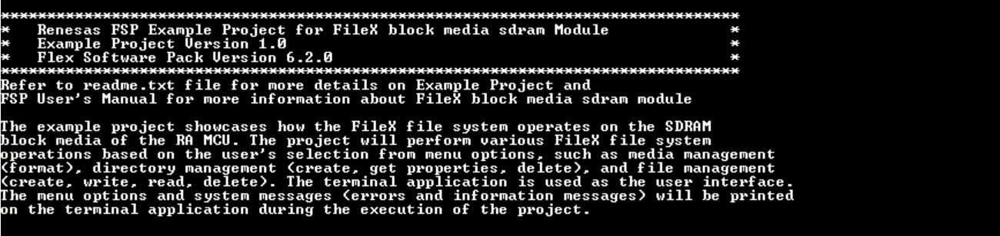

Media Operation:

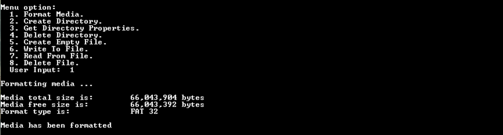

Directory Operation:

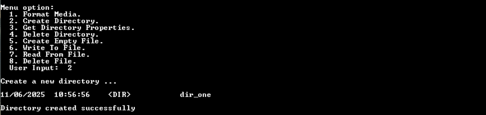

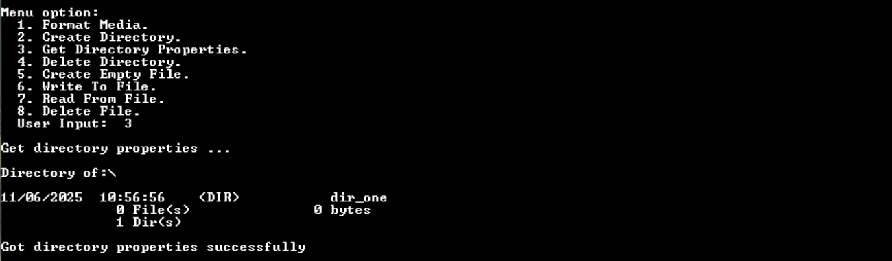

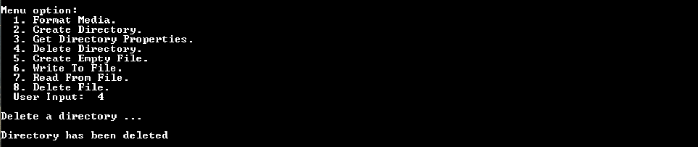

File Operation:

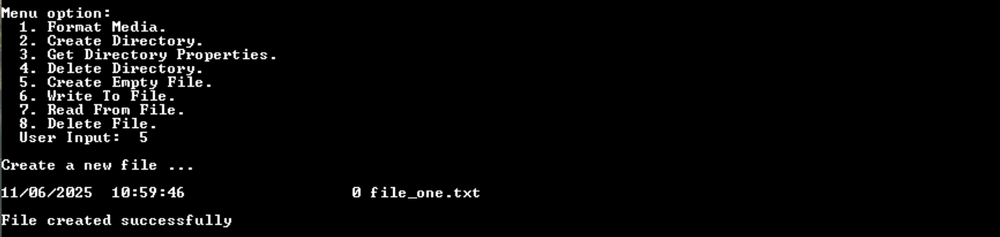

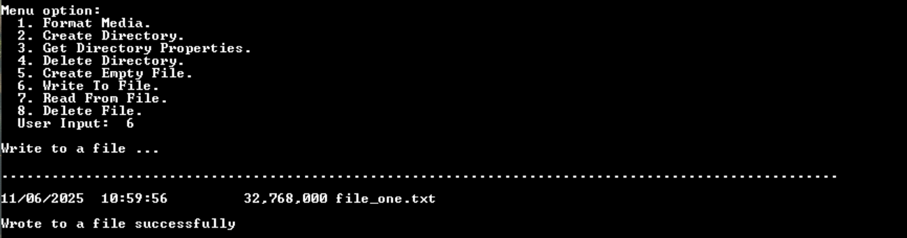

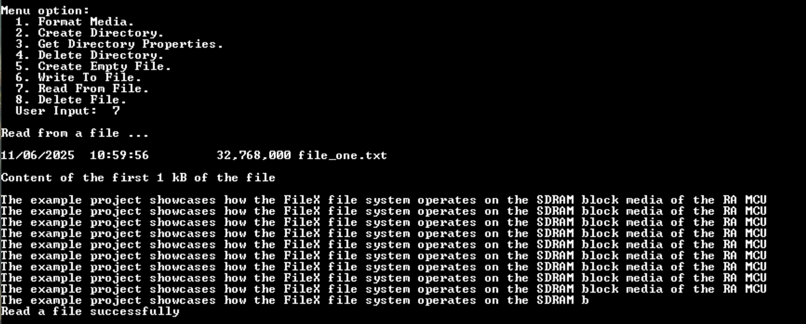

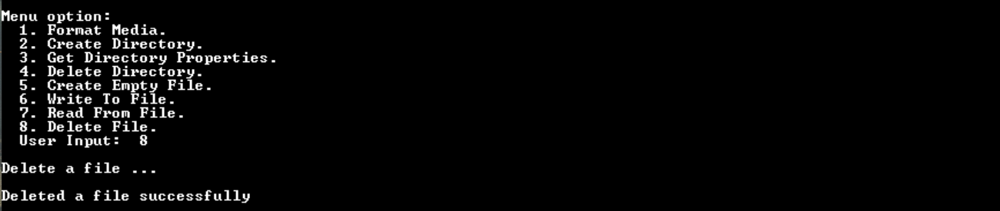

### The images below showcase the output on the SEGGER J-Link RTT Viewer ###
The EP information:

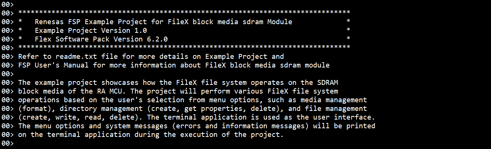

Media Operation:

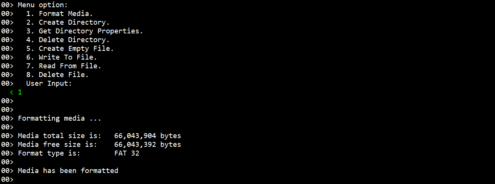

Directory Operation:

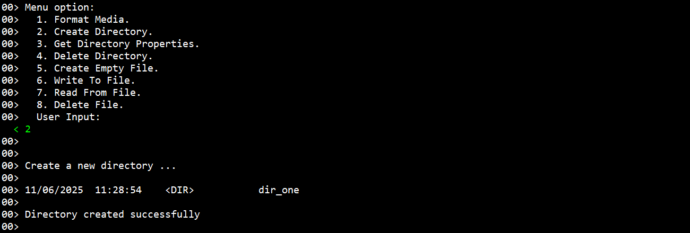

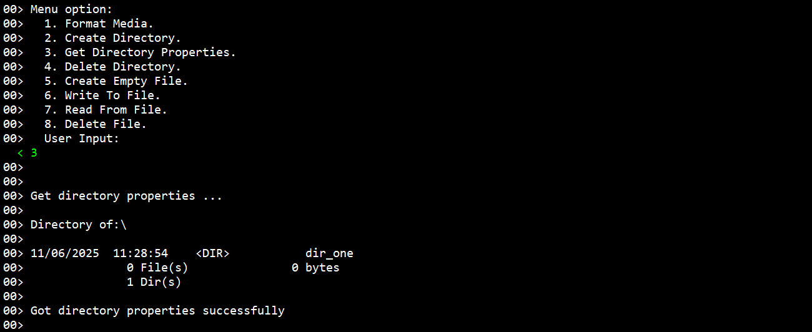

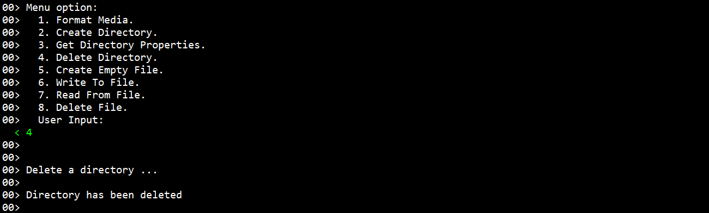

File Operation:

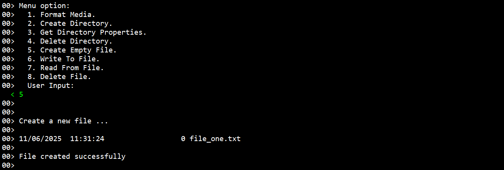

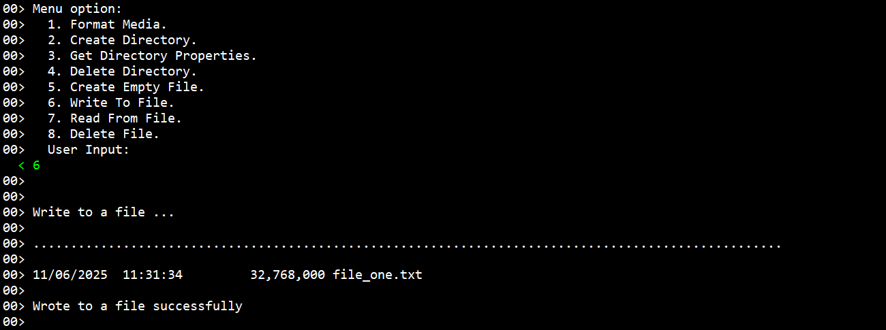

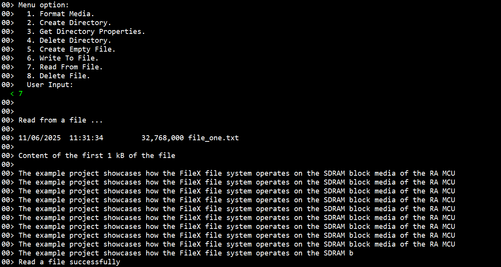

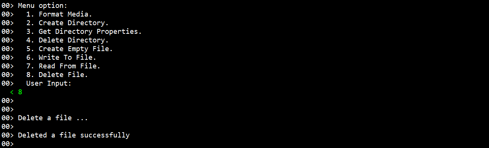
