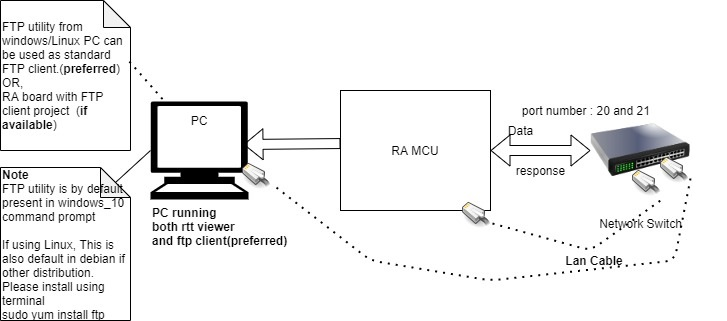
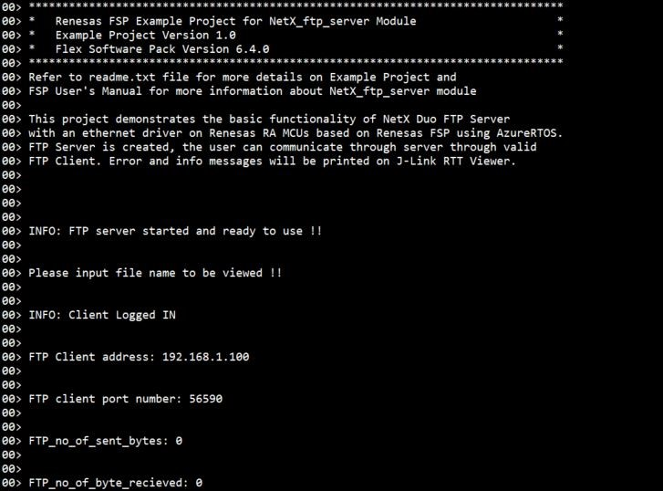
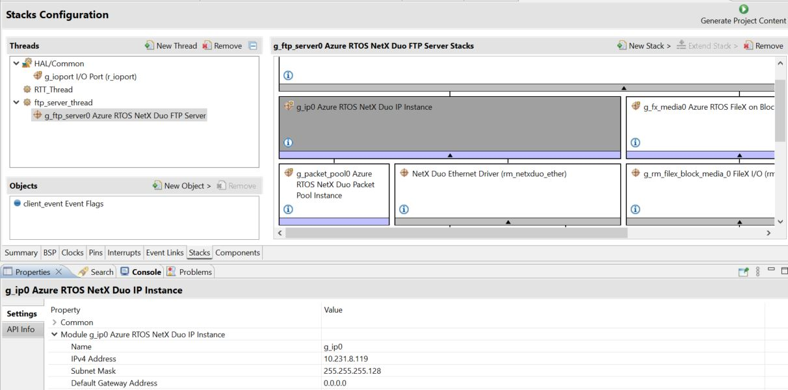
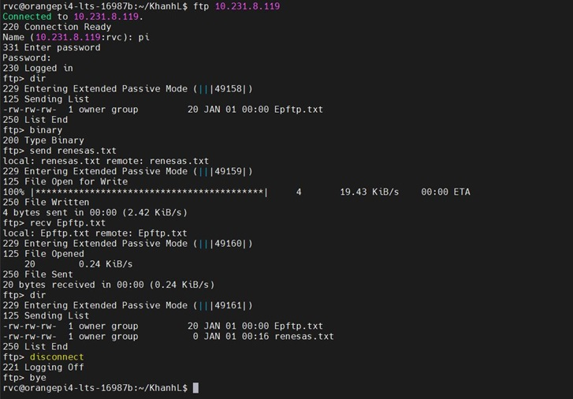
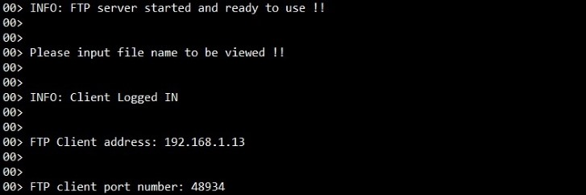
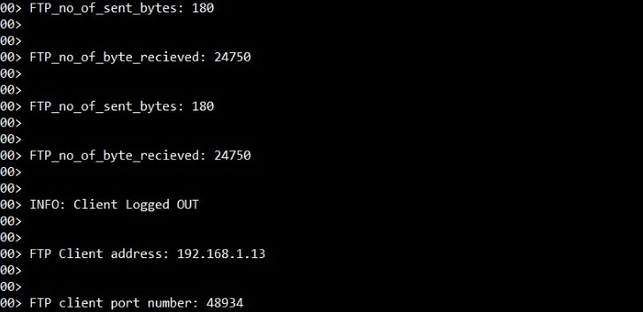

# Introduction #
The sample code accompanying this file shows the operation of a NetX Duo FTP Server on a RA MCU using Azure RTOS. In this sample code, a NetX Duo IP instance is created with the user-configured static IP address. The configuration of static IP address should be set as per the user's network environment through updating RA configurator property "g_ftp_server0->g_ip0 NetX DUO IP instance->IPv4 address, Subnet mask". The NetX stack is enabled for TCP, ICMP, ARP. FTP server utilizes the reliable Transmission Control Protocol (TCP) services to perform its content transfer function. FTP Server creates its packet pool based on the settings minimum packet payload size and number of packets in the packet pool.

When the FTP server is created and started, the NetX Duo FTP server creates a new TCP connection with the FTP client upon its connect requests and begins the FTP session. The status messages, client's info (like IP address, port number), errors (if any) are displayed on the J-Link RTT Viewer.

NetX Duo FTP Server is compliant with [RFC1579](https://datatracker.ietf.org/doc/html/rfc1579), [RFC959](https://datatracker.ietf.org/doc/html/rfc959), and related RFCs.

Please refer to the [Example Project Usage Guide](https://github.com/renesas/ra-fsp-examples/blob/master/example_projects/Example%20Project%20Usage%20Guide.pdf) for general information on example projects and [readme.txt](./readme.txt) for specifics of the operation.

## Required Resources ##
To build and run the FTP server example project, the following resources are needed.

### Software ###
  * Renesas Flexible Software Package (FSP): Version 6.5.0
  * e2 studio: Version 2026-04.2
  * SEGGER J-Link RTT Viewer: Version 9.42
  * LLVM Embedded Toolchain for ARM: Version 21.1.1

### Hardware ###
* Supported RA boards: EK-RA6M3, EK-RA6M4, EK-RA6M5, EK-RA8M1, EK-RA8D1, EK-RA8D2.
  * 1 x Renesas RA board.
  * 1 x Type-C USB cable for programming and debugging.
  * 2 x Ethernet/LAN cables (Ethernet cable CAT5/6).
  * 1 x Ethernet switch.
  * 1 x Linux machine, Raspberry Pi, or Windows PC to run as FTP client.

### Hardware Connections ###
* For EK-RA6M3, EK-RA6M4, EK-RA6M5, EK-RA8M1, EK-RA8D1:
  * Connect USB debug port of the RA board to the host machine via a micro USB cable.
  * Connect ethernet port of the RA board to Ethernet switch/router via a LAN cable.
  * Connect ethernet port of the Linux machine/Raspberry Pi to ethernet switch/router via a LAN cable.
  * For EK-RA8M1, the user must remove jumper J61 to enable ethernet B.

* For EK-RA8D1, the user must set the configuration switches (SW1) as below to avoid potential failures:
  * CAUTION: Do not enable SW1-4 and SW1-5 together. 

    | SW1-1 PMOD1 | SW1-2 TRACE | SW1-3 CAMERA | SW1-4 ETHA | SW1-5 ETHB | SW1-6 GLCD | SW1-7 SDRAM | SW1-8 I3C |
    |-------------|-------------|--------------|------------|------------|------------|-------------|-----------|
    | OFF | OFF | OFF | OFF | ON | OFF | OFF | OFF |

* For EK-RA8D2: Set the configuration switches (SW4) as below to avoid potential failures.
	| SW4-1 PMOD1 | SW4-2 PMOD1 | SW4-3 Octo-SPI | SW4-4 Arduino/mikroBUS | SW4-5 I3C | SW4-6 MIPI | SW4-7 USBFS | SW4-8 USBHS |
	|-------------|-------------|----------------|------------------------|-----------|------------|-------------|-------------|
	|     OFF     |     OFF     |      OFF       |          OFF           |    OFF    |    OFF     |     OFF     |     OFF     |

  * Connect USB debug port of the RA board to the host machine via a Type-C USB cable.
  * Connect ethernet port (J15) of the RA board to Ethernet switch/router via a LAN cable.
  * Connect ethernet port of the Linux machine/Raspberry Pi to Ethernet switch/router via a LAN cable.

## Related Collateral References ##
The following documents can be referred to for enhancing your understanding of the operation of this example project:
- [FSP User Manual on GitHub](https://renesas.github.io/fsp/)
- [FSP Known Issues](https://github.com/renesas/fsp/issues)

# Project Notes #

## System Level Block Diagram ##

## FSP Modules Used ##
List all the various modules that are used in this example project. Refer to the FSP User Manual for further details on each module listed below.

| Module Name | Usage  | Searchable Keyword (using New Stack > Search) |
|-------------|-----------------------------------------------|-----------------------------------------------|
| NetX Duo FTP Server | FTP Server module is used to provide data transfer with a valid FTP client machine. | FTP |

## Module Configuration Notes ##
This section describes FSP Configurator properties that are important or different from those selected by default. 

|   Module Property Path and Identifier   |   Default Value   |   Used Value   |   Reason   |
| :-------------------------------------: | :---------------: | :------------: | :--------: |
| configuration.xml > BSP > Properties > Settings > Property > RA Common > Heap size (bytes) | 0 | 0x400 | Heap size is required for standard library functions to be used as per FSP requirements. |
| configuration.xml > Stacks > Threads > RTT_Thread > Properties > Settings > Property > Thread > Priority | 1 | 3 | RTT thread priority is lowered to allow the FTP Server and IP threads to process incoming packets at the fastest rate possible. |
| configuration.xml > Stacks > Threads > ftp_server_thread > Properties > Settings > Property > Thread > Priority | 1 | 2 | Priority of the Application threads generally given lower priority compared to system services threads. |
| configuration.xml > Stacks > Threads > ftp_server_thread > Properties > Settings > Property > Thread > Stack size | 1024 | 2048 | Updated to handle thread its worst-case function call nesting and local variable usage. |
| configuration.xml > Stacks > Threads > ftp_server_thread > g_fx_media0 Azure RTOS FileX on Block Media > Properties > Settings > Property > Module g_fx_media0 Azure RTOS FileX on Block Media > Total Sectors | 65536 | 32 | Number of total sectors is updated as per on board OSPI flash IC. |
| configuration.xml > Stacks > Threads > ftp_server_thread > g_fx_media0 Azure RTOS FileX on Block Media > Properties > Settings > Property > Module g_fx_media0 Azure RTOS FileX on Block Media > Bytes per Sector | 512 | 4096 | Number of total bytes in a sector is updated as per on board OSPI flash IC. |
| configuration.xml > Stacks > Threads > ftp_server_thread > g_fx_media0 Azure RTOS FileX on Block Media > Properties > Settings > Property > Module g_fx_media0 Azure RTOS FileX on Block Media > Working media memory size | 512 | 4096 | Working media memory must be greater or equal to the size of one sector. |

## API Usage ##

The table below lists the DHCPv4 Server API used at the application layer by this example project.

| API Name    | Usage                                                                          |
|-------------|--------------------------------------------------------------------------------|
| nx_ftp_server_start | This API is used to start FTP server. |
| nxd_ftp_server_create | This API is used to create FTP server. |

## Verifying Operation ##
* Import, follow the Special Topic, build and debug the EP (see section Starting Development of **FSP User Manual**). After running the EP, open the RTT Viewer to see the output.
* Before running the example project, make sure to set up hardware connections as mentioned in the **[Hardware Connections](#hardware-connections)** section. The image below showcases the hardware connection setup required for running the EP:

* The image below showcases the output on J-Link RTT Viewer:

## Special Topics ##
### Running tips ###
* Presuming all necessary hardware connections done, the user should connect their PC/Laptop on the same network environment similar to the RA board network environment.
* The user needs to update the IP address of RA board as per their network environment through "g_ip0 NetX Duo IP Instance" stack as shown in the image below using RA configuration tool. This EP is built and tested with default properties as shown in the image below.

* The user needs to open command prompt (on Windows PC) or Terminal (On Linux machine/raspberry pi) and use FTP utility for FTP client operations. (FTP utility is platform independent and available by default on both platforms)
* One sample usage is shown in the image below.

* After running EP, the user can log in through command prompt (on Windows PC) or Terminal (On Linux machine/raspberry pi). RTT Viewer after the client logs in to FTP server host by board show in the image below.

* RTT Viewer after the client sends, receives file, and logs out show in the image below.

* For board using OSPI Flash Memory (EK-RA8D1, EK-RA8M1, EK-RA8D2):
  * Please erase OSPI Flash Memory before run the EP.
  * The user can use J-Flash Lite to erase OSPI Flash memory.
* There is no authentication. Just press Enter for both Username and password required by FTP utility as shown in the above image.
* The FTP port (port 20 and port 21) might be blocked by Firewall, please check and allow these ports in the Firewall configuration.
* If EP is not working in terms of network connection/ip, please re-check [readme.txt](./readme.txt) and RA configuration property "g_ftp_server0->g_ip0 NetX DUO IP instance->IPv4 address, Subnet mask".
* Client needs to be in active mode and the transfer mode needs to be configured as binary.
