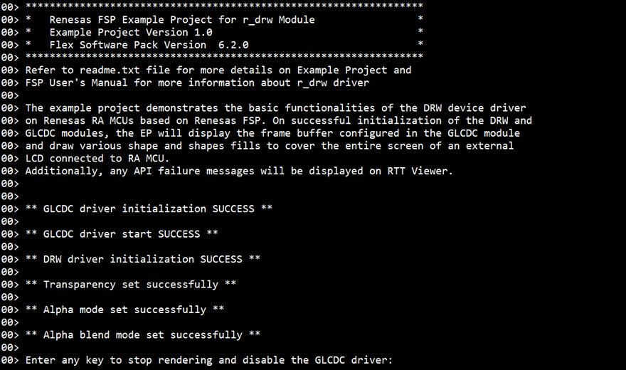
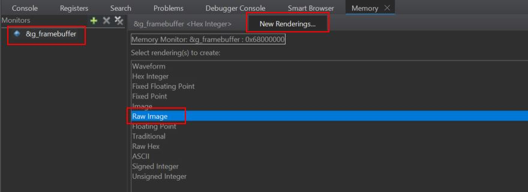
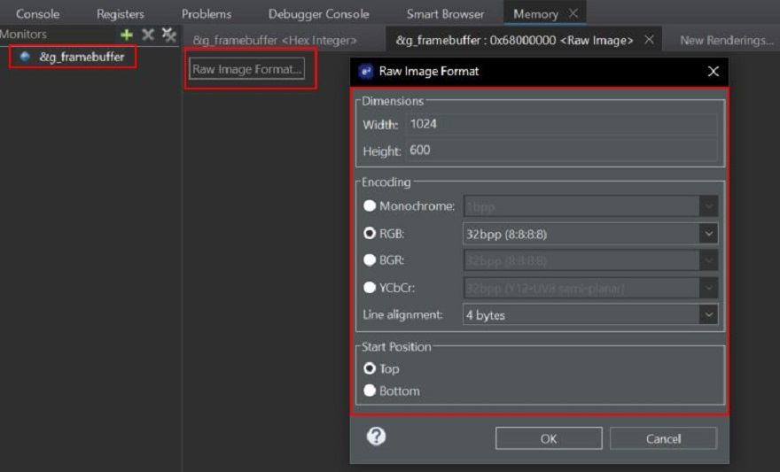

# Introduction #

This example project demonstrates the basic functionalities of 2D Drawing Engine (DRW) device driver on Renesas RA MCUs based on Renesas FSP. On successful initialization of DRW and GLCDC modules, the EP will draw various shapes and shape fills across the LCD screen, as well as use Alpha Blending on the images rendered to cover the entire screen of an external LCD connected to the RA MCU. API failure messages will be displayed on RTT Viewer.

Please refer to the [Example Project Usage Guide](https://github.com/renesas/ra-fsp-examples/blob/master/example_projects/Example%20Project%20Usage%20Guide.pdf)
for general information on example projects and [readme.txt](./readme.txt) for specifics of operation.

## Required Resources ##
To build and run the DRW example project, the following resources are needed:

### Software ###
* Renesas Flexible Software Package (FSP): Version 6.3.0
* e2 studio: Version 2025-12
* SEGGER J-Link RTT Viewer: Version 8.92
* LLVM Embedded Toolchain for ARM: Version 21.1.1

Refer to software requirements mentioned in [Example Project Usage Guide](https://github.com/renesas/ra-fsp-examples/blob/master/example_projects/Example%20Project%20Usage%20Guide.pdf)

### Hardware ###
* Supported RA boards: EK-RA6M3G, EK-RA8D1, EK-RA8E2, EK-RA8P1, EK-RA8D2.
	* 1 x Renesas RA Board.
	* 1 x Graphics Expansion Board:
		* For EK-RA6M3G, EK-RA8D1: Graphics Expansion Board (P/N: RTK7EK6M3B00001BU).
		* For EK-RA8D1: MIPI Graphics Expansion Board.
		* For EK-RA8E2: Graphics Expansion Board (P/N: RTKAPPLCDPS02001BE).
		* For EK-RA8P1, EK-RA8D2: Graphics Expansion Board (P/N: RTKLCDPAR1S00001BE).
	* 1 x Type-C USB cable.

Refer to [readme.txt](./readme.txt) for information on how to connect the hardware.

## Related Collateral References ##
The following documents can be referred to for enhancing your understanding of 
the operation of this example project:
- [FSP User Manual on GitHub](https://renesas.github.io/fsp/)
- [FSP Known Issues](https://github.com/renesas/fsp/issues)

# Project Notes #

## System Level Block Diagram ##

For EK-RA8D1:

## FSP Modules Used ##
List all the various modules that are used in this example project. Refer to the FSP User Manual for further details on each module listed below.

| Module Name | Usage  | Searchable Keyword (using New Stack > Search) |
|-------------|-----------------------------------------------|-----------------------------------------------|
| D/AVE 2D Port Interface (r_drw) | This module is a port of D/AVE 2D.| r_drw |
| Graphics LCD (r_glcdc) | With GLCDC driver, the user can reposition, alpha blend, color correct, dither and convert to and from a wide variety of pixel formats.| r_glcdc |

For EK-RA8D1:
| Module Name | Usage  | Searchable Keyword (using New Stack > Search) |
|-------------|-----------------------------------------------|-----------------------------------------------|
| D/AVE 2D Port Interface (r_drw) | This module is a port of D/AVE 2D.| r_drw |
| Graphics LCD (r_glcdc) | With GLCDC driver, the user can reposition, alpha blend, color correct, dither and convert to and from a wide variety of pixel formats.| r_glcdc |
| MIPI Display (r_mipi_dsi)| MIPI DSI is used to get data from GLCDC and transmit it to MIPI PHY. | r_mipi_dsi |
| MIPI Physical Layer (r_mipi_phy)| MIPI PHY is used to send data to MIPI LCD. | r_mipi_phy |

## Module Configuration Notes ##
This section describes FSP Configurator properties that are important or different from those selected by default. 

|   Module Property Path and Identifier   |   Default Value   |   Used Value   |   Reason   |
| :-------------------------------------: | :---------------: | :------------: | :--------: |
|   configuration.xml > BSP > Properties > Settings > Property > RA Common > Main stack size (bytes)  |  0x400   | 0x1000  |  Main stack size is required for DRW library functions to be used. |
|   configuration.xml > BSP > Properties > Settings > Property > RA Common > Heap size (bytes)  |  0   | 0x1500  |  Heap size is required for DRW library functions to be used. |
|   configuration.xml > Stacks > g_display Graphics LCD (r_glcdc) > Properties > Setting > Property > Module g_display Graphics LCD (r_glcdc) > Interrupts  > Callback Function | NULL | glcdc_callback | Define user callback function. |

Please refer GLCDC EP notes for GLCDC stack related properties.

For EK-RA8D1:

|   Module Property Path and Identifier   |   Default Value   |   Used Value   |   Reason   |
| :-------------------------------------: | :---------------: | :------------: | :--------: |
|   configuration.xml > Stacks > g_display Graphics LCD (r_glcdc) > Properties > Setting > Property > Module g_display Graphics LCD (r_glcdc) > Input  > Graphics Layer 1 > General > Color format | RGB56 (16-bit) | RGB888 (32-bit) | To use 32 bits Color format input. |
|   configuration.xml > Stacks > g_display Graphics LCD (r_glcdc) > Properties > Setting > Property > Module g_display Graphics LCD (r_glcdc) > Output  > Format > Color format | 24bits RGB888 | 24bits RGB888 | To use 32bits Color format. |
|   configuration.xml > Stacks > g_mipi_dsi0 MIPI Display (r_mipi_dsi) > Properties > Setting > Property > Module g_mipi_dsi0 MIPI Display (r_mipi_dsi) > Sequence Channel 1 Interrupt Enable > Interrupts  > Callback Function | mipi_dsi0_callback | mipi_dsi_callback | Define user callback function. |

For EK-RA8E2, EK-RA8P1, EK-RA8D2:

|   Module Property Path and Identifier   |   Default Value   |   Used Value   |   Reason   |
| :-------------------------------------: | :---------------: | :------------: | :--------: |
|   configuration.xml > Stacks > g_display Graphics LCD (r_glcdc) > Properties > Setting > Property > Module g_display Graphics LCD (r_glcdc) > Input  > Graphics Layer 1 > General > Color format | RGB56 (16-bit) | RGB888 (32-bit) | To use 32 bits Color format input. |
|   configuration.xml > Stacks > g_display Graphics LCD (r_glcdc) > Properties > Setting > Property > Module g_display Graphics LCD (r_glcdc) > Output  > Format > Color format | 24bits RGB888 | 24bits RGB888 | To use 32bits Color format. |

## API Usage ##

The table below lists the GLCDC and DRW APIs used at the application layer in this example project.

| API Name    | Usage                                                                          |
|-------------|--------------------------------------------------------------------------------|
|R_GLCDC_Open| This API is used to open GLCDC module. |
|R_GLCDC_Start| This API is used to start GLCDC module. |
|R_GLCDC_BufferChange| This API is used to changes the framebuffer pointer. |
|R_GLCDC_Stop| This API is used to stop GLCDC module. |
|R_GLCDC_Close| This API is used to close GLCDC module. |
|d2_opendevice| This API is used to creates a new device handle. |
|d2_inithw| This API is used to initialize D/AVE2D module. |
|d2_flushframe| This API is used to wait for current rendering to end.|
|d2_framebuffer| This API is used to defines framebuffer's memory and layout. |
|d2_setalpha| This API is used to set alpha value. |
|d2_setalphamode| This API is used to choose alpha source.|
|d2_setblendmode| This API is used to choose blendmode for RGB.|
|d2_clear| This API is used to clear the framebuffer. |
|d2_setantialiasing| This API is used to globally disable or enable antialiasing. |
|d2_setlinecap| This API is used to specify line end style. |
|d2_setlinejoin| This API is used to specify polyline connection style. |
|d2_selectrendermode| This API is used to set render mode. |
|d2_setcolor| This API is used to set desired color registers. |
|d2_rendercircle| This API is used to render a circle or circle ring. |
|d2_rendertri| This API is used to render a triangle. |
|d2_renderbox| This API is used to render a rectangle. |
|d2_renderline| This API is used to render a wide line. |
|d2_endframe| This API is used to mark the end of a frame. |
|d2_startframe| This API is used to beginning of a frame. |
|d2_deinithw| This API is used to unlink hardware currently bound by specified device. |
|d2_closedevice| This API is used to close/destroy the device handler. |
|d2_geterrorstring| This API is used to return string with human readable error description. |

For EK-RA8D1: MIPI API additional used at the application layer in this example project.
| API Name    | Usage                                                                          |
|-------------|--------------------------------------------------------------------------------|
|R_MIPI_DSI_Command| This API is used to send a command to the peripheral device. |

## Verifying operation ##
Import, Build and Debug the EP (see section Starting Development of [FSP User Manual](https://renesas.github.io/fsp/)). After running the EP, open the RTT Viewer to view status or
check any error messages.
The user can view the rendered images and animation on the LCD screen.
The animating output can be seen in LCD screen.
Refer the below steps for hardware connections:
* Connect RA MCU debug port to the host PC via a Type-C USB cable.
* Connect LCD to the RA board.

The output on J-Link RTT Viewer:

The output on J-Link RTT Viewer after enter key to stop rendering and disable the GLCDC driver:  

  

The animating shapes can be captured on Graphical LCD and memory monitor of e2studio when EP is paused as shown below respectively:

To view the "Raw Image" in memory monitor of the e2studio IDE using the address of g_framebuffer please follow step as below:  
- On Debug the project EP by e2studio IDE, open memory view.

- Add image buffer under memory monitor.

- Open Raw Image Rendering 

- Set Raw Image Format:
	- Width as 1024
	- Height as 600
	- Encoding to RGB: 32bpp (8:8:8:8)
	- Line alignment to 4 bytes
	- Start Position to Top  

## Special Topics ##
In this example project, the BLEN (backlight enable) pin is set to GPIO mode and is initially high in the Pin configuration.
However, using the BLEN pin as a PWM output function (GPT's GTIOCA or GTIOCB) is recommended, to control the brightness of the LCD backlight and reduce power consumption.
| Board            |BLEN pin         | 
|------------------|-----------------|
| EK-RA6M3G        | P603            |
| EK-RA8D1         | P404            |
| EK-RA8E2         | P404            |
| EK-RA8P1         | P514            |
| EK-RA8D2         | P514            |
