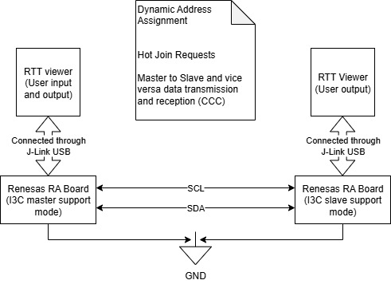
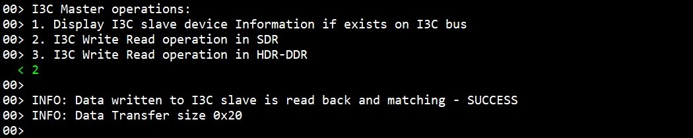

**Note :** MD file is common for both i3c_master and i3c_slave EPs.

# Introduction # 
The sample code accompanying this file shows the operation of the I3C Driver on Renesas RA MCUs based on Renesas FSP. The I3C master on RA board demonstrates operations associated with an I3C slave running on another RA board. Once initialization is successful, I3C Master device assigns slave address to I3C slave device through DAA (dynamic address assignment) using I3C common command code (CCC). Once Dynamic Address Assignment is completed, the Master EP performs write/read operations, and displays slave device information based on user input. If the on-board switch is pressed on the slave side, it will initiate an IBI transfer request. The application status messages will be displayed in the J-Link RTT Viewer and on-board LEDs. Refer **[LED Status](#led-status)** section for LED observation.

Note: EK-RA8D1, EK-RA8P1, EK-RA8D2 boards support I3C HDR-DDR mode. The Master EP can perform write/read operations both in the SDR mode and HDR-DDR mode.

Please refer to the [Example Project Usage Guide](https://github.com/renesas/ra-fsp-examples/blob/master/example_projects/Example%20Project%20Usage%20Guide.pdf) 
for general information on example projects and [readme.txt](./readme.txt) for specifics of operation.

## Required Resources ## 
To build and run the I3C example project, the following resources are needed.

### Software ###
* Renesas Flexible Software Package (FSP): Version 6.3.0
* e2 studio: Version 2025-12
* SEGGER J-Link RTT Viewer: Version 8.92
* LLVM Embedded Toolchain for ARM: Version 21.1.1

Refer to the software required section in [Example Project Usage Guide](https://github.com/renesas/ra-fsp-examples/blob/master/example_projects/Example%20Project%20Usage%20Guide.pdf)

### Hardware ###
* Supported RA boards: EK-RA2E2, EK-RA4E2, EK-RA6E2, MCK-RA4T1, MCK-RA6T3, EK-RA8M1, EK-RA8D1, EK-RA4L1, EK-RA2L2, EK-RA8P1, EK-RA8D2.
	* 2 x Renesas RA boards.
	* 2 x Type-C USB cables for programming and debugging.
	* 5 x Jumper wires.
	* 1 x Resistor (1 kΩ, 3.9 kΩ, or 4.7 kΩ) for the SDA pull-up.
		* EK-RA8P1, EK-RA8D2: No external 3.3 V pull-up resistor is required.
		* EK-RA8M1, EK-RA8D1, EK-RA4L1, EK-RA2L2: Use a 1 kΩ resistor.

### Hardware Connections ###
* Connect USB debug ports of the two RA boards to USB ports of the host PC via two USB cables.

* The jumper wires are required to establish loop back connection along I3C lines across the board with pins as mentioned below:  
	For EK-RA2E2:

		Master Board                         Slave Board
		-------------                        ------------
		SDA0 P401                ---->       SDA0 P401
		SCL0 P400                ---->       SCL0 P400
		Common GND

	For EK-RA4E2, EK-RA6E2:

		Master Board                         Slave Board
		-------------                        ------------
		I3C_SDA P101             ---->       I3C_SDA P101
		I3C_SCL P100             ---->       I3C_SCL P100
		Common GND

	For MCK-RA4T1, MCK-RA6T3:

		Master Board                         Slave Board
		-------------                        ------------
		I3C_SDA P101 (TP-16)     ---->       I3C_SDA P101 (TP-16)
		I3C_SCL P100 (TP-17)     ---->       I3C_SCL P100 (TP-17)
		Common GND

	For EK-RA8M1:

		Master Board                         Slave Board
		-------------                        ------------
		I3C_SDA0 (J27:2)          ---->      I3C_SDA0 (J27:2)
		I3C_SCL0 (J27:1)          ---->      I3C_SCL0 (J27:1)
		Common GND
		
	For EK-RA8D1:

		Master Board                         Slave Board
		-------------                        ------------
		I3C_SDA0 P401             ---->      I3C_SDA0 P401
		I3C_SCL0 P400             ---->      I3C_SCL0 P400
		Common GND

    For EK-RA4L1:

		Master Board                         Slave Board
		-------------                        ------------
		I3C_SDA0 P401 (J4:5)      ---->      I3C_SDA0 P401 (J4:5)
		I3C_SCL0 P400 (J4:6)      ---->      I3C_SCL0 P400 (J4:6)
		Common GND

	For EK-RA2L2:

		Master Board                         Slave Board
		-------------                        ------------
		I3C_SDA0 P401 (J1:9)      ---->      I3C_SDA0 P401 (J1:9)
		I3C_SCL0 P400 (J1:8)      ---->      I3C_SCL0 P400 (J1:8)
		Common GND

	For EK-RA8P1, EK-RA8D2:

		Master Board                         Slave Board
		-------------                        ------------
		I3C_SDA0 P401 (J24:9)     ---->      I3C_SDA0 P401 (J24:9)
		I3C_SCL0 P400 (J24:10)    ---->      I3C_SCL0 P400 (J24:10)
		Common GND

### Hardware Configurations ###

* For EK-RA8M1: Install jumper J61 to enable I3C.

* For EK-RA8D1: Set the configuration switches (SW1) as below to avoid potential failures.

	| SW1-1 PMOD1 | SW1-2 TRACE | SW1-3 CAMERA | SW1-4 ETHA | SW1-5 ETHB | SW1-6 GLCD | SW1-7 SDRAM | SW1-8 I3C |
	|-------------|-------------|--------------|------------|------------|------------|-------------|-----------|
	| OFF | OFF | OFF | OFF | OFF | OFF | OFF | OFF |

* For EK-RA4L1: The user needs to turn OFF S4-5 to enable I3C function.

* For EK-RA8P1: The user needs to turn ON SW4-5 to use P401, P400 on J24 for I3C function.

* For EK-RA8D2: The user needs to turn ON S4-5 to use P401, P400 on J24 for I3C function.

## Related Collateral References ##
The following documents can be referred to for enhancing your understanding of the operation of this example project:
- [FSP User Manual on GitHub](https://renesas.github.io/fsp/)
- [FSP Known Issues](https://github.com/renesas/fsp/issues)

# Project Notes #

## System Level Block Diagram ##
 High level block diagram
  

## FSP Modules Used ##
List of important modules that are used in this example project. Refer to the FSP User Manual for further details on each module listed below.

| Module Name | Usage | Searchable Keyword  |
|-------------|-----------------------------------------------|-----------------------------------------------|
|I3C | Driver for the I3C peripheral to demonstrate Master and Slave mode. | i3c |
|AGT | Driver for the AGT peripheral is used for demonstrating timeout condition. | agt |
|ICU | The external_irq interface is for configuring interrupts to fire when a trigger condition is detected on an external IRQ pin. | icu |

## Module Configuration Notes ##
This section describes FSP Configurator properties which are important or different than those selected by default. 

**I3C Master Configuration properties**
|   Module Property Path and Identifier   |   Default Value   |   Used Value   |   Reason   |
| :-------------------------------------: | :---------------: | :------------: | :--------: |
| configuration.xml > Stacks > g_i3c0 I3C (r_i3c) > Properties > Settings > Property > Common > Slave Support | Enabled | Disabled | As only master mode is required, disable slave support to decrease code size. |
| configuration.xml > Stacks > g_i3c0 I3C (r_i3c) > Properties > Settings > Property > Module g_i3c0 I3C (r_i3c) > Bitrate Settings > Standard Mode > Push-Pull > Logic High Period (ns) | 167 | 45 | Set 45ns as the Logic High Period of SCL during Standard Mode Push-Pull transfers. |
| configuration.xml > Stacks > g_i3c0 I3C (r_i3c) > Properties > Settings > Property > Module g_i3c0 I3C (r_i3c) > Bitrate Settings > Standard Mode > Push-Pull > Frequency | 3400000 | 12500000 | Set 12.5MHz as the frequency of SCL during Standard Mode Push-Pull transfers. |
| configuration.xml > Stacks > g_i3c0 I3C (r_i3c) > Properties > Settings > Property > Module g_i3c0 I3C (r_i3c) > Master Mode > ACK Hot-Join Requests | Disabled | Enabled | Enable Hot-Join Requests acknowledgment. If a Hot-Join event is received, then the master will initiate the dynamic address assignment. |
| configuration.xml > Stacks > g_i3c0 I3C (r_i3c) > Properties > Settings > Property > Module g_i3c0 I3C (r_i3c) > Master Mode > Notify Rejected Hot-Join Requests | Disabled | Enabled | Generate a callback when an IBI Hot-Join Request is rejected. |
| configuration.xml > Stacks > g_i3c0 I3C (r_i3c) > Properties > Settings > Property > Module g_i3c0 I3C (r_i3c) > Master Mode > Notify Rejected Mastership Requests | Disabled | Enabled | Generate a callback when an IBI Mastership Request is rejected. |
| configuration.xml > Stacks > g_i3c0 I3C (r_i3c) > Properties > Settings > Property > Module g_i3c0 I3C (r_i3c) > Master Mode > Notify Rejected Interrupt Requests | Disabled | Enabled | Generate a callback when an IBI Interrupt Request is rejected. |  
| configuration.xml > Stacks > g_i3c0 I3C (r_i3c) > Properties > Settings > Property > Module g_i3c0 I3C (r_i3c) > Device Type | Slave | Main Master | Set the role of the I3C instance on the I3C bus. |

**I3C Slave Configuration properties**
|   Module Property Path and Identifier   |   Default Value   |   Used Value   |   Reason   |
| :-------------------------------------: | :---------------: | :------------: | :--------: |
| configuration.xml > Stacks > g_i3c0 I3C (r_i3c) > Properties > Settings > Property > Common > Master Support | Enable | Disable | If only slave mode is required, disable master support to decrease code size. |
| configuration.xml > Stacks > g_i3c0 I3C (r_i3c) > Properties > Settings > Property > Module g_i3c0 I3C (r_i3c) > Slave Mode > Command Response Info > ENEC/DISEC > In-Band Interrupts | Disabled | Enabled | Enable the In-Band Interrupts capability, so that the slave should issue IBI requests. |
| configuration.xml > Stacks > g_i3c0 I3C (r_i3c) > Properties > Settings > Property > Module g_i3c0 I3C (r_i3c) > Slave Mode > Command Response Info > ENEC/DISEC > Hot-Join Requests | Disabled | Enabled | Enable the Hot-Join Requests capability, so that the slave should issue Hot-Join requests. |
| configuration.xml > Stacks > g_i3c0 I3C (r_i3c) > Properties > Settings > Property > Module g_i3c0 I3C (r_i3c) > Slave Mode > Command Response Info > SETMWL/GETMWL > Max Write Length | 65535 | 64 | Set the Device Max Write Length. In this EP, the write buffer is 64-byte. |
| configuration.xml > Stacks > g_i3c0 I3C (r_i3c) > Properties > Settings > Property > Module g_i3c0 I3C (r_i3c) > Slave Mode > Command Response Info > SETMRL/GETMRL > Max Read Length | 65535 | 64 | Set the Device Max Read Length. In this EP, the read buffer is 64-byte. |
| configuration.xml > Stacks > g_i3c0 I3C (r_i3c) > Properties > Settings > Property > Module g_i3c0 I3C (r_i3c) > Slave Mode > Command Response Info > SETMRL/GETMRL > Max IBI Payload Length | 0 | 32 | Set the Device Max IBI Payload Length. In this EP, the IBI read buffer is 32-byte. |
| configuration.xml > Stacks > Properties > Settings > Property > g_i3c0 I3C (r_i3c) > Module g_i3c0 I3C (r_i3c) > Slave Mode > Command Response Info > GETCAP/GETHDRCAP > HDR-DDR (Mode 0) | Disable | Enable | Enable HDR-DDR mode. |
| configuration.xml > Stacks > g_i3c0 I3C (r_i3c) > Properties > Settings > Property > Module g_i3c0 I3C (r_i3c) > Device Type | Slave | Slave | Set the role of the I3C instance on the I3C bus. |

The table below lists the FSP provided API used at the application layer by this example project.  
| API Name    | Usage                                                                          |
|-------------|--------------------------------------------------------------------------------|
| R_I3C_Open | This API is used to open the I3C instance. |
| R_I3C_DeviceCfgSet | This API is used to set the configuration for this device. |
| R_I3C_MasterDeviceTableSet | This API is used to configure an entry in the master device table. |
| R_I3C_Enable | This API is used to enable the I3C device. |
| R_I3C_IbiRead | This API is used to set the read buffer for storing received IBI data. Used in only master mode. |
| R_I3C_DynamicAddressAssignmentStart | This API is used to start the Dynamic Address Assignment Process. |
| R_I3C_Write | This API is used to set the write buffer for the transfer. In master mode, start the transfer. |
| R_I3C_Read | This API is used to set the read buffer for the transfer. In master mode, start the transfer. |
| R_I3C_SlaveStatusSet | This API is used to set the status returned to the master in response to a GETSTATUS command. |
| R_I3C_IbIWrite | This API is used to initiate an IBI write operation. Used in only Slave mode. |
| R_I3C_Close | This API is used to close the I3C instance. |
| R_AGT_Open | This API is used to initialize the AGT module instance. |
| R_AGT_Stop | This API is used to stop the timer. |
| R_AGT_Reset | This API is used to reset the counter value. |
| R_AGT_Start | This API is used to start timer. |
| R_AGT_Close | This API is used to close the AGT module instance. |
| R_ICU_ExternalIrqOpen | This API is used to prepare an external IRQ pin for operation. |
| R_ICU_ExternalIrqEnable | This API is used to enable external interrupt for specified channel at NVIC. |
| R_ICU_ExternalIrqClose | This API is used to close the external interrupt channel. |
| R_IOPORT_PinRead | This API is used to read the current status of GPIO Pin. |
| R_IOPORT_PinWrite | This API is used to write the value on GPIO Pin. |

## Verifying Operation ##
1. Import, generate and build both i3c_master and i3c_slave EPs in different workspaces. Before running the example project, make sure hardware connections are done on both master and slave sides.
2. Download i3c_master EP to one RA MCU and run the project.
3. Download i3c_slave EP to another RA MCU and run the project.
4. Now open one J-Link RTT Viewer and connect to the master board and open another/second J-Link RTT Viewer and connect it to slave board.
5. The user can perform Menu option operations on the master side and check corresponding results for the Master and Slave EPs on the respective J-Link RTT Viewer.
6. Also on slave side the user can perform IBI transfer request using Push button (SW2) and verify result on J-Link RTT Viewer. For MCK-RA4T1/MCK-RA6T3: The user needs to use Toggle switch (S1) instead.
   
   The images below showcase the I3C Master output on J-Link RTT Viewer:

   

   

   
 
   
 
   

   

   

   The images below showcase the I3C Slave output on J-Link RTT Viewer:

   

   

   

   

   

## LED Status ##
Below are the observations of the LED operation on slave board:
* When the Dynamic Address Assignment completes, the onboard LED1 status will be toggled.
* When the write transfer completes, the onboard LED2 status will be toggled.
* When the read transfer completes, the onboard LED3 status will be toggled.
* When the IBI write transfer completes, the onboard LED2 status will be toggled.

For MCK-RA4T1 and MCK-RA6T3, below are the observations of the LED operation on slave board:  
* When the Dynamic Address Assignment completes, both onboard LED1 and LED2 status will be toggled.
* When the write transfer completes, the onboard LED1 status will be toggled.
* When the read transfer completes, the onboard LED2 status will be toggled.
* When the IBI write transfer completes, the onboard LED1 status will be toggled.
