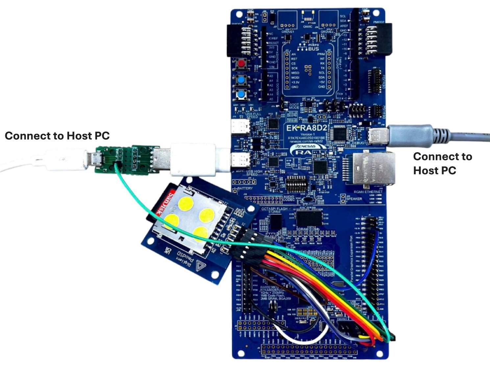
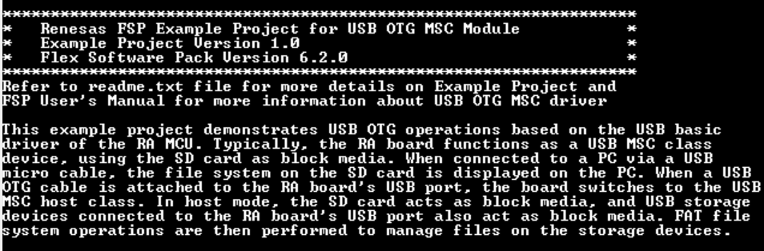
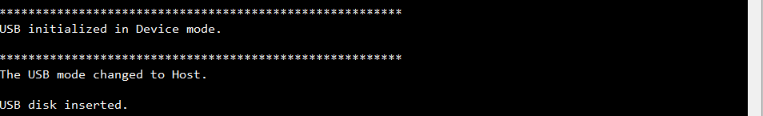
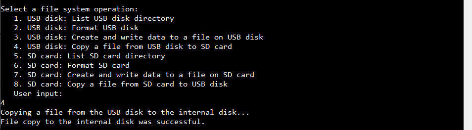
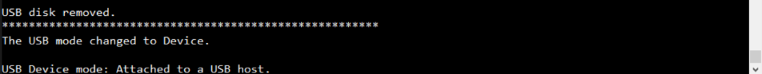
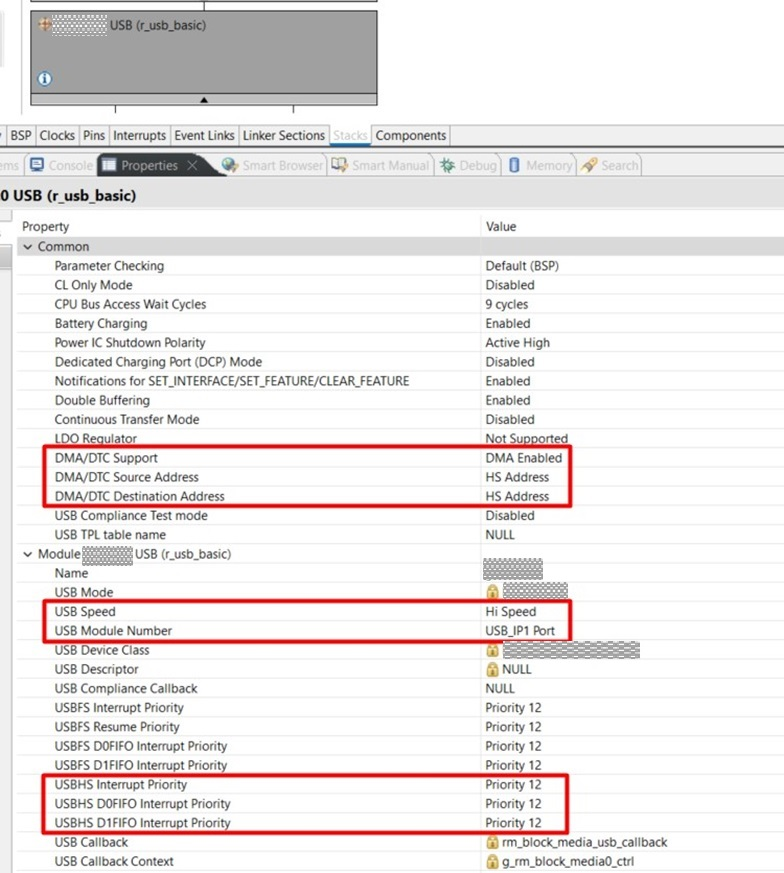

# Introduction #
This example project demonstrates the USB OTG (On-The-Go) functionality of the RA MCU, showcasing its ability to dynamically switch between USB host and device roles. The project will perform various USB operations using the USB basic driver. The RA board switches roles depending on the type of USB cable connected (standard or OTG).

In USB Device Mode, the RA board acts as a USB Mass Storage Class (MSC) device using an SD card as block media. When connected to a PC via a USB micro cable, the RA board enumerates as a USB storage device. The PC recognizes the board as external storage, allowing file management operations such as reading and writing data directly on the PC.

In USB Host Mode, the RA board operates as a USB MSC host when a USB OTG cable is connected to its USB port along with USB flash drive. In this setup, the RA board manages connected USB storage devices (e.g., USB flash drive) as peripheral. In this mode, the SD card and USB storage device function as separate file systems. The application also supports file system operations such as listing directories, creating files, and copying files between devices.

The terminal displays real-time updates of USB operations and system status. The available operations include:
* Listing directories and files on USB or SD media.
* Formatting USB disk or SD media.
* Creating files on USB disk or SD media.
* Copying files between USB disk and SD media.

Note: 
* Information can be displayed using either the SEGGER J-Link RTT Viewer or a serial terminal (UART) via J-Link OB VCOM, depending on availability. If J-Link OB VCOM is unsupported, the example project defaults to the SEGGER J-Link RTT Viewer. If supported, it defaults to the serial terminal (UART).
* To use the SEGGER J-Link RTT Viewer instead of the serial terminal, please refer to the instructions provided in the "Special Topic" section.
* RA boards that support J-Link OB VCOM: EK-RA8D1, EK-RA8P1, EK-RA8D2.

Please refer to the [Example Project Usage Guide](https://github.com/renesas/ra-fsp-examples/blob/master/example_projects/Example%20Project%20Usage%20Guide.pdf) for general information on example projects and [readme.txt](./readme.txt) for specifics of operation.

## Required Resources ## 
To build and run the USB OTG MSC example project, the following resources are needed.

### Software Requirements ###
* Renesas Flexible Software Package (FSP): Version 6.3.0
* e2 studio: Version 2025-12
* SEGGER J-Link RTT Viewer: Version 8.92
* LLVM Embedded Toolchain for ARM: Version 21.1.1
* Serial Terminal Console Application: Tera Term or a similar application

### Hardware Requirements ###
Supported RA boards: EK-RA8D1, EK-RA8P1, EK-RA8D2.  
* 1 x RA Board.
* 2 x USB cables:
    * For EK-RA8P1, EK-RA8D2: 1 x USB micro cable and 1 x USB Type-C cable.
    * Other boards: 2 x USB micro cables.
* 2 x USB OTG cables:
    * For EK-RA8P1, EK-RA8D2: 1 x USB micro OTG cable and 1 x USB Type-C OTG cable.
    * For other boards: 2 x USB micro OTG cables.
* 1 x Pmod SD: Full-sized SD Card Slot (e.g., https://digilent.com/shop/pmod-sd-full-sized-sd-card-slot/).
* 1 x Full-sized SD card or micro SD card with an adapter.
* 11 x Jumper cables (female to female).
* 1 x Custom USB pinout board (refer to the schematic design shown below).
* 1 x USB flash drive.
  
**The schematic design for the custom USB pinout board is shown below:**
* For EK-RA8D1:
  * The USB ID Pin of the MCU must be connected to the USB ID Pin of the USB Ports to detect OTG cable attachment or detachment.
  * But in currently, on all RA boards, the USB ID Pin of the USB Port on the board is not connected.
* For EK-RA8P1, EK-RA8D2:
  * The USB ID Pin of the MCU must be connected to the USB CC Pins of the USB Ports to detect OTG cable attachment or detachment.
  * But in currently, on all RA boards, the USB CC Pin of the USB Port on the board is not connected.

To support the automatic USB mode switching feature when attaching or detaching the USB OTG cable, an external board is required to connect the USB ID Pin of the USB Port to the USB ID Pin of the MCU.

To create the custom USB pinout board, we need to prepare additional hardware:

* 1 x [Micro USB Female to DIP Adapter 2.54mm 5 Pins.](https://www.amazon.com/dp/B07W844N43/ref=twister_B0BVB9YPK7?_encoding=UTF8&th=1)
* 1 x 5-pin header.
* 1 x [USB 2.0 Male to DIP Adapter 2.54mm 4 Pins.](https://www.amazon.com/dp/B09WQXWVFH/ref=twister_B0BVB9YPK7?_encoding=UTF8&th=1)
* 1 x 4-pin header (optional).
* 1 x 1K ohm resistor.

Note: The pinout header in the schematic is a 5-pin header, which is soldered to the micro USB Female to DIP Adapter 2.54mm 5 Pins.

### Hardware Connections ###

#### a. General Setup ####
* For EK-RA8D1:
    * Connect the RA board's USB ID pin P411 (J52:18) to the custom board's USB ID pin using a jumper cable.
    * High-Speed (Default): 
        * Connect the RA board's USB HS port (J31) to the custom board's USB Type-A male port using a USB micro OTG cable.
    * Full-Speed: 
        * Connect the RA board's USB FS port (J11) to the custom board's USB Type-A male port using a USB micro OTG cable.

* For EK-RA8P1, EK-RA8D2:
    * Connect the RA board's USB ID pin P411 (J17:15) to the custom board's USB ID pin using a jumper cable.
    * High-Speed (Default): 
        * Connect the RA board's USB HS port (J7) to the custom board's USB Type-A male port using a USB Type-C OTG cable.
    * Full-Speed: 
        * Connect the RA board's USB FS port (J11) to the custom board's USB Type-A male port using a USB Type-C OTG cable.

#### b. Hardware configuration ####  
* For EK-RA8D1: Set the configuration switches (SW1) as below.
    | SW1-1 PMOD1 | SW1-2 TRACE | SW1-3 CAMERA | SW1-4 ETHA | SW1-5 ETHB | SW1-6 GLCD | SW1-7 SDRAM | SW1-8 I3C |
    |-------------|-------------|--------------|------------|------------|------------|-------------|-----------|
    |     OFF     |     OFF     |      OFF     |     OFF    |     OFF    |     OFF    |     OFF     |    OFF    |

#### c. Pmod SD setup ####  
Note: When connecting the PMOD interface, use short wiring connections (should be shorter than 10 cm).

* For EK-RA8D1:
    * 1-Bit Width Connections:  
        - SD1CMD  P401 (J51:7)	--->	Pmod SD MOSI (J1:2)
        - SD1DAT0 P402 (J52:15)	--->	Pmod SD MISO (J1:3)
        - SD1CLK  P400 (J51:10)	--->	Pmod SD SCK  (J1:4)
        - GND 			--->	Pmod SD GND  (J1:5)
        - +3V3 VCC 		--->	Pmod SD VCC  (J1:6)
        - SD1CD   P406 (J51:5)	--->	Pmod SD CD   (J1:9)
        - SD1WP   P700 (J51:6)	--->	Pmod SD WP   (J1:10)  

    * 4-Bit Width Additional Connections:  
        - SD1DAT1 P403 (J51:9)	--->	Pmod SD DAT1 (J1:7)
        - SD1DAT2 P404 (J57:1)	--->	Pmod SD DAT2 (J1:8)
        - SD1DAT3 P405 (J51:8)	--->	Pmod SD CS   (J1:1) 

* For EK-RA8P1, EK-RA8D2:
    * 1-Bit Width Connections:  
        - SD1CMD  P401 (J17:5)	--->	Pmod SD MOSI (J1:2)
        - SD1DAT0 P402 (J17:14)	--->	Pmod SD MISO (J1:3)
        - SD1CLK  P400 (J17:6)	--->	Pmod SD SCK  (J1:4)
        - GND (J17:19)			--->	Pmod SD GND  (J1:5)
        - +3V3 VCC (J17:1) 		--->	Pmod SD VCC  (J1:6)
        - SD1CD   P406 (J41:1)	--->	Pmod SD CD   (J1:9)
        - SD1WP   P700 (J3:9)	--->	Pmod SD WP   (J1:10)  

    * 4-Bit Width Additional Connections:  
        - SD1DAT1 P403 (J17:7)	--->	Pmod SD DAT1 (J1:7)
        - SD1DAT2 P404 (J17:10)	--->	Pmod SD DAT2 (J1:8)
        - SD1DAT3 P811 (J3:21)	--->	Pmod SD CS   (J1:1) 

#### d. Switching USB Modes ####	
* For EK-RA8D1, EK-RA8P1, EK-RA8D2:
    * High-Speed (Default):
        * USB Device Mode:
            - For EK-RA8D1, the user needs to configure the following jumpers:
                - Connect the jumper J17 pins.  
                - Short Pin 2-3 of jumper J7.  
            - Connect the custom board USB micro port to the host PC using a USB micro cable.  
        * USB Host Mode:
            - For EK-RA8D1, the user needs to configure the following jumpers:  
                - Remove the jumper from J17.
                - Short Pin 1-2 of jumper J7.
            - Connect the custom board USB micro port to a USB flash drive using a USB micro OTG cable.
			   
    * Full-Speed:
        * USB Device Mode:  
            - For EK-RA8D1, the user needs to configure the following jumpers:
                - Connect the jumper J15 pins.  
                - Short Pin 2-3 of jumper J12.  
            - Connect the custom board USB micro port to the host PC using a USB micro cable.
        * USB Host Mode:  
            - For EK-RA8D1, the user needs to configure the following jumpers: 
                - Remove the jumper from J15.
                - Short Pin 1-2 of jumper J12.
            - Connect the custom board USB micro port to a USB flash drive using a USB micro OTG cable.

#### Snapshots of Hardware Connections ####
**USB Host mode connections:**

**USB Device mode connections**

Refer to the software required section in [Example Project Usage Guide](https://github.com/renesas/ra-fsp-examples/blob/master/example_projects/Example%20Project%20Usage%20Guide.pdf)

## Related Collateral References ##
The following documents can be referred to for enhancing your understanding of the operation of this example project:
- [FSP User Manual on GitHub](https://renesas.github.io/fsp/)
- [FSP Known Issues](https://github.com/renesas/fsp/issues)

# Project Notes #
## System Level Block Diagram ##
**The high-level block diagram of the system is shown below:**

## FSP Modules Used ##
List all the various modules that are used in this example project. Refer to the FSP User Manual for further details on each module listed below.

| Module Name  | Usage | Searchable Keyword |
|--------------|-------|--------------------|
| FreeRTOS+FAT | The FreeRTOS+FAT module is used for file system operations in FreeRTOS applications. | FreeRTOS+FAT |
| USB PMSC | The USB PMSC is used to configure a USB Peripheral Mass Storage Class application. | r_usb_pmsc |
| USB Basic | The USB Basic module is used to provide basic USB functionality for communication with devices. | r_usb_basic |
| Block Media SD/MMC | The Block Media SD/MMC is used to implement a block media interface for SD/MMC cards. | rm_block_media_sdmmc |
| SD/MMC | The SD/MMC module is used to interface with SD/MMC cards for data storage and retrieval. | r_sdhi |
| External IRQ | The External IRQ module is used to handle external interrupts from hardware components. | r_icu |

## Module Configuration Notes ##
This section describes FSP configuration properties that are important or different from those selected by default.

**Common Configuration Properties**
| Module Property Path and Identifier | Default Value | Used Value | Reason |
|-------------------------------------|---------------|------------|--------|
| configuration.xml > BSP > Properties > Settings > Property > Main stack size (bytes) | 0x400 | 0x1000 | Increased stack size to accommodate larger local variables required by the main thread. |
| configuration.xml > BSP > Properties > Settings > Property > Heap size (bytes) | 0 | 0x1000 | Allocated heap size to enable dynamic memory allocation for standard library functions. |

**Configuration Properties for using SD/MMC**
| Module Property Path and Identifier | Default Value | Used Value | Reason |
|-------------------------------------|---------------|------------|--------|
| configuration.xml > Stacks > Threads > HAL/Common > HAL/Common Stacks > g_sdmmc SD/MMC (r_sdhi) > Properties > Settings > Property > Module g_sdmmc SD/MMC (r_sdhi) > Bus Width | 4 Bits | 4 Bits | Set 4-bit bus width for SD/MMC communication. |
| configuration.xml > Stacks > Threads > HAL/Common > HAL/Common Stacks > g_sdmmc SD/MMC (r_sdhi) > Properties > Settings > Property > Module g_sdmmc SD/MMC (r_sdhi) > Card Interrupt Priority | Disabled | Priority 12 | Set card interrupt priority. |
| configuration.xml > Stacks > Threads > HAL/Common > HAL/Common Stacks > g_sdmmc SD/MMC (r_sdhi) > Properties > Settings > Property > Module g_sdmmc SD/MMC (r_sdhi) > DTC Interrupt Priority | Disabled | Priority 12 | Set DTC interrupt priority. |
| configuration.xml > Stacks > Threads > HAL/Common > HAL/Common Stacks > g_sdmmc SD/MMC (r_sdhi) > Properties > Settings > Property > Module g_sdmmc SD/MMC (r_sdhi) > Channel | 0 | 1 | Configured SD/MMC to use channel 1. |

**Configuration Properties for using USB PMSC**  
| Module Property Path and Identifier | Default Value | Used Value | Reason |
|-------------------------------------|---------------|------------|--------|  
| configuration.xml > Stacks > Threads > HAL/Common > HAL/Common Stacks > g_basic_pmsc USB (r_usb_basic) > Properties > Settings > Property > Module g_basic_pmsc USB (r_usb_basic) > USB Callback | NULL | freertos_basic_usb_pmsc_callback | Configured callback function to handle FAT file system events, it will be called when a media is inserted or removed. |
| configuration.xml > Stacks > Threads > HAL/Common > HAL/Common Stacks > g_basic_pmsc USB (r_usb_basic) > Properties > Settings > Property > Common > DMA/DTC Support | DMA Disabled | DMA Enabled | To enable DMA. |
| configuration.xml > Stacks > Threads > HAL/Common > HAL/Common Stacks > g_basic_pmsc USB (r_usb_basic) > Properties > Settings > Property > Common > DMA/DTC Source Address | DMA Disabled | HS Address | To match the speed mode when DMA/DTC enabled. |
| configuration.xml > Stacks > Threads > HAL/Common > HAL/Common Stacks > g_basic_pmsc USB (r_usb_basic) > Properties > Settings > Property > Common > DMA/DTC Destination Address | DMA Disabled | HS Address | To match the speed mode when DMA/DTC enabled. |
| configuration.xml > Stacks > Threads > HAL/Common > HAL/Common Stacks > g_basic_pmsc USB (r_usb_basic) > Properties > Settings > Property > Module g_basic_pmsc USB (r_usb_basic) > USB Speed | Full Speed | Hi Speed | Select USB speed. |
| configuration.xml > Stacks > Threads > HAL/Common > HAL/Common Stacks > g_basic_pmsc USB (r_usb_basic) > Properties > Settings > Property > Module g_basic_pmsc USB (r_usb_basic) > USB Module Number | USB_IP0 Port | USB_IP1 Port | Specify the USB module number to be used. |
| configuration.xml > Stacks > Threads > HAL/Common > HAL/Common Stacks > g_transfer0 Transfer (r_dmac) USBHS FIFO 1 (DMA transfer request 1) > Properties > Settings > Property > Module g_transfer0 Transfer (r_dmac) USBHS FIFO 1 (DMA transfer request 1) > Channel | 0 | 0 | Specify the hardware channel. |
| configuration.xml > Stacks > Threads > HAL/Common > HAL/Common Stacks > g_transfer0 Transfer (r_dmac) USBHS FIFO 1 (DMA transfer request 1) > Properties > Settings > Property > Module g_transfer0 Transfer (r_dmac) USBHS FIFO 1 (DMA transfer request 1) > Transfer Size | 2 Bytes | 4 Bytes | Select the transfer size. |
| configuration.xml > Stacks > Threads > HAL/Common > HAL/Common Stacks > g_transfer0 Transfer (r_dmac) USBHS FIFO 1 (DMA transfer request 1) > Properties > Settings > Property > Module g_transfer0 Transfer (r_dmac) USBHS FIFO 1 (DMA transfer request 1) > Activation Source | No ELC Trigger | USBHS FIFO 1 (DMA transfer request 1) | Select the DMAC transfer start event. |
| configuration.xml > Stacks > Threads > HAL/Common > HAL/Common Stacks > g_transfer1 Transfer (r_dmac) USBHS FIFO 0 (DMA transfer request 0) > Properties > Settings > Property > Module g_transfer1 Transfer (r_dmac) USBHS FIFO 0 (DMA transfer request 0) > Channel | 0 | 1 | Specify the hardware channel. |
| configuration.xml > Stacks > Threads > HAL/Common > HAL/Common Stacks > g_transfer1 Transfer (r_dmac) USBHS FIFO 0 (DMA transfer request 0) > Properties > Settings > Property > Module g_transfer1 Transfer (r_dmac) USBHS FIFO 0 (DMA transfer request 0) > Transfer Size | 2 Bytes | 4 Bytes | Select the transfer size. |
| configuration.xml > Stacks > Threads > HAL/Common > HAL/Common Stacks > g_transfer1 Transfer (r_dmac) USBHS FIFO 0 (DMA transfer request 0) > Properties > Settings > Property > Module g_transfer1 Transfer (r_dmac) USBHS FIFO 0 (DMA transfer request 0) > Activation Source | No ELC Trigger | USBHS FIFO 0 (DMA transfer request 0) | Select the DMAC transfer start event. |

**Configuration Properties for using USB OTG MSC Thread**
| Module Property Path and Identifier | Default Value | Used Value | Reason |
|-------------------------------------|---------------|------------|--------|
| configuration.xml > Stacks > Threads > USB OTG MSC Thread > USB OTG MSC Thread Stacks > Properties > Settings > Property > Common > General > Max Task Name Len | 16 | 32 | Increased max task name length for USB OTG MSC Thread. |
| configuration.xml > Stacks > Threads > USB OTG MSC Thread > USB OTG MSC Thread Stacks > Properties > Settings > Property > Common > Memory Allocation > Support Dynamic Allocation | Disabled | Enabled | Enabled heap memory for FreeRTOS. |
| configuration.xml > Stacks > Threads > USB OTG MSC Thread > USB OTG MSC Thread Stacks > Properties > Settings > Property > Common > Memory Allocation > Total Heap Size | 1024 | 65536 | Allocated heap size for FreeRTOS. |
| configuration.xml > Stacks > Threads > USB OTG MSC Thread > USB OTG MSC Thread Stacks > Properties > Settings > Property > Thread > Stack size (bytes) | 1024 | 10240 | Increased stack size for USB OTG MSC Thread. |

**Configuration Properties for using ICU**
| Module Property Path and Identifier | Default Value | Used Value | Reason |
|-------------------------------------|---------------|------------|--------|
| configuration.xml > Stacks > Threads > USB OTG MSC Thread > USB OTG MSC Thread Stacks > g_external_irq_usb_otg_id External IRQ (r_icu) > Properties > Settings > Property > Module g_external_irq_usb_otg_id External IRQ (r_icu) > Trigger | Rising | Both Edges | Configured interrupt trigger to both edges. |
| configuration.xml > Stacks > Threads > USB OTG MSC Thread > USB OTG MSC Thread Stacks > g_external_irq_usb_otg_id External IRQ (r_icu) > Properties > Settings > Property > Module g_external_irq_usb_otg_id External IRQ (r_icu) > Digital Filtering	| Disabled | Enabled | Enabled digital noise filter. |
| configuration.xml > Stacks > Threads > USB OTG MSC Thread > USB OTG MSC Thread Stacks > g_external_irq_usb_otg_id External IRQ (r_icu) > Properties > Settings > Property > Module g_external_irq_usb_otg_id External IRQ (r_icu) > Callback	| NULL | external_irq_usb_otg_id_callback | Configured callback function to handle external interrupts. |
| configuration.xml > Stacks > Threads > USB OTG MSC Thread > USB OTG MSC Thread Stacks > g_external_irq_usb_otg_id External IRQ (r_icu) > Properties > Settings > Property > Module g_external_irq_usb_otg_id External IRQ (r_icu) > Channel | 0 | 4 | Configured external hardware interrupt channel. |

**Configuration Properties for using FreeRTOS+FAT**
| Module Property Path and Identifier | Default Value | Used Value | Reason |
|-------------------------------------|---------------|------------|--------|
| configuration.xml > Stacks > Threads > FAT Thread > FAT Thread Stacks > Properties > Settings > Property > Thread > Stack size (bytes) | 1024 | 10240 | Increased stack size for FAT Thread. |
| configuration.xml > Stacks > Threads > FAT Thread > FAT Thread Stacks > FreeRTOS+FAT Port for RA (rm_freertos_plus_fat) > Properties > Settings > Property > Module FreeRTOS+FAT Port for RA (rm_freertos_plus_fat) > Sector Size (bytes)	| 512 | 512 | Configured sector size. |
| configuration.xml > Stacks > Threads > FAT Thread > FAT Thread Stacks > FreeRTOS+FAT Port for RA (rm_freertos_plus_fat) > Properties > Settings > Property > Module FreeRTOS+FAT Port for RA (rm_freertos_plus_fat) > Cache Size (bytes) | 1024 | 1024 | Set cache size, ensuring it is a multiple of the sector size and at least twice the sector size. |

**Configuration Properties for using USB HMSC**  
| Module Property Path and Identifier | Default Value | Used Value | Reason |
|-------------------------------------|---------------|------------|--------|
| configuration.xml > Stacks > Threads > FAT Thread > FAT Thread Stacks > g_basic_hmsc USB (r_usb_basic) > Properties > Settings > Property > Module g_basic_hmsc USB (r_usb_basic) > USB Speed | Full Speed | Hi Speed | Selected USB high-speed mode. |
| configuration.xml > Stacks > Threads > FAT Thread > FAT Thread Stacks > g_basic_hmsc USB (r_usb_basic) > Properties > Settings > Property > Module g_basic_hmsc USB (r_usb_basic) > USB Module Number | USB_IP0 Port | USB_IP1 Port | Specify the USB module number to be used. |
| configuration.xml > Stacks > Threads > FAT Thread > FAT Thread Stacks > g_basic_hmsc USB (r_usb_basic) > Properties > Settings > Property > Module g_basic_hmsc USB (r_usb_basic) > USB Speed | Full Speed | Hi Speed | Select USB speed. |
| configuration.xml > Stacks > Threads > FAT Thread > FAT Thread Stacks > g_transfer2 Transfer (r_dmac) USBHS FIFO 1 (DMA transfer request 1) > Properties > Settings > Property > Module g_transfer2 Transfer (r_dmac) USBHS FIFO 1 (DMA transfer request 1) > Channel | 0 | 0 | Specify the hardware channel. |
| configuration.xml > Stacks > Threads > FAT Thread > FAT Thread Stacks > g_transfer2 Transfer (r_dmac) USBHS FIFO 1 (DMA transfer request 1) > Properties > Settings > Property > Module g_transfer2 Transfer (r_dmac) USBHS FIFO 1 (DMA transfer request 1) > Transfer Size | 2 Bytes | 4 Bytes | Select the transfer size. |
| configuration.xml > Stacks > Threads > FAT Thread > FAT Thread Stacks > g_transfer2 Transfer (r_dmac) USBHS FIFO 1 (DMA transfer request 1) > Properties > Settings > Property > Module g_transfer2 Transfer (r_dmac) USBHS FIFO 1 (DMA transfer request 1) > Activation Source | No ELC Trigger | USBHS FIFO 1 (DMA transfer request 1) | Select the DMAC transfer start event. |
| configuration.xml > Stacks > Threads > FAT Thread > FAT Thread Stacks > g_transfer3 Transfer (r_dmac) USBHS FIFO 0 (DMA transfer request 0) > Properties > Settings > Property > Module g_transfer3 Transfer (r_dmac) USBHS FIFO 0 (DMA transfer request 0) > Channel | 0 | 1 | Specify the hardware channel. |
| configuration.xml > Stacks > Threads > FAT Thread > FAT Thread Stacks > g_transfer3 Transfer (r_dmac) USBHS FIFO 0 (DMA transfer request 0) > Properties > Settings > Property > Module g_transfer3 Transfer (r_dmac) USBHS FIFO 0 (DMA transfer request 0) > Transfer Size | 2 Bytes | 4 Bytes | Select the transfer size. |
| configuration.xml > Stacks > Threads > FAT Thread > FAT Thread Stacks > g_transfer3 Transfer (r_dmac) USBHS FIFO 0 (DMA transfer request 0) > Properties > Settings > Property > Module g_transfer3 Transfer (r_dmac) USBHS FIFO 0 (DMA transfer request 0) > Activation Source | No ELC Trigger | USBHS FIFO 0 (DMA transfer request 0) | Select the DMAC transfer start event. |

**Configuration Properties for using the serial terminal (UART)**  
| Configure interrupt event path | Default Value | Used Value | Reason |
|--------------------------------|---------------|------------|--------|
| configuration.xml > Interrupts > Interrupts Configuration > New User Event > SCI > SCI8 > SCI8 RXI (Receive data full) | empty | sci_b_uart_rxi_isr | Assign the UART receive ISR (Receive data full) to the interrupt vector table. |
| configuration.xml > Interrupts > Interrupts Configuration > New User Event > SCI > SCI8 > SCI8 TXI (Transmit data empty) | empty | sci_b_uart_txi_isr | Assign the UART transfer ISR (Transmit data empty) to the interrupt vector table. |
| configuration.xml > Interrupts > Interrupts Configuration > New User Event > SCI > SCI8 > SCI8 TEI (Transmit end) | empty | sci_b_uart_tei_isr | Assign the UART transfer ISR (Transmit end) to the interrupt vector table. |
| configuration.xml > Interrupts > Interrupts Configuration > New User Event > SCI > SCI8 > SCI8 ERI (Receive error) | empty | sci_b_uart_eri_isr | Assign the UART receive ISR (Receive error) to the interrupt vector table. |

**Configuration Clock for using the SCICLK**
| Configure Clock path | Default Value | Used Value | Reason |
|----------------------|---------------|------------|--------|
| configuration.xml > Clocks > Clocks Configuration | SCICLK Src: PLL2R | SCICLK Src: PLL2R | Enable operating clock for SCI module by PLL2R clock source. |

## API Usage ##
The table below lists the FSP provided API used at the application layer in this example project.

| API Name                        | Usage                                                                                      |
|---------------------------------|--------------------------------------------------------------------------------------------|
| FF_Partition                    | This API is used to create partitions on a storage device in the FAT file system.          |
| FF_FormatDisk                   | This API is used to format a storage device with a FAT file system.                        |
| FF_Mount                        | This API is used to mount a FAT file system on a storage device.                           |
| FF_Unmount                      | This API is used to unmount a FAT file system from a storage device.                       |
| FF_FS_Add                       | This API is used to add a FAT file system to the FreeRTOS+FAT driver.                      |
| FF_FS_Remove                    | This API is used to remove a FAT file system from the FreeRTOS+FAT driver.                 |
| ff_findfirst                    | This API is used to find the first file or directory in a specified path.                  |
| ff_findnext                     | This API is used to continue searching for files or directories in a path.                 |
| ff_fopen                        | This API is used to open a file for reading or writing on a FAT file system.               |
| ff_fclose                       | This API is used to close an open file in the FAT file system.                             |
| ff_fread                        | This API is used to read data from a file in the FAT file system.                          |
| ff_fwrite                       | This API is used to write data to a file in the FAT file system.                           |
| ff_stat                         | This API is used to retrieve information about a file or directory in the FAT file system. |
| FreeRTOS_mktime                 | This API is used to convert time to time_t format for timestamp operations.                |
| xTimerStart                     | This API is used to start a FreeRTOS timer for task management.                            |
| xTimerStartFromISR              | This API is used to start a FreeRTOS timer from an ISR context.                            |
| xTaskNotify                     | This API is used to send notifications to a FreeRTOS task.                                 |
| xTaskNotifyFromISR              | This API is used to send notifications to a FreeRTOS task from an ISR context.             |
| xTaskNotifyWait                 | This API is used to wait for task notifications in FreeRTOS.                               |
| RM_FREERTOS_PLUS_FAT_Open       | This API is used to initialize the FreeRTOS+FAT module.                                    |
| RM_FREERTOS_PLUS_FAT_Close      | This API is used to deinitialize the FreeRTOS+FAT module.                                  |
| RM_FREERTOS_PLUS_FAT_MediaInit  | This API is used to initialize storage media for FreeRTOS+FAT.                             |
| RM_FREERTOS_PLUS_FAT_DiskInit   | This API is used to initialize a disk for use with FreeRTOS+FAT.                           |
| RM_FREERTOS_PLUS_FAT_DiskDeinit | This API is used to deinitialize a disk for use with FreeRTOS+FAT.                         |
| R_USB_Open                      | This API is used to initialize the USB driver.                                             |
| R_USB_Close                     | This API is used to deinitialize the USB driver.                                           |
| R_ICU_ExternalIrqOpen           | This API is used to configure external interrupts.                                         |
| R_ICU_ExternalIrqEnable         | This API is used to enable external interrupts.                                            |

## Verifying Operation ##
1. Import the project into e2 studio, generate project content, build, and flash the firmware onto the RA board using a Type-C USB cable.
    * Note: Make sure all hardware connections and settings in the "Hardware Connections" section are complete before proceeding. 
2. Open a terminal application (e.g., Tera Term or J-Link RTT Viewer) on the host PC and connect to the RA board’s debug port.  
   * Note: For using the serial terminal:
        * Please ensure that the connection to the SEGGER J-Link RTT Viewer has been terminated.
        * To echo back typed content in Tera Term, go to [Setup] -> [Terminal...] and check [Local echo].
        * The configuration parameters of the serial port are:
            - COM port: Provided by the J-Link on-board.
            - Baud rate: 115200 bps
            - Data length: 8 bit
            - Parity: None
            - Stop bit: 1 bit
            - Flow control: None
3. Switch USB Modes: Refer to the "Switching USB Modes" section to configure the board in Device Mode or Host Mode.  
4. Verify USB Device Mode:
    - The RA board enumerates as a USB MSC device, and the PC recognizes it as external storage.
    - The file system of the SD card should be displayed, and users can perform read/write operations using the PC.  
    **Note:** The user should use the host PC with full access permissions to perform any file operations on the disk (e.g., create, write, read, open, delete).
5. Verify USB Host Mode:
    - The RA board manages the connected USB storage device and the SD card.
    - Use the terminal menu to:
        - List directories and files on USB and SD media.
        - Format USB and SD media.
        - Create and write files.
        - Copy files between the USB storage device and SD card.

### The images below showcase the output on the serial terminal application (Tera Term) ###
The EP information:

#### For USB Host Mode: ####
Change to USB Host Mode:

USB Disk operation:
1. List USB Disk directory

2. Format USB Disk

3. Create and write data to a file on USB Disk

4. Copy a file from USB Disk to SD card 

SD card operation:

5. List SD card directory list

6. Format SD card

7. Create and write data to a file on SD card

8. Copy a file from SD card to USB Disk 

#### For USB Device Mode: ####

Change to USB Device Mode:

When the RA board is connected to a host PC via a USB port, it typically appears as a removable storage device in File Explorer on Windows. Here is how it is displayed on a Windows PC.

## Special Topics ##
### Changing USB Speed Mode ###
To change the USB speed mode, refer to the following configuration steps:  
* Update the r_usb_basic stack settings for both the USB HMSC module and the USB PMSC module.

**USB High-Speed configuration with DMAC support:**

**USB Full-Speed configuration with DMAC support:**

### Changing Terminal Application ###
By default, the EP supports serial terminal for RA boards that support J-Link OB VCOM
* Define USE_VIRTUAL_COM = 1 macro in Project Properties -> C/C++ Build -> Settings -> Tool Settings -> Compiler -> Includes -> Macro Defines (-D)

To use SEGGER J-Link RTT Viewer, please follow the instructions below:
* Define USE_VIRTUAL_COM = 0 macro in Project Properties -> C/C++ Build -> Settings -> Tool Settings -> Compiler -> Includes -> Macro Defines (-D)

