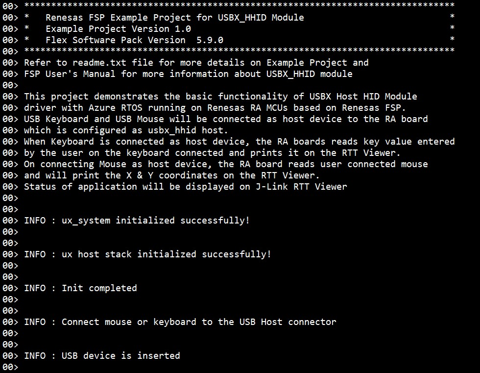

# Introduction #
This example project demonstrates basic functionalities of USBX Host Human Interface Device module on Renesas RA MCUs based on Renesas FSP using Azure RTOS. A wired keyboard or mouse will be enumerated by the RA MCU, which is configured as USBX HHID. Upon connecting the keyboard or the mouse, the user can press a key on the keyboard, move and press the mouse. The keyboard character, mouse coordinates (x and y), mouse button pressed (left, right), error and information messages will be displayed on the J-Link RTT Viewer.

Please refer to the [Example Project Usage Guide](https://github.com/renesas/ra-fsp-examples/blob/master/example_projects/Example%20Project%20Usage%20Guide.pdf) 
for general information on example projects and [readme.txt](./readme.txt) for specifics of operation.

## Required Resources ## 
To build and run the USBX HHID example project, the following resources are needed.

### Software ###
* Renesas Flexible Software Package (FSP): Version 5.9.0
* e2 studio: Version 2025-04
* SEGGER J-Link RTT Viewer: Version 8.12f
* LLVM Embedded Toolchain for ARM: Version 18.1.3
* Refer to the software required section in [Example Project Usage Guide](https://github.com/renesas/ra-fsp-examples/blob/master/example_projects/Example%20Project%20Usage%20Guide.pdf)

### Hardware ###
Supported RA boards: EK-RA6M4, EK-RA4M2, EK-RA4M3, EK-RA6M3, EK-RA6M5, EK-RA8M1, EK-RA8D1, MCK-RA8T1, EK-RA4L1, EK-RA8E2.
*   1 x Renesas RA board.
*	1 x Type-C USB cable for programming and debugging.
*	1 x OTG cable.
*	1 x Wired USB keyboard (E.g., HP PN: 803181-001).
*	1 x Wired USB mouse (When using USBX HHID, please use wired device).

### Hardware Connections ###
For EK-RA6M5, EK-RA6M4, EK-RA4M3, EK-RA4M2, EK-RA6M3, EK-RA8M1, EK-RA8D1 (Full-Speed): 
*   Jumper J12 placement is pins 1-2
*   Remove Jumper J15 pins
*   Connect a Wired USB keyboard/mouse to J11 connector with help of OTG cable.

For MCK-RA8T1 (Full-Speed):
*   Jumper JP9 placement is pins 1-2
*   Remove Jumper JP10 pins
*   Connect a Wired USB keyboard/mouse to CN14 connector with help of OTG cable.

For EK-RA4L1 (Full-Speed):
*	Turn OFF S4-4 to select USB Host mode. 
*   Set J17 jumper to pins 2-3, Set J7 jumper to use P407 for USBFS VBUS.
*   Connect a Wired USB keyboard/mouse to J11 connector with help of OTG cable.

For EK-RA8E2 (Full-Speed):
*   Connect a Wired USB keyboard/mouse to J11 connector with help of OTG cable.

## Related Collateral References ##
The following documents can be referred to for enhancing your understanding of 
the operation of this example project:
- [FSP User Manual on GitHub](https://renesas.github.io/fsp/)
- [Microsoft Azure USBX Host Class API ](https://docs.microsoft.com/en-us/azure/rtos/usbx/usbx-host-stack-5)
- [FSP Known Issues](https://github.com/renesas/fsp/issues)

# Project Notes #
## System Level Block Diagram ##
 High level block diagram
 

## FSP Modules Used ##
List of important modules that are used in this example project. Refer to the FSP User Manual for further details on each module listed below.

| Module Name | Usage | Searchable Keyword  |
|-------------|-----------------------------------------------|-----------------------------------------------|
|USBX HHID | This usbx_hhid module combines with the r_usb_basic module to provide a USBX Host Human Interface Device Class (HHID) driver. | HHID|
|USB Porting layer | This USB driver works by combining USBX and r_usb_basic module. |rm_usb_port|
|USB Basic Driver | USB driver operates in combination with the device class drivers provided by Renesas to form a complete USB stack.|r_usb_basic|

## Module Configuration Notes ##
This section describes FSP Configurator properties which are important or different than those selected by default. 

**Common Configuration properties**
|   Module Property Path and Identifier   |   Default Value   |   Used Value   |   Reason   |
| :-------------------------------------: | :---------------: | :------------: | :--------: |
| configuration.xml > Stacks > HHID Thread > Properties > Settings > Property > Common > Timer > Timer Ticks Per Second |100 | 1000 |The default UX_PERIODIC_RATE ticks should be 1000 indicating 1 tick per millisecond.|
| configuration.xml > Stacks > HHID Thread > Properties > Settings > Property >Thread > Priority| 1 | 20 |HHID thread priority is lowered to allow the other usb operations at faster rate.|
| configuration.xml > Stacks > RTT Thread > Properties > Settings > Property >Thread > Priority| 1 | 21 | RTT thread priority is lowered to allow the USBX HHID data process at the fastest rate possible.|

The table below lists the FSP provided API used at the application layer by this example project.

| API Name    | Usage                                                                          |
|-------------|--------------------------------------------------------------------------------|
|ux_system_initialize|This API is used to initialize the USBX system. |
|ux_host_stack_initialize|This API is used to initialize the USBX device stack.  |
|R_USB_Open|This API opens the USB basic driver. |
|ux_host_class_hid_keyboard_key_get|This API is used to get the keyboard key and state.  |
|ux_host_class_hid_mouse_buttons_get|This API is used to get the mouse buttons pressed.  |
|ux_host_class_hid_mouse_position_get|This API is used to get the mouse position in x & y coordinates. |
|R_USB_Close|This API is used to close the usb instance.  |
|ux_host_stack_uninitialize|This API is used to uninitialize all the host code for USBX. |

* Callback:  
apl_host_hid_change_function callback function is called to identify the USB events and respond accordingly. There are only two events available in the EP, which are used to signal to the HHID that USB communication can be started.
1. When event UX_DEVICE_INSERTION is received the USBX_HHID checks for the Host device connected and sets the event flag to perform USBX_HHID operation.
2. When event UX_DEVICE_REMOVAL is received the USBX_HHID will clear the event flag and will wait for USB_INSERTION event.

## Verifying operation ##
1. Import, generate and build the EP.
2. Flash USBX HHID code on RA board which will acts as host device.
3. Open RTT Viewer and connect host device (i.e keyboard or mouse).
4. Once keyboard is connected as host device, press key and check pressed key output on RTT Viewer.
5. Remove keyboard and attach mouse, check the x and y coordinates and button pressed of mouse on RTT Viewer.

1. The output on J-Link RTT Viewer for USBX HHID:
 
 
 
 

 

 

## Special Topics ##
* The EP does not support High Speed as USBX HHID does not support it.
* The EP has been confirmed to work properly with the HP brand keyboard (HP PN: 803181-001), while some other keyboard models may not be compatible.

