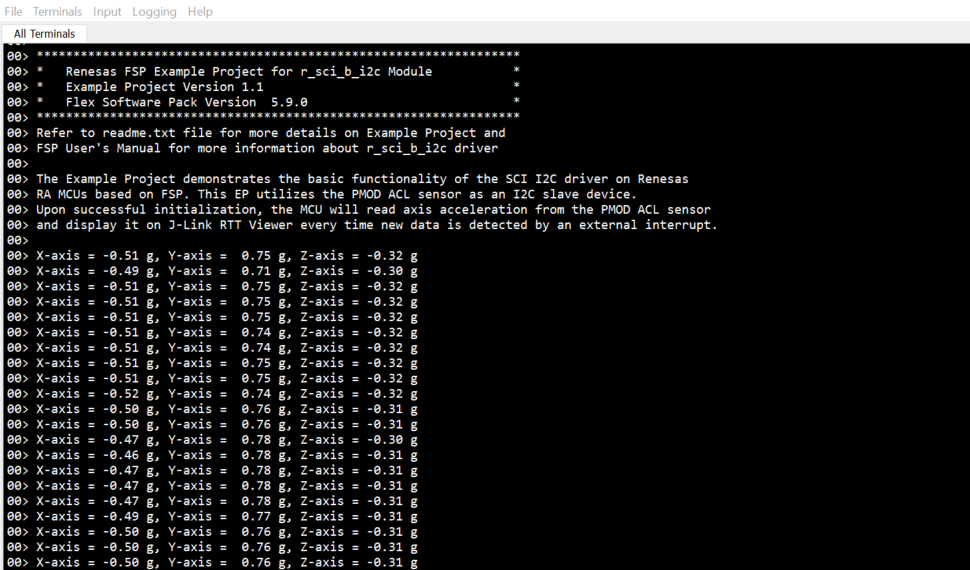

# Introduction #
The example project demonstrates the typical use of the SCI I2C master HAL module APIs. The project initializes SCI I2C master module with the standard rate and interfaces with PmodACL™ Board for ADXL345.
On power up, after initializing and configuring the sensor, the RA MCU will read the axis acceleration data from the sensor and display it on the RTT Viewer every time new data is detected by an external interrupt 

Please refer to the [Example Project Usage Guide](https://github.com/renesas/ra-fsp-examples/blob/master/example_projects/Example%20Project%20Usage%20Guide.pdf) 
for general information on example projects and [readme.txt](./readme.txt) for specifics of operation.

## Required Resources ## 
To build and run the SCI I2C example project, the following resources are needed.

### Software ###
* Renesas Flexible Software Package (FSP): Version 6.3.0
* e2 studio: Version 2025-12
* SEGGER J-Link RTT Viewer: Version 8.92
* LLVM Embedded Toolchain for ARM: Version 21.1.1

### Hardware ###
*	1 x Renesas RA board.
*	1 x PMOD ACL.
*	1 x Type-C USB cable for programming and debugging.
*	2 x Resistors (from 1k to 4.7k ohms).
*	Some jumper wires.

Refer to [readme.txt](./readme.txt) for information on how to connect the hardware.

### Hardware Connections ###  
* Connect the USB Debug port on the RA board to the host PC via a Type-C USB cable.
* Connect the PmodACL™ Board to the RA board according to the instructions below for each board type:
	
| PMOD ACL      |  
|:------------------------|
|J2 is used for I2C communication.   
|J1 is used for SPI communication and interrupt pins.

| CK-RA6M5                 |        |    PmodACL    |
|:------------------------:|:------:|:-------------:|
| IRQ11/P006               | ---->  |INT1 ( J1 - Pin 8 )     |
| SCL3/P706                | ---->  | SCL  ( J2 - Pin 1/5 )  |
| SDA3/P707                | ---->  | SDA  ( J2 - Pin 2/6 )  |
|  GND pin                 | ---->  | GND ( J2 - Pin 3/7 )   |
|  VCC pin                 | ---->  | VCC  ( J2 - Pin 4/8 )  |
 
| EK-RA2E2                 |        |    PmodACL    |
|:------------------------:|:------:|:-------------:|
| IRQ4/P102                | ---->  |INT1 ( J1 - Pin 8 )     |
| SCL9/P103                | ---->  | SCL  ( J2 - Pin 1/5 )  |
| SDA9/P101                | ---->  | SDA  ( J2 - Pin 2/6 )  |
|  GND pin                 | ---->  | GND ( J2 - Pin 3/7 )   |
|  VCC pin                 | ---->  | VCC  ( J2 - Pin 4/8 )  |	

| EK-RA4E2   EK-RA6E2   |        |    PmodACL    |
|:------------------------:|:------:|:-------------:|
| IRQ6/P409                |---->  |INT1 ( J1 - Pin 8 )      |
| SCL0/P410                | ---->  | SCL  ( J2 - Pin 1/5 )  |
| SDA0/P411                | ---->  | SDA  ( J2 - Pin 2/6 )  |
|  GND pin                 | ---->  | GND ( J2 - Pin 3/7 )   |
|  VCC pin                 | ---->  | VCC  ( J2 - Pin 4/8 )  |		

| MCK-RA4T1    MCK-RA6T3|        |    PmodACL    |
|:------------------------:|:------:|:-------------:|
| IRQ6/P301                | ---->  |INT1 ( J1 - Pin 8 )     |
| SCL9/P110                | ---->  | SCL  ( J2 - Pin 1/5 )  |
| SDA9/P109                | ---->  | SDA  ( J2 - Pin 2/6 )  |
|  GND pin                 | ---->  | GND ( J2 - Pin 3/7 )   |
|  VCC pin                 | ---->  | VCC  ( J2 - Pin 4/8 )  |		

| MCK-RA8T1                |        |    PmodACL    |
|:------------------------:|:------:|:-------------:|
| IRQ2/P100   (CN2:7)  | ---->  | INT1 ( J1 - Pin 8 )    |
| IRQ2/P100   (CN2:7)  | ---->  | SCL  ( J2 - Pin 1/5 )  |
| SDA9/P112   (CN2:1)  | ---->  | SDA  ( J2 - Pin 2/6 )  |
|  GND pin    (CN1:34) | ---->  | GND ( J2 - Pin 3/7 )   |
|  VCC pin    (CN1:24) | ---->  | VCC  ( J2 - Pin 4/8 )  |		

| FPB-RA8E1                |        |    PmodACL    |
|:------------------------:|:------:|:-------------:|
| IRQ9/P414   (J4:17) | ---->  | INT1 ( J1 - Pin 8 )    |
| SCL0/P602   (J3:5)  | ---->  | SCL  ( J2 - Pin 1/5 )  |
| SDA0/P603   (J3:6)  | ---->  | SDA  ( J2 - Pin 2/6 )  |
|  GND pin    (J3:20) | ---->  | GND  ( J2 - Pin 3/7 )  |
|  VCC pin    (J3:1)  | ---->  | VCC  ( J2 - Pin 4/8 )  |		

| EK-RA4L1                 |        |    PmodACL    |
|:------------------------:|:------:|:-------------:|
| IRQ0/P105   (J3:12) | ---->  | INT1 ( J1 - Pin 8 )    |
| SCL1/P608   (J2:37) | ---->  | SCL  ( J2 - Pin 1/5 )  |
| SDA1/P115   (J2:35) | ---->  | SDA  ( J2 - Pin 2/6 )  |
|  GND pin    (J3:25) | ---->  | GND  ( J2 - Pin 3/7 )  |
|  VCC pin    (J3:1)  | ---->  | VCC  ( J2 - Pin 4/8 )  |	

| EK-RA8E2                 |        |    PmodACL    |
|:------------------------:|:------:|:-------------:|
| IRQ9/P414   (J2:21) | ---->  | INT1 ( J1 - Pin 8 )    |
| SCL1/P401   (J2:03) | ---->  | SCL  ( J2 - Pin 1/5 )  |
| SDA1/P400   (J2:02) | ---->  | SDA  ( J2 - Pin 2/6 )  |
|  GND pin    (J2:39) | ---->  | GND  ( J2 - Pin 3/7 )  |
|  VCC pin    (J2:01) | ---->  | VCC  ( J2 - Pin 4/8 )  |	

## Related Collateral References ##
The following documents can be referred to for enhancing your understanding of the operation of this example project:
- [FSP User Manual on GitHub](https://renesas.github.io/fsp/)
- [FSP Known Issues](https://github.com/renesas/fsp/issues)

# Project Notes #

## System Level Block Diagram ##
High level block diagram of the system is as shown below:  

## FSP Modules Used ##
List all the various modules that are used in this example project. Refer to the FSP User Manual for further details on each module listed below.

| Module Name | Usage | Searchable Keyword  |
|-------------|-----------------------------------------------|-----------------------------------------------|
| SCI I2C Master | SCI I2C Master is used to communicate with the sensor | r_sci_i2c/r_sci_b_i2c |
| External IRQ | External IRQ is used to detect sensor data is ready | r_icu |

## Module Configuration Notes ##
This section describes FSP Configurator properties which are important or different than those selected by default.  
The SCI channel and ICU channel depend on the board type. Refer to the Hardware Connections section for information on how to select the correct channel.

**Configuration Properties for using SCI I2C Master**
|   Module Property Path and Identifier   |   Default Value   |   Used Value   |   Reason   |
|-----------------------------------------|-------------------|----------------|------------|
| configuration.xml > Stacks > g_sci_i2c_master I2C Master (r_sci_b_i2c) > Properties > Settings > Property > Common > DTC on Transmission and Reception | Disabled | Enabled | Enable DTC for transmission and reception. |
| configuration.xml > Stacks > g_sci_i2c_master I2C Master (r_sci_b_i2c) > Properties > Settings > Property > Module g_sci_i2c_master I2C Master (r_sci_b_i2c) > Channel | 0 | 1 | Use SCI I2C Master Channel 1 to communicate with the sensor. |
| configuration.xml > Stacks > g_sci_i2c_master I2C Master (r_sci_b_i2c) > Properties > Settings > Property > Module g_sci_i2c_master I2C Master (r_sci_b_i2c) > Rate | Standard | Standard | Select communication speed with the sensor. |
| configuration.xml > Stacks > g_sci_i2c_master I2C Master (r_sci_b_i2c) > Properties > Settings > Property > Module g_sci_i2c_master I2C Master (r_sci_b_i2c) > Slave Address | 0x00 | 0x1D | Specific slave address of the PmodACL ADXL345. |
| configuration.xml > Stacks > g_sci_i2c_master I2C Master (r_sci_b_i2c) > Properties > Settings > Property > Module g_sci_i2c_master I2C Master (r_sci_b_i2c) > Address Mode | 7-Bit | 7-Bit | Specific address mode of the PmodACL ADXL345. |
| configuration.xml > Stacks > g_sci_i2c_master I2C Master (r_sci_b_i2c) > Properties > Settings > Property > Module g_sci_i2c_master I2C Master (r_sci_b_i2c) > Callback | sci_i2c_master_callback | sci_i2c_master_callback | It is called from the interrupt service routine (ISR) upon IIC transaction completion reporting the transaction status. |
| configuration.xml > Stacks > g_sci_i2c_master I2C Master (r_sci_b_i2c) > Properties > Settings > Property > Module g_sci_i2c_master I2C Master (r_sci_b_i2c) > Interrupt Priority Level | Priority 12 | Priority 12 | Select the SCI I2C master interrupt priority level. |
| configuration.xml > Stacks > g_sci_i2c_master I2C Master (r_sci_b_i2c) > Properties > Settings > Property > Module g_sci_i2c_master I2C Master (r_sci_b_i2c) > RX Interrupt Priority Level [Only used when DTC is enabled] | Disabled | Priority 12 | Select the SCI I2C master RX interrupt priority level. |

**Configuration Properties for using External IRQ**
|   Module Property Path and Identifier   |   Default Value   |   Used Value   |   Reason   |
|-----------------------------------------|-------------------|----------------|------------|
| configuration.xml > Stacks > g_external_irq External IRQ (r_icu) > Properties > Settings > Property > Module g_external_irq External IRQ (r_icu) > Channel | 0 | 0 | Use External IRQ channel 0 to detect sensor data is ready. |
| configuration.xml > Stacks > g_external_irq External IRQ (r_icu) > Properties > Settings > Property > Module g_external_irq External IRQ (r_icu) > Trigger | Rising | Rising | Detect data ready by rise edge. |
| configuration.xml > Stacks > g_external_irq External IRQ (r_icu) > Properties > Settings > Property > Module g_external_irq External IRQ (r_icu) > Digital Filtering | Disabled | Enabled | Noise filter. |
| configuration.xml > Stacks > g_external_irq External IRQ (r_icu) > Properties > Settings > Property > Module g_external_irq External IRQ (r_icu) > Callback | NULL | external_irq_callback | It is called from the interrupt service routine (ISR) upon a rising edge is detected on the IRQ pin. |
| configuration.xml > Stacks > g_external_irq External IRQ (r_icu) > Properties > Settings > Property > Module g_external_irq External IRQ (r_icu) > Pin Interrupt Priority | Priority 12 | Priority 12 | Select the External IRQ interrupt priority. |

## API Usage ##
The table below lists the FSP provided API used at the application layer by this example project.
| API Name    | Usage                                                                          |
|-------------|--------------------------------------------------------------------------------|
| R_ICU_ExternalIrqOpen | This API is used to initialize an IRQ input pin for use with the external interrupt interface. |
| R_ICU_ExternalIrqEnable | This API is used to enable external interrupt for specified channel. |
| R_ICU_ExternalIrqClose | This API is used to de-initialize the external interrupt channel. |
| R_SCI_B_I2C_Open | This API is used to initialize the SCI I2C Master module. |
| R_SCI_B_I2C_Write | This API is used to perform a write operation to the sensor register. |
| R_SCI_B_I2C_Read | This API is used to perform a read operation from the sensor register. |
| R_SCI_B_I2C_Close | This API is used to de-initialize the SCI I2C Master module. |
| R_BSP_SoftwareDelay | This API is used to delay a specified period of time. |

## Verifying operation ##
1. Import, generate and build the example project.
2. Connect Pmod ACL module to RA board.
3. Connect RA board to Host PC.
4. Flash or debug the EP.
5. Open the RTT Viewer and view output log.
  
  

## Special Topics ##
* The files sci_i2c_ep.c and sci_i2c_ep.h contain the API for initialization, configuration and communication of the PmodACL module.
* Some MCUs do not support r_sci_i2c module but can use r_sci_b_i2c module instead.
* For the functioning of the SCI I2C Master:
1. SDA pin and SCL pin must configure output type as n-ch open drain.
2. SDA pin and SCL pin must be connected to external pull-up resistors.
3. The value of the external pull-up resistor depends on the I2C bus speed. In this EP, the I2C bus is configured at standard speed, so the recommended external pull-up resistor value is from 1k to 4.7k ohms.