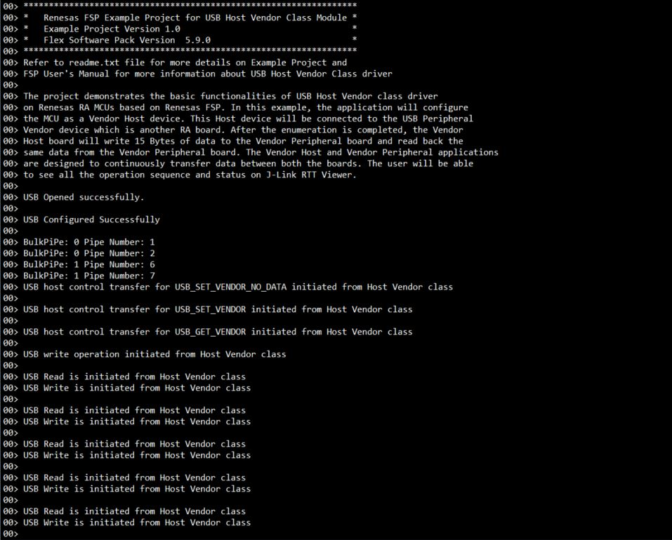

# Introduction #
The sample code accompanying this file shows the operation of a Host Vendor Class using the USB FS host on a RA MCU.
In this example, the application will configure the USB IP on the MCU as a Vendor Host device. This Host device will be connected to another RA MCU operating as USB Peripheral, servicing Vendor Class requests.
After the enumeration is completed, the Vendor Host board will write a fixed amount (default: 15 Bytes) of data to the Vendor Peripheral board and which is relayed back by the Peripheral.

Please refer to the [Example Project Usage Guide](https://github.com/renesas/ra-fsp-examples/blob/master/example_projects/Example%20Project%20Usage%20Guide.pdf) 
for general information on example projects and [readme.txt](./readme.txt) for specifics of operation.

## Required Resources ##
To build and run the USB Host Vendor example project, the following resources are needed.

### Software ###
Refer to software described in [Example Project Usage Guide](https://github.com/renesas/ra-fsp-examples/blob/master/example_projects/Example%20Project%20Usage%20Guide.pdf)

### Hardware ###
* Supported RA boards: EK-RA4M2, EK-RA4M3, EK-RA6M3, EK-RA6M3G, EK-RA6M4, EK-RA6M5, EK-RA8D1, EK-RA8M1, MCK-RA8T1, EK-RA4L1, EK-RA8E2
* 2 x Renesas RA boards:
  - 1 x RA board runs the USB HVND Example Project.
  - 1 x RA board runs the USB PVND Example Project.
* 1 x USB OTG cable.
* 3 x USB cables for programming and debugging.

Refer to [readme.txt](./readme.txt) on information on how to connect the hardware.

### Hardware Connections: ###
Connect Board 1, running the USB HVND Example Project, through OTG cable to Board 2, running the USB PVND Example Project.

For EK-RA4M2, EK-RA4M3, EK-RA6M4, EK-RA6M5, EK-RA8D1, EK-RA8M1 (Full Speed):
* Jumper J12 placement is pins 1-2.
* Remove jumper J15 pins.
* Connect the micro USB end of the micro USB device cable to micro-AB USB Full Speed port (J11) of the board.
* Connect the other end of this cable through OTG Cable to Board 2.

For EK-RA6M3, EK-RA6M3G (Hi Speed):
* Jumper J7 placement is pins 1-2.
* Remove jumper J17 pins.
* Connect the micro USB end of the micro USB device cable to micro-AB USB Full Speed port (J6) of the board.
* Connect the other end of this cable through OTG Cable to Board 2.

For MCK-RA8T1 (Full Speed):
* Jumper JP9 placement is pins 1-2.
* Remove jumper JP10 pins.
* Connect the Type-C USB end of the Type-C USB device cable to Type-C USB Full Speed port (CN14) of the board.
* Connect the other end of this cable through OTG Cable to Board 2.

For EK-RA4L1 (Full Speed):
* The user must turn OFF S4-4 to select USB Host Controller mode.
* Set J17 jumper to pins 2-3, Set J7 jumper to use P407 for USBFS VBUS.
* Connect the Type-C USB end of the Type-C USB device cable to Type-C USB Full Speed port (J11) of the board.
* Connect the other end of this cable through OTG Cable to Board 2.

For EK-RA8E2 (Full Speed):
* Connect the Type-C USB end of the Type-C USB device cable to Type-C USB Full Speed port (J11) of the board.
* Connect the other end of this cable through OTG Cable to Board 2.

## Related Collateral References ##
The following documents can be referred to for enhancing your understanding of 
the operation of this example project:
- [FSP User Manual on GitHub](https://renesas.github.io/fsp/)
- [FSP Known Issues](https://github.com/renesas/fsp/issues)

# Project Notes #

## System Level Block Diagram ##
  
In the image, show an example of the two boards connected. For example, the Host is EK-RA6M3 Peripheral is EK-RA4M1.

## FSP Modules Used ##
List all the various modules that are used in this example project. Refer to the FSP User Manual for further details on each module listed below.

| Module Name | Usage  | Searchable Keyword (using New Stack > Search) |
|-------------|-----------------------------------------------|-----------------------------------------------|
| USB Host Vendor |USB Host Vendor class works by combining r_usb_basic module. | USB hvnd |

## Module Configuration Notes ##
This section describes FSP Configurator properties which are important or different than those selected by default. 

|   Module Property Path and Identifier   |   Default Value   |   Used Value   |   Reason   |
| :-------------------------------------: | :---------------: | :------------: | :--------: |
|   configuration.xml > Stacks > Host Thread > g_basic USB (r_usb_basic) > Properties > Settings > Property > Module g_basic USB (r_usb_basic) > USB Callback  |   NULL   |   usb_host_vendor_callback   |   As RTOS is used, so the callback function is set and this callback function will notify the user about occurrence of USB events.   |
|   configuration.xml > Stacks > Host Thread > g_basic USB (r_usb_basic) > Properties > Settings > Property > Module g_basic USB (r_usb_basic) > USB Speed  |   Full Speed   |   Full Speed   |   Select the USB speed.   |
|   configuration.xml > Stacks > Host Thread > g_basic USB (r_usb_basic) > Properties > Settings > Property > Module g_basic USB (r_usb_basic) > USB Module Number  |   USB_IP0 Port   |   USB_IP0 Port   |   Specify the USB module number to be used.   |
|   configuration.xml > Stacks > Host Thread > Properties > Settings > Property > Thread > Stack size (bytes)  |   1024   |   4096   |   This is changed to handle its worst-case function call nesting and local variable usage.   |
|   configuration.xml > Stacks > Host Thread > Properties > Settings > Property > Common > Memory Allocation > Support Dynamic Allocation  |   Disabled   |   Enabled   |   RTOS objects can be created using RAM that is automatically allocated from the FreeRTOS heap.   |
|   configuration.xml > Stacks > Host Thread > Properties > Settings > Property > Common > Memory Allocation > Total Heap Size  |   0   |   20000   |   This is changed because Dynamic Allocation support is enabled, so application makes use of amount of RAM available in the FreeRTOS heap.   |
|   configuration.xml > Stacks > Host Thread > Properties > Settings > Property > Thread > Memory Allocation  |   Static   |   Dynamic   |   This is changed to allocate memory for this object from a FreeRTOS heap.   |
|   configuration.xml > Stacks > g_queue Queue > Properties > Settings > Property > Memory Allocation |   Static   |   Dynamic   | This is changed to allocate memory for this object from a FreeRTOS heap.   |
|   configuration.xml > Stacks > g_queue Queue > Properties > Settings > Property > Queue Length (Items) |  20   |   10   | Queue length is assigned. |

## API Usage ##
The table below lists the FSP provided API used at the application layer by this example project.

| API Name    | Usage                                                                          |
|-------------|--------------------------------------------------------------------------------|
|R_USB_PipeRead | This API is used to Read data from peripheral, when USB Write complete event occur. |
|R_USB_PipeWrite| This API is used to Write data back to peripheral, when USB READ complete event occur.|
|R_USB_HostControlTransfer| This API is used to request control transfer.|
|R_USB_Open| This API opens the USB basic driver.|
|R_USB_Close| This API is used to close the usb instance.|
|R_USB_UsedPipesGet| This API is used to gets the selected pipe number.|
|R_USB_PipeInfoGet| This API is used to gets the following pipe information.|

## Verifying operation ##
To Import, Build and Debug the EP, *see section Starting Development* of **FSP User Manual**. After running the EP, open J-Link RTT Viewer to see the output.

* The output on **J-Link RTT Viewer** for USB HVND:

 
