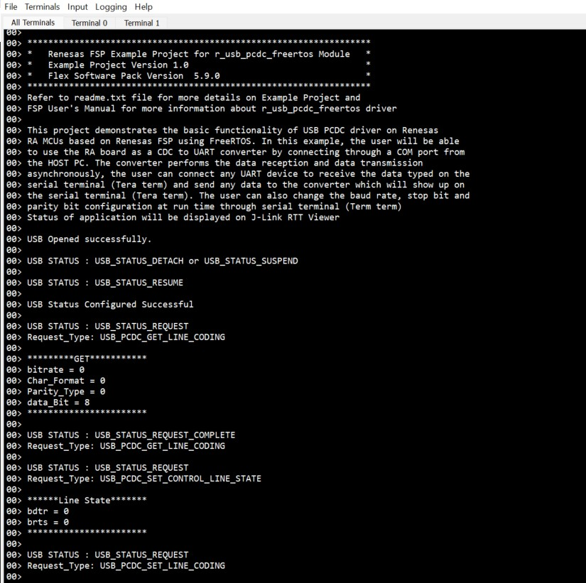

# Introduction #
This Example Project demonstrates the basic functionality of USB PCDC driver on Renesas RA MCUs based on Renesas FSP using FreeRTOS. In this example, the user will be able to use the RA board as a CDC to UART converter by connecting through a COM port from the host PC.
The converter performs the data reception and data transmission asynchronously. The user can connect any UART device to receive the data typed in Tera Term, and to send any data to the converter to display on Tera Term. The user can also change the baud rate, stop bit and parity bit configuration at run time through Tera Term. The status of the application will be displayed on J-Link RTT Viewer.
         
Please refer to the [Example Project Usage Guide](https://github.com/renesas/ra-fsp-examples/blob/master/example_projects/Example%20Project%20Usage%20Guide.pdf) 
for general information on example projects and [readme.txt](./readme.txt) for specifics of operation.

## Required Resources ##
To build and run the usb example project, the following resources are needed.

### Software ###
* Renesas Flexible Software Package (FSP): Version 5.9.0
* e2 studio: Version 2025-04
* SEGGER J-Link RTT Viewer: Version 8.12f
* LLVM Embedded Toolchain for ARM: Version 18.1.3
* Terminal Console Application: Tera Term or a similar application
* USB Serial Drivers

Refer to software requirements mentioned in [Example Project Usage Guide](https://github.com/renesas/ra-fsp-examples/blob/master/example_projects/Example%20Project%20Usage%20Guide.pdf)

### Hardware ###
* Supported RA boards: EK-RA2A1, EK-RA4M2, EK-RA6M3, EK-RA6M4, EK-RA8D1, EK-RA8M1, MCK-RA8T1, EK-RA4L1, EK-RA8E2.
* 1 x Renesas RA board.
* 1 x Pmod USBUART (e.g, Pmod USBUART: https://digilent.com/shop/pmod-usbuart-usb-to-uart-interface/) is used as example external UART device to demonstrate the functionality of the converter.
* 2 x Type-C USB cables.
* 1 x Micro USB cable for connecting the Pmod USBUART to the host PC.
* 1 x PC with at least 3 USB ports (1 for debug, 2 for COM port).
* Some jumper wires.

Refer to [readme.txt](./readme.txt) for information on how to connect the hardware.

### Hardware Connections ###
For EK-RA6M3:
* USB PCDC (High Speed):
	1. Jumper J7: Connect pins 2-3.
	2. Connect Jumper J17 pins.
	3. Connect the micro USB end of the micro USB device cable to micro-AB USB High Speed port (J6) of the board. Connect the other end of this cable to USB port of the host PC.
* USB PCDC (Full Speed):
	1. Jumper J12: Connect pins 2-3.
	2. Connect Jumper J15 pins.
	3. Connect the micro USB end of the micro USB device cable to micro-AB USB Full Speed port (J11) of the board. Connect the other end of this cable to USB port of the host PC.

* UART:
	1. P411 (TXD) to RX pin of external UART device.
	2. P410 (RXD) to TX pin of external UART device.
	3. When using flow control from Tera Term, the CTS (P413) should be connected to either RTS(P103) or GND.
	4. Connect the Pmod USBUART Board (J1) to the host PC via a micro USB cable.

	   For instructions on how to enable and disable flow control, refer the the FSP User's manual. 

For EK-RA4M2:
* USB PCDC (Full Speed):
	1. Connect the micro USB end of the micro USB device cable to micro-AB USB Full Speed port (J11) of the board. Connect the other end of this cable to USB port of the host PC.
	2. Jumper J12 placement is pins 2-3.
	3. Connect jumper J15 pins.

* UART:
	1. P602 (TXD) to RX pin of external UART device.
	2. P601 (RXD) to TX pin of external UART device.
	3. When using flow control from Tera Term, the CTS (P603) should be connected to GND.
	4. Connect the Pmod USBUART Board (J1) to the host PC via a micro USB cable.
    
	   For instructions on how to enable and disable flow control, refer the the FSP User's manual.

For EK-RA6M4:
* USB PCDC (Full Speed):
	1. Connect the micro USB end of the micro USB device cable to micro-AB USB Full Speed port (J11) of the board. Connect the other end of this cable to USB port of the host PC.
	2. Jumper J12 placement is pins 2-3.
	3. Connect jumper J15 pins.

* UART:
	1. P101 (TXD) to RX pin of external UART device.
	2. P100 (RXD) to TX pin of external UART device.
	3. When using flow control from Tera Term, the CTS (P414) should be connected to P413.
	4. Connect the Pmod USBUART Board (J1) to the host PC via a micro USB cable.

       For instructions on how to enable and disable flow control, refer the the FSP User's manual.

For EK-RA2A1:
* USB PCDC (Full Speed):
	1. Connect the micro USB end of the micro USB device cable to micro-AB USB Full Speed port (J9) of the board. Connect the other end of this cable to USB port of the host PC.

* UART:
	1. P302 (TXD) to RX pin of external UART device.
	2. P301 (RXD) to TX pin of external UART device.
	3. When using flow control from Tera Term, the CTS (P303) should be connected to GND.
	4. Connect the Pmod USBUART Board (J1) to the host PC via a micro USB cable.
        
	   For instructions on how to enable and disable flow control, refer the the FSP User's manual. 
	
For EK-RA8M1:
* USB PCDC (Full Speed):
	1. Connect the micro USB end of the micro USB device cable to micro-AB USB Full Speed port (J11) of the board. Connect the other end of this cable to USB port of the host PC.
	2. Jumper J12 placement is pins 2-3.
	3. Connect jumper J15 pins.
* USB PCDC (High Speed):
	1. Connect the micro USB end of the micro USB device cable to micro-AB USB High Speed port (J31) of the board. Connect the other end of this cable to USB port of the host PC.
	2. Jumper J7 placement is pins 2-3.
	3. Connect jumper J17 pins.	

* UART:
	1. PA03 (TXD) to RX pin of external UART device.
	2. PA02 (RXD) to TX pin of external UART device.
	3. When using flow control from Tera Term, the CTS (PA05) should be connected to GND.
	4. Connect the Pmod USBUART Board (J1) to the host PC via a micro USB cable.
	
	   For instructions on how to enable and disable flow control, refer the the FSP User's manual.

For EK-RA8D1:
* Note: The user needs to turn OFF SW1-6 to use USBHS.
* USB PCDC (Full Speed):
	1. Connect the micro USB end of the micro USB device cable to micro-AB USB Full Speed port (J11) of the board. Connect the other end of this cable to USB port of the host PC.
	2. Jumper J12 placement is pins 2-3.
	3. Connect jumper J15 pins.
* USB PCDC (High Speed):
	1. Connect the micro USB end of the micro USB device cable to micro-AB USB High Speed port (J31) of the board. Connect the other end of this cable to USB port of the host PC.
	2. Jumper J7 placement is pins 2-3.
	3. Connect jumper J17 pins.

* UART:
	1. PA03 (TXD) to RX pin of external UART device.
	2. PA02 (RXD) to TX pin of external UART device.
	3. When using flow control from Tera Term, the CTS (PA05) should be connected to GND.
	4. Connect the Pmod USBUART Board (J1) to the host PC via a micro USB cable.
	
	   For instructions on how to enable and disable flow control, refer the the FSP User's manual.

For MCK-RA8T1:
* USB PCDC (Full Speed):
	1. Connect the Type-C USB end of the Type-C USB device cable to Type-C USB Full Speed port (CN14) of the board. Connect the other end of this cable to USB port of the host PC.
    2. Jumper JP9 placement is pins 2-3.
    3. Connect jumper JP10 pins.

* UART:
    1. P603 (CN3:31) (TXD) to RX pin of external UART device.
    2. P602 (CN3:33) (RXD) to TX pin of external UART device.
    3. When using flow control from Tera Term, the CTS (604) should be connected to GND.
	4. Connect the Pmod USBUART Board (J1) to the host PC via a micro USB cable.
    
	   For instructions on how to enable and disable flow control, refer the the FSP User's manual.

For EK-RA4L1:
* USB PCDC (Full Speed):
	1. The user must turn ON S4-4 to select USB device mode.
	2. Set J17 jumper to pins 2-3, Set J7 jumper to use P407 for USBFS VBUS.
	3. Connect the Type-C USB end of the Type-C USB device cable to Type-C USB Full Speed port (J11) of the board. Connect the other end of this cable to USB port of the host PC.

* UART:
	1. P115 (J2:35) (TXD1) to RX pin of external UART device.
	2. P608 (J2:37) (RXD1) to TX pin of external UART device.
	3. When using flow control from Tera Term, the CTS_RTS1 (P402) (J2:48) should be connected to GND.
	4. Connect the Pmod USBUART Board (J1) to the host PC via a micro USB cable.
    
	   For instructions on how to enable and disable flow control, refer the the FSP User's manual.

For EK-RA8E2:
* USB PCDC (Full Speed):
	1. Connect the Type-C USB end of the Type-C USB device cable to Type-C USB Full Speed port (J11) of the board. Connect the other end of this cable to USB port of the host PC.

* UART:
	1. P400 (J2:02) (TXD1) to RX pin of external UART device.
	2. P401 (J2:03) (RXD1) to TX pin of external UART device.
	3. When using flow control from Tera Term, the CTS_RTS1 (P402) (J2:05) should be connected to GND.
	4. Connect the Pmod USBUART Board (J1) to the host PC via a micro USB cable.
    
	   For instructions on how to enable and disable flow control, refer the the FSP User's manual.
## Related Collateral References ##
The following documents can be referred to for enhancing your understanding of 
the operation of this example project:
- [FSP User Manual on GitHub](https://renesas.github.io/fsp/)
- [FSP Known Issues](https://github.com/renesas/fsp/issues)

# Project Notes #

## System Level Block Diagram ##

## FSP Modules Used ##
List all the various modules that are used in this example project. Refer to the FSP User Manual for further details on each module listed below.

| Module Name | Usage  | Searchable Keyword (using New Stack > Search) |
|-------------|-----------------------------------------------|-----------------------------------------------|
| USB PCDC | USB Peripheral Communications Device Class (PCDC) driver transfers data to and from USB host, responds to CDC class requests.| pcdc |
| UART | SCI_UART module supports data reception and transmission, bitrate modulation, baud rate change , and flow control. | uart |

## Module Configuration Notes ##
This section describes FSP Configurator properties that are important or different from those selected by default. 

**Common Configuration Properties**
|   Module Property Path and Identifier   |   Default Value   |   Used Value   |   Reason   |
| :-------------------------------------: | :---------------: | :------------: | :--------: |
|   configuration.xml > BSP > Properties > Settings > Property > RA Common > Heap Size (bytes)  |  0   | 0x400  |  Change heap size to accomodate functions usage in the EP and avoid any runtime errors. |
|   configuration.xml > Stacks > g_basic USB (r_usb_basic) > Properties > Settings > Property > Common >  DMA/DTC Support | DMA Disabled | DMA Enabled | Enable DMA support for the module. |

**Configuration Properties if USB Speed as High Speed**
|   Module Property Path and Identifier   |   Default Value   |   Used Value   |   Reason   |
| :-------------------------------------: | :---------------: | :------------: | :--------: |
| configuration.xml > Stacks > g_basic USB (r_usb_basic) > Properties > Settings > Property > Common > DMA/DTC Source Address| DMA Disabled | HS Address | USB basic driver is configured **USB Speed** as **Hi Speed**. Accordingly, DMA Source Address should provided with **HS Address**.|
| configuration.xml > Stacks > g_basic USB (r_usb_basic) > Properties > Settings > Property > Common > DMA/DTC Destination Address| DMA Disabled | HS Address | USB basic driver is configured **USB speed** as **Hi Speed**. Accordingly, DMA Destination Address should provided with **HS Address**.|
| configuration.xml > Stacks > g_basic USB (r_usb_basic) > Properties > Settings > Property > Module g_basic USB (r_usb_basic) > USB Speed| Full Speed | Hi Speed | USB Speed is configured as **Hi Speed**.|
| configuration.xml > Stacks > g_basic USB (r_usb_basic) > Properties > Settings > Property > Module g_basic USB (r_usb_basic) > USB Module Number| USB_IP0 Port | USB_IP1 Port | This property is used to specify USB module number to be used as per configured USB speed.|
| configuration.xml > Stacks > g_transfer0 Transfer (r_dmac) > Properties > Settings > Property > Module g_transfer0 Transfer (r_dmac) > Transfer Size| 2 Bytes | 4 Bytes |The transfer size of DMA for **High Speed** requires **4 Bytes**.|
| configuration.xml > Stacks > g_transfer0 Transfer (r_dmac) > Properties > Settings > Property > Module g_transfer0 Transfer (r_dmac) > Activation Source| No ELC Trigger | USBHS FIFO 1 (DMA/DTC Transfer request 1)  |This is an event trigger for DMA transfer 0 instance for destination pointer address.|
| configuration.xml > Stacks > g_transfer1 Transfer (r_dmac) > Properties > Settings > Property > Module g_transfer1 Transfer (r_dmac) > Transfer Size| 2 Bytes | 4 Bytes |The transfer size of DMA for **High Speed** requires **4 Bytes**.|
| configuration.xml > Stacks > g_transfer1 Transfer (r_dmac) > Properties > Settings > Property > Module g_transfer1 Transfer (r_dmac) > Activation Source| No ELC Trigger | USBHS FIFO 0 (DMA/DTC Transfer request 0) |This is an event trigger for DMA transfer 1 instance for source pointer address.|

**Configuration Properties if USB Speed as Full Speed.**  
Below settings should be adjusted after resetting all modules values to the default values.

|   Module Property Path and Identifier   |   Default Value   |   Used Value   |   Reason   |
| :-------------------------------------: | :---------------: | :------------: | :--------: |
| configuration.xml > Stacks > g_basic USB (r_usb_basic) > Properties > Settings > Property > Common > DMA/DTC Source Address| DMA Disabled | FS Address | USB basic driver is configured **USB Speed** as **Full Speed**. Accordingly, DMA Source Address should provided with **FS Address**.|
| configuration.xml > Stacks > g_basic USB (r_usb_basic) > Properties > Settings > Property > Common > DMA/DTC Destination Address| DMA Disabled | FS Address | USB basic driver is configured **USB speed** as **Full Speed**. Accordingly, DMA Destination Address should provided with **FS Address**.|
| configuration.xml > Stacks > g_basic USB (r_usb_basic) > Properties > Settings > Property > Module g_basic USB (r_usb_basic) > USB Speed| Full Speed | Full Speed | USB Speed is configured as **Full Speed**.|
| configuration.xml > Stacks > g_basic USB (r_usb_basic) > Properties > Settings > Property > Module g_basic USB (r_usb_basic) > USB Module Number| USB_IP0 Port | USB_IP0 Port | This property is used to specify USB module number to be used as per configured USB speed.|
| configuration.xml > Stacks > g_transfer0 Transfer (r_dmac) > Properties > Settings > Property > Module g_transfer0 Transfer (r_dmac) > Transfer Size| 2 Bytes | 2 Bytes |The transfer size of DMA for **Full Speed** requires **2 Bytes**.|
| configuration.xml > Stacks > g_transfer0 Transfer (r_dmac) > Properties > Settings > Property > Module g_transfer0 Transfer (r_dmac) > Activation Source| No ELC Trigger | USBFS FIFO 1 (DMA/DTC Transfer request 1)  |This is an event trigger for DMA transfer 0 instance for destination pointer address. |
| configuration.xml > Stacks > g_transfer1 Transfer (r_dmac) > Properties > Settings > Property > Module g_transfer1 Transfer (r_dmac) > Transfer Size| 2 Bytes | 2 Bytes |The transfer size of DMA for **Full Speed** requires **2 Bytes**.
| configuration.xml > Stacks > g_transfer1 Transfer (r_dmac) > Properties > Settings > Property > Module g_transfer1 Transfer (r_dmac) > Activation Source| No ELC Trigger | USBFS FIFO 0 (DMA/DTC Transfer request 0) |This is an event trigger for DMA transfer 1 instance for source pointer address.|

**Common Module Configuration Properties**
|   Module Property Path and Identifier   |   Default Value   |   Used Value   |   Reason   |
| :-------------------------------------: | :---------------: | :------------: | :--------: |
| configuration.xml > Stacks > g_basic USB (r_usb_basic) > Properties > Settings > Property > Module g_basic USB >  USB Callback | NULL | usb_pcdc_callback | Defined user callback for sending events. |

## API Usage ##
The table below lists the USB basic APIs used at the application layer by this example project.

| API Name    | Usage                                                                          |
|-------------|--------------------------------------------------------------------------------|
|R_USB_Open| Open USB instance. |
|R_USB_Read| API is used to read data. |
|R_USB_PeriControlDataGet| Receives data sent by control transfer. |
|R_USB_PeriControlDataSet| Sets class request. |
|R_USB_PeriControlStatusSet| Set the USB status. |
|R_USB_Close| Stops USB module and terminates power. |
|R_SCI_B_UART_Open| Open UART module. |
|R_SCI_B_UART_BaudCalculate| Calculate Baud rate rgister settings. |
|R_SCI_B_UART_Write| Writes data to UART Tx pin. |
|R_SCI_B_UART_Close| Closed UARt driver and any lower level transfer drivers if used. |

## Verifying operation ##
* Import, Build and Debug the EP (see section Starting Development of **FSP User Manual**).
* Connect Type-C USB cables, connecting wires as mentioned in the **Hardware Connections** section above.
* Run the EP and then open J-Link RTT Viewer to see the output status of the EP.
* Open two serial terminals (preferably Tera Term) on the HOST PC and connect to COM port as shown below:
	One COM for USB PCDC and another COM for external UART device.

	
	
* Configure baud rate, stop bit and parity bit settings on the serial terminal (Tera Term) for external UART device:  

	

* Configure baud rate, stop bit and parity bit settings on the serial terminal (Tera Term) for USB PCDC based on the settings of the external UART device connected to converter.
  Note that only CTS/RTS flow control is tested with TeraTerm.
  
	

* Enable "Local echo" in the serial terminal if you would like to view the data sent by the serial terminal.
* Send data using serial terminal (Tera term) to external UART device.
* View the data received from the external UART device via the converter through the serial terminal (Tera Term).
* The status messages will be displayed in J-Link RTT Viewer as depicted below:

	
	
	

* The sent and received data in the serial terminals can be observed as shown below:
	
	
	
### Special Topics 
**Developing Descriptor**

A USB device provides information about itself in data structures called USB descriptors. 	

The host obtains descriptors from an attached device by sending various standard control requests to the default endpoint.
Those requests specify the type of descriptor to retrieve. In response to such requests, the device sends descriptors
that include information about the device, its configurations, interfaces and the related endpoints.
* Refer **Descriptor** section in FSP User manual (https://renesas.github.io/fsp/group___u_s_b___p_c_d_c.html) for developing the descriptor.

	

	

