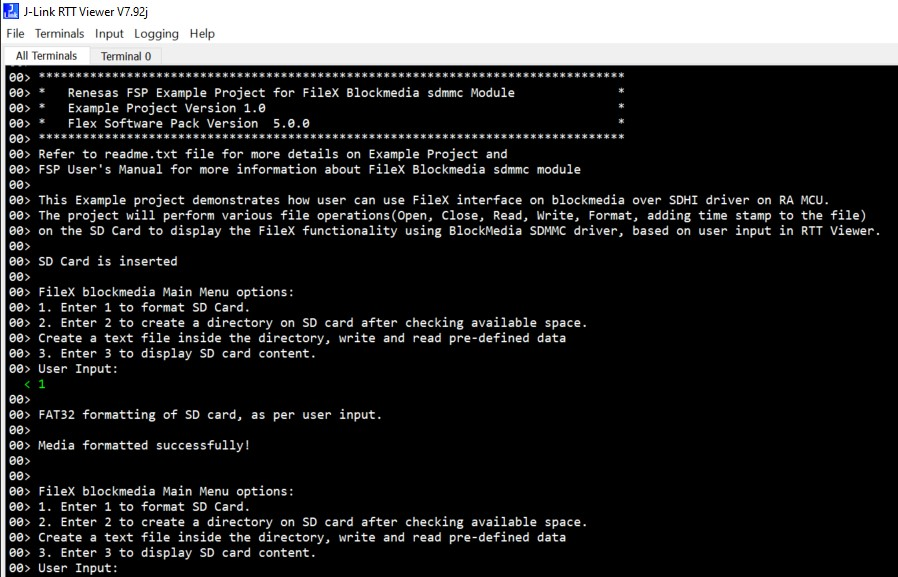
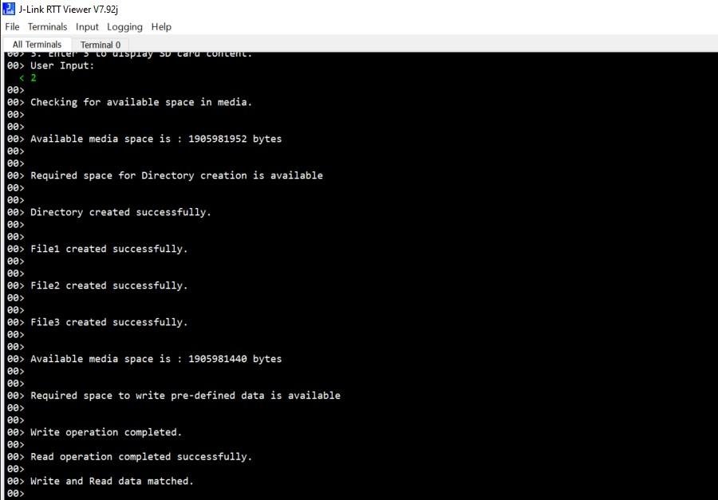
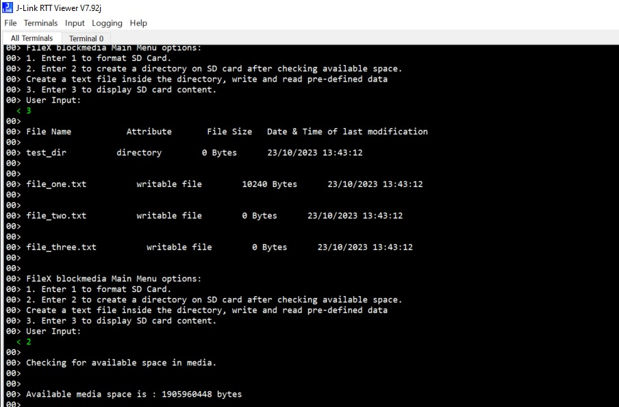

# Introduction #

The sample code accompanying this file shows the operation of a FileX interface on blockmedia over SDHI driver on RA MCU.
In this sample code, user performs various operations like formatting SD card, writing and reading back data, opening and closing files on SD card.
These operations are done via FileX interface,on underlying SDHI driver based on user input.

JlinkRTTViewer is used as user Interface. System messages (Error and info messages) will be printed on JlinkRTTViewer during the execution of the project.

Please refer to the [Example Project Usage Guide](https://github.com/renesas/ra-fsp-examples/blob/master/example_projects/Example%20Project%20Usage%20Guide.pdf) 
for general information on example projects and [readme.txt](./readme.txt) for specifics of operation.

## Required Resources ##
To build and run the Filex Blockmedia using SDMMC example project, the following resources are needed.

### Hardware ###
* Renesas RA boards: RA4M2, RA4M3, RA6M1, RA6M2, RA6M3, RA6M4, RA6M5, RA8M1
* Micro USB cable
* Host Machine 
* PMOD based SD card Module(SD Full sized SD Card slot).
  Full sized SD Card  or Micro SD CARD with Adapter to fit into Full sized SD card Slot.
  Connect PMOD: use short wiring connections (should be shorter than 10cm)
  
Refer to [readme.txt](./readme.txt) for information on how to connect the hardware.

### Software ###
* Renesas Flexible Software Package (FSP): Version 5.6.0
* e2 studio: Version 2024-10
* SEGGER J-Link RTT Viewer: Version 7.98g
* GCC ARM Embedded Toolchain: Version 13.2.1.arm-13-7

--Refer to software requirements mentioned in [Example Project Usage Guide](https://github.com/renesas/ra-fsp-examples/blob/master/example_projects/Example%20Project%20Usage%20Guide.pdf)

## Related Collateral References ##
The following documents can be referred to for enhancing your understanding of 
the operation of this example project:
- [FSP User Manual on GitHub](https://renesas.github.io/fsp/)
- [FSP Known Issues](https://github.com/renesas/fsp/issues)

# Project Notes #

## System Level Block Diagram ##

## FSP Modules Used ##
List all the various modules that are used in this example project. Refer to the FSP User Manual for further details on each module listed below.

| Module Name | Usage  | Searchable Keyword (using New Stack > Search) |
|-------------|-----------------------------------------------|-----------------------------------------------|
| FileX on Block Media | With FileX BlockMedia SDMMC driver, user can store the required board data(sensor readings, ethernet packets etc.) on the SD Card.| file |

## Module Configuration Notes ##
This section describes FSP Configurator properties that are important or different from those selected by default. 

|   Module Property Path and Identifier   |   Default Value   |   Used Value   |   Reason   |
| :-------------------------------------: | :---------------: | :------------: | :--------: |
|   configuration.xml -> BSP > Property > Main Stack Size(bytes)  |  0x400   | 0x1000  |  Modified main stack size to accomodate function calls as per application requirement |
|   configuration.xml -> BSP > Property > Heap Size(bytes)  |  0   | 0x1800  |  Increased stack size to accomodate standard library functions in the application |
|   configuration.xml -> g_sdmmc0 SD/MMC Driver on r_sdhi > Settings > Property > Module  >  Card Interrupt Priority  |  Disabled   | Priority 2  |  Card interrupt priority is enabled and set to priority 12 to trigger interrupt when card is inserted or removed |
|   configuration.xml -> FileX_Thread > Settings > Property > Thread > Stack size(bytes)  |   1024   |   4096   |   Increased stack area to accomodate FileX function calls.   |
|   configuration.xml -> RTT Thread > Settings > Property > Thread > Priority  |   1   |   2   |   RTT thread priority is lowered to allow the Filex blockmedia driver to process the requests.   |
|   configuration.xml -> RTT Thread > Settings > Property > Thread > Stack size(bytes)  |   1024   |   4096   |   Modified stack area as per application specific requirements   |

## API Usage ##

The table below lists the FileX API used at the application layer by this example project.

| API Name    | Usage                                                                          |
|-------------|--------------------------------------------------------------------------------|
|RM_FILEX_BLOCK_MEDIA_Open| Initializes callback and configuration for FileX Block Media interface. |
|RM_FILEX_BLOCK_MEDIA_Close| This API closes media device. |
|fx_media_open| This function opens media and checks for errors  |
|fx_media_format| This function formats specified media - FAT12/16/32 format.|
|fx_system_initialize| This function initializes the various control data structures for the FileX System component.|
|fx_media_space_available| This function returns the number of space available in the specified media. |
|fx_directory_create| This function verifies the directory name,checks for various errors and creates an empty directory . |
|fx_file_create| This function verifies the file name,checks for various errors and creates an empty file .|
|fx_file_truncate|  This function sets the file to the specified size. |
|fx_file_write| This function writes the specified number of bytes into the file's data area. |
|fx_media_flush| This function flushes each written open file to the underlying media |
|fx_file_read|This function reads the specified number of bytes |
|fx_system_date_set|This function sets the system date to the variable used by the caller. |
|fx_system_time_set|This function sets the system time to the variable used by the caller. |

## Verifying operation ##
Import, Build and Debug the EP(see section Starting Development of **FSP User Manual**). After running the EP, open the RTT viewer to see the output.
Before running the example project, refer to the below steps for hardware connections :
* Connect RA MCU debug port to the host PC via a micro USB cable. 
* Connect PMOD based SD card Module(SD Full sized SD Card slot) with SD card.

Below images showcases the output on JLinkRTT_Viewer :

