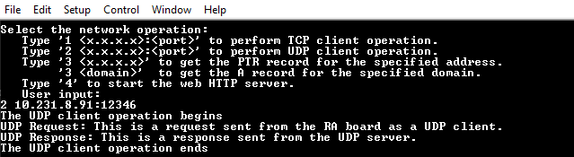

# Introduction #

This example project demonstrates Azure NetX Duo's networking capabilities using the Ethernet physical layer of the RA MCU. It leverages the NetX Duo network stack to execute various network operations, such as sending and receiving data over a network. The RA board will automatically obtain an IP address from the network using a DHCP (Dynamic Host Configuration Protocol) client service.

Once the RA board successfully acquires the IP address, users can interact with the system by selecting options from a menu, which is accessible via the RTT Viewer or a terminal application running on the host PC. After the RA board retrieves its IP address from the router, it will display the network configuration details, along with the available menu options, in the terminal application. This enables the user to explore different features and operations supported by the network stack.

The available operations include:
* TCP Client Service: Connect to a server, send a request, wait for a response from the server, and disconnect from the server.
* UDP Client Service: Send a request and wait for a response from the server.
* DNS Client Service: Retrieves both the A record (forward lookup) and PTR record (reverse lookup), enabling the system to resolve domain names into IP addresses and vice versa.
* Web HTTP Server: Handle HTTP requests from the browser, including requesting the homepage, retrieving board network configuration, controlling onboard LEDs, and requesting the status of onboard LEDs.

The menu options:
* Type `1 <x.x.x.x>:<port>` to perform TCP client operation.
* Type `2 <x.x.x.x>:<port>` to perform UDP client operation.
* Type `3 <x.x.x.x>` to get the PTR record for the specified address. Type `3 <domain>` to get the A record for the specified domain.
* Type `4` to start the web HTTP server.

Notes: 
* To display information, users can select between the SEGGER J-Link RTT Viewer and the Serial Terminal (UART) with J-Link OB VCOM. 
* By default, the EP information is printed to the host PC via the Serial Terminal.
* To use the SEGGER J-Link RTT Viewer instead of the Serial Terminal, please follow the instructions in the NetX_tcp_udp_notes.md file.

Please refer to the [Example Project Usage Guide](https://github.com/renesas/ra-fsp-examples/blob/master/example_projects/Example%20Project%20Usage%20Guide.pdf) 
for general information on example projects and [readme.txt](./readme.txt) for specifics of operation.

## Required Resources ## 
To build and run the NetX_tcp_udp example project, the following resources are needed.

### Hardware Requirements ###
* Supported RA boards: EK-RA8D1, EK-RA6M3, EK-RA6M3G, EK-RA6M4, EK-RA6M5, EK-RA8M1
* 1 x Ethernet router with an internet connection
* 2 x Ethernet cables to connect the RA board and the host PC to the router
* 1 x Micro USB cable for programming, debugging, and status display on the terminal (Tera Term or SEGGER RTT J-Link Viewer)

### Hardware Connections  ###
* Power on the Router: Ensure the router is powered on and properly connected to the internet. Verify that the router’s LAN ports are active and available for connections.
* Connect the RA Board to the Router: Take an Ethernet cable and connect one end to the Ethernet port on the RA board, and the other end to one of the router's available LAN ports. This connection allows the RA board to communicate with the network and obtain an IP address via DHCP.
* Connect the Host PC to the Router: Using a second Ethernet cable, connect the host PC to another LAN port on the same router. This step ensures that both the RA board and the host PC are on the same network, enabling communication between them for debugging and menu operations.
* Connect the RA Board to the Host PC: Using a micro-USB cable, connect the RA board to the host PC. This connection is necessary for programming the RA board, enabling debugging, and displaying runtime information in the terminal or RTT Viewer on the host PC.
* By following these steps, you'll establish proper hardware connections between the RA board, the router, and the host PC, ensuring smooth network communication and debugging capabilities.
* For EK-RA8D1: Set the configuration switches (SW1) as below.
    | SW1-1 PMOD1 | SW1-2 TRACE | SW1-3 CAMERA | SW1-4 ETHA | SW1-5 ETHB | SW1-6 GLCD | SW1-7 SDRAM | SW1-8 I3C |
    |-------------|-------------|--------------|------------|------------|------------|-------------|-----------|
    |     OFF     |     OFF     |      OFF     |     OFF    |     ON     |     OFF    |     OFF     |    OFF    |
* For EK-RA8M1: Remove jumper J61 to enable Ethernet B.

### Software Requirements ###
* Renesas Flexible Software Package (FSP): Version 5.7.0
* e2 studio: Version 2024-10
* GCC ARM Embedded Toolchain: Version 13.2.1.arm-13-7
* Terminal Console Application: Tera Term version 4.99 or SEGGER RTT J-Link Viewer version 8.10f
* Web Browser Application: Microsoft Edge, Google Chrome.
* Socket Application: Sokit.

Refer to the software required section in [Example Project Usage Guide](https://github.com/renesas/ra-fsp-examples/blob/master/example_projects/Example%20Project%20Usage%20Guide.pdf)

Note: Sokit (Socket Application) setup on PC as TCP, UDP server
1. Download sokit tool form https://www.softpedia.com/get/Network-Tools/Misc-Networking-Tools/sokit.shtml
2. Once downloaded, extract the contents and start sokit.exe.
3. Once started, in the 'Server' tab configure the 'Network Setup'.
4. Input the server's IP address and the port number
    * For TCP: In the 'TCP Addr' field, enter the PC's IPv4 address. And in 'Port' field, enter the port number.
    * For UDP: In the 'UDP Addr' field, enter the PC's IPv4 address. And in 'Port' field, enter the port number.
    
Note: Please provide an unused port number. It is recommended to give port number greater than 10,000.

5. Start the TCP, UDP server on PC.
    * For TCP: Click the 'TCP Listen' button. This would start the TCP server on PC.
    * For UDP: Click the 'UDP Listen' button. This would start the UDP server on PC.
6. The connection log will display on the 'Output window' on the PC.
    * For TCP: The 'Output' window would display the message 'hh:mm:ss MSG start TCP server successfully!'.
    * For UDP: The 'Output' window would display the message 'hh:mm:ss MSG start UDP server successfully!'.
7. Now wait for the EP to connect to server.
8. Once the EP connects to the server, the 'Connections' window would display the IP address and port number of the client.
9. There are three user input buffers provided for sending messages i.e. 'Buf 1', 'Buf 2' and 'Buf 3'.
10. In one buffer, enter 'This is a response sent from the TCP server'.
11. While sending, select the IP address of the client i.e. the MCU from the 'Connections' window. 
12. And then click 'Send' button of the appropriate buffer to send message.
13. Messages received from the client will be displayed on the 'Output' window.
14. The 'Output' window and console display messages upon each transaction.
15. To stop the server
    * For TCP: Click the 'TCP Listen' button again. This would stop the server.
    * For UDP: Click the 'UDP Listen' button again. This would stop the server.

## Related Collateral References ##
The following documents can be referred to for enhancing your understanding of 
the operation of this example project:
- [FSP User Manual on GitHub](https://renesas.github.io/fsp/)
- [FSP Known Issues](https://github.com/renesas/fsp/issues)

# Project Notes #

## System Level Block Diagram ##
**The high-level block diagram of the system is shown below:**

**The Thread interaction flow diagram of the system is shown below:**

**The web server homepage of the system is shown below:**

## FSP Modules Used ##
List all the various modules that are used in this example project. Refer to the FSP User Manual for further details on each module listed below.

| Module Name | Usage | Searchable Keyword  |
|-------------|-----------------------------------------------|-----------------------------------------------|
| NetX Duo Web HTTP/HTTPS Server | The NetX Duo Web HTTP/HTTPS Server is used to access the NetX Duo Web HTTP/HTTPS Server library. | NetX Duo Web HTTP/HTTPS Server |
| NetX Duo DHCP IPv4 Client | The NetX Duo DHCP IPv4 Client is used to obtain IP addresses and network parameters, automating the process of configuring devices on IP networks. | NetX Duo DHCP |
| NetX Duo IP Instance | The NetX Duo IP instance is used for IP communication. The HTTPS Client uses IPv4. | NetX Duo IP |
| NetX Duo Packet Pool | The NetX Duo Packet Pool is used to send and receive data packets over a TCP network. | NetX Duo Packet Pool |
| NetX Duo Ethernet Driver | An Ethernet connection is required as a physical connection to the network. | NetX Duo Ethernet Driver |
| FileX on Block Media | The FileX on Block Media is used to configure the FileX system and media properties. | FileX on Block Media |
| Block Media SPI Flash | The Block Media SPI Flash is middleware that implements a block media interface using external SPI flash as a media area. | rm_block_media_spi |
| OSPI Flash | The OSPI Flash is used to communicate directly with the external flash chip. | r_ospi_b |

For EK-RA6M3, EK-RA6M3G, EK-RA6M4, EK-RA6M5

| Module Name | Usage | Searchable Keyword  |
|-------------|-----------------------------------------------|-----------------------------------------------|
| QSPI Flash | The QSPI Flash is used to communicate directly with the external flash chip. | r_qspi |

## Module Configuration Notes ##
This section describes FSP configuration properties that are important or different from those selected by default.

|   Module Property Path and Identifier   |   Default Value  |   Used Value   |   Reason   |
|-----------------------------------------|-------------------|----------------|------------|
| configuration.xml > BSP > Properties > Settings > Property > Main Stack Size (bytes) | 0x400 | 0x2000 | The stack size is increased to handle larger local variables required for the main thread. |
| configuration.xml > BSP > Properties > Settings > Property > Heap Size (bytes) | 0 | 0x2000 | Heap size is allocated to enable dynamic memory allocation for standard library functions. |
| configuration.xml > Net Link Thread > Properties > Settings > Property > Thread > Auto start | Enabled | Disabled | Manual control of when the Net Link thread starts allows better flow management. |
| configuration.xml > Net App Thread > Properties > Settings > Property > Thread > Auto start | Enabled | Disabled | Manual control of when the Net App Thread starts to ensure readiness of dependencies. |
| configuration.xml > Net App Thread > Properties > Settings > Property > Thread > Stack size (bytes) | 1024 | 4096 | Increased stack size to handle more complex operations or a larger number of local variables. |
| configuration.xml > g_fx_media0 Azure RTOS FileX on Block Media > Properties > Settings > Property > Module g_fx_media0 > Total Sectors | 65536 | 32 | Set for the specific total number of sectors of the block media. |
| configuration.xml > g_fx_media0 Azure RTOS FileX on Block Media > Properties > Settings > Property > Module g_fx_media0 > Bytes per Sector | 512 | 4096 | Set for the specific bytes per sector of the block media. |
| configuration.xml > g_rm_filex_block_media_0 FileX I/O (rm_filex_block_media) > Properties > Settings > Property > Module g_rm_filex_block_media_0 > Partition Number | 0 | 1 | Set for the specific partition number of the block media. |
| configuration.xml > g_rm_block_media0 Block Media SPI Flash (rm_block_media_spi) > Properties > Settings > Property > Module g_rm_block_media0 > Block count | 8192 | 32 | Set for the specific number of sectors of the external flash. |
| configuration.xml > g_ospi0 OSPI Flash (r_ospi_b) > Properties > Settings > Property > Common > DMAC Support | Disable | Enabled | DMAC support enabled to offload memory transfers and improve performance. |
| configuration.xml > g_ospi0 OSPI Flash (r_ospi_b) > Properties > Settings > Property > Module g_ospi0 > General > Channel | 0 | 1 | Set for the specific OSPI channel to interface with the external flash. |
| configuration.xml > g_ospi0 OSPI Flash (r_ospi_b) > Properties > Settings > Property > Module g_ospi0 > General > Initial Address Bytes | 4 | 3 | Set for the specific number of address bytes by default for the external flash. |
| configuration.xml > g_ospi0 OSPI Flash (r_ospi_b) > Properties > Settings > Property > Module g_ospi0 > Defaults > Command Definitions > Read Command | 0x13 | 0x03 | Set for the specific Read command for the 3-byte address mode of the external flash. |
| configuration.xml > g_ether_phy0 Ethernet (r_ether_phy) > Properties > Settings > Property > Module g_ether_phy0 > PHY-LSI Address | 0 | 5 | Configured to use a specific PHY-LSI address for network communication. |
| configuration.xml > g_external_irq_sw1 External IRQ (r_icu) > Properties > Settings > Property > Module g_external_irq_sw1 > Channel | 0 | 13 | Channel set to 13 to match the external interrupt pin. |
| configuration.xml > g_external_irq_sw1 External IRQ (r_icu) > Properties > Settings > Property > Module g_external_irq_sw1 > Callback | NULL | external_irq_sw1_callback | Callback function for handling external interrupts on SW1. |
| configuration.xml > g_external_irq_sw2 External IRQ (r_icu) > Properties > Settings > Property > Module g_external_irq_sw2 > Channel | 0 | 12 | Channel set to 12 to match the external interrupt pin. |
| configuration.xml > g_external_irq_sw2 External IRQ (r_icu) > Properties > Settings > Property > Module g_external_irq_sw2 > Callback | NULL | external_irq_sw2_callback | Callback function for handling external interrupts on SW2. |

For EK-RA6M3, EK-RA6M3G, EK-RA6M4, EK-RA6M5

|   Module Property Path and Identifier   |   Default Value  |   Used Value   |   Reason   |
|-----------------------------------------|-------------------|----------------|------------|
| configuration.xml > g_qspi0 OSPI Flash (r_qspi0) > Properties > Settings > Property > Module g_qspi0 > General > Channel | 0 | 1 | Set for the specific QSPI channel to interface with the external flash. |
| configuration.xml > g_qspi0 OSPI Flash (r_qspi0) > Properties > Settings > Property > Module g_qspi0 > General > Initial Address Bytes | 4 | 3 | Set for the specific number of address bytes by default for the external flash. |
| configuration.xml > g_qspi0 OSPI Flash (r_qspi0) > Properties > Settings > Property > Module g_qspi0 > Defaults > Command Definitions > Read Command | 0x13 | 0x03 | Set for the specific Read command for the 3-byte address mode of the external flash. |

## API Usage ##
The table below lists the FSP provided API used at the application layer in this example project.

**NetX Duo APIs**
| API Name    | Usage                                                                          |
|-------------|--------------------------------------------------------------------------------|
| nx_system_initialize | This API is used to initialize the basic NetX Duo system resources in preparation for use. |
| nx_packet_pool_create | This API is used to create a packet pool of the specified packet size in the memory area supplied by the user. |
| nx_packet_allocate | This API is used to allocate a packet from the specified pool and adjust the prepend pointer in the packet according to the type of packet specified. |
| nx_packet_data_append | This API is used to append data to the end of the specified packet. |
| nx_packet_data_retrieve | This API is used to copy data from the supplied packet into the supplied buffer. |
| nx_packet_release | This API is used to release a packet, including any additional packets chained to the specified packet. |
| nx_ip_create | This API is used to create an IP instance with the user supplied IP address and network driver. |
| nx_ip_link_status_change_notify_set | This API is used to configure the link status change notify callback function. |
| nx_ip_status_check | This API is used to check and optionally waits for the specified status of the primary network interface of a previously created IP instance. |
| nx_ip_driver_direct_command | This API is used to provide a direct interface to the application's primary network interface driver specified during the nx_ip_create call. |
| nx_ip_interface_physical_address_get | This API is used to retrieve the physical address of a network interface from the IP instance. |
| nx_ip_address_get | This API is used to retrieve the IPv4 address and its subnet mask of the primary network interface. |
| nx_arp_enable | This API is used to initialize the ARP component of NetX Duo for the specific IP instance. |
| nx_icmp_enable | This API is used to enable the ICMP component for the specified IP instance. |
| nx_icmp_ping | This API is used to send a ping request to the specified IP address and waits for the specified amount of time for a ping response message. |
| nx_udp_enable | This API is used to enable the User Datagram Protocol (UDP) component of NetX Duo. |
| nx_tcp_enable | This API is used to enable the Transmission Control Protocol (TCP) component of NetX Duo. |
| nx_dhcp_create | This API is used to create a DHCP instance for the previously created IP instance. |
| nx_dhcp_packet_pool_set | This API is used to allow the application to create the DHCP Client packet pool by passing in a pointer to a previously created packet pool in this service call. |
| nx_dhcp_start | This API is used to start DHCP processing on all interfaces enabled for DHCP. |
| nx_dhcp_stop | This API is used to stop DHCP processing on all interfaces that have started DHCP processing. |
| nx_dhcp_reinitialize | This API is used to clear the host application network parameters, and clears the DHCP Client state on all interfaces enabled for DHCP. |
| nx_dhcp_user_option_retrieve | This API is used to retrieve the specified DHCP option from the DHCP options buffer on the first interface enabled for DHCP found on the DHCP Client record. |
| nx_tcp_socket_create | This API is used to create a TCP client or server socket for the specified IP instance. |
| nx_tcp_client_socket_bind | This API is used to bind the previously created TCP client socket to the specified TCP port. |
| nx_tcp_client_socket_unbind | This API is used to release the binding between the TCP client socket and a TCP port. |
| nx_tcp_client_socket_connect | This API is used to connect the previously created and bound TCP client socket to the specified server's port. |
| nx_tcp_socket_disconnect | This API is used to disconnect an established client or server socket connection. |
| nx_tcp_socket_receive | This API is used to receive TCP data from the specified socket. |
| nx_tcp_socket_send | This API is used to send TCP data through a previously connected TCP socket. |
| nx_udp_socket_create | This API is used to create a UDP socket for the specified IP instance. |
| nx_udp_socket_bind | This API is used to bind the previously created UDP socket to the specified UDP port. |
| nx_udp_socket_unbind | This API is used to release the binding between the UDP socket and a UDP port. |
| nx_udp_socket_receive | This API is used to receive a UDP data from the specified socket. |
| nx_udp_socket_send | This API is used to send a UDP data through a previously created and bound UDP socket for IPv4 networks. |
| nx_web_http_server_create | This API is used to create an HTTP Server instance, which runs in the context of its own ThreadX thread. |
| nx_web_http_server_start | This API is used to start a previously created HTTP or HTTPS Server instance. |
| nx_web_http_server_stop | This API is used to stop a previously created HTTP or HTTPS Server instance. |
| nx_web_http_server_callback_generate_response_header | This API is used to generate an HTTP response header in the HTTP(S) server callback routine, as defined by the application. |
| nx_web_http_server_callback_packet_send | This API is used to send a complete HTTP server response from an HTTP callback. |
| nx_dns_create | This API is used to create a DNS Client instance for the previously created IP instance. |
| nx_dns_packet_pool_set | This API is used to set a previously created packet pool as the DNS Client packet pool. |
| nx_dns_server_add | This API is used to add an IPv4 DNS Server to the server list. |
| nx_dns_host_by_name_get | This API is used to request name resolution of the supplied name from one or more DNS Servers previously specified by the application. |
| nx_dns_host_by_address_get | This API is used to request name resolution of the supplied IP address from one or more DNS Servers previously specified by the application. |

**ThreadX APIs**
| API Name    | Usage                                                                          |
|-------------|--------------------------------------------------------------------------------|
| tx_thread_resume | This API is used to resume a suspended thread. |
| tx_thread_suspend | This API is used to suspend a currently running thread. |
| tx_thread_sleep | This API is used to put the current thread to sleep for a specified number of ticks. |
| tx_thread_info_get | This API is used to retrieve information about a specific thread, such as its state, run count, etc. |
| tx_byte_pool_create | This API is used to create a byte memory pool that can be used for dynamic memory allocation. |
| tx_byte_allocate | This API is used to allocate a block of memory from a byte pool. |
| tx_byte_release | This API is used to release a previously allocated block of memory back to the byte pool. |
| tx_queue_create | This API is used to create a queue that can store and manage messages passed between threads. |
| tx_queue_send | This API is used to send a message to a previously created queue. |
| tx_queue_receive | This API is used to receive a message from a previously created queue. |
| tx_event_flags_create | This API is used to create an event flag group that can be used for thread synchronization. |
| tx_event_flags_set | This API is used to set one or more event flags in a specified event flag group. |
| tx_event_flags_get | This API is used to retrieve the event flags that have been set in a specified event flag group. |

**FileX APIs**
| API Name    | Usage                                                                          |
|-------------|--------------------------------------------------------------------------------|
| fx_system_initialize | This API is used to initialize the FileX file system, preparing it for use. |
| fx_media_open | This API is used to open and initialize a media instance for FileX file operations. |
| RM_FILEX_BLOCK_MEDIA_Open | This API is used to initialize the FileX Block Media interface for the block media driver. |
| RM_FILEX_BLOCK_MEDIA_BlockDriver | This API is used to access block media device functions such as open, close, read, write, and control operations on a block media device. |

## Verifying Operation ##
1. Import, generate, build, and flash the example project to the RA board using e2 studio on the host PC.
2. Open the terminal application on the host PC and connect to the RA board.
3. Wait for the RA board to obtain the IP address from the router.
4. The RA board's network configuration details and menu options will be displayed in the terminal application.
5. Verify TCP Client Operation:
    1. Launch a socket application on the host PC.
    2. Set up a TCP server by specifying the server's IP address and port number.
    3. Ensure that the server is configured to listen for incoming connections.
    4. In the terminal, type the command: `1 <x.x.x.x><port>`. For example, if the server's IP is `192.168.1.12` and the port is `12345`, type: `1 192.168.1.12:12345`.
    5. The RA board will send a TCP request to the server.
    6. The socket application will display the TCP request.
    7. In the socket application, type any data and click Send to respond to the RA board.
    8. The RA board will display the received data in the terminal application.
6. Verify UDP Client Operation:
    1. Launch a socket application on the host PC.
    2. Set up a UDP server by specifying the server's IP address and port number.
    3. Ensure that the server is configured to listen for incoming connections.
    4. In the terminal, type the command: `2 <x.x.x.x><port>`. For example, if the server's IP is `192.168.1.12` and the port is `12345`, type: `2 192.168.1.12:12345`.
    5. The RA board will send a UDP request to the server.
    6. The socket application will display the UDP request.
    7. In the socket application, type any data and click Send to respond to the RA board.
    8. The RA board will display the received data in the terminal application.
7. Verify DNS Client Operation:
    * Request a PTR record for an IP address:
        1. In the terminal, type: `3 <x.x.x.x>`. For example, if the IP address is `192.168.1.12`, type: `3 192.168.1.12`.
        2. The RA board will receive and display the PTR record data.
    * Request an A record for a domain:
        1. In the terminal, type: `3 <domain>`. For example, if the domain name is `renesas.com`, type: `3 renesas.com`.
        2. The RA board will receive and display the A record data.
8. Verify Web Server Operation:
    1. In the terminal, type '4 to start the web server.
    2. Open a web browser on the host PC.
    3. In the URL bar, type: `<x.x.x.x>/index.html` and press Enter, where `<x.x.x.x>` is the IP address of the RA board.
    4. The browser will display the network configuration and LED control panel.
    5. In the LED control panel on the webpage, click on the SW1 or SW2 buttons to toggle LED1 or LED2 on the RA board.
    6. Click on SW1 or SW2 buttons on the RA board to toggle LED1 or LED2.
    7. The RA board will update the LED states dynamically on the webpage.
    8. In the terminal, type any character to stop the web server.

### Note: ###
* For the Serial Terminal application: The macro USE_VIRTUAL_COM is set to 1.
    1. To echo back typed content in Tera Term, go to [Setup] -> [Terminal...] and check [Local echo].
    2. The configuration parameters of the serial port are:
        - COM port: Provided by the J-Link on-board.
        - Baud rate: 115200 bps
        - Data length: 8 bits
        - Parity: None
        - Stop bit: 1 bit
        - Flow control: None

### The below images showcase the output on the Serial terminal application (Tera Term) ###
**The EP information**

**The TCP client operation**

**The UDP client operation**

**The DNS client operation**

**The Web http server operation**

### The below images showcase the output on the SEGGER J-Link RTT Viewer ###
**The EP information**

**The TCP client operation**

**The UDP client operation**

**The DNS client operation**

**The Web http server operation**

## Special Topics ##
* The `src/webserver` folder contains all the necessary files for the web HTTP server functionality.
* The `src/webserver/website` folder contains all the resources that will be served by the web server.
    * The `index.html` file is the main HTML file for the homepage of the website.
    * The `script.js` file includes all the JavaScript functions used to create dynamic content on the website.
    * The `logo.png` file is the logo displayed on the homepage.
    * The `favicon.ico` file is the small icon that appears in the browser tab for the website.
* The `src/webserver/website.bin` is a file system image containing all the files from the `website` folder in FAT12 format. This image is loaded into the external OSPI flash on the RA board to support FileX operations, which serve as a file system dependency for the web HTTP server.
