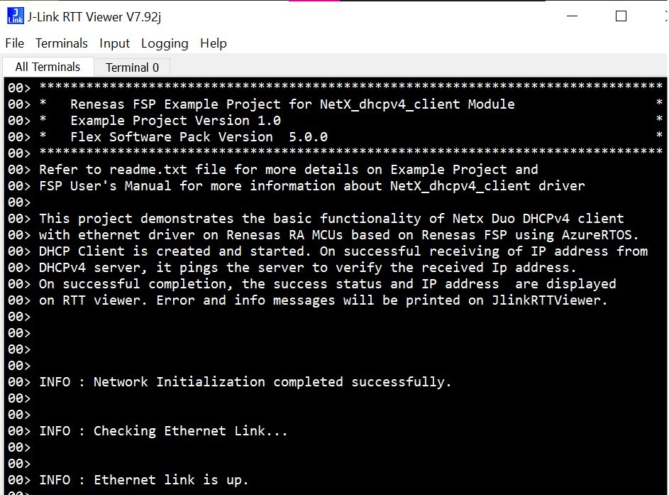

# Introduction #

The sample code accompanying this file shows the operation of a NetX Duo DHCPv4 Client on a RA MCU using Azure RTOS. 
In this sample code, a NetX Duo IP instance is created with IP address as (default 0.0.0.0 - Not assigned). 
The NetX stack is enabled for UDP, ICMP, and ARP. DHCP Client uses the UDP for sending and receiving DHCP messages. 
DHCP Client creates its own packet pool based on the settings minimum packet payload size and number of packets in the packet pool. 
When DHCP Client is created and started, DHCP messages are exchanged, it waits for the valid IP address to be assigned from the DHCPv4 server.
After the successful DHCP messages are exchanged server leases and assigns the IP address to the client, now the Board can ping to the DHCP server. 
When the server assigns the client an IP address, it may also supply other network information, such as a DNS server. 
The status and IP address lease times are displayed on the JlinkRTTViewer.

NetX Duo DHCP Client is compliant with [RFC2132](https://tools.ietf.org/html/rfc2132), [RFC2131](https://tools.ietf.org/html/rfc2131).

Please refer to the [Example Project Usage Guide](https://github.com/renesas/ra-fsp-examples/blob/master/example_projects/Example%20Project%20Usage%20Guide.pdf) 
for general information on example projects and [readme.txt](./readme.txt) for specifics of operation.

## Required Resources ##
To build and run the dhcpv4 client example project, the following resources are needed.

### Hardware ###
* Renesas RA™ MCU kit
* Micro USB cable
* Host Machine
* Ethernet cable
* Ethernet switch/hub

Refer to [readme.txt](./readme.txt) on information on how to connect the hardware.

### Software ###
Refer to software requirements mentioned in [Example Project Usage Guide](https://github.com/renesas/ra-fsp-examples/blob/master/example_projects/Example%20Project%20Usage%20Guide.pdf)

## Related Collateral References ##
The following documents can be referred to for enhancing your understanding of 
the operation of this example project:
- [FSP User Manual on GitHub](https://renesas.github.io/fsp/)
- [FSP Known Issues](https://github.com/renesas/fsp/issues)

# Project Notes #

## System Level Block Diagram ##

## FSP Modules Used ##
List all the various modules that are used in this example project. Refer to the FSP User Manual for further details on each module listed below.

| Module Name | Usage  | Searchable Keyword (using New Stack > Search) |
|-------------|-----------------------------------------------|-----------------------------------------------|
| NetX Duo DHCP IPV4 Client | DHCPV4 module is used to obtain IP addresses, network parameters and to automate the process of configuring devices on IP networks, thus allowing them to use network services such as DNS, NTP, and any communication protocol based on UDP or TCP | dhcp |

## Module Configuration Notes ##
This section describes FSP Configurator properties which are important or different than those selected by default. 

|   Module Property Path and Identifier   |   Default Value   |   Used Value   |   Reason   |
| :-------------------------------------: | :---------------: | :------------: | :--------: |
|   configuration.xml -> BSP > Properties > Settings > Property >Main Stack Size (bytes)| 0x400 |0x1000| Main Program thread stack is configured to store the local variables of different functions in the code. |
|   configuration.xml -> BSP > Properties > Settings > Property > Heap Size (bytes)| 0 |0x2000| Heap size is required for standard library functions to be used. |
|   configuration.xml -> g_dhcp_client0 NetX Duo DHCP IPv4 Client > Settings > Property > Common > DHCP > Client > IPv4 > Persistent client state  |   Disable   |   Enable   |  Persistent client state property is enabled to obtain a record of the current client state.  |
|   configuration.xml -> DHCP Client Thread > Settings > Property > Thread > Stack Size  |   1024   |   2048   |   This is changed to handle its worst-case function call nesting and local variable usage.   |
|   configuration.xml -> DHCP Client Thread > Settings > Property > Thread > priority  |   1   |   3   |   DHCP Client thread priority is lowered to allow the IP thread to process incoming packets at the fastest rate possible.   |
|   configuration.xml -> RTT Thread > Settings > Property > Thread > priority  |   1   |   4   |   RTT thread priority is lowered to allow the DHCP Client and IP threads to process incoming packets at the fastest rate possible.   |

## API Usage ##

The table below lists the DHCP Client API used at the application layer by this example project.

| API Name    | Usage                                                                          |
|-------------|--------------------------------------------------------------------------------|
|nx_ip_driver_direct_command| This API is used to issue command to network driver. |
|nx_dhcp_state_change_notify| This API is used to notify application of DHCP state change.|
|nx_dhcp_start| This API is used to start DHCP processing .|
|nx_ip_address_get| This API is used to retrieve IP address and network mask .|
|nx_dhcp_server_address_get| This API is used to get the DHCP Client’s DHCP server IP address .|
|nx_icmp_ping| This API is used to send ping request to specified IP address|
|nx_packet_release| This API is used to release previously allocated packet .| 
|nx_dhcp_client_get_record| This API is used to obtain a record of the current client state .| 
|nx_dhcp_stop| This API is used to stop DHCP processing .| 
|nx_dhcp_reinitialize| This API is used to clear the DHCP client network parameters .| 
|nx_ip_status_check| This API is used to check status of an IP instance .| 
|nx_dhcp_user_option_retrieve| This API is used to retrieve a DHCP option from last server response .| 
|nx_dhcp_release| This API is used to release the IP address back to the Server .| 
|nx_dhcp_delete| This API is used to delete a DHCP instance .|

## Verifying operation ##
Import, Build and Debug the EP(see section Starting Development of **FSP User Manual**). After running the EP, open rtt viewer to see the output.
Before running the example project, refer the below steps for hardware connections :
* Connect RA MCU debug port to the host PC via a micro USB cable. 
* Connect an Ethernet cable to the RJ45 connector on RA MCU via ethernet switch/hub which is connected to Router or LAN where DHCP server is residing.
* A DHCP Server needs to exist on the network to assign  an IP address to the RA MCU running this DHCP Client Example Project.

Below image showcases the hardware connection setup required for running the EP :

Below images showcases the output on JLinkRTT_Viewer :

## Special Topics ##
