# Introduction #

This project demonstrates the basic functionality of NetX Duo FTP client  with ethernet interface on Renesas RA MCUs based on Renesas FSP using AzureRTOS. In this example project, user should provide a static ip address* in Netx Duo IP instance based on their network environment. In this project NetX stack is enabled for TCP, ARP, ICMP. FTP Client utilizes the reliable Transmission Control Protocol (TCP) services to perform its data transfer. FTP Client is created and started. FTP client gets connected to FTP server and performs the read/write operation in the created file on FTP server and gets disconnected from FTP server. The status messages are displayed on the Jlink RTT Viewer. 

NetX Duo FTP is compliant with [RFC 959](https://datatracker.ietf.org/doc/html/rfc959), [RFC 2428](https://datatracker.ietf.org/doc/html/rfc2428) and related RFCs.

***Note:** In example project, Netx Duo IP instance is having a static ip address from our test setup environment.

Please refer to the [Example Project Usage Guide](https://github.com/renesas/ra-fsp-examples/blob/master/example_projects/Example%20Project%20Usage%20Guide.pdf) 
for general information on example projects and [readme.txt](./readme.txt) for specifics of operation.

## Required Resources ##
To build and run the FTP client example project, the following resources are needed.

### Hardware ###
* Renesas RA™ EK-RA6M3/EK-RA6M4/EK-RA6M5/EK-RA8M1 MCU kit with ethernet support
* Micro USB cable
* Ethernet Switch
* LAN Cable
* HOST Machine

Refer to [readme.txt](./readme.txt) for information on how to connect the hardware or refer the below steps for hardware connections:

i.  Connect RA MCU debug port to the host PC via a micro USB cable. 

ii. Connect an Ethernet cable to the RJ45 connector on RA MCU via Ethernet switch or Router which is connected to the Host machine where the FTP Server is running.

Below image showcases the hardware connection setup required for running the EP :

### Software ###
1. Refer to the software required section in [Example Project Usage Guide](https://github.com/renesas/ra-fsp-examples/blob/master/example_projects/Example%20Project%20Usage%20Guide.pdf)
2. Refer to **Special Topics** for configuring the [Filezilla](https://filezilla-project.org/download.php?type=server) as FTP server 

 
## Related Collateral References ##
The following documents can be referred to for enhancing your understanding of 
the operation of this example project:
- [FSP User Manual on GitHub](https://renesas.github.io/fsp/)
- [FSP Known Issues](https://github.com/renesas/fsp/issues)

# Project Notes #

## System Level Block Diagram ##
 High level block diagram
 
 
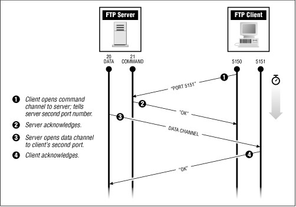

## FSP Modules Used ##
List all the various modules that are used in this example project. Refer to the FSP User Manual for further details on each module listed below.

| Module Name | Usage | Searchable Keyword  |
|-------------|-----------------------------------------------|-----------------------------------------------|
|Netx Duo FTP Client| FTP client module is used to connect with FTP server to perform write/read operations in the created file on FTP server.| Azure rtos -> Netx Duo -> ftp client|
| Netx Duo IP Instance | Board IP address should be provided as ftp client | Netx Duo IP|
| Netx Duo Packet Pool |Data packets to be created to send and receive over tcp network  | Netx Duo Packet Pool  |
| Netx Duo Ethernet driver | Ethernet connection should require as physical connection to connect over network | rm_netx_duo_ether |

## Module Configuration Notes ##
This section describes FSP Configurator properties which are important or different than those selected by default. 

|   Module Property Path and Identifier   |   Default Value   |   Used Value   |   Reason   |
| :-------------------------------------: | :---------------: | :------------: | :--------: |
| configuration.xml -> BSP > Properties > Settings > Property >Main Stack Size (bytes)| 0x400 |0x1000| Main Program thread stack is configured to store the local variables of different functions in the code. |
| configuration.xml -> BSP > Properties > Settings > Property > Heap Size (bytes)| 0 |0x1000| Heap size is required for standard library functions to be used |
| configuration.xml -> FTP Client Thread -> Properties > Settings > Property >Thread > Priority| 1 | 3 |FTP Client thread priority is lowered to allow the IP thread to process incoming packets at the fastest rate possible.|
| configuration.xml -> FTP Client Thread -> Properties > Settings > Property >Module g_ip0 Netx Duo IP Instance > IPV4 Address| 192.168.0.2 | 132.158.124.122 | Current IP settings are provided as per our test environment. User has to modify this ip address according to their network settings|
| configuration.xml -> FTP Client Thread -> Properties > Settings > Property >Module g_ip0 Netx Duo IP Instance > Subnet Mask| 255.255.255.0 | 255.255.255.128 | Current subnet mask is provided as per our test environment. User has to modify this subnet mask according to their network settings|
| configuration.xml -> FTP Client Thread -> Properties > Settings > Property >Module g_ip0 Netx Duo IP Instance > Default Gateway Address| 0.0.0.0 | 132.158.124.1 | Current Default Gateway address is provided as per our test environment. User has to modify this Gateway Address according to their network settings|
| configuration.xml -> RTT Thread -> Properties > Settings > Property >Thread > Priority| 1 | 5 | RTT thread priority is lowered to allow the FTP Client and IP threads to process incoming packets at the fastest rate possible.|

The table below lists the FSP provided API used at the application layer by this example project.

| API Name    | Usage                                                                          |
|-------------|--------------------------------------------------------------------------------|
|nx_ftp_client_create|This API creates an FTP instance|
|nxd_ftp_client_connect|This API is used to connect the FTP server at the supplied IP address|
|nx_ftp_client_file_open|This API opens the specified file for writing/reading on FTP server|
|nx_packet_allocate|This API is used to allocate the FTP packet|
|nx_packet_data_append|This API is used to append the packet data on the opened file|
|nx_ftp_client_file_read |This API reads the packets from the opened file|
|nx_ftp_client_file_write|This API writes a packet of data to the opened file on the FTP server|
|nx_ftp_client_file_close|This API closes the opened file on the FTP server|
|nx_ftp_client_disconnect|This API disconnects from the FTP server|
|nx_ftp_client_delete|This API is used to delete the FTP client instance|

## Verifying operation ##

Import, Build and Debug the EP(see section Starting Development of FSP User Manual). After running the EP, open RTT viewer to see the output.

Below images showcases the output on JLinkRTT_Viewer :

 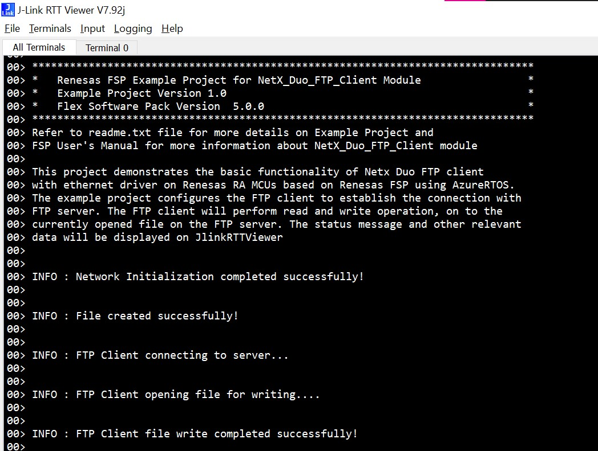
 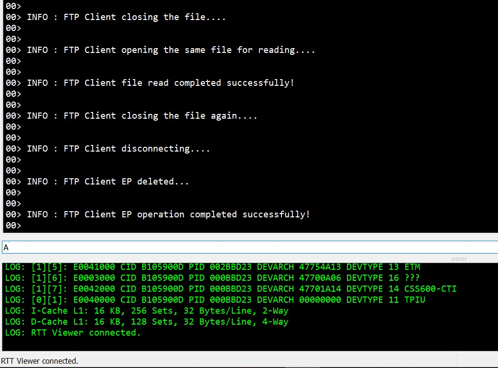

## Special Topics ##

[Filezilla](https://filezilla-project.org/download.php?type=server) should be running on the same local network.

Server should be configured with the username and password for authentication purpose of FTP client. Please follow below steps for configuring the FTP Server

**1. Setting up the Filezilla server**:

Following steps guide you on how to configure the filezilla server.

1. Download the [Filezilla](https://filezilla-project.org/download.php?type=server) server and install in the host machine. By default, FileZilla Server runs using the SYSTEM windows user account with full control permisions, or user can provide Account user name and Account password to run with different Windows user account. Click **Next**

  

2. Then, User need to choose the listening port and administration password. By default, listening port is **14148**.

  

3. Based on the installation settings, you need to fill in the information as shown in the below image. Then Click on **OK** to connect.

  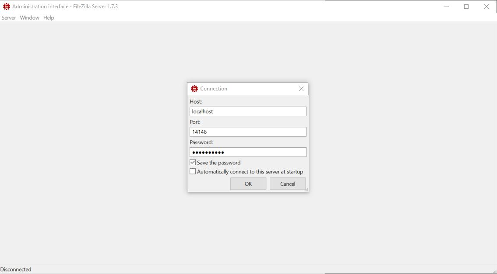

4. Upon clicking on **Connect** button, filezilla server is connected and it is waiting for authentication viz., **username** and **password**.

  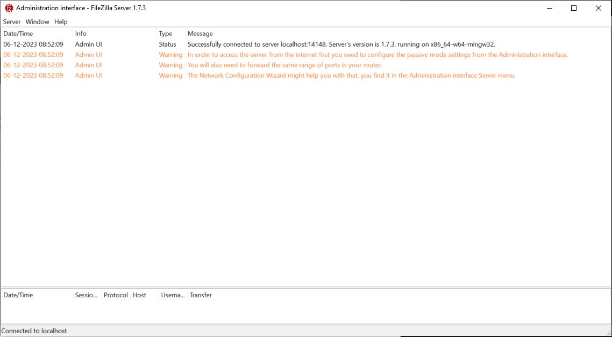
 
 
5. Now click on **Server** -> **Configure...** to configures the user account as shown in the below image. Click Users.

  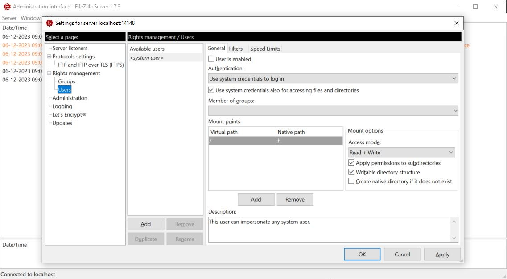

6. Now click on **Add** button as shown in the below image, please provide username into the field.

  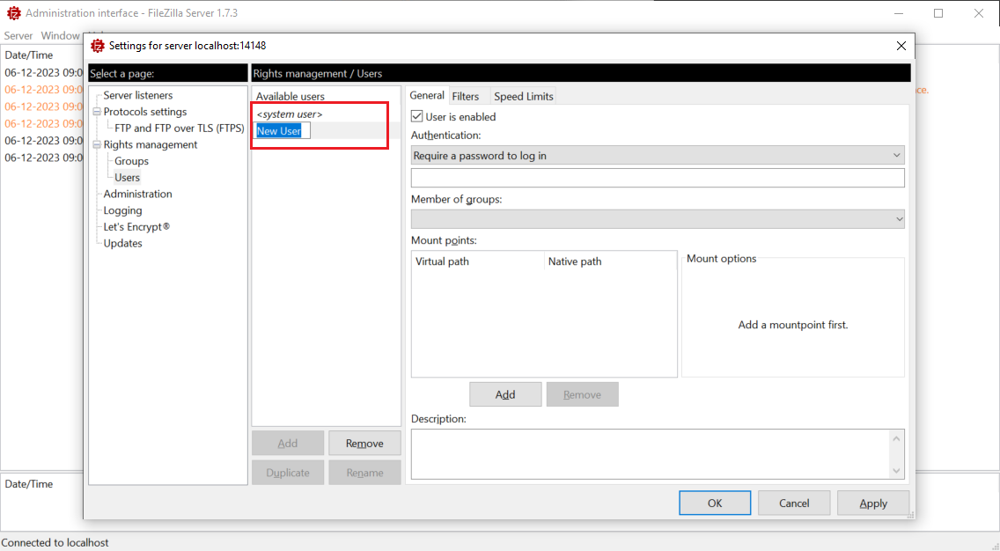 
 
7. Now provide password into the black field as shown in the below image.

  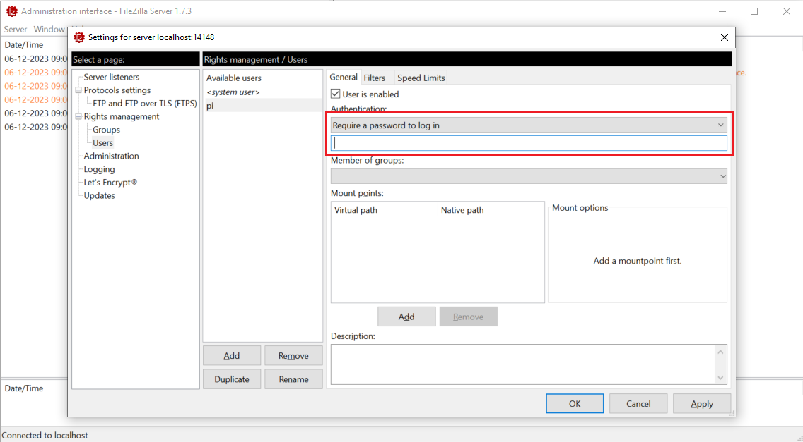
 
8. Now **Users** has been registered with the registered **username** and **password**.
 
  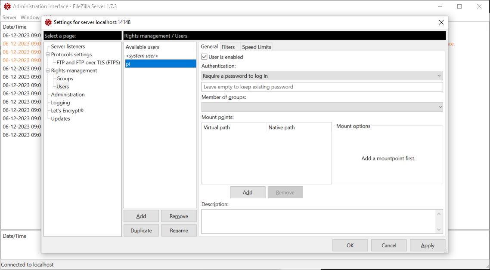
 
9. Next, choose the shared folder at **Mount points** option as shown in the below image.
 
  
 
10. Now click on **Add** and provide the **Virtual path** and **Native path**. The native path is a local file path, the virtual path is the path that the FTP users will see and it is mapped to the native path by FileZilla Server
 
  

11. After provide the folder path, now **Check/Uncheck** the appropriate file settings at the **Mount options** like **Read Only**, **Read + Write** etc., as shown in the below image and click **OK**

  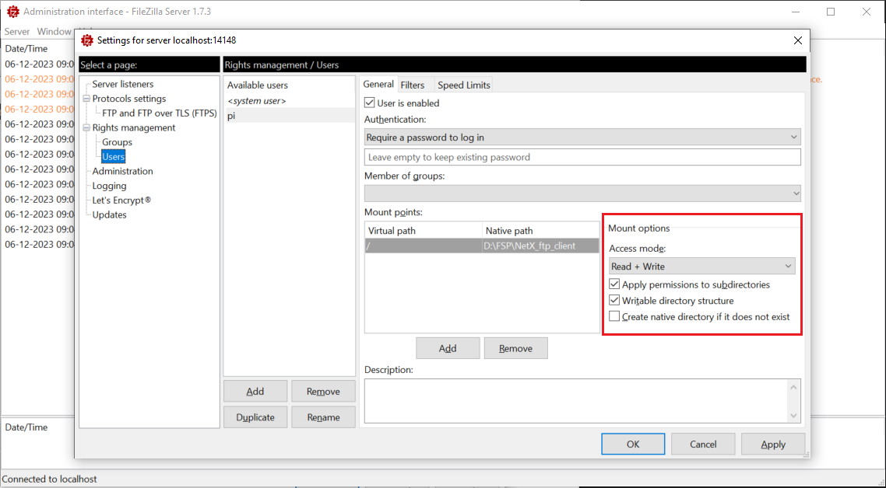
 
12. Upon successfully created account settings, FileZilla server displays the message as shown in the below image and now it's ready to connect the FTP client
 
  

13. Now user configures credentials SERVER IP address. Get credentials SERVER IP address by: open **command prompt**, type **ipconfig** (incase using window) and get IP address, Subnet Mask, Default Gateway.

  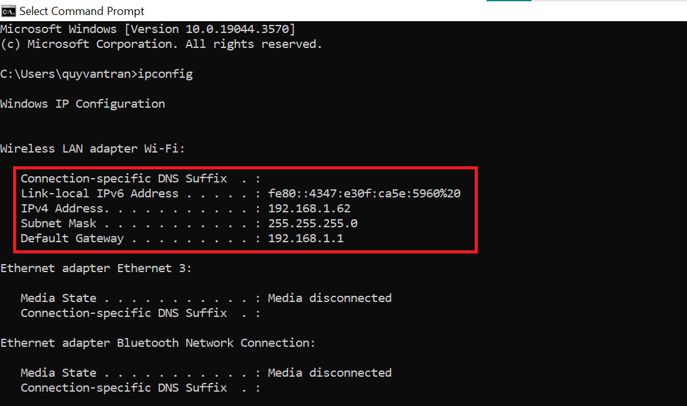

14. Now user should provide credentials SERVER IP address into FileZilla Server by click on **Server** -> **Configures...** -> **Server Listener** as shown in the below image.

  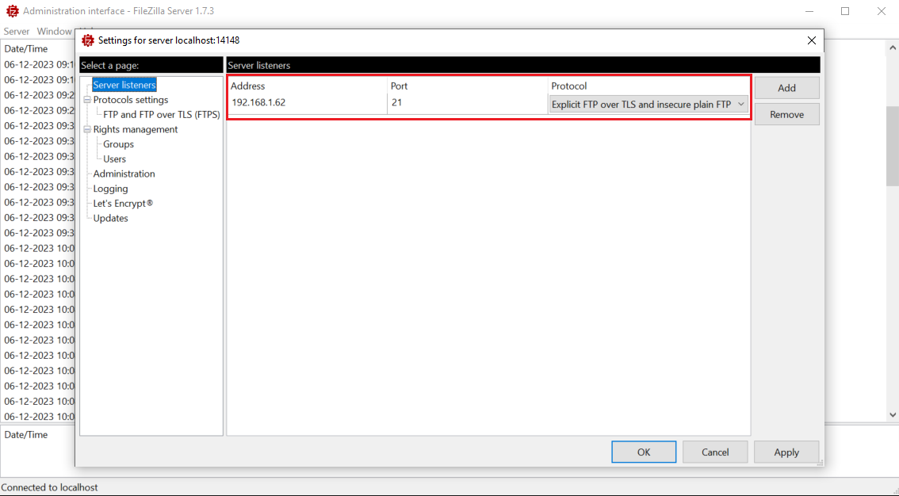
  
15. Now user should update the code according to their server settings under **user_app.h** file in ftp_client ep as shown in the below image.
 
  

16. Next, update the **Subnet Mask**, **Default Gateway Address** as the information from step **12**. **IPv4 Address** is client ip address, it should same **Network ID** with server ip.

  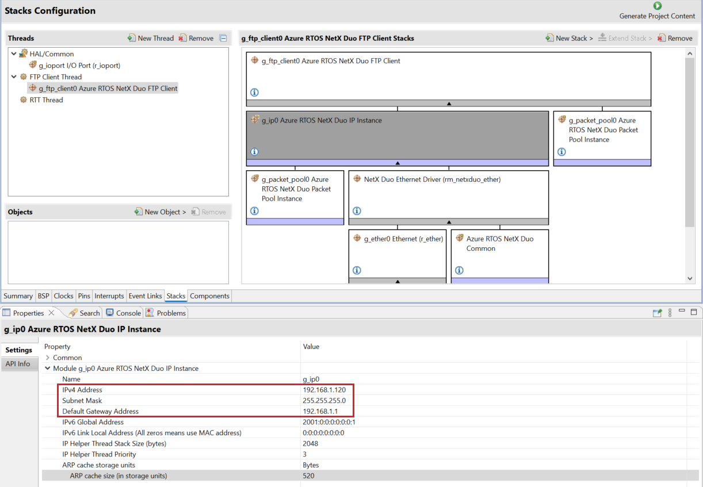
  
17. After update in the code, build and run the ftp_client ep. FileZilla server status messages will display as shown in the below image upon successful communication.
 
  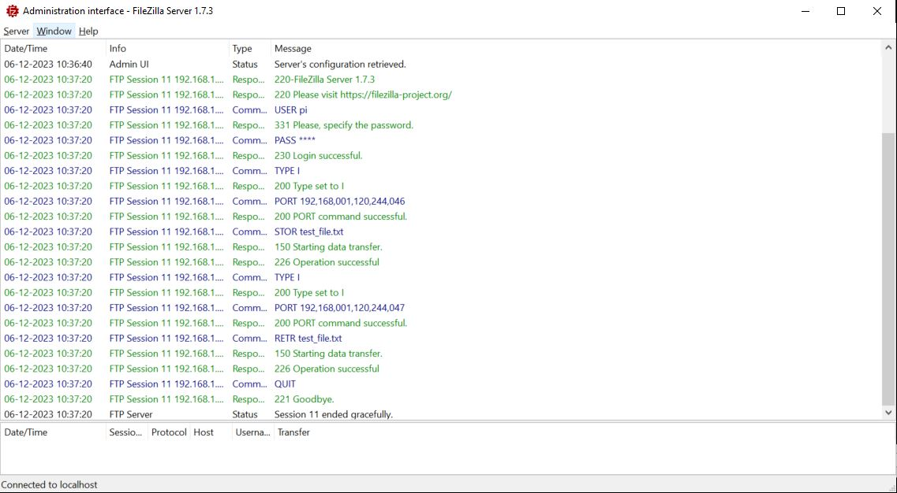
  
