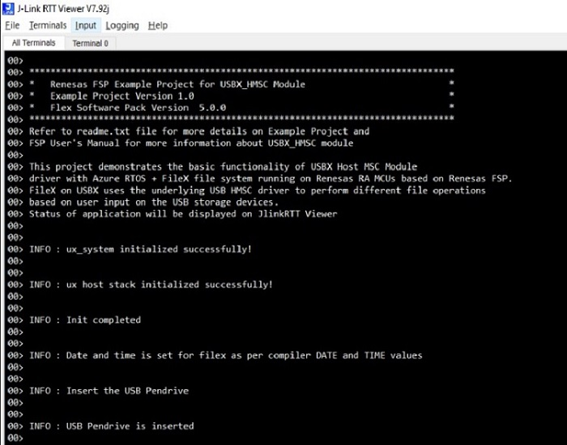
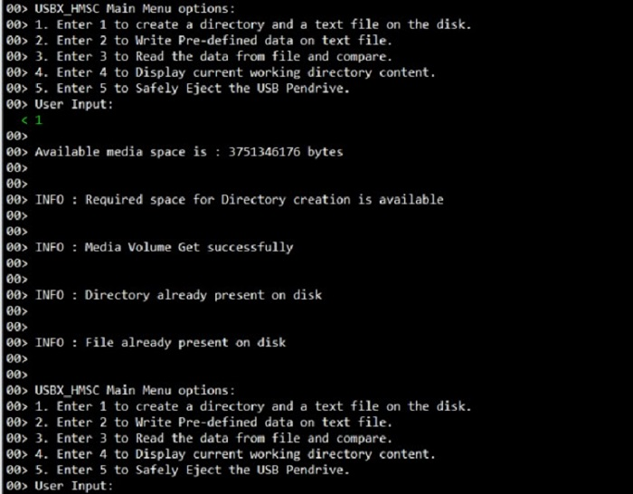
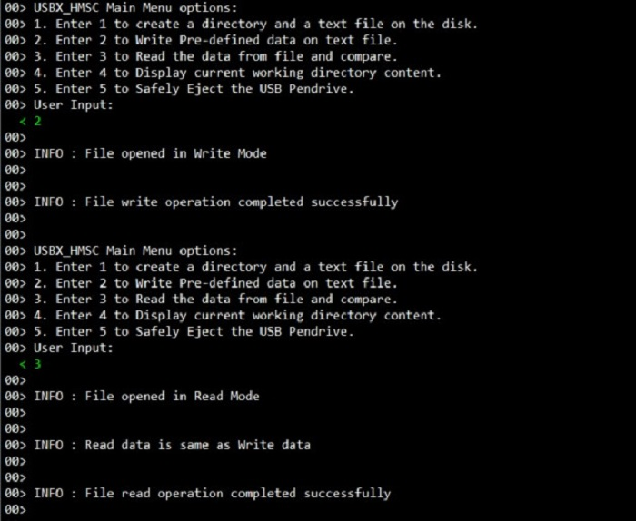
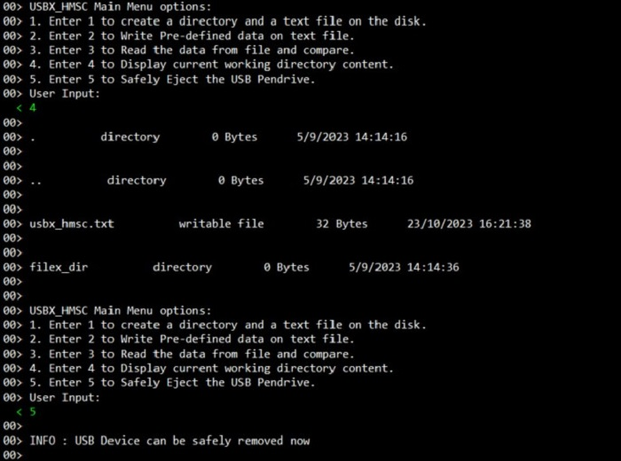

# Introduction #

This project demonstrates the basic functionality of USBX Host MSC module using FileX on Renesas RA MCUs based on Renesas FSP using AzureRTOS. FileX interface on USBX uses the underlying
HMSC driver to perform various file operations such as File create, Write, Read, Display current directory and Eject the USB Pendrive.
These operations are done via FileX interface, on underlying USBX_HMSC driver based on user input from the RTT Viewer.
The application status messages will be displayed on the Jlink RTT Viewer.

Please refer to the [Example Project Usage Guide](https://github.com/renesas/ra-fsp-examples/blob/master/example_projects/Example%20Project%20Usage%20Guide.pdf) 
for general information on example projects and [readme.txt](./readme.txt) for specifics of operation.

## Required Resources ## 
To build and run the USBx HMSC ACM example project, the following resources are needed.

### Hardware ###
* Renesas RA™ MCU kit - 1x
* USB A to USB Micro B Cable - 1x
* OTG cable: Micro to USB Host (Female) - 1x
* USB Pendrive - 1x

Refer to [readme.txt](./readme.txt) for information on how to connect the hardware.

### Software ###
1. Refer to the software required section in [Example Project Usage Guide](https://github.com/renesas/ra-fsp-examples/blob/master/example_projects/Example%20Project%20Usage%20Guide.pdf)

## Related Collateral References ##
The following documents can be referred to for enhancing your understanding of 
the operation of this example project:
- [FSP User Manual on GitHub](https://renesas.github.io/fsp/)
- [Microsoft Azure USBX Host Class API ](https://docs.microsoft.com/en-us/azure/rtos/usbx/usbx-host-stack-5)
- [FSP Known Issues](https://github.com/renesas/fsp/issues)

# Project Notes #

## System Level Block Diagram ##
 High level block diagram
 
 

## FSP Modules Used ##
List all the various modules that are used in this example project. Refer to the FSP User Manual for further details on each module listed below.

| Module Name | Usage | Searchable Keyword  |
|-------------|-----------------------------------------------|-----------------------------------------------|
|FileX on USBX|  With FileX on USBX HMSC driver, user can perform different file operation or store data on the USB Pendrive. | USBX |
|USBX HMSC | This module provide a USBX Host Mass storage class support on RA device. Using USBX HMSC in combination with a file system it is possible to communicate with USB storage devices.| HMSC|
|USB Basic Driver | USB driver operates in combination with the device class drivers provided by Renesas to form a complete USB stack.|r_usb_basic|
|DMAC Transfer | DMAC is used to transfer the usb data for faster rate without using the CPU.  | r_dmac  |

## Module Configuration Notes ##
This section describes FSP Configurator properties which are important or different than those selected by default. 

**Common Configuration properties**

|   Module Property Path and Identifier   |   Default Value   |   Used Value   |   Reason   |
| :-------------------------------------: | :---------------: | :------------: | :--------: |
| configuration.xml -> HMSC Thread -> Properties > Settings > Property >Common > Timer> Timer Ticks Per Second |100 | 1000 |The default UX_PERIODIC_RATE ticks should be 1000 indicating 1 tick per millisecond.|
| configuration.xml -> HMSC Thread -> Properties > Settings > Property >Thread > Priority| 1 | 14 |HMSC thread priority is lowered to allow the other usb operations at faster rate.|
| configuration.xml -> RTT Thread -> Properties > Settings > Property >Thread > Priority| 1 | 15 | RTT thread priority is lowered to allow the USBX HMSC data process at the fastest rate possible.|
| configuration.xml -> HMSC Thread Stacks -> g_basic0 Instance > Properties > Settings > Property > Common >DMA Support| Disable | Enable | DMA is enabled to off load the MCU processing and provide priorities for data transfer. |

**Configuration Properties for using USBHS**

|   Module Property Path and Identifier   |   Default Value   |   Used Value   |   Reason   |
| :-------------------------------------: | :---------------: | :------------: | :--------: |
| configuration.xml -> HMSC Thread Stacks -> g_basic0 Instance > Properties > Settings > Property > g_basic0 > USB Speed| Full-Speed | Hi-Speed | This property is used to configure USB speed. |
| configuration.xml -> HMSC Thread Stacks -> g_basic0 Instance > Properties > Settings > Property > Common >DMA Source Address| DMA Disabled | HS Address | USB basic driver is configured USB Speed as High Speed. Accordingly, DMA Source Address is provided with HS Address.|
| configuration.xml -> HMSC Thread Stacks -> g_basic0 Instance > Properties > Settings > Property > Common >DMA Destination Address| DMA Disabled | HS Address | USB basic driver is configured USB speed as High Speed (Default). Accordingly, DMA Destination Address is provided with HS Address. |
| configuration.xml -> HMSC Thread Stacks -> g_basic0 Instance > Properties > Settings > Property > g_basic0 > USB Module Number | USB_IP0_Port | USB_IP1_Port | This property is used to specify USB module number to be used as per configured USB speed. |
| configuration.xml -> HMSC Thread Stacks -> g_transfer0 Transfer Driver on r_dmac Instance > Properties > Settings > Property > Module g_transfer0 Transfer driver > Activation Source| No ELC Trigger | USBHS FIFO 1 (DMA Transfer request 1)  |This is an event trigger for DMA transfer 0 instance for destination pointer address.|
| configuration.xml -> HMSC Thread Stacks -> g_transfer1 Transfer Driver on r_dmac Instance > Properties > Settings > Property > Module g_transfer1 Transfer driver > Activation Source| No ELC Trigger | USBHS FIFO 0 (DMA Transfer request 0)  |This is an event trigger for DMA transfer 1 instance for source pointer address.|
| configuration.xml -> HMSC Thread Stacks -> g_transfer1 Transfer Driver on r_dmac Instance > Properties > Settings > Property > Module g_transfer1 Transfer driver > Transfer Size| 2 Bytes | 4 Bytes  | This is used to select DMAC transfer size. |
| configuration.xml -> HMSC Thread Stacks -> g_transfer0 Transfer Driver on r_dmac Instance > Properties > Settings > Property > Module g_transfer0 Transfer driver > Transfer Size| 2 Bytes | 4 Bytes  |This is used to select DMAC transfer size. |

**Configuration Properties for using USBFS**

|   Module Property Path and Identifier   |   Default Value   |   Used Value   |   Reason   |
| :-------------------------------------: | :---------------: | :------------: | :--------: |
| configuration.xml -> HMSC Thread Stacks -> g_basic0 Instance > Properties > Settings > Property > Common > DMA Source Address| DMA Disabled | FS Address | USB basic driver is configured USB Speed as Full Speed. Accordingly, DMA Source Address is provided with FS Address.|
| configuration.xml -> HMSC Thread Stacks -> g_basic0 Instance > Properties > Settings > Property > Common > DMA Destination Address| DMA Disabled | FS Address | USB basic driver is configured USB speed as Full Speed (Default). Accordingly, DMA Destination Address is provided with FS Address. |
| configuration.xml -> HMSC Thread Stacks -> g_transfer0 Transfer Driver on r_dmac Instance > Properties > Settings > Property > Module g_transfer0 Transfer driver > Activation Source| No ELC Trigger | USBFS FIFO 1 (DMA Transfer request 1)  |This is an event trigger for DMA transfer 0 instance for destination pointer address.|
| configuration.xml -> HMSC Thread Stacks -> g_transfer1 Transfer Driver on r_dmac Instance > Properties > Settings > Property > Module g_transfer1 Transfer driver > Activation Source| No ELC Trigger | USBFS FIFO 0 (DMA Transfer request 0)  |This is an event trigger for DMA transfer 1 instance for source pointer address.|

The table below lists the FSP provided API used at the application layer by this example project.

| API Name    | Usage                                                                          |
|-------------|--------------------------------------------------------------------------------|
|_ux_system_initialize|This API is used to initialize the USBx system. |
|fx_system_initialize|This API is used to initialize the FileX System component. |
|ux_host_stack_initialize|This API is used to initialize the USBx device stack.  |
|fx_system_date_set|This API is used to set the system date.  |
|fx_system_time_set|This API is used to set the system time.  |
|R_USB_Open|This API opens the USB basic driver. |
|fx_media_extended_space_available|This API is used to check media space available.  |
|fx_media_volume_get|This API is used to retrieves media volume name.  |
|fx_directory_create|This API is used to creates a subdirectory in the current directory or in the path provided in directory name.  |
|fx_directory_default_set|This API is used to set the default directory of the media.  |
|fx_file_create|This API is used to creates the specified file in the default directory with specified name.  |
|fx_file_open|This API is used to open the specified file for either reading or writing. |
|fx_file_truncate|This API is used to truncates the size of the file to the specified size.  |
|fx_file_write|This API is used to write bytes from the specified buffer starting at the file's current position.  |
|fx_file_close|This API is used to close the specified file.  |
|fx_media_flush|This API is used to flush all cached sectors and directory entries of any modified files to the physical media.  |
|fx_file_read|This API is used to read bytes from the file and stores them in the supplied buffer.  |
|fx_directory_first_full_entry_find|This API is used to get first directory entry with full information.  |
|fx_directory_next_full_entry_find|This API is used to get next directory entry with full information.  |
|fx_media_close|This API is used to close the specified media.  |
|ux_host_stack_uninitialize|This API is used to uninitializes all the host code for USBX.|

* Callback:  
ux_host_usr_event_notification callback function is called to identify the USB events and perform operation as per the received events, also there are only two events available in the EP, they are used to signal the HMSC that USB communication can be started.
1. When event UX_FSP_DEVICE_INSERTION is received the USBX_HMSC checks for the interface msc class and sets the event flag to perform USBX_HMSC operation (i.e create directory/write/read/eject/display).
2. When event UX_FSP_DEVICE_REMOVAL is received the USBX_HMSC will clear the event flag and will wait for USB_INSERTION event.

## Verifying operation ##
1. Import, generate and build the project EP.
2. Now, flash USBX HMSC code on RA board which will acts as host device.
3. Open RTT viewer and perform host device operation as per MENU Option.

1. Below images showcases the output on JLinkRTT_Viewer for USBX HMSC:

 
 
 
 
 
 
 
