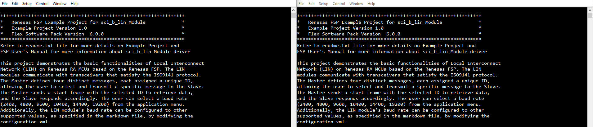
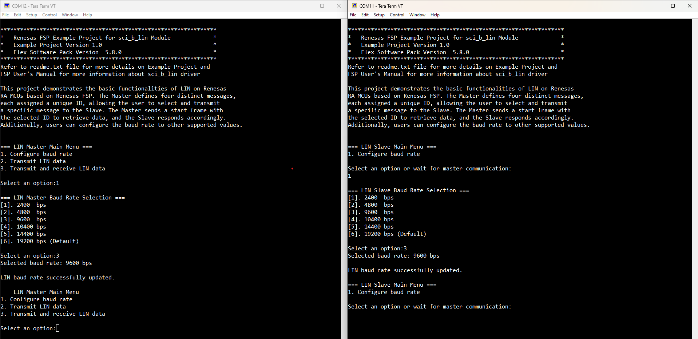
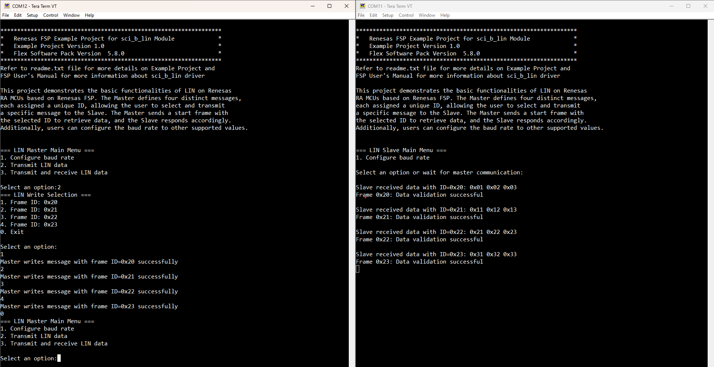
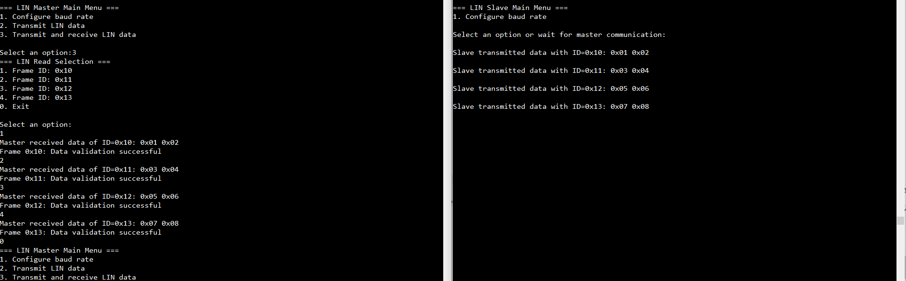
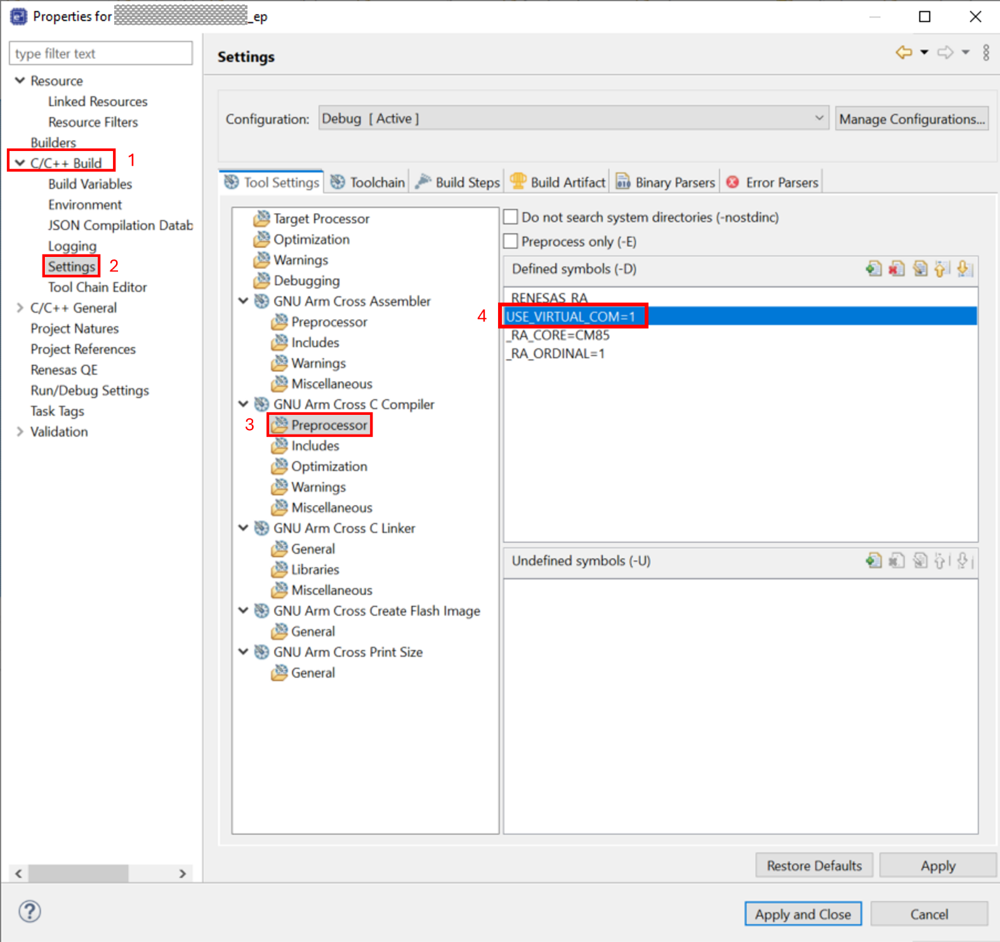

# Introduction #

This project demonstrates the basic functionalities of LIN on Renesas RA MCUs based on Renesas FSP. The LIN modules communicate with transceivers that satisfy the ISO9141 protocol. The Master defines four distinct messages, each assigned a unique ID, allowing the user to select and transmit a specific message to the Slave. The Master sends a start frame with the selected ID to retrieve data,  and the Slave responds accordingly. Additionally, users can configure the baud rate to other supported values. For the SAU LIN Slave, users can enter Low Power Mode (Software Standby) via the EP menu and wake up when triggered by the Master.

**Key Features**

Illustrates how a LIN Master sends and receives messages based on user-selected LIN IDs, along with the corresponding response behavior of the LIN Slave.

**LIN Main Menu**
1. **Configure Baud Rate**
2. **Transmit LIN Data**
3. **Transmit and Receive LIN Data**

**LIN Baud Rate Selection**
- [1]. 2400 bps
- [2]. 4800 bps
- [3]. 9600 bps
- [4]. 10400 bps
- [5]. 14400 bps
- [6]. 19200 bps (Default)

**LIN Write Selection**
- [1]. Frame ID: 0x20
- [2]. Frame ID: 0x21
- [3]. Frame ID: 0x22
- [4]. Frame ID: 0x23
- [0]. Exit

The **Master** sends messages (Frame IDs 0x20–0x23) based on the user-selected LIN IDs. Upon receiving the data, the **Slave** processes the message and prints the corresponding data to the terminal.

**LIN Read Selection**
- [1]. Frame ID: 0x10
- [2]. Frame ID: 0x11
- [3]. Frame ID: 0x12
- [4]. Frame ID: 0x13
- [0]. Exit

The **Master** sends specific Frame IDs (0x10–0x13) to request data from the **Slave**. The **Slave** detects the corresponding Frame ID and responds with a 2-byte predefined message, providing the requested information.

**Note on Module Differences:**

In this example, there are key differences between SCI B LIN and SAU LIN implementations:

- **ID Filtering:**  
  This feature is supported only on **SCI B LIN**. ID filtering, applicable only to LIN Slave devices, enables the system to accept or reject LIN messages based on their frame identifier (ID), thereby optimizing message processing and reducing unnecessary load on the Slave node.

- **LIN Wake-Up Signal:**  
  This functionality is available only on **SAU LIN**. The LIN wake-up signal is used to bring nodes out of a low-power state when activity is detected on the bus. The wake-up signal is transmitted by the Master, and all Slaves on the bus receive it. After receiving the wake-up signal, each Slave monitors the subsequent header and responds only if the PID (Protected Identifier) matches one that the Slave is configured to respond to.

- **SCI B LIN Board:** EK-RA8M1  
- **SAU LIN Board:** FPB-RA0E2  

Please refer to the [Example Project Usage Guide](https://github.com/renesas/ra-fsp-examples/blob/master/example_projects/Example%20Project%20Usage%20Guide.pdf) 
for general information on example projects and [readme.txt](./readme.txt) for specifics of operation.

## Required Resources ## 
To build and run this example project, the following resources are needed.

### Hardware Requirements ###
* Supported RA boards: EK-RA8M1, FPB-RA0E2.
* 2 x RA boards
* 2 × USB cables:
    * FPB-RA0E2: USB Type-C cables
    * EK-RA8M1: Micro-USB cables
* 2 x LIN transceiver
    * Link Product: https://www.mikroe.com/lin-click
	* Manufacturer Product Number: MIKROE-3816 
* 1 x 12V DC Power Supply
* 10 x Jumper cables (female to female)
* 3 x cables for LIN bus connection 
* 2 × 10kΩ pull-up resistors

### Hardware Connections  ###

| Board        | Pin Name  | Pin Number           |
|--------------|-----------|----------------------|
| FPB-RA0E2    | RX_PIN    | P403 (J1, Pin 4)     |
|              | TX_PIN    | P402 (J1, Pin 3)     |
|              | P3V3      | 3V3  (J3, Pin 4)     |
|              | GND       | GND  (J3, Pin 6)     |
| EK-RA8M1     | RX_PIN    | P610 (J54 Pin 22)    |
|              | TX_PIN    | P609 (J54 Pin 16)    |
|              | P3V3      | 3V3  (J54, Pin 1)    |
|              | GND       | GND  (J54, Pin 39)   |

Please refer to the RX_PIN, TX_PIN, P3V3, and GND assignments above for the connections below:
   		  

Note: 
* The LIN transceiver requires a 12V supply. Connect VS to 12V and GND to ground.
* For LIN transceiver (TLE7259-3), digital I/O levels compatible with 3.3V and 5V microcontrollers.
* The RX pin of LIN transceiver requires an external pull-up resistor connected to the microcontroller supply to define the output voltage level (as shown in the image above).
* For LIN transceiver Master Mode, the resistor at JP2 (MODE) must be relocated to the right side: Removing the resistor at the left side and soldering it at the right side.

### Hardware configuration ###
**LIN transceiver settings**
| Label | Name       | Default | Description                                                                 |
|-------|------------|---------|-----------------------------------------------------------------------------|
| JP1   | VCC SEL    | Left    | Power supply voltage selection: Left position (3.3V), Right position (5V).  |
| JP2   | MODE       | Left    | Communication mode selection: Left position (Slave mode), Right position (Master mode). |

### Software Requirements ###
* Renesas Flexible Software Package (FSP): Version 6.0.0
* e2 studio: Version 2025-04.1
* SEGGER J-Link RTT Viewer: Version 8.44a
* GCC ARM Embedded Toolchain: Version 13.2.1.arm-13-7
* Terminal Console Application: Tera Term or a similar application

Refer to the software required section in [Example Project Usage Guide](https://github.com/renesas/ra-fsp-examples/blob/master/example_projects/Example%20Project%20Usage%20Guide.pdf)

## Related Collateral References ##
The following documents can be referred to for enhancing your understanding of 
the operation of this example project:
- [FSP User Manual on GitHub](https://renesas.github.io/fsp/)
- [FSP Known Issues](https://github.com/renesas/fsp/issues)

# Project Notes #

## System Level Block Diagram ##
**The high-level block diagram of the system is shown below:**

## FSP Modules Used ##
List all the various modules that are used in this example project. Refer to the FSP User Manual for further details on each module listed below.

### SAU LIN ###
#### Master mode ####
| Module Name        | Usage                                                                                      | Searchable Keyword      |
|--------------------|--------------------------------------------------------------------------------------------|-------------------------|
| r_sau_lin      | SAU LIN supports Local Interface Network (LIN) transactions in master mode       | r_sau_lin            |
| r_tau       | The TAU module can be used to measure LIN transaction timing in master mode.       | r_tau            |

#### Slave mode ####
| Module Name        | Usage                                                                                      | Searchable Keyword      |
|--------------------|--------------------------------------------------------------------------------------------|-------------------------|
| r_sau_lin       | SAU LIN supports Local Interface Network (LIN) transactions in slave mode.       | r_sau_lin            |
| r_lpm       | The low power modes driver is used to configure and place the device into the desired low power mode.        | r_lpm            |

### SCI B LIN ###
#### Master mode ####
| Module Name        | Usage                                                                                      | Searchable Keyword      |
|--------------------|--------------------------------------------------------------------------------------------|-------------------------|
| r_sci_b_lin      | The Simple LIN on SCI_B HAL module supports Local Interface Network (LIN) transactions in master mode.       | r_sci_b_lin            |
| r_gpt       | The GPT module can be used to measure LIN transaction timing in master mode.       | r_gpt            |

#### Slave mode ####
| Module Name        | Usage                                                                                      | Searchable Keyword      |
|--------------------|--------------------------------------------------------------------------------------------|-------------------------|
| r_sci_b_lin       | The Simple LIN on SCI_B HAL module supports Local Interface Network (LIN) transactions in slave mode.       | r_sci_b_lin            |

## Module Configuration Notes ##
This section describes FSP configuration properties that are important or different from those selected by default.

### SAU LIN Configuration

#### Master Mode

| Module Property Path and Identifier                                                                                 | Default Value     | Used Value             | Reason                                         |
|---------------------------------------------------------------------------------------------------------------------|-------------------|------------------------|------------------------------------------------|
| `configuration.xml > Stacks > r_sau_lin > Settings > Property > Common > Master Support`                            | Disabled          | Enabled                | Select the LIN operating in master mode        |
| `configuration.xml > Stacks > r_sau_lin > Settings > Property > Common > Slave Support`                             | Enabled           | Disabled               | Disable slave support in master mode           |
| `configuration.xml > Stacks > r_sau_lin > Settings > Property > Common > Wake-up Support`                           | Disabled          | Enabled                | Enable LIN wake-up signal                      |
| `configuration.xml > Stacks > r_sau_lin > Settings > Property > Module g_master LIN (r_sau_lin) > Callback`         | sau_lin0_callback | lin_master_callback    | Set user-defined callback for SAU LIN module      |
| `configuration.xml > Stacks > r_tau > Settings > Property > Module g_lin_master_timeout > General > Period`         | 0x10000           | 1                      | Specify the timer period                       |
| `configuration.xml > Stacks > r_tau > Settings > Property > Module g_lin_master_timeout > General > Period Unit`    | Raw Counts        | Microseconds           | Define timer period unit                       |
| `configuration.xml > Stacks > r_tau > Settings > Property > Module g_lin_master_timeout > Callback`                 | NULL | lin_master_overflow_callback    | Set user-defined callback for timer module     |

#### Slave Mode

| Module Property Path and Identifier                                                                                     | Default Value     | Used Value                   | Reason                                          |
|-------------------------------------------------------------------------------------------------------------------------|-------------------|------------------------------|-------------------------------------------------|
| `configuration.xml > Stacks > r_sau_lin > Settings > Property > Common > Wake-up Support`                               | Disabled          | Enabled                      | Enable LIN wake-up signal                       |
| `configuration.xml > Stacks > r_sau_lin > Settings > Property > Common > Auto Synchronization Support`                  | Disabled          | Enabled                      | Enable automatic synchronization                |
| `configuration.xml > Stacks > r_sau_lin > Settings > Property > Module g_slave LIN (r_sau_lin) > Callback`             | sau_lin0_callback | lin_slave_callback    | Set user-defined callback for SAU LIN module      |

### SCI B LIN Configuration ###
#### Master Mode

| Module Property Path and Identifier                                                                                  | Default Value     | Used Value            | Reason                                         |
|----------------------------------------------------------------------------------------------------------------------|-------------------|------------------------|------------------------------------------------|
| `configuration.xml > Stacks > r_sci_b_lin > Settings > Property > Module g_master LIN (r_sci_b_lin) > General > Mode`         | Master | Master    | 	Select the LIN operating in master mode      |
| `configuration.xml > Stacks > r_sci_b_lin > Settings > Property > Module g_master LIN (r_sci_b_lin) > Interrupts > Callback`         | sci_b_lin_callback | lin_master_callback    | Set user-defined callback for SCI B LIN module      |
| `configuration.xml > Stacks > r_gpt > Settings > Property > Module g_lin_master_timeout > General > Period`         | 0x10000           | 1                      | Specify the timer period                       |
| `configuration.xml > Stacks > r_gpt > Settings > Property > Module g_lin_master_timeout > General > Period Unit`    | Raw Counts        | Microseconds           | Define timer period unit                       |
| `configuration.xml > Stacks > r_gpt > Settings > Property > Module g_lin_master_timeout > Callback`                 | NULL | lin_master_overflow_callback    | Set user-defined callback for timer module     |

#### Slave Mode

| Module Property Path and Identifier                                                                                     | Default Value     | Used Value                  | Reason                                          |
|--------------------------------------------------------------------------------------------------------------------------|-------------------|------------------------------|-------------------------------------------------|
| `configuration.xml > Stacks > r_sci_b_lin > Settings > Property > Module g_slave LIN (r_sci_b_lin) > General > Mode`         | Master | Slave    | 	Select the LIN operating in slave mode      |
| `configuration.xml > Stacks > r_sci_b_lin > Settings > Property > Module g_slave LIN (r_sci_b_lin) > Framing > ID Filter (Slave Mode) > Compare Data Mask`         | 0 | 0xFF    | 	All bits of the received PID are considered during comparison     |
| `configuration.xml > Stacks > r_sci_b_lin > Settings > Property > Module g_slave LIN (r_sci_b_lin) > Framing > ID Filter (Slave Mode) > Priority Compare Data`         | 0 | 0x20    | 	Select the priority compare filter data    |
| `configuration.xml > Stacks > r_sci_b_lin > Settings > Property > Module g_slave LIN (r_sci_b_lin) > Framing > ID Filter (Slave Mode) > Secondary Compare Data`         | 0 | 0x50    | 	Select the secondary compare filter data    |
| `configuration.xml > Stacks > r_sci_b_lin > Settings > Property > Module g_slave LIN (r_sci_b_lin) > Framing > ID Filter (Slave Mode) > Compare Data Select`         | Priority | Both    | 	Select the compare data to use    |
| `configuration.xml > Stacks > r_sci_b_lin > Settings > Property > Module g_slave LIN (r_sci_b_lin) > Framing > Break Field Bits/Break Detection Threshold (bits)`         | 13 | 11    | 	When configuring this setting in slave mode, take care to set the detection threshold less than the master break field length.  |
| `configuration.xml > Stacks > r_sci_b_lin > Settings > Property > Module g_slave LIN (r_sci_b_lin) > Framing > ID Filter (Slave Mode) > Priority Interrupt Bit Enable`         | Disabled | Enabled    | 	Enable the Priority Interrupt Bit filter    |
| `configuration.xml > Stacks > r_sci_b_lin > Settings > Property > Module g_slave LIN (r_sci_b_lin) > Framing > ID Filter (Slave Mode) > Priority Interrupt Bit`         | 0 | 3    | 	This is the bit position used for an additional check    |
| `configuration.xml > Stacks > r_sci_b_lin > Settings > Property > Module g_slave LIN (r_sci_b_lin) > Interrupts > Callback`         | sci_b_lin_callback | lin_slave_callback    | Set user-defined callback for SCI B LIN module      |

## API Usage ##
The table below lists the FSP provided API used at the application layer in this example project.

| #  | SAU LIN API Name                     | SCI B LIN API Name                  | Usage in Approach                                                                 |
|----|--------------------------------------|-------------------------------------|-----------------------------------------------------------------------------------|
| 1  | R_SAU_LIN_Open                       | R_SCI_B_LIN_Open                    | Configure the LIN driver                                                          |
| 2  | R_SAU_LIN_StartFrameWrite           | R_SCI_B_LIN_StartFrameWrite        | Begin non-blocking transmission of a LIN start frame (break, sync and protected identifier) |
| 3  | R_SAU_LIN_InformationFrameWrite     | R_SCI_B_LIN_InformationFrameWrite  | Begins non-blocking transmission of a LIN information frame                       |
| 4  | R_SAU_LIN_InformationFrameRead      | R_SCI_B_LIN_InformationFrameRead   | Begin non-blocking information frame reception to receive LIN data               |
| 5  | R_SAU_UART_BaudCalculate            | R_SCI_B_LIN_BaudCalculate          | Calculate baud rate register settings                                             |
| 6  | R_SAU_LIN_SleepEnter                | Not supported                      | Place the LIN node in bus sleep mode                                              |
| 7  | R_SAU_LIN_SleepExit                 | Not supported                      | Exit the bus sleep mode for LIN device                                            |
| 8  | R_SAU_LIN_WakeupSend                | Not supported                      | Begin non-blocking transmission of the LIN wakeup signal                          |
| 9  | R_SAU_LIN_Close                     | R_SCI_B_LIN_Close                   | Close the LIN driver                                                              |
| 10 | R_LPM_LowPowerModeEnter             | Not used                            | Enter to LPM mode                                                                 |
| 11 | R_TAU_Open                          | R_GPT_Open                          | Initialize the timer module                                                       |
| 12 | R_TAU_Reset                         | R_GPT_Reset                         | Reset the counter value to the period minus one                                   |
| 13 | R_TAU_PeriodSet                     | R_GPT_PeriodSet                     | Set period value provided.                                                        |
| 14 | R_TAU_InfoGet                       | R_GPT_InfoGet                       | Get timer information                                                              |
| 15 | R_TAU_Start                         | R_GPT_Start                         | Start timer                                                                       |
| 16 | R_TAU_Stop                          | R_GPT_Stop                          | Stop timer                                                                        |
| 17 | R_TAU_Close                         | R_GPT_Close                         | Close timer module                                                                |

## Verifying Operation ##
1. Import the project into e2 studio, generate project content, build, and flash the compiled project onto the RA board.
2. Open a terminal application (e.g., Tera Term or SEGGER RTT Viewer) on the host PC and connect to the RA board’s debug port.  
   * Note: For using the serial terminal:
        * Please ensure that the connection to the SEGGER J-Link RTT Viewer has been terminated.
        * The COM port is provided by the J-Link onboard, with a baud rate of 115200 bps, a data length of 8 bits, no parity check, one stop bit, and no flow control.
        * To echo back typed content in Tera Term, go to [Setup] -> [Terminal...] and check [Local echo].
3. The user selects the appropriate option in the EP menu to initiate the LIN example operation. For further details, please refer to the image below.

### The below images showcase the output on the terminal application ###
**The EP information**

**The user selects the baud rate to change** : Ensure that both the Master and Slave boards are configured with the same baud rate.

**The user selects the frame ID to send to the slave**

**The user selects the frame ID to request data from the slave**

## Special Topics ##

### Select Display Terminal

Information can be displayed using either the SEGGER J-Link RTT Viewer or a serial terminal (UART) via J-Link OB VCOM, depending on availability. If J-Link OB VCOM is unsupported, the example project defaults to the SEGGER J-Link RTT Viewer. If supported, it defaults to the serial terminal (UART).

The board supports J-Link OB VCOM: EK-RA8M1, FPB-RA0E2.

**For UART via J-Link OB VCOM**: Define `USE_VIRTUAL_COM=1`

**For J-Link RTT Viewer**: Define `USE_VIRTUAL_COM=0` (When using the SEGGER J-Link RTT Viewer, the RTT block address may be required to observe the EP's operation. Find the address 
    for the _SEGGER_RTT variable in the .map file (e2studio\Debug).)

Set this in **Project Properties** -> **C/C++ Build** -> **Settings** -> **Tool Settings** -> **GNU ARM Cross C Compiler** -> **Preprocessor**.

### ID Filter Configuration for SCI B LIN EP

This configuration ensures that received messages with a PID matching either the priority or secondary compare data are processed. The Priority Interrupt is an additional filtering layer that ensures critical messages are prioritized and passed through for further processing.

#### Read Transactions (Master Reads from Slave)

| **Frame ID** | **PID** | **Data**      |
|--------------|---------|---------------|
| 0x10         | 0x50    | 0x01, 0x02    |
| 0x11         | 0x11    | 0x03, 0x04    |
| 0x12         | 0x92    | 0x05, 0x06    |
| 0x13         | 0xD3    | 0x07, 0x08    |

#### Write Transactions (Master Writes to Slave)

| **Frame ID** | **PID** | **Data**           |
|--------------|---------|--------------------|
| 0x20         | 0x20    | 0x01, 0x02, 0x03   |
| 0x21         | 0x61    | 0x11, 0x12, 0x13   |
| 0x22         | 0xE2    | 0x21, 0x22, 0x23   |
| 0x23         | 0xA3    | 0x31, 0x32, 0x33   |

**PID** The Protected Identifier (PID) can be determined based on the LIN frame ID, as defined in the LIN Protocol Specification (Table of Valid Frame Identifiers).

#### Example of PID Matching

- **Priority Compare Data:** `0x20`
  - When the Priority Compare Data is set to `0x20`, received PID values that match `0x20` will be allowed through the filter.
  
- **Secondary Compare Data:** `0x50`
  - When the Secondary Compare Data is set to `0x50`, received PID values that match `0x50` will be allowed through the filter.

- **Compare Data Select:** "Both"
  - The filter first attempts to match the received PID with the Priority Compare Data (`0x20`). If no match is found, it then checks the Secondary Compare Data (`0x50`).

- **Priority Interrupt Bit:** `3`
  - This bit position is used to perform an additional filtering check to refine the selection of received messages.

- **For example, received PID:** `0x11`
  - **Priority Compare Data:** `0x20` (binary: `0010 0000`) is used for bit-level comparison at bit position 3 (`0`).

  - **Bit 3 Check:**
    - For `0x11` (`0001 0001`), bit 3 is `0`.
    - **Result:** The bit values match, allowing the identifier to pass through the filter.
