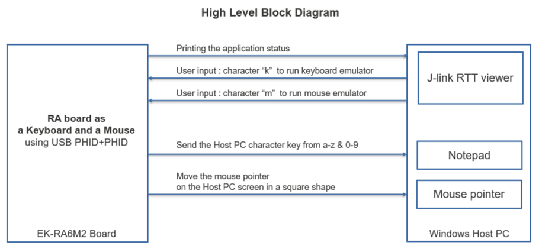
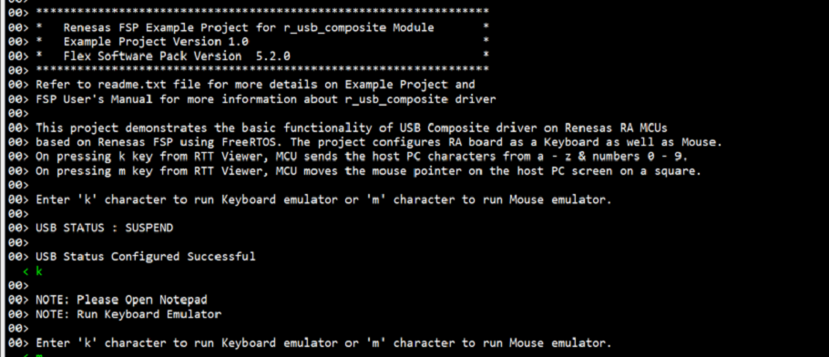
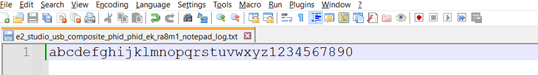
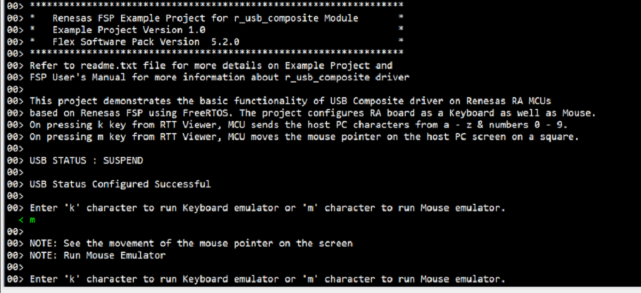

# Introduction #

This project demonstrates the basic functionality of USB PHID + PHID Composite Device on Renesas RA MCUs based on Renesas FSP.
The project configures RA board as a Keyboard and a Mouse.

From the RTT viewer, user can enter "k", MCU will work as a Keyboard. It sends the host PC characters from a - z & numbers 0 - 9.
From the RTT viewer, user can enter "m", MCU will work as a Mouse. It sends the host PC the coordinate of the mouse which let it move square on host PC's screen.

## Required Resources ##
To build and run the USB PHID + PHID Composite Device example project, the following resources are needed.

### Hardware ###
* Renesas EK-RA6M2/EK-RA8M1 kit
* 2x Micro USB cable
* A PC with at least 2 USB ports

Refer to [readme.txt](./readme.txt) for information on how to connect the hardware.

### Software ###

Refer to software described in [Example Project Usage Guide](https://github.com/renesas/ra-fsp-examples/blob/master/example_projects/Example%20Project%20Usage%20Guide.pdf)

## Related Collateral References

The following documents can be referred to for enhancing your understanding of the operation of this example project:

* [FSP User Manual on GitHub](https://renesas.github.io/fsp/)
* [FSP Known Issues](https://github.com/renesas/fsp/issues)

# Project Notes #

## System Level Block Diagram ##
 High level block diagram
 

## FSP Modules Used ##

List all the various modules that are used in this example project. Refer to the FSP User Manual for further details on each module listed below.

| Module Name | Usage | Searchable Keyword  |
|-------------|-----------------------------------------------|-----------------------------------------------|
|USB Composite |USB composite device works as a USB Peripheral by combining two peripheral device classes and r_usb_basic module| r_usb_composite|
|USB PHID|The r_usb_phid module combines with the r_usb_basic module to provide a USB Peripheral Human Interface Device Class (PHID) driver. |r_usb_phid|
|USB basic |The r_usb_basic module operates in combination with the device class drivers provided by Renesas to form a complete USB stack.|r_usb_basic|

## Module Configuration Notes ##
This section describes FSP Configurator properties which are important or different than those selected by default. 

**Common Configuration Properties**

|   Module Property Path and Identifier   |   Default Value   |   Used Value   |   Reason   |
| :-------------------------------------: | :---------------: | :------------: | :--------: |
| configuration.xml -> Phid Thread -> Properties > Settings > Property > Common > General -> Max Priorities | 5 | 15 | Match with maximum interrupt priority in USB Basic|
| configuration.xml -> Phid Thread -> Properties > Settings > Property > Common > Memory Allocation -> Support Dynamic Allocation | Disabled | Enable | Use for data transfer in USB|
| configuration.xml -> Phid Thread -> Properties > Settings > Property > Common > Memory Allocation -> Total Heap Size | 0 | 10000 | Use for data transfer in USB|
| configuration.xml -> Phid Thread -> Properties > Settings > Property > Thread > Stack size (bytes) | 1024 | 2048 | Stack size for USB PHID + PHID handling |
| configuration.xml -> Phid Thread -> Properties > Settings > Property > Thread > Priority | 1 | 5 | Priority for Phid thread should higher than Rtt Thread |

The table below lists the FSP provided API used at the application layer by this example project.

| API Name    | Usage                                                                          |
|-------------|--------------------------------------------------------------------------------|
|R_USB_Open|This API opens the USB basic driver. |
|R_USB_PeriControlDataGet|This API is used to receive data from the host when receiving the USB_STATUS_REQUEST or USB_SET_REPORT event. |
|R_USB_PeriControlDataSet|This API is used to perform USB transfer to the keyboard or mouse when receiving the USB_GET_REPORT_DESCRIPTOR, or USB_GET_HID_DESCRIPTOR event. |
|R_USB_PeriControlStatusSet|This API sets the response to the setup packet.|
|R_USB_Write|This API is used to write data to the host when receiving USB_STATUS_REQUEST_COMPLETE or USB_STATUS_WRITE_COMPLETE event|
|R_USB_Close |This API closes the USB basic driver.|

## Verifying operation ##

Import, Build and Debug the EP(see section Starting Development of FSP User Manual). After running the EP, open RTT viewer to choose using EK-RA8D1 as keyboard or mouse.

* Keyboard:
In RTT Viewer, choose k

Open Notepad on the PC, lower cases a - z, and numbers 0 - 9 will be shown on the Notepad.

* Mouse:
In RTT Viewer, choose m

The mouse will move on the host PC's screen, as shown in the below picture.

