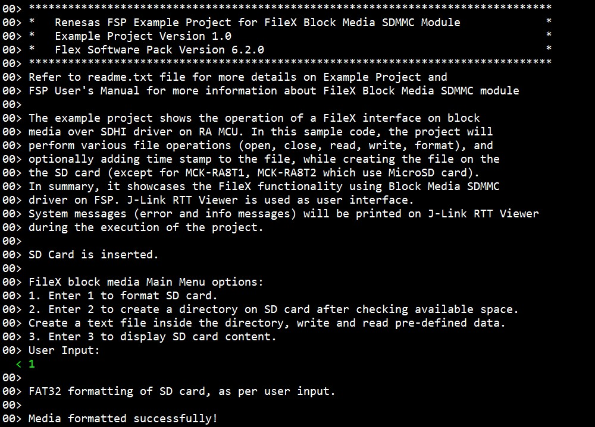
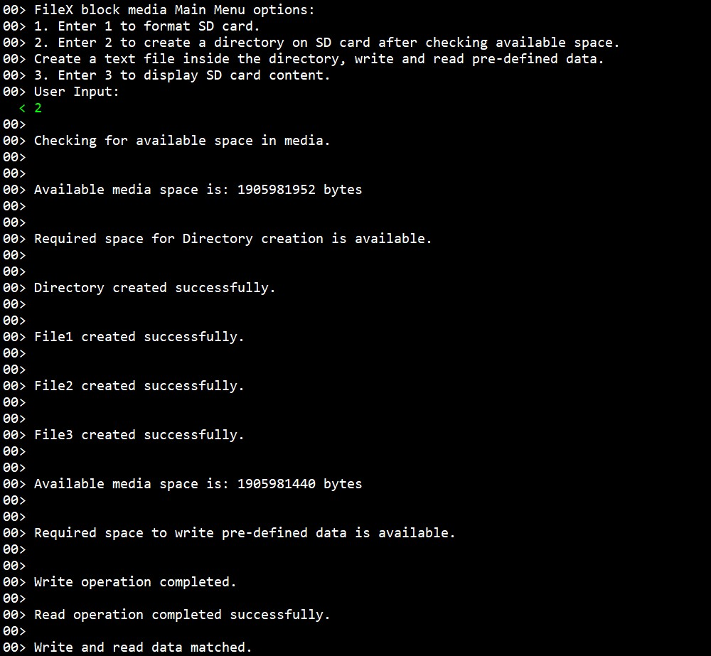
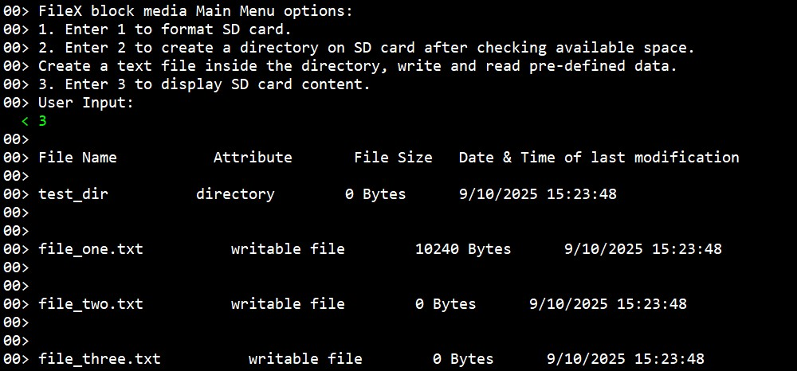

# Introduction #
The example project shows the operation of a FileX interface on block media over SDHI driver on RA MCU. In this sample code, the project will perform various file operations (open, close, read, write, format), and optionally adding time stamp to the file, while creating the file on the SD card (except for MCK-RA8T1, MCK-RA8T2 which use MicroSD card). In summary, it showcases the FileX functionality using Block Media SDMMC driver on FSP. J-Link RTT Viewer is used as user interface. System messages (error and info messages) will be printed on J-Link RTT Viewer during the execution of the project.

Please refer to the [Example Project Usage Guide](https://github.com/renesas/ra-fsp-examples/blob/master/example_projects/Example%20Project%20Usage%20Guide.pdf) for general information on example projects and [readme.txt](./readme.txt) for specifics of operation.

## Required Resources ##
To build and run the Filex Block Media using SDMMC example project, the following resources are needed.

### Software ###
* Renesas Flexible Software Package (FSP): Version 6.3.0
* e2 studio: Version 2025-12
* SEGGER J-Link RTT Viewer: Version 8.92
* LLVM Embedded Toolchain for ARM: Version 21.1.1

Refer to software requirements mentioned in [Example Project Usage Guide](https://github.com/renesas/ra-fsp-examples/blob/master/example_projects/Example%20Project%20Usage%20Guide.pdf)

### Hardware ###
Supported RA boards: EK-RA6M3, EK-RA6M4, FPB-RA6E1, EK-RA8M1, EK-RA8D1, MCK-RA8T1, EK-RA8P1, MCK-RA8T2, EK-RA8M2
* 1 x Renesas RA board.
* 1 x USB cable for programming and debugging.
  * Type-C USB cable: MCK-RA8T1, EK-RA8P1, MCK-RA8T2, EK-RA8M2.
  * Micro USB cable: the other boards.
* For EK-RA6M3, EK-RA6M4, FPB-RA6E1, EK-RA8M1, EK-RA8D1, EK-RA8P1, EK-RA8M2:
	* 1 x SD card (e.g., https://shop.sandisk.com/en-sg/products/memory-cards/sd-cards/sandisk-ultra-uhs-i-sd?sku=SDSDUNC-032G-ZN6IN).
	* 1 x Pmod SD: Full sized SD Card Slot (e.g., https://digilent.com/shop/pmod-sd-full-sized-sd-card-slot/).
	* 10 x Jumper wires.
* For MCK-RA8T1, MCK-RA8T2:
	* 1 x MicroSD card (e.g., https://shop.sandisk.com/en-ie/products/memory-cards/microsd-cards/sandisk-ultra-lite-uhs-i-microsd?sku=SDSQUNR-032G-GN3MA).

### Hardware Connections ###
* For EK-RA6M3:
  * 1 Bit Width
    * SD0CMD  P412 (J4:33)    --->    Pmod SD MOSI (J1:2)
    * SD0DAT0 P411 (J4:36)   	--->    Pmod SD MISO (J1:3)
    * SD0CLK  P413 (J4:34)   	--->    Pmod SD SCK  (J1:4)
    * GND          	          --->    Pmod SD GND  (J1:5)
    * VCC +3V3  	            --->    Pmod SD VCC  (J1:6)
    * SD0CD   P415 (J4:32)  	--->    Pmod SD CD   (J1:9)
    * SD0WP   P414 (J4:31)  	--->    Pmod SD WP   (J1:10)

  * 4 Bits Width
    * Above mentioned connections for 1 Bit Width. In addition below connections
    * SD0DAT1 P410 (J4:35)   	--->    Pmod SD DAT1 (J1:7)
    * SD0DAT2 P206 (J1:38)   	--->    Pmod SD DAT2 (J1:8)
    * SD0DAT3 P205 (J2:04)   	--->    Pmod SD CS   (J1:1)

* For EK-RA6M4:
  * 1 Bit Width
    * SD0CMD  P412    --->    Pmod SD MOSI (J1:2)
    * SD0DAT0 P411   	--->    Pmod SD MISO (J1:3)
    * SD0CLK  P413   	--->    Pmod SD SCK  (J1:4)
    * GND          	  --->    Pmod SD GND  (J1:5)
    * VCC +3V3    	  --->    Pmod SD VCC  (J1:6)
    * SD0CD   P210   	--->    Pmod SD CD   (J1:9)
    * SD0WP   P209   	--->    Pmod SD WP   (J1:10)

  * 4 Bit Width
    * Above mentioned connections for 1 Bit Width. In addition below connections
    * SD0DAT1 P410   	--->    Pmod SD DAT1 (J1:7)
    * SD0DAT2 P206   	--->    Pmod SD DAT2 (J1:8)
    * SD0DAT3 P205   	--->    Pmod SD CS   (J1:1)

* For FPB-RA6E1:
  * 1 Bit Width 
    * SD0CMD  P412 (J3:20) 	  ---> 	  Pmod SD MOSI (J1:2)
    * SD0DAT0 P411 (J3:21) 	  ---> 	  Pmod SD MISO (J1:3)
    * SD0CLK  P413 (J3:19) 	  ---> 	  Pmod SD SCK  (J1:4)
    * GND 			              ---> 	  Pmod SD GND  (J1:5)
    * VCC  +3V3 		          ---> 	  Pmod SD VCC  (J1:6)
    * SD0CD   P210 (J3:35) 	  ---> 	  Pmod SD CD   (J1:9)
    * SD0WP   P209 (J3:36) 	  ---> 	  Pmod SD WP   (J1:10)

  * 4 Bit Width
    * Above mentioned connections for 1 Bit Width. In addition below connections
    * SD0DAT1 P410 (J3:22) 	  ---> 	  Pmod SD DAT1 (J1:7)
    * SD0DAT2 P206 (J3:31) 	  ---> 	  Pmod SD DAT2 (J1:8)
    * SD0DAT3 P205 (J3:32) 	  ---> 	  Pmod SD CS   (J1:1)

* For EK-RA8M1:
  * Note: The user needs to remove jumper J61 to use SDHI channel 0.

    Hardware connection for SDHI channel 0 as below:
  * 1 Bit Width
    * SD0CMD  P307 (J54:5) 	  ---> 	  Pmod SD MOSI (J1:2)
    * SD0DAT0 P304 (J54:9) 	  ---> 	  Pmod SD MISO (J1:3)
    * SD0CLK  P308 (J54:4) 	  ---> 	  Pmod SD SCK  (J1:4)
    * GND 			              ---> 	  Pmod SD GND  (J1:5)
    * VCC +3V3 		            ---> 	  Pmod SD VCC  (J1:6)
    * SD0CD   P306 (J54:7) 	  ---> 	  Pmod SD CD   (J1:9)
    * SD0WP   P305 (J54:8) 	  ---> 	  Pmod SD WP   (J1:10)

  * 4 Bit Width
    * Above mentioned connections for 1 Bit Width. In addition below connections
    * SD0DAT1 P303 (J54:6)  	---> 	  Pmod SD DAT1 (J1:7)
    * SD0DAT2 P302 (J54:14) 	---> 	  Pmod SD DAT2 (J1:8)
    * SD0DAT3 P301 (J54:12) 	---> 	  Pmod SD CS   (J1:1)

* For EK-RA8D1:
  * Note: The user must turn-off SW1-3, SW1-5, SW1-8 on board to use SDHI channel 1.
  
    Hardware connection for SDHI channel 1 as below:	
  * 1 Bit Width
    * SD1CMD  P401 (J51:7) 	  ---> 	  Pmod SD MOSI (J1:2)
    * SD1DAT0 P402 (J52:15) 	---> 	  Pmod SD MISO (J1:3)
    * SD1CLK  P400 (J51:10) 	---> 	  Pmod SD SCK  (J1:4)
    * GND 			              ---> 	  Pmod SD GND  (J1:5)
    * VCC +3V3 		            ---> 	  Pmod SD VCC  (J1:6)
    * SD1CD   P406 (J51:5) 	  ---> 	  Pmod SD CD   (J1:9)
    * SD1WP   P700 (J51:6) 	  ---> 	  Pmod SD WP   (J1:10)

  * 4 Bit Width
    * Above mentioned connections for 1 Bit Width. In addition below connections
    * SD1DAT1 P403 (J51:9)  	---> 	  Pmod SD DAT1 (J1:7)
    * SD1DAT2 P404 (J57:1)  	---> 	  Pmod SD DAT2 (J1:8)
    * SD1DAT3 P405 (J51:8)  	---> 	  Pmod SD CS   (J1:1)

* For MCK-RA8T1:
  * Connect Micro SD card to Micro SD socket (CN12).

* For EK-RA8P1:
  
  Hardware connection for SDHI channel 0 as below:
  * 1 Bit Width
    * SD0CMD  PD04 (J2:32) 	  --->    Pmod SD MOSI (J1:2)
    * SD0DAT0 PD03 (J2:31) 	  --->    Pmod SD MISO (J1:3)
    * SD0CLK  PD05 (J2:27) 	  --->    Pmod SD SCK  (J1:4)
    * GND 			              ---> 	  Pmod SD GND  (J1:5)
    * VCC +3V3 		            ---> 	  Pmod SD VCC  (J1:6)
    * SD0CD   P503 (J37:14) 	--->    Pmod SD CD   (J1:9)
    * SD0WP   PD06 (J3:4) 	  --->    Pmod SD WP   (J1:10)

  * 4 Bit Width
    * Above mentioned connections for 1 Bit Width. In addition below connections
    * SD0DAT1 PD02 (J2:33)  	---> 	  Pmod SD DAT1 (J1:7)
    * SD0DAT2 PD01 (J2:34) 	  ---> 	  Pmod SD DAT2 (J1:8)
    * SD0DAT3 P111 (J1:3) 	  ---> 	  Pmod SD CS   (J1:1)

* For MCK-RA8T2: 
  * Connect MicroSD card to MicroSD socket (CN17).

* For EK-RA8M2:  
  * Note: The user must place jumper J6 on pins 2-3, J8 on pins 1-2, J9 on pins 2-3, and J29 on pins 1-2, 3-4, 5-6, 7-8 to use the on-board debug functionality.  
  Hardware connection for SDHI channel 1 as below:
  * 1 Bit Width
    * SD1CMD  P202 (J3:29)	--->	Pmod SD MOSI (J1:2)
    * SD1DAT0 P313 (J3:30) 	---> 	Pmod SD MISO (J1:3)
    * SD1CLK  P203 (J3:31) 	---> 	Pmod SD SCK  (J1:4)
    * GND 	       (J3:39)  ---> 	Pmod SD GND  (J1:5)
    * VCC +3V3     (J3:1)	  ---> 	Pmod SD VCC  (J1:6)
    * SD1CD   P205 (J3:35) 	---> 	Pmod SD CD   (J1:9)
    * SD1WP   P204 (J3:33) 	---> 	Pmod SD WP   (J1:10)

  * 4 Bits Width
    Above mentioned connections for 1 Bit Width. In addition below connections
    * SD1DAT1 P314 (J3:27)  ---> 	Pmod SD DAT1 (J1:7)
    * SD1DAT2 P810 (J3:13) 	---> 	Pmod SD DAT2 (J1:8)
    * SD1DAT3 P811 (J3:15) 	---> 	Pmod SD CS   (J1:1)

## Related Collateral References ##
The following documents can be referred to for enhancing your understanding of the operation of this example project:
- [FSP User Manual on GitHub](https://renesas.github.io/fsp/)
- [FSP Known Issues](https://github.com/renesas/fsp/issues)

# Project Notes #

## System Level Block Diagram ##

## FSP Modules Used ##
List all the various modules that are used in this example project. Refer to the FSP User Manual for further details on each module listed below.

| Module Name | Usage  | Searchable Keyword (using New Stack > Search) |
|-------------|-----------------------------------------------|-----------------------------------------------|
| FileX on Block Media | With FileX Block Media SDMMC driver, the user can store the required board data (sensor readings, ethernet packets etc.) on the SD/MicroSD Card. | file |

## Module Configuration Notes ##
This section describes FSP Configurator properties that are important or different from those selected by default.

|   Module Property Path and Identifier   |   Default Value   |   Used Value   |   Reason   |
| :-------------------------------------: | :---------------: | :------------: | :--------: |
| configuration.xml > BSP > Properties > Settings > Property > RA Common > Main stack size (bytes) | 0x400 | 0x1000 | Modified main stack size to accommodate function calls as per application requirement. |
| configuration.xml > BSP > Properties > Settings > Property > RA Common > Heap size (bytes) | 0 | 0x1800 | Increased stack size to accommodate standard library functions in the application. |
| configuration.xml > Stacks > Threads > FileX_Thread > Properties > Settings > Property > Thread > Stack size (bytes) | 1024 | 4096 | Increased stack area to accommodate FileX function calls. |
| configuration.xml > Stacks > Threads > RTT_Thread > Properties > Settings > Property > Thread > Stack size (bytes) | 1024 | 4096 | Modified stack area as per application specific requirements. |
| configuration.xml > Stacks > Threads > RTT_Thread > Properties > Settings > Property > Thread > Priority | 1 | 2 | RTT thread priority is lowered to allow the FileX Block Media driver to process the requests. |

**Configuration Properties for using SD/MMC**

|   Module Property Path and Identifier   |   Default Value   |   Used Value   |   Reason   |
|-----------------------------------------|-------------------|----------------|------------|
| configuration.xml > Stacks > Threads > FileX_Thread > FileX_Thread Stacks > g_sdmmc0 SD/MMC (r_sdhi) > Properties > Settings > Property > Module g_sdmmc0 SD/MMC (r_sdhi) > Channel | 0 | 1 | Select SD/MMC channel 1. |
| configuration.xml > Stacks > Threads > FileX_Thread > FileX_Thread Stacks > g_sdmmc0 SD/MMC (r_sdhi) > Properties > Settings > Property > Module g_sdmmc0 SD/MMC (r_sdhi) > Bus Width | 4 Bits | 4 Bits | Select 4 bits bus width. |
| configuration.xml > Stacks > Threads > FileX_Thread > FileX_Thread Stacks > g_sdmmc0 SD/MMC (r_sdhi) > Properties > Settings > Property > Module g_sdmmc0 SD/MMC (r_sdhi) > Card Detection | CD Pin | CD Pin | Select card detection using the CD pin. |
| configuration.xml > Stacks > Threads > FileX_Thread > FileX_Thread Stacks > g_sdmmc0 SD/MMC (r_sdhi) > Properties > Settings > Property > Module g_sdmmc0 SD/MMC (r_sdhi) > Write Protection | WP Pin | WP Pin | Select write protection using WP pin. |
| configuration.xml > Stacks > Threads > FileX_Thread > FileX_Thread Stacks > g_sdmmc0 SD/MMC (r_sdhi) > Properties > Settings > Property > Module g_sdmmc0 SD/MMC (r_sdhi) > Access Interrupt Priority | Priority 12 | Priority 2 | Select the access interrupt priority. |
| configuration.xml > Stacks > Threads > FileX_Thread > FileX_Thread Stacks > g_sdmmc0 SD/MMC (r_sdhi) > Properties > Settings > Property > Module g_sdmmc0 SD/MMC (r_sdhi) > Card Interrupt Priority | Disabled | Priority 2 | Card interrupt priority is enabled and set to priority 2 to trigger interrupt when card is inserted or removed. |

## API Usage ##

The table below lists the FileX API used at the application layer by this example project.

| API Name    | Usage                                                                          |
|-------------|--------------------------------------------------------------------------------|
| RM_FILEX_BLOCK_MEDIA_Open | This API is used to initialize callback and configuration for FileX Block Media interface. |
| RM_FILEX_BLOCK_MEDIA_Close | This API is used to close the media device. |
| fx_media_open | This function is used to open the media and check for errors. |
| fx_media_format | This function is used to format the specified media with the FAT12/16/32 filesystem. |
| fx_system_initialize | This function is used to initialize the control data structures for the FileX system component. |
| fx_media_space_available | This function is used to return the amount of free space available on the specified media. |
| fx_directory_create | This function is used to verify the directory name, check for errors and create an empty directory. |
| fx_file_create | This function is used to verify the file name, check for errors and create an empty file. |
| fx_file_truncate | This function is used to set the file to the specified size. |
| fx_file_write | This function is used to write the specified number of bytes into the file's data area. |
| fx_media_flush | This function is used to flush all written open files to the underlying media. |
| fx_file_read | This function is used to read the specified number of bytes from the file. |
| fx_system_date_set | This function is used to set the system date to the specified value. |
| fx_system_time_set | This function is used to set the system time to the specified value. |

## Verifying Operation ##
Import, build and debug the EP (see section Starting Development of **FSP User Manual**). After running the EP, open the J-Link RTT Viewer to see the output. Before running the example project, refer to the steps below for hardware connections:
* Connect RA MCU debug port to the host PC via a Type-C USB cable.
* Connect SD card to Pmod SD.
* Connect Pmod SD to the RA board: Using short wiring connections (Should be shorter than 10cm).

The output on J-Link RTT Viewer:

