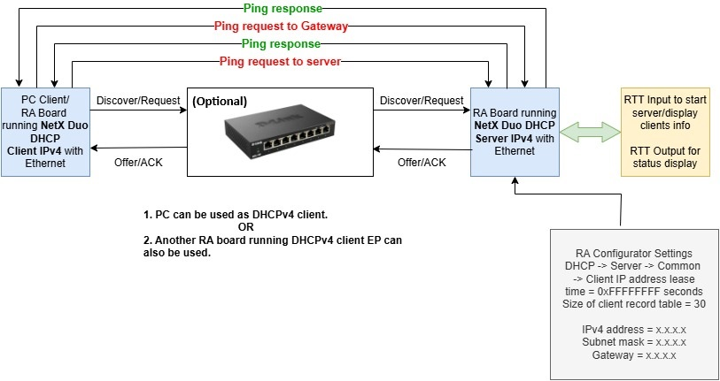
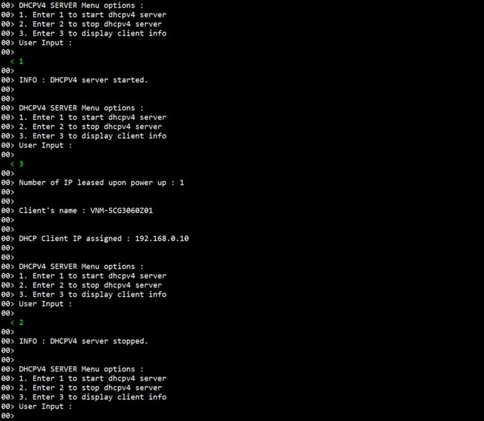

# Introduction #
The sample code accompanying this file shows the operation of a NetX Duo DHCPv4 Server on a RA MCU using Azure RTOS. In this sample code, a NetX Duo IP instance is created with IP address as (default 0.0.0.0 - Not assigned). The Server is always configured the IP address, in this EP 192.168.0.2 is the IP address of the Board (DHCP Server). The NetX stack is enabled for UDP, ICMP, ARP. DHCP Server uses the UDP protocol to receive DHCP Client requests and transmit responses. DHCP Server creates its own packet pool based on the settings minimum packet payload size and number of packets in the packet pool. DHCPv4 Server creates a pool of IP addresses from the given range and set network parameters for specified interface.

Once the DHCPv4 Server is running and has created client records and assigned IP addresses, it periodically checks the time remaining on each of the client IP leases. If a lease expires, the server simply removes the client record from the client record table, and returns that IP address back to the pool of assignable IP addresses. No message is sent to the client.

The status messages, clients info, and the code flow informational messages as part of the initialization are displayed on the J-Link RTT Viewer.

**Note :** Range of IP address for clients are from 192.168.0.10 to 192.168.0.20.

NetX Duo DHCPV4 Server is compliant with [RFC2132](https://tools.ietf.org/html/rfc2132), [RFC2131](https://tools.ietf.org/html/rfc2131), and related RFCs.

Please refer to the [Example Project Usage Guide](https://github.com/renesas/ra-fsp-examples/blob/master/example_projects/Example%20Project%20Usage%20Guide.pdf) for general information on example projects and [readme.txt](./readme.txt) for specifics of operation.

## Required Resources ##
To build and run the NetX DHCPv4 Server example project, the following resources are needed.

### Software ###
Refer to software requirements mentioned in [Example Project Usage Guide](https://github.com/renesas/ra-fsp-examples/blob/master/example_projects/Example%20Project%20Usage%20Guide.pdf)

### Hardware ###
* Supported RA boards: EK-RA6M3, EK-RA6M4, EK-RA6M5, EK-RA8D1, EK-RA8M1, MCK-RA8T1, EK-RA8D2, EK-RA8M2
    * 1 x Renesas RA Board.
    * 1 x Type-C USB cable for programming and debugging.
    * 1 × PC supported ethernet or another RA board running DHCPv4 Client.
	* Without ethernet switch:
	    * 1 x Ethernet/LAN cable (Ethernet cable CAT5/6).
	* With ethernet switch: (Optional)
	    * 1 x Ethernet switch.
	    * 2 x Ethernet/LAN cables (Ethernet cable CAT5/6).
	    * **Note:** The ethernet switch should not have Internet access; it only serves as a connection hub.

### Hardware Connections ###
* For EK-RA6M3, EK-RA6M4, EK-RA6M5:
    * Connect the RA board USB device port to the host machine via a micro USB cable.
	* Without ethernet switch:
        * Connect the ethernet port of the RA board to the ethernet port of the PC/another RA board running DHCPv4 Client using a LAN cable.
    * With ethernet switch: (Optional)
        * Connect the ethernet port of the RA board and the ethernet port of the PC/another RA board running DHCPv4 Client to an ethernet switch using two LAN cables.

* For EK-RA8M1:
    * Connect the RA board USB device port to the host machine via a micro USB cable.
	* Without ethernet switch:
        * Connect the ethernet port of the RA board to the ethernet port of the PC/another RA board running DHCPv4 Client using a LAN cable.
    * With ethernet switch: (Optional)
        * Connect the ethernet port of the RA board and the ethernet port of the PC/another RA board running DHCPv4 Client to an ethernet switch using two LAN cables.
    * Remove jumper J61 to enable Ethernet B.

* For EK-RA8D1:
    * Connect the RA board USB device port to the host machine via a micro USB cable.
	* Without ethernet switch:
        * Connect the ethernet port of the RA board to the ethernet port of the PC/another RA board running DHCPv4 Client using a LAN cable.
    * With ethernet switch: (Optional)
        * Connect the ethernet port of the RA board and the ethernet port of the PC/another RA board running DHCPv4 Client to an ethernet switch using two LAN cables.
    * Set the configuration switches (SW1) as below to avoid potential failures.
        * CAUTION: Do not enable SW1-4 and SW1-5 together.

        | SW1-1 PMOD1 | SW1-2 TRACE | SW1-3 CAMERA | SW1-4 ETHA | SW1-5 ETHB | SW1-6 GLCD | SW1-7 SDRAM | SW1-8 I3C |
        |-------------|-------------|--------------|------------|------------|------------|-------------|-----------|
        | OFF | OFF | OFF | OFF | ON | OFF | OFF | OFF |

* For MCK-RA8T1, EK-RA8D2, EK-RA8M2:
    * For EK-RA8M2, the user must place jumper J6 on pins 2-3, J8 on pins 1-2, J9 on pins 2-3, and J29 on pins 1-2, 3-4, 5-6, 7-8 to use the on-board debug functionality.
    * Connect the RA board USB device port to the host machine via a Type-C USB cable.
	* Without ethernet switch:
        * Connect the ethernet port of the RA board to the ethernet port of the PC/another RA board running DHCPv4 Client using a LAN cable.
    * With ethernet switch: (Optional)
        * Connect the ethernet port of the RA board and the ethernet port of the PC/another RA board running DHCPv4 Client to an ethernet switch using two LAN cables.

## Related Collateral References ##
The following documents can be referred to for enhancing your understanding of the operation of this example project:
- [FSP User Manual on GitHub](https://renesas.github.io/fsp/)
- [FSP Known Issues](https://github.com/renesas/fsp/issues)

# Project Notes #

## System Level Block Diagram ##

## FSP Modules Used ##
List all the various modules that are used in this example project. Refer to the FSP User Manual for further details on each module listed below.

| Module Name | Usage  | Searchable Keyword (using New Stack > Search) |
|-------------|-----------------------------------------------|-----------------------------------------------|
| NetX Duo DHCP IPV4 Server | DHCPV4 Server module is used to provide and assign IP addresses automatically, default gateways and other network parameters to dhcpv4 client devices.| dhcp |

## Module Configuration Notes ##
This section describes FSP Configurator properties which are important or different from those selected by default. 

|   Module Property Path and Identifier   |   Default Value   |   Used Value   |   Reason   |
| :-------------------------------------: | :---------------: | :------------: | :--------: |
| configuration.xml > BSP > Properties > Settings > Property > RA Common > Heap size (bytes) | 0 | 0x400 | Heap size is required for standard library functions to be used as per FSP requirements. |
| configuration.xml > Stacks > Threads > DHCPV4 Server Thread > Properties > Settings > Property > Thread > Priority | 1 | 2 | DHCPv4 server thread priority is lowered to allow the IP thread to process incoming packets at the fastest rate possible. |
| configuration.xml > Stacks > Threads > RTT_Thread > Properties > Settings > Property > Thread > Priority | 1 | 3 | RTT thread priority is lowered to allow the DHCP server and IP threads to process incoming packets at the fastest rate possible. |
| configuration.xml > Stacks > Threads > DHCPV4 Server Thread > DHCPV4 Server Thread Stacks > g_ether0 Ethernet MAC (r_rmac) > Properties > Settings > Property > Module g_ether0 Ethernet MAC (r_rmac) > General > MAC address | 00:11:22:33:44:55 | 00:11:22:33:44:66 | Sets the MAC address, as server and client can not use same MAC address. |
| configuration.xml > Stacks > Threads > DHCPV4 Server Thread > DHCPV4 Server Thread Stacks > g_layer3_switch0 Switch (r_layer3_switch) > Properties > Settings > Property > Module g_layer3_switch0 Switch (r_layer3_switch) > Port > Port 0 > MAC address | 00:11:22:33:44:55 | 00:11:22:33:44:66 | Sets the MAC address for Port 0. |

## API Usage ##

The table below lists the DHCPv4 Server API used at the application layer by this example project.

| API Name    | Usage                                                                          |
|-------------|--------------------------------------------------------------------------------|
| nx_dhcp_create_server_ip_address_list | This API is used to create a pool of IP addresses from the given range. |
| nx_dhcp_set_interface_network_parameters | This API is used to set network parameters returned by the DHCP server. |
| nx_dhcp_server_start | This API is used to start DHCP Server processing. |
| nx_dhcp_server_stop | This API is used to stop DHCP Server processing. |

## Verifying Operation ##
* Import, build and download the EP (see section Starting Development of **FSP User Manual**). After running the EP, open RTT Viewer to see the output.
* Before running the example project, refer to the **Hardware Connections** section to ensure the hardware is set up correctly.

The image below shows the hardware connection setup required to run the example project:

The images below show the output on J-Link RTT Viewer:

