# Introduction #
This project demonstrates the basic functionality of NetX Duo HTTPS Client with ethernet driver on Renesas RA MCUs based on Renesas FSP using AzureRTOS. The EP uses the DHCP Client to get the IP address from the DHCP Server and HTTPS Client to connect to HTTPS Adafruit IO Server which is a cloud platform. On successful connection, the menu is displayed enabling the user to send POST, PUT, GET requests to Adafruit IO server. On POST/PUT request, MCU die temperature is read using ADC and uploaded to server. On GET request, the last MCU die temperature is read from the Adafruit IO server. Error and info messages will be printed on J-Link RTT Viewer.

Please refer to the [Example Project Usage Guide](https://github.com/renesas/ra-fsp-examples/blob/master/example_projects/Example%20Project%20Usage%20Guide.pdf) for general information on example projects and [readme.txt](./readme.txt) for specifics of operation.

## Required Resources ##
To build and run the NetX_https_client example project, the following resources are needed.

### Software ###
   * Renesas Flexible Software Package (FSP): Version 6.5.0
   * e2 studio: Version 2026-04.2
   * SEGGER J-Link RTT Viewer: Version 9.42
   * LLVM Embedded Toolchain for ARM: Version 21.1.1

   1. Refer to the software required section in [Example Project Usage Guide](https://github.com/renesas/ra-fsp-examples/blob/master/example_projects/Example%20Project%20Usage%20Guide.pdf)
   2. Refer to **[Special Topics](#special-topics)** for obtaining the certificates and key which is required to update in the code. 

### Hardware ###
* Supported RA boards: EK-RA6M3, EK-RA6M4, EK-RA6M5, EK-RA8M1, EK-RA8D1, MCK-RA8T1, EK-RA8M2.
   * 1 x Renesas RA board.
   * 1 x Host PC.
   * 1 x USB cable for programming and debugging.
   * 1 x Ethernet/LAN cable (Ethernet cable CAT5/6).
   * 1 x Ethernet switch.

### Hardware Connections ###
* Connect the RA board USB debug port to the host PC via a USB cable.
* Connect the RA board ethernet port to the ethernet switch via a LAN cable. Ensure that the ethernet switch is connected to a network with Internet access.

* For EK-RA8D1:
   * The user must set the configuration switches (SW1) as below to avoid potential failures:

      | SW1-1 PMOD1 | SW1-2 TRACE | SW1-3 CAMERA | SW1-4 ETHA | SW1-5 ETHB | SW1-6 GLCD | SW1-7 SDRAM | SW1-8 I3C |
      |-------------|-------------|--------------|------------|------------|------------|-------------|-----------|
      |     OFF     |     OFF     |      OFF     |     OFF    |     ON     |     OFF    |     OFF     |    OFF    |

      CAUTION: Do not enable SW1-4 and SW1-5 together.

* For EK-RA8M1:
  * The user must remove jumper J61 to enable Ethernet B.

* For EK-RA8M2:
   * The user must place jumper J6 on pins 2-3, J8 on pins 1-2, J9 on pins 2-3, and J29 on pins 1-2, 3-4, 5-6, 7-8 to use the on-board debug functionality.

## Related Collateral References ##
The following documents can be referred to for enhancing your understanding of the operation of this example project:
- [FSP User Manual on GitHub](https://renesas.github.io/fsp/)
- [FSP Known Issues](https://github.com/renesas/fsp/issues)

# Project Notes #
## System Level Block Diagram ##
 High level block diagram
 
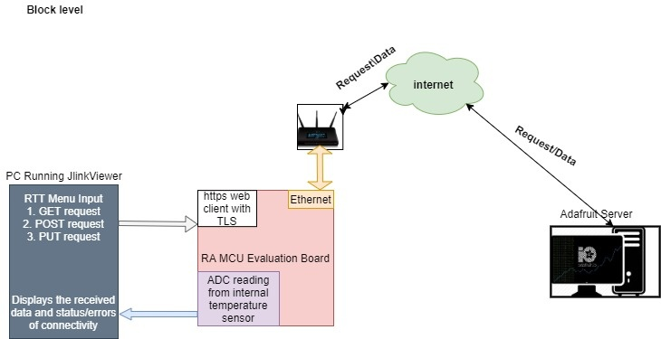

## FSP Modules Used ##
List all the various modules that are used in this example project. Refer to the FSP User Manual for further details on each module listed below.

| Module Name | Usage | Searchable Keyword  |
|-------------|-----------------------------------------------|-----------------------------------------------|
| NetX Duo Web HTTP/HTTPS Client | To get access of NetX HTTPS client library for client connection. | NetX Duo Web HTTP/HTTPS Client |
| NetX Duo IP Instance | For IP communication the NetX IP instance needs to be used. HTTPS Client uses the IPV4. | NetX Duo IP |
| NetX Duo Packet Pool | Packet Pool Module is used to send and receive the created data packets over TCP network. | NetX Duo Packet Pool |
| NetX Duo Ethernet driver | Ethernet connection should require as physical connection to connect over network. | NetX Duo Ethernet Driver |
| NetX Duo DHCP IPv4 Client | DHCPv4 module is used to obtain IP address and to automate the process of configuring devices on IP networks, by using network services such as DNS, NTP, and any communication protocol based on UDP or TCP. | NetX Duo DHCPv4 Client |
| NetX Duo DNS Client | DNS Module is used as network service to get the IP address of the Domain (Server) to which the HTTPS client is getting connected. | NetX Duo DNS Client |
| ADC | ADC module is used to demonstrate that to read internal temperature sensor value and send it to the server. | r_adc |

**For EK-RA8M2:**
| Module Name | Usage | Searchable Keyword |
|-------------|-----------------------------------------------|-----------------------------------------------|
| ADC | ADC_B module is used to demonstrate that to read internal temperature sensor value and send it to the server. | r_adc_b |

## Module Configuration Notes ##
This section describes FSP configurator properties which are important or different from those selected by default. 

|   Module Property Path and Identifier   |   Default Value   |   Used Value   |   Reason   |
| :-------------------------------------: | :---------------: | :------------: | :--------: |
| configuration.xml > BSP > Properties > Settings > Property > RA Common > Main stack size (bytes) | 0x400 | 0x1000 | Main program thread stack is configured to store the local variables of different functions in the code. |
|configuration.xml > BSP > Properties > Settings > Property > RA Common > Heap size (bytes) | 0 | 0x1000 | Heap size is required for standard library functions to be used. |
|configuration.xml > Stacks > Threads > Https Client Thread > Properties > Settings > Property > Thread > Stack size (bytes) | 1024 | 4096 | The thread’s stack area must be large enough to handle its worst-case function call nesting and local variable usage. |
|configuration.xml > Stacks > Threads > Https Client Thread > Properties > Settings > Property > Thread > Priority | 1 | 2 | HTTPS Client thread priority is lowered to allow the IP thread to process incoming packets at the fastest rate possible. |
|configuration.xml > Stacks > Threads > Https Client Thread > Https Client Thread Stacks > g_web_http_client0 Azure RTOS NetX Duo Web HTTP/HTTPS Client > Properties > Settings > Property > Module g_web_http_client0 Azure RTOS NetX Duo Web HTTP/HTTPS Client > TCP socket window size (bytes) | 1024 | 8192 | Window size is increased to accommodate successful acknowledgements from host and server. |
|configuration.xml > Stacks > Threads > Https Client Thread > Https Client Thread Stacks > g_packet_pool0 Azure RTOS NetX Duo Packet Pool Instance > Properties > Settings > Property > Module g_packet_pool0 Azure RTOS NetX Duo Packet Pool Instance > Number of Packets in Pool | 16 | 50 | To accommodate all the data sent and received from the server. |
|configuration.xml > Stacks > Threads > Https Client Thread > Https Client Thread Stacks > g_web_http_client0 Azure RTOS NetX Duo Web HTTP/HTTPS Client > Properties > Settings > Property > Common > HTTP > Common > Fragmentation option | Don't fragment | Fragment okay | Provides fragmentation for HTTP in the thread. |
|configuration.xml > Stacks > Threads > Https Client Thread > Https Client Thread Stacks > g_web_http_client0 Azure RTOS NetX Duo Web HTTP/HTTPS Client > Properties > Settings > Property > Common > Web HTTP > Client > HTTPS Support | Disable | Enable | Enables HTTPS support for the Web HTTP Client. |
|configuration.xml > Stacks > Threads > Https Client Thread > Https Client Thread Stacks > Azure RTOS NetX Secure > Properties > Settings > Property > Common > Self Signed Certificates | Disable | Enable | This option allows TLS to accept self-signed certificates from a remote host. |
|configuration.xml > Stacks > Threads > Https Client Thread > Https Client Thread Stacks > Azure RTOS NetX Secure > Properties > Settings > Property > Common > ECC Cipher Suite | Enable | Disable | When disabled, this option removes all TLS logic for Elliptic Curve Cryptography (ECC) ciphersuites. |
|configuration.xml > Stacks > Threads > Https Client Thread > Https Client Thread Stacks > Azure RTOS NetX Secure > Properties > Settings > Property > Common > Server Mode | Enable | Disable | When disabled, this option removes all TLS stack code related to TLS Server mode, reducing code and data usage.|
|configuration.xml > Stacks > Threads > Https Client Thread > Https Client Thread Stacks > Azure RTOS NetX Crypto Software Only > Properties > Settings > Property > Common > Standalone Usage | Use Standalone Crypto Only | Use with TLS | Use TLS for NetX HTTPS client connection. |
|configuration.xml > Stacks > Threads > Https Client Thread > Https Client Thread Stacks > g_adc0 ADC Driver on r_adc_b > Properties > Settings > Property > Module g_adc0 ADC Driver on r_adc_b > General > Operation > ADC 0 > Scan Mode | Single Scan | Continuous Scan | Continuous mode to be selected for continuous reading of ADC value (MCU Die Temperature). |
|configuration.xml > Stacks > Threads > Https Client Thread > Https Client Thread Stacks > g_adc0 ADC Driver on r_adc_b > Properties > Settings > Property > Module g_adc0 ADC Driver on r_adc_b > Virtual Channels > Virtual Channel 0 > Scan Group | None | Scan Group 0 | Select scan group for channel 0. |
|configuration.xml > Stacks > Threads > Https Client Thread > Https Client Thread Stacks > g_adc0 ADC Driver on r_adc_b > Properties > Settings > Property > Module g_adc0 ADC Driver on r_adc_b > Virtual Channels > Virtual Channel 0 > Channel Select | ADC channel 0 | ADC Channel TEMPERATURE | Select ADC physical channel to scan with virtual channel 0. |
|configuration.xml > Stacks > Threads > Https Client Thread > Https Client Thread Stacks > g_adc0 ADC Driver on r_adc_b > Properties > Settings > Property > Module g_adc0 ADC Driver on r_adc_b > Scan Groups > Scan Group 0 > Enable | Disable | Enable | Enable the scan group 0. |
|configuration.xml > Stacks > Threads > rtt_thread > Properties > Settings > Property > Thread > Priority | 1 | 3 | RTT thread priority is lowered to allow the HTTPS Client and IP threads to process incoming packets at the fastest rate possible. |

## API Usage ##

The table below lists the FSP provided API used at the application layer by this example project.

| API Name    | Usage                                                                          |
|-------------|--------------------------------------------------------------------------------|
| nx_system_initialize | This API is used to initialize the various components and system data structures. |
| nx_packet_pool_create | This API is used to create a packet pool of the specified packet size in the memory area supplied by the user. |
| nx_web_http_client_create | This API is used to create an HTTP Client instance on the specified IP instance. |
| nx_web_http_client_delete | This API is used to delete a previously created HTTP Client instance. |
| nx_web_http_client_request_initialize | This API is used to create a custom HTTP request and associates it with the HTTP Client instance. |
| nx_web_http_client_response_body_get | This API is used to retrieve the next packet of content data. |
| nx_web_http_client_request_header_add | This API is used to add a custom header (in the form of a field name and value) to a custom HTTP request created with nx_web_http_client_request_initialize(). |
| nx_web_http_client_request_send | This API is used to create a custom HTTP request and associates it with the HTTP Client instance. |
| nx_web_http_client_request_packet_allocate | This API is used to attempt to allocate a packet for Client HTTP(S). |
| nx_web_http_client_request_packet_send | This API is used to send a custom HTTP(S) request data packet created with nx_web_http_client_request_packet_allocate() to the server specified in the nx_web_http_client_secure_connect(). |
| nx_web_http_client_secure_connect | This API is used to open a secured TLS session to an HTTPS server for custom requests. |
| nx_ip_address_get | This API is used to retrieve IP address and its subnet mask of the primary network interface. |
| nx_packet_data_append | This API is used to append data to the end of the specified packet. |
| nx_packet_data_extract_offset | This API is used to extract data from packet via an offset. |
| nx_packet_release | This API is used to release a previously allocated packet. |
| nx_ip_create | This API is used to create an IP instance with the user supplied IP address and network driver. |
| nx_icmp_enable | This API is used to enable the Internet Control Message Protocol (ICMP) component for the specified IP instance. |
| nx_ip_status_check | This API is used to check and optionally waits for the specified status of a previously created IP instance. |
| nx_dhcp_create | This API is used to create a DHCP instance for the previously created IP instance. |
| nx_dhcp_packet_pool_set | This API is used to allow the application to create the DHCP Client packet pool. |
| nx_dhcp_start | This API is used to start DHCP processing on all interfaces enabled for DHCP. |
| nx_dhcp_user_option_retrieve | This API is used to retrieve the specified DHCP option from the DHCP options buffer on the first interface enabled for DHCP found on the DHCP Client record. |
| nx_dns_create | This API is used to create a DNS Client instance for the previously created IP instance. |
| nx_dns_packet_pool_set | This API is used to set a previously created packet pool as the DNS Client packet pool. |
| nx_dns_server_add | This API is used to add an IPv4 DNS Server to the server list. |
| nx_dns_host_by_name_get | This API is used to request IP address, from one or more DNS Servers previously specified by the application. |
| nx_secure_tls_session_create | This API is used to initialize an NX_SECURE_TLS_SESSION structure instance for use in establishing secure TLS communications over a network connection. |
| nx_secure_tls_session_packet_buffer_set | This API is used to associate a packet reassembly buffer to a TLS session. |
| nx_secure_x509_certificate_initialize | This API is used to initialize an NX_SECURE_X509_CERT structure from a binary-encoded X.509 digital certificate for use in a TLS session. |
| nx_secure_tls_trusted_certificate_add | This API is used to add an initialized NX_SECURE_X509_CERT structure instance to a TLS session. |
| nx_secure_tls_remote_certificate_allocate | This API is used to add an uninitialized NX_SECURE_X509_CERT structure instance to a TLS session for the purpose of allocating space for certificates provided by a remote host during a TLS session. |
| R_ADC_B_Open | This API is used to open the ADC module. |
| R_ADC__B_ScanCfg | This API is used to configure the ADC scan parameters. |
| R_ADC_B_ScanStart | This API is used to start scanning of configured ADC channel. |
| R_ADC_B_Read | This API is used to read the ADC data from the configured channel. |
| R_ADC_B_Close | This API is used to close the ADC module. |

## Verifying Operation ##

Import, build and debug the EP (*see section Starting Development* of **FSP User Manual**). After running the EP, open RTT Viewer to see the output on the console.

**Note**: The user must create an account on the Adafruit (https://io.adafruit.com), before running the application. The details of creating the Account and getting the required credentials and IO Keys for successful running of the application are described in the **[Special Topics](#special-topics)** Section.

The images below showcase the output on J-Link RTT Viewer:

EP banner and information:

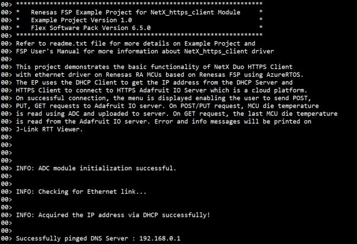

Initialization and menu options:

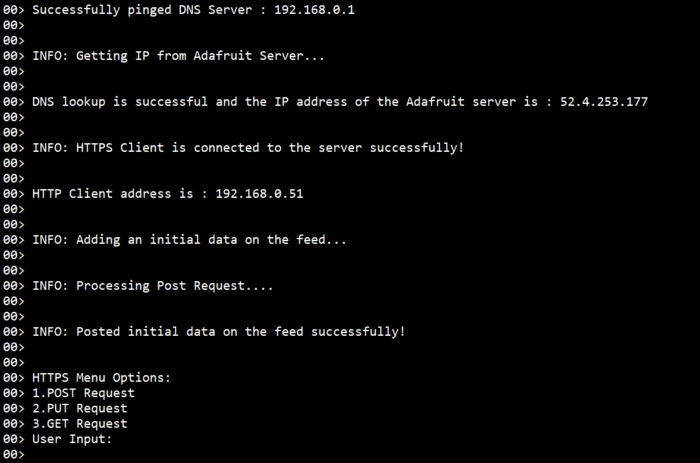

Post request: 

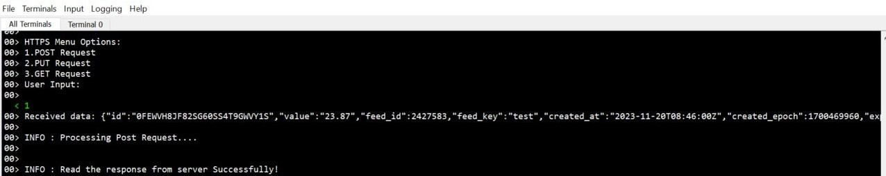

Put request:

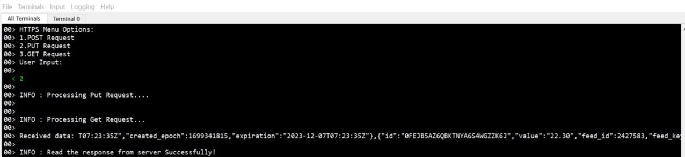

Get request:

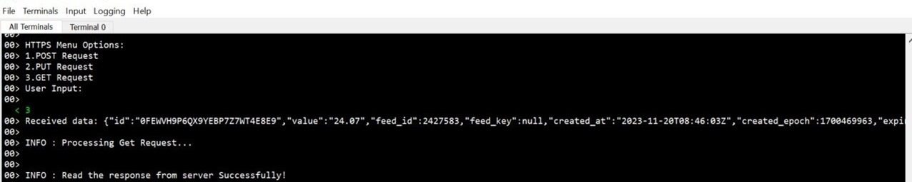

After executing the HTTP menu options, the updated data will be shown in the user feed on the Adafruit IO server.

The image below shows the Adafruit server with updated data:

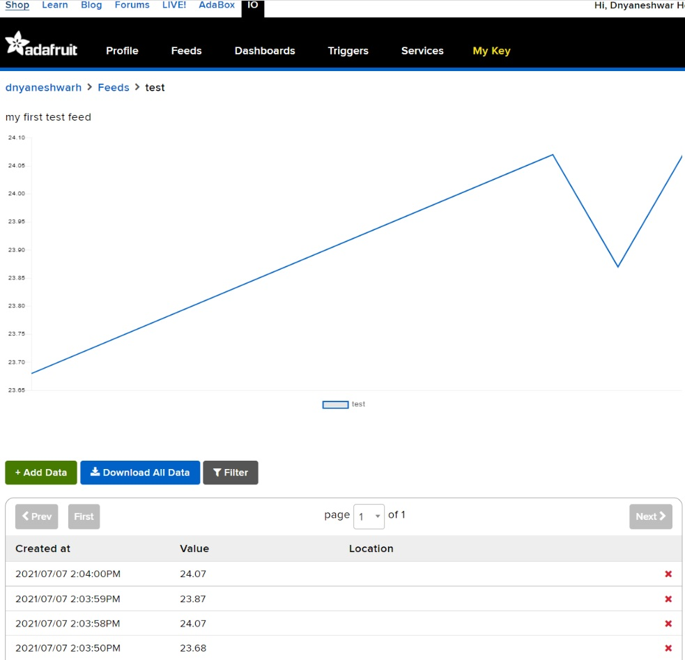

## Special Topics ##

**I. Obtaining Adafruit server credentials**:

Following steps guide you on how to obtain the username and AIO key from Adafruit IO server.

1. Go to https://io.adafruit.com. Click on **Get Started for Free** option as shown in the image below.

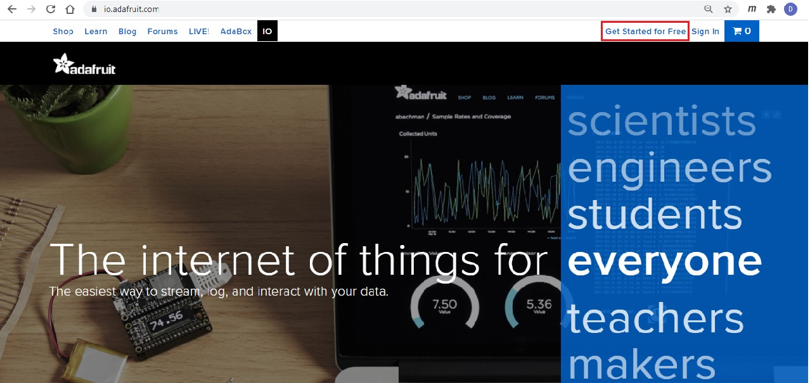

2. Create an account by providing the requested details to obtain user credintails viz., **username** and **password**.

3. After successful creation of account, username will display on top of the page as shown in the image below.
   Click on **IO**, Dashboard will display with the following options **Feeds, Dashboards, My key** etc.

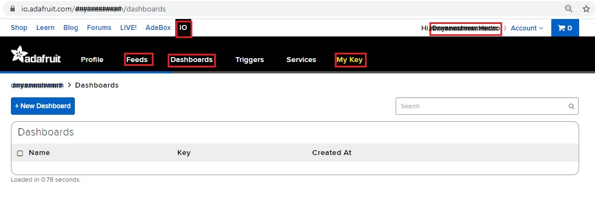

4. Click on My Key option to see your **username** and **Active key**. These two details are important for communicating with Adafruit server. If the key is compromised, we can generate the new key by clicking on the Regenerate key option as shown in the image below.

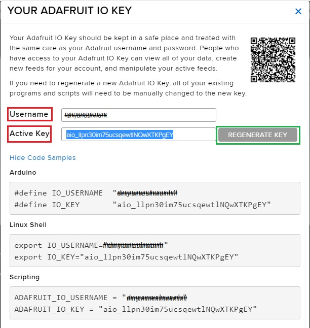

5. For creating a new feed, go to Feeds > view all, as shown in the image below.

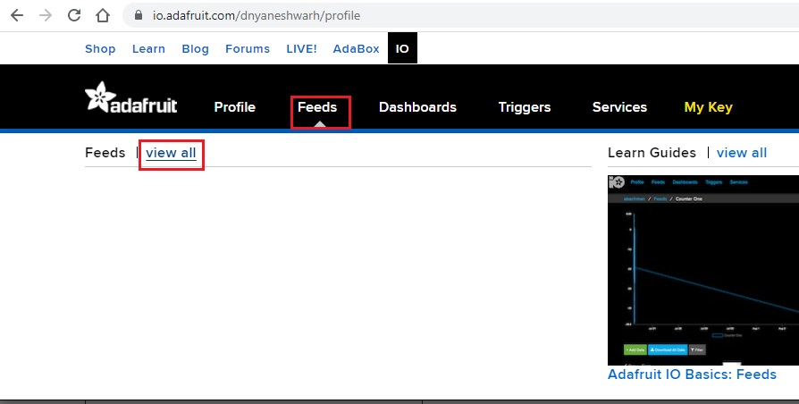

6. Then click on the "+New Feed" button, a dialog box will appear to Create a new Feed. Fill the name and description of feed and click on "Create" button, as shown in the image below.
 
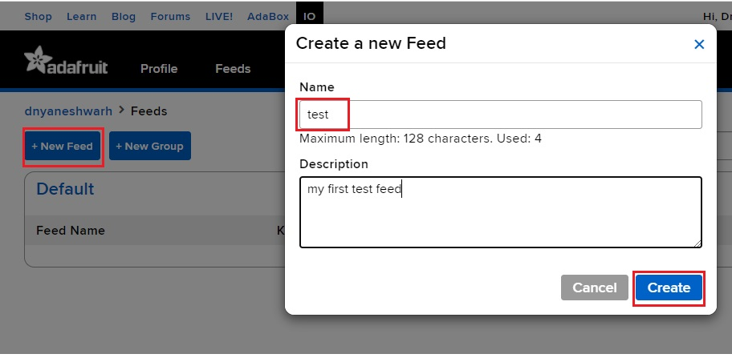

7. After obtaining the username, IO key, feed name from mentioned above steps (3-6). The user has to update the following details at respective URL macros in the **NetX_https_client_ep/src/user_app.h** file as shown in the image below.

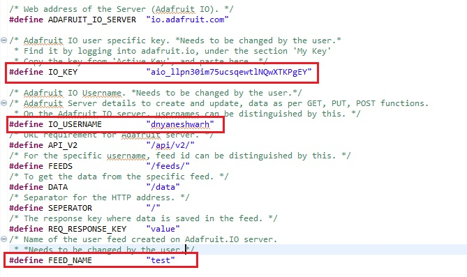

**II. Obtaining Server Certificate:**

1. Open browser and paste the following URL https://cacerts.digicert.com/GeoTrustTLSRSACAG1.crt. Server certificate with .crt extension will be downloaded with the file name **GeoTrustTLSRSACAG1.crt**.

2. After downloaded the .crt file, need to be converted to .pem format using `OpenSSL`.

3. `OpenSSL` can be downloaded from https://www.openssl.org/source/. depends on the Operating System (mainly for Linux), required installer can be downloaded and installed.

   For Windows users, `OpenSSL` can be downloaded from https://slproweb.com/products/Win32OpenSSL.html.

4. Copy the downloaded certificate to the bin folder of your installed openssl.

5. The user needs to use `git bash` to convert file to .h file. `git bash` can be downloaded from https://git-scm.com/download.

6. Open the `git bash` in Administrator mode from the bin folder as shown in the image below.

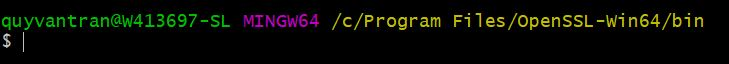

7. Type the conversion command: **openssl.exe x509 -inform DER -outform PEM -in GeoTrustTLSRSACAG1.crt -out GeoTrustTLSRSACAG1.crt.pem** as shown in the image below.
 
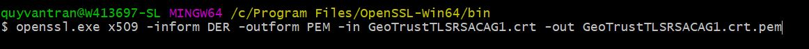
 
8. GeoTrustTLSRSACAG1.crt.pem file will be generated in your bin folder as shown in the image below.
 
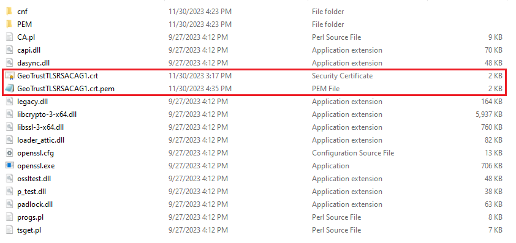

9. Convert the Certificate into a C Hex array, with command: **openssl.exe x509 -outform der -in GeoTrustTLSRSACAG1.crt.pem -out GeoTrustTLSRSACAG1.der; xxd -i GeoTrustTLSRSACAG1.der > GeoTrustTLSRSACAG1.crt.h**.

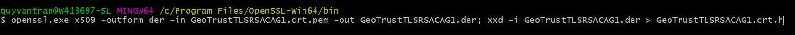

10. The file will generate a similarly named file with a “.h” extension, which contains the C array.

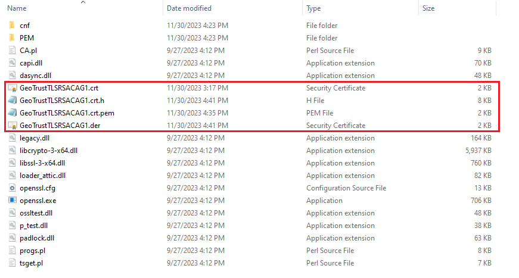

11. Update the contents of the **ca_cert_der** array in the **...\e2studio\src\https_client_app.c** file using the content from the **GeoTrustTLSRSACAG1.crt.h** file as shown in the image below.

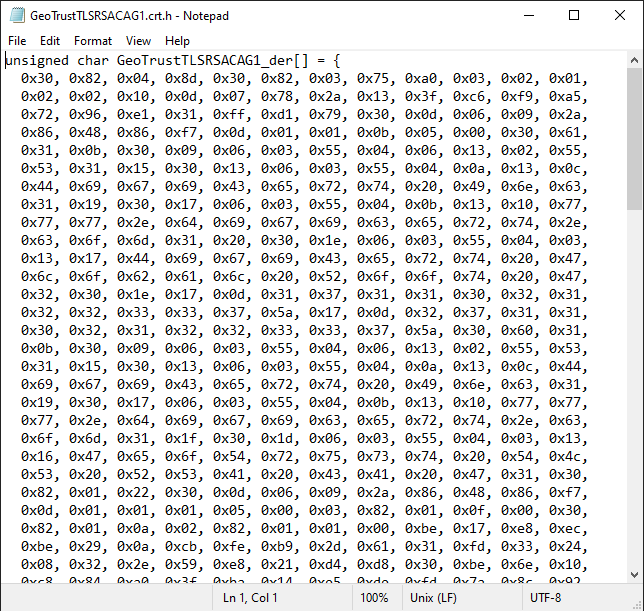
