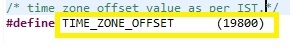

# Introduction #
The sample code accompanying this file demonstrates the operation of a NetX Duo SNTP Client on an RA MCU using Azure RTOS. In this example, a NetX Duo IP instance is created with the default IP address 0.0.0.0 (not yet assigned). The NetX stack is enabled with support for UDP, ICMP, and ARP protocols. The SNTP Client uses the UDP protocol to perform time synchronization in a simple, stateless manner.

The SNTP Client creates its own packet pool based on the configured minimum packet payload size and the number of packets in the pool. It uses the DHCP Client to obtain an IP address from the DHCP Server, and the DNS Client to resolve the IP address of the NTP pool server URL through DNS lookup.

Once the SNTP Client is created and initialized, it periodically polls the SNTP Server and waits for a response. When a response is received, the Client verifies that it contains a valid time update by applying a series of “sanity checks” as recommended in [RFC 4330](https://datatracker.ietf.org/doc/html/rfc4330). The Client then compares the received server time with the local RTC clock and applies any necessary adjustment to synchronize the RTC.

Status messages, client information, and initialization progress are displayed on the J-Link RTT Viewer.

The NetX Duo SNTP Client is compliant with [RFC1769](https://www.rfc-editor.org/rfc/rfc1769.html) and related RFCs.

Please refer to the [Example Project Usage Guide](https://github.com/renesas/ra-fsp-examples/blob/master/example_projects/Example%20Project%20Usage%20Guide.pdf) for general information on example projects and [readme.txt](./readme.txt) for specifics of operation.

## Required Resources ##
To build and run the SNTP Client example project, the following resources are needed.

### Hardware ###
Supported RA boards: EK-RA6M3, EK-RA6M4, EK-RA6M5, EK-RA8M1, EK-RA8D1, MCK-RA8T1, EK-RA8M2  
* 1 x Renesas RA board.
* 1 x Type-C USB cable for programming and debugging.
* 1 x Ethernet/LAN cable (Ethernet cable CAT5/6).
* 1 x Ethernet switch.

### Hardware Connections ###
* For EK-RA6M3, EK-RA6M4, EK-RA6M5, EK-RA8M1, EK-RA8D1:
  * Connect the RA board USB device port to the host machine via a micro USB cable.
  * Connect LAN cable on RA board at ethernet port and other end connect to Ethernet switch/router.
  * For EK-RA8M1, the user must remove jumper J61 to enable Ethernet B.

  * For EK-RA8D1, the user must set the configuration switches (SW1) as below to avoid potential failures:
    * CAUTION: Do not enable SW1-4 and SW1-5 together. 

    | SW1-1 PMOD1 | SW1-2 TRACE | SW1-3 CAMERA | SW1-4 ETHA | SW1-5 ETHB | SW1-6 GLCD | SW1-7 SDRAM | SW1-8 I3C |
    |-------------|-------------|--------------|------------|------------|------------|-------------|-----------|
    | OFF | OFF | OFF | OFF | ON | OFF | OFF | OFF |

* For MCK-RA8T1, EK-RA8M2:
    * For EK-RA8M2, the user must place jumper J6 on pins 2-3, J8 on pins 1-2, J9 on pins 2-3, and J29 on pins 1-2, 3-4, 5-6, 7-8 to use the on-board debug functionality.
    * Connect the RA board USB device port to the host machine via a Type-C USB cable.
    * Connect LAN cable on RA board at ethernet port and other end connect to Ethernet switch/router.

### Software ###
Refer to software requirements mentioned in [Example Project Usage Guide](https://github.com/renesas/ra-fsp-examples/blob/master/example_projects/Example%20Project%20Usage%20Guide.pdf)

## Related Collateral References ##
The following documents can be referred to for enhancing your understanding of the operation of this example project:
- [FSP User Manual on GitHub](https://renesas.github.io/fsp/)
- [FSP Known Issues](https://github.com/renesas/fsp/issues)

# Project Notes #
## System Level Block Diagram ##

## FSP Modules Used ##
List all the various modules that are used in this example project. Refer to the FSP User Manual for further details on each module listed below.

| Module Name | Usage  | Searchable Keyword (using New Stack > Search) |
|-------------|-----------------------------------------------|-----------------------------------------------|
| NetX Duo SNTP Client| To get access of NetX SNTP Client library for establishing a client connection. | sntp |
| NetX Duo IP Instance | For IP communication the NetX IP instance needs to be used. SNTP Client uses the IPv4. | NetX Duo IP|
| NetX Duo Packet Pool | Packet Pool Module is used to send and receive the data packets created over UDP network. | NetX Duo Packet Pool |
| NetX Duo Ethernet driver | Ethernet connection is required for physical connection to connect over network. | NetX Duo Ethernet Driver |
| NetX Duo DHCP IPv4 Client | DHCPv4 module is used to obtain IP address and to automate the process of configuring devices on IP networks, by using network services such as DNS, SNTP, and any communication protocol based on UDP or TCP. | dhcp |
| NetX Duo DNS Client | DNS Module is used as network service to get the IP address of the Domain (Server) to which the SNTP Client is getting connected. | NetX Duo DNS Client |
| RTC | RTC module is used for keeping the local system time.  And if any time difference exists between RTC clock and SNTP server clock, then RTC clock gets updated to the network clock. | rtc |

## Module Configuration Notes ##
This section describes FSP Configurator properties that are important or different from those selected by default. 

|   Module Property Path and Identifier   |   Default Value   |   Used Value   |   Reason   |
| :-------------------------------------: | :---------------: | :------------: | :--------: |
| configuration.xml > BSP > Properties > Settings > Property > RA Common > Heap size (bytes) | 0 | 0x400 | Heap size is required for using standard library functions. |
| configuration.xml > Stacks > Threads > SNTP Client Thread > Properties > Settings > Property > Thread > Priority | 1 | 2 | SNTP Client thread priority is lowered to allow the IP thread to process incoming packets at the fastest rate possible. |
| configuration.xml > Stacks > Threads > RTT_Thread > Properties > Settings > Property > Thread > Priority | 1 | 3 | RTT thread priority is lowered to allow the SNTP Client and IP threads to process incoming packets at the fastest rate possible. |

## API Usage ##
The table below lists the SNTP Client, DHCP Client, DNS Client and RTC API used at the application layer by this example project.

| API Name    | Usage                                                                          |
|-------------|--------------------------------------------------------------------------------|
| nx_sntp_client_create | This API is used to create a SNTP Client. |
| nx_sntp_client_set_time_update_notify | This API is used to set the SNTP update callback. |
| nx_sntp_client_initialize_unicast | This API is used to set up the SNTP Client to run in unicast mode. |
| nx_sntp_client_initialize_broadcast | This API is used to set up the SNTP Client to run in broadcast mode. |
| nx_sntp_client_set_local_time | This API is used to set the SNTP Client local time. |
| nx_sntp_client_run_unicast | This API is used to run the Client in unicast mode. |
| nx_sntp_client_run_broadcast | This API is used to run the Client in broadcast mode. |
| nx_sntp_client_receiving_updates | This API is used to indicate if Client is receiving valid updates. |
| nx_sntp_client_get_local_time_extended | This API is used to get the extended SNTP Client local time. |
| nx_sntp_client_utility_display_date_time | This API is used to convert an NTP Time to Date and Time string. |
| nx_sntp_client_stop | This API is used to stop the SNTP Client service. |
| nx_sntp_client_delete | This API is used to delete an SNTP Client. |
| nx_system_initialize | This API is used to initialize the various components and system data structures. |
| nx_packet_pool_create | This API is used to create a packet pool of the specified packet size in the memory area supplied by the user. |
| nx_ip_address_get | This API is used to retrieve IP address and its subnet mask of the primary network interface. |
| nx_ip_create | This API is used to create an IP instance with the user supplied IP address and network driver. |
| nx_udp_enable | This API is used to enable the UDP service. |
| nx_icmp_enable | This API is used to enable the Internet Control Message Protocol (ICMP) component for the specified IP instance. |
| nx_ip_status_check | This API is used to check and optionally wait for the specified status of a previously created IP instance. |
| nx_dhcp_create | This API is used to create a DHCP instance for the previously created IP instance. |
| nx_dhcp_packet_pool_set | This API is used to allow the application to create the DHCP Client packet pool. |
| nx_dhcp_start | This API is used to start DHCP processing on all interfaces enabled for DHCP. |
| nx_dhcp_user_option_retrieve | This API is used to retrieve the specified DHCP option from the DHCP options buffer on the first interface enabled for DHCP found on the DHCP Client record. |
| nx_dns_create | This API is used to create a DNS Client instance for the previously created IP instance. |
| nx_dns_packet_pool_set | This API is used to set a previously created packet pool as the DNS Client packet pool. |
| nx_dns_server_add | This API is used to add an IPv4 DNS Server to the server list. |
| nx_dns_host_by_name_get | This API is used to request IP address, from one or more DNS Servers previously specified by the application. |
| R_RTC_Open | This API is used to open and configure the RTC driver module. |
| R_RTC_Close | This API is used to close the RTC driver module. |
| R_RTC_CalendarTimeSet | This API is used to set the calendar time. |
| R_RTC_CalendarTimeGet | This API is used to get the calendar time. |

## Verifying Operation ##
Import, build, and debug the example project (see section Starting Development of **FSP User Manual**).

After running the example project, open J-Link RTT Viewer to observe the output.

Before running the example project, ensure the following hardware connections are in place:
* Connect the RA MCU debug port to the host PC via a Type-C USB cable. 
* Connect an Ethernet cable to the ethernet port on RA MCU via ethernet switch/hub which is connected to Router or LAN where DHCP server is residing.
* Ensure that a DHCP server is available on the network to assign an IP address to the RA MCU running this SNTP Client example project.

The image below showcases the hardware connection setup required for running the EP:

The images below showcase the output on J-Link RTT Viewer:

## Special Topics ##
* The user can obtain the server time in their time zone by changing the **TIME_ZONE_OFFSET** macro value present in the **src\rtc_app.h** file, as shown in the below image.

         
  Refer to [timezone](https://www.epochconverter.com/timezones) to determine the appropriate **TIME_ZONE_OFFSET** macro value for the required time zone.

* To select the unicast or broadcast mode, configure the **UNICAST** macro value in the **src\sntp_client_ep.h** file as follows:
  * Set to 1 for unicast mode.
  * Set to 0 for broadcast mode.

   
  
  **Note:** This EP currently works only in unicast mode. Broadcast mode is not supported because timestamp updates are not received in this mode.
