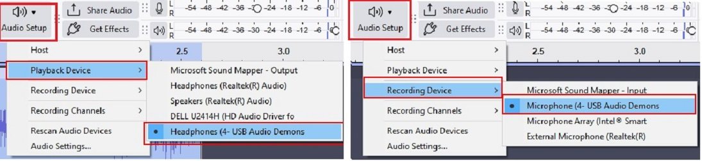
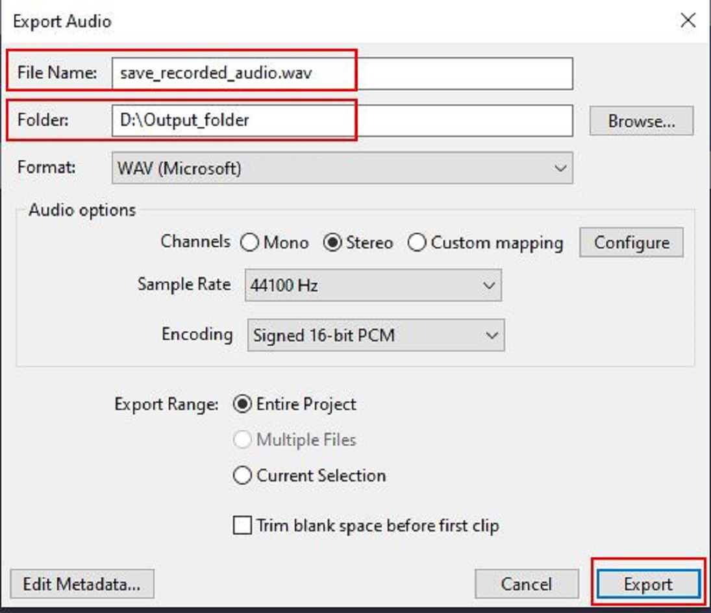
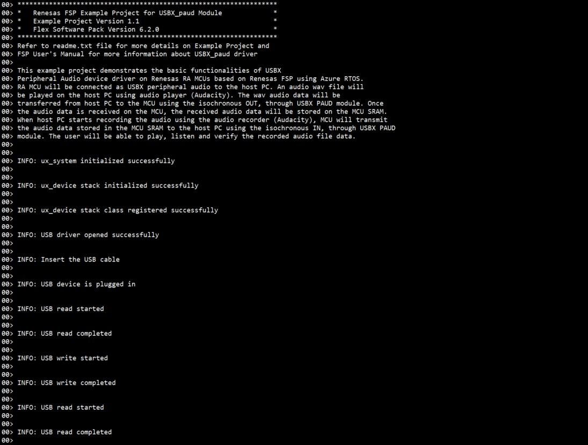
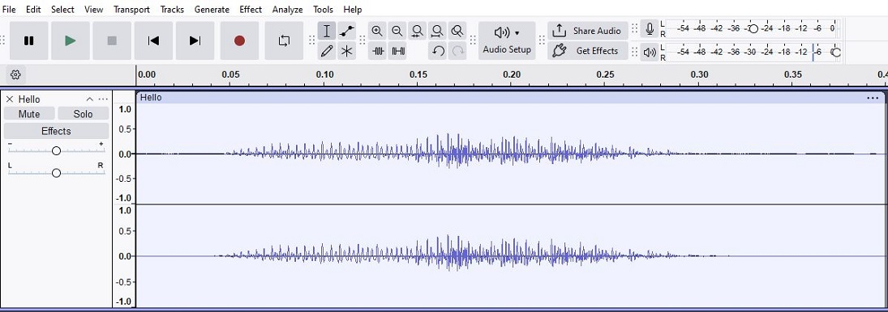

# Introduction #
This Project demonstrates the basic functionalities of USBX Peripheral Audio device driver on Renesas RA MCUs based on Renesas FSP using Azure RTOS. The RA MCU will be connected as USBX peripheral audio to the Host PC. An audio wave file will be played on the Host PC using an audio player (Audacity). The wave audio data will be transferred from Host PC to the MCU using the isochronous OUT, through USBX PAUD module. Once the audio data is received on the MCU, the received audio data will be stored on the MCU SRAM. When Host PC starts recording the audio using the audio recorder (Audacity), MCU will send the audio data stored in the MCU SRAM to the Host PC using the isochronous IN, through USBX PAUD module. The user will be able to play, listen and verify the recorded audio file data. The application status messages will be displayed on the J-Link RTT Viewer.

Please refer to the [Example Project Usage Guide](https://github.com/renesas/ra-fsp-examples/blob/master/example_projects/Example%20Project%20Usage%20Guide.pdf) 
for general information on example projects and [readme.txt](./readme.txt) for specifics of operation.

## Required Resources ##
To build and run the USBX PAUD example project, the following resources are needed.

### Software ###
* Renesas Flexible Software Package (FSP): Version 6.3.0
* e2 studio: Version 2025-12
* SEGGER J-Link RTT Viewer: Version 8.92
* LLVM Embedded Toolchain for ARM: Version 21.1.1
* Audacity v3.7.3 (Audio Player/Recorder) (https://www.audacityteam.org/download/)

* Refer to the software required section in [Example Project Usage Guide](https://github.com/renesas/ra-fsp-examples/blob/master/example_projects/Example%20Project%20Usage%20Guide.pdf)
* Refer to [Special Topics](#special-topics) for more information of USBX PAUD setup.

### Hardware ###
* Supported RA boards: EK-RA4M2, EK-RA4M3, EK-RA6M1, EK-RA6M2, EK-RA6M3, EK-RA6M4, EK-RA6M5, EK-RA8M1, EK-RA8D1, MCK-RA8T1, EK-RA4L1, EK-RA8E2, EK-RA8P1, MCK-RA8T2, EK-RA8M2
  * 1 x Renesas RA board.
  * 2 x Type-C USB cables for programming and debugging.
  * 1 x PC with at least 2 USB ports (1 for debug and 1 for emulated USB Audio port).

### Hardware Connections: ###
* For EK-RA6M1, EK-RA6M2 (Full Speed):
	1. Connect the RA board USB FS port (J9) to the PC via Micro USB cable.
	2. Connect the RA board USB debug port (J11) to the PC via Micro USB cable for EP debugging.

* For EK-RA4M2, EK-RA4M3, EK-RA6M4 (Full Speed):
  1. Jumper J12: connect pins 2-3.
  2. Connect jumper J15 pins.
	3. Connect the RA board USB FS port (J11) to the PC via Micro USB cable.
	4. Connect the RA board USB debug port (J10) to the PC via Micro USB cable for EP debugging.

* For EK-RA6M3 (High Speed):
  1. Jumper J7: connect pins 2-3.
  2. Connect jumper J17 pins.
	3. Connect the RA board USB HS port (J6) to the PC via Micro USB cable.
	4. Connect the RA board USB debug port (J10) to the PC via Micro USB cable for EP debugging.

* For EK-RA6M5, EK-RA8M1 (High Speed):
  1. Jumper J7: connect pins 2-3.
  2. Connect jumper J17 pins.
	3. Connect the RA board USB HS port (J31) to the PC via Micro USB cable.
	4. Connect the RA board USB debug port (J10) to the PC via Micro USB cable for EP debugging.

* For EK-RA8D1 (High Speed):
  * Note: The user must turn OFF SW1-6 to use USBHS.
  1. Jumper j7: connect pins 2-3.
  2. Connect jumper j17 pins.
  3. Connect the RA board USB HS port (J31) to the PC via Micro USB cable.
	4. Connect the RA board USB debug port (J10) to the PC via Micro USB cable for EP debugging.

* For MCK-RA8T1 (Full Speed):
  1. Jumper JP9: connect pins 2-3.
  2. Connect jumper JP10 pins.
  3. Connect the RA board USB FS port (CN14) to the PC via Type-C USB cable.
	4. Connect the RA board USB debug port (CN11) to the PC via Type-C USB cable for EP debugging.

* For EK-RA4L1 (Full Speed):
  1. The user must turn ON S4-4 to select USB device mode.
  2. Jumper J17: connect pins 2-3, connect jumper J7 pins to use P407 for USBFS VBUS.
  3. Connect the RA board USB FS port (J11) to the PC via Type-C USB cable.
	4. Connect the RA board USB debug port (J10) to the PC via Type-C USB cable for EP debugging.

* For EK-RA8E2 (Full Speed):
	1. Connect the RA board USB FS port (J11) to the PC via Type-C USB cable.
	2. Connect the RA board USB debug port (J10) to the PC via Type-C USB cable for EP debugging.

*	For EK-RA8P1, EK-RA8M2 (High Speed):
	* Note: For EK-RA8M2, the user must place jumper J6 on pins 2-3, J8 on pins 1-2, J9 on pins 2-3, and J29 on pins 1-2, 3-4, 5-6, 7-8 to use the on-board debug functionality.
	1. Connect the RA board USB HS port (J7) to the PC via Type-C USB cable.
	2. Connect the RA board USB debug port (J10) to the PC via Type-C USB cable for EP debugging.

* For MCK-RA8T2 (Full Speed):
  1. Jumper JP6: connect pins 2-3.
  2. Connect jumper JP7 pins.
  3. Connect the RA board USB FS port (CN18) to the PC via Type-C USB cable.
  4. Connect the RA board USB debug port (CN13) to the PC via Type-C USB cable for EP debugging.

## Related Collateral References ##
The following documents can be referred to for enhancing your understanding of the operation of this example project:
- [FSP User Manual on GitHub](https://renesas.github.io/fsp/)
- [FSP Known Issues](https://github.com/renesas/fsp/issues)

# Project Notes #

## System Level Block Diagram ##
 High level block diagram:  

## FSP Modules Used ##
List all the various modules that are used in this example project. Refer to the FSP User Manual for further details on each module listed below.

| Module Name | Usage | Searchable Keyword  |
|-------------|-----------------------------------------------|-----------------------------------------------|
| USBX PAUD | USBX PAUD is used to communicate with the Host machine to perform read audio from the Host and write the same back to the Host. | rm_usbx_port |
| USB Basic Driver | USB driver is required for hardware configuration on RA MCU. | r_usb_basic |
| DMAC Transfer | DMAC is used to transfer the USB data to offload MCU usage. | r_dmac |

## Module Configuration Notes ##
This section describes FSP Configurator properties which are important or different than those selected by default.

**Common Configuration Properties**
|   Module Property Path and Identifier   |   Default Value   |   Used Value   |   Reason   |
| :-------------------------------------: | :---------------: | :------------: | :--------: |
| configuration.xml > Stacks > Threads > USBX Paud Thread > Properties > Settings > Property > Common > Timer > Timer Ticks Per Second | 100 | 1000 | The default ticks should be 1000 indicating 1 tick per millisecond. |
| configuration.xml > Stacks > Threads > USBX Paud Thread > Properties > Settings > Property > Thread > Priority | 1 | 15 | USBX Paud thread priority is lowered to allow the other USB operations to be serviced at a faster rate. |
| configuration.xml > Stacks > Threads > RTT Thread > Properties > Settings > Property > Thread > Priority | 1 | 16 | RTT thread priority is lowered to allow the internal thread taking priority. |
| configuration.xml > Stacks > Threads > USBX Paud Thread > g_basic0 USB (r_usb_basic) > Properties > Settings > Property > Common > DMA/DTC Support | DMA Disabled | DMA Enabled | DMAC is used to handle the USB data transfer to offload MCU usage. |

**Configuration Properties if USB Speed as High Speed**
|   Module Property Path and Identifier   |   Default Value   |   Used Value   |   Reason   |
| :-------------------------------------: | :---------------: | :------------: | :--------: |
| configuration.xml > Stacks > Threads > USBX Paud Thread > g_basic0 USB (r_usb_basic) > Properties > Settings > Property > Common > DMA/DTC Source Address | DMA Disabled | HS Address | USB basic driver is configured **USB Speed** as **Hi Speed**. Accordingly, DMA Source Address should be provided with **HS Address**. |
| configuration.xml > Stacks > Threads > USBX Paud Thread > g_basic0 USB (r_usb_basic) > Properties > Settings > Property > Common > DMA/DTC Destination Address | DMA Disabled | HS Address | USB basic driver is configured **USB speed** as **Hi Speed**. Accordingly, DMA Destination Address should be provided with **HS Address**. |
| configuration.xml > Stacks > Threads > USBX Paud Thread > g_basic0 USB (r_usb_basic) > Properties > Settings > Property > Module g_basic0 USB (r_usb_basic) > USB Speed | Full Speed | Hi Speed | USB Speed is configured as **Hi Speed**. According to the USB Speed, DMA settings should be updated. |
| configuration.xml > Stacks > Threads > USBX Paud Thread > g_basic0 USB (r_usb_basic) > Properties > Settings > Property > Module g_basic0 USB (r_usb_basic) > USB Module Number | USB_IP0 Port | USB_IP1 Port | This property is used to specify USB module number to be used as per configured USB speed. |
| configuration.xml > Stacks > Threads > USBX Paud Thread > g_transfer0 Transfer (r_dmac) > Properties > Settings > Property > Module g_transfer0 Transfer (r_dmac) > Transfer Size | 2 Bytes | 4 Bytes | The transfer size of DMA for **High Speed** requires **4 Bytes**. |
| configuration.xml > Stacks > Threads > USBX Paud Thread > g_transfer0 Transfer (r_dmac) > Properties > Settings > Property > Module g_transfer0 Transfer (r_dmac) > Activation Source | No ELC Trigger | USBHS FIFO 1 (DMA/DTC transfer request 1)  |This is an event trigger for DMA transfer 0 instance for destination pointer address. |
| configuration.xml > Stacks > Threads > USBX Paud Thread > g_transfer1 Transfer (r_dmac) > Properties > Settings > Property > Module g_transfer1 Transfer (r_dmac) > Transfer Size | 2 Bytes | 4 Bytes | The transfer size of DMA for **High Speed** requires **4 Bytes**. |
| configuration.xml > Stacks > Threads > USBX Paud Thread > g_transfer1 Transfer (r_dmac) > Properties > Settings > Property > Module g_transfer1 Transfer (r_dmac) > Activation Source | No ELC Trigger | USBHS FIFO 0 (DMA/DTC transfer request 0) | This is an event trigger for DMA transfer 1 instance for source pointer address. |

**Configuration Properties if USB Speed as Full Speed**
|   Module Property Path and Identifier   |   Default Value   |   Used Value   |   Reason   |
| :-------------------------------------: | :---------------: | :------------: | :--------: |
| configuration.xml > Stacks > Threads > USBX Paud Thread > g_basic0 USB (r_usb_basic) > Properties > Settings > Property > Common > DMA/DTC Source Address | DMA Disabled | FS Address | USB basic driver is configured **USB Speed** as **Full Speed**. Accordingly, DMA Source Address should be provided with **FS Address**. |
| configuration.xml > Stacks > Threads > USBX Paud Thread > g_basic0 USB (r_usb_basic) > Properties > Settings > Property > Common > DMA/DTC Destination Address | DMA Disabled | FS Address | USB basic driver is configured **USB speed** as **Full Speed**. Accordingly, DMA Destination Address should be provided with **FS Address**. |
| configuration.xml > Stacks > Threads > USBX Paud Thread > g_basic0 USB (r_usb_basic) > Properties > Settings > Property > Module g_basic0 USB (r_usb_basic) > USB Speed | Full Speed | Full Speed | USB Speed is configured as **Full Speed**. According to the USB Speed, DMA settings should be updated. |
| configuration.xml > Stacks > Threads > USBX Paud Thread > g_basic0 USB (r_usb_basic) > Properties > Settings > Property > Module g_basic0 USB (r_usb_basic) > USB Module Number | USB_IP0 Port | USB_IP0 Port | This property is used to specify USB module number to be used as per configured USB speed. |
| configuration.xml > Stacks > Threads > USBX Paud Thread > g_transfer0 Transfer (r_dmac) > Properties > Settings > Property > Module g_transfer0 Transfer (r_dmac) > Transfer Size | 2 Bytes | 2 Bytes | The transfer size of DMA for **Full Speed** requires **2 Bytes**. |
| configuration.xml > Stacks > Threads > USBX Paud Thread > g_transfer0 Transfer (r_dmac) > Properties > Settings > Property > Module g_transfer0 Transfer (r_dmac) > Activation Source | No ELC Trigger | USBFS FIFO 1 (DMA/DTC transfer request 1)  |This is an event trigger for DMA transfer 0 instance for destination pointer address. |
| configuration.xml > Stacks > Threads > USBX Paud Thread > g_transfer1 Transfer (r_dmac) > Properties > Settings > Property > Module g_transfer1 Transfer (r_dmac) > Transfer Size | 2 Bytes | 2 Bytes | The transfer size of DMA for **Full Speed** requires **2 Bytes**. |
| configuration.xml > Stacks > Threads > USBX Paud Thread > g_transfer1 Transfer (r_dmac) > Properties > Settings > Property > Module g_transfer1 Transfer (r_dmac) > Activation Source | No ELC Trigger | USBFS FIFO 0 (DMA/DTC transfer request 0) |This is an event trigger for DMA transfer 1 instance for source pointer address. |

Refer to [User Callback Handlers](#user-callback-handlers) section for user callback.

The table below lists the FSP provided API used at the application layer by this example project.
| API Name    | Usage                                                                          |
|-------------|--------------------------------------------------------------------------------|
| [ux_system_initialize](https://docs.microsoft.com/en-us/azure/rtos/usbx/usbx-device-stack-2#initialization-of-usbx-resources) | This API is used to initialize the USBX system. |
| [ux_device_stack_initialize](https://docs.microsoft.com/en-us/azure/rtos/usbx/usbx-device-stack-4#ux_device_stack_initialize) | This API is used to initialize the USBX device stack. |
| [ux_device_stack_class_register](https://docs.microsoft.com/en-us/azure/rtos/usbx/usbx-device-stack-4#ux_device_stack_class_register) | This API is used to register the slave class to the slave stack. |
| [ux_device_class_audio_stream_get](https://docs.microsoft.com/en-us/azure/rtos/usbx/usbx-device-stack-supplemental-2#ux_device_class_audio_stream_get) | This API is used to get specific stream instance for the Audio function. |
| [ux_device_class_audio_reception_start](https://docs.microsoft.com/en-us/azure/rtos/usbx/usbx-device-stack-supplemental-2#ux_device_class_audio_reception_start) | This API is used to start audio data reading in audio streams. |
| [ux_device_class_audio_read_frame_get](https://docs.microsoft.com/en-us/azure/rtos/usbx/usbx-device-stack-supplemental-2#ux_device_class_audio_read_frame_get) | This API is used to read an audio frame in an audio stream. |
| [ux_device_class_audio_read_frame_free](https://docs.microsoft.com/en-us/azure/rtos/usbx/usbx-device-stack-supplemental-2#ux_device_class_audio_read_frame_free) | This API is used to free the audio frame buffer at the front of the specified stream's FIFO so that it can receive data from the Host. |
| [ux_device_class_audio_frame_write](https://docs.microsoft.com/en-us/azure/rtos/usbx/usbx-device-stack-supplemental-2#ux_device_class_audio_frame_write) | This API is used to write a frame to the audio stream's FIFO. The frame data is copied to the available buffer in the FIFO so that it can be sent to the Host. |
| [ux_device_class_audio_transmission_start](https://docs.microsoft.com/en-us/azure/rtos/usbx/usbx-device-stack-supplemental-2#ux_device_class_audio_transmission_start) | This API is used to start sending audio data written to the FIFO in the audio class. |
| [ux_device_class_audio20_control_process](https://docs.microsoft.com/en-us/azure/rtos/usbx/usbx-device-stack-supplemental-2#ux_device_class_audio20_control_process) | This API is used to process USB Audio 2.0 control requests. |
| [ux_device_class_audio10_control_process](https://docs.microsoft.com/en-us/azure/rtos/usbx/usbx-device-stack-supplemental-2#ux_device_class_audio10_control_process) | This API is used to process USB Audio 1.0 control requests. |

Refer to [USBX Device Class Considerations](https://docs.microsoft.com/en-us/azure/rtos/usbx/usbx-device-stack-5#usb-device-cdc-acm-class) for more details of API used.

## Verifying Operation ##
* Import the EP and perform the following update if USB speed configuration is changed, in addition to the updates described in the section “Module Configuration Notes”.

  **For High Speed USB on EK-RA6M5, EK-RA6M3, EK-RA8M1, EK-RA8D1, EK-RA8P1, EK-RA8M2:**
  
    * Uncomment the macro APL_AUDIO_20 in usbx_paud_ep.h
	
  **For Full Speed USB on EK-RA4M2, EK-RA4M3, EK-RA6M1, EK-RA6M2, EK-RA6M3, EK-RA6M4, EK-RA6M5, EK-RA8M1, EK-RA8D1, MCK-RA8T1, EK-RA4L1, EK-RA8E2, EK-RA8P1, MCK-RA8T2, EK-RA8M2:**
  
    * Comment the macro APL_AUDIO_20 in usbx_paud_ep.h  

  **Note:** High Speed USB is enabled by default in the project configuration for MCUs that support High-Speed operation. For MCUs that only support Full Speed USB, the default configuration is set accordingly. 

* Build and debug the EP (see section Starting Development of FSP User Manual). After running the EP, open J-Link RTT Viewer to see the output status of the EP.
* Open any audio record and playback application on the host (for example **Audacity**).
* Select the MIC and Speaker from the PC application to use the enumerated Audio Peripheral Device “**Headset Earphone (USB Audio Demonstration)**” and “**Microphone (USB Audio Demonstration)**”.

 

* Click **File > Open** and select the audio sample file.
* Play the selected audio sample from the host.
* Create a new instance by clicking **File > New**.
* Select the MIC and Speaker from the PC application to use the enumerated Audio Peripheral Device “**Headset Earphone (USB Audio Demonstration)** ” and “**Microphone (USB Audio Demonstration)** ”.

 

* Start recording Audio from instance created above.
* Stop the recording.
* Save the recording by clicking **File > Export Audio... > Export to computer > name the audio file > Export**.

 

* Verify the playback and recorded sample are similar.
* Disconnect the kit and play the exported file to hear the recorded audio.

 

1. The output on **J-Link RTT Viewer**:

 

2. The sample played in **Audacity** and recorded in the MCU:  

* The sample played from the MCU in **Audacity**:

  

* The sample recorded from the MCU in **Audacity**:

  

## Special Topics ##
### Developing Descriptor ###
A USB device provides information about itself in data structures called USB descriptors. 	

The host obtains descriptors from an attached device by sending various standard control requests to the default endpoint. Those requests specify the type of descriptor to retrieve. In response to such requests, the device sends descriptors that include information about the device, its configurations, interfaces and the related endpoints.

* Refer **Descriptor** section in [Device Class (rm_usbx_port)](https://renesas.github.io/fsp/group___u_s_b_x.html) for developing the descriptor. We can take the template file (**rm_usbx_pcdc_descriptor.c.template**) of the required USB combination from **ra/fsp/src/rm_usbx_port** folder and use the same in the source folder by removing the **.template** file extension.

### User Callback Handlers ###
1. **apl_status_change_cb()** which handles the USB Attach and Remove events.
2. **apl_audio_instance_activate()** and **apl_audio_instance_deactivate()**, which handle the device stack enumeration events.

### Limitations of USBX PAUD Example Project ###
1. The Audio stored in the RAM is limited by the available RAM size of the MCU.
2. This EP establishes a physical audio device channel. Playback based on audio format is not handled on the MCU. Verification of data transmission is done on the PC.

| Board            |MCU RAM          | Audio File Parameters   | Max Audio Length          | Max File size | 
|------------------|-----------------|-------------------------|----------------------------|----------------|
| EK-RA6M3         | SRAM - 512 KB   | **File Type** - .wav file   **Bit rate** - 44100 hz (16 bit)   **Mono/Stereo** - Stereo   | 2 secs     		|         375 KB |
| EK-RA6M5         | SRAM - 512 KB   | **File Type** - .wav file   **Bit rate** - 44100 hz (16 bit)   **Mono/Stereo** - Stereo   | 2 secs     		|         375 KB |
| EK-RA6M1         | SRAM - 256 KB   | **File Type** - .wav file   **Bit rate** - 44100 hz (16 bit)   **Mono/Stereo** - Stereo   | 1 sec    			|         187 KB |
| EK-RA6M2         | SRAM - 384 KB   | **File Type** - .wav file   **Bit rate** - 44100 hz (16 bit)   **Mono/Stereo** - Stereo   | 1 sec     			|         187 KB |
| EK-RA6M4         | SRAM - 256 KB   | **File Type** - .wav file   **Bit rate** - 44100 hz (16 bit)   **Mono/Stereo** - Stereo   | 1 sec     			|         187 KB |
| EK-RA4M2         | SRAM - 128 KB   | **File Type** - .wav file   **Bit rate** - 44100 hz (16 bit)   **Mono/Stereo** - Stereo   | 200 msecs   		|         47 KB  |
| EK-RA4M3         | SRAM - 128 KB   | **File Type** - .wav file   **Bit rate** - 44100 hz (16 bit)   **Mono/Stereo** - Stereo   | 200 msecs   		|         47 KB  |
| EK-RA8M1         | SRAM - 1024 KB  | **File Type** - .wav file   **Bit rate** - 44100 hz (16 bit)   **Mono/Stereo** - Stereo   | 4 secs   		  |         750 KB |
| EK-RA8D1         | SRAM - 1024 KB  | **File Type** - .wav file   **Bit rate** - 44100 hz (16 bit)   **Mono/Stereo** - Stereo   | 4 secs   		  |         750 KB |
| MCK-RA8T1        | SRAM - 1024 KB  | **File Type** - .wav file   **Bit rate** - 44100 hz (16 bit)   **Mono/Stereo** - Stereo   | 4 secs   		  |         750 KB |
| EK-RA4L1         | SRAM - 64 KB    | **File Type** - .wav file   **Bit rate** - 44100 hz (16 bit)   **Mono/Stereo** - Stereo   | 60 msecs   	  |         11 KB  |
| EK-RA8E2         | SRAM - 672 KB   | **File Type** - .wav file   **Bit rate** - 44100 hz (16 bit)   **Mono/Stereo** - Stereo   | 2.5 secs   		|         464 KB |
| EK-RA8P1         | SRAM - 2048 KB  | **File Type** - .wav file   **Bit rate** - 44100 hz (16 bit)   **Mono/Stereo** - Stereo   | 9 secs   		  |        1497 KB |
| MCK-RA8T2        | SRAM - 2048 KB  | **File Type** - .wav file   **Bit rate** - 44100 hz (16 bit)   **Mono/Stereo** - Stereo   | 9 secs   		  |        1497 KB |
| EK-RA8M2         | SRAM - 2048 KB  | **File Type** - .wav file   **Bit rate** - 44100 hz (16 bit)   **Mono/Stereo** - Stereo   | 9 secs   		  |        1497 KB |