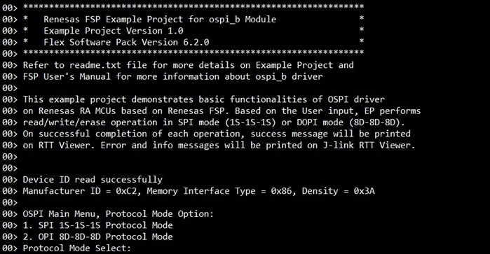
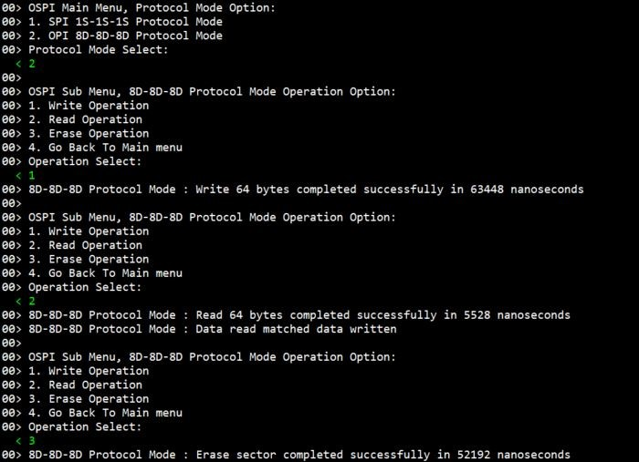

# Introduction #
This example project demonstrates basic functionalities of OSPI_B driver on Renesas RA MCUs based on Renesas FSP.  
In the Main menu, based on RTT Viewer input, the user selects mode for opsi_b module operations.  
1. SPI 1S-1S-1S protocol mode.
2. OPI 8D-8D-8D protocol mode.

In the Sub Menu, based on RTT Viewer input, the user selects operations to perform.  
1. Write data to OSPI flash device.
2. Read back data from OSPI flash device.
3. Erase a sector of OSPI flash device.
4. Go back to main menu.

On successful completion of each operation, a success message and execution time of operation will be displayed on J-link RTT Viewer. Error messages and information will be printed on J-link RTT Viewer.

Please refer to the [Example Project Usage Guide](https://github.com/renesas/ra-fsp-examples/blob/master/example_projects/Example%20Project%20Usage%20Guide.pdf) for general information on example projects and [readme.txt](./readme.txt) for specifics of operation.

## Required Resources ## 
To build and run the OSPI_B example project, the following resources are needed.

### Software ###
* Renesas Flexible Software Package (FSP): Version 6.2.0
* e2 studio: Version 2025-10
* SEGGER J-Link RTT Viewer: Version 8.74
* LLVM Embedded Toolchain for ARM: Version 18.1.3

Refer to the software required section in [Example Project Usage Guide](https://github.com/renesas/ra-fsp-examples/blob/master/example_projects/Example%20Project%20Usage%20Guide.pdf)

### Hardware ###
Supported RA boards: EK-RA8M1, EK-RA8D1, EK-RA8P1, EK-RA8M2
* 1 x Renesas RA board.
* 1 x Type-C USB cable for programming and debugging.

### Hardware Connection ###
* Connect the USB Debug port on the RA board to the host PC via a Type-C USB cable.

### Hardware Configurations ###
* For EK-RA8P1: Set the configuration switches (SW4) as below to avoid potential failures.

| SW4-1 PMOD1_SEL0 |SW4-2 PMOD1_SEL1 | SW4-3 OSPI | SW4-4 ARDUINO | SW4-5 I3C | SW4-6 MIPI | SW4-7 USBFS_ROLE | SW4-8 USBHS_ROLE |
|:-------------:|:-------------:|:-------------:|:-------------:|:-------------:|:-------------:|:-------------:|:-------------:|
| OFF | OFF | OFF | OFF | OFF | OFF | OFF | OFF |

* For EK-RA8M2: The user must place jumper J6 on pins 2-3, J8 on pins 1-2, J9 on pins 2-3, and J29 on pins 1-2, 3-4, 5-6, 7-8 to use the on-board debug functionality.

## Related Collateral References ##
The following documents can be referred to for enhancing your understanding of the operation of this example project:
- [FSP User Manual on GitHub](https://renesas.github.io/fsp/)
- [FSP Known Issues](https://github.com/renesas/fsp/issues)

# Project Notes #

## System Level Block Diagram ##
 High level block diagram of the system is as shown below:
 

## FSP Modules Used ##
List all the various modules that are used in this example project. Refer to the FSP User Manual for further details on each module listed below.

| Module Name | Usage | Searchable Keyword  |
|-------------|-----------------------------------------------|-----------------------------------------------|
| OSPI_B | OSPI_B is used to configure flash device and perform write, read, or erase operations on flash device's memory array. | r_ospi_b |
| GPT | GPT is used to measure execution time of OSPI_B module operations. | r_gpt |

## Module Configuration Notes ##
This section describes FSP Configurator properties which are important or different from those selected by default. 

**Configuration Properties for using OSPI_B**
|   Module Property Path and Identifier   |   Default Value   |   Used Value   |   Reason   |
|-----------------------------------------|-------------------|----------------|------------|
| configuration.xml > Stacks > g_ospi_b OSPI Flash (r_ospi_b) > Properties > Settings > Property > Common > Memory-mapping Support > Prefetch Function | Enable | Enable | Reduce the latency when reading data. |
| configuration.xml > Stacks > g_ospi_b OSPI Flash (r_ospi_b) > Properties > Settings > Property > Common > Memory-mapping Support > Combination Function | 64 Bytes | 64 Bytes | Increase throughput on xSPI bus when writing data. |
| configuration.xml > Stacks > g_ospi_b OSPI Flash (r_ospi_b) > Properties > Settings > Property > Common > DMAC Support | Disable | Enable | Enable DMAC support for the OSPI module. |
| configuration.xml > Stacks > g_ospi_b OSPI Flash (r_ospi_b) > Properties > Settings > Property > Common > Autocalibration Support | Disable | Enable | Enable DS autocalibration for dual-data-rate modes. |
| configuration.xml > Stacks > g_ospi_b OSPI Flash (r_ospi_b) > Properties > Settings > Property > Module g_ospi_b OSPI Flash (r_ospi_b) > General > Chip Select | CS1 | CS1 | Use OSPI_B Channel 1 to communicate with flash device. |
| configuration.xml > Stacks > g_ospi_b OSPI Flash (r_ospi_b) > Properties > Settings > Property > Module g_ospi_b OSPI Flash (r_ospi_b) > General > Write Status Bit | b0 | b0 | Position of the status bit in the flash device register. |
| configuration.xml > Stacks > g_ospi_b OSPI Flash (r_ospi_b) > Properties > Settings > Property > Module g_ospi_b OSPI Flash (r_ospi_b) > General > Write Enable Bit | b1 | b1 | Position of the write enable bit in the flash device register. |
| configuration.xml > Stacks > g_ospi_b OSPI Flash (r_ospi_b) > Properties > Settings > Property > Module g_ospi_b OSPI Flash (r_ospi_b) > General > DS Auto-calibration Pattern Address | 0x00 | 0x90002000 | Set the address of the read/write destination to be performed for auto-calibration. |
| configuration.xml > Stacks > g_ospi_b OSPI Flash (r_ospi_b) > Properties > Settings > Property > Module g_ospi_b OSPI Flash (r_ospi_b) > Command Sets > Erase Sizes > Sector Erase | 4096 | 4096 | Sector size of the flash device. |
| configuration.xml > Stacks > g_ospi_b OSPI Flash (r_ospi_b) > Properties > Settings > Property > Module g_ospi_b OSPI Flash (r_ospi_b) > Command Sets > Erase Sizes > Block Erase | 262144 | 65536 | Block size of the flash device. |
| configuration.xml > Stacks > g_ospi_b OSPI Flash (r_ospi_b) > Properties > Settings > Property > Module g_ospi_b OSPI Flash (r_ospi_b) > Command Sets > Initial Mode > Read > Command Code | 0x13 | 0x0C | Read Command of flash device in SPI (1S-1S-1S) protocol mode. |
| configuration.xml > Stacks > g_ospi_b OSPI Flash (r_ospi_b) > Properties > Settings > Property > Module g_ospi_b OSPI Flash (r_ospi_b) > Command Sets > Initial Mode > Read > Dummy Cycles | 0 | 8 | Memory Read Dummy Cycles of flash device in SPI (1S-1S-1S) protocol mode. |
| configuration.xml > Stacks > g_ospi_b OSPI Flash (r_ospi_b) > Properties > Settings > Property > Module g_ospi_b OSPI Flash (r_ospi_b) > Command Sets > Initial Mode > Program > Command Code | 0x12 | 0x12 | Page program command of flash device in SPI (1S-1S-1S) protocol mode. |
| configuration.xml > Stacks > g_ospi_b OSPI Flash (r_ospi_b) > Properties > Settings > Property > Module g_ospi_b OSPI Flash (r_ospi_b) > Command Sets > Initial Mode > Write Enable > Command Code | 0x06 | 0x06 | Write Enable Command of flash device in SPI (1S-1S-1S) protocol mode. |
| configuration.xml > Stacks > g_ospi_b OSPI Flash (r_ospi_b) > Properties > Settings > Property > Module g_ospi_b OSPI Flash (r_ospi_b) > Command Sets > Initial Mode > Status Read > Command Code | 0x05 | 0x05 | Status Read command of flash device in SPI (1S-1S-1S) protocol mode. |
| configuration.xml > Stacks > g_ospi_b OSPI Flash (r_ospi_b) > Properties > Settings > Property > Module g_ospi_b OSPI Flash (r_ospi_b) > Command Sets > Initial Mode > Status Read > Dummy Cycles | 0 | 0 | Status Read Dummy Cycles of flash device in SPI (1S-1S-1S) protocol mode. |
| configuration.xml > Stacks > g_ospi_b OSPI Flash (r_ospi_b) > Properties > Settings > Property > Module g_ospi_b OSPI Flash (r_ospi_b) > Command Sets > Initial Mode > Sector Erase > Command Code| 0x21 | 0x21 | Sector Erase Command of flash device in SPI (1S-1S-1S) protocol mode. |
| configuration.xml > Stacks > g_ospi_b OSPI Flash (r_ospi_b) > Properties > Settings > Property > Module g_ospi_b OSPI Flash (r_ospi_b) > Command Sets > Initial Mode > Block Erase > Command Code | 0xDC | 0xDC | Block Erase Command of flash device in SPI (1S-1S-1S) protocol mode. |
| configuration.xml > Stacks > g_ospi_b OSPI Flash (r_ospi_b) > Properties > Settings > Property > Module g_ospi_b OSPI Flash (r_ospi_b) > Command Sets > Initial Mode > Chip Erase > Command Code | 0x60 | 0x60 | Chip Erase Command of flash device in SPI (1S-1S-1S) protocol mode. |
| configuration.xml > Stacks > g_ospi_b OSPI Flash (r_ospi_b) > Properties > Settings > Property > Module g_ospi_b OSPI Flash (r_ospi_b) > Command Sets > Initial Mode > Protocol Mode | SPI (1S-1S-1S) | SPI (1S-1S-1S) | Select SPI (1S-1S-1S) as the initial protocol mode. |
| configuration.xml > Stacks > g_ospi_b OSPI Flash (r_ospi_b) > Properties > Settings > Property > Module g_ospi_b OSPI Flash (r_ospi_b) > Command Sets > Initial Mode > Address Length | 1 byte | 4 bytes | Select the number of address bytes to be 4 bytes for the initial protocol mode. |
| configuration.xml > Stacks > g_ospi_b OSPI Flash (r_ospi_b) > Properties > Settings > Property > Module g_ospi_b OSPI Flash (r_ospi_b) > Command Sets > High-speed Mode > Read > Command Code | 0xEEEE | 0xEE11 | Read Command of flash device in Dual data rate OPI (8D-8D-8D) protocol mode. |
| configuration.xml > Stacks > g_ospi_b OSPI Flash (r_ospi_b) > Properties > Settings > Property > Module g_ospi_b OSPI Flash (r_ospi_b) > Command Sets > High-speed Mode > Read > Dummy Cycles | 20 | 10 | Memory Read Dummy Cycles of flash device in dual data rate OPI (8D-8D-8D) protocol mode. |
| configuration.xml > Stacks > g_ospi_b OSPI Flash (r_ospi_b) > Properties > Settings > Property > Module g_ospi_b OSPI Flash (r_ospi_b) > Command Sets > High-speed Mode > Program > Command Code | 0x1212 | 0x12ED | Page program command of flash device in Dual data rate OPI (8D-8D-8D) protocol mode. |
| configuration.xml > Stacks > g_ospi_b OSPI Flash (r_ospi_b) > Properties > Settings > Property > Module g_ospi_b OSPI Flash (r_ospi_b) > Command Sets > High-speed Mode > Write Enable > Command Code | 0x0606 | 0x06F9 | Write Enable Command of flash device in Dual data rate OPI (8D-8D-8D) protocol mode. |
| configuration.xml > Stacks > g_ospi_b OSPI Flash (r_ospi_b) > Properties > Settings > Property > Module g_ospi_b OSPI Flash (r_ospi_b) > Command Sets > High-speed Mode > Status Read > Command Code | 0x0505 | 0x05FA | Status Read command of flash device in Dual data rate OPI (8D-8D-8D) protocol mode. |
| configuration.xml > Stacks > g_ospi_b OSPI Flash (r_ospi_b) > Properties > Settings > Property > Module g_ospi_b OSPI Flash (r_ospi_b) > Command Sets > High-speed Mode > Status Read > Dummy Cycles | 3 | 4 | Status Read Dummy Cycles of flash device in dual data rate OPI (8D-8D-8D) protocol mode. |
| configuration.xml > Stacks > g_ospi_b OSPI Flash (r_ospi_b) > Properties > Settings > Property > Module g_ospi_b OSPI Flash (r_ospi_b) > Command Sets > High-speed Mode > Sector Erase > Command Code | 0x2121 | 0x21DE | Sector Erase Command of flash device in Dual data rate OPI (8D-8D-8D) protocol mode. |
| configuration.xml > Stacks > g_ospi_b OSPI Flash (r_ospi_b) > Properties > Settings > Property > Module g_ospi_b OSPI Flash (r_ospi_b) > Command Sets > High-speed Mode > Block Erase > Command Code | 0xDCDC | 0xDC23 | Block Erase Command of flash device in Dual data rate OPI (8D-8D-8D) protocol mode. |
| configuration.xml > Stacks > g_ospi_b OSPI Flash (r_ospi_b) > Properties > Settings > Property > Module g_ospi_b OSPI Flash (r_ospi_b) > Command Sets > High-speed Mode > Chip Erase > Command Code | 0x6060 | 0x609F | Chip Erase Command of flash device in Dual data rate OPI (8D-8D-8D) protocol mode. |
| configuration.xml > Stacks > g_ospi_b OSPI Flash (r_ospi_b) > Properties > Settings > Property > Module g_ospi_b OSPI Flash (r_ospi_b) > Command Sets > High-speed Mode > Protocol Mode | Dual data rate OPI (8D-8D-8D) | Dual data rate OPI (8D-8D-8D) | Select Dual data rate OPI (8D-8D-8D) as the high-speed protocol mode. |
| configuration.xml > Stacks > g_ospi_b OSPI Flash (r_ospi_b) > Properties > Settings > Property > Module g_ospi_b OSPI Flash (r_ospi_b) > Command Sets > High-speed Mode > Command Code Length | 2 bytes | 2 bytes | Command length of flash device in dual data rate OPI (8D-8D-8D) protocol mode. |
| configuration.xml > Stacks > g_ospi_b OSPI Flash (r_ospi_b) > Properties > Settings > Property > Module g_ospi_b OSPI Flash (r_ospi_b) > Timing Settings > DDR > Sampling Window Extension | None | 7 cycles | Set number of cycles to extending the data sampling window in DDR mode. |
| configuration.xml > Stacks > g_ospi_b OSPI Flash (r_ospi_b) > Properties > Settings > Property > Module g_ospi_b OSPI Flash (r_ospi_b) > Timing Settings > DS Latching Delay | Auto-calibrate | Auto-calibrate | Set this to trigger auto-calibration when appropriate. |

**Configuration Properties for using GPT**

|   Module Property Path and Identifier   |   Default Value   |   Used Value   |   Reason   |
|-----------------------------------------|-------------------|----------------|------------|
| configuration.xml > Stacks > g_timer_periodic Timer, General PWM (r_gpt) > Settings > Property > Module g_timer_periodic Timer, General PWM (r_gpt) > General > Channel | 0 | 0 | Use GPT Channel 0 to measure execution time of OSPI_B module operations. |

## API Usage ##
The table below lists the FSP provided API used at the application layer by this example project.

| API Name    | Usage                                                                          |
|-------------|--------------------------------------------------------------------------------|
| R_OSPI_B_Open | This API is used to initialize OSPI_B module. |
| R_OSPI_B_SpiProtocolSet | This API is used to change OSPI_B's protocol mode. |
| R_OSPI_B_DirectTransfer | This API is used to write, or read flash device register. |
| R_OSPI_B_Write | This API is used to write data to flash device memory array. |
| R_OSPI_B_Erase | This API is used to erase a Flash device's sector. |
| R_OSPI_B_Close | This API is used to de-initialize OSPI_B module. |
| R_GPT_Open | This API is used to initialize GPT module. |
| R_GPT_Reset | This API is used to clear GPT count value. |
| R_GPT_Start | This API is used to start GPT module. |
| R_GPT_StatusGet | This API is used to get GPT count value. |
| R_GPT_InfoGet | This API is used to get GPT clock frequency. |
| R_GPT_Stop | This API is used to stop GPT module. |
| R_GPT_Close | This API is used to de-initialize GPT module. |
| R_BSP_OctaclkUpdate | This API is used to update the clock source for the OSPI_B module. |

## Verifying Operation ##
1. Import, generate, build, and flash the example project to the RA board.
2. Open J-Link RTT Viewer.
3. After the Main Menu is displayed on J-Link RTT Viewer, type '1' and enter to select SPI 1S-1S-1S protocol mode, or type '2' and enter to select OPI 8D-8D-8D protocol mode.
4. After the Sub Menu is displayed on J-Link RTT Viewer, type '1' and enter to perform a write operation, type '2' and enter to perform a read operation, type '3' and enter to perform an erase operation, or type '4' and enter to go back to main menu.

