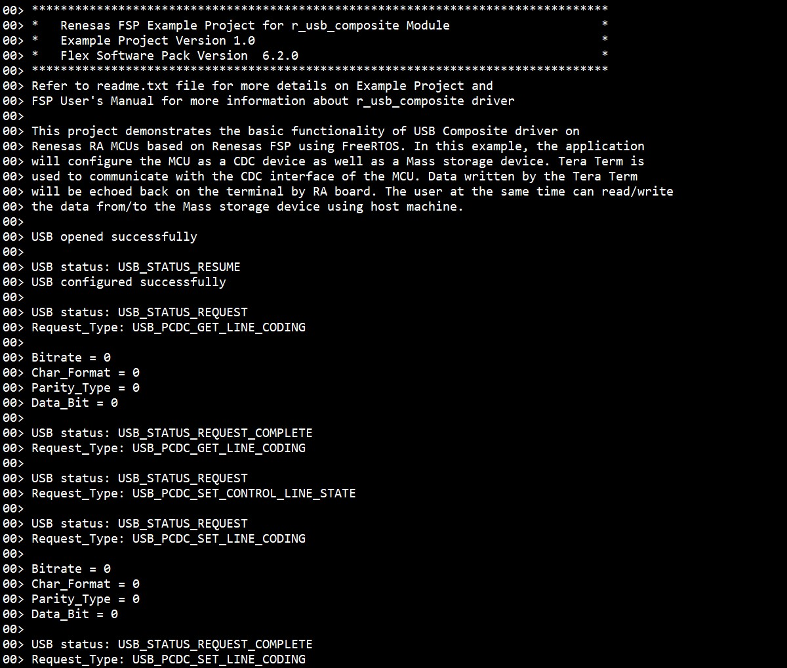
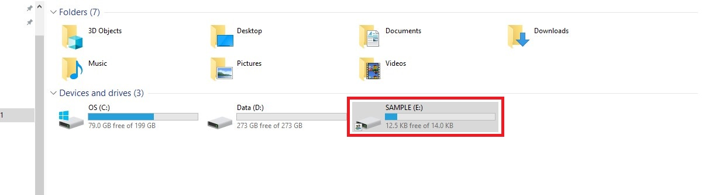
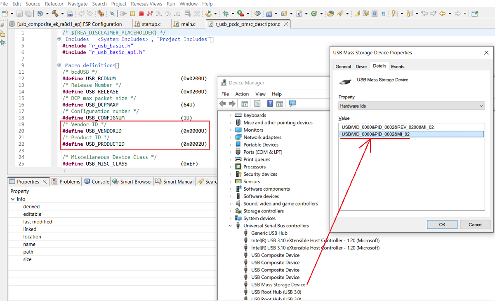

# Introduction #
This project demonstrates the basic functionality of USB Composite driver on Renesas RA MCUs based on Renesas FSP using FreeRTOS. In this example, the application will configure the MCU as a CDC device as well as a Mass storage device. Tera Term is used to communicate with the CDC interface of the MCU. Data written by the Tera Term will be echoed back on the terminal by RA board. The user at the same time can read/write the data from/to the Mass storage device using host machine. When the host sets or changes the control line state, the on-board LED will be toggled.

Please refer to the [Example Project Usage Guide](https://github.com/renesas/ra-fsp-examples/blob/master/example_projects/Example%20Project%20Usage%20Guide.pdf) for general information on example projects and [readme.txt](./readme.txt) for specifics of operation.

## Required Resources ##
To build and run the usb composite example project, the following resources are needed.

### Software ###
Refer to software described in [Example Project Usage Guide](https://github.com/renesas/ra-fsp-examples/blob/master/example_projects/Example%20Project%20Usage%20Guide.pdf)

### Hardware ###
* 1 x Renesas RA board.
* 2 x Type-C USB cables.
* 1 x Host PC with at least 2 USB ports (1 for debug and 1 for COM port).

### Hardware Connections ###
* For EK-RA6M1, EK-RA6M2 (Full-Speed):
    * Connect micro-AB USB Full-Speed port (J9) of the RA board to USB port of the host PC via a micro USB cable.

* For EK-RA4M2, EK-RA4M3, EK-RA6M4, EK-RA6M3, EK-RA6M3G, EK-RA6M5, EK-RA8M1, EK-RA8D1 (Full-Speed):
    * Jumper J12: Connect pins 2-3.
    * Connect the jumper J15 pins. 
    * Connect the micro-AB USB Full-Speed port (J11) of the RA board to USB port of the host PC via a micro USB cable.

* For MCK-RA8T1 (Full-Speed):
    * Jumper JP9: Connect pins 2-3.
    * Connect the jumper JP10 pins.
    * Connect the Type-C USB Full-Speed port (CN14) of the RA board to USB port of the host PC via a Type-C USB cable.

* For EK-RA4L1 (Full-Speed):
    * Turn ON S4-4 to select USB device mode.
    * Set J17 jumper to pins 2-3, Set J7 jumper to use P407 for USBFS VBUS.
    * Connect the Type-C USB Full-Speed port (J11) of the RA board to USB port of the host PC via a Type-C USB cable.

* For EK-RA8E2, EK-RA8P1, EK-RA8M2 (Full-Speed):
    * For EK-RA8M2: The user must place jumper J6 on pins 2-3, J8 on pins 1-2, J9 on pins 2-3, and J29 on pins 1-2, 3-4, 5-6, 7-8 to use the on-board debug functionality.
    * Connect the Type-C USB Full-Speed port (J11) of the RA board to USB port of the host PC via a Type-C USB cable.

* For MCK-RA8T2 (Full-Speed):
	* Jumper JP6: Connect pins 2-3.
	* Connect the jumper JP7 pins.
    * Connect the Type-C USB Full-Speed port (CN18) of the RA board to USB port of the host PC via a Type-C USB cable.

* For EK-RA6M3, EK-RA6M3G (High-Speed):
    * Jumper J7: Connect pins 2-3.
    * Connect the jumper J17 pins.
    * Connect the micro-AB USB High-Speed port (J6) of the RA board to USB port of the host PC via a micro USB cable.
		
* For EK-RA6M5, EK-RA8M1, EK-RA8D1 (High-Speed): 
    * For EK-RA8D1, the user needs to turn OFF SW1-6 to use USB HS.
    * Jumper J7: Connect pins 2-3.
    * Connect the jumper J17 pins.
    * Connect the micro-AB USB High-Speed port (J31) of the RA board to USB port of the host PC via a micro USB cable.

* For EK-RA8P1, EK-RA8M2 (High-Speed):
    * For EK-RA8M2: The user must place jumper J6 on pins 2-3, J8 on pins 1-2, J9 on pins 2-3, and J29 on pins 1-2, 3-4, 5-6, 7-8 to use the on-board debug functionality.
    * Connect the Type-C USB High-Speed port (J7) of the RA board to USB port of the host PC via a Type-C USB cable.

## Related Collateral References ##
The following documents can be referred to for enhancing your understanding of the operation of this example project:
- [FSP User Manual on GitHub](https://renesas.github.io/fsp/)
- [FSP Known Issues](https://github.com/renesas/fsp/issues)

# Project Notes #
## System Level Block Diagram ##

## FSP Modules Used ##
List all the various modules that are used in this example project. Refer to the FSP User Manual for further details on each module listed below.

| Module Name | Usage  | Searchable Keyword (using New Stack > Search) |
|-------------|-----------------------------------------------|-----------------------------------------------|
| USB composite | USB composite device works as a USB Peripheral by combining two peripheral device classes and r_usb_basic module. | r_usb_composite |

## Module Configuration Notes ##
This section describes FSP Configurator properties which are important or different from those selected by default. 

|   Module Property Path and Identifier   |   Default Value   |   Used Value   |   Reason   |
| :-------------------------------------: | :---------------: | :------------: | :--------: |
| configuration.xml > Stacks > Threads > Composite Thread > Properties > Settings > Property > Thread > Stack size (bytes) | 1024 | 2048 | This is changed to handle its worst-case function call nesting and local variable usage. |
| configuration.xml > Stacks > Threads > Composite Thread > Properties > Settings > Property > Common > Memory Allocation > Support Dynamic Allocation | Disabled | Enabled | RTOS objects can be created using RAM that is automatically allocated from the FreeRTOS heap. |
| configuration.xml > Stacks > Threads > Composite Thread > Properties > Settings > Property > Common > Memory Allocation > Total Heap Size | 1024 | 10000 | This is changed because Dynamic Allocation support is enabled, so application makes use of amount of RAM available in the FreeRTOS heap. |
| configuration.xml > Stacks > Threads > Composite Thread > g_basic USB (r_usb_basic) > Properties > Settings > Property > Common > DMA/DTC Support | DMA Disabled | DMA Enabled | DMAC is used to handle the USB data transfer to offload MCU usage. |
| configuration.xml > Stacks > Threads > Composite Thread > g_basic USB (r_usb_basic) > Properties > Settings > Property > Module g_basic USB (r_usb_basic) > USB Callback | NULL | usb_composite_callback | As RTOS is used, so the callback function is set, and this callback function will notify the user about occurrence of USB events. |

### Configuration Properties for using USB Full-Speed ###
By default, the EP runs in Full-Speed mode, except for EK-RA6M3, EK-RA6M3G and EK-RA8M1 boards.

|   Module Property Path and Identifier   |   Default Value   |   Used Value   |   Reason   |
| :-------------------------------------: | :---------------: | :------------: | :--------: |
| configuration.xml > Stacks > Threads > Composite Thread > g_basic USB (r_usb_basic) > Properties > Settings > Property > Common > DMA/DTC Source Address | DMA Disabled | FS Address | USB basic driver is configured USB Speed as Full Speed. Accordingly, DMA Source Address is provided with FS Address. |
| configuration.xml > Stacks > Threads > Composite Thread > g_basic USB (r_usb_basic) > Properties > Settings > Property > Common > DMA Destination Address | DMA Disabled | FS Address | USB basic driver is configured USB speed as Full Speed. Accordingly, DMA Destination Address is provided with FS Address. |
| configuration.xml > Stacks > Threads > Composite Thread > g_basic USB (r_usb_basic) > Properties > Settings > Property > Module g_basic USB (r_usb_basic) > USB Speed | Full Speed | Full Speed | USB Speed is configured as Full Speed. |
| configuration.xml > Stacks > Threads > Composite Thread > g_basic USB (r_usb_basic) > Properties > Settings > Property > Module g_basic USB (r_usb_basic) > USB Module Number | USB_IP0 Port | USB_IP0 Port | This property is used to specify USB module number to be used as per configured USB speed. |
| configuration.xml > Stacks > Threads > Composite Thread > g_transfer0 Transfer (r_dmac) > Properties > Settings > Property > Module g_transfer0 Transfer (r_dmac) USBFS FIFO 1 (DMA/DTC transfer request 1) > Transfer Size | 2 Bytes | 2 Bytes | The transfer size of DMA for Full Speed requires 2 Bytes. |
| configuration.xml > Stacks > Threads > Composite Thread > g_transfer0 Transfer (r_dmac) > Properties > Settings > Property > Module g_transfer0 Transfer (r_dmac) USBFS FIFO 1 (DMA/DTC transfer request 1) > Activation Source | No ELC Trigger | USBFS FIFO 1 (DMA/DTC transfer request 1) | This is an event trigger for DMA transfer 0 instance for destination pointer address. |
| configuration.xml > Stacks > Threads > Composite Thread > g_transfer1 Transfer (r_dmac) > Properties > Settings > Property > Module g_transfer1 Transfer (r_dmac) USBFS FIFO 0 (DMA/DTC transfer request 0) > Transfer size | 2 Bytes | 2 Bytes | The transfer size of DMA for Full Speed requires 2 Bytes. |
| configuration.xml > Stacks > Threads > Composite Thread > g_transfer1 Transfer (r_dmac) > Properties > Settings > Property > Module g_transfer1 Transfer (r_dmac) USBFS FIFO 0 (DMA/DTC transfer request 0) > Activation Source | No ELC Trigger | USBFS FIFO 0 (DMA/DTC transfer request 0) | This is an event trigger for DMA transfer 1 instance for source pointer address. |

### Configuration Properties for using USB High-Speed ###
|   Module Property Path and Identifier   |   Default Value   |   Used Value   |   Reason   |
| :-------------------------------------: | :---------------: | :------------: | :--------: |
| configuration.xml > Stacks > Threads > Composite Thread > g_basic USB (r_usb_basic) > Properties > Settings > Property > Common > DMA/DTC Source Address | DMA Disabled | HS Address | USB basic driver is configured USB Speed as High Speed. Accordingly, DMA Source Address is provided with HS Address. |
| configuration.xml > Stacks > Threads > Composite Thread > g_basic USB (r_usb_basic) > Properties > Settings > Property > Common > DMA/DTC Destination Address | DMA Disabled | HS Address | USB basic driver is configured USB speed as High Speed. Accordingly, DMA Destination Address is provided with HS Address. |
| configuration.xml > Stacks > Threads > Composite Thread > g_basic USB (r_usb_basic) > Properties > Settings > Property > Module g_basic USB (r_usb_basic) > USB Speed | Full Speed | Hi Speed | USB Speed is configured as High Speed. |
| configuration.xml > Stacks > Threads > Composite Thread > g_basic USB (r_usb_basic) > Properties > Settings > Property > Module g_basic USB (r_usb_basic) > USB Module Number | USB_IP0 Port | USB_IP1 Port | This property is used to specify USB module number to be used as per configured USB speed. |
| configuration.xml > Stacks > Threads > Composite Thread > g_transfer0 Transfer (r_dmac) > Properties > Settings > Property > Module g_transfer0 Transfer (r_dmac) USBHS FIFO 1 (DMA transfer request 1) > Transfer size | 2 Bytes | 4 Bytes  | The transfer size of DMA for High Speed requires 4 Bytes. |
| configuration.xml > Stacks > Threads > Composite Thread > g_transfer0 Transfer (r_dmac) > Properties > Settings > Property > Module g_transfer0 Transfer (r_dmac) USBHS FIFO 1 (DMA transfer request 1) > Activation Source | No ELC Trigger | USBHS FIFO 1 (DMA transfer request 1) | This is an event trigger for DMA transfer 0 instance for destination pointer address. |
| configuration.xml > Stacks > Threads > Composite Thread > g_transfer1 Transfer (r_dmac) > Properties > Settings > Property > Module g_transfer1 Transfer (r_dmac) USBHS FIFO 0 (DMA transfer request 0) > Transfer size | 2 Bytes | 4 Bytes | The transfer size of DMA for High Speed requires 4 Bytes. |
| configuration.xml > Stacks > Threads > Composite Thread > g_transfer1 Transfer (r_dmac) > Properties > Settings > Property > Module g_transfer1 Transfer (r_dmac) USBHS FIFO 0 (DMA transfer request 0) > Activation Source | No ELC Trigger | USBHS FIFO 0 (DMA transfer request 0) | This is an event trigger for DMA transfer 1 instance for source pointer address. |

## API Usage ##
The table below lists the FSP provided API used at the application layer by this example project.

| API Name    | Usage                                                                          |
|-------------|--------------------------------------------------------------------------------|
| R_USB_Read | This API is used to read data from Tera Term, when USB Write complete state event occurred. |
| R_USB_Write | This API is used to write back the read data from MCU to Tera Term, when USB READ complete state event occurred. |
| R_USB_PeriControlDataGet | This API is used to get the class request, when USB class request type is USB_PCDC_SET_LINE_CODING. |
| R_USB_PeriControlDataSet | This API is used to set the class request, when USB class request type is USB_PCDC_GET_LINE_CODING. |
| R_USB_PeriControlStatusSet | This API is used to set the USB status as ACK response, when USB class request type is USB_PCDC_SET_CONTROL_LINE_STATE. |
| R_USB_Close | This API is used to close the opened USB instance, when any failure occurred. |
| R_IOPORT_PinWrite | This API is used to toggle the LED pin state, when USB class request type is USB_PCDC_SET_CONTROL_LINE_STATE. |

## Verifying Operation ##
1) Import and build the EP. 
2) Set up hardware connection properly.
3) Debug/Download the EP into the RA board.
4) Open the J-Link RTT Viewer to see the output.
5) Check device enumeration in **Device Manager**.
6) Open the Tera Term:
    * Select the correct COM port.
    * To echo back what was typed in Tera Term, the user needs to enable it through [Setup] -> [Terminal...] -> Check [Local echo].
    * Set parameters of the serial port: Speed, Data, Parity, Stop bits through [Setup] -> [Serial port...].
    * Type input to execute write and read operations.

**Note:**  
* On some PCs, the USB Mass Storage Device may not be recognized due to restricted access permissions for external devices.
* The usb_composite example project does not function correctly on PCs with CrowdStrike security software installed.

The images below show the EP operation:

* The output on J-Link RTT Viewer:

* The device enumeration:

**Note:** Ensure that the USB Mass Storage Device appears as a recognized disk (e.g., SAMPLE (E:)) on the host PC before checking its device enumeration. If the user runs the EP on a PC with full permissions, they will be able to perform any file operations.

* The output on Tera Term:

* Write and read operations:

* USB disconnect and reconnect behaviour:

* Note: If the user runs the example project on a PC with full permissions, they need to close Tera Term and eject the USB disk before removing the peripheral USB cable.

## Special Topics ##
### Developing Descriptor ###
Refer **Descriptor** section of [usb_composite_descriptor](https://renesas.github.io/fsp/group___u_s_b___c_o_m_p_o_s_i_t_e.html) for developing a descriptor. We can take template file of required USB combination from mentioned path in above link and use the same in source folder by removing the .template file extension.

### Pipe Selection ###
* For Bulk In/Out transfers, USB Pipe 1 to USB Pipe 5 can be used for both usb_pcdc and usb_pmsc operations. The ability of a Pipe to support a USB transfer can be found in the MCU Group User's Manual: Hardware.  
    **Note:** XML configurator will throw an error when same pipes are selected for usb_pcdc and usb_pmsc. Hence, it is recommended to select different pipes for usb_pcdc and usb_pmsc.
* For Interrupt, USB Pipe 6 to USB Pipe 9 can be used for usb_pcdc operation.
