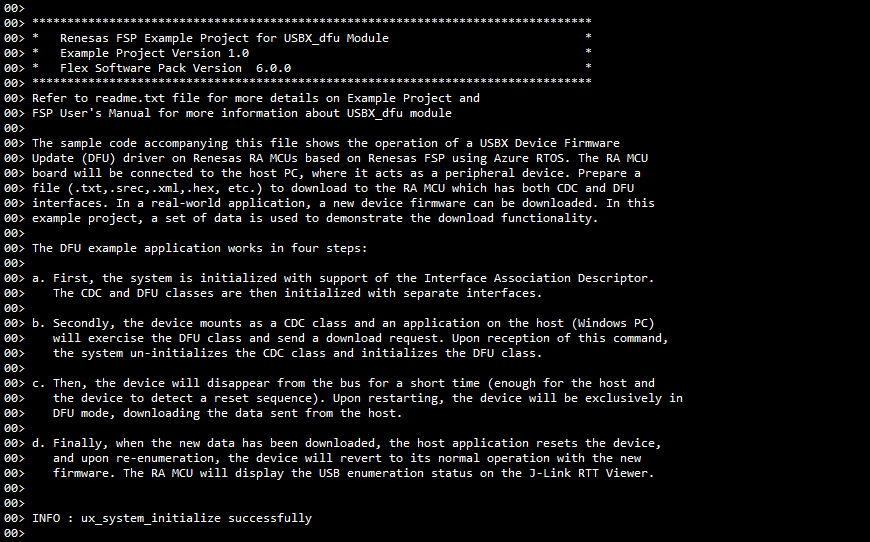

# Introduction #
The sample code accompanying this file shows the operation of a USBX Device Firmware Update (DFU) driver on Renesas RA MCUs based on Renesas FSP using Azure RTOS. The RA MCU board will be connected to the host PC, where it acts as a peripheral device. Prepare a file (.txt,.srec,.xml,.hex, etc.) to download to the RA MCU which has both CDC and DFU interfaces. In a real-world application, a new device firmware can be downloaded. In this example project, a set of data is used to demonstrate the download functionality.

The DFU example application works in four steps:

a. First, the system is initialized with support of the Interface Association Descriptor. The CDC and DFU classes are then initialized with separate interfaces.

b. Secondly, the device mounts as a CDC class and an application on the host (Windows PC) will exercise the DFU class and send a download request. Upon reception of this command, the system un-initializes the CDC class and initializes the DFU class.

c. Then, the device will disappear from the bus for a short time (enough for the host and the device to detect a reset sequence). Upon restarting, the device will be exclusively in DFU mode, downloading the data sent from the host.

d. Finally, when the new data has been downloaded, the host application resets the device, and upon re-enumeration, the device will revert to its normal operation with the new firmware. The RA MCU will display the USB enumeration status on the J-Link RTT Viewer.

Please refer to the [Example Project Usage Guide](https://github.com/renesas/ra-fsp-examples/blob/master/example_projects/Example%20Project%20Usage%20Guide.pdf) 
for general information on example projects and [readme.txt](./readme.txt) for specifics of the operation.

## Required Resources ##
To build and run the USBX Device Firmware Update (DFU) example project, the following resources are needed.

### Software ###
* Renesas Flexible Software Package (FSP): Version 6.3.0
* e2 studio: Version 2025-12
* SEGGER J-Link RTT Viewer: Version 8.92
* LLVM Embedded Toolchain for ARM: Version 21.1.1
* Zadig.exe - v2.0.1.160 (https://sourceforge.net/projects/libwdi/files/zadig/)
* dfu-util-0.11-binaries.tar.xz (https://sourceforge.net/projects/dfu-util/files/)

Note: Refer to software requirements mentioned in [Example Project Usage Guide](https://github.com/renesas/ra-fsp-examples/blob/master/example_projects/Example%20Project%20Usage%20Guide.pdf)

### Hardware ###
* Supported RA boards: EK-RA4M2, EK-RA6M1, EK-RA6M3, EK-RA6M5, EK-RA8D1, EK-RA8M1, MCK-RA8T1, EK-RA4L1, EK-RA8E2, EK-RA8P1
   * 1 x Renesas RA board.
   * 1 x Type-C USB cable for programming and debugging.
   * 1 x Type-C USB cable for connecting the RA board to the host PC.
   * 1 x Host PC with at least 2 USB ports.

### Hardware Connections: ###
* Connect USB debug port of the RA board to USB port of the host PC via a Type-C USB cable.
* For EK-RA4M2, EK-RA6M3, EK-RA6M5, EK-RA8D1, EK-RA8M1 (Full Speed):
   * Jumper J12: Connect pins 2-3.
   * Connect jumper J15 pins.
   * Connect micro-AB USB Full Speed port (J11) of the RA board to USB port of the host PC via a micro USB cable.

* For EK-RA6M1 (Full Speed):
   * Connect micro-AB USB Full Speed port (J9) of the RA board to USB port of the host PC via a micro USB cable.

* For MCK-RA8T1 (Full Speed):
   * Jumper JP9: Connect pins 2-3.
   * Connect jumper JP10 pins.
   * Connect Type-C USB Full Speed port (CN14) of the RA board to USB port of the host PC via a Type-C USB cable.

* For EK-RA4L1 (Full Speed):
   * The user must turn ON S4-4 to select USB device mode.
   * Set J17 jumper to pins 2-3, Set J7 jumper to use P407 for USBFS VBUS.
   * Connect Type-C USB Full Speed port (J11) of the RA board to USB port of the host PC via a Type-C USB cable.

* For EK-RA8E2, EK-RA8P1 (Full Speed):
   * Connect Type-C USB Full Speed port (J11) of the RA board to USB port of the host PC via a Type-C USB cable.

## Related Collateral References ##
The following documents can be referred to for enhancing your understanding of the operation of this example project:
- [FSP User Manual on GitHub](https://renesas.github.io/fsp/)
- [FSP Known Issues](https://github.com/renesas/fsp/issues)

# Project Notes #
## System Level Block Diagram ##

## FSP Modules Used ##
List all the various modules that are used in this example project. Refer to the FSP User Manual for further details on each module listed below.

| Module Name | Usage  | Searchable Keyword (using New Stack > Search) |
| :---------: | :---------------: | :------------: |
| USBX DFU | This module provides USBX DFU class support on RA device. | dfu |
| USBX PCDC | USBX PCDC is used to communicate with Host machine to perform write/read operations. | rm_usbx_port |
| USB Basic Driver | USB driver is required for hardware configuration on RA MCU. | r_usb_basic |

## Module Configuration Notes ##
This section describes FSP Configurator properties that are important or different from those selected by default. 

**Common Configuration Properties**
|   Module Property Path and Identifier   |   Default Value   |   Used Value   |   Reason   |
| :-------------------------------------: | :---------------: | :------------: | :--------: |
| configuration.xml > BSP > Properties > Settings > Property > RA Common > Heap size (bytes) | 0 | 0x400 | Heap size is required for standard library functions to be used. |
| configuration.xml > Stacks > USBX PERI DFU Thread > Properties > Settings > Property > Common > Timer > Timer Ticks Per Second | 100 | 1000 |The default ticks should be 1000 indicating 1 tick per millisecond. |
| configuration.xml > Stacks > USBX PERI DFU Thread > Properties > Settings > Property > Thread > Priority  |   1   |   15   | USBX PERI DFU Thread priority is lowered to allow the other USB operations to be serviced at a faster rate. |
| configuration.xml > Stacks > USBX PERI CDC_DFU Thread > Properties > Settings > Property > Thread > Priority | 1 | 15 | USBX PERI CDC_DFU Thread priority is lowered to allow the other USB operations to be serviced at a faster rate. |
| configuration.xml > Stacks > RTT Thread > Properties > Settings > Property > Thread > Priority | 1 | 16 | RTT thread priority is lowered to allow the internal thread taking priority. |
| configuration.xml > Stacks > RTT Thread > Properties > Settings > Property > Thread > Stack size (bytes) | 1024 | 1024 | The size of the RTT Thread Stack is increased so that data from any type of file can be printed on the J-Link RTT Viewer. |

**Configuration Properties for USB Speed as Full Speed**
|   Module Property Path and Identifier   |   Default Value   |   Used Value   |   Reason   |
| :-------------------------------------: | :---------------: | :------------: | :--------: |
| configuration.xml > Stacks > USBX PERI DFU Thread > g_basic0 USB (r_usb_basic) > Properties > Settings > Property > Module g_basic0 USB (r_usb_basic) > USB Speed | Full Speed | Full Speed | USB Speed is configured as **Full Speed**. |
| configuration.xml > Stacks > USBX PERI DFU Thread > g_basic0 USB (r_usb_basic) > Properties > Settings > Property > Module g_basic0 USB (r_usb_basic) > USB Module Number | USB_IP0 Port | USB_IP0 Port | This property is used to specify USB module number to be used as per configured USB speed. |
| configuration.xml > Stacks > USBX PERI CDC_DFU Thread > g_basic1 USB (r_usb_basic) > Properties > Settings > Property > Module g_basic1 USB (r_usb_basic) > USB Speed | Full Speed | Full Speed | USB Speed is configured as **Full Speed**. |
| configuration.xml > Stacks > USBX PERI CDC_DFU Thread > g_basic1 USB (r_usb_basic) > Properties > Settings > Property > Module g_basic1 USB (r_usb_basic) > USB Module Number | USB_IP0 Port | USB_IP0 Port | This property is used to specify USB module number to be used as per configured USB speed. |

## API Usage ##
The table below lists the FSP provided API used at the application layer by this example project.

| API Name    | Usage                                                                          |
|-------------|--------------------------------------------------------------------------------|
|ux_system_initialize| This API is used to initialize the USBX system. |
|ux_host_stack_initialize| This API is used to initialize the USBX device stack. |
|ux_device_stack_class_register| This API is used to register a slave class to the slave stack. |
|R_USB_Open| This API is used to open the USB basic driver. |
|_ux_device_class_cdc_acm_read|This API is used to read from the CDC class. |
|_ux_device_class_cdc_acm_write|This API is used to write to the CDC class. |
|_ux_utility_memory_compare|This API is used to compare two memory blocks. |
|R_USB_Close|This API is used to close the USB basic driver. |
|ux_device_stack_class_unregister|This API is used to unregister a slave class to the slave stack. |
|_ux_device_stack_uninitialize|This API is used to uninitialize the generic portion of the device side of USBX. |

## Verifying Operation ##

Import the EP and perform necessary changes in the project configuration. Please see the “Module Configuration Notes” section for more details.

Note:
* This EP supports **only USB Full Speed mode**.
* **Two USB devices will be enumerated** when using this application.
* Before proceeding, the user must **confirm whether the drivers for both devices are installed**:
   Open **Device Manager** → **View** → **Show hidden devices**, and check that the following entries appear under Universal Serial Bus devices:
   - **CDC USB Demonstration**
   - **DFU USB Demonstration**

   

* In case the host PC does not have drivers installed for any of the devices mentioned above, the user needs to perform the steps in the **Driver Installation Procedure** section to run this EP.

### The following procedure describes how to download new data and reset the MCU:

1. On the host PC, prepare a file in format of .txt, .srec, .xml, .hex, etc. to download to the MCU.

2. Connect RA MCU board to the PC as mentioned in **Hardware Connections** section.

3. Generate Project Content, build and download the USBX DFU project to the RA board.

4. Open J-Link RTT Viewer to verify the initialization status.

   
	
   

5. Run the command **.\dfu-util -d 0000:0002 -D data.txt** to download data.txt file to the MCU.

   

   **Note:** 
   - By default, the CDC USB Demonstration enumerates in Device Manager with Vendor ID: 0000 & Product ID: 0002, the **-d 0000:0002** argument must be used in the command above to ensure data.txt is download to the MCU.  

   

   - If you modify the Vendor ID or Product ID in the *rm_usbx_dfu_descriptor.c*, you must also update the command accordingly:
   **.\dfu-util -d `<VendorID>`:`<ProductID>` -D data.txt**
	
6. Open J-Link RTT Viewer to verify the Output status.

   
	
   
	
   
	
   
	
   Run until the maximum number of bytes has been written, as specified by the prepared file:
	
   

## Driver Installation Procedure ##
Before installing drivers, the user needs to perform the following steps:

1. Connect RA MCU board to the PC as mentioned in Hardware Connections section.

2. Generate Project Content, build and download the USBX DFU project to the RA board.

### A. CDC USB Demonstration Driver Installation ###

1. Launch the **Zadig** application on the host PC.

2. In Zadig, go to **Options → List All Devices**.

   
   
   **Note:** There are 2 COM ports of the same name in the Zadig application, i.e., **CDC USB Demonstration (Interface 0)** and **CDC USB Demonstration (Interface 2)**.  
   The USB device driver installed in interface 0 is a COM port. No changes should be made to this.

3. Select **CDC USB Demonstration (Interface 2)**.
   
   Install driver for CDC USB Demonstration (Interface 2):

   

   The CDC USB Demonstration (Interface 2) driver is already installed as shown below:

   
		
   **Note:** The PC may need to be restarted to finish the driver installation.

### B. DFU USB Demonstration Driver Installation ###

1. Run the command **.\dfu-util -d 0000:0002 -D data.txt** to download data.txt file to the MCU. This also switches the device from CDC class to DFU class.  
   An error will occur on the Command Prompt — this is expected behavior because the driver is not yet installed.
   
   

   **Note:** Do not reset, disconnect, or power off the board after this step.  
   The device is now operating under the DFU class, and any interruption may cause it to revert back to CDC class before the driver is installed.

2. Launch Zadig and Select **DFU USB Demonstration**
   
   Install the driver for DFU USB Demonstration:
   
   

   The DFU USB Demonstration driver is already installed as shown below:

   

   **Note:** The user need to reset the board after this step.

## Special Topics 
#### Download Links
1. Zadig Application download link: [Zadig.exe (v2.0.1.160)](https://sourceforge.net/projects/libwdi/files/zadig/)
2. dfu-util download link: [dfu-util-0.11-binaries.tar.xz](https://sourceforge.net/projects/dfu-util/files/)

#### Data File
1. File download to MCU: [data.txt](./data.txt)
