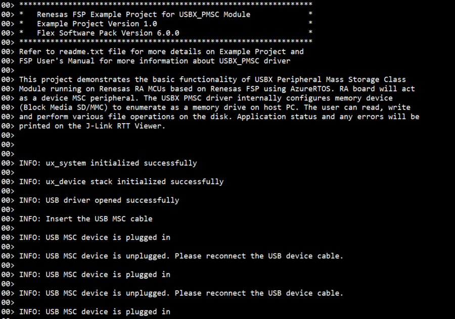

# Introduction #
This example project demonstrates basic functionalities of USBX Peripheral Mass Storage Class module on Renesas RA MCUs based on Renesas FSP using Azure RTOS. RA board will act as a device MSC peripheral. The USBX PMSC driver internally configures memory device (Block Media SD/MMC or Block Media SPI flash) to enumerate as a memory drive on host PC. The user can read, write and perform various file operations on the disk. The system initialization status and any errors will be printed on the J-Link RTT Viewer.

For EK-RA4L1: Since this board does not support the SD/MMC Host Interface (SDHI), the PMSC driver internally configures memory device (on board QSPI Flash) to pop up as a memory drive on host PC.

For EK-RA8E2: Since this board does not support the SD/MMC Host Interface (SDHI), the PMSC driver internally configures memory device (on board OSPI Flash) to pop up as a memory drive on host PC.

Please refer to the [Example Project Usage Guide](https://github.com/renesas/ra-fsp-examples/blob/master/example_projects/Example%20Project%20Usage%20Guide.pdf) for general information on example projects and [readme.txt](./readme.txt) for specifics of operation.

## Required Resources ##
To build and run the USBX PMSC example project, the following resources are needed.

### Software ###
1. Refer to the software required section in [Example Project Usage Guide](https://github.com/renesas/ra-fsp-examples/blob/master/example_projects/Example%20Project%20Usage%20Guide.pdf)
2. Refer to [Special Topics](#special-topics) for more information of USBX PMSC setup.

### Hardware ###
Supported RA boards: EK-RA4M2, EK-RA4M3, EK-RA6M1, EK-RA6M2, EK-RA6M3, EK-RA6M4, EK-RA6M5, EK-RA8D1, EK-RA8M1, MCK-RA8T1, EK-RA4L1, EK-RA8E2, EK-RA8P1
* 1 x Renesas RA board.
* 2 x USB cables.
  * 2 x Type-C USB cables: MCK-RA8T1, EK-RA4L1, EK-RA8E2, EK-RA8P1.
  * 2 x Micro USB cables: All other boards.
* 1 x PC running Windows 10.
* For RA boards that support the SD/MMC Host Interface (SDHI):
  * For MCK-RA8T1:
    * 1 x Micro SD Card.
  * For RA boards without on-board Pmod SD slot:
    * 1 x SD Card.
    * 1 x [Pmod SD: Full-sized SD Card Slot](https://digilent.com/shop/pmod-sd-full-sized-sd-card-slot/).
    * 10 x Jumper wires.

### Hardware Connections: ###
* USB connection settings: The user needs to confirm the default USB speed selection used in the example project prior to setting up the hardware connection.
  * For EK-RA4M2, EK-RA4M3, EK-RA6M3, EK-RA6M4, EK-RA6M5, EK-RA8M1, EK-RA8D1 (Full-Speed):
    * Jumper J12: Connect pins 2-3.
    * Connect Jumper J15 pins.
    * Connect the RA board USB FS port (J11) to the PC via a micro USB cable.
    * Connect the RA board USB debug port (J10) to the PC via a micro USB cable for EP debugging.

  * For EK-RA6M1, EK-RA6M2 (Full-Speed):
    * Connect the RA board USB device port (J9) to the PC via a micro USB cable.
    * Connect the RA board USB debug port (J11) to the PC via a micro USB cable for EP debugging.

  * For MCK-RA8T1 (Full-Speed):
    * Jumper JP9: Connect pins 2-3.
    * Connect Jumper JP10 pins.
    * Connect the RA board USB FS port (CN14) to the PC via a Type-C USB cable.
    * Connect the RA board USB debug port (CN11) to the PC via a Type-C USB cable for EP debugging.

  * For EK-RA4L1 (Full-Speed):
    * Turn ON S4-4 to select USB device mode.
    * Set J17 jumper to pins 2-3, Set J7 jumper to use P407 for USBFS VBUS.
    * Connect the RA board USB FS port (J11) to the PC via a Type-C USB cable.
    * Connect the RA board USB debug port (J10) to the PC via a Type-C USB cable for EP debugging.

  * For EK-RA8E2, EK-RA8P1 (Full Speed):
    * Connect the RA board USB FS port (J11) to the PC via a Type-C USB cable.
    * Connect the RA board USB debug port (J10) to the PC via a Type-C USB cable for EP debugging.

  * For EK-RA6M3 (High-Speed):
    * Jumper J7: Connect pins 2-3.
    * Connect Jumper J17 pins.
    * Connect the RA board USB HS port (J6) to the PC via a micro USB cable.
    * Connect the RA board USB debug port (J10) to the PC via a micro USB cable for EP debugging.

  * For EK-RA6M5, EK-RA8M1, EK-RA8D1 (High-Speed):
    * Note: For EK-RA8D1, The user needs to turn OFF SW1-6 to use USBHS.
    * Jumper J7: Connect pins 2-3.
    * Connect Jumper J17 pins.
    * Connect the RA board USB HS port (J31) to the PC via a micro USB cable.
    * Connect the RA board USB debug port (J10) to the PC via a micro USB cable for EP debugging.

  * For EK-RA8P1 (High-Speed):
    * Connect the RA board USB HS port (J7) to the PC via a Type-C USB cable.
    * Connect the RA board USB debug port (J10) to the PC via a Type-C USB cable for EP debugging.

* SD Card connection settings:
  * For EK-RA6M3:
    * Hardware connection for SDHI channel 0 as below:
      * 1 Bit Width:
        * SD0CMD  P412  	--->    Pmod SD MOSI (J1:2)
        * SD0DAT0 P411  	--->    Pmod SD MISO (J1:3)
        * SD0CLK  P413  	--->    Pmod SD SCK  (J1:4)
        * GND	   	        --->    Pmod SD GND  (J1:5)
        * VCC	   	        --->    Pmod SD VCC  (J1:6)
        * SD0CD 	P415    --->    Pmod SD CD   (J1:9)
        * SD0WP   P414   	--->    Pmod SD WP   (J1:10)
      * 4 Bit Width:
        * Above mentioned connections for 1 Bit Width. In addition below connections
          * SD0DAT1 P410  --->    Pmod SD DAT1 (J1:7)
          * SD0DAT2 P206	--->    Pmod SD DAT2 (J1:8)
          * SD0DAT3 P205	--->    Pmod SD CS   (J1:1)
    * Link to Errata: https://www.renesas.com/us/en/document/mat/ek-ra6m3-v1-errata?language=en&r=1168086

  * For EK-RA4M2, EK-RA4M3, EK-RA6M1, EK-RA6M2, EK-RA6M4, EK-RA6M5:
    * Hardware connection for SDHI channel 0 as below:
      * 1 Bit Width:
        * SD0CMD  P412  	--->    Pmod SD MOSI (J1:2)
        * SD0DAT0 P411  	--->    Pmod SD MISO (J1:3)
        * SCD0CLK P413  	--->    Pmod SD SCK  (J1:4)
        * GND	   	        --->    Pmod SD GND  (J1:5)
        * VCC	          	--->    Pmod SD VCC  (J1:6)
        * SCD0CD  P210   	--->    Pmod SD CD   (J1:9)
        * SCD0WP  P209   	--->    Pmod SD WP   (J1:10)
      * 4 Bit Width:
        * Above mentioned connections for 1 Bit Width. In addition below connections
          * Note: For EK-RA6M1 and EK-RA6M2, cut Jumper E15 and solder to E12 to use P205.
          * SCD0DAT1 P410   --->    Pmod SD DAT1 (J1:7)
          * SCD0DAT2 P206	  --->    Pmod SD DAT2 (J1:8)
          * SCD0DAT3 P205	  --->    Pmod SD CS   (J1:1)

  * For EK-RA8M1:
    * The user needs to remove jumper J61 to use SHDI channel 0.
    * Hardware connection for SDHI channel 0 as below:
      * 1 Bit Width:
        * SD0CMD  P307 	  --->    Pmod SD MOSI (J1:2)
        * SD0DAT0 P304   	--->    Pmod SD MISO (J1:3)
        * SD0CLK  P308    --->    Pmod SD SCK  (J1:4)
        * GND           	--->    Pmod SD GND  (J1:5)
        * VCC    		      --->    Pmod SD VCC  (J1:6)
        * SD0CD   P503    --->    Pmod SD CD   (J1:9)
        * SD0WP   P305	  --->    Pmod SD WP   (J1:10)
      * 4 Bit Width:
        * Above mentioned connections for 1 Bit Width. In addition below connections
          * SD0DAT1 P303	--->    Pmod SD DAT1 (J1:7)
          * SD0DAT2 P302	--->    Pmod SD DAT2 (J1:8)
          * SD0DAT3 P301	--->    Pmod SD CS   (J1:1)

  * For EK-RA8D1:
    * The user must turn OFF SW1-3, SW1-5, SW1-8 on board to use SDHI channel 1.
    * Hardware connection for SDHI channel 1 as below:
      * 1 Bit Width:
        * SD1CMD  P401	  --->    Pmod SD MOSI (J1:2)
        * SD1DAT0 P402 	  --->    Pmod SD MISO (J1:3)
        * SD1CLK  P400  	--->    Pmod SD SCK  (J1:4)
        * GND            	--->    Pmod SD GND  (J1:5)
        * VCC    	       	--->    Pmod SD VCC  (J1:6)
        * SD1CD   P406    --->    Pmod SD CD   (J1:9)
        * SD1WP   P700    --->    Pmod SD WP   (J1:10)
      * 4 Bit Width:
        * Above mentioned connections for 1 Bit Width. In addition below connections
          * SD1DAT1 P403  --->    Pmod SD DAT1 (J1:7)
          * SD1DAT2 P404 	--->    Pmod SD DAT2 (J1:8)
          * SD1DAT3 P405 	--->    Pmod SD CS   (J1:1)

  * For MCK-RA8T1:
    * Connect microSD Card to microSD Socket (CN12).

  *	For EK-RA8P1:
    *	Hardware connection for SDHI channel 0 as below:
      * 1 Bit Width:
        * SD0CMD 	PD04 (J2:32) 	--->    Pmod SD MOSI (J1:2)
        * SD0DAT0 PD03 (J2:31) 	--->    Pmod SD MISO (J1:3)
        * SD0CLK 	PD05 (J2:27) 	--->    Pmod SD SCK  (J1:4)
        * GND 	       (J2:39)	--->    Pmod SD GND  (J1:5)
        * VCC	         (J2:1)	  --->    Pmod SD VCC  (J1:6)
        * SD0CD   P503 (J37:14) --->    Pmod SD CD   (J1:9)
        * SD0WP 	PD06 (J3:4) 	--->    Pmod SD WP   (J1:10)
      * 4 Bit Width:
        * Above mentioned connections for 1 Bit Width. In addition below connections
          * SD0DAT1 PD02 (J2:33)	--->    Pmod SD DAT1 (J1:7)
          * SD0DAT2 PD01 (J2:34)	--->    Pmod SD DAT2 (J1:8)
          * SD0DAT3 P111 (J1:3)	  --->    Pmod SD CS   (J1:1)

* QSPI connection settings:
  * For EK-RA4L1:
    * Connect jumper J15 pins.
    * E1 must be closed.

* OSPI connection settings:
  * For EK-RA8E2:
    * Turn OFF SW4-3 to use OSPI flash.

## Related Collateral References ##
The following documents can be referred to for enhancing your understanding of the operation of this example project:
- [FSP User Manual on GitHub](https://renesas.github.io/fsp/)
- [FSP Known Issues](https://github.com/renesas/fsp/issues)

# Project Notes #

## System Level Block Diagram ##

**For EK-RA4L1:**  

**For EK-RA8E2:**  

## FSP Modules Used ##
List all the various modules that are used in this example project. Refer to the FSP User Manual for further details on each module listed below.

| Module Name | Usage | Searchable Keyword  |
|-------------|-----------------------------------------------|-----------------------------------------------|
| USBX PMSC | This module provides a USBX Device Mass storage class support on RA devices.| USBX PMSC |
| Block media on sdmmc | This module is internally configured by USBX PMSC driver to enumerate as a memory drive on host PC and the user can perform read, write operations on the drive. | sdmmc |
| USB Basic Driver | USB driver is required for hardware configuration on RA MCU. | r_usb_basic |
| DMAC Transfer | DMAC is used to transfer the usb data for faster process.  | r_dmac |

**For EK-RA4L1, EK-RA8E2:**
| Module Name | Usage | Searchable Keyword  |
|-------------|-----------------------------------------------|-----------------------------------------------|
| USBX PMSC | This module provides a USBX Device Mass storage class support on RA devices. | USBX PMSC |
| Block Media SPI Flash | This module is internally configured by USBX PMSC driver to enumerate as a memory drive on host PC and the user can perform read, write operations on the drive. | rm_block_media_spi |
| USB Basic Driver | USB driver is required for hardware configuration on RA MCU. | r_usb_basic |
| DMAC Transfer | DMAC is used to transfer the usb data for faster process. | r_dmac |

## Module Configuration Notes ##
This section describes FSP Configurator properties which are important or different than those selected by default.

**Common Configuration Properties**

|   Module Property Path and Identifier   |   Default Value   |   Used Value   |   Reason   |
| :-------------------------------------: | :---------------: | :------------: | :--------: |
| configuration.xml > Stacks > PMSC Thread > Properties > Settings > Property > Common > Timer > Timer Ticks Per Second | 100 | 1000 | The default ticks should be 1000 indicating 1 tick per millisecond. Follow FSP UM recommendations. |
| configuration.xml > Stacks > PMSC Thread > Properties > Settings > Property > Thread > Priority | 1 | 21 | Use a lower priority level than the internal USBX thread priority. There is one internal thread:  ux_slave_storage thread (which is at priority 20). Follow FSP UM recommendations. |
| configuration.xml > Stacks > RTT Thread > Properties > Settings > Property > Thread > Priority | 1 | 22 | RTT thread priority is lowered to allow the USBX PMSC data process at the fastest rate possible. |
| configuration.xml > Stacks > PMSC Thread > g_basic0 USB (r_usb_basic) > Properties > Settings > Property > Common > DMA/DTC Support | DMA Disabled | DMA Enabled | DMA is used to offload CPU usage, to transfer the usb data for faster process. |

**Configuration Properties for using USBHS**

|   Module Property Path and Identifier   |   Default Value   |   Used Value   |   Reason   |
| :-------------------------------------: | :---------------: | :------------: | :--------: |
| configuration.xml > Stacks > PMSC Thread > g_basic0 USB (r_usb_basic) > Properties > Settings > Property > Common > DMA/DTC Source Address | DMA Disabled | HS Address | USB basic driver is configured USB Speed as High Speed. Accordingly, DMA Source Address is provided with HS Address. |
| configuration.xml > Stacks > PMSC Thread > g_basic0 USB (r_usb_basic) > Properties > Settings > Property > Common > DMA/DTC Destination Address | DMA Disabled | HS Address | USB basic driver is configured USB speed as High Speed (Default). Accordingly, DMA Destination Address is provided with HS Address. |
| configuration.xml > Stacks > PMSC Thread > g_basic0 USB (r_usb_basic) > Properties > Settings > Property > Module g_basic0 USB (r_usb_basic) > USB Speed | Full Speed | Hi Speed | This property is used to configure USB speed. |
| configuration.xml > Stacks > PMSC Thread > g_basic0 USB (r_usb_basic) > Properties > Settings > Property > Module g_basic0 USB (r_usb_basic) > USB Module Number | USB_IP0_Port | USB_IP1_Port | This property is used to specify USB module number to be used as per configured USB speed. |
| configuration.xml > Stacks > PMSC Thread > g_transfer1 Transfer (r_dmac) > Properties > Settings > Property > Module g_transfer1 Transfer (r_dmac) > Transfer Size | 2 Bytes | 4 Bytes | This is used to select DMAC transfer size. Follow FSP UM recommendations. |
| configuration.xml > Stacks > PMSC Thread > g_transfer1 Transfer (r_dmac) > Properties > Settings > Property > Module g_transfer1 Transfer (r_dmac) > Activation Source | No ELC Trigger | USBHS FIFO 1 (DMA transfer request 1)  |This is an event trigger for DMA transfer 1 instance for destination pointer address. |
| configuration.xml > Stacks > PMSC Thread > g_transfer2 Transfer (r_dmac) > Properties > Settings > Property > Module g_transfer2 Transfer (r_dmac) > Transfer Size | 2 Bytes | 4 Bytes | This is used to select DMAC transfer size. Follow FSP UM recommendations. |
| configuration.xml > Stacks > PMSC Thread > g_transfer2 Transfer (r_dmac) > Properties > Settings > Property > Module g_transfer2 Transfer (r_dmac) > Activation Source | No ELC Trigger | USBHS FIFO 0 (DMA transfer request 0) |This is an event trigger for DMA transfer 2 instance for source pointer address. |

**Configuration Properties for using USBFS**

|   Module Property Path and Identifier   |   Default Value   |   Used Value   |   Reason   |
| :-------------------------------------: | :---------------: | :------------: | :--------: |
| configuration.xml > Stacks > PMSC Thread > g_basic0 USB (r_usb_basic) > Properties > Settings > Property > Common > DMA/DTC Source Address | DMA Disabled | FS Address | USB basic driver is configured USB Speed as Full Speed. Accordingly, DMA Source Address is provided with FS Address. |
| configuration.xml > Stacks > PMSC Thread > g_basic0 USB (r_usb_basic) > Properties > Settings > Property > Common > DMA/DTC Destination Address | DMA Disabled | FS Address | USB basic driver is configured USB speed as Full Speed (Default). Accordingly, DMA Destination Address is provided with FS Address. |
| configuration.xml > Stacks > PMSC Thread > g_basic0 USB (r_usb_basic) > Properties > Settings > Property > Module g_basic0 USB (r_usb_basic) > USB Speed | Full Speed | Full Speed | This property is used to configure USB speed. |
| configuration.xml > Stacks > PMSC Thread > g_basic0 USB (r_usb_basic) > Properties > Settings > Property > Module g_basic0 USB (r_usb_basic) > USB Module Number | USB_IP0_Port | USB_IP0_Port | This property is used to specify USB module number to be used as per configured USB speed. |
| configuration.xml > Stacks > PMSC Thread > g_transfer1 Transfer (r_dmac) > Properties > Settings > Property > Module g_transfer1 Transfer (r_dmac) > Transfer Size | 2 Bytes | 2 Bytes  | This is used to select DMAC transfer size. Follow FSP UM recommendations. |
| configuration.xml > Stacks > PMSC Thread > g_transfer1 Transfer (r_dmac) > Properties > Settings > Property > Module g_transfer1 Transfer (r_dmac) > Activation Source | No ELC Trigger | USBFS FIFO 1 (DMA transfer request 1) |This is an event trigger for DMA transfer 1 instance for destination pointer address. |
| configuration.xml > Stacks > PMSC Thread > g_transfer2 Transfer (r_dmac) > Properties > Settings > Property > Module g_transfer2 Transfer (r_dmac) > Transfer Size | 2 Bytes | 2 Bytes  | This is used to select DMAC transfer size. Follow FSP UM recommendations. |
| configuration.xml > Stacks > PMSC Thread > g_transfer2 Transfer (r_dmac) > Properties > Settings > Property > Module g_transfer2 Transfer (r_dmac) > Activation Source | No ELC Trigger | USBFS FIFO 0 (DMA transfer request 0) |This is an event trigger for DMA transfer 2 instance for source pointer address. |

**For EK-RA8E2: Configuration Properties for using OSPI_B**
|   Module Property Path and Identifier   |   Default Value   |   Used Value   |   Reason   |
| :-------------------------------------: | :---------------: | :------------: | :--------: |
| configuration.xml > Stacks > g_ospi_b OSPI Flash (r_ospi_b) > Settings > Property > Common > DMAC Support | Disable | Enable | Enable DMAC support for the OSPI module. |

**For RA boards that support SDHI: Configuration properties for g_transfer0 (DMAC)**
|   Module Property Path and Identifier   |   Default Value   |   Used Value   |   Reason   |
| :-------------------------------------: | :---------------: | :------------: | :--------: |
| configuration.xml > Stacks > PMSC Thread > g_transfer0 Transfer (r_dmac) SDHIMMC0 DMA REQ (DMA transfer request) > Properties > Settings > Property > Transfer End Interrupt Priority| Disable | Priority 2 | Transfer End Interrupt Priority is enabled and set to priority 2 to trigger interrupt when transfer ends. |

## API Usage ##
The table below lists the FSP provided API used at the application layer by this example project.

| API Name    | Usage                                                                          |
|-------------|--------------------------------------------------------------------------------|
| ux_system_initialize | This API is used to initialize the USBX system. |
| ux_device_stack_initialize | This API is used to initialize the USBX device stack.  |
| R_USB_Open |This API is used to open the USB basic driver.|

Refer to [Description of USBX Device Services](https://docs.microsoft.com/en-us/azure/rtos/usbx/usbx-device-stack-4) for more details of API used.

* Callback:  
  **usbx_status_callback()** is a user callback function which is registered as 9th argument of **ux_device_stack_initialize** API. 
  This callback is invoked by USBX to indicate to the application level about USB Attach and Removed events.

## Verifying Operation ##
1. Import, generate and build the EP.
2. Download the USBX PMSC project to the RA board.
3. Open J-Link RTT Viewer to see the output. 
4. The user can perform any file operations on disk.

**Note: The user should use the host PC with full access permissions to perform any file operations on the disk (e.g., create, write, read, open, delete).**

The output on J-Link RTT Viewer:

The device enumeration in Device Manager:

## Special Topics ##
**For EK-RA4L1, EK-RA8E2:** Before performing any file system operations, the user must format the USB drive using a Host PC with full permissions as below:

### Developing Descriptor ###
Refer **Descriptor** section of [Device Class (rm_usbx_port)](https://renesas.github.io/fsp/group___u_s_b_x.html) for developing  a descriptor.
We can take template file of required usb combination from mentioned path in above link and use the same in source folder by removing the **.template** file extension.

### Operations for changing the last LBA ###
* Last LBA is set to media total sector in **usb_peri_usbx_pmsc_storage_init()** function in **rm_usbx_port.c** file as shown below.

* Media total sector is acquired from the **infoGet()** API during initialization in **usb_peri_usbx_pmsc_media_initialize()** function as shown below.

