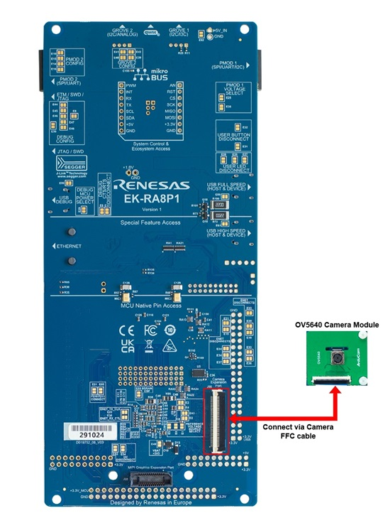
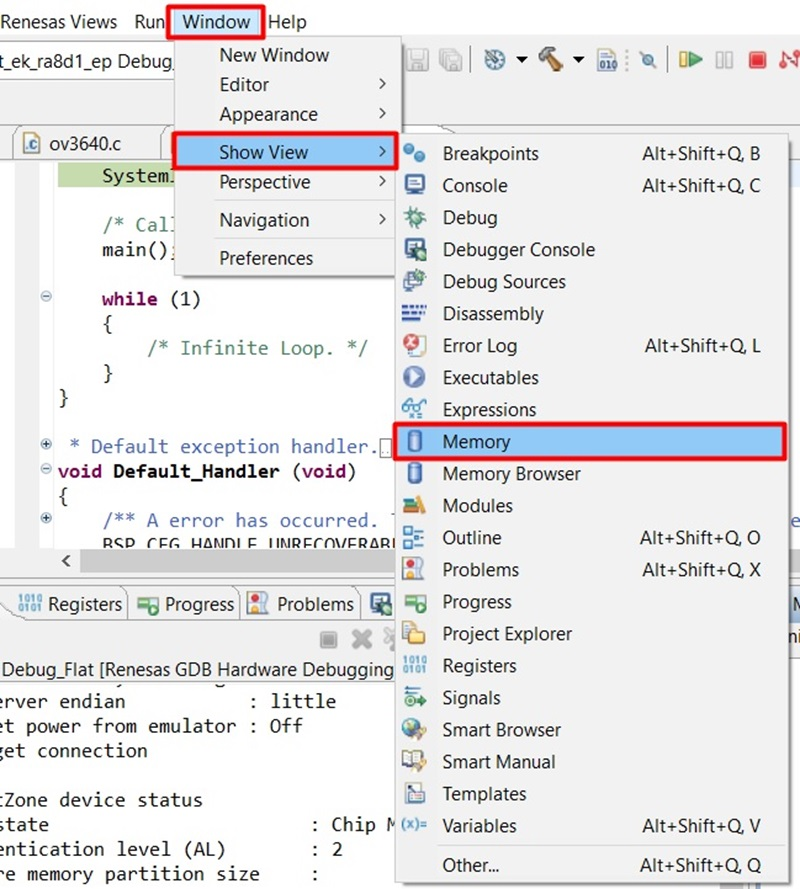
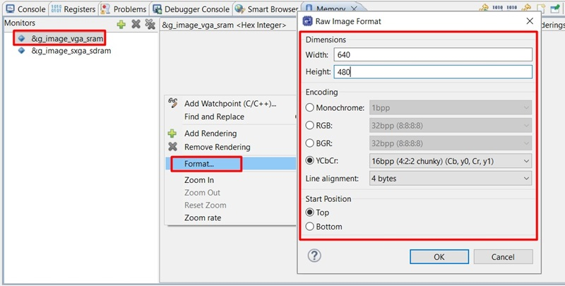
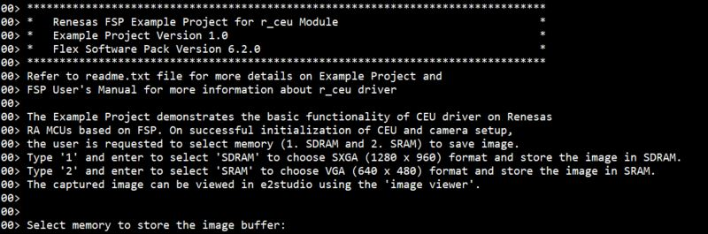
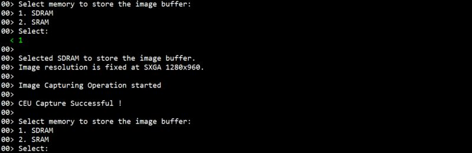
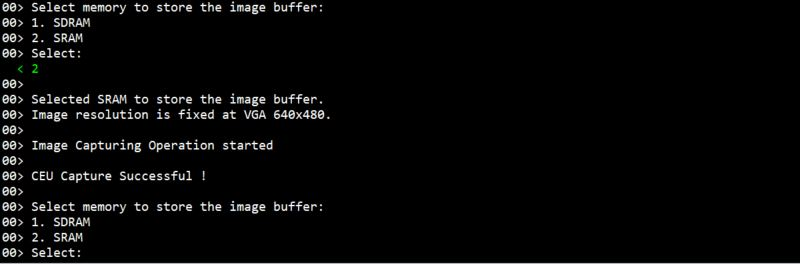
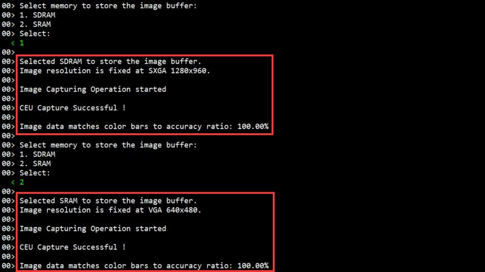
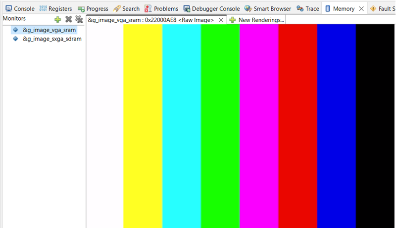

# Introduction #
This example project demonstrates the basic functionality of CEU driver on Renesas RA MCUs based on FSP. Upon successful initialization of the CEU and camera setup:

**For EK-RA8D1, EK-RA8P1:**
* The user is prompted to select a memory option to save the image (1. SDRAM or 2. SRAM).
* Type '1' and enter to select 'SDRAM' to choose SXGA (1280 x 960) format and store the image in SDRAM.
* Type '2' and enter to select 'SRAM' to choose VGA (640 x 480) format and store the image in SRAM.

**For FPB-RA8E1:** The user can press any key after initialization to capture and store a QVGA (320 x 240) image in SRAM.

By default, the example project configures the camera in test pattern mode, and the image captured is a color bar. The user can get the actual image by modifying the macro CAM_TEST_PATTERN in the cam_sensor.h file with a value of 0U. The captured image can be viewed in e2studio using the 'image viewer'.

Please refer to the [Example Project Usage Guide](https://github.com/renesas/ra-fsp-examples/blob/master/example_projects/Example%20Project%20Usage%20Guide.pdf) for general information on example projects and [readme.txt](./readme.txt) for specifics of operation.

**Note:** This example project does not perform color correction for the camera sensor.

## Required Resources ## 
To build and run the CEU example project, the following resources are needed.

### Software ###
* Renesas Flexible Software Package (FSP): Version 6.3.0
* e2 studio: Version 2025-12
* SEGGER J-Link RTT Viewer: Version 8.92
* LLVM Embedded Toolchain for ARM: Version 21.1.1

Refer to the software required section in [Example Project Usage Guide](https://github.com/renesas/ra-fsp-examples/blob/master/example_projects/Example%20Project%20Usage%20Guide.pdf)

### Hardware ###
* Supported RA Boards: EK-RA8D1, FPB-RA8E1, EK-RA8P1.
*	1 x Renesas RA Board.
*	1 x Type-C USB cable for programming and debugging.
* For EK-RA8D1, EK-RA8E1:
  * 1 x OV3640 camera module. (Part Number: ArduCam B0156 - https://www.arducam.com/product/b0156-1-4-3-mega-pixel-m12-mount-ov3640-camera-module-with-jpeg-output/)
* For EK-RA8P1:
  * 1 x OV5640 camera module. (Part Number: CU450_OV5640)

### Hardware Connections ###
Connect the USB Debug port on the RA board to the host PC via a Type-C USB cable.
  
  * For EK-RA8D1:  
    * Connect the camera module to the camera connector J59 on the RA board.
    * Set the configuration switches on the RA board as below:
      |     SW1     | | Status      |
      |-------------|-|-------------|
      |SW1-1 PMOD1	|-|     OFF     |
      |SW1-2 TRACE	|-|     OFF     |
      |SW1-3 CAMERA |-|     ON      |
      |SW1-4 ETHA   |-|     OFF     |  
      |SW1-5 ETHB   |-|     OFF     |  
      |SW1-6 GLCD   |-|     OFF     |  
      |SW1-7 SDRAM	|-|     ON      | 
      |SW1-8 I3C    |-|     OFF     |  
    * Detail connection:  
      

      Camera connection:

      
  * For FPB-RA8E1:
    * Connect the camera module to the camera connector J4 on the RA board.  
        

  * For EK-RA8P1:
    * Connect the camera module to the Camera Expansion Port J35 on the RA board.
    * Open J41 to use P405, P406 for Camera function.
    * Set the configuration switches on the RA board as below:
      |     SW4         | | Status      |
      |-----------------|-|-------------|
      |SW4-1 PMOD1_SEL0	|-|     OFF     |
      |SW4-2 PMOD1_SEL1	|-|     OFF     |
      |SW4-3 OSPI       |-|     OFF     |
      |SW4-4 ARDUINO    |-|     OFF     |  
      |SW4-5 I3C        |-|     OFF     |  
      |SW4-6 MIPI       |-|     ON      |  
      |SW4-7 USBFS_ROLE	|-|     OFF     | 
      |SW4-8 USBHS_ROLE |-|     OFF     |
    * Detail connection: Connect the camera module to the Camera Expansion Port J35 on the back side of the RA board using the Camera FFC cable.  
      

## Related Collateral References ##
The following documents can be referred to for enhancing your understanding of the operation of this example project:
- [FSP User Manual on GitHub](https://renesas.github.io/fsp/)
- [FSP Known Issues](https://github.com/renesas/fsp/issues)

# Project Notes #

## System Level Block Diagram ##
 High level block diagram of the system is as shown below:
 

**Note:**  
**For FPB-RA8E1:** The EP menu does not contain multiple options because this board only supports for SRAM memory and the image resolution is QVGA (320 x 240).

## FSP Modules Used ##
List all the various modules that are used in this example project. Refer to the FSP User Manual for further details on each module listed below.

| Module Name | Usage | Searchable Keyword  |
|-------------|-----------------------------------------------|-----------------------------------------------|
| CEU | CEU is used to capture images from the camera. | r_ceu |
| I2C Master | I2C Master is used to configure the camera. | r_iic_master |
| GPT | GPT is used to provide the clock for the camera. | r_gpt |
| IO Port | IO Port is used to set power mode for the camera. | r_ioport |

## Module Configuration Notes ##
This section describes FSP Configurator properties which are important or different from those selected by default.

**Configuration Properties for using g_ceu_vga instance**

|   Module Property Path and Identifier   |   Default Value   |   Used Value   |   Reason   |
|-----------------------------------------|-------------------|----------------|------------|
| configuration.xml > Stacks > g_ceu_vga Capture Engine Unit (r_ceu) > Properties > Settings > Property > Module g_ceu_vga Capture Engine Unit (r_ceu) > Input > Capture Specifications > Horizontal capture resolution | 640 | 640 | Width of image resolution VGA. |
| configuration.xml > Stacks > g_ceu_vga Capture Engine Unit (r_ceu) > Properties > Settings > Property > Module g_ceu_vga Capture Engine Unit (r_ceu) > Input > Capture Specifications > Vertical capture resolution | 480 | 480 | Height of image resolution VGA. |
| configuration.xml > Stacks > g_ceu_vga Capture Engine Unit (r_ceu) > Properties > Settings > Property > Module g_ceu_vga Capture Engine Unit (r_ceu) > Output > Byte Swapping > Swap 16-bit units | ☐ | ☑ | The image data is different in endian between the camera and the MCU. |
| configuration.xml > Stacks > g_ceu_vga Capture Engine Unit (r_ceu) > Properties > Settings > Property > Module g_ceu_vga Capture Engine Unit (r_ceu) > Output > Byte Swapping > Swap 32-bit units | ☐ | ☑ | The image data is different in endian between the camera and the MCU. |
| configuration.xml > Stacks > g_ceu_vga Capture Engine Unit (r_ceu) > Properties > Settings > Property > Module g_ceu_vga Capture Engine Unit (r_ceu) > Interrupts > Callback | g_ceu0_user_callback | g_ceu_vga_callback | It is called from the interrupt service routine (ISR) each time the CEU capture operation completes. |
| configuration.xml > Stacks > g_ceu_vga Capture Engine Unit (r_ceu) > Properties > Settings > Property > Module g_ceu_vga Capture Engine Unit (r_ceu) > Interrupts > CEU Interrupt Priority | Priority 12 | Priority 12 | Select the CEU interrupt priority. |

**Configuration Properties for using g_ceu_sxga instance**

|   Module Property Path and Identifier   |   Default Value   |   Used Value   |   Reason   |
|-----------------------------------------|-------------------|----------------|------------|
| configuration.xml > Stacks > g_ceu_sxga Capture Engine Unit (r_ceu) > Properties > Settings > Property > Module g_ceu_sxga Capture Engine Unit (r_ceu) > Input > Capture Specifications > Horizontal capture resolution | 640 | 1280 | Width of image resolution SXGA. |
| configuration.xml > Stacks > g_ceu_sxga Capture Engine Unit (r_ceu) > Properties > Settings > Property > Module g_ceu_sxga Capture Engine Unit (r_ceu) > Input > Capture Specifications > Vertical capture resolution | 480 | 960 | Height of image resolution SXGA. |
| configuration.xml > Stacks > g_ceu_sxga Capture Engine Unit (r_ceu) > Properties > Settings > Property > Module g_ceu_sxga Capture Engine Unit (r_ceu) > Output > Byte Swapping > Swap 16-bit units | ☐ | ☑ | The image data is different in endian between the camera and the MCU. |
| configuration.xml > Stacks > g_ceu_sxga Capture Engine Unit (r_ceu) > Properties > Settings > Property > Module g_ceu_sxga Capture Engine Unit (r_ceu) > Output > Byte Swapping > Swap 32-bit units | ☐ | ☑ | The image data is different in endian between the camera and the MCU. |
| configuration.xml > Stacks > g_ceu_sxga Capture Engine Unit (r_ceu) > Properties > Settings > Property > Module g_ceu_sxga Capture Engine Unit (r_ceu) > Interrupts > Callback | g_ceu0_user_callback | g_ceu_sxga_callback | It is called from the interrupt service routine (ISR) each time the CEU capture operation completes. |
| configuration.xml > Stacks > g_ceu_sxga Capture Engine Unit (r_ceu) > Properties > Settings > Property > Module g_ceu_sxga Capture Engine Unit (r_ceu) > Interrupts > CEU Interrupt Priority | Priority 12 | Priority 12 | Select the CEU interrupt priority. |

**Configuration Properties for using GPT**

|   Module Property Path and Identifier   |   Default Value   |   Used Value   |   Reason   |
|-----------------------------------------|-------------------|----------------|------------|
| configuration.xml > Stacks > g_timer_periodic Timer, General PWM (r_gpt) > Properties > Settings > Property > Common > Pin Output Support | Disabled | Enabled | Provide clock source for camera. |
| configuration.xml > Stacks > g_timer_periodic Timer, General PWM (r_gpt) > Properties > Settings > Property > Module g_timer_periodic Timer, General PWM (r_gpt) > General > Channel | 0 | 12 | Use GPT Channel 12 to generate the input clock for the camera module. |
| configuration.xml > Stacks > g_timer_periodic Timer, General PWM (r_gpt) > Properties > Settings > Property > Module g_timer_periodic Timer, General PWM (r_gpt) > General > Mode | Periodic | Periodic | Set the GPT in periodic mode to generate the clock source. |
| configuration.xml > Stacks > g_timer_periodic Timer, General PWM (r_gpt) > Properties > Settings > Property > Module g_timer_periodic Timer, General PWM (r_gpt) > General > Period | 0x10000 | 24000 | Set the GPT frequency to 24 Mhz, to be in specification for the camera's clock source [6 ~ 27MHz]. |
| configuration.xml > Stacks > g_timer_periodic Timer, General PWM (r_gpt) > Properties > Settings > Property > Module g_timer_periodic Timer, General PWM (r_gpt) > General > Period Unit | Raw Counts | Kilohertz | Set the GPT frequency to 24 MHz. |
| configuration.xml > Stacks > g_timer_periodic Timer, General PWM (r_gpt) > Properties > Settings > Property > Module g_timer_periodic Timer, General PWM (r_gpt) > Output > GTIOCA Output Enabled | False | True | Provide a 24 MHz clock frequency output pin. |

## API Usage ##
The table below lists the FSP provided API used at the application layer by this example project.

| API Name    | Usage                                                                          |
|-------------|--------------------------------------------------------------------------------|
| R_CEU_Open | This API is used to initialize CEU module. |
| R_CEU_CaptureStart | This API is used to start a capture image. |
| R_CEU_Close | This API is used to stop and close CEU module. |
| R_GPT_Open | This API is used to initialize the GPT timer. |
| R_GPT_Start | This API is used to Start GPT timer in periodic mode, when timer starts, it provides a 24 MHz clock frequency for the camera. |
| R_IIC_MASTER_Open | This API is used to initialize the I2C Master module. |
| R_IIC_MASTER_Write | This API is used to perform a write from the camera register. |
| R_IIC_MASTER_Read | This API is used to perform a read from the camera register. |
| R_BSP_PinWrite | This API is used to set the output level for a PWN pin of the camera. |
| R_BSP_SoftwareDelay | This API is used to delay a specified period of time. |

## SDRAM Configuration ##
The table below describes the configuration properties for using SDRAM.

| Properties | Setting |
|------------|---------|
| Clock source | 125 MHz |
| Bus width | 32-bit |
| Endian mode | Little endian |
| Address Multiplex Shift | 9-bit shift |
| Continuous access | Enable |

## Verifying Operation ##
1. Import, generate and build the example project.
2. On Debug the example project by e2studio IDE:
* Open memory view.

  

* Add image buffer under memory monitor.

  

* Open Raw Image Rendering 

  

* Set Raw Image Format:
  * For VGA resolution images:
    * Width as 640
    * Height as 480
    * Encoding to YCbCr 16bpp (4:2:2) (Cb,y0,Cr,y1)
    * Line alignment to 4 bytes
    * Start Position to Top

      

  * For SXGA resolution images:
    * Width as 1280
    * Height as 960
    * Encoding to YCbCr 16bpp (4:2:2) (Cb,y0,Cr,y1)
    * Line alignment to 4 bytes
    * Start Position to Top

      

3. Open the RTT viewer, select the memory type and image resolution to start capturing images.
* The image below shows RTT Viewer operation:
  * EP Information

    

  * Capture a SXGA resolution image and store in SDRAM

    

  * Capture a VGA resolution image and store in SRAM

    
  
* The image below shows captured image on Raw Image rendering:
  * SXGA image and store in SDRAM
  
    

  * VGA image and store in SRAM
  
    

## Special Topics ##
* The files camera_sensor.c and camera_sensor.h contain the API for initialization and configuration of both OV3640 and OV5640 camera modules.
* The camera sensor is configured in YUV422 output format, and the image resolution is SXGA or VGA.
* g_ceu_sxga is the CEU instance configured in Data Synchronous Fetch mode at SXGA resolution.
* g_ceu_vga is the CEU instance configured in Data Synchronous Fetch mode at VGA resolution. 
* CAM_TEST_PATTERN in camera_sensor.h is used to enable/disable using test pattern of camera sensor. It is enabled by default
and a matching result between captured data and test pattern will be shown in RTT Viewer for this case.
Disable it to capture live data from the camera.
* RTT Viewer operation of camera sensor Test pattern:

  

* Camera Test pattern image:

  
