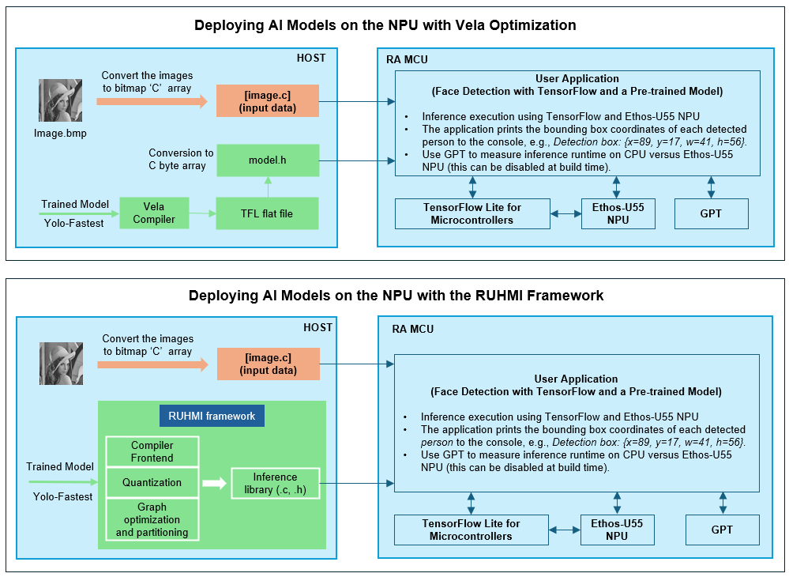
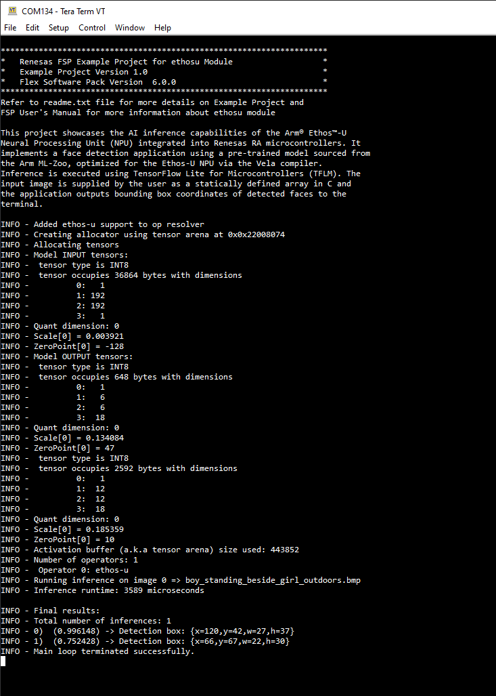
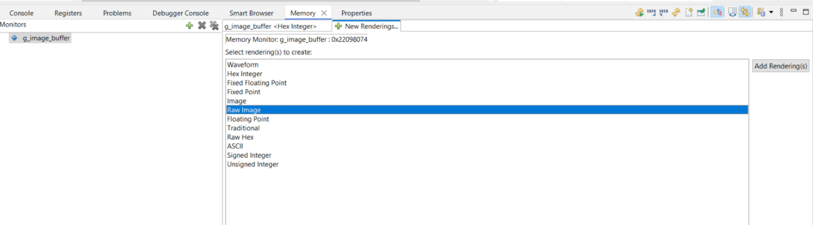
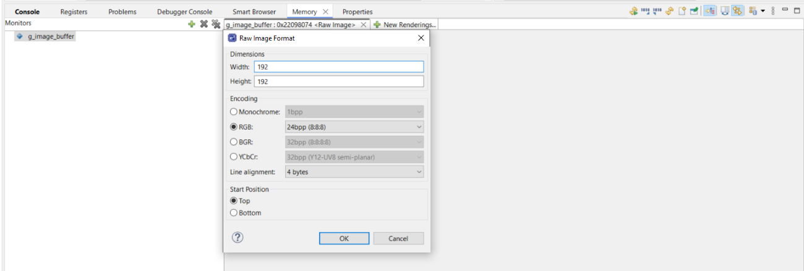
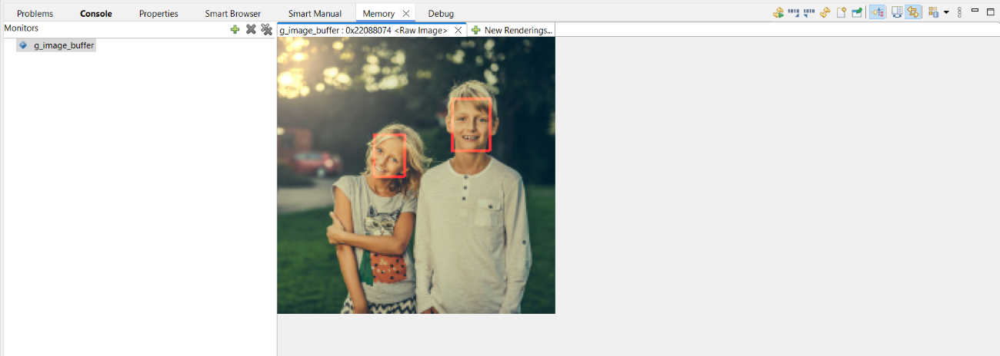
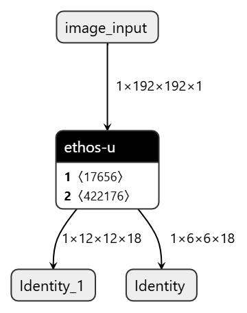

# Introduction #
This project showcases the AI inference capabilities of the Arm® Ethos™-U Neural Processing Unit (NPU) integrated into Renesas RA microcontrollers. It implements a face detection application using a pre-trained model sourced from the Arm ML-Zoo, optimized for the Ethos-U NPU via the Vela compiler. Inference is executed using TensorFlow Lite for Microcontrollers (TFLM). The input image is supplied by the user as a statically defined array in C and the application outputs bounding box coordinates of detected faces to the terminal.

> **Note:**  
> * This project also includes an example demonstrating how to integrate face detection using the Arm Ethos-U55 NPU with the RUHMI (Robust Unified Heterogeneous Model Integration) framework. This integration showcases advanced deployment capabilities for AI applications on Renesas RA microcontrollers.
> * Information can be displayed using either the SEGGER J-Link RTT Viewer or a serial terminal (UART) via J-Link OB VCOM. By default, the serial terminal (UART) via J-Link OB VCOM is used to print the terminal log. To use the SEGGER J-Link RTT Viewer instead, please refer to the instructions in the [Special Topic](#special-topic) section below (see: **1. Selecting Terminal Output Method**).

Please refer to the [Example Project Usage Guide](https://github.com/renesas/ra-fsp-examples/blob/master/example_projects/Example%20Project%20Usage%20Guide.pdf) 
for general information on example projects and [readme.txt](./readme.txt) for specifics of operation.

## Required Resources ##
To build and run this example project, the following resources are needed.

### Software Requirements ###
* Renesas Flexible Software Package (FSP): Version 6.0.0
* e2 studio: Version 2025-04.1
* SEGGER J-Link RTT Viewer: Version 8.44.1
* LLVM Embedded Toolchain for ARM: Version 18.1.3
* Terminal Console Application: Tera Term or a similar application

### Hardware Requirements ###
* Supported RA boards: EK-RA8P1
* 1 x RA board.
* 1 x USB Type C cable for programming and debugging.

### Hardware Connections ###
* Connect the Type-C end of the USB-C cable to the USB Debug port (J10) on the board. Connect the other end of this cable to the USB port of the host PC.

## Related Collateral References ##
Refer to the following documents to enhance your understanding of the operation of this example project:
- [FSP User Manual on GitHub](https://renesas.github.io/fsp/)
- [FSP Known Issues](https://github.com/renesas/fsp/issues)

# Project Notes #

## System Level Block Diagram ##
A high-level block diagram of the system is shown below:

  

## FSP Modules Used ##
List all the various modules that are used in this example project. Refer to the FSP User Manual for further details on each module listed below.

| Module Name                | Usage                                                                 | Searchable Keyword (New Stack > Search) |
|----------------------------|-----------------------------------------------------------------------|-----------------------------------------|
| TFLM Core Library          | Provide TensorFlow Lite for Microcontrollers runtime for AI inference | TFLM Core Library                       |
| Ethos-U Driver Wrapper     | Interface between the application and the Ethos-U NPU hardware        | rm_ethosu                               |
| Ethos-U Core Driver        | Low-level driver for controlling the Ethos-U NPU                      | Ethos-U Core Driver                     |
| General PWM Timer (GPT)    | Measure AI inference time                                             | r_gpt                                   |


## Module Configuration Notes ##
This section describes FSP Configurator properties which are important or different than those selected by default. 

| Module Property Path and Identifier | Default Value | Configured Value | Rationale |
| :---------------------------------- | :-----------: | :--------------: | :-------- |
| configuration.xml → BSP > Settings > Heap size (bytes) | 0 | 0x4000 | Increased heap size to support AI inference requirements |
| configuration.xml → BSP > Settings > Main stack size (bytes) | 0 | 0x4000 | Increased stack size to accommodate application demands |
| configuration.xml → g_timer_periodic Timer, General PWM (r_gpt) > Settings > Period | 0x10000 | 5000 | Adjusted to set the maximum measurement time for inference timing |
| configuration.xml → g_timer_periodic Timer, General PWM (r_gpt) > Settings > Period Unit | Raw Count | Milliseconds | Changed to milliseconds |

## API Usage ##

The following table lists the key FSP APIs used by the application layer in this example project:

| No. | API                | Description                                      |
|-----|--------------------|--------------------------------------------------|
| 1   | RM_ETHOSU_Open     | Initialize the Ethos-U NPU driver                |
| 2   | RM_ETHOSU_Close    | Deinitialize the Ethos-U NPU driver              |
| 3   | R_GPT_Open         | Initialize the GPT                               |
| 4   | R_GPT_Start        | Start the GPT                                    | 
| 5   | R_GPT_StatusGet    | Retrieve the current status of the timer         |
| 6   | R_GPT_InfoGet      | Retrieve configuration information of the timer  |
| 7   | R_GPT_Stop         | Stop the GPT                                     |
| 8   | R_GPT_Close        | Deinitialize the timer                           |


## Verifying operation ##

1. Import the desired example project into your workspace. Choose one of the following options:  
   - **`ethos_u55_face_detection_ek_ra8p1_ep`** : Demonstrates standalone AI inference using the Arm Ethos-U55 NPU.  
   - **`ethos_u55_face_detection_ruhmi_ek_ra8p1_ep`** : Illustrates AI inference integrated with the modular deployment features of the RUHMI framework.

    By default, the EP supports Serial terminal for RA boards that support J-link OB VCOM
    * Define USE_VIRTUAL_COM = 1 macro in Project Properties -> C/C++ Build -> Settings -> Tool Settings -> Compiler -> Includes -> Macro Defines (-D)

    To use SEGGER J-Link RTT Viewer, please follow the instructions below:
    * Define USE_VIRTUAL_COM = 0 macro in Project Properties -> C/C++ Build -> Settings -> Tool Settings -> Compiler -> Includes -> Macro Defines (-D)
2. Double click Configuration.xml file, and click Generate Project Content. Next, build the project.
3. Conduct the hardware connection as described in the Hardware Connections section.
4. Open a serial terminal application (e.g., Tera Term) on the host PC and connect to the COM port provided by the J-Link onboard, or open the SEGGER J-Link RTT Viewer if you have selected that output method.
   * Note: For using the serial terminal:
        * Please ensure that the connection to the RTT viewer has been terminated if it was previously established.
        * The COM port is provided by the J-Link onboard, with a baud rate of 115200 bps, a data length of 8 bits, no parity check, one stop bit, and no flow control.

5. Debug or flash the EP project to the RA board. 
6. The images below illustrate the example project information, neural network model details—including model data type, input and output tensor sizes—and the inference results, which display the bounding box coordinates for each detected face.



### Displaying Image Results with the Memory Monitor in e2 studio ###

This process enables you to visually verify the image buffer contents directly within e2 studio.

* After the example project has completed execution, click the **Suspend** button in e2 studio to halt the program. Ensure the **Memory** tab is visible in the Console window (typically located at the bottom of the screen in Debug view). In the Monitors pane, click the green plus (+) icon to add a new memory monitor. In the **Monitor Memory** dialog, enter `g_image_buffer` as the address and click **OK** to proceed.


* A new tab will now appear under the Memory tab, displaying the contents of the specified memory area. Select the **New Renderings** tab next to the memory monitor you just created, choose **Raw Image** as the type from the list of options, and click the **Add Rendering(s)** button on the right side of the screen.



* The Raw Image Format dialog box will appear, allowing you to specify the screen resolution (192x192) and select the encoding format, which should be set to 24 bpp (8:8:8) for this case.



* Once you press the OK key, the memory monitor presents you with the image that will be displayed at that memory address based on the parameters you entered.



### Switching Inference Between NPU and CPU ###

By default, inference runs on the NPU. To run inference on the CPU instead, remove the `ARM_NPU` macro definition from both locations below:

- `Project Properties` → `C/C++ Build` → `Settings` → `Tool Settings` → `Compiler CPP` → `Macro Defines (-D)`
- `Project Properties` → `C/C++ Build` → `Settings` → `Tool Settings` → `Compiler` → `Macro Defines (-D)`

> **Note:**  
> - Removing the `ARM_NPU` macro will configure the application to perform inference on the CPU instead of the NPU.
> - The terminal output displays the inference time for each run, allowing you to observe the performance difference when inference is executed on the NPU versus the CPU.

## Special Topics ##

### 1. Integrating Face Detection with the RUHMI Framework

Please refer to the `ethos_u55_face_detection_ruhmi_ek_ra8p1_ep` example project to see how to integrate face detection using the Arm Ethos-U55 NPU with the RUHMI (Robust Unified Heterogeneous Model Integration) framework. This framework includes an AI compiler powered by EdgeCortix® MERA™, optimized for Renesas RA microcontrollers.

For comprehensive installation and usage instructions, consult the RUHMI Framework documentation available at [RUHMI Framework – Renesas](https://www.renesas.com/en/software-tool/ruhmi-framework).

### 2. Optimizing the Model with the Vela Compiler

In this specific example the model was trained for face detection. The ML sample was developed using the *YOLO Fastest* model. 
The Vela compiler optimizes neural network models for execution on the Ethos-U NPU by performing advanced graph transformations, operator fusion, quantization optimizations, and memory layout adjustments. These optimizations reduce memory bandwidth usage, minimize latency, and ensure that operations are mapped efficiently to the NPU’s hardware resources, resulting in significantly improved inference performance and lower power consumption compared to unoptimized models.

How This Improves Inference Performance: By offloading supported operators from the CPU (in the original model) to the NPU, the workload runs on a specialized MAC (Multiply-Accumulate) array. The Vela compiler analyzes the model graph and partitions it into subgraphs, grouping the operators that the NPU hardware can accelerate. Any unsupported operators remain on the CPU.

Before Vela compilation: All operators run on the CPU.

After Vela compilation:



In our example, once compiled with the Vela compiler, the entire model runs on the NPU, with all operators offloaded from the CPU. With 256 MAC units on the Ethos-U55, the NPU can perform hundreds of operations in parallel - far faster and more power-efficient than a general-purpose CPU core.

Additionally, to run efficiently on the Ethos-U NPU, the model must first be quantized to an 8-bit format, which can be performed by the Vela compiler. Quantization significantly reduces the overall model size, lowers memory bandwidth requirements, enables faster data transfer, and helps minimize power consumption during inference.

#### 2.1. Install the Vela Compiler

Vela is a Python package. Install it using pip:

```sh
pip install ethos-u-vela
```

> **Note:** Python 3.6 or later is required.

#### 2.2. Compile (Optimize) the Model

Use the following command to optimize your `.tflite` model for the Ethos-U NPU:
```sh
vela ./yolo-fastest_192_face_v4.tflite \
        --accelerator-config=ethos-u55-256 \
        --optimise Performance \
        --config ./default_vela.ini \
        --memory-mode=Shared_Sram \
        --system-config=Ethos_U55_High_End_Embedded \
        --output-dir=./
```
For more options and advanced usage, refer to the [Vela documentation](https://pypi.org/project/ethos-u-vela/).

> **Note:**  
> The `yolo-fastest_192_face_v4.tflite` model is available in the project directory at `ethos_u55_face_detection_ek_ra8p1_ep/e2studio/src/face_detection_app/resources_downloaded/object_detection` or you can obtain it directly from the [ModelZoo repository](https://github.com/emza-vs/ModelZoo/blob/master/object_detection/yolo-fastest_192_face_v4.tflite).  
> The `default_vela.ini` configuration file required for Vela optimization is also located in the same directory.

After running the Vela compiler, an optimized `.tflite` model (e.g., `yolo-fastest_192_face_v4_vela.tflite`) will be generated in your specified output directory. 
To integrate this model into your project, convert the optimized `.tflite` file into a C source array using the `xxd` utility:

```sh
xxd -i yolo-fastest_192_face_v4_vela.tflite > yolo-fastest_192_face_v4_vela.cc
```

> **Note:**  
> In this project, the optimized model has already been converted to a C array. You can find this file at: `ek_ra8p1/ethos_u55_face_detection_ek_ra8p1_ep/e2studio/src/face_detection_app/generated/object_detection/src`
>
> The YOLO Fastest face detection model utilized in this project was developed by ModelZoo and trained using a combination of public and proprietary datasets. The training data includes the [WIDER FACE dataset](http://shuoyang1213.me/WIDERFACE/) as well as additional curated datasets provided by ModelZoo.

### 3. Prepare Input Image

You can use a sample image included in the project, download one from a free source, or create your own.

#### Download a Sample Image:
A sample input image (already converted to a C array) is available at: `ethos_u55_face_detection_ek_ra8p1_ep/e2studio/src/face_detection_app/generated/object_detection/samples`  
The original image is downloaded from [Pexels](https://www.pexels.com/photo/boy-standing-beside-girl-outdoors-590472/).

#### Create Your Own Image:
- Capture an Image: Use a camera or smartphone to take a photo and save it to your PC.  
- Resize and Format: Open the image in an editor (e.g., Photos), resize it to **192x192 pixels**, and export as a **24-bit BMP** file (e.g., `input_image.bmp`).  
- Convert BMP to Raw Format: Use ImageMagick's convert utility:  
                ```
                convert input_image.bmp rgb:input_image.raw
                ```
- Convert Raw Image to C Array: Use the `xxd` utility:  
                ```
                xxd -i input_image.raw > input_image.c
                ```
- Integrate the C Array: Copy `input_image.c` into your project source directory and reference the array in your application code for inference.

> **Note:**  
> Ensure your image is properly formatted (192x192, 24bpp RGB) before conversion.  
> Both `convert` (ImageMagick) and `xxd` utilities are available on most Linux distributions and can be installed on Windows via WSL.

