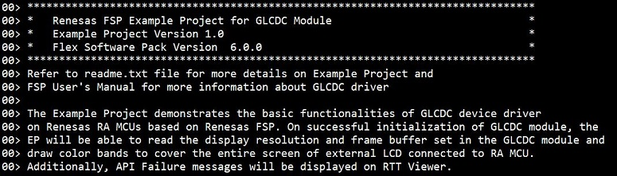
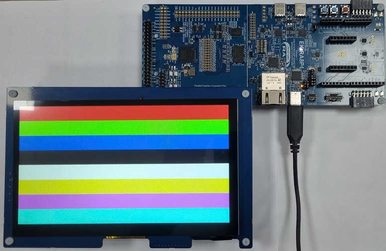
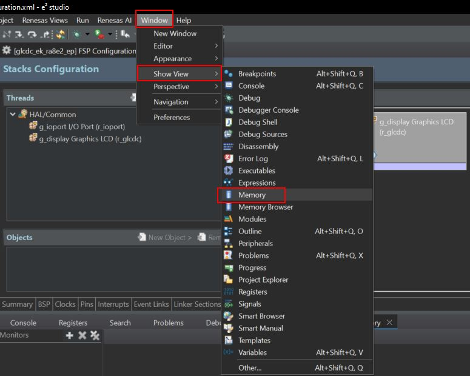
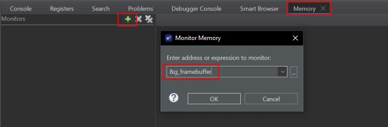

# Introduction #
This example project demonstrates the basic functionalities of the GLCDC device driver on Renesas RA MCUs based on Renesas FSP. On successful initialization of the GLCDC module,
the EP will read the display resolution and frame buffer set in the GLCDC module and draw color bands to cover the entire screen of external LCD connected to RA MCU.
The user can view raw image in e2studio IDE. Errors and status information will be printed on J-Link RTT Viewer during the execution of the project.

Please refer to the [Example Project Usage Guide](https://github.com/renesas/ra-fsp-examples/blob/master/example_projects/Example%20Project%20Usage%20Guide.pdf) 
for general information on example projects and [readme.txt](./readme.txt) for specifics of operation.

## Required Resources ##
To build and run the GLCDC example project, the following resources are needed.

### Software ###
* Renesas Flexible Software Package (FSP): Version 6.1.0
* e2 studio: Version 2025-07
* SEGGER J-Link RTT Viewer: Version 8.58
* LLVM Embedded Toolchain for ARM: Version 18.1.3

Refer to software requirements mentioned in [Example Project Usage Guide](https://github.com/renesas/ra-fsp-examples/blob/master/example_projects/Example%20Project%20Usage%20Guide.pdf)

### Hardware ###
* Supported RA boards: EK-RA6M3G, EK-RA8D1, EK-RA8E2, EK-RA8P1
    * 1 x Renesas RA Board.
    * 1 x Graphics Expansion Board:
        * For EK-RA6M3G, EK-RA8D1: Graphics Expansion Board (P/N: RTK7EK6M3B00001BU).
        * For EK-RA8E2: Graphics Expansion Board (P/N: RTKAPPLCDPS02001BE).
        * For EK-RA8P1: Graphics Expansion Board (P/N: RTKLCDPAR1S00001BE).
    * 1 x Type-C USB cable.
    * For EK-RA8D1: 1 x Renesas APP-LCD-CONV1 board or Jumper wires used to connect Graphics Expansion Board to the RA board.

Refer to [readme.txt](./readme.txt) for information on how to connect the hardware.

### Hardware Connection ###
For EK-RA8D1: When using Jumper Wires to connect Graphic Expansion Board to RA board manually instead of using APP-LCD-CONV1 board.  
Please connect EK-RA8D1's pin to Graphics Expansion Board's pin by following the below table. 

|                  |  EK-RA6M3's LCD Board   |               | ------- |                  | EK-RA8D1 Board           |                  |
| ---------------- | ----------------------- | ------------- | ------- |----------------- | ------------------------ | ---------------- |
| Pin on LCD board | LCD's Pin name          | Connector CN1 | Connect | Connector J57    | RA8D1's Pin Name         | RA8D1's Pin Port |
| 1                | DITH (LCDOTCON1)        | -             | -       |                  |                          |                  |
| 3                | RGB_EN (LCDOTCON2)      | CN1:3         | <--->   | J57:11           | TCON2                    | P513             |
| 5                | SCL                     | CN1:5         | <--->   | J57:4            | IIC_SCL                  | P512             |
| 7                | RGB_B4                  | CN1:7         | <--->   | J57:20           | LCDC_DATA04              | P912             |
| 9                | RGB_B5                  | CN1:9         | <--->   | J57:19           | LCDC_DATA05              | P913             |
| 11               | RGB_B7                  | CN1:11        | <--->   | J57:21           | LCDC_DATA07              | P903             |
| 13               | RGB_G2                  | CN1:13        | <--->   | J57:26           | LCDC_DATA10              | P711             |
| 15               | RGB_G4                  | CN1:15        | <--->   | J57:28           | LCDC_DATA12              | P713             |
| 17               | RGB_G5                  | CN1:17        | <--->   | J57:27           | LCDC_DATA13              | P714             |
| 19               | RGB_G7                  | CN1:19        | <--->   | J57:29           | LCDC_DATA15              | PB07             |
| 21               | SDA                     | CN1:21        | <--->   | J57:2            | IIC_SDA                  | P511             |
| 23               | RGB_R4                  | CN1:23        | <--->   | J57:36           | LCDC_DATA20              | PB03             |
| 25               | RGB_R5                  | CN1:25        | <--->   | J57:35           | LCDC_DATA21              | PB02             |
| 27               | RGB_R7                  | CN1:27        | <--->   | J57:37           | LCDC_DATA23              | P707             |
| 29               | RGB_HSYNCH (LCDOTCON3)  | CN1:29        | <--->   | J57:9            | LCDC_TCON0               | P805             |
| 31               | LR_INV (LCDOTCON5)      | -             | -       | -                | -                        | -                |
| 33               | RGB_R0                  | CN1:33        | <--->   | J57:32           | LCDC_DATA16              | PB06             |
| 35               | /RESET                  | CN1:35        | <--->   | J57:6            | DISP_RST                 | PA01             |
| 37               | RGB_CLK                 | CN1:37        | <--->   | J57:10           | LCDC_CLK                 | P806             |
| 39               | LCD_BLEN                | CN1:39        | <--->   | J57:1            | DISP_BLEN                | P404             |
| -                | -                       | -             | -       | -                | -                        | -                |
| 2                | MODE (LCDOTCON0)        | -             | -       | -                | -                        | -                |
| 4                | RGB_B0                  | CN1:4         | <--->   | J57:16           | LCDC_DATA00              | P914             |
| 6                | RGB_B1                  | CN1:6         | <--->   | J57:15           | LCDC_DATA01              | P915             |
| 8                | RGB_B3                  | CN1:8         | <--->   | J57:17           | LCDC_DATA03              | P911             |
| 10               | RGB_B2                  | CN1:10        | <--->   | J57:18           | LCDC_DATA02              | P910             |
| 12               | RGB_B6                  | CN1:12        | <--->   | J57:22           | LCDC_DATA06              | P904             |
| 14               | RGB_G0                  | CN1:14        | <--->   | J57:24           | LCDC_DATA08              | P902             |
| 16               | RGB_G3                  | CN1:16        | <--->   | J57:25           | LCDC_DATA11              | P712             |
| 18               | RGB_G1                  | CN1:18        | <--->   | J57:23           | LCDC_DATA09              | P207             |
| 20               | RGB_G6                  | CN1:20        | <--->   | J57:30           | LCDC_DATA14              | P715             |
| 22               | RGB_R1                  | CN1:22        | <--->   | J57:31           | LCDC_DATA17              | PB05             |
| 24               | RGB_R3                  | CN1:24        | <--->   | J57:33           | LCDC_DATA19              | PB04             |
| 26               | RGB_R2                  | CN1:26        | <--->   | J57:34           | LCDC_DATA18              | PB01             |
| 28               | RGB_R6                  | CN1:28        | <--->   | J57:38           | LCDC_DATA22              | PB00             |
| 30               | GND                     | CN1:30        | <--->   | J57:39 or J57:40 | GND                      | GND              |
| 32               | RGB_VSYNCH (LCDOTCON4)  | CN1:32        | <--->   | J57:12           | LCDC_TCON1               | P807             |
| 34               | UB_INV (LCDOTCON6)      | -             | -       | -                | -                        | -                |
| 36               | +V3.3                   | CN1:36        | <--->   | J57:5 or J57:7   | +V3.3                    | +V3.3            |
| 38               | INTP                    | CN1:38        | <--->   | J57:3            | DISP_INT                 | P510             |
| 40               | +V5.0                   | CN1:40        | <--->   | J57:8            | +V5.0                    | +V5.0            |

**Note:** If the user wants to use the "Touch function" on the Graphic Expansion Board, the user needs to add a 10K resistor from pin 38 to GND on CN1.

## Related Collateral References ##
The following documents can be referred to for enhancing your understanding of 
the operation of this example project:
- [FSP User Manual on GitHub](https://renesas.github.io/fsp/)
- [FSP Known Issues](https://github.com/renesas/fsp/issues)

# Project Notes #

## System Level Block Diagram ##

## FSP Modules Used ##
List all the various modules that are used in this example project. Refer to the FSP User Manual for further details on each module listed below.

| Module Name | Usage  | Searchable Keyword (using New Stack > Search) |
|-------------|-----------------------------------------------|-----------------------------------------------|
| Graphics LCD | With GLCDC driver, the user can reposition, alpha blend, color correct, dither and convert to and from a wide variety of pixel formats.| GLCD |

## Module Configuration Notes ##
This section describes FSP Configurator properties that are important or different from those selected by default. 

|   Module Property Path and Identifier   |   Default Value   |   Used Value   |   Reason   |
| :-------------------------------------: | :---------------: | :------------: | :--------: |
|   configuration.xml > BSP > Properties > Settings > Property > RA Common > Main Stack Size (bytes)  |  0x400   | 0x800  |  Modified main stack size to accommodate function calls. |
|   configuration.xml > BSP > Properties > Settings > Property > RA Common > Heap Size (bytes)  |  0   | 0x400  |  Changed heap size to accommodate functions usage in the EP and avoid any runtime errors. |
|   configuration.xml > Stacks > g_display Graphics LCD (r_glcdc) > Properties > Settings > Property > Module g_display Graphics LCD (r_glcdc)  >  Input > Graphics Layer 1  > General > Enabled | Yes | Yes | Enabling this option to create framebuffer that is required for color band display. |
|   configuration.xml > Stacks > g_display Graphics LCD (r_glcdc) > Properties > Settings > Property > Module g_display Graphics LCD (r_glcdc) >  Input > Graphics Layer 1  > General > Horizontal size | 480 | 1024 | Horizontal pixel value of LCD used is 800. |
|   configuration.xml > Stacks > g_display Graphics LCD (r_glcdc) > Properties > Settings > Property > Module g_display Graphics LCD (r_glcdc) >  Input > Graphics Layer 1  > General > Vertical size | 272 | 600 | Vertical pixel value of LCD used is 480. |
|   configuration.xml > Stacks > g_display Graphics LCD (r_glcdc) > Properties > Settings > Property > Module g_display Graphics LCD (r_glcdc)  >  Input > Graphics Layer 1  > General > Color format | RGB565 (16-bit) | RGB888 (32-bit) | Specify 32bit Color format input. |
|   configuration.xml > Stacks > g_display Graphics LCD (r_glcdc) > Properties > Settings > Property > Module g_display Graphics LCD (r_glcdc)  >  Input > Graphics Layer 1  > Framebuffer > Number of framebuffers | 2 | 2 | Using a double-buffer allows one to be output to the LCD while the other is being drawn to memory, eliminating tearing and in some cases reducing bus load. Even though this example does not demonstrate this effect, this is an example of a typical graphics application setting. |
|   configuration.xml > Stacks > g_display Graphics LCD (r_glcdc) > Properties > Settings > Property > Module g_display Graphics LCD (r_glcdc) > Input > Graphics Layer 1  > Framebuffer > Section for framebuffer allocation | .sdram_noinit | .sdram | Use sdram instead of bss to prevent RAM overflow. |
|   configuration.xml > Stacks > g_display Graphics LCD (r_glcdc) > Properties > Settings > Property > Module g_display Graphics LCD (r_glcdc) >  Output > Timing  > Horizontal Total Cycles  |   525   |   1344  |   Typical value for horizontal period time for parallel RGB input as per LCD datasheet.  |
|   configuration.xml > Stacks > g_display Graphics LCD (r_glcdc) > Properties > Settings > Property > Module g_display Graphics LCD (r_glcdc) >  Output > Timing  > Horizontal active video cycles  |   480   |   1024  |  Horizontal display area per LCD datasheet. |
|   configuration.xml > Stacks > g_display Graphics LCD (r_glcdc) > Properties > Settings > Property > Module g_display Graphics LCD (r_glcdc)  >  Output > Timing  > Horizontal back porch cycles  |   40   |   140  |   Typical value of number of HSD back porch cycles for parallel RGB input as per LCD datasheet. |
|   configuration.xml > Stacks > g_display Graphics LCD (r_glcdc) > Properties > Settings > Property > Module g_display Graphics LCD (r_glcdc)  >  Output > Timing  > Horizontal sync signal cycles |   1   |   1  |   Typical value of number of Hsync signal assertion cycles. |
|   configuration.xml > Stacks > g_display Graphics LCD (r_glcdc) > Properties > Settings > Property > Module g_display Graphics LCD (r_glcdc)  >  Output > Timing  > Horizontal sync signal polarity |   Low Active   |   Low Active  |   Hsync polarity is active low as per LCD datasheet. |
|   configuration.xml > Stacks > g_display Graphics LCD (r_glcdc) > Properties > Settings > Property > Module g_display Graphics LCD (r_glcdc)  >  Output > Timing  > Vertical total lines |   316   |   635  |   Typical value of total lines in a frame. |
|   configuration.xml > Stacks > g_display Graphics LCD (r_glcdc) > Properties > Settings > Property > Module g_display Graphics LCD (r_glcdc)  >  Output > Timing  > Vertical active video lines |   272   |   600  |   Vertical display area per LCD datasheet. |
|   configuration.xml > Stacks > g_display Graphics LCD (r_glcdc) > Properties > Settings > Property > Module g_display Graphics LCD (r_glcdc)  >  Output > Timing > Vertical back porch lines |   8   |   20  |  Typical value of number of VSD back porch cycles for parallel RGB input as per LCD datasheet. |
|   configuration.xml > Stacks > g_display Graphics LCD (r_glcdc) > Properties > Settings > Property > Module g_display Graphics LCD (r_glcdc)  >  Output > Timing > Vertical sync signal lines |   1   |   1  | Typical value of Vsync signal assertion line. |
|   configuration.xml > Stacks > g_display Graphics LCD (r_glcdc) > Properties > Settings > Property > Module g_display Graphics LCD (r_glcdc)  >  Output > Timing > Vertical sync signal polarity |  Low active | Low active | VSD polarity control bit is low active by default as per LCD datasheet. |
|   configuration.xml > Stacks > g_display Graphics LCD (r_glcdc) > Properties > Settings > Property > Module g_display Graphics LCD (r_glcdc)  >  Output > Timing > Data Enable Signal Polarity | High active | High active | DE polarity is active high by default as per LCD datasheet. |
|   configuration.xml > Stacks > g_display Graphics LCD (r_glcdc) > Properties > Settings > Property > Module g_display Graphics LCD (r_glcdc)  >  Output > Timing > Sync edge | Rising edge | Falling edge | Sync signal is rising edge for LCD. |
|   configuration.xml > Stacks > g_display Graphics LCD (r_glcdc) > Properties > Settings > Property > Module g_display Graphics LCD (r_glcdc) > Output  > Format > Color format | 24bits RGB888 | 24bits RGB888 | Specify 24 bits Color format output to match LCD panel. |
|   configuration.xml > Stacks > g_display Graphics LCD (r_glcdc) > Properties > Settings > Property > Module g_display Graphics LCD (r_glcdc)  >  TCON > Hsync pin select | LCD_TCON1 | LCD_TCON1 | LCD_TCON1 is selected as the respective pin is Hsync pin for the board. |
|   configuration.xml > Stacks > g_display Graphics LCD (r_glcdc) > Properties > Settings > Property > Module g_display Graphics LCD (r_glcdc)  >  TCON > Vsync pin select | LCD_TCON0 | LCD_TCON0 | LCD_TCON0 is selected as the respective pin is Vsync pin for the board. |
|   configuration.xml > Stacks > g_display Graphics LCD (r_glcdc) > Properties > Settings > Property > Module g_display Graphics LCD (r_glcdc)  >  TCON > Data enable (DE) pin select | LCD_TCON2 | LCD_TCON2 | LCD_TCON2 is selected as the respective pin id DE pin for the board. |
|   configuration.xml > Stacks > g_display Graphics LCD (r_glcdc) > Properties > Settings > Property > Module g_display Graphics LCD (r_glcdc)  >  TCON > Panel clock source | Internal clock (GLCDCCLK) | Internal clock (GLCDCCLK) | Internal clock GLCDCCLK is selected. |
|   configuration.xml > Stacks > g_display Graphics LCD (r_glcdc) > Properties > Settings > Property > Module g_display Graphics LCD (r_glcdc)  >  TCON > Panel clock division ratio | 1/24 | 1/8 | Divider selection for generation of required specific frequency to the panel. |

## API Usage ##

The table below lists the GLCDC API used at the application layer by this example project.

| API Name    | Usage                                                                          |
|-------------|--------------------------------------------------------------------------------|
|R_GLCDC_Open| Open GLCDC module. |
|R_GLCDC_Start| Start GLCDC module. |

## Verifying operation ##
Import, Build and Debug the EP (see section Starting Development of **FSP User Manual**). After running the EP, open the RTT Viewer to view status or check any error messages.  
The user can view the raw image in e2studio IDE using Memory Monitor, or view the output directly on the LCD screen.
Before running the example project, refer to the below steps for hardware connections:
* Connect J1 on Graphics Expansion Board to J1 on EK-RA8P1. Please carefully align pin 1 on the Graphic Expansion Board with pin 1 on the EK-RA8P1.
* Connect the USB Debug port on EK-RA8P1 to the PC using a Type-C USB cable.

The below image showcases the output on J-Link RTT Viewer:  

The below image showcases the output on Graphic LCD:  

To view the "Raw Image" in memory monitor of the e2studio IDE using the address of g_framebuffer please follow step as below:  
- On Debug the project EP by e2studio IDE, open memory view.

- Add image buffer under memory monitor.

- Open Raw Image Rendering 

- Set Raw Image Format:
    - Width as 1024
    - Height as 600
    - Encoding to RGB: 32bpp (8:8:8:8)
    - Line alignment to 4 bytes
    - Start Position to Top  

The below image showcase the output in the Memory Monitor view in e2 studio:  

## Special Topics ##
In this example project, the BLEN (backlight enable) pin is set to GPIO mode and is initially high in the Pin configuration.
However, using the BLEN pin as a PWM output function (GPT's GTIOCA or GTIOCB) is recommended, to control the brightness of the LCD backlight and reduce power consumption.
| Board            |BLEN pin         | 
|------------------|-----------------|
| EK-RA6M3G        | P603            |
| EK-RA8D1         | P404            |
| EK-RA8E2         | P404            |
| EK-RA8P1         | P708            |
