# MIPI CSI Example on RA Boards

## Table of Contents
1. [Introduction](#introduction)
2. [Required Resources](#required-resources)
    1. [Hardware Requirements](#hardware-requirements)
        1. [Required Boards](#required-boards)
        2. [Supported Boards](#supported-boards)
        3. [Additional Hardware](#additional-hardware)
        4. [Hardware Connections](#hardware-connections)
    2. [Software Requirements](#software-requirements)

3. [Verifying the application](#verifying-the-application)
4. [Project Notes](#project-notes)
    1. [System Level Block Diagram](#system-level-block-diagram)
    2. [FSP Modules Used](#FSP-Modules-Used)
    3. [Module Configuration Notes:](#module-configuration-notes)
    4. [API Usage](#api-usage)
    5. [Memory Usage](#memory-usage)
    6. [Clock Configuration](#clock-configuration)
    7. [Application Execution Flow](#application-execution-flow)
    8. [Troubleshooting Tips](#troubleshooting-tips)
    9. [Known Limitations](#known-limitations)
5. [Special Topics](#special-topics)
6. [Conclusion and Next Steps](#conclusion-and-next-steps)
7. [References](#references)
8. [Notice](#notice)

# Introduction
This example project demonstrates the basic functionality of MIPI CSI on Renesas RA MCUs using Renesas FSP. The I2C module configures an external camera sensor to operate with the MIPI interface. Captured image data is received by the MIPI CSI module, then processed by the VIN module: clipped per ITU-R BT.601, converted from YCbCr-422 to RGB565, scaled to the user-selected resolution, and stored in SDRAM. The resolution change is handled by the VIN module, allowing dynamic output resizing without reconfiguring the camera sensor.

Before choosing the camera mode, the user is prompted via terminal to select the desired image resolution. After that, the user can choose to capture a live image or a test pattern by typing '1', '2', or '3' to return to the main menu. Captured images are viewable as raw data in e2studio using the Memory view. If a Parallel Graphics LCD is connected, the image is also displayed on-screen.

**Main Menu:**
1. Full parallel display (1024x600)
2. VGA (640x480)
3. QVGA (320x240)

**Camera Mode Selection**
1. Live camera
2. Test pattern
3. Back to main menu

Notes:
* In default, the example project configure the camera sensor with:
  * Input image width: 1024.
  * Input image height: 600.
  * FPS value: 60.
  * For change the FPS please refer the third note of [user configuration notes](#2-user-configuration-notes).
* For the RA boards support J-Link OB VCOM, the EP uses the Serial Terminal by default.
    * The board supports J-Link OB VCOM: EK-RA8P1.
* For RA boards that do not support J-Link OB VCOM,  EP information is communicated to the user via host PC exclusively through the SEGGER J-Link RTT Viewer instead.

Please refer to the [Example Project Usage Guide](https://github.com/renesas/ra-fsp-examples/blob/master/example_projects/Example%20Project%20Usage%20Guide.pdf) 

Note: This Example Project does not perform color correction for the camera sensor.

# Required Resources
To build and run the MIPI CSI example project, the following resources are needed.

## Hardware Requirements

### Required Boards 

* 1 x RA board

### Supported Boards 

* EK-RA8P1

### Additional Hardware 

* 1 x Type-C USB cable for programming and debugging
* For EK-RA8P1:
  * 1 x OV5640 camera module (Part Number: CU450_OV5640).
  * 1 x Camera FFC cable to connect the camera module to the RA board.
  * For display image on the parallel GLCDC (Optional): 
    * 1 x Graphics Expansion Board (Part Number: RTKLCDPAR1S00001BE).
  
  Note: The OV5640 camera module, camera FFC cable, and Graphics Expansion Board are included in the EK-RA8P1 kit package.

## Hardware Connections

* EK-RA8P1:
  * Connect the USB Debug port on EK-RA8P1 to the PC using a Type-C USB cable.
  * Connect the camera module to the camera connector J35 on the EK-RA8P1 board.
  * Optional: Connect J1 on Graphics Expansion Board to J1 on EK-RA8P1. Please carefully align pin 1 on the Graphic Expansion Board with pin 1 on the EK-RA8P1.

  Note: The MIPI_SEL will be controlled by software instead of manual configure the SW4-6 onboard.

    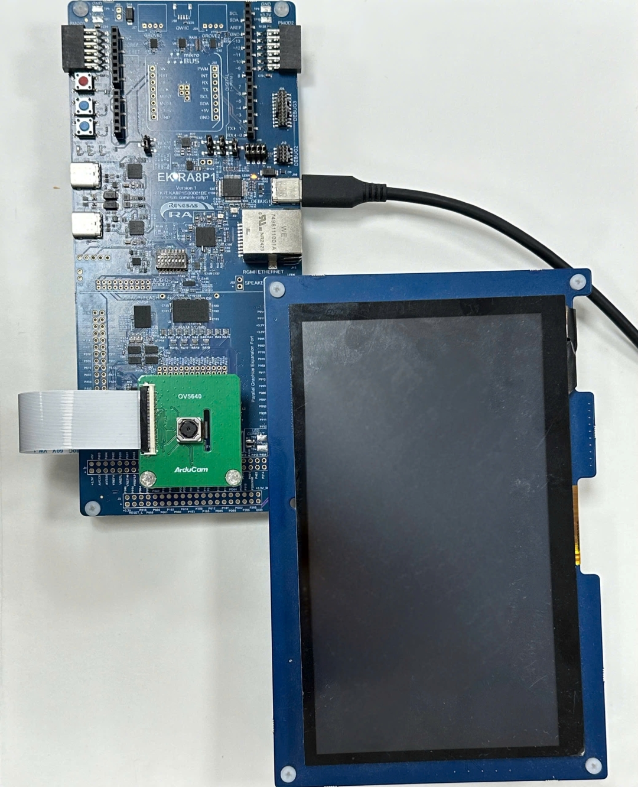

  Camera connection:

    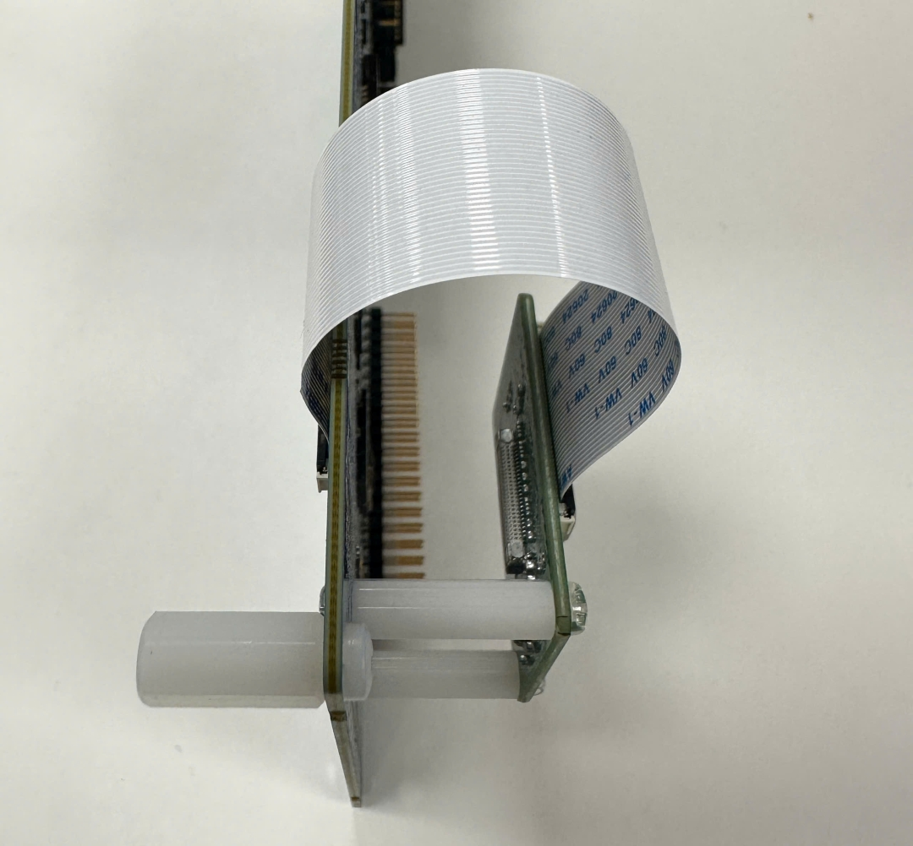

## Software Requirements
* Renesas Flexible Software Package (FSP): Version 6.2.0
* e2 studio: Version 2025-10
* SEGGER J-Link RTT Viewer: Version 8.74
* Terminal Console Application: Tera Term version 4.99
* LLVM Embedded Toolchain for ARM: Version 18.1.3

# Verifying Operation

1. Import the example project. 
2. Generate, and build the example project.
3. Before running the example project, make sure hardware connections are completed.
4. Connect the RA MCU debug port to the host PC.
5. Open the terminal application on the host PC and connect to the RA board.
6. Debug or flash the EP project to the RA board to view output log.

**Note: A debug section is required when using the memory view on e2studio to observe the captured images**

Note:
* For the Serial Terminal application: The macro USE_VIRTUAL_COM is set to 1.
    1. To echo back typed content in Tera Term, go to [Setup] -> [Terminal...] and check [Local echo].
    2. The configuration parameters of the serial port are:
        - COM port: Provided by the J-Link on-board.
        - Baud rate: 115200 bps
        - Data length: 8 bits
        - Parity: None
        - Stop bit: 1 bit
        - Flow control: None

7. On Debug the example project by e2studio IDE:
* Open memory view.

  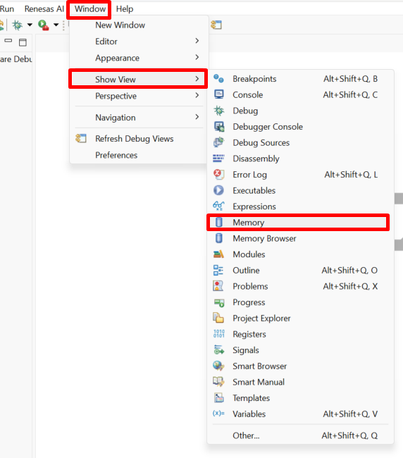

* Add image buffer under memory monitor.

  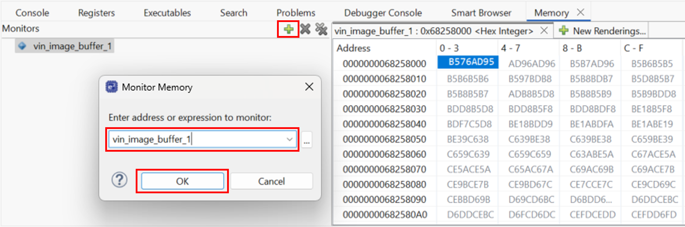

* Open Raw Image Rendering 

  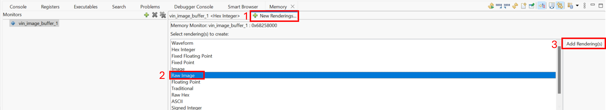

* Set Raw Image Format:
  * Right click in the Raw Image Rendering window and select the Format... option.

  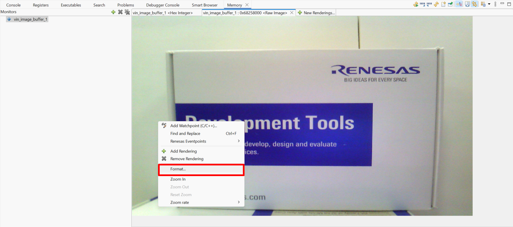

  * For EK-RA8P1:
    * Width as 1024
    * Height as 600
    * Encoding to RGB16bpp (5:6:5)
    * Line alignment to 4 bytes
    * Start Position to Top

    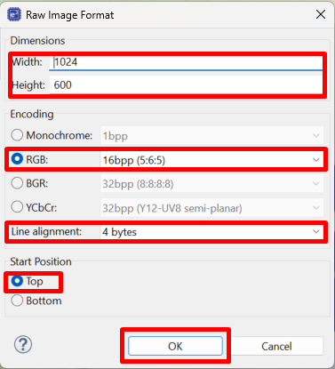

* Below image shows terminal appication operation:
  * EP Information

    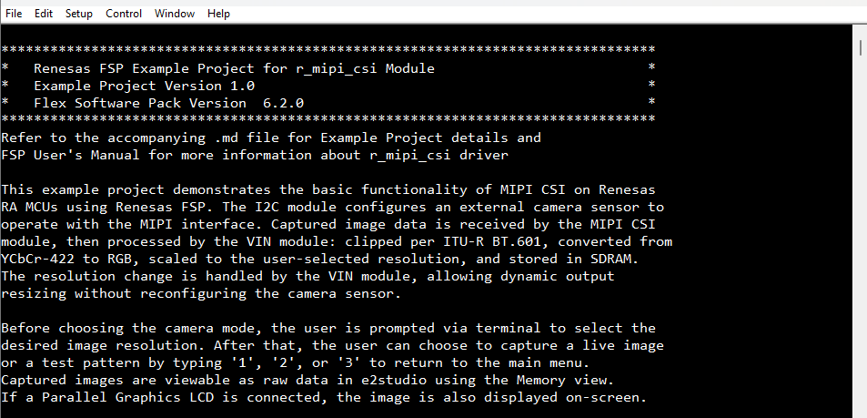

  * Main menu

    

  * Camera mode menu

    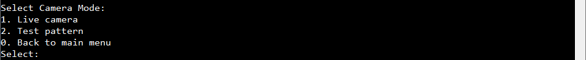

  * Live camera mode

    

  * Test pattern color bar

    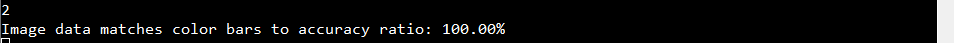
  
* Below images show the captured images on Raw Image rendering:
  * Captured live camera
  
    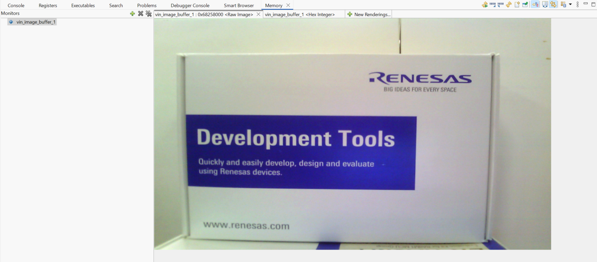

    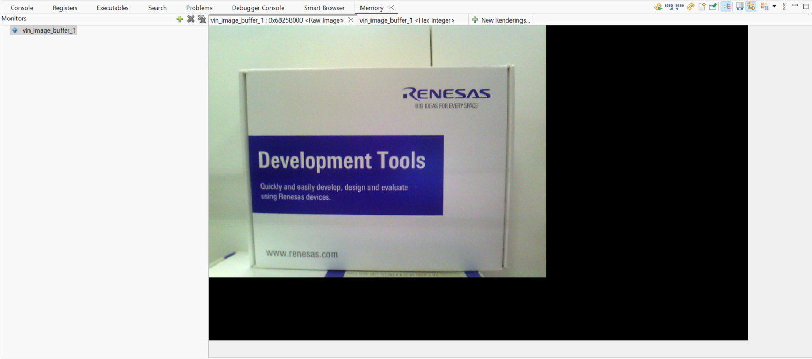

    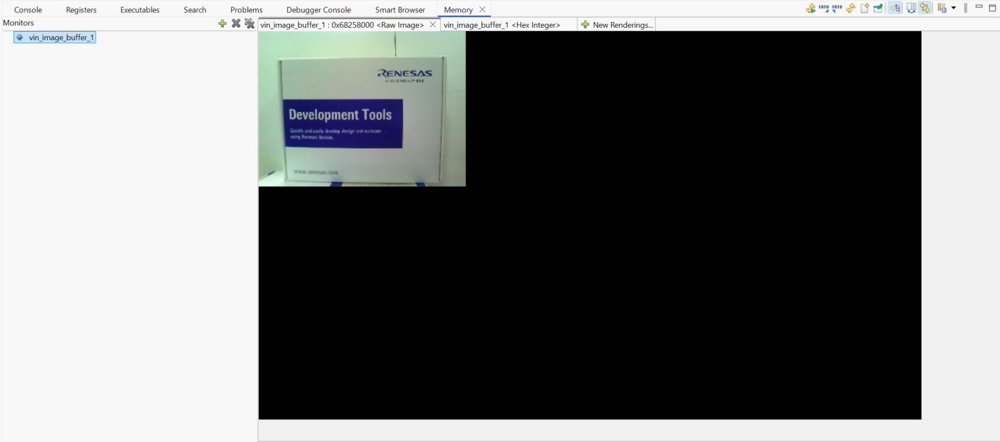

  * Test pattern color bar
  
    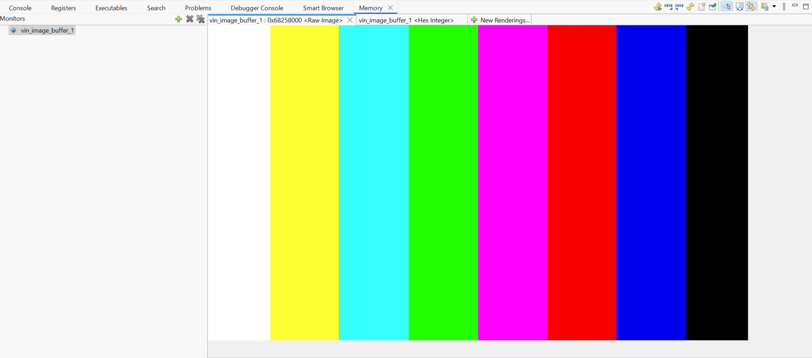

    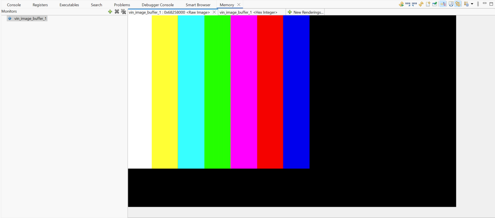

    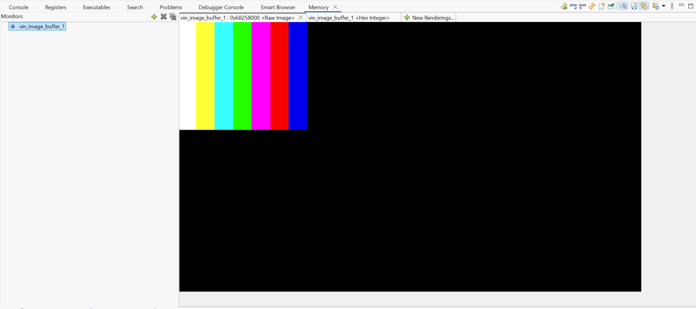

# Project Notes

This section provides a system-level block diagram of the MIPI CSI EP that visually represents the overall architecture, highlighting how different modules interact and how data flows through the system. 
It shows FSP modules MIPI_CSI, VIN, I2C Master, GPT, and GLCDC, which are essential for the application's functionality. Module configuration details are generally covered in the FSP User Manual (UM), 
with additional notes provided only when specific configurations deviate from the standard setup and require user attention. API usage is documented with references to the FSP UM, and
the actual implementation of these APIs is illustrated in the application flow diagram.

Memory usage is outlined, including RAM and Flash consumption, along with the initial FSP version used during the release of the example project, categorized by MCU group and compiler. 
Lastly, any non-default clock configurations and special considerations for clock setup are clearly documented to ensure proper system operation.

## System Level Block Diagram
 High level block diagram of the system is as shown below:
 
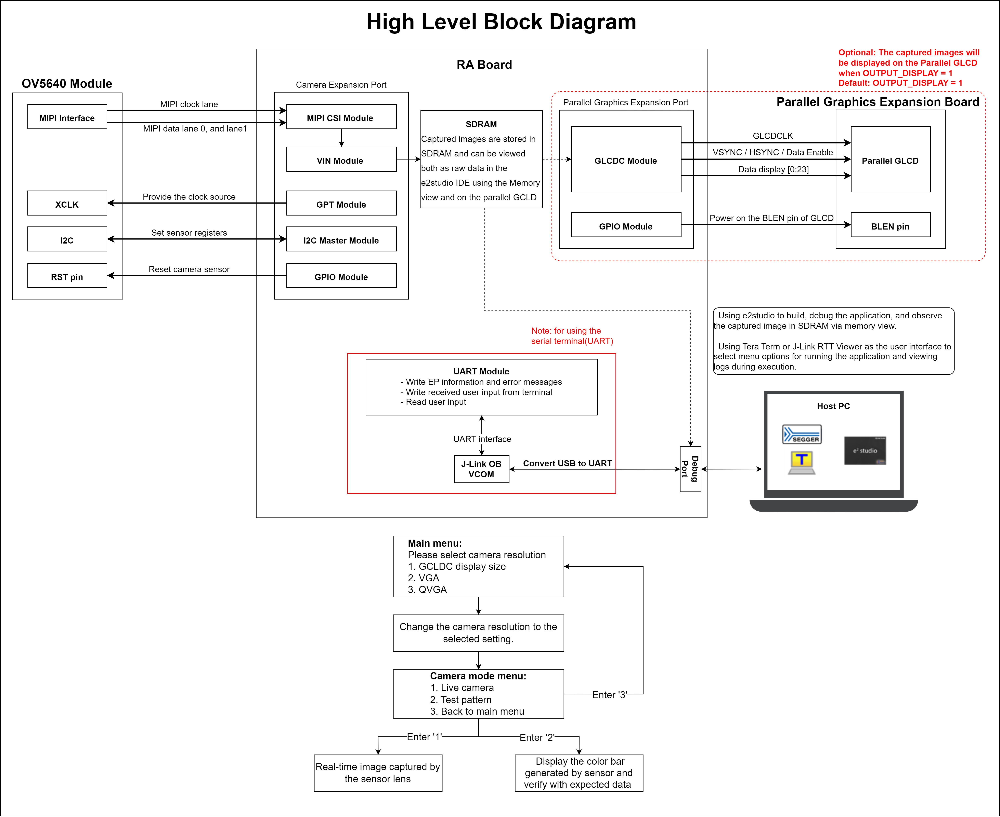

## FSP Modules Used
List all the various modules that are used in this example project. Refer to the FSP User Manual for further details on each module listed below.

| Module Name | Usage | Searchable Keyword  |
|-------------|-----------------------------------------------|-----------------------------------------------|
| MIPI Camera Interface | MIPI CSI is used to capture images from the camera | r_mipi_csi |
| Video Input | VIN is used to process the captured images from the MIPI CSI | r_vin |
| I2C Master | I2C Master is used to configure the camera and control the switch on-board | r_iic_master |
| Timer, General PWM | GPT is used to provide the external clock for the camera | r_gpt |
| I/O Port | IO Port is used to set power mode for the camera | r_ioport |
| Graphics LCD | GLCDC is used to display the captured images | r_glcdc |

## Module Configuration Notes
This section describes FSP Configurator properties which are important or different than those selected by default. 

**Configuration Properties for VIN instance**

|   Module Property Path and Identifier   |   Default Value   |   Used Value   |   Reason   |
|-----------------------------------------|-------------------|----------------|------------|
| configuration.xml > g_vin Video Input (r_vin) > Properties > Settings > Property > Module g_vin Video Input (r_vin) > Input > Image > Size > Vertical | 600 | 600 |Vertical input pixel value of VIN used is 600. | 
| configuration.xml > g_vin Video Input (r_vin) > Properties > Settings > Property > Module g_vin Video Input (r_vin) > Input > Image > Size > Horizontal | 1024 | 1024 |Horizontal input pixel value of VIN used is 1024. |
| configuration.xml > g_vin Video Input (r_vin) > Properties > Settings > Property > Module g_vin Video Input (r_vin) > Input > Interface Format | YCbCr-422, 8-bit | YCbCr-422, 8-bit |The input interface format of VIN is YCbCr-422, 8-bit. |
| configuration.xml > g_vin Video Input (r_vin) > Properties > Settings > Property > Module g_vin Video Input (r_vin) > Input > Virtual Channel select | 0 | 0 | The virtual channel of VIN is set to 0. |
| configuration.xml > g_vin Video Input (r_vin) > Properties > Settings > Property > Module g_vin Video Input (r_vin) > Output > Conversion > Color Space Conversion Bypass | False | False | Enable color space conversion. |
| configuration.xml > g_vin Video Input (r_vin) > Properties > Settings > Property > Module g_vin Video Input (r_vin) > Interrupts > Status > End of Frame Detect | ☐ | ☑ | Enable  End of Frame Detect interrupt. |
| configuration.xml > g_vin Video Input (r_vin) > Properties > Settings > Property > Module g_vin Video Input (r_vin) > Interrupts > Status > Frame Memory Write Completion Notify | ☐ | ☑ | Enable Frame Memory Write Completion Notify interrupt. |
| configuration.xml > g_vin Video Input (r_vin) > Properties > Settings > Property > Module g_vin Video Input (r_vin) > Interrupts > Priorities > Status Notify | Disable | Priority 2 | Set priority for Status Notify interrupts. |
| configuration.xml > g_vin Video Input (r_vin) > Properties > Settings > Property > Module g_vin Video Input (r_vin) > Interrupts > Callback | vin_callback | vin_callback | It is called from the interrupt service routine (ISR) upon VIN operation has any status notify or error interrupts. |

**Configuration Properties for MIPI CSI instance**

|   Module Property Path and Identifier   |   Default Value   |   Used Value   |   Reason   |
|-----------------------------------------|-------------------|----------------|------------|
| configuration.xml > g_mipi_csi0 MIPI Camera Interface (r_mipi_csi) > Properties > Settings > Property > Module g_mipi_csi0 MIPI Camera Interface (r_mipi_csi) > Interrupts > Interrupt Priorities > Receive Interrupt | Disable | Priority 12 | Set priority for Receive Interrupt. |
| configuration.xml > g_mipi_csi0 MIPI Camera Interface (r_mipi_csi) > Properties > Settings > Property > Module g_mipi_csi0 MIPI Camera Interface (r_mipi_csi) > Interrupts > Interrupt Priorities > Data Lane Interrupt | Disable | Priority 12 | Set priority for Data Lane Interrupt. |
| configuration.xml > g_mipi_csi0 MIPI Camera Interface (r_mipi_csi) > Properties > Settings > Property > Module g_mipi_csi0 MIPI Camera Interface (r_mipi_csi) > Interrupts > Interrupt Priorities > Virtual Channel 0..15 Interrupt | Disable | Priority 12 | Set priority for Virtual Channel 0..15 Interrupt. |
| configuration.xml > g_mipi_csi0 MIPI Camera Interface (r_mipi_csi) > Properties > Settings > Property > Module g_mipi_csi0 MIPI Camera Interface (r_mipi_csi) > Interrupts > Receive Events > RX (Reception) Active Detect Interrupt Enable | ☐ | ☑| Enable RX (Reception) Active Detect Interrupt. |
| configuration.xml > g_mipi_csi0 MIPI Camera Interface (r_mipi_csi) > Properties > Settings > Property > Module g_mipi_csi0 MIPI Camera Interface (r_mipi_csi) > Interrupts > Callback | mipi_csi_callback | mipi_csi0_callback|  It is called from the interrupt service routine (ISR) upon MIPI CSI operation has any status notify or error interrupts. |
| configuration.xml > g_mipi_csi0 MIPI Camera Interface (r_mipi_csi) > Properties > Settings > Property > Module g_mipi_csi0 MIPI Camera Interface (r_mipi_csi) > Number of Data Lanes | 2 | 2| Use 2 MIPI data lanes. |
| configuration.xml > g_mipi_csi0 MIPI Camera Interface (r_mipi_csi) > Properties > Settings > Property > Module g_mipi_csi0 MIPI Camera Interface (r_mipi_csi) > LFSR (Descramble) Enable Mode | Enable | Disable| Disable LFSR (Descramble) Mode. |

**Configuration Properties for I2C Master instance**

|   Module Property Path and Identifier   |   Default Value   |   Used Value   |   Reason   |
|-----------------------------------------|-------------------|----------------|------------|
| configuration.xml > g_i2c_master_for_peripheral I2C Master (r_iic_master) > Properties > Settings > Property > Module g_i2c_master_for_peripheral I2C Master (r_iic_master) > Channel | 0 | 1 | Use I2C Master Channel 1 to control the camera module and the switch on-board. |
| configuration.xml > g_i2c_master_for_peripheral I2C Master (r_iic_master) > Properties > Settings > Property > Module g_i2c_master_for_peripheral I2C Master (r_iic_master) > Rate | Standard | Fast-mode | Optimize communication speed with the camera module and the switch on-board. |
| configuration.xml > g_i2c_master_for_peripheral I2C Master (r_iic_master) > Properties > Settings > Property > Module g_i2c_master_for_peripheral I2C Master (r_iic_master) > Address Mode | 7-Bit | 7-Bit | Specific address mode of the camera sensor and the switch on-board. |
| configuration.xml > g_i2c_master_for_peripheral I2C Master (r_iic_master) > Properties > Settings > Property > Module g_i2c_master_for_peripheral I2C Master (r_iic_master) > Callback | NULL | g_i2c_master_for_peripheral_callback | It is called from the interrupt service routine (ISR) upon IIC transaction completion reporting the transaction status. |
| configuration.xml > g_i2c_master_for_peripheral I2C Master (r_iic_master) > Properties > Settings > Property > Module g_i2c_master_for_peripheral I2C Master (r_iic_master) > Interrupt Priority Level | Priority 12 | Priority 0 (highest) | Select the IIC master interrupt priority. |

**Configuration Properties for GPT instance**

|   Module Property Path and Identifier   |   Default Value   |   Used Value   |   Reason   |
|-----------------------------------------|-------------------|----------------|------------|
| configuration.xml > g_timer_periodic Timer, General PWM (r_gpt) > Properties > Settings > Property > Common >Pin Output Support | Disabled | Enabled | Provide clock source for camera. |
| configuration.xml > g_timer_periodic Timer, General PWM (r_gpt) > Properties > Settings > Property > Module g_timer_periodic Timer, General PWM (r_gpt) > General > Channel | 0 | 12 | Use GPT Channel 12 to generate the input clock for the camera module and the switch on-board. |
| configuration.xml > g_timer_periodic Timer, General PWM (r_gpt) > Properties > Settings > Property > Module g_timer_periodic Timer, General PWM (r_gpt) > General > Mode | Periodic | Periodic | Set the GPT in periodic mode to generate the clock source. |
| configuration.xml > g_timer_periodic Timer, General PWM (r_gpt) > Properties > Settings > Property > Module g_timer_periodic Timer, General PWM (r_gpt) > General > Period | 0x100000000 | 24000 | Set the GPT frequency to 24 Mhz, to be in specification for the camera's clock source [6 ~ 27MHz]. |
| configuration.xml > g_timer_periodic Timer, General PWM (r_gpt) > Properties > Settings > Property > Module g_timer_periodic Timer, General PWM (r_gpt) > General > Period Unit | Raw Counts | Kilohertz | Set the GPT frequency to 24 MHz. |
| configuration.xml > g_timer_periodic Timer, General PWM (r_gpt) > Properties > Settings > Property > Module g_timer_periodic Timer, General PWM (r_gpt) > Output > GTIOCA Output Enabled | False | True | Provide a 24 MHz clock frequency output pin. |

**Configuration Properties for GLCDC instance**

|   Module Property Path and Identifier   |   Default Value   |   Used Value   |   Reason   |
|-----------------------------------------|-------------------|----------------|------------|
| configuration.xml > g_display Graphics LCD (r_glcdc) > Properties > Settings > Property > Module g_display Graphics LCD (r_glcdc) > Input > Graphics Layer 1 > General > Enable | Yes | Yes | Enable the graphics layer 1. |
|   configuration.xml > Stacks > g_display Graphics LCD (r_glcdc) > Properties > Settings > Property > Module g_display Graphics LCD (r_glcdc) > Input > Graphics Layer 1  > General > Horizontal size | 480 | 1024 | Horizontal pixel value of LCD used is 1024. |
|   configuration.xml > Stacks > g_display Graphics LCD (r_glcdc) > Properties > Settings > Property > Module g_display Graphics LCD (r_glcdc) > Input > Graphics Layer 1  > General > Vertical size | 854 | 600 | Vertical pixel value of LCD used is 600 . |
|   configuration.xml > Stacks > g_display Graphics LCD (r_glcdc) > Properties > Settings > Property > Module g_display Graphics LCD (r_glcdc)  > Input > Graphics Layer 1  > General > Color format | RGB565 (16-bit) | RGB565 (16-bit) | Specify 16-bit Color format input. |
|   configuration.xml > Stacks > g_display Graphics LCD (r_glcdc) > Properties > Settings > Property > Module g_display Graphics LCD (r_glcdc) > Output > Timing  > Horizontal Total Cycles  |   559   |   1344  |   Typical value for horizontal period time for parallel RGB input as per LCD datasheet.  |
|   configuration.xml > Stacks > g_display Graphics LCD (r_glcdc) > Properties > Settings > Property > Module g_display Graphics LCD (r_glcdc) > Output > Timing  > Horizontal active video cycles  |   480   |   1024  |  Horizontal display area per LCD datasheet. |
|   configuration.xml > Stacks > g_display Graphics LCD (r_glcdc) > Properties > Settings > Property > Module g_display Graphics LCD (r_glcdc) > Output > Timing  > Horizontal back porch cycles  |   5   |   140  |   Typical value of number of HSD back porch cycles for parallel RGB input as per LCD datasheet. |
|   configuration.xml > Stacks > g_display Graphics LCD (r_glcdc) > Properties > Settings > Property > Module g_display Graphics LCD (r_glcdc) > Output > Timing  > Horizontal sync signal cycles |   2   |   1  |   Typical value of number of Hsync signal assertion cycles. |
|   configuration.xml > Stacks > g_display Graphics LCD (r_glcdc) > Properties > Settings > Property > Module g_display Graphics LCD (r_glcdc) > Output > Timing  > Horizontal sync signal polarity |   Low Active   |   Low Active  |   Hsync polarity is active low as per LCD datasheet. |
|   configuration.xml > Stacks > g_display Graphics LCD (r_glcdc) > Properties > Settings > Property > Module g_display Graphics LCD (r_glcdc) > Output > Timing  > Vertical total lines |   894   |   635  |   Typical value of total lines in a frame. |
|   configuration.xml > Stacks > g_display Graphics LCD (r_glcdc) > Properties > Settings > Property > Module g_display Graphics LCD (r_glcdc) > Output > Timing  > Vertical active video lines |   854   |   600  |   Vertical display area per LCD datasheet. |
|   configuration.xml > Stacks > g_display Graphics LCD (r_glcdc) > Properties > Settings > Property > Module g_display Graphics LCD (r_glcdc) > Output > Timing > Vertical back porch lines |   20   |   20  |  Typical value of number of VSD back porch cycles for parallel RGB input as per LCD datasheet. |
|   configuration.xml > Stacks > g_display Graphics LCD (r_glcdc) > Properties > Settings > Property > Module g_display Graphics LCD (r_glcdc) > Output > Timing > Vertical sync signal lines |   3   |   1  | Typical value of Vsync signal assertion line. |
|   configuration.xml > Stacks > g_display Graphics LCD (r_glcdc) > Properties > Settings > Property > Module g_display Graphics LCD (r_glcdc) > Output > Timing > Vertical sync signal polarity |  Low active | Low active | VSD polarity control bit is low active by default as per LCD datasheet. |
|   configuration.xml > Stacks > g_display Graphics LCD (r_glcdc) > Properties > Settings > Property > Module g_display Graphics LCD (r_glcdc) > Output > Timing > Data Enable Signal Polarity | High active | High active | DE polarity is active high by default as per LCD datasheet. |
|   configuration.xml > Stacks > g_display Graphics LCD (r_glcdc) > Properties > Settings > Property > Module g_display Graphics LCD (r_glcdc) > Output > Timing > Sync edge | Rising edge | Falling edge | Sync signal is rising edge for LCD. |
|   configuration.xml > Stacks > g_display Graphics LCD (r_glcdc) > Properties > Settings > Property > Module g_display Graphics LCD (r_glcdc) > Output  > Format > Color format | 24bits RGB888 | 24bits RGB888 | Specify 24 bits Color format output to match LCD panel. |
|   configuration.xml > Stacks > g_display Graphics LCD (r_glcdc) > Properties > Settings > Property > Module g_display Graphics LCD (r_glcdc) > TCON > Hsync pin select | LCD_TCON1 | LCD_TCON1 | LCD_TCON1 is selected as the respective pin is Hsync pin for the board. |
|   configuration.xml > Stacks > g_display Graphics LCD (r_glcdc) > Properties > Settings > Property > Module g_display Graphics LCD (r_glcdc) > TCON > Vsync pin select | LCD_TCON0 | LCD_TCON0 | LCD_TCON0 is selected as the respective pin is Vsync pin for the board. |
|   configuration.xml > Stacks > g_display Graphics LCD (r_glcdc) > Properties > Settings > Property > Module g_display Graphics LCD (r_glcdc) > TCON > Data enable (DE) pin select | LCD_TCON2 | LCD_TCON2 | LCD_TCON2 is selected as the respective pin id DE pin for the board. |
|   configuration.xml > Stacks > g_display Graphics LCD (r_glcdc) > Properties > Settings > Property > Module g_display Graphics LCD (r_glcdc) > TCON > Panel clock source | Internal clock (GLCDCCLK) | Internal clock (GLCDCCLK) | Internal clock GLCDCCLK is selected. |
|   configuration.xml > Stacks > g_display Graphics LCD (r_glcdc) > Properties > Settings > Property > Module g_display Graphics LCD (r_glcdc) > TCON > Panel clock division ratio | 1/8 | 1/4 | Divider selection for generation of required specific frequency to the panel. |

**SDRAM setups in BSP Configuration**
|   Module Property Path and Identifier   |   Default Value   |   Used Value   |   Reason   |
|-----------------------------------------|-------------------|----------------|------------|
| configuration.xml > BSP > Properties > Settings > Property > RA8P1 Family > SDRAM > SDRAM Support | Disable | Enable | Initialize SDRAM. |

**Enable Data cache in BSP Configuration**
|   Module Property Path and Identifier   |   Default Value   |   Used Value   |   Reason   |
|-----------------------------------------|-------------------|----------------|------------|
| configuration.xml > BSP > Properties > Settings > Property > RA8P1 Family > Cache setting > Data cache | Disable | Enable | Enable Data cache to improve performance. |
| configuration.xml > BSP > Properties > Settings > Property > RA8P1 Family > Cache setting > Data cache forced write-through | Disable | Enable | Force D-Cache to use write-through for all cacheable writes. |

**Configuration Properties for the Serial Terminal (UART instance)**   
|   Configure interrupt event path   |   Default Value   |   Used Value   |   Reason   |
|-----------------------------------------|-------------------|----------------|------------|
| configuration.xml > Interrupts > Interrupts Configuration > New User Event > SCI > SCI8 > SCI8 RXI (Receive data full) | empty | sci_b_uart_rxi_isr | Assign the UART receive ISR (Receive data full) to the interrupt vector table. |
| configuration.xml > Interrupts > Interrupts Configuration > New User Event > SCI > SCI8 > SCI8 TXI (Transmit data empty) | empty | sci_b_uart_txi_isr | Assign the UART transfer ISR (Transmit data empty) to the interrupt vector table. |
| configuration.xml > Interrupts > Interrupts Configuration > New User Event > SCI > SCI8 > SCI8 TEI (Transmit end) | empty | sci_b_uart_tei_isr | Assign the UART transfer ISR (Transmit end) to the interrupt vector table. |
| configuration.xml > Interrupts > Interrupts Configuration > New User Event > SCI > SCI8 > SCI8 ERI (Receive error) | empty | sci_b_uart_eri_isr | Assign the UART receive ISR (Receive error) to the interrupt vector table. |

## API Usage
The links below list the FSP provided API used at the application layer by this example project.
- [VIN APIs on GitHub IO](https://renesas.github.io/fsp/group___v_i_n.html)
- [GPT APIs on GitHub IO](https://renesas.github.io/fsp/group___g_p_t.html)
- [IIC Master APIs on GitHub IO](https://renesas.github.io/fsp/group___i_i_c___m_a_s_t_e_r.html)
- [GLCDC APIs on GitHub IO](https://renesas.github.io/fsp/group___g_l_c_d_c.html)
- [BSP SDRAM APIs on GitHub IO](https://renesas.github.io/fsp/group___b_s_p___s_d_r_a_m.html)
- [BSP IO APIs on GitHub IO](https://renesas.github.io/fsp/group___b_s_p___i_o.html)

## Memory Usage

**Memory Usage of mipi_csi Example Project in Bytes**
This section outlines the code and data memory consumption in the example project, encompassing both the HAL driver and application code. It provides an estimate of the memory requirements for the module and the application.

|   Compiler                              |   text	        |   data         |   .bss           |
| :-------------------------------------: | :-------------: | :------------: | :--------------: |
|   LLVM                                  |   41418 Bytes   |   66 Bytes     |    6150928 Bytes |

**Note: For users seeking detailed insights into the memory usage of individual modules and functions, the following third-party tool can be used to analyze memory consumption at a granular level.**
- [Memory usage tool](https://www.sikorskiy.net/info/prj/amap/)

## Clock configuration
|   Configure Clock path   |   Default Value   |   Used Value   |   Reason   |
|-----------------------------------------|-------------------|----------------|------------|
| configuration.xml > Clocks > Clocks Configuration > SCICLK Src | SCICLK Disable | SCICLK Src:PLL2R | Enable operating clock for SCI module by PLL2R clock source. |
| configuration.xml > Clocks > Clocks Configuration > SCICLK Div | SCICLK Div/4 | SCICLK Div/4 | Divider for SCICLK is 4. |
| configuration.xml > Clocks > Clocks Configuration > LCDCLK Src | LCDCLK Disable | LCDCLK Src:PLL2R | Enable operating clock for LCD module by PLL2R clock source. |
| configuration.xml > Clocks > Clocks Configuration > LCDCLK Div | LCDCLK Div/2 | LCDCLK Div/2 | Divider for LCDCLK is 2. |

# Application Execution Flow
Sequence Diagram of the EP is as shown below:
 
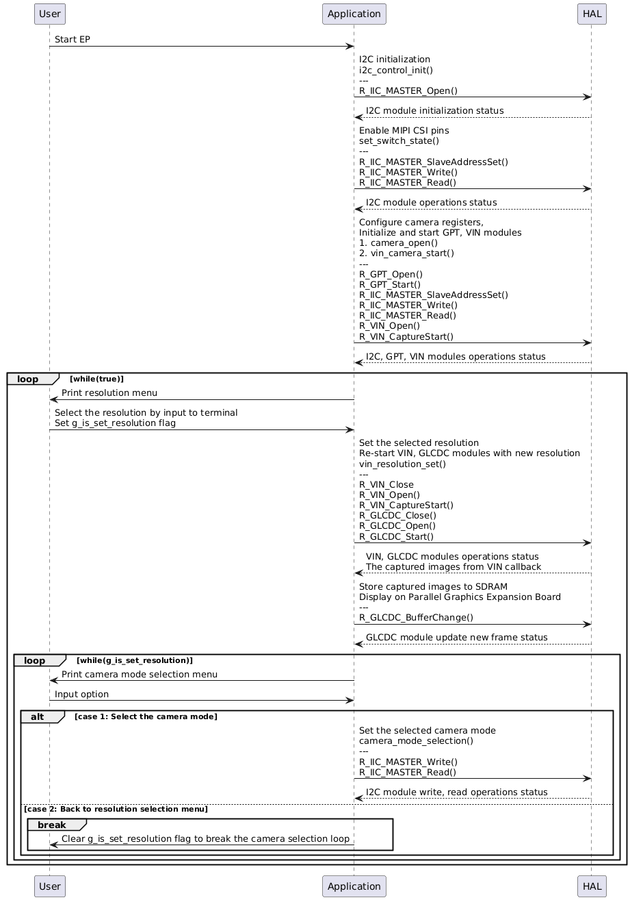

## Troubleshooting Tips 

No troubleshooting tips are seen in this EP

## Known Limitations

* Full HD (1920x1080) input for the VIN module is currently not supported.

* Real-time VIN buffer handling is not available at this time.

# Special Topics #

## 1. Terminal notes
By default, the EP supports Serial terminal for RA boards that support J-link OB VCOM
* Define USE_VIRTUAL_COM = 1 macro in Project Properties -> C/C++ Build -> Settings -> Tool Settings -> Compiler -> Includes -> Macro Defines (-D)

To use SEGGER J-Link RTT Viewer, please follow the instructions below:
* Define USE_VIRTUAL_COM = 0 macro in Project Properties -> C/C++ Build -> Settings -> Tool Settings -> Compiler -> Includes -> Macro Defines (-D)

## 2. User configuration notes
* DISPLAY_OUTPUT macro in user_config.h is used to enable/disable using the GLCDC display.
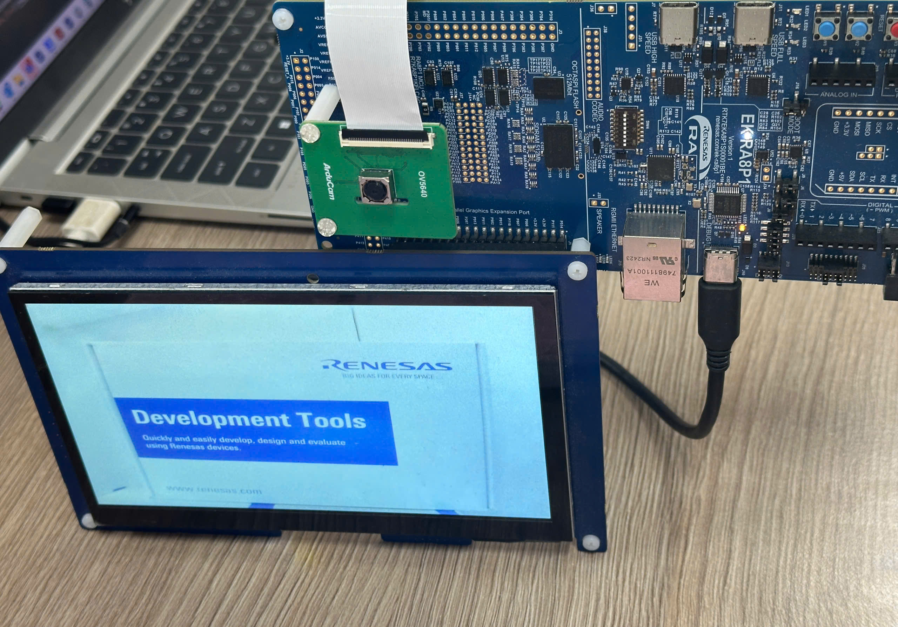
* AWB_MANUAL_ENABLE macro in user_config.h is used to enable/disable using the auto white balance feature of camera sensor.
* FPS_TARGET macro in user_config.h is used to configure the expect FSP value for example project. But the FPS value depends on the camera input image size so please refer to the camera sensor’s datasheet before making any adjustments.
Note: In default, the input image width is 1024, the input image height is 600, and the FPS value is 60

## 3. Control Switch on-board
1. In i2c_control.c, the write_reg_8bit, read_reg_8bit functions are used to write/read 8-bit data to/from the 8-bit registers through I2C Master module.
2. In switch_init.c, the set_switch_reg function is used to set specific bits of the 8-bit registers 
3. In switch_init.c, the set_switch_state function is used to set the state of a specific switch pin on the board by manipulating the registers of the PI4IOE5V6408 IC.
* For example, to use the MIPI CSI interface, the SW4-6 switch must be set to a High level. Therefore, the corresponding port pin should be configured as an output, its output state enabled, and the logic level driven High.

# Conclusion and Next Steps

This example project demonstrates a complete image capture and processing flow using the MIPI CSI interface on Renesas RA MCUs. It covers camera sensor configuration over I2C, image acquisition through the MIPI CSI and VIN modules, and essential processing such as color conversion, scaling, and memory storage. Additionally, it supports real-time resolution changes by the VIN module, allowing flexible image output without reconfiguring the camera sensor.

Through the image capture and processing sequence, users gain valuable hands-on experience in configuring and utilizing the MIPI CSI module and VIN module on RA devices.

To further explore MIPI CSI implementation on Renesas RA MCUs:

Review the project source code located in the src directory.

refer to the HAL driver and its documentation in the FSP User Manual for deeper technical insights.

Visit renesas.com for additional MIPI CSI resources, application notes, and documentation related to RA devices. 

We have developed a Vision AI application that showcases a practical use case by integrating VIN and MIPI CSI for image capture, combined with AI processing for real-time analysis. This application demonstrates how these components work together to deliver intelligent vision capabilities in a real-world scenario.

# References

The following documents can be referred to for enhancing your understanding of 
the operation of this example project:
- [FSP User Manual on GitHub](https://renesas.github.io/fsp/)
- [FSP Known Issues](https://github.com/renesas/fsp/issues)
- [PI4IOE5V6408 Datasheet](https://www.diodes.com/datasheet/download/PI4IOE5V6408.pdf)
- [RA8P1 - (1GHz Arm Cortex-M85 and Ethos-U55 NPU Based AI Microcontroller)](https://www.renesas.com/en/products/ra8p1)
- [Vision AI application](https://www.renesas.com/en/document/apn/building-vision-ai-application-using-ra8p1-mcu-ethos-u55-npu)

# Notice

1. Descriptions of circuits, software and other related
information in this document are provided only to illustrate the
operation of semiconductor products and application examples. You are
fully responsible for the incorporation or any other use of the
circuits, software, and information in the design of your product or
system. Renesas Electronics disclaims any and all liability for any
losses and damages incurred by you or third parties arising from the use
of these circuits, software, or information. 

2. Renesas Electronics
hereby expressly disclaims any warranties against and liability for
infringement or any other claims involving patents, copyrights, or other
intellectual property rights of third parties, by or arising from the
use of Renesas Electronics products or technical information described
in this document, including but not limited to, the product data,
drawings, charts, programs, algorithms, and application examples. 

3. No license, express, implied or otherwise, is granted hereby under any
patents, copyrights or other intellectual property rights of Renesas
Electronics or others. 

4. You shall be responsible for determining what
licenses are required from any third parties, and obtaining such
licenses for the lawful import, export, manufacture, sales, utilization,
distribution or other disposal of any products incorporating Renesas
Electronics products, if required. 

5. You shall not alter, modify, copy,
or reverse engineer any Renesas Electronics product, whether in whole or
in part. Renesas Electronics disclaims any and all liability for any
losses or damages incurred by you or third parties arising from such
alteration, modification, copying or reverse engineering. 

6. Renesas Electronics products are classified according to the following two
quality grades: "Standard" and "High Quality". The intended applications
for each Renesas Electronics product depends on the product's quality
grade, as indicated below. "Standard": Computers; office equipment;
communications equipment; test and measurement equipment; audio and
visual equipment; home electronic appliances; machine tools; personal
electronic equipment; industrial robots; etc. "High Quality":
Transportation equipment (automobiles, trains, ships, etc.); traffic
control (traffic lights); large-scale communication equipment; key
financial terminal systems; safety control equipment; etc. Unless
expressly designated as a high reliability product or a product for
harsh environments in a Renesas Electronics data sheet or other Renesas
Electronics document, Renesas Electronics products are not intended or
authorized for use in products or systems that may pose a direct threat
to human life or bodily injury (artificial life support devices or
systems; surgical implantations; etc.), or may cause serious property
damage (space system; undersea repeaters; nuclear power control systems;
aircraft control systems; key plant systems; military equipment; etc.).
Renesas Electronics disclaims any and all liability for any damages or
losses incurred by you or any third parties arising from the use of any
Renesas Electronics product that is inconsistent with any Renesas
Electronics data sheet, user's manual or other Renesas Electronics
document. 

7. No semiconductor product is absolutely secure. Notwithstanding any security measures or features that may be implemented in Renesas Electronics hardware or software products, Renesas Electronics shall have absolutely no liability arising out of
any vulnerability or security breach, including but not limited to any unauthorized access to or use of a Renesas Electronics product or a system that uses a Renesas Electronics product. RENESAS ELECTRONICS DOES NOT WARRANT OR GUARANTEE THAT RENESAS ELECTRONICS PRODUCTS, OR ANY
SYSTEMS CREATED USING RENESAS ELECTRONICS PRODUCTS WILL BE INVULNERABLE OR FREE FROM CORRUPTION, ATTACK, VIRUSES, INTERFERENCE, HACKING, DATA LOSS OR THEFT, OR OTHER SECURITY INTRUSION ("Vulnerability Issues"). RENESAS ELECTRONICS DISCLAIMS ANY AND ALL RESPONSIBILITY OR LIABILITY
ARISING FROM OR RELATED TO ANY VULNERABILITY ISSUES. FURTHERMORE, TO THE EXTENT PERMITTED BY APPLICABLE LAW, RENESAS ELECTRONICS DISCLAIMS ANY AND ALL WARRANTIES, EXPRESS OR IMPLIED, WITH RESPECT TO THIS DOCUMENT
AND ANY RELATED OR ACCOMPANYING SOFTWARE OR HARDWARE, INCLUDING BUT NOT LIMITED TO THE IMPLIED WARRANTIES OF MERCHANTABILITY, OR FITNESS FOR A PARTICULAR PURPOSE. 

8. When using Renesas Electronics products, refer to the latest product information (data sheets, user's manuals, application notes, "General Notes for Handling and Using Semiconductor Devices" in
the reliability handbook, etc.), and ensure that usage conditions are within the ranges specified by Renesas Electronics with respect to
maximum ratings, operating power supply voltage range, heat dissipation characteristics, installation, etc. Renesas Electronics disclaims any
and all liability for any malfunctions, failure or accident arising out of the use of Renesas Electronics products outside of such specified
ranges. 

9. Although Renesas Electronics endeavors to improve the quality and reliability of Renesas Electronics products, semiconductor products
have specific characteristics, such as the occurrence of failure at a certain rate and malfunctions under certain use conditions. Unless
designated as a high reliability product or a product for harsh environments in a Renesas Electronics data sheet or other Renesas
Electronics document, Renesas Electronics products are not subject to radiation resistance design. You are responsible for implementing safety
measures to guard against the possibility of bodily injury, injury or damage caused by fire, and/or danger to the public in the event of a
failure or malfunction of Renesas Electronics products, such as safety design for hardware and software, including but not limited to
redundancy, fire control and malfunction prevention, appropriate treatment for aging degradation or any other appropriate measures.
Because the evaluation of microcomputer software alone is very difficult and impractical, you are responsible for evaluating the safety of the
final products or systems manufactured by you. 

10. Please contact a
Renesas Electronics sales office for details as to environmental matters such as the environmental compatibility of each Renesas Electronics
product. You are responsible for carefully and sufficiently investigating applicable laws and regulations that regulate the
inclusion or use of controlled substances, including without limitation, the EU RoHS Directive, and using Renesas Electronics products in
compliance with all these applicable laws and regulations. Renesas Electronics disclaims any and all liability for damages or losses
occurring as a result of your noncompliance with applicable laws and regulations. 

11. Renesas Electronics products and technologies shall not be used for or incorporated into any products or systems whose
manufacture, use, or sale is prohibited under any applicable domestic or foreign laws or regulations. You shall comply with any applicable export
control laws and regulations promulgated and administered by the governments of any countries asserting jurisdiction over the parties or
transactions. 

12. It is the responsibility of the buyer or distributor of Renesas Electronics products, or any other party who distributes,
disposes of, or otherwise sells or transfers the product to a third party, to notify such third party in advance of the contents and
conditions set forth in this document. 

13. This document shall not be
reprinted, reproduced or duplicated in any form, in whole or in part, without prior written consent of Renesas Electronics. 

14. Please contact a Renesas Electronics sales office if you have any questions regarding the information contained in this document or Renesas Electronics
products. (Note1) "Renesas Electronics" as used in this document means Renesas Electronics Corporation and also includes its directly or
indirectly controlled subsidiaries. (Note2) "Renesas Electronics product(s)" means any product developed or manufactured by or for
Renesas Electronics.

                                                                                   (Rev.5.0-1 October 2020)
## Corporate Headquarters 

Contact information TOYOSU FORESIA, 3-2-24

Toyosu, Koto-ku, Tokyo 135-0061, Japan 

www.renesas.com 

## Contact information 

For further information on a product, technology, the most up-to-date version of a
document, or your nearest sales office, please visit:
www.renesas.com/contact/. 

## Trademarks 
Renesas and the Renesas logo are trademarks of Renesas Electronics Corporation. All trademarks and
registered trademarks are the property of their respective owners.

							© 2025 Renesas Electronics Corporation. All rights reserved
