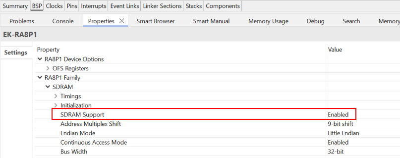
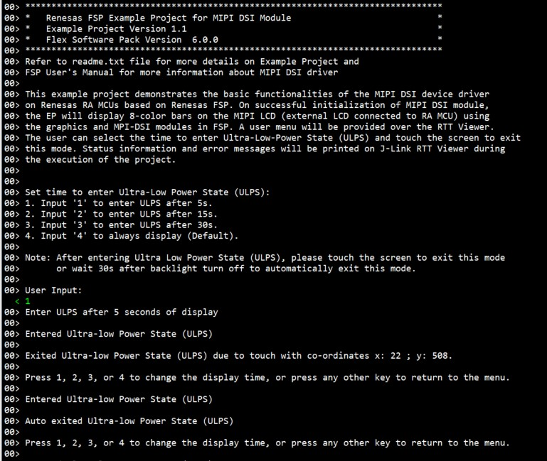
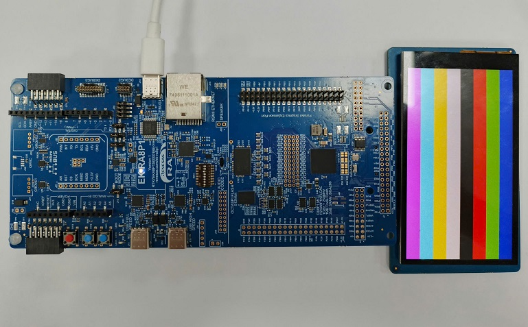

# Introduction #
This example project demonstrates the basic functionalities of the MIPI DSI device driver on Renesas RA MCUs based on Renesas FSP. On successful initialization of the MIPI DSI module, the EP will display 8-color bars on the MIPI LCD (external LCD connected to RA MCU) using the graphics and MPI-DSI modules in FSP. A user menu will be provided over the RTT Viewer. The user can select the time to enter Ultra-Low-Power State (ULPS) and touch the screen or wait 30s to exit this mode. Status information and error messages will be printed on J-link RTT Viewer during the execution of the project.

Please refer to the [Example Project Usage Guide](https://github.com/renesas/ra-fsp-examples/blob/master/example_projects/Example%20Project%20Usage%20Guide.pdf) for general information on example projects and [readme.txt](./readme.txt) for specifics of operation.

## Required Resources ##
To build and run the MIPI DSI example project, the following resources are needed.

### Software ###
* Renesas Flexible Software Package (FSP): Version 6.1.0
* E2 studio: Version 2025-07
* SEGGER J-Link RTT Viewer: Version 8.58
* LLVM Embedded Toolchain for ARM: Version 18.1.3

Refer to software requirements mentioned in [Example Project Usage Guide](https://github.com/renesas/ra-fsp-examples/blob/master/example_projects/Example%20Project%20Usage%20Guide.pdf)

### Hardware ###
Supported RA boards: EK-RA8D1, EK-RA8P1
* 1 x Renesas RA board.
* 1 x MIPI Graphics Expansion Board.
* 1 x Type-C USB cable

### Hardware Connections ###

* For EK-RA8D1:
    * Connect the USB Debug port on EK-RA8D1 to the PC using a micro USB cable.
    * Connect the MIPI Graphics Expansion Board to J58 of EK-RA8D1.
    * Set the configuration switches (SW1) on the EK-RA8D1 board as below:
        | SW1-1 PMOD1 | SW1-2 TRACE | SW1-3 CAMERA | SW1-4 ETHA | SW1-5 ETHB | SW1-6 GLCD | SW1-7 SDRAM | SW1-8 I3C |
        |:-------------:|:-------------:|:-------------:|:-------------:|:-------------:|:-------------:|:-------------:|:-------------:|
        |  OFF |  OFF | OFF | OFF | OFF | OFF | ON | OFF |

* For EK-RA8P1:
    * Connect the USB Debug port on EK-RA8P1 to the PC using a Type-C USB cable.
    * Connect the MIPI Graphics Expansion Board to J32 of EK-RA8P1.
    * Set the configuration switches (SW4) on the EK-RA8P1 board as below:
        | SW4-1 PMOD1_SEL0 |SW4-2 PMOD1_SEL1 | SW4-3 OSPI | SW4-4 ARDUINO | SW4-5 I3C | SW4-6 MIPI | SW4-7 USBFS_ROLE | SW4-8 USBHS_ROLE |
        |:-------------:|:-------------:|:-------------:|:-------------:|:-------------:|:-------------:|:-------------:|:-------------:|
        |  OFF |  OFF | OFF | OFF | OFF | ON | OFF | OFF |

## Related Collateral References ##
The following documents can be referred to for enhancing your understanding of the operation of this example project:
- [FSP User Manual on GitHub](https://renesas.github.io/fsp/)
- [FSP Known Issues](https://github.com/renesas/fsp/issues)

# Project Notes #

## System Level Block Diagram ##

## FSP Modules Used ##
List all the various modules that are used in this example project. Refer to the FSP User Manual for further details on each module listed below.

| Module Name | Usage  | Searchable Keyword (using New Stack > Search) |
|-------------|-----------------------------------------------|-----------------------------------------------|
| MIPI Display | MIPI DSI is used to get data from GLCDC and transmit it to MIPI PHY. | r_mipi_dsi |
| MIPI Physical Layer | MIPI PHY is used to send data to MIPI LCD. | r_mipi_phy |
| Graphics LCD | Graphics LCD is used to prepare data for MIPI LCD display. | r_glcdc |
| IIC Master | IIC Master is used to write and read data from a capacitive touch device. | r_iic_master |
| External IRQ | External IRQ is used to detect touch event. | r_icu |
| General PWM | GPT is used to generate display time. | r_gpt |

## Module Configuration Notes ##
This section describes FSP Configurator properties that are important or different from those selected by default. 

|   Module Property Path and Identifier   |   Default Value   |   Used Value   |   Reason   |
| :-------------------------------------: | :---------------: | :------------: | :--------: |
| configuration.xml > Stacks > g_display Graphics LCD (r_glcdc) > Properties > Settings > Property > Module g_display Graphics LCD (r_glcdc) > Interrupts  > Callback Function | NULL | glcdc_callback | Define user callback function. |
| configuration.xml > Stacks > g_display Graphics LCD (r_glcdc) > Properties > Settings > Property > Module g_display Graphics LCD (r_glcdc) > Input > Graphics Layer 1 > General > Color format | RGB565 (16 bit) | RGB888 (32-bit) | Select Color format. |
| configuration.xml >  Stacks > g_mipi_dsi0 MIPI Display (r_mipi_dsi) > Properties > Settings > Property > Module g_mipi_dsi0 MIPI Display (r_mipi_dsi) > Interrupts > Physical Lane Interrupt Enable > Data Lane ULPS Enter | ☐ | ☑ |To enable interrupt when Data Lane enters ULPS. |
| configuration.xml >  Stacks > g_mipi_dsi0 MIPI Display (r_mipi_dsi) > Properties > Settings > Property > Module g_mipi_dsi0 MIPI Display (r_mipi_dsi) > Interrupts > Physical Lane Interrupt Enable > Data Lane ULPS Exit | ☐ | ☑  |To enable interrupt when Data Lane exits ULPS. |
| configuration.xml > Stacks > g_external_irq External IRQ (r_icu) > Properties > Settings > Property > Module g_external_irq External IRQ (r_icu) > Channel | 0 | 19 | To select interrupt pin (P111). |
| configuration.xml > Stacks > g_external_irq External IRQ (r_icu) > Properties > Settings > Property > Module g_external_irq External IRQ (r_icu) > Callback | NULL | external_irq_callback | To assign callback function for the External IRQ event. |
| configuration.xml > Stacks > g_i2c_master I2C Master (r_iic_master) > Properties > Settings > Property > Module g_i2c_master I2C Master (r_iic_master) > Channel | 0 | 1 | To select the SDA pin (P511) and the SCL pin (P512). |
| configuration.xml > Stacks > g_i2c_master I2C Master (r_iic_master) > Properties > Settings > Property > Module g_i2c_master I2C Master (r_iic_master) > Slave Address | 0x00 | 0x14 | Set slave device address (gt911). |
| configuration.xml > Stacks > g_i2c_master I2C Master (r_iic_master) > Properties > Settings > Property > Module g_i2c_master I2C Master (r_iic_master) > Callback | NULL | i2c_master_callback | To assign callback function for the I2C Master event. |
| configuration.xml > Stacks > g_timer0 Timer, General PWM (r_gpt) > Properties > Settings > Property > Module g_timer0 Timer, General PWM (r_gpt) > Interrupts > Callback | NULL | gpt_callback | To assign callback function for the GPT event. |
| configuration.xml > Stacks > g_timer0 Timer, General PWM (r_gpt) > Properties > Settings > Property > Module g_timer0 Timer, General PWM (r_gpt) > Interrupts > Overflow/Crest Interrupt Priority | Disable | Priority 1 |To assign interrupt priority for the GPT event. |

**SDRAM setups in BSP Configuration**
|   Module Property Path and Identifier   |   Default Value   |   Used Value   |   Reason   |
|-----------------------------------------|-------------------|----------------|------------|
| configuration.xml > BSP > Properties > Settings > Property > RA8P1 Family > SDRAM > SDRAM Support | Disabled | Enabled | Initialize SDRAM. |

## API Usage ##

The table below lists all the APIs used at the application layer by this example project.

| API Name    | Usage                                                                          |
|-------------|--------------------------------------------------------------------------------|
| R_MIPI_DSI_Open | This API is used to initialize the MIPI DSI module. |
| R_MIPI_DSI_Start | This API is used to start video output. |
| R_MIPI_DSI_Command | This API is used to send a command to the peripheral device. |
| R_MIPI_DSI_UlpsEnter | This API is used to enter Ultra-low Power State (ULPS). |
| R_MIPI_DSI_UlpsExit | This API is used to exit Ultra-low Power State (ULPS). |
| R_MIPI_DSI_Close | This API is used to de-initialize and close the MIPI DSI module. |
| R_GLCDC_BufferChange | This API is used to change the framebuffer pointer. |
| R_GLCDC_Close | This API is used to de-initialize and close the glcdc module. |
| R_GPT_Open | This API is used to initialize the GPT module. |
| R_GPT_Start | This API is used to start timer. |
| R_GPT_InfoGet | This API is used to get timer information. |
| R_GPT_PeriodSet | This API is used to set period value provided. |
| R_GPT_Reset | This API is used to reset the counter value to 0. |
| R_GPT_Stop | This API is used to stop timer. |
| R_GPT_Close | This API is used to de-initialize and close the GLCDC module. |
| R_IIC_MASTER_Open | This API is used to initialize the IIC Master module. |
| R_IIC_MASTER_Write | This API is used to perform a write to the I2C device. |
| R_IIC_MASTER_Read | This API is used to perform a read to the I2C device. |
| R_IIC_MASTER_Close | This API is used to de-initialize and close the IIC Master module. |
| R_ICU_ExternalIrqOpen | This API is used to initialize the ICU module. |
| R_ICU_ExternalIrqEnable | This API is used to enable external interrupt. |
| R_ICU_ExternalIrqClose | This API is used to de-initialize and close the ICU module. |

## Callback Function Usage ##

The table below lists the Callback function used at the application layer by this example project.

| Callback Name | Usage                                                                          |
|-------------|--------------------------------------------------------------------------------|
| glcdc_callback | Callback functions for GLCDC interrupts. |
| mipi_dsi_callback | Callback functions for MIPI DSI interrupts. |
| i2c_master_callback | Callback functions for IIC Master interrupts. |
| gpt_callback | Callback functions for GPT interrupts. |
| external_irq_callback | Callback functions for ICU interrupts. |

## Verifying Operation ##
Import, Build and Debug the EP (see section Starting Development of **FSP User Manual**). After running the EP, open the RTT Viewer to view status or check any error messages.

Project information printed on the RTT Viewer:

The color bars are displayed on the MIPI LCD screen:

