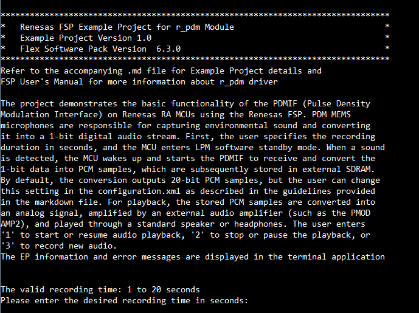
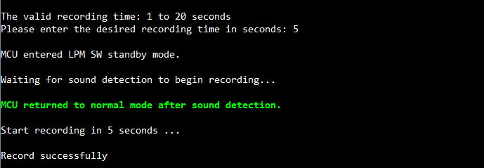
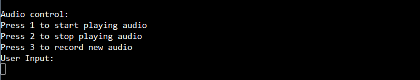
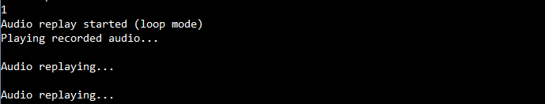
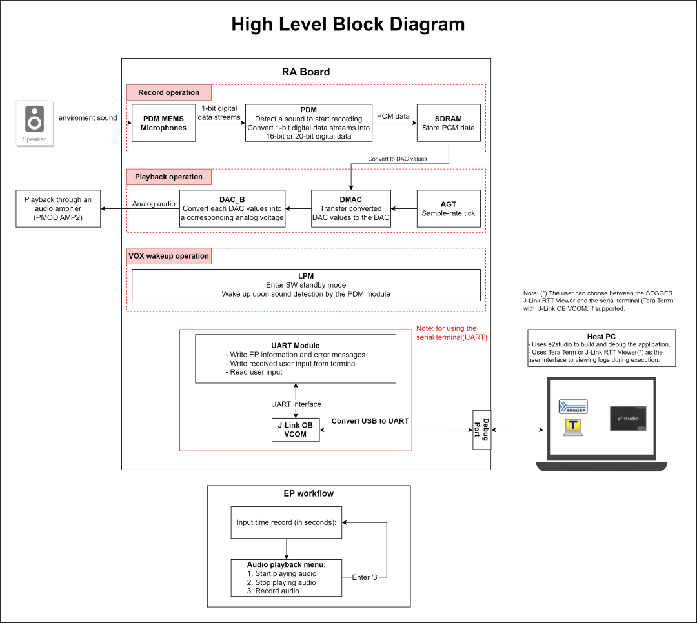
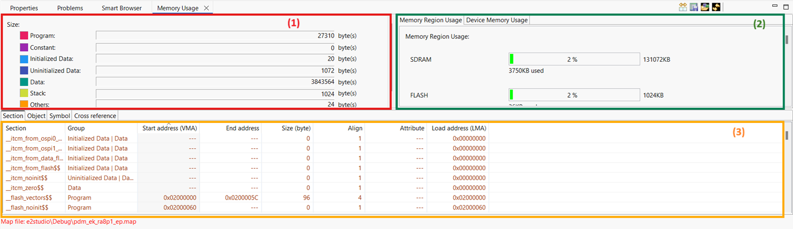
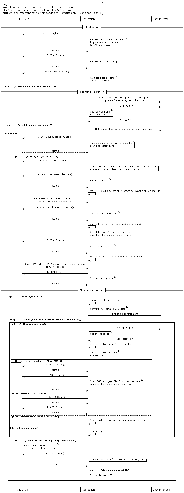

# PDM Example on RA Boards

## Table of Contents
1. [Introduction](#introduction)
2. [Required Resources](#required-resources)
    1. [Hardware Requirements](#hardware-requirements)
        1. [Required Boards](#required-boards)
        2. [Supported Boards](#supported-boards)
        3. [Additional Hardware](#additional-hardware)
        4. [Hardware Connections](#hardware-connections)
    2. [Software Requirements](#software-requirements)
3. [Verifying the application](#verifying-the-application)
4. [Project Notes](#project-notes)
    1. [System Level Block Diagram](#system-level-block-diagram)
    2. [FSP Modules Used](#FSP-Modules-Used)
    3. [Module Configuration Notes:](#module-configuration-notes)
    4. [API Usage](#api-usage)
    5. [Memory Usage](#memory-usage)
    6. [Clock Configuration](#clock-configuration)
    7. [Application Execution Flow](#application-execution-flow)
    8. [Troubleshooting Tips](#troubleshooting-tips)
    9. [Known Limitations](#known-limitations)
5. [Special Topics](#special-topics)
6. [Conclusion and Next Steps](#conclusion-and-next-steps)
7. [References](#references)
8. [Notice](#notice)

# Introduction
The project demonstrates the basic functionality of the PDMIF (Pulse Density Modulation Interface) on Renesas RA MCUs using the Renesas FSP. PDM MEMS microphones are responsible for capturing environmental sound and converting it into a 1-bit digital audio stream. First, the user specifies the recording duration in seconds, and the MCU enters LPM software standby mode. When sound is detected, the MCU wakes up and starts the PDMIF to receive and convert the 1-bit data into PCM samples, which are then stored in external SDRAM. By default, the conversion outputs 20‑bit PCM samples, but the user can change this setting in the configuration.xml as described in the guidelines provided in the markdown file. For playback, the stored PCM samples are converted into an analog signal, amplified by an external audio amplifier (such as the PMOD AMP2), and played through a standard speaker or headphones. The user enters '1' to start or resume audio playback, '2' to stop or pause the playback, or '3' to record new audio.

The EP information and error messages are displayed in the terminal application.

The User can select between the SEGGER J-Link RTT viewer and the serial terminal (UART) with J-Link OB VCOM for the terminal application. Note that the EP supports the Serial terminal by default.

Notes:
* For the RA boards support J-Link OB VCOM, the EP uses the Serial Terminal by default.
    * The board supports J-Link OB VCOM: EK-RA8P1.
* For RA boards that do not support J-Link OB VCOM,  EP information is communicated to the user via host PC exclusively through the SEGGER J-Link RTT Viewer instead.

Please refer to the [Example Project Usage Guide](https://github.com/renesas/ra-fsp-examples/blob/master/example_projects/Example%20Project%20Usage%20Guide.pdf) 

# Required Resources
To build and run the PDM example project, the following resources are needed.

## Hardware Requirements

### Required Boards 

* 1 x RA board

### Supported Boards 

* EK-RA8P1

### Additional Hardware 

* 1 x Type-C USB cable for programming and debugging
* 1 x Breadboard
* 1 x Digital pmod AMP2 
  * Link: [Pmod AMP2: Audio Amplifier - Digilent](https://digilent.com/shop/pmod-amp2-audio-amplifier/)
* 1 x Wired headsets or speaker with 3.5mm jack
* 5 x Jumper wires
  * 2 x Male to male
  * 3 x Male to female
* 1 x 20K ohm resistor

## Hardware Connections

* Connect the USB Debug port on RA Board to the PC using a Type-C USB cable.
* Connect the RA Board to PMOD AMP2:

  | RA Board                    | PMOD AMP2           |
  |-----------------------------|---------------------|
  | DAC output pin              | AIN (Pin 1)         |
  | GND                         | GAIN (Pin 2)        |
  | -                           | Not connect (Pin 3) |
  | VCC (via 20K ohm resistor)  | ~SHUTDOWN (Pin 4)   |
  | GND                         | GND (Pin 5)         |
  | VCC                         | VCC (Pin 6)         |

* EK-RA8P1:
  * DAC output pin: DA0 P014 (J2:04)

## Software Requirements
* Renesas Flexible Software Package (FSP): Version 6.3.0
* e2 studio: Version 2025-12
* SEGGER J-Link RTT Viewer: Version 8.92
* Terminal Console Application: Tera Term version 4.99
* LLVM Embedded Toolchain for ARM: Version 21.1.1

# Verifying Operation

1. Import the example project.
2. Generate, and build the example project.
3. Before running the example project, make sure hardware connections are completed.
4. Connect the RA MCU debug port to the host PC.
5. Open the terminal application on the host PC and connect to the RA board.
6. Debug or flash the example project to the RA board to view output log.

Note:
* For the Serial Terminal application: The macro USE_VIRTUAL_COM is set to 1.
    1. To echo back typed content in Tera Term, go to [Setup] -> [Terminal...] and check [Local echo].
    2. The configuration parameters of the serial port are:
        - COM port: Provided by the J-Link on-board
        - Baud rate: 115200 bps
        - Data length: 8 bits
        - Parity: None
        - Stop bit: 1 bit
        - Flow control: None

* Below images show terminal appication operation.
  * EP Information:

    

  * Desired the recorded time:

    

  * Record audio with VOX wakeup operation, the EP enables VOX wakeup operation by default:

    

* The EP performs audio playback control by default, but this can be ignored if the user disables the sound output option.

  * Audio control menu:

    

  * Start playing audio option:

    

  * Stop playing audio option:

    
  
  * Record new audio option:

    

* Disable VOX wakeup operation: This image shows the audio recording time without VOX wakeup operation.

  * Record audio without VOX wakeup operation:

    

# Project Notes

This section provides a system-level block diagram of the PDM EP that visually represents the overall architecture, highlighting how different modules interact and how data flows through the system. 
It shows FSP modules PDM, DMAC, AGT, DAC, LPM, which are essential for the application's functionality. Module configuration details are generally covered in the FSP User Manual (UM), 
with additional notes provided only when specific configurations deviate from the standard setup and require user attention. API usage is documented with references to the FSP UM, and
the actual implementation of these APIs is illustrated in the application flow diagram.

Memory usage is outlined, including RAM and Flash consumption, along with the initial FSP version used during the release of the example project, categorized by MCU group and compiler. 
Lastly, any non-default clock configurations and special considerations for clock setup are clearly documented to ensure proper system operation.

## System Level Block Diagram
High level block diagram of the system is as shown below:
 

## FSP Modules Used
List all the various modules that are used in this example project. Refer to the FSP User Manual for further details on each module listed below.

| Module Name | Usage | Searchable Keyword  |
|-------------|-----------------------------------------------|-----------------------------------------------|
| PDM | PDM is used to record the audio, and wakeup MCU from LPM SW standby mode | r_pdm |
| Transfer | DMAC is used to transfer data from SDRAM to DAC register | r_dmac |
| Timer, Low-Power  | AGT is used to trigger data transfers at a sample rate that matches the recording frequency | r_agt |
| DAC | DAC is used to an analog output signal on the specified pin | r_dac_b |
| Low Power Modes | LPM is used to enter LPM SW standby mode | r_lpm |

## Module Configuration Notes
This section describes FSP Configurator properties which are important or different than those selected by default. 

**Configuration Properties for PDM instance**

|   Module Property Path and Identifier   |   Default Value   |   Used Value   |   Reason   |
|-----------------------------------------|-------------------|----------------|------------|
| configuration.xml > g_pdm0 PDM (r_pdm) > Properties > Settings > Property > Module g_pdm0 PDM (r_pdm) > Output > Bit Format | 20 Bits mode {1 Sign bit  and [18:0] bits of the buffer} | 20 Bits mode {1 Sign bit  and [18:0] bits of the buffer} | Use 20 bits mode output. Refer [Note #4 in Special Topics](#4-select-between-16-bit-and-20-bit-pdm-bit-formats-output-notes) to change to other bit formats. |
| configuration.xml > g_pdm0 PDM (r_pdm) > Properties > Settings > Property > Module g_pdm0 PDM (r_pdm) > Output > Target Sampling Frequency (Hz) | 32000 | 32000 | Use 32KHz as target samplng output. |
| configuration.xml > g_pdm0 PDM (r_pdm) > Properties > Settings > Property > Module g_pdm0 PDM (r_pdm) > Data Reception > Buffer Overwrite Detection Enable | Enabled | Enabled | Enable Buffer Overwrite Detection. |
| configuration.xml > g_pdm0 PDM (r_pdm) > Properties > Settings > Property > Module g_pdm0 PDM (r_pdm) > Interrupt > Callback | NULL | pdm_callback | It is called from the interrupt service routine (ISR) upon PDM events. |
| configuration.xml > g_pdm0 PDM (r_pdm) > Properties > Settings > Property > Module g_pdm0 PDM (r_pdm) > Interrupt > Sound Detection Interrupt Priority | Disabled | Priority 12 | Specify the Sound Detection Interrupt Priority. |
| configuration.xml > g_pdm0 PDM (r_pdm) > Properties > Settings > Property > Module g_pdm0 PDM (r_pdm) > Interrupt > Data Reception Interrupt Priority | Disabled | Priority 12 | Specify the Data Reception Interrupt Priority. |
| configuration.xml > g_pdm0 PDM (r_pdm) > Properties > Settings > Property > Module g_pdm0 PDM (r_pdm) > Interrupt > Error Detection Interrupt Priority | Disabled | Priority 12 | Specify the Error Detection Interrupt Priority. |
| configuration.xml > g_pdm0 PDM (r_pdm) > Properties > Settings > Property > Module g_pdm0 PDM (r_pdm) > Channel | 0 | 2 | Use PDM Channel 2. |
| configuration.xml > g_pdm0 PDM (r_pdm) > Properties > Settings > Property > Module g_pdm0 PDM (r_pdm) > Short Circuit Detection > Short Circuit Detection Enable | Disabled | Enabled | Enable the short circuit detection. |
| configuration.xml > g_pdm0 PDM (r_pdm) > Properties > Settings > Property > Module g_pdm0 PDM (r_pdm) > Short Circuit Detection > Short Circuit Detection High Continuous Detection Count | 0 | 0x1FFF | The error interrupt will be raised when the number of consecutive 1s exceeds this value. |
| configuration.xml > g_pdm0 PDM (r_pdm) > Properties > Settings > Property > Module g_pdm0 PDM (r_pdm) > Short Circuit Detection > Short Circuit Detection Low Continuous Detection Count | 0 | 0x1FFF | The error interrupt will be raised when the number of consecutive 0s exceeds this value. |
| configuration.xml > g_pdm0 PDM (r_pdm) > Properties > Settings > Property > Module g_pdm0 PDM (r_pdm) > Overvoltage Detection > Overvoltage Detection Lower Limit Enable | Disabled | Enabled | Enable the overvoltage detection lower limit. |
| configuration.xml > g_pdm0 PDM (r_pdm) > Properties > Settings > Property > Module g_pdm0 PDM (r_pdm) > Overvoltage Detection > Overvoltage Detection Lower Limit | 0 | 0x85EE0 | The error interrupt will be raised when the overvoltage detection lower limit value is small than -500000. Refer [Note #6 in Special Topics](#6-adjust-the-overvoltage-detection-range-notes) to change to other values. |
| configuration.xml > g_pdm0 PDM (r_pdm) > Properties > Settings > Property > Module g_pdm0 PDM (r_pdm) > Overvoltage Detection > Overvoltage Detection Upper Limit Enable | Disabled | Enabled | Enable the overvoltage detection upper limit. |
| configuration.xml > g_pdm0 PDM (r_pdm) > Properties > Settings > Property > Module g_pdm0 PDM (r_pdm) > Overvoltage Detection > Overvoltage Detection Upper Limit | 0 | 0x7A120 | The error interrupt will be raised when the overvoltage detection upper limit value is larger than 500000. Refer [Note #6 in Special Topics](#6-adjust-the-overvoltage-detection-range-notes) to change to other values. |

**Configuration Properties for DAC instance**

|   Module Property Path and Identifier   |   Default Value   |   Used Value   |   Reason   |
|-----------------------------------------|-------------------|----------------|------------|
| configuration.xml > g_dac_b0 DAC (r_dac_b) > Properties > Settings > Property > Module g_dac_b0 DAC (r_dac_b) > Data Format | Right Justified | Right Justified | Specify the DAC data format. |

**Configuration Properties for DMAC instance**

|   Module Property Path and Identifier   |   Default Value   |   Used Value   |   Reason   |
|-----------------------------------------|-------------------|----------------|------------|
| configuration.xml > g_transfer0 Transfer (r_dmac) > Properties > Settings > Property > Module g_transfer0 Transfer (r_dmac) > Mode | Normal | Normal | Specify the DMAC transfer mode. |
| configuration.xml > g_transfer0 Transfer (r_dmac) > Properties > Settings > Property > Module g_transfer0 Transfer (r_dmac) > Transfer Size | 2 Bytes | 2 Bytes | Set the transfer size to 2 bytes to send one DAC sample per activation. |
| configuration.xml > g_transfer0 Transfer (r_dmac) > Properties > Settings > Property > Module g_transfer0 Transfer (r_dmac) > Number of transfer | 1 | 1 | Specify the number of transfer to 1, the transfer will be controlled by software |
| configuration.xml > g_transfer0 Transfer (r_dmac) > Properties > Settings > Property > Module g_transfer0 Transfer (r_dmac) > Activation Source | No ELC Trigger | AGT0 INT (AGT interrupt) | Configure AGT0 INT as activation source. |
| configuration.xml > g_transfer0 Transfer (r_dmac) > Properties > Settings > Property > Module g_transfer0 Transfer (r_dmac) > Callback | NULL | transfer_callback | It is called from the interrupt service routine (ISR) upon all transfers have completed. |
| configuration.xml > g_transfer0 Transfer (r_dmac) > Properties > Settings > Property > Module g_transfer0 Transfer (r_dmac) > Transfer End Interrupt Priority | Disabled | Priority 12 | Specify the Transfer End Interrupt Priority. |
| configuration.xml > g_transfer0 Transfer (r_dmac) > Properties > Settings > Property > Module g_transfer0 Transfer (r_dmac) > Interrupt Frequency | Interrupt after all transfers have completed| Interrupt after all transfers have completed | Select to have interrupt after last transfer has completed. |

**Configuration Properties for AGT instance**

|   Module Property Path and Identifier   |   Default Value   |   Used Value   |   Reason   |
|-----------------------------------------|-------------------|----------------|------------|
| configuration.xml > g_timer0 Timer, Low-Power (r_agt) > Properties > Settings > Property > Module g_timer0 Timer, Low-Power (r_agt) > General > Mode | Periodic | Periodic | Set the timer mode to Periodic. |
| configuration.xml > g_timer0 Timer, Low-Power (r_agt) > Properties > Settings > Property > Module g_timer0 Timer, Low-Power (r_agt) > General > Period Unit | Raw counts | Hertz | Set the timer period unit to hertz. |
| configuration.xml > g_timer0 Timer, Low-Power (r_agt) > Properties > Settings > Property > Module g_timer0 Timer, Low-Power (r_agt) > General > Period | 32000 | 32000 | Set the timer period to 32000 Hertz to match with the recorded audio frequency. |
| configuration.xml > g_timer0 Timer, Low-Power (r_agt) > Properties > Settings > Property > Module g_timer0 Timer, Low-Power (r_agt) > General > Count Source | PCLKB | PCLKB | Set the timer count source to PCLKB. |

**Configuration Properties for SW Standby mode LPM instance**
|   Module Property Path and Identifier   |   Default Value   |   Used Value   |   Reason   |
|-----------------------------------------|-------------------|----------------|------------|
| configuration.xml > Stacks > g_lpm_sw_standby Low Power Modes (r_lpm) > Properties > Settings > Property > Module g_lpm_sw_standby Low Power Modes (r_lpm) > General > Low Power Mode | Sleep mode | Software Standby mode | Select Software Standby mode for this LPM instance. |
| configuration.xml > Stacks > g_lpm_sw_standby Low Power Modes (r_lpm) > Properties > Settings > Property > Module g_lpm_sw_standby Low Power Modes (r_lpm) > General > Output port state in standby and deep standby | No change | No change | Retained state of the output pins after entering SW Standby mode. |
| configuration.xml > Stacks > g_lpm_sw_standby Low Power Modes (r_lpm) > Properties > Settings > Property > Module g_lpm_sw_standby Low Power Modes (r_lpm) > Deep Sleep and Standby Options > Wake Sources > PDM Sound Detection | ☐ | ☑ | Select PDM Sound Detection as the source to cancel SW Standby mode. |
| configuration.xml > Stacks > g_lpm_sw_standby Low Power Modes (r_lpm) > Properties > Settings > Property > Module g_lpm_sw_standby Low Power Modes (r_lpm) > RAM Retention Control (Not available on every MCU) > RAM retention in Standby mode > Supply power to RAM Region 0 [0x22000000, 0x2201FFFF] | ☐ | ☑  | Retained this memory region in SW Standby mode. |
| configuration.xml > Stacks > g_lpm_sw_standby Low Power Modes (r_lpm) > Properties > Settings > Property > Module g_lpm_sw_standby Low Power Modes (r_lpm) > RAM Retention Control (Not available on every MCU) > RAM retention in Standby mode > Supply power to RAM Region 1 [0x22020000, 0x2203FFFF] | ☐ | ☑  | Retained this memory region in SW Standby mode. |
| configuration.xml > Stacks > g_lpm_sw_standby Low Power Modes (r_lpm) > Properties > Settings > Property > Module g_lpm_sw_standby Low Power Modes (r_lpm) > RAM Retention Control (Not available on every MCU) > RAM retention in Standby mode > Supply power to RAM Region 2 [0x22040000, 0x2205FFFF] | ☐ | ☑  | Retained this memory region in SW Standby mode. |
| configuration.xml > Stacks > g_lpm_sw_standby Low Power Modes (r_lpm) > Properties > Settings > Property > Module g_lpm_sw_standby Low Power Modes (r_lpm) > RAM Retention Control (Not available on every MCU) > RAM retention in Standby mode > Supply power to RAM Region 3 [0x22060000, 0x2207FFFF] | ☐ | ☑  | Retained this memory region in SW Standby mode. |
| configuration.xml > Stacks > g_lpm_sw_standby Low Power Modes (r_lpm) > Properties > Settings > Property > Module g_lpm_sw_standby Low Power Modes (r_lpm) > RAM Retention Control (Not available on every MCU) > RAM retention in Standby mode > Supply power to RAM Region 4 [0x22080000, 0x2209FFFF] | ☐ | ☑  | Retained this memory region in SW Standby mode. |
| configuration.xml > Stacks > g_lpm_sw_standby Low Power Modes (r_lpm) > Properties > Settings > Property > Module g_lpm_sw_standby Low Power Modes (r_lpm) > RAM Retention Control (Not available on every MCU) > RAM retention in Standby mode > Supply power to RAM Region 5 [0x220A0000, 0x220BFFFF] | ☐ | ☑  | Retained this memory region in SW Standby mode. |
| configuration.xml > Stacks > g_lpm_sw_standby Low Power Modes (r_lpm) > Properties > Settings > Property > Module g_lpm_sw_standby Low Power Modes (r_lpm) > RAM Retention Control (Not available on every MCU) > RAM retention in Standby mode > Supply power to RAM Region 6 [0x220C0000, 0x220DFFFF] | ☐ | ☑  | Retained this memory region in SW Standby mode. |
| configuration.xml > Stacks > g_lpm_sw_standby Low Power Modes (r_lpm) > Properties > Settings > Property > Module g_lpm_sw_standby Low Power Modes (r_lpm) > RAM Retention Control (Not available on every MCU) > RAM retention in Standby mode > Supply power to RAM Region 7 [0x220E0000, 0x220FFFFF] | ☐ | ☑  | Retained this memory region in SW Standby mode. |
| configuration.xml > Stacks > g_lpm_sw_standby Low Power Modes (r_lpm) > Properties > Settings > Property > Module g_lpm_sw_standby Low Power Modes (r_lpm) > RAM Retention Control (Not available on every MCU) > RAM retention in Standby mode > Supply power to RAM Region 8 [0x22100000, 0x221FFFFF] | ☐ | ☑  | Retained this memory region in SW Standby mode. |
| configuration.xml > Stacks > g_lpm_sw_standby Low Power Modes (r_lpm) > Properties > Settings > Property > Module g_lpm_sw_standby Low Power Modes (r_lpm) > RAM Retention Control (Not available on every MCU) > RAM retention in Standby mode > Supply power to RAM Region 9 [0x22120000, 0x2213FFFF] | ☐ | ☑  | Retained this memory region in SW Standby mode. |
| configuration.xml > Stacks > g_lpm_sw_standby Low Power Modes (r_lpm) > Properties > Settings > Property > Module g_lpm_sw_standby Low Power Modes (r_lpm) > RAM Retention Control (Not available on every MCU) > RAM retention in Standby mode > Supply power to RAM Region 10 [0x22140000, 0x2215FFFF] | ☐ | ☑  | Retained this memory region in SW Standby mode. |
| configuration.xml > Stacks > g_lpm_sw_standby Low Power Modes (r_lpm) > Properties > Settings > Property > Module g_lpm_sw_standby Low Power Modes (r_lpm) > RAM Retention Control (Not available on every MCU) > RAM retention in Standby mode > Supply power to RAM Region 11 [0x22160000, 0x2217FFFF] | ☐ | ☑  | Retained this memory region in SW Standby mode. |
| configuration.xml > Stacks > g_lpm_sw_standby Low Power Modes (r_lpm) > Properties > Settings > Property > Module g_lpm_sw_standby Low Power Modes (r_lpm) > RAM Retention Control (Not available on every MCU) > RAM retention in Standby mode > Supply power to RAM Region 12 [0x22180000, 0x2219FFFF] | ☐ | ☑  | Retained this memory region in SW Standby mode. |
| configuration.xml > Stacks > g_lpm_sw_standby Low Power Modes (r_lpm) > Properties > Settings > Property > Module g_lpm_sw_standby Low Power Modes (r_lpm) > RAM Retention Control (Not available on every MCU) > TCM retention in Deep Sleep and Standby modes | Supply power to TCM | Supply power to TCM  | Retained TCM in SW Standby mode. |

**SDRAM setups in BSP Configuration**
|   Module Property Path and Identifier   |   Default Value   |   Used Value   |   Reason   |
|-----------------------------------------|-------------------|----------------|------------|
| configuration.xml > BSP > Properties > Settings > Property > RA8P1 Family > SDRAM > SDRAM Support | Disabled | Enabled | Initialize SDRAM. |

**Enable Data cache in BSP Configuration**
|   Module Property Path and Identifier   |   Default Value   |   Used Value   |   Reason   |
|-----------------------------------------|-------------------|----------------|------------|
| configuration.xml > BSP > Properties > Settings > Property > RA8P1 Family > Cache setting > Data cache | Disabled | Enabled | Enable Data cache to improve performance. |
| configuration.xml > BSP > Properties > Settings > Property > RA8P1 Family > Cache setting > Data cache forced write-through | Disabled | Enabled | Force D-Cache to use write-through for all cacheable writes. |

**Configuration Properties for the Serial Terminal (UART instance)**   
|   Configure interrupt event path   |   Default Value   |   Used Value   |   Reason   |
|-----------------------------------------|-------------------|----------------|------------|
| configuration.xml > Interrupts > Interrupts Configuration > New User Event > SCI > SCI8 > SCI8 RXI (Receive data full) | empty | sci_b_uart_rxi_isr | Assign the UART receive ISR (Receive data full) to the interrupt vector table. |
| configuration.xml > Interrupts > Interrupts Configuration > New User Event > SCI > SCI8 > SCI8 TXI (Transmit data empty) | empty | sci_b_uart_txi_isr | Assign the UART transfer ISR (Transmit data empty) to the interrupt vector table. |
| configuration.xml > Interrupts > Interrupts Configuration > New User Event > SCI > SCI8 > SCI8 TEI (Transmit end) | empty | sci_b_uart_tei_isr | Assign the UART transfer ISR (Transmit end) to the interrupt vector table. |
| configuration.xml > Interrupts > Interrupts Configuration > New User Event > SCI > SCI8 > SCI8 ERI (Receive error) | empty | sci_b_uart_eri_isr | Assign the UART receive ISR (Receive error) to the interrupt vector table. |

## API Usage
The links below list the FSP provided API used at the application layer by this example project.
- [PDM APIs on GitHub IO](https://renesas.github.io/fsp/group___p_d_m.html)
- [DMAC APIs on GitHub IO](https://renesas.github.io/fsp/group___d_m_a_c.html)
- [AGT APIs on GitHub IO](https://renesas.github.io/fsp/group___a_g_t.html)
- [DAC_B APIs on GitHub IO](https://renesas.github.io/fsp/group___d_a_c___b.html)
- [LPM APIs on GitHub IO](https://renesas.github.io/fsp/group___l_p_m.html)
- [BSP SDRAM APIs on GitHub IO](https://renesas.github.io/fsp/group___b_s_p___s_d_r_a_m.html)

## Memory Usage

**Memory Usage of this Example Project in Bytes**

This section outlines the code and data memory consumption in the example project, encompassing both the HAL driver and application code. It provides an estimate of the memory requirements for the module and the application.

|   Compiler                              |   text	        |   data         |   .bss           |
| :-------------------------------------: | :-------------: | :------------: | :--------------: |
|   LLVM                                  |   29022 Bytes   |   20 Bytes     |    3843556 Bytes |

**Memory Analysis and Detailed View**

For comprehensive memory analysis, use the **Memory Usage View** feature in e² studio. This debugging tool analyzes the project's `*.map` or `*.lbp` files to provide detailed insights into total memory consumption, ROM/RAM utilization, and section-level information regarding objects and symbols.

**To Access the Memory Usage View:**

1. Build the project to generate the link map file (*.map).
2. Navigate to **Window** → **Show View** → **Other…** → **C/C++** → **Memory Usage**.

**Note:**
- (1): Group size region
- (2): RAM/ROM usage region shows percentage of RAM/ROM usage 
- (3): Detail table region

## Clock configuration
|   Configure Clock path   |   Default Value   |   Used Value   |   Reason   |
|-----------------------------------------|-------------------|----------------|------------|
| configuration.xml > Clocks > Clocks Configuration > SCICLK Src | SCICLK Disable | SCICLK Src:PLL2R | Enable operating clock for SCI module by PLL2R clock source. |
| configuration.xml > Clocks > Clocks Configuration > SCICLK Div | SCICLK Div/4 | SCICLK Div/4 | Divider for SCICLK is 4. |

# Application Execution Flow
Sequence Diagram of the EP is as shown below:
 

## Troubleshooting Tips 

No troubleshooting tips are seen in this EP

## Known Limitations

No known limitations are seen in this EP

# Special Topics #

## 1. Terminal notes
By default, the EP supports Serial terminal for RA boards that support J-link OB VCOM:
* Define USE_VIRTUAL_COM = 1 macro in Project Properties -> C/C++ Build -> Settings -> Tool Settings -> Compiler -> Includes -> Macro Defines (-D)

To use SEGGER J-Link RTT Viewer, please follow the instructions below:
* Define USE_VIRTUAL_COM = 0 macro in Project Properties -> C/C++ Build -> Settings -> Tool Settings -> Compiler -> Includes -> Macro Defines (-D)

## 2. VOX wakeup notes
The VOX wakeup feature is enabled by default. To disable it, set the ENABLE_VOX_WAKEUP macro to 0 in the pdm_ep.h file.
The sound detection interrupt can wake up MCU to normal mode from the below LPM modes:
* Sleep mode.
* Deep sleep mode.
* Software standby mode.

Note: the connected microphones do not go to LPM in this example project, and impossible to enter because the MCU needs to receive signal continuously to detect a large amplitude sound level.

## 3. Sound output notes
In this example project, the audio captured from the microphones can be played back through a speaker or headset. By default, playback is enabled so the user can select start playing audio option to hear the recorded sound.

If audio playback is not needed, the user can disable it by setting the ENABLE_PLAYBACK macro to 0 in the pdm_ep.h file.

## 4. Select between 16-bit and 20-bit PDM bit formats output notes
This EP supports both 16-bit and 20-bit PDM bit formats output.

The user can change the PDM bit format output by modify the configuration of g_pdm0 PDM (r_pdm) instance in the configuration.xml.

Go to **configuration.xml > g_pdm0 PDM (r_pdm) > Properties > Settings > Property > Module g_pdm0 PDM (r_pdm) > Output > Bit Format**, and then select the specific bit format output.

## 5. Change the volume for the playback audio notes
In audio_playback_dac.h file, the user can change the value of the PLAYBACK_VOLUME_PERCENT macro to adjust the volume.

## 6. Adjust the overvoltage detection range notes
The sound data is clipped as signed 20-bit (-524,288 to +524,287), but the Overvoltage Upper Threshold Register and Overvoltage Lower Threshold Register limit use unsigned 20-bit values (0 to 1,048,575).  

To configure the r_pdm instance correctly, convert the signed input to its two’s complement representation:

* If the desired overvoltage value is **positive or zero**:  
  The register value is the same as the signed value.

* If the desired overvoltage value is **negative**:  
  The register value = Signed + 1,048,576  

  Note: 1,048,576 = 2^20

### Examples:
* Signed = -1 → Register Value = -1 + 1,048,576 = 1,048,575 → Hex = 0xFFFFF
* Signed = -500,000 → Register Value = -500,000 + 1,048,576 = 548,576 → Hex = 0x85EE0
* Signed = 500,000 → Register Value = 500,000 → Hex = 0x7A120

# Conclusion and Next Steps

This example project offers hands-on experience with audio capture using the PDMIF on Renesas RA MCUs. It demonstrates VOX (Voice Operated Exchange) wake-up triggered by sound detection and guides users through playback of recorded audio using the DAC module, supported by DMAC and AGT modules for efficient data transfer and timing control.

To further explore PDM implementation on Renesas RA MCUs:
- Review the project source code located in the `src` directory.
- Refer to the HAL driver and its documentation in the FSP User Manual for deeper technical insights.
- Visit renesas.com for additional PDM resources, application notes, and documentation related to RA devices. 

# References

The following documents can be referred to for enhancing your understanding of 
the operation of this example project:
- [FSP User Manual on GitHub](https://renesas.github.io/fsp/)
- [FSP Known Issues](https://github.com/renesas/fsp/issues)
- [RA8P1 - (1GHz Arm Cortex-M85 and Ethos-U55 NPU Based AI Microcontroller)](https://www.renesas.com/en/products/ra8p1)

# Notice

1. Descriptions of circuits, software and other related
information in this document are provided only to illustrate the
operation of semiconductor products and application examples. You are
fully responsible for the incorporation or any other use of the
circuits, software, and information in the design of your product or
system. Renesas Electronics disclaims any and all liability for any
losses and damages incurred by you or third parties arising from the use
of these circuits, software, or information. 

2. Renesas Electronics
hereby expressly disclaims any warranties against and liability for
infringement or any other claims involving patents, copyrights, or other
intellectual property rights of third parties, by or arising from the
use of Renesas Electronics products or technical information described
in this document, including but not limited to, the product data,
drawings, charts, programs, algorithms, and application examples. 

3. No license, express, implied or otherwise, is granted hereby under any
patents, copyrights or other intellectual property rights of Renesas
Electronics or others. 

4. You shall be responsible for determining what
licenses are required from any third parties, and obtaining such
licenses for the lawful import, export, manufacture, sales, utilization,
distribution or other disposal of any products incorporating Renesas
Electronics products, if required. 

5. You shall not alter, modify, copy,
or reverse engineer any Renesas Electronics product, whether in whole or
in part. Renesas Electronics disclaims any and all liability for any
losses or damages incurred by you or third parties arising from such
alteration, modification, copying or reverse engineering. 

6. Renesas Electronics products are classified according to the following two
quality grades: "Standard" and "High Quality". The intended applications
for each Renesas Electronics product depends on the product's quality
grade, as indicated below. "Standard": Computers; office equipment;
communications equipment; test and measurement equipment; audio and
visual equipment; home electronic appliances; machine tools; personal
electronic equipment; industrial robots; etc. "High Quality":
Transportation equipment (automobiles, trains, ships, etc.); traffic
control (traffic lights); large-scale communication equipment; key
financial terminal systems; safety control equipment; etc. Unless
expressly designated as a high reliability product or a product for
harsh environments in a Renesas Electronics data sheet or other Renesas
Electronics document, Renesas Electronics products are not intended or
authorized for use in products or systems that may pose a direct threat
to human life or bodily injury (artificial life support devices or
systems; surgical implantations; etc.), or may cause serious property
damage (space system; undersea repeaters; nuclear power control systems;
aircraft control systems; key plant systems; military equipment; etc.).
Renesas Electronics disclaims any and all liability for any damages or
losses incurred by you or any third parties arising from the use of any
Renesas Electronics product that is inconsistent with any Renesas
Electronics data sheet, user's manual or other Renesas Electronics
document. 

7. No semiconductor product is absolutely secure. Notwithstanding any security measures or features that may be implemented in Renesas Electronics hardware or software products, Renesas Electronics shall have absolutely no liability arising out of
any vulnerability or security breach, including but not limited to any unauthorized access to or use of a Renesas Electronics product or a system that uses a Renesas Electronics product. RENESAS ELECTRONICS DOES NOT WARRANT OR GUARANTEE THAT RENESAS ELECTRONICS PRODUCTS, OR ANY
SYSTEMS CREATED USING RENESAS ELECTRONICS PRODUCTS WILL BE INVULNERABLE OR FREE FROM CORRUPTION, ATTACK, VIRUSES, INTERFERENCE, HACKING, DATA LOSS OR THEFT, OR OTHER SECURITY INTRUSION ("Vulnerability Issues"). RENESAS ELECTRONICS DISCLAIMS ANY AND ALL RESPONSIBILITY OR LIABILITY
ARISING FROM OR RELATED TO ANY VULNERABILITY ISSUES. FURTHERMORE, TO THE EXTENT PERMITTED BY APPLICABLE LAW, RENESAS ELECTRONICS DISCLAIMS ANY AND ALL WARRANTIES, EXPRESS OR IMPLIED, WITH RESPECT TO THIS DOCUMENT
AND ANY RELATED OR ACCOMPANYING SOFTWARE OR HARDWARE, INCLUDING BUT NOT LIMITED TO THE IMPLIED WARRANTIES OF MERCHANTABILITY, OR FITNESS FOR A PARTICULAR PURPOSE. 

8. When using Renesas Electronics products, refer to the latest product information (data sheets, user's manuals, application notes, "General Notes for Handling and Using Semiconductor Devices" in
the reliability handbook, etc.), and ensure that usage conditions are within the ranges specified by Renesas Electronics with respect to
maximum ratings, operating power supply voltage range, heat dissipation characteristics, installation, etc. Renesas Electronics disclaims any
and all liability for any malfunctions, failure or accident arising out of the use of Renesas Electronics products outside of such specified
ranges. 

9. Although Renesas Electronics endeavors to improve the quality and reliability of Renesas Electronics products, semiconductor products
have specific characteristics, such as the occurrence of failure at a certain rate and malfunctions under certain use conditions. Unless
designated as a high reliability product or a product for harsh environments in a Renesas Electronics data sheet or other Renesas
Electronics document, Renesas Electronics products are not subject to radiation resistance design. You are responsible for implementing safety
measures to guard against the possibility of bodily injury, injury or damage caused by fire, and/or danger to the public in the event of a
failure or malfunction of Renesas Electronics products, such as safety design for hardware and software, including but not limited to
redundancy, fire control and malfunction prevention, appropriate treatment for aging degradation or any other appropriate measures.
Because the evaluation of microcomputer software alone is very difficult and impractical, you are responsible for evaluating the safety of the
final products or systems manufactured by you. 

10. Please contact a
Renesas Electronics sales office for details as to environmental matters such as the environmental compatibility of each Renesas Electronics
product. You are responsible for carefully and sufficiently investigating applicable laws and regulations that regulate the
inclusion or use of controlled substances, including without limitation, the EU RoHS Directive, and using Renesas Electronics products in
compliance with all these applicable laws and regulations. Renesas Electronics disclaims any and all liability for damages or losses
occurring as a result of your noncompliance with applicable laws and regulations. 

11. Renesas Electronics products and technologies shall not be used for or incorporated into any products or systems whose
manufacture, use, or sale is prohibited under any applicable domestic or foreign laws or regulations. You shall comply with any applicable export
control laws and regulations promulgated and administered by the governments of any countries asserting jurisdiction over the parties or
transactions. 

12. It is the responsibility of the buyer or distributor of Renesas Electronics products, or any other party who distributes,
disposes of, or otherwise sells or transfers the product to a third party, to notify such third party in advance of the contents and
conditions set forth in this document. 

13. This document shall not be
reprinted, reproduced or duplicated in any form, in whole or in part, without prior written consent of Renesas Electronics. 

14. Please contact a Renesas Electronics sales office if you have any questions regarding the information contained in this document or Renesas Electronics
products. (Note1) "Renesas Electronics" as used in this document means Renesas Electronics Corporation and also includes its directly or
indirectly controlled subsidiaries. (Note2) "Renesas Electronics product(s)" means any product developed or manufactured by or for
Renesas Electronics.

                                                                                   (Rev.5.0-1 October 2020)
## Corporate Headquarters 

Contact information TOYOSU FORESIA, 3-2-24

Toyosu, Koto-ku, Tokyo 135-0061, Japan 

www.renesas.com 

## Contact information 

For further information on a product, technology, the most up-to-date version of a
document, or your nearest sales office, please visit:
www.renesas.com/contact/. 

## Trademarks 
Renesas and the Renesas logo are trademarks of Renesas Electronics Corporation. All trademarks and
registered trademarks are the property of their respective owners.

							© 2025 Renesas Electronics Corporation. All rights reserved
