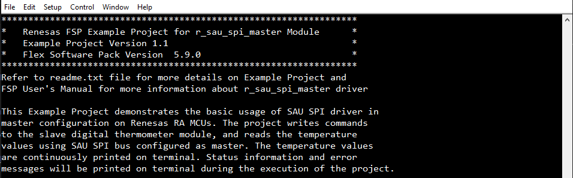
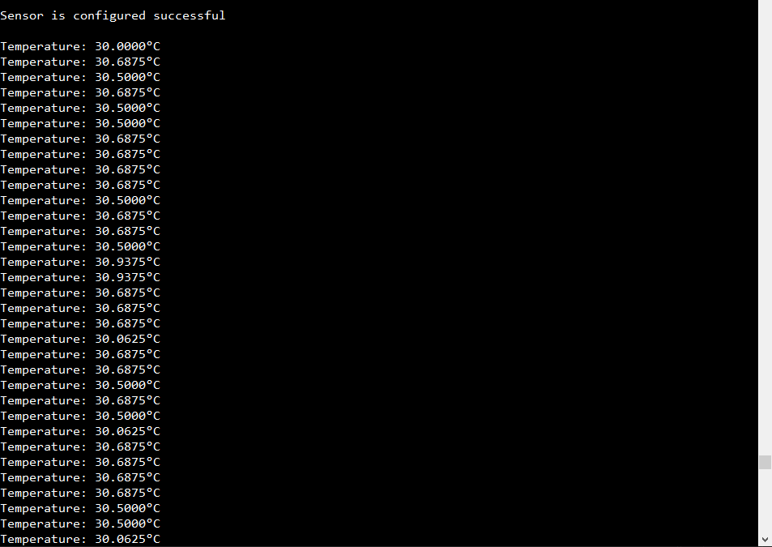

# Introduction #

This Example Project demonstrates the basic usage of SAU SPI driver in master configuration on Renesas RA MCUs. The project writes commands to the slave digital thermometer module, and reads the temperature values using SAU SPI bus configured as master. The temperature values are continuously printed on terminal. Status information and error messages will be printed on terminal during the execution of the project.

Note 1: 
* Information can be displayed using either the SEGGER J-Link RTT Viewer or a serial terminal (UART) via J-Link OB VCOM, depending on availability. If J-Link OB VCOM is unsupported, the example project defaults to the SEGGER J-Link RTT Viewer. If supported, it defaults to the serial terminal (UART).
* To use the SEGGER J-Link RTT Viewer instead of the Serial Terminal, please refer to the instructions provided in the Special Topic.

Note 2:
* In addition to communicating with the digital thermometer module, the example project can also communicate with the sau_spi_slave EP. For more information, please refer to the documentation of the sau_spi_slave EP.

Please refer to the [Example Project Usage Guide](https://github.com/renesas/ra-fsp-examples/blob/master/example_projects/Example%20Project%20Usage%20Guide.pdf) 
for general information on example projects and [readme.txt](./readme.txt) for specifics of operation.

## Required Resources ## 
To build and run the SAU SPI Master example project, the following resources are needed.

### Hardware Requirements ###
Supported RA Boards: FPB-RA0E1
* 1 x Renesas RA board.
* 1 x Type-C USB cable.
* 1 x Digital thermometer module (PMOD MAX31723PMB1)
  * Link product: [PMOD MAX31723PMB1](https://www.mouser.com/ProductDetail/Analog-Devices-Maxim-Integrated/MAX31723PMB1?qs=UmMSjoC1xtH8e742i4OoUA%3D%3D).
  * Manufacturer Product Number: MAX31723PMB1#
* 1 x Host PC.

**Select SPI communication protocol on the PMOD MAX31723PMB1 by configuring the following jumper configurations on JP1:**

### Hardware connections ###
* PMOD MAX31723PMB1:
	* Select SPI communication protocol on the PMOD by configuring the following jumper configurations on JP1:
  * Connect JP1-3 to JP1-5
  * Connect JP1-4 to JP1-6
  * Connect JP1-9 to JP1-10

* FPB-RA0E1:
  * Connect RA board to Host PC by Type-C USB cable.
  * Connect PMOD MAX31723PMB1 (J1) to the RA board via the PMOD1 Port (PMOD1). Please carefully align pin 1 on the Temperature sensor with pin 1 on the PMOD1.

### Software Requirements ###
* Renesas Flexible Software Package (FSP): Version 6.1.0
* e2 studio: Version 2025-07
* SEGGER J-Link RTT Viewer: Version 8.58
* GCC ARM Embedded Toolchain: Version 13.2.1.arm-13-7
* Terminal Console Application: Tera Term or a similar application

Refer to the software required section in [Example Project Usage Guide](https://github.com/renesas/ra-fsp-examples/blob/master/example_projects/Example%20Project%20Usage%20Guide.pdf) for basic information on setting up and using the above software.

## Related Collateral References ##
The following documents can be referred to for enhancing your understanding of 
the operation of this example project:
- [FSP User Manual on GitHub](https://renesas.github.io/fsp/)
- [FSP Known Issues](https://github.com/renesas/fsp/issues)

# Project Notes #

## System Level Block Diagram ##
High level block diagram of the system is as shown below:

## FSP Modules Used ##
List all the various modules that are used in this example project. Refer to the FSP User Manual for further details on each module listed below.

| Module Name | Usage | Searchable Keyword  |
|-------------|-----------------------------------------------|-----------------------------------------------|
| SAU SPI | SAU SPI is used to communicate with the digital thermometer module. | r_sau_spi |
| I/O Port | I/O Port is used to drive SS_N pin of the digital thermometer module. | r_ioport|

## Module Configuration Notes ##
This section describes FSP Configurator properties which are important or different than those selected by default. 

**Configuration Properties for using SAU SPI**

|   Module Property Path and Identifier   |   Default Value   |   Used Value   |   Reason   |
|-----------------------------------------|-------------------|----------------|------------|
| configuration.xml > g_sau_spi SPI (r_sau_spi) > Settings > Property > Common > Enable Single Channel | Disable | 00 | Enable single channel to reduce code size if only channel 00 or 20 is to be configured for SAU SPI. |
| configuration.xml > g_sau_spi SPI (r_sau_spi) > Settings > Property > Module g_sau_spi SPI (r_sau_spi) > Channel | 00 | 00 | Use SAU SPI Channel 00 to communicate with the digital thermometer module. |
| configuration.xml > g_sau_spi SPI (r_sau_spi) > Settings > Property > Module g_sau_spi SPI (r_sau_spi) > Callback | sau_spi_callback | sau_spi_callback | A user callback function that is called from the sau spi interrupts when a transfer is completed or an error has occurred. |
| configuration.xml > g_sau_spi SPI (r_sau_spi) > Settings > Property > Module g_sau_spi SPI (r_sau_spi) > Transmit End Interrupt Priority | Priority 2 | Priority 2 | Select the transmit end interrupt priority. |
| configuration.xml > g_sau_spi SPI (r_sau_spi) > Settings > Property > Common > DTC Support | Disable | Enable | Enable DTC Support. |

**Configuration Properties for using GPIO**

|   Module Property Path and Identifier   |   Default Value   |   Used Value   |   Reason   |
|-----------------------------------------|-------------------|----------------|------------|
| configuration.xml > Pins tab > Pin Selection > Ports > P1 > P103 > Pin Configuration > Mode | Disable | Output mode (Initial Low) | Use P103 as output to drive SS_N pin of slave device during transfer process. |

**Configuration Properties for using the Serial Terminal (UART)**

|   Configure interrupt event path   |   Default Value   |   Used Value   |   Reason   |
|-----------------------------------------|-------------------|----------------|------------|
| configuration.xml > Interrupts > Interrupts Configuration > New User Event > UARTA > UARTA0 > UARTA0 ERRI | empty | uarta_eri_isr | Assign the UART error ISR (Reception error interrupt) to the interrupt vector table |
| configuration.xml > Interrupts > Interrupts Configuration > New User Event > UARTA > UARTA0 > UARTA0 RXI | empty | uarta_rxi_isr | Assign the UART receive ISR (Reception transfer end) to the interrupt vector table |
| configuration.xml > Interrupts > Interrupts Configuration > New User Event > UARTA > UARTA0 > UARTA0 TXI | empty | uarta_txi_isr | Assign the UART transfer ISR (Transfer completion interrupt) to the interrupt vector table |

|   Configure Clock path   |   Default Value   |   Used Value   |   Reason   |
|-----------------------------------------|-------------------|----------------|------------|
| configuration.xml > Clocks > Clocks Configuration | UARTA Src: Disable | UARTA Src: HOCO | Select HOCO clock source as the source operating clock for UARTA module. |

## API Usage ##
The table below lists the FSP provided API used at the application layer by this example project.

| API Name    | Usage                                                                          |
|-------------|--------------------------------------------------------------------------------|
| R_SAU_SPI_Open | This API is used to initialize the SAU SPI module. |
| R_SAU_SPI_Write | This API is used to configure the digital thermometer module. |
| R_SAU_SPI_WriteRead | This API is used to write command to the digital thermometer module and read temperature values. |
| R_SAU_SPI_Close | This API is used to de-initialize the SAU SPI module. |
| R_IOPORT_PinWrite | This API is used to drive Slave Select Pin during transmission. |
| R_BSP_SoftwareDelay | This API is used to delay a specified period of time. |

## Verifying Operation ##
1. Import, generate and build the Example Project.
2. Before running the example project, make sure hardware connections are completed.
3. Connect RA board to Host PC.
4. Open serial terminal application on the host PC (Tera Term) and connect to the COM Port provided by the J-Link onboard or open J-Link RTT Viewer (In case user selected SEGGER J-Link RTT Viewer).
   * Note: For using the serial terminal:
        * Please ensure that the connection to the J-Link RTT Viewer has been terminated if it was previously established.
        * The COM port is provided by the J-Link onboard, with a baud rate of 115200 bps, a data length of 8 bits, no parity check, one stop bit, and no flow control.
5. Flash or debug the Example Project.
6. Open the terminal application and view output log.
  
The below images showcase the output on the Serial terminal application (Tera Term):

EP Information:

Operation log:

## Special Topic ##

Special notes:
* Information can be displayed using either the SEGGER J-Link RTT Viewer or a serial terminal (UART) via J-Link OB VCOM, depending on availability. If J-Link OB VCOM is unsupported, the example project defaults to the SEGGER J-Link RTT Viewer; if supported, it defaults to the serial terminal (UART).
  * To configure display options:
    * **For UART via J-Link OB VCOM**: Define `USE_VIRTUAL_COM=1`
    * **For J-Link RTT Viewer**: Define `USE_VIRTUAL_COM=0`
  * It is important to note that the user should only operate a single terminal application (SEGGER J-Link RTT Viewer or a serial terminal (UART)) at a time to avoid conflicts or data inconsistencies. 
  * The board supports J-Link OB VCOM: FPB-RA0E1.
    
  Set this in **Project Properties** -> **C/C++ Build** -> **Settings** -> **Tool Settings** -> **GNU ARM Cross C Compiler** -> **Preprocessor**.