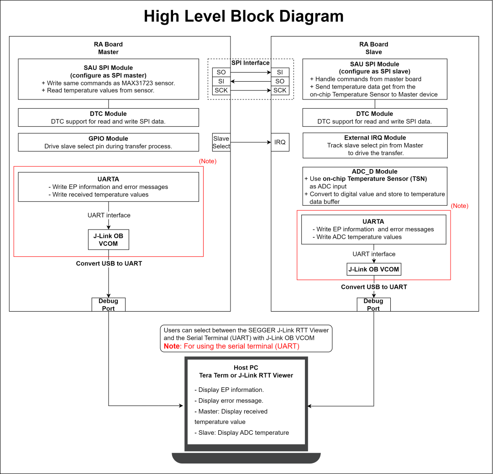
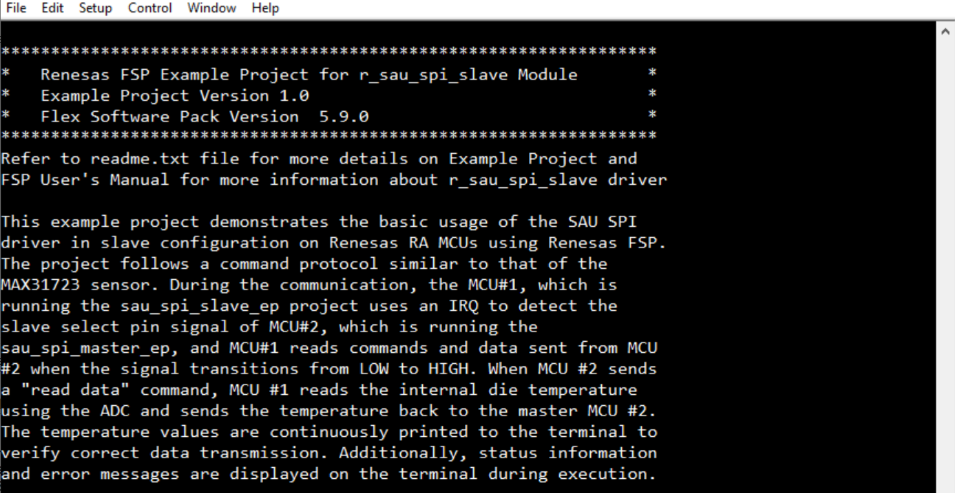
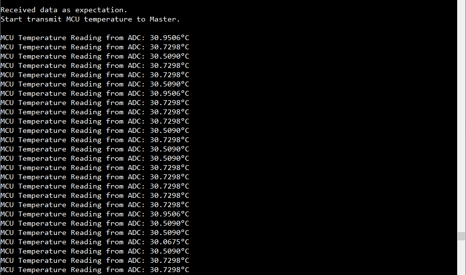

# Introduction #

This example project demonstrates the basic usage of the SAU SPI driver in slave configuration on Renesas RA MCUs using Renesas FSP. The project follows a command protocol similar to that of the MAX31723 sensor. During the communication, the MCU#1, which is running the sau_spi_slave_ep project uses an IRQ to detect the slave select pin signal of MCU#2, which is running the sau_spi_master_ep, and MCU#1 reads commands and data sent from MCU #2 when the signal transitions from LOW to HIGH. When MCU #2 sends a "read data" command, MCU #1 reads the internal die temperature using the ADC and sends the temperature back to the master MCU #2. The temperature values are continuously printed to the terminal to verify correct data transmission. Additionally, status information and error messages are displayed on the terminal during execution.

Note: 
* Information can be displayed using either the SEGGER J-Link RTT Viewer or a serial terminal (UART) via J-Link OB VCOM, depending on availability. If J-Link OB VCOM is unsupported, the example project defaults to the SEGGER J-Link RTT Viewer. If supported, it defaults to the serial terminal (UART).
* To use the SEGGER J-Link RTT Viewer instead of the Serial Terminal, please refer to the instructions provided in the Special Topic.

Please refer to the [Example Project Usage Guide](https://github.com/renesas/ra-fsp-examples/blob/master/example_projects/Example%20Project%20Usage%20Guide.pdf) 
for general information on example projects and [readme.txt](./readme.txt) for specifics of operation.

## Required Resources ## 
To build and run the SAU SPI Slave example project, the following resources are needed.

### Hardware Requirements ###
Supported RA Boards: FPB-RA0E1
* 2 x Renesas RA boards.
* 2 x Type-C USB cables.
* 4 x Jumper wires with both ends male.
* 1 x Host PC.

### Hardware connections ###
* FPB-RA0E1:
  * Connect 2 RA boards to Host PC by 2 Type-C USB cables.
	|   Board 1 (Master)  |   Board 2 (Slave)   |
	|---------------------|---------------------|
	| P101 SO (J2-Pin23)  | P100 SI (J2-Pin24)  |
	| P100 SI (J2-Pin24)  | P101 SO (J2-Pin23)  |
	| P102 SCK (J2-Pin22) | P102 SCK (J2-Pin22) |
	| P103 (J2-Pin21)     | P103 IRQ (J2-Pin21) |

### Software Requirements ###
* Renesas Flexible Software Package (FSP): Version 6.2.0
* e2 studio: Version 2025-10
* SEGGER J-Link RTT Viewer: Version 8.74
* GCC ARM Embedded Toolchain: Version 13.2.1.arm-13-7
* Terminal Console Application: Tera Term or a similar application

Refer to the software required section in [Example Project Usage Guide](https://github.com/renesas/ra-fsp-examples/blob/master/example_projects/Example%20Project%20Usage%20Guide.pdf) for basic information on setting up and using the above software.

## Related Collateral References ##
The following documents can be referred to for enhancing your understanding of 
the operation of this example project:
- [FSP User Manual on GitHub](https://renesas.github.io/fsp/)
- [FSP Known Issues](https://github.com/renesas/fsp/issues)

# Project Notes #

## System Level Block Diagram ##
High level block diagram of the system is as shown below:
 

## FSP Modules Used ##
List all the various modules that are used in this example project. Refer to the FSP User Manual for further details on each module listed below.

| Module Name | Usage | Searchable Keyword  |
|-------------|-----------------------------------------------|-----------------------------------------------|
| SAU SPI | SAU SPI in slave mode is used to communicate with the sau_spi_master EP. | r_sau_spi |
| ADC | ADC is used to read the die temperature. | r_adc_d|
| External IRQ | External IRQ is used to detect the slave select pin signal of the sau_spi_master EP. | r_icu|

## Module Configuration Notes ##
This section describes FSP Configurator properties which are important or different than those selected by default. 

**Configuration Properties for using SAU SPI module**

|   Module Property Path and Identifier   |   Default Value   |   Used Value   |   Reason   |
|-----------------------------------------|-------------------|----------------|------------|
| configuration.xml > Stacks > Properties > g_sau_spi_slave SPI (r_sau_spi) > Settings > Property > Common > Enable Single Channel | Disable | 00 | Enable single channel to reduce code size if only channel 00 or 20 is to be configured for SAU SPI. |
| configuration.xml > Stacks > Properties > g_sau_spi_slave SPI (r_sau_spi) > Settings > Property > Module g_sau_spi_slave SPI (r_sau_spi) > Channel | 00 | 00 | Use SAU SPI Channel 00 to communicate with the digital thermometer module. |
| configuration.xml > Stacks > Properties > g_sau_spi_slave SPI (r_sau_spi) > Settings > Property > Module g_sau_spi_slave SPI (r_sau_spi) > Operation Mode | Master | Slave | Select slave mode for SAU SPI. |
| configuration.xml > Stacks > Properties > g_sau_spi_slave SPI (r_sau_spi) > Settings > Property > Module g_sau_spi_slave SPI (r_sau_spi) > Callback | NULL | sau_spi_slave_callback | A user callback function that is called from the sau spi interrupts when a transfer is completed or an error has occurred. |
| configuration.xml > Stacks > Properties > g_sau_spi_slave SPI (r_sau_spi) > Settings > Property > Module g_sau_spi_slave SPI (r_sau_spi) > Transmit End Interrupt Priority | Priority 2 | Priority 2 | Select the transmit end interrupt priority. |
| configuration.xml > Stacks > Properties > g_sau_spi_slave SPI (r_sau_spi) > Settings > Property > Common > DTC Support | Disable | Enable | Enable DTC Support. |

**Configuration Properties for using ADC module**

|   Module Property Path and Identifier   |   Default Value   |   Used Value   |   Reason   |
|-----------------------------------------|-------------------|----------------|------------|
| configuration.xml > Stacks > Properties > g_adc ADC (r_adc_d) > Settings > Property > Module g_adc ADC (r_adc_d) > General > Conversion operation | One-shot | Sequential | Select sequential to conversion operation mode. |
| configuration.xml > Stacks > Properties > g_adc ADC (r_adc_d) > Settings > Property > Module g_adc ADC (r_adc_d) > Input > A/D Input channel | Channel 0 (channels 0-3 in scan mode) | Temperature Sensor | Select the input channel. |

**Configuration Properties for using External IRQ module**

|   Module Property Path and Identifier   |   Default Value   |   Used Value   |   Reason   |
|-----------------------------------------|-------------------|----------------|------------|
| configuration.xml > Stacks > Properties > g_external_irq0 External IRQ (r_icu) > Settings > Property > Module g_external_irq0 External IRQ (r_icu) > Channel | 0 | 5 | Select External IRQ channel. |
| configuration.xml > Stacks > Properties > g_external_irq0 External IRQ (r_icu) > Settings > Property > Module g_external_irq0 External IRQ (r_icu) > Trigger | Rising | Rising | Select the signal edge. |
| configuration.xml > Stacks > Properties > g_external_irq0 External IRQ (r_icu) > Settings > Property > Module g_external_irq0 External IRQ (r_icu) > Callback | NULL | active_transfer_callback | A user callback function is called when the master board asserts the interrupt pin. |

**Configuration Properties for using the Serial Terminal (UART)**

|   Configure interrupt event path   |   Default Value   |   Used Value   |   Reason   |
|-----------------------------------------|-------------------|----------------|------------|
| configuration.xml > Interrupts > Interrupts Configuration > New User Event > UARTA > UARTA0 > UARTA0 ERRI | empty | uarta_eri_isr | Assign the UART error ISR (Reception error interrupt) to the interrupt vector table |
| configuration.xml > Interrupts > Interrupts Configuration > New User Event > UARTA > UARTA0 > UARTA0 RXI | empty | uarta_rxi_isr | Assign the UART receive ISR (Reception transfer end) to the interrupt vector table |
| configuration.xml > Interrupts > Interrupts Configuration > New User Event > UARTA > UARTA0 > UARTA0 TXI | empty | uarta_txi_isr | Assign the UART transfer ISR (Transfer completion interrupt) to the interrupt vector table |

|   Configure Clock path   |   Default Value   |   Used Value   |   Reason   |
|-----------------------------------------|-------------------|----------------|------------|
| configuration.xml > Clocks > Clocks Configuration | UARTA Src: Disable | UARTA Src: HOCO | Select HOCO clock source as the source operating clock for UARTA module. |

## API Usage ##
The table below lists the FSP provided API used at the application layer by this example project.

| API Name    | Usage                                                                          |
|-------------|--------------------------------------------------------------------------------|
| R_SAU_SPI_Open | This API is used to initialize the SAU SPI module in slave mode. |
| R_SAU_SPI_WriteRead | This API is used to write command to the digital thermometer module and read temperature values. |
| R_SAU_SPI_Close | This API is used to de-initialize the SAU SPI module. |
| R_ADC_D_Open | This API is used to initialize ADC module. |
| R_ADC_D_ScanCfg | This API is used to configure the ADC scan parameters. |
| R_ADC_D_ScanStart | This API is used to start the ADC scan. |
| R_ADC_D_Read | This API is used to read the die temperature by ADC. |
| R_ADC_D_Close |This API is used to de-initialize ADC module. |
| R_ICU_ExternalIrqOpen | This API is used to initialize ICU module. |
| R_ICU_ExternalIrqEnable | This API is used to enable ICU module. |
| R_ICU_ExternalIrqClose | This API is used to de-initialize ICU module. |
| R_BSP_SoftwareDelay | This API is used to delay a specified period of time. |

## Verifying operation ##
1. Import the sau_spi_slave EP and sau_spi_master EP. 
2. Generate, and build both example projects.
3. Before running the example projects, make sure hardware connections are completed.
4. Connect 2 RA boards to Host PC by 2 Type-C USB cables.
5. Open 2 serial terminal applications on the host PC (Tera Term) and connect to the COM Port provided by the J-Link onboard or open 2 J-Link RTT Viewer (In case user selected SEGGER J-Link RTT Viewer).
   * Note: For using the serial terminal:
        * Please ensure that the connection to the RTT viewer has been terminated if it was previously established.
        * The COM port is provided by the J-Link onboard, with a baud rate of 115200 bps, a data length of 8 bits, no parity check, one stop bit, and no flow control.
6. Flash or debug the sau_spi_slave EP to once RA board. Then Flash the sau_spi_master EP to another RA board.

The below images showcase the output on the Serial terminal application (Tera Term):

EP Information:

Operation log:

## Special Topic ##

Special notes:
* Information can be displayed using either the SEGGER J-Link RTT Viewer or a serial terminal (UART) via J-Link OB VCOM, depending on availability. If J-Link OB VCOM is unsupported, the example project defaults to the SEGGER J-Link RTT Viewer; if supported, it defaults to the serial terminal (UART).
  * To configure display options:
    * **For UART via J-Link OB VCOM**: Define `USE_VIRTUAL_COM=1`
    * **For J-Link RTT Viewer**: Define `USE_VIRTUAL_COM=0`
  * It is important to note that the user should only operate a single terminal application (SEGGER J-Link RTT Viewer or a serial terminal (UART)) at a time to avoid conflicts or data inconsistencies. 
  * The board supports J-Link OB VCOM: FPB-RA0E1.
    
  Set this in **Project Properties** -> **C/C++ Build** -> **Settings** -> **Tool Settings** -> **GNU ARM Cross C Compiler** -> **Preprocessor**.