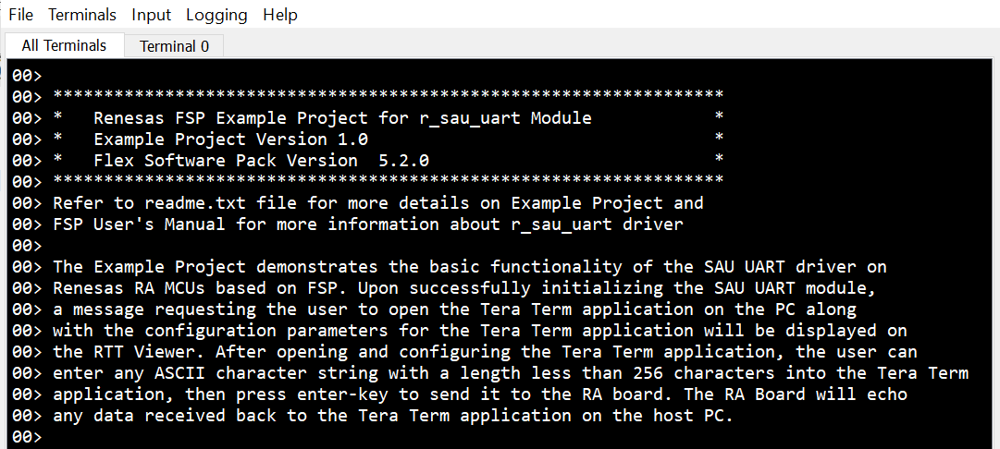
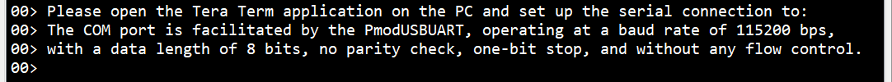
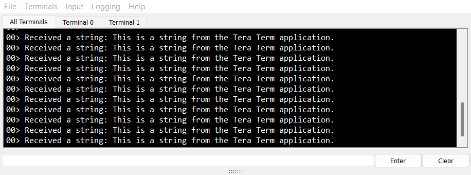
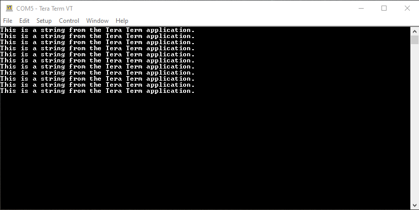

# Introduction #
The example project demonstrates the typical use of the SAU UART HAL module APIs. The project initializes the SAU UART module with 115200 bps baud rate, 8-bits data length, no parity check, and one-bit stop.

On power-up, after initializing the SAU UART module, a message requesting the user to open the Tera Term application on the PC along with the configuration parameters for the Tera Term application will be displayed on the RTT Viewer. The configuration parameters are as follows: The COM port is facilitated by the PmodUSBUART, operating at a baud rate of 115200 bps, with a data length of 8 bits, no parity check, one-bit stop, and without any flow control.

After opening and configuring the Tera Term application, the user can enter any ASCII character string with a length less than 256 characters into the Tera Term application, then press enter-key to send it to the RA board. The RA Board will echo any data received back to the Tera Term application on the host PC.

The PmodUSBUART facilitates the conversion of UART signals to USB signals and vice versa, enabling communication between the RA board and the Tera Term application.

Please refer to the [Example Project Usage Guide](https://github.com/renesas/ra-fsp-examples/blob/master/example_projects/Example%20Project%20Usage%20Guide.pdf) 
for general information on example projects and [readme.txt](./readme.txt) for specifics of operation.

## Required Resources ## 
To build and run the SAU UART example project, the following resources are needed.

### Hardware ###
* 1 x Renesas FPB-RA0E1 board.
* 1 x USB type C cable for programming and debugging.
* 1 x PmodUSBUART module for converting data from the USB interface to the UART interface and vice versa.
* 1 x Micro USB cable for connecting the PmodUSBUART to the host PC.

### Hardware Connections ###
* Plug in the PmodUSBUART Board (J2) to the PMOD1 connector on the MCU evaluation kit, and be careful to align Pin 1 on the module to Pin 1 on the MCU kit.
* Connect the PmodUSBUART Board (J1) to the host PC via a micro USB cable.
* Connect the USB Debug port on the RA board to the host PC via a USB type C cable.
    
Refer to [readme.txt](./readme.txt) for information on how to connect the hardware.

### Software ###
* Renesas Flexible Software Package (FSP)
* e2 studio: Version 2024-04
* SEGGER J-Link RTT Viewer: Version 7.96j
* GCC ARM Embedded Toolchain: Version 13.2.1.arm-13-7

Refer to the software required section in [Example Project Usage Guide](https://github.com/renesas/ra-fsp-examples/blob/master/example_projects/Example%20Project%20Usage%20Guide.pdf) for basic information on setting up and using the above software

## Related Collateral References ##
The following documents can be referred to for enhancing your understanding of 
the operation of this example project:
- [FSP User Manual on GitHub](https://renesas.github.io/fsp/)
- [FSP Known Issues](https://github.com/renesas/fsp/issues)

# Project Notes #

## System Level Block Diagram ##
High level block diagram of the system is shown below:
 

## FSP Modules Used ##
List all the various modules that are used in this example project. Refer to the FSP User Manual for further details on each module listed below.

| Module Name | Usage | Searchable Keyword  |
|-------------|-----------------------------------------------|-----------------------------------------------|
| SAU UART | SAU UART is used to communicate with the serial terminal on the host PC via the uart interface. | r_sau_uart |

## Module Configuration Notes ##
This section describes FSP Configurator properties which are important or different than those selected by default. 

**Configuration Properties for using SAU UART**

|   Module Property Path and Identifier   |   Default Value   |   Used Value   |   Reason   |
|-----------------------------------------|-------------------|----------------|------------|
| configuration.xml > g_sau_uart UART (r_sau_uart) > Settings > Property > Common > DTC Support | Disabled | Enabled | Enable DTC for support the SAU UART module. |
| configuration.xml > g_sau_uart UART (r_sau_uart) > Settings > Property > Module g_sau_uart UART (r_sau_uart) > General > Channel | 0 | 0 | Use SAU UART channel 0 to communicate with the terminal application on the host PC. |
| configuration.xml > g_sau_uart UART (r_sau_uart) > Settings > Property > Module g_sau_uart UART (r_sau_uart) > General > Data Bits | 8 bits | 8 bits | Select 8 bits data length. |
| configuration.xml > g_sau_uart UART (r_sau_uart) > Settings > Property > Module g_sau_uart UART (r_sau_uart) > General > Parity | None | None | Select no check Parity. |
| configuration.xml > g_sau_uart UART (r_sau_uart) > Settings > Property > Module g_sau_uart UART (r_sau_uart) > General > Stop Bits | 1 bit | 1 bit | Select 1 bit stop. |
| configuration.xml > g_sau_uart UART (r_sau_uart) > Settings > Property > Module g_sau_uart UART (r_sau_uart) > Baud > Baud Rate | 115200 | 115200 | Select 115200 bps baud rate. |
| configuration.xml > g_sau_uart UART (r_sau_uart) > Settings > Property > Module g_sau_uart UART (r_sau_uart) > Extra > Operation Clock | CK0 | CK0 | Select CK0 as clock source. |
| configuration.xml > g_sau_uart UART (r_sau_uart) > Settings > Property > Module g_sau_uart UART (r_sau_uart) > Extra > Transfer Mode | Single transfer mode | Single transfer mode | Select Single transfer mode. |
| configuration.xml > g_sau_uart UART (r_sau_uart) > Settings > Property > Module g_sau_uart UART (r_sau_uart) > Interrupts > Callback | NULL | sau_uart_callback | It is called from the interrupt service routine (ISR) upon UART transaction completion reporting the transaction status. |
| configuration.xml > g_sau_uart UART (r_sau_uart) > Settings > Property > Module g_sau_uart UART (r_sau_uart) > Interrupts > Transmit End Interrupt Priority | Priority 2 | Priority 2 | Select the SAU UART  transmit end interrupt priority level. |
| configuration.xml > g_sau_uart UART (r_sau_uart) > Settings > Property > Module g_sau_uart UART (r_sau_uart) > Interrupts > Receive End Interrupt Priority | Priority 2 | Priority 2 | Select the SAU UART  receive end interrupt priority level. |

## API Usage ##
The table below lists the FSP provided API used at the application layer in this example project.

| API Name    | Usage                                                                          |
|-------------|--------------------------------------------------------------------------------|
| R_SAU_UART_Open | This API is used to initialize the SAU UART module. |
| R_SAU_UART_Write | This API is used to perform a write operation. |
| R_SAU_UART_Close | This API is used to de-initialize the SAU UART module. |
| R_BSP_SoftwareDelay | This API is used to delay a specified period of time. |

## Verifying operation ##
1. Import, generate, and build the EP project.
2. Connect the PmodUSBUART module to the RA board via the PMOD 1 port.
3. Connect the PmodUSBUART to the host PC via USB cable.
4. Connect the RA board to the host PC via USB cable.
5. Flash or debug the EP project.
6. Open the RTT viewer.
7. Open the Tera Term application on the host PC.
8. Open the COM port and set parameters for the Tera Term application.
9. Type any ASCII character string with a length less than 256 into the Tera Term, then press enter-key.
10. View the output log on RTT Viewer and Tera Term.

The EP infomation image:

The instruction message image:

The received string image (RTT Viewer):

The echo string image (Tera term):

