# Introduction #

The example project showcases how the TML driver operates on Renesas RA MCUs. The demonstration includes showcasing the TML timer with counter operation, capture operation in normal mode, and counter operation in low power mode.
In TML counter operation (normal mode), three TML instances (which are configured as 8-bit, 16-bit, and 32-bit counter modes) operate for the inputted duration by the user. In TML 16-bit capture operation, user can trigger an ELC software event to get the raw counts value of 16-bit timer. In TML counter operation (low power modes), the 32-bit timer is configured as counter mode with period 10 seconds. Once the 32-bit timer has expired, the RA board is woken up from LPM to normal mode. The EP information and error messages will be printed to the Host PC.

**NOTE:** To display information, users can select between the SEGGER J-Link RTT Viewer and the Serial Terminal (UART) with J-Link OB VCOM. By default, the Example Project information is printed to the host PC via the Serial Terminal. To utilize SEGGER RTT instead of the Serial Terminal, please follow the instructions in "Verifying Operation" section.

Please refer to the [Example Project Usage Guide](https://github.com/renesas/ra-fsp-examples/blob/master/example_projects/Example%20Project%20Usage%20Guide.pdf) 
for general information on example projects and [readme.txt](./readme.txt) for specifics of operation.

## Required Resources ## 
To build and run the TML example project, the following resources are needed.

### Hardware ###
Supported RA Boards: FPB-RA0E1
* 1 x Renesas RA board.
* 1 x USB Type C cable.
* 1 x Host PC.

### Hardware Connections ###
* FPB-RA0E1:
  * Connect RA board to Host PC by USB Type C cable.
  * For using the Serial Terminal (UART):     
    * The soldering bridge E4 must be closed.
    * Populate R10 with a resistor ranging from 0 to 150 ohms.

### Software ###
* Renesas Flexible Software Package (FSP): Version 5.6.0
* e2 studio: Version 2024-10
* SEGGER J-Link RTT Viewer: Version 7.98g
* GCC ARM Embedded Toolchain: Version 13.2.1.arm-13-7
* Terminal Console Application: Tera Term or a similar application

Refer to the software required section in [Example Project Usage Guide](https://github.com/renesas/ra-fsp-examples/blob/master/example_projects/Example%20Project%20Usage%20Guide.pdf)

## Related Collateral References ##
The following documents can be referred to for enhancing your understanding of 
the operation of this example project:
- [FSP User Manual on GitHub](https://renesas.github.io/fsp/)
- [FSP Known Issues](https://github.com/renesas/fsp/issues)

# Project Notes #

## System Level Block Diagram ##
High level block diagram of the system is shown below:
 
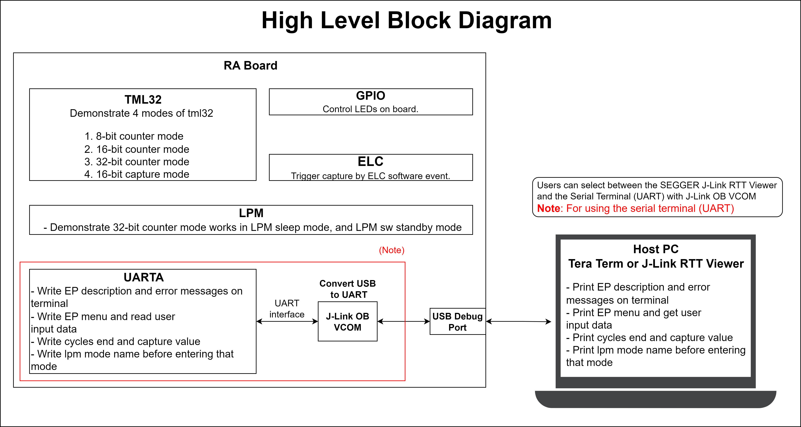

## FSP Modules Used ##
List all the various modules that are used in this example project. Refer to the FSP User Manual for further details on each module listed below.

| Module Name | Usage | Searchable Keyword  |
|-------------|-----------------------------------------------|-----------------------------------------------|
| 32-bit Interval Timer | Operating in 8-bit, 16-bit, 32-bit counter modes and 16-bit capture mode  | r_tml |
| Event Link Controller | ELC is used to capture the raw count value of 16-bit timer | r_elc |
| Low Power Modes | LPM is used to configure power cancellation, mode selection and return the MCU to low power mode to reduce power consumption | r_lpm |
| I/O Port | I/O Port is used to control LED onboard| r_ioport|

**Common Configuration Properties for 32-bit Interval Timer**
|   Configure Clock path   |   Default Value   |   Used Value   |   Reason   |
|-----------------------------------------|-------------------|----------------|------------|
| configuration.xml > Clocks > Clocks Configuration | TML FITL0 Src: ELC event/No BSP Source Clock | TML FITL0 Src: SUBCLK/LOCO | Select SUBCLK/LOCO clock source as the source operating clock for TML FITL0 Source. |
| configuration.xml > Clocks > Clocks Configuration | TML FITL1 Src: ELC event/No BSP Source Clock | TML FITL1 Src: HOCO | Select HOCO clock source as the source operating clock for TML FITL1 Source. |

**Configuration Properties for 8-bit Counter Mode TML instance**

|   Module Property Path and Identifier   |   Default Value   |   Used Value   |   Reason   |
|-----------------------------------------|-------------------|----------------|------------|
| configuration.xml > g_timer_8bit 32-bit Interval Timer (r_tml) > Settings > Property > Common > 16-bit Capture Mode Support | Disabled | Enabled | Enable 16-bit capture mode support. |
| configuration.xml > g_timer_8bit 32-bit Interval Timer (r_tml) > Settings > Property > Common > Interrupt Support | Disabled | Enabled | Enable TML interrupt support. |
| configuration.xml > g_timer_8bit 32-bit Interval Timer (r_tml) > Settings > Property > Module g_timer_8bit 32-bit Interval Timer (r_tml) > General > Mode | 8-bit Counter Mode | 8-bit Counter Mode | Select TML 8-bit Counter mode. |
| configuration.xml > g_timer_8bit 32-bit Interval Timer (r_tml) > Settings > Property > Module g_timer_8bit 32-bit Interval Timer (r_tml)  > Counter Mode Settings > Period | 0x10000 | 1 | Select specific the timer period is 1. |
| configuration.xml > g_timer_8bit 32-bit Interval Timer (r_tml) > Settings > Property > Module g_timer_8bit 32-bit Interval Timer (r_tml)  > Counter Mode Settings > Period Unit | Raw Counts | Milliseconds | Select Unit of period is Milliseconds. |
| configuration.xml > g_timer_8bit 32-bit Interval Timer (r_tml) > Settings > Property > Module g_timer_8bit 32-bit Interval Timer (r_tml)  > Interrupt > Callback function | NULL | timer_8bit_callback | A user callback function. It is called from the interrupt service routine (ISR) each time when event occurs. |
| configuration.xml > g_timer_8bit 32-bit Interval Timer (r_tml) > Settings > Property > Module g_timer_8bit 32-bit Interval Timer (r_tml)  > Interrupt > Priority | Disabled | Priority 2 | Select the interrupt priority is 2. |

**Configuration Properties for 16-bit Counter Mode TML instance**

|   Module Property Path and Identifier   |   Default Value   |   Used Value   |   Reason   |
|-----------------------------------------|-------------------|----------------|------------|
| configuration.xml > g_timer_16bit 32-bit Interval Timer (r_tml) > Settings > Property > Module g_timer_16bit 32-bit Interval Timer (r_tml) > General > Mode | 8-bit Counter Mode | 16-bit Counter Mode | Select TML 16-bit Counter mode. |
| configuration.xml >  g_timer_16bit 32-bit Interval Timer (r_tml) > Settings > Property > Module g_timer_16bit 32-bit Interval Timer (r_tml) > Counter Mode Settings > Period | 0x10000 | 100 | Select specific the timer period is 100. |
| configuration.xml > g_timer_16bit 32-bit Interval Timer (r_tml) > Settings > Property > Module g_timer_16bit 32-bit Interval Timer (r_tml) >  Counter Mode Settings > Period Unit | Raw Counts | Milliseconds | Select Unit of period is Milliseconds. |
| configuration.xml >  g_timer_16bit 32-bit Interval Timer (r_tml) > Settings > Property > Module g_timer_16bit 32-bit Interval Timer (r_tml) >  Interrupt > Callback function | NULL | timer_16bit_callback | A user callback function. it is called from the interrupt service routine (ISR) each time when event occurs. |
| configuration.xml > g_timer_16bit 32-bit Interval Timer (r_tml) > Settings > Property > Module g_timer_16bit 32-bit Interval Timer (r_tml) >  Interrupt > Priority | Disabled | Priority 2 | Select the interrupt priority is 2. |

**Configuration Properties for 32-bit Counter Mode TML instance**

|   Module Property Path and Identifier   |   Default Value   |   Used Value   |   Reason   |
|-----------------------------------------|-------------------|----------------|------------|
| configuration.xml > g_timer_32bit 32-bit Interval Timer (r_tml) > Settings > Property > Module g_timer_32bit 32-bit Interval Timer (r_tml) >  General > Mode | 8-bit Counter Mode | 32-bit Counter Mode | Select TML 32-bit Counter mode. |
| configuration.xml > g_timer_32bit 32-bit Interval Timer (r_tml) > Settings > Property > Module g_timer_32bit 32-bit Interval Timer (r_tml) > Counter Mode Settings > Period | 0x10000 | 1 | Select specific the timer period is 1. |
| configuration.xml > g_timer_32bit 32-bit Interval Timer (r_tml) > Settings > Property > Module g_timer_32bit 32-bit Interval Timer (r_tml) > Counter Mode Settings > Period Unit | Raw Counts | Seconds | Select Unit of period is Seconds. |
| configuration.xml > g_timer_32bit 32-bit Interval Timer (r_tml) > Settings > Property > Module g_timer_32bit 32-bit Interval Timer (r_tml) > Interrupt > Callback function | NULL | timer_32bit_callback | A user callback function. it is called from the interrupt service routine (ISR) each time when event occurs. |
| configuration.xml > g_timer_32bit 32-bit Interval Timer (r_tml) > Settings > Property > Module g_timer_32bit 32-bit Interval Timer (r_tml) > Interrupt > Priority | Disabled | Priority 2 | Select the interrupt priority is 2. |

**Configuration Properties for 16-bit Capture Mode TML instance**

|   Module Property Path and Identifier   |   Default Value   |   Used Value   |   Reason   |
|-----------------------------------------|-------------------|----------------|------------|
| configuration.xml > g_timer_16bit_capture 32-bit Interval Timer (r_tml) > Settings > Property > Module g_timer_16bit_capture 32-bit Interval Timer (r_tml) > General > Mode | 8-bit Counter Mode | 16-bit Capture Mode | Select TML 16-bit Capture mode. |
| configuration.xml > g_timer_16bit_capture 32-bit Interval Timer (r_tml) > Settings > Property > Module g_timer_16bit_capture 32-bit Interval Timer (r_tml) > General > ELC event | Disable | ELC SOFTWARE EVENT 0 (Software event 0) | Select the ELC event. |
| configuration.xml > g_timer_16bit_capture 32-bit Interval Timer (r_tml) > Settings > Property > Module g_timer_16bit_capture 32-bit Interval Timer (r_tml) > Capture Mode Settings > Capture Trigger | Software trigger | Event input from ELC (rising edge) | Select ELC as capture trigger source. |
| configuration.xml > g_timer_16bit_capture 32-bit Interval Timer (r_tml) > Settings > Property > Module g_timer_16bit_capture 32-bit Interval Timer (r_tml) > Capture Mode Settings > Capture Clock Divider | fITL0 | fITL0/128 | Divide capture clock by 128. |
| configuration.xml > g_timer_16bit_capture 32-bit Interval Timer (r_tml) > Settings > Property > Module g_timer_16bit_capture 32-bit Interval Timer (r_tml) > Capture Mode Settings > Counter Status | Retained after the completion of capturing | Retained after the completion of capturing | Selection of the 16-bit counter value after capturing. |
| configuration.xml >g_timer_16bit_capture 32-bit Interval Timer (r_tml) > Settings > Property > Module g_timer_16bit_capture 32-bit Interval Timer (r_tml) > Interrupt > Callback function | NULL | timer_16bit_capture_callback | A user callback function. it is called from the interrupt service routine (ISR) each time when event occurs. |
| configuration.xml >g_timer_16bit_capture 32-bit Interval Timer (r_tml) > Settings > Property > Module g_timer_16bit_capture 32-bit Interval Timer (r_tml) > Interrupt > Priority | Disabled | Priority 2 | Select the interrupt priority is 2. |

**Configuration Properties for 32-bit Counter Mode TML instance operates in LPM**

|   Module Property Path and Identifier   |   Default Value   |   Used Value   |   Reason   |
|-----------------------------------------|-------------------|----------------|------------|
| configuration.xml > g_timer_32bit 32-bit Interval Timer (r_tml) > Settings > Property > Module g_timer_32bit_counter_lpm 32-bit Interval Timer (r_tml) > General > Mode | 8-bit Counter Mode | 32-bit Counter Mode | Select TML 32-bit Counter mode. |
| configuration.xml > g_timer_32bit 32-bit Interval Timer (r_tml) > Settings > Property > Module g_timer_32bit_counter_lpm 32-bit Interval Timer (r_tml) > Counter Mode Settings > Period | 0x10000 | 10 | Select specific the timer period is 10. |
| configuration.xml > g_timer_32bit 32-bit Interval Timer (r_tml) > Settings > Property > Module g_timer_32bit_counter_lpm 32-bit Interval Timer (r_tml) > Counter Mode Settings > Period Unit | Raw Counts | Seconds | Select Unit of period is Seconds. |

**Configuration Properties for Sleep mode LPM instance**
|   Module Property Path and Identifier   |   Default Value   |   Used Value   |   Reason   |
|-----------------------------------------|-------------------|----------------|------------|
| configuration.xml > g_lpm_sleep Low Power Modes (r_lpm) > Settings > Property > Module g_lpm_sleep Low Power Modes (r_lpm) > General > Low Power Mode | Sleep mode | Sleep mode | Select sleep mode for this LPM instance. |

**Configuration Properties for SW Standby mode LPM instance**
|   Module Property Path and Identifier   |   Default Value   |   Used Value   |   Reason   |
|-----------------------------------------|-------------------|----------------|------------|
| configuration.xml > g_lpm_sw_standby Low Power Modes (r_lpm) > Settings > Property > Module g_lpm_sw_standby Low Power Modes (r_lpm) > General > Low Power Mode | Sleep mode | Software Standby mode | Select Software Standby mode for this LPM instance. |
| configuration.xml > g_lpm_sw_standby Low Power Modes (r_lpm) > Settings > Property > Module g_lpm_sw_standby Low Power Modes (r_lpm) > Deep Sleep and Standby Options > Wake Sources > 32-bit interval timer interrupt | ☐ | ☑ | Select 32-bit interval timer interrupt as the source to cancel SW Standby mode. |

**Configuration Properties for using the Serial Terminal (UART)**
|   Configure interrupt event path   |   Default Value   |   Used Value   |   Reason   |
|-----------------------------------------|-------------------|----------------|------------|
| configuration.xml > Interrupts > Interrupts Configuration > New User Event > UARTA > UARTA0 > UARTA0 ERRI | empty | uarta_eri_isr | Assign the UART error ISR (Reception error interrupt) to the interrupt vector table |
| configuration.xml > Interrupts > Interrupts Configuration > New User Event > UARTA > UARTA0 > UARTA0 RXI | empty | uarta_rxi_isr | Assign the UART receive ISR (Reception transfer end) to the interrupt vector table |
| configuration.xml > Interrupts > Interrupts Configuration > New User Event > UARTA > UARTA0 > UARTA0 TXI | empty | uarta_txi_isr | Assign the UART transfer ISR (Transfer completion interrupt) to the interrupt vector table |

|   Configure Clock path   |   Default Value   |   Used Value   |   Reason   |
|-----------------------------------------|-------------------|----------------|------------|
| configuration.xml > Clocks > Clocks Configuration | UARTA Src: Disable | UARTA Src: HOCO | Select HOCO clock source as the source operating clock for UARTA module. |

## API Usage ##
The table below lists the FSP provided API used at the application layer in this example project.

| API Name    | Usage                                                                          |
|-------------|--------------------------------------------------------------------------------|
| R_TML_Open | This API is used to initialize the timer module. |
| R_TML_Close | This API is used to de-initialize the timer module. |
| R_TML_Start | This API is used to start the TML timer. |
| R_TML_Stop | This API is used to stop the TML timer. |
| R_TML_StatusGet | This API is used to get timer status. |
| R_ELC_Open | This API is used to initialize all the links in the Event Link Controller. |
| R_ELC_Enable | This API is used to enable the operation of the Event Link Controller. |
| R_ELC_Close |	This API is used to disable ELC linking. |
| R_ELC_SoftwareEventGenerate |	This API is used to generate a software event in the Event Link Controller. |
| R_LPM_Open | This API is used to initialize the LMP module. |
| R_LPM_LowPowerModeEnter |	This API is used to enter low power mode. |
| R_LPM_Close |	This API is used to de-initialize the LMP module. |
| R_IOPORT_PinWrite | This API is used to control LED state. |
| R_BSP_SoftwareDelay | This API is used to delay a specified period of time. |

For using the Serial Terminal (UART):
| API Name    | Usage                                                                          |
|-------------|--------------------------------------------------------------------------------|
| R_UARTA_Open | This API is used to initialize UARTA module. |
| R_UARTA_Write | This API is used to perform a write operation. |
| R_UARTA_Close | This API is used to de-initialize UARTA module. |

## Verifying Operation ##
1. Import, generate and build the Example Project. Note that the Example Project supports the Serial terminal by default.
2. Before running the example project, make sure hardware connections are done.
3. Download the example project to the RA board using the USB Debug Port.
4. Open the terminal application and view output log.

**Note:** To debug or use J-Link RTT Viewer in Low Power Modes, please refer to "Special Topics" section.

For using the Serial Terminal (UART):
* The soldering bridge E4 must be closed.
* Populate R10 with a resistor ranging from 0 to 150 ohms.
* The settings for the serial terminal are as follows: The COM port is provided by the J-Link onboard, with a baud rate of 115200 bps, a data length of 8 bits, no parity check, one stop bit, and no flow control.
* To echo back what was typed in Tera Term, the user needs to enable it through [Setup] -> [Terminal...] -> Check [Local echo].

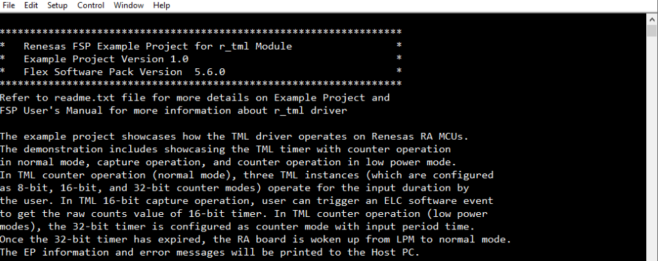

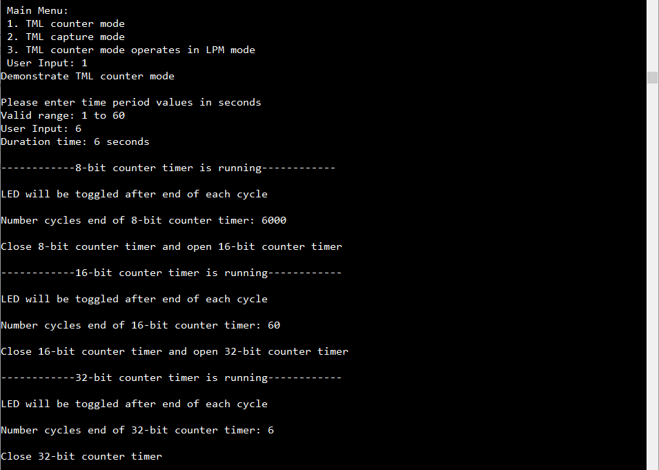

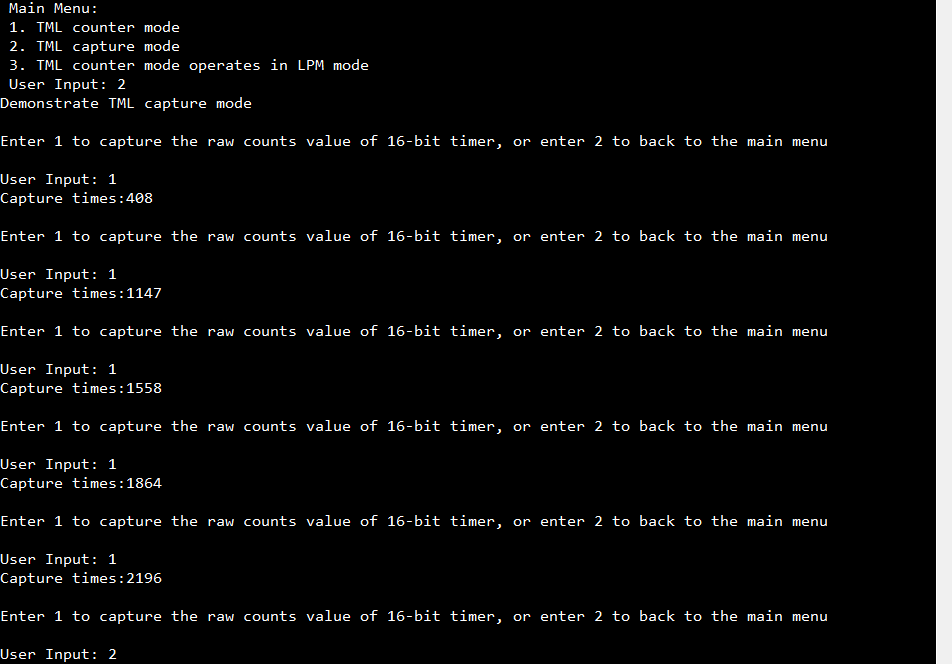
  
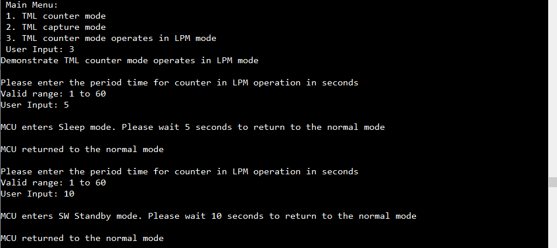

For using the SEGGER J-Link RTT Viewer:
* To utilize SEGGER RTT instead of the Serial Terminal, please follow the instructions below:

 In e2studio: Project Properties -> C/C++ Build -> Settings -> Tool Settings -> GNU ARM Cross C Compiler -> Preprocessor -> Modify the macro USE_VIRTUAL_COM=1 to USE_VIRTUAL_COM=0.

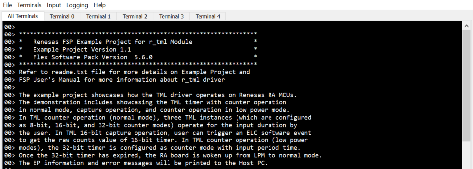

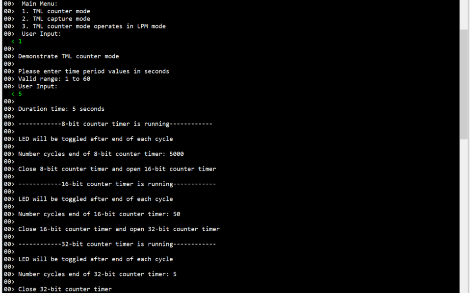

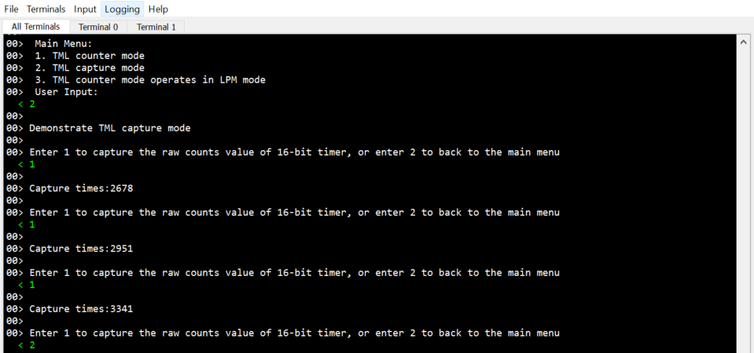
  
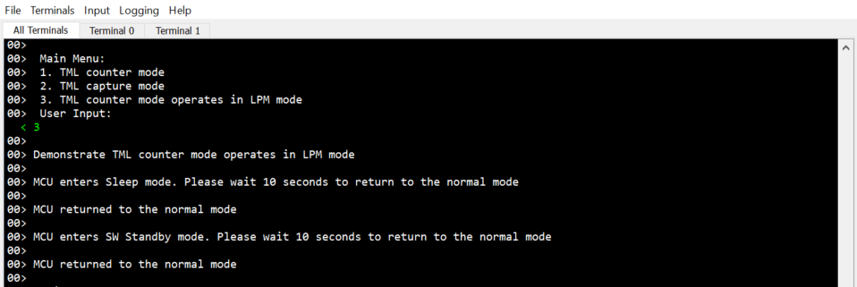

## Special Topics ##
### SEGGER J-Link RTT Viewer in Low Power Modes ###
The RTT console comes in handy to view the application messages while running/debugging the application. While you are using the RTT console, the debugger script for the LPM must be selected

Open J-Link RTT Viewer console -> File -> Connect -> Script file (optional) -> Select the RA_MCU_low_power_mode.JLinkScript, which is attached as part of this project.

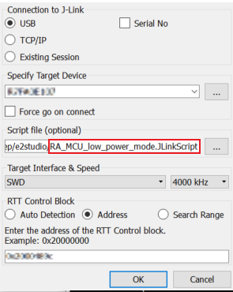

### Debugging Low Power Modes ###
By default, it is not possible to debug the low power modes of an RA device. If an application tries to enter Sleep mode, pending a peripheral interrupt to wake it, this will not happen as it will be woken almost immediately by a debug interrupt.

If the application tries to enter Software or Deep Software Standby modes, then the connection between the CPU and the IDE will be lost, closing the debug session within the IDE.

However, if the supplied debug script is specified then it will be possible to debug the low power modes.

**Note:** Follow the below introduction to add the debugger script to E2Studio.

Open E2studio -> Run -> Debug Configurations and configure the debugger as shown in the figure below.

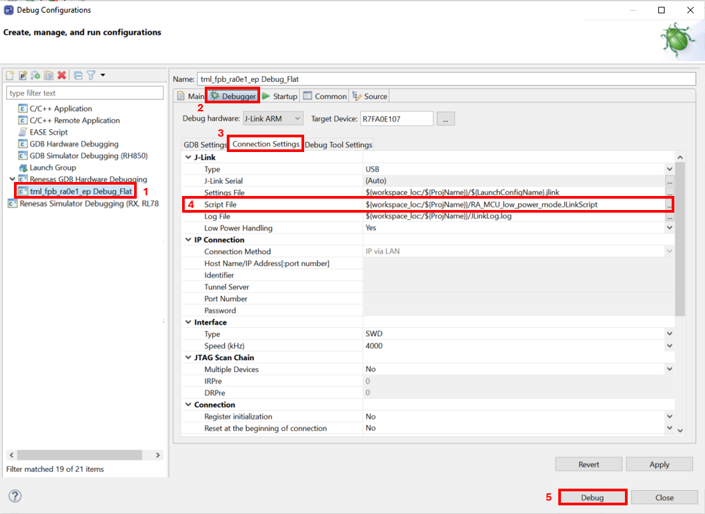
