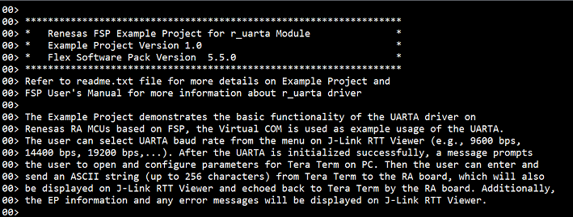

# Introduction #
The Example Project demonstrates the basic functionality of the UARTA driver on Renesas RA MCUs based on FSP, the Virtual COM is used as example usage of the UARTA. The user can select UARTA baud rate from the menu on J-Link RTT Viewer (e.g., 9600 bps, 14400 bps, 19200 bps,...). After the UARTA is initialized successfully, a message prompts the user to open and configure parameters for Tera Term on PC. Then the user can enter and send an ASCII string (up to 256 characters) from Tera Term to the RA board, which will also be displayed on J-Link RTT Viewer and echoed back to Tera Term by the RA board. Additionally, the EP information and any error messages will be displayed on J-Link RTT Viewer.

Please refer to the [Example Project Usage Guide](https://github.com/renesas/ra-fsp-examples/blob/master/example_projects/Example%20Project%20Usage%20Guide.pdf) 
for general information on example projects and [readme.txt](./readme.txt) for specifics of operation.

## Required Resources ## 
To build and run the UARTA example project, the following resources are needed.

### Software ###
* Renesas Flexible Software Package (FSP): Version 6.0.0
* e2 studio: Version 2025-04.1
* SEGGER J-Link RTT Viewer: Version 8.44a
* GCC ARM Embedded Toolchain: Version 13.2.1.arm-13-7
* Terminal Console Application: Tera Term or a similar application

### Hardware Requirements ###
Supported RA board: FPB-RA0E1  
* 1 x RA board.
* 1 x USB type C cable for programming and debugging.

### Hardware Connections ###
* Connect the USB Debug port on the RA board to the host PC via a USB type C cable.
* To use J-Link OB VCOM:
    - Short the E4 trace.
    - Replace R10 by 150ohm resistor. 

Refer to the software required section in [Example Project Usage Guide](https://github.com/renesas/ra-fsp-examples/blob/master/example_projects/Example%20Project%20Usage%20Guide.pdf) for basic information on setting up and using the above software

## Related Collateral References ##
The following documents can be referred to for enhancing your understanding of 
the operation of this example project:
- [FSP User Manual on GitHub](https://renesas.github.io/fsp/)
- [FSP Known Issues](https://github.com/renesas/fsp/issues)

# Project Notes #

## System Level Block Diagram ##
High level block diagram of the system is shown below:
 

## FSP Modules Used ##
List all the various modules that are used in this example project. Refer to the FSP User Manual for further details on each module listed below.

| Module Name | Usage | Searchable Keyword  |
|-------------|-----------------------------------------------|-----------------------------------------------|
| UARTA | UARTA is used to communicate with the serial terminal on the host PC via the uart interface. | r_uarta |

## Module Configuration Notes ##
This section describes FSP Configurator properties which are important or different than those selected by default. 

**Configuration Properties for using UARTA**

|   Module Property Path and Identifier   |   Default Value   |   Used Value   |   Reason   |
|-----------------------------------------|-------------------|----------------|------------|
| configuration.xml > g_uarta UART (r_uarta) > Properties > Settings > Property > Common > DTC Support | Disabled | Enabled | Enable DTC for support the UARTA module. |
| configuration.xml > g_uarta UART (r_uarta) > Properties > Settings > Property > Common > Receive Error Interrupt Mode | Enabled | Disabled | The UARTA0_ERRI interrupt is generated when a reception error occurs. |
| configuration.xml > g_uarta UART (r_uarta) > Properties > Settings > Property > Module g_uarta UART (r_uarta) > General > Channel | 0 | 0 | Use UARTA channel 0 to communicate with the terminal application on the host PC. |
| configuration.xml > g_uarta UART (r_uarta) > Properties > Settings > Property > Module g_uarta UART (r_uarta) > General > Data Bits | 8bits | 8bits | Select 8 bits data length. |
| configuration.xml > g_uarta UART (r_uarta) > Properties > Settings > Property > Module g_uarta UART (r_uarta) > General > Parity | None | None | Select no check Parity. |
| configuration.xml > g_uarta UART (r_uarta) > Properties > Settings > Property > Module g_uarta UART (r_uarta) > General > Stop Bits | 1bit | 1bit | Select 1 bit stop. |
| configuration.xml > g_uarta UART (r_uarta) > Properties > Settings > Property > Module g_uarta UART (r_uarta) > Extra > Transfer Order | LSB first | LSB first | Select LSB first for transmission and reception order. |
| configuration.xml > g_uarta UART (r_uarta) > Properties > Settings > Property > Module g_uarta UART (r_uarta) > Extra > Transfer level | Positive logic | Positive logic | Select Positive logic for transmission and reception level . |
| configuration.xml > g_uarta UART (r_uarta) > Properties > Settings > Property > Module g_uarta UART (r_uarta) > Interrupts > Callback | NULL | uarta_callback | It is called from the interrupt service routine (ISR) upon UART transaction completion reporting the transaction status. |
| configuration.xml > g_uarta UART (r_uarta) > Properties > Settings > Property > Module g_uarta UART (r_uarta) > Interrupts > Receive Interrupt Priority | Priority 2 | Priority 2 | Select the UARTA receive interrupt priority level. |
| configuration.xml > g_uarta UART (r_uarta) > Properties > Settings > Property > Module g_uarta UART (r_uarta) > Interrupts > Transmit Interrupt Priority | Priority 2 | Priority 2 | Select the UARTA transmit interrupt priority level. |
| configuration.xml > g_uarta UART (r_uarta) > Properties > Settings > Property > Module g_uarta UART (r_uarta) > Interrupts > Error Interrupt Priority | Disabled | Priority 2 | Select the UARTA error priority level. |

## API Usage ##
The table below lists the FSP provided API used at the application layer in this example project.

| API Name    | Usage                                                                          |
|-------------|--------------------------------------------------------------------------------|
| R_UARTA_Open | This API is used to initialize the UARTA module. |
| R_UARTA_Write | This API is used to perform a write operation. |
| R_UARTA_Close | This API is used to de-initialize the UARTA module. |
| R_UARTA_BaudCalculate | This API is used to calculate baud rate register settings for UARTA module. |
| R_BSP_SoftwareDelay | This API is used to delay a specified period of time. |

## Verifying operation ##
1. Import, generate, and build the example project.
2. Connect the RA board to the host PC via USB cable.
3. Flash or debug the example project.
4. Open J-Link RTT viewer on the host PC.
5. After the main menu is displayed on J-Link RTT Viewer, the user can select baud rate option as desired.
    * Type '1' to select baud rate = 9600 bps.
    * Type '2' to select baud rate = 14400 bps.
	* Type '3' to select baud rate = 19200 bps.
	* Type '4' to select baud rate = 38400 bps.
	* Type '5' to select baud rate = 57600 bps.
	* Type '6' to select baud rate = 115200 bps.
5. Open the Tera Term application on the host PC.  
6. Open the COM port and set parameters for the Tera Term application as message was displayed on the J-Link RTT Viewer.
    * Note:  
        * To echo back characters typed in Tera Term, the user needs to enable it through [Setup] -> [Terminal...] -> Check [Local echo].  
        * To make sure the received data shows properly, the user needs to set [Setup] -> [Terminal...] -> [Receive: CR + LF].  
        * The configuration parameters of the serial port on the terminal application are as follows:  
            * COM port is provided by the J-Link on-board.  
			* Baud rate: Base on the user's selection. 
			* Data length: 8-bits    
			* Parity: none  
			* Stop bit: 1-bit  
			* Flow control: none    
7. Type any ASCII string (up to 256 characters) into the Tera Term, then press enter-key to send.
8. View the output log on J-Link RTT Viewer and Tera Term.

The EP information image:

The EP menu:

After UARTA initialized successfully, the instruction message was shown:

The received string image (RTT Viewer):

The echo string image (Tera term):

