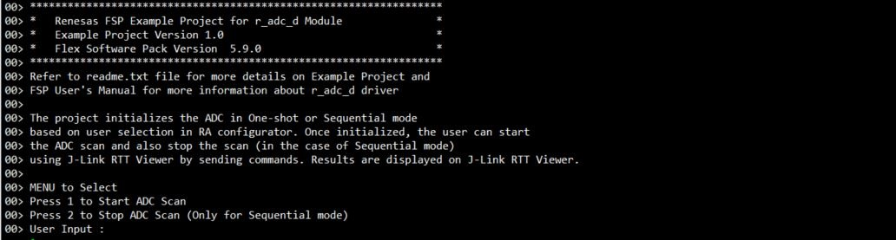
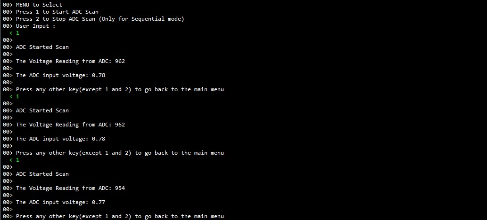
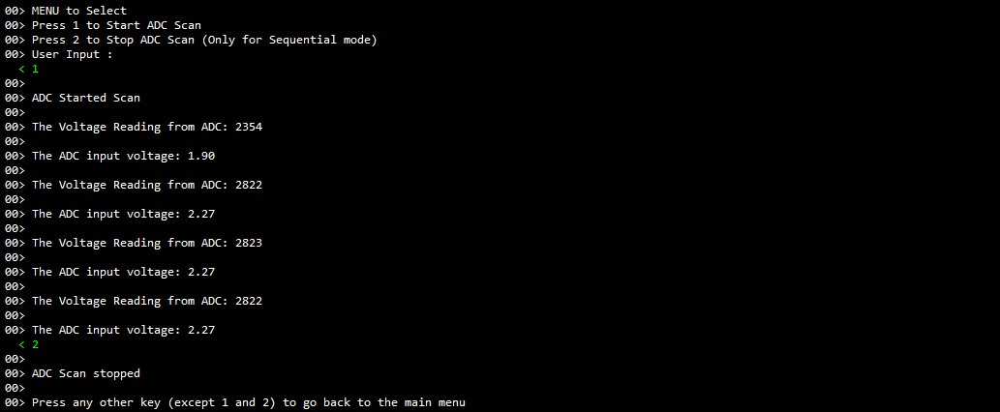

# Introduction #
 
This example project demonstrates basic functionalities of ADC driver, including the ADC's Window Compare Mode on Renesas RA MCUs based on Renesas FSP. An RTT input command triggers the ADC scan to read the analog data of adc channel and outputs the converted data onto the RTT output. The project initializes the ADC in single scan or continuous scan mode based on the user selection in RA configurator. Once initialized, the user can initiate the ADC scan and also stop the scan (in the case of continuous scan mode) using J-Link RTT Viewer by sending commands. The user provides ADC channel input voltage from 0V to 3.3V with a variable power supply unit at the ADC channel voltage input pin. Once ADC scan is initialized, Window Compare Mode is enabled and compares the ADC channel input voltage with the upper and lower limits. The upper limit and lower limit are configured in RA Configurator. If the ADC channel input voltage is above the upper limit or below the lower limit, it triggers an event and notifies the user to act accordingly. Result and ADC status are displayed on the J-Link RTT Viewer.

Note:
* For FPB-RA0E1, FPB-RA0E2 does not support Window Compare Mode and operates with One-shot or Sequential mode.
* MCK-RA6T2 does not support Window Compare Mode and operates with internal temperature sensor.

Please refer to the [Example Project Usage Guide](https://github.com/renesas/ra-fsp-examples/blob/master/example_projects/Example%20Project%20Usage%20Guide.pdf) 
for general information on example projects and [readme.txt](./readme.txt) for specifics of operation.

## Required Resources ## 
To build and run the ADC example project, the following resources are needed.

### Hardware ###
* 1 x Renesas RA board.
* 1 x Type-C USB cable for programming and debugging.
* 1 x External Variable DC Power supply.
* Some jumper wires to connect External Variable DC Power supply with RA board.

Refer to [readme.txt](./readme.txt) for information on how to connect the hardware.

### Software ###
1. Refer to the software required section in [Example Project Usage Guide](https://github.com/renesas/ra-fsp-examples/blob/master/example_projects/Example%20Project%20Usage%20Guide.pdf)

### Hardware Connections ###
ADC Channel Voltage Input Pin:
* For EK-RA2A1:
     * AN01 P501
     * Connect AVSS0 (J2:36) to VREFL0 (J2:34) using a jumper or wire.
	
* For EK-RA2E1, EK-RA2L1, EK-RA4E2, EK-RA4M1, EK-RA4M2, EK-RA4M3, EK-RA6E2, EK-RA6M1, EK-RA6M2, EK-RA6M3, EK-RA6M3G, EK-RA6M4, EK-RA6M5, FPB-RA6E1, FPB-RA4E1, MCK-RA4T1, MCK-RA6T3, FPB-RA2E3:
	* AN000 P000
	
* For EK-RA2E2:
	* AN009 P014
	
* For EK-RA4W1:
	* AN04 P004
	
* For RSSK-RA6T1:
	* AN002 P002
	
* For EK-RA8M1, EK-RA8D1:
	* AN000 P004
	
* For MCK-RA8T1:
	* AN002 P006 (CN1:9)
	
* For EK-RA2A2:
	* AN000 P014
	
* For FPB-RA0E1:
	* AN000 P010

* For FPB-RA8E1:
	* AN00 P004 (J1:20)

* For EK-RA4L1:
	* AN002 P004 (J1:7)

* For FPB-RA0E2:
     * To use P011 on J2: The soldering bridge E48 must be closed.
     * AN001 P011 (J2:26)

## Related Collateral References ##
The following documents can be referred to for enhancing your understanding of 
the operation of this example project:
- [FSP User Manual on GitHub](https://renesas.github.io/fsp/)
- [FSP Known Issues](https://github.com/renesas/fsp/issues)

# Project Notes #

## System Level Block Diagram ##
 High level block diagram
  

FPB-RA0E1, MCK-RA6T2, FPB-RA0E2 does not support Window Compare Mode.

## FSP Modules Used ##
List of important modules that are used in this example project. Refer to the FSP User Manual for further details on each module listed below.

| Module Name | Usage | Searchable Keyword  |
|-------------|-----------------------------------------------|-----------------------------------------------|
|ADC | Driver for the ADC peripheral to demonstrate basic functionalities of ADC, including the Window Compare Mode on Renesas RA MCUs. | adc|

For FPB-RA0E1, FPB-RA0E2:

| Module Name | Usage | Searchable Keyword  |
|-------------|-----------------------------------------------|-----------------------------------------------|
|ADC_D | Driver for the ADC_D peripheral to demonstrate basic functionalities of ADC on Renesas RA MCUs. | adc_d|

## Module Configuration Notes ##
This section describes FSP Configurator properties which are important or different than those selected by default. 

|   Module Property Path and Identifier   |   Default Value   |   Used Value   |   Reason   |
| :-------------------------------------: | :---------------: | :------------: | :--------: |
| configuration.xml > Stacks > g_adc ADC (r_adc_d) > Properties > Settings > Property > Module g_adc ADC (r_adc_d) > General > Conversion operation | One-shot | Sequential | To select the conversion operation mode. |
| configuration.xml > Stacks > g_adc ADC (r_adc_d) > Properties > Settings > Property > Module g_adc ADC (r_adc_d) > General > Operation trigger | Wait | No-wait | To select the operation trigger mode. |
| configuration.xml > Stacks > g_adc ADC (r_adc_d) > Properties > Settings > Property > Module g_adc ADC (r_adc_d) > Input > A/D Input channel | Channel 0 (channels 0-3 in scan mode) | Channel 1 (channels 1-4 in scan mode) |  To select Pin for ADC Channel - channel availability varies by MCU. |
| configuration.xml > Stacks > g_adc ADC (r_adc_d) > Properties > Settings > Property > Module g_adc ADC (r_adc_d) > Interrupts > Conversion Result upper/lower bound value setting > Upper bound (ADUL) value | 255 | 255 | To configure the upper limit conversion value that corresponds to the condition to generate an interrupt request (INTAD). |
| configuration.xml > Stacks > g_adc ADC (r_adc_d) > Properties > Settings > Property > Module g_adc ADC (r_adc_d) > Input > Interrupts > Conversion Result upper/lower bound value setting > Lower bound (ADLL) value | 0 | 0 | To configure the lower limit conversion value that corresponds to the condition to generate an interrupt request (INTAD). |

The table below lists the FSP provided API used at the application layer by this example project.

| API Name    | Usage                                                                          |
|-------------|--------------------------------------------------------------------------------|
| R_ADC_D_Open | This API is used to Open the ADC_D instance. |
| R_ADC_D_ScanCfg | This API is used to configure the ADC_D scan parameters.  |
| R_ADC_D_Calibrate | This API is used to initiate ADC_D Calibration. |
| R_ADC_D_ScanStart | This API is used to start the ADC_D Scan.  |
| R_ADC_D_Read | This API is used to read the adc converted value from the specific ADC_D channel.  |
| R_ADC_D_ScanStop | This API is used to stop the ADC_D scan. |
| R_ADC_D_Close | This API is used to close the ADC_D module. |
| R_ADC_D_StatusGet | This API is used get the ADC_D status. |

## Verifying operation ##
1. Import, generate and build the example project.
   Before running the example project, make sure hardware connections are done.
2. Download the example project to one Renesas RA board and run the project.
3. Now open J-Link RTT Viewer and connect to RA MCU board.
4. The user can perform Menu option operations and check corresponding results J-Link RTT Viewer.
5. Also the user can supply input voltage to ADC scan channel pin and verify result on J-Link RTT Viewer.
6. If the ADC value is outside the window compare, it status is shown in the J-Link RTT Viewer. The Boundary values of ADC Window Compare Mode are
     * Upper Reference is 2.5V
     * Reference Voltage is 3.3V
          * Note: FPB-RA0E1, MCK-RA6T2, FPB-RA0E2 does not support Window Compare Mode.

## ADC Value calculation ##

   Digital Output = (2^n * Analog input voltage)/(Reference Voltage)
          n = Number of bits
          Digital Output is then converted to its Binary Equivalent

   For Example:
   1) If the Analog input voltage is 1.5V
        For 12 bit ADC
        Digital Output = (2^12 * 1.5)/3.3
                       = (4096 * 1.5)/3.3
                       = 6144/3.3
        Digital Output = 1861
        
        For 16 bit ADC
        Digital Output = (2^15 * 1.5)/3.3
                       = (32768 * 1.5)/3.3
                       = 49152/3.3
        Digital Output = 14894
    
    Note: Limitation for 16 bit ADC - Refer: Table 32.13 A/D conversion result output ranges of each A/D conversion in the RA2A1 User Manual (R01UH0888EJ0100 Rev.1.00)
        
   
   Below images showcases the ADC output for Continuous mode on J-Link RTT Viewer:

   

   ADC output in One-shot mode J-Link RTT Viewer:

   

   ADC output in Sequential mode J-Link RTT Viewer:

   