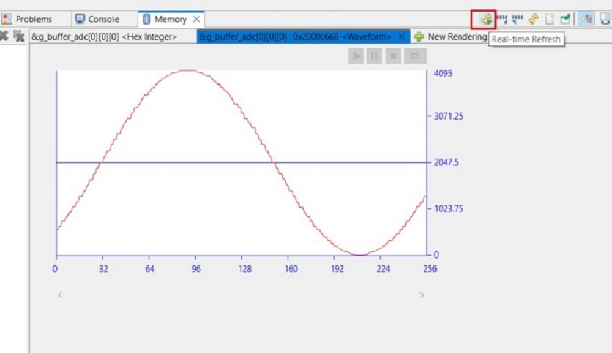
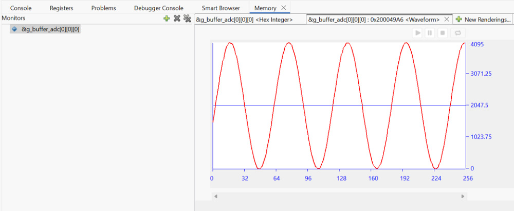
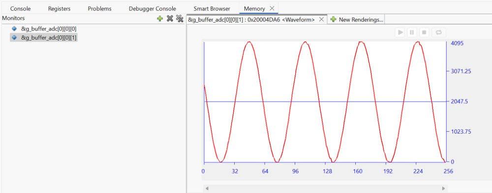

# Introduction #
The sample code accompanying this file shows the operation of an ADC TAU Interval Sampling using the ADC, DTC, TAU, and ELC peripheral on a RA MCU. ADC TAU Interval Sampling allows users to sample analog signals at periodic intervals with a double buffer. The frequency of sampling is determined by the settings of the TAU linked to the ADC unit by the ELC. The DTC is used to transfer data from the ADC data registers to the circular buffer. Using the DTC allows the CPU to be used for other operations. When the first buffer is filled completely, the CPU executes the ADC Interrupt service routine to switch to the DTC to fill the second buffer with ADC values, Raise a flag/event to allow processing on the data available in the first buffer. Such functionality is popular for Data signal acquisition applications that require a continuous sampling of Analog signals.

Please refer to the [Example Project Usage Guide](https://github.com/renesas/ra-fsp-examples/blob/master/example_projects/Example%20Project%20Usage%20Guide.pdf) 
for general information on example projects and [readme.txt](./readme.txt) for specifics of operation.

## Required Resources ##
To build and run the ADC TAU Interval Sampling, the following resources are needed.

### Software ###
Refer to software described in [Example Project Usage Guide](https://github.com/renesas/ra-fsp-examples/blob/master/example_projects/Example%20Project%20Usage%20Guide.pdf)

### Hardware ###
Supported RA boards: FPB-RA0E1, FPB-RA0E2
* 1 x Renesas RA board.
* 1 x Type-C USB cable for programming and debugging.
* 1 x Breadboard.
* 1 x Signal generator.
* Some jumper wires.

### Hardware Connections ###
* The connection from the signal generator to breadboard:
  * Connect input signal (i.e 800Hz) to the horizontal line of the breadboard.

* Connect pins mentioned bellow to horizontal holes of the breadboard so that all pins are shorted to receive a input signal. 
* Connect GND of the signal generator to GND of the RA board.

* Note: All the channels are connected to the same input signal for testing, the user can configure channels to other input frequencies as per requirement.

* For FPB-RA0E1 (Supporting 16 bit TAU timer):
  * To use P010 and P011 on J2: E26 and E25 must be closed.
  * ADC Unit: AN000 P010 (J2:32), AN001 P011 (J2:31).

* For FPB-RA0E2 (Supporting 16 bit TAU timer):
  * To use P010 and P011 on J2: E49 and E48 must be closed.
  * ADC Unit: AN000 P010 (J2:27), AN001 P011 (J2:26).

# Project Notes #
## System Level Block Diagram ##

## FSP Modules Used ##
List all the various modules that are used in this example project. Refer to the FSP User Manual for further details on each module listed below.

| Module Name | Usage  | Searchable Keyword (using New Stack > Search) |
|-------------|-----------------------------------------------|-----------------------------------------------|
| ADC_D |ADC_D is used in group scan mode to scan the input sinusoidal signal connected to ADC channels.| ADC |
| DTC |DTC is used to transfer data from the ADC data registers to the circular buffer. | DTC |
| TAU |TAU is used to generate ADC group scan trigger at periodic interval.| TAU |
| ELC |ELC is used to link ADC with TAU module for Hardware triggering.| ELC |

## Module Configuration Notes ##
This section describes FSP Configurator properties which are important or different than those selected by default.

**Configuration Properties for ADC**
|   Module Property Path and Identifier   |   Default Value   |   Used Value   |   Reason   |
| :-------------------------------------: | :---------------: | :------------: | :--------: |
|   configuration.xml -> Stacks > g_adc0 ADC (r_adc_d) > Properties > Settings > Property > Module g_adc0 ADC (r_adc_d) > General > Conversion operation |   One-Shot   |   One-Shot   |  Specifies the Conversion operation that this ADC is used in.  |
|   configuration.xml -> Stacks > g_adc0 ADC (r_adc_d) > Properties > Settings > Property > Module g_adc0 ADC (r_adc_d) > General > Operation trigger |   Wait   |   No-wait   |  Specifies the Operation trigger that this ADC is used in.  |
|   configuration.xml -> Stacks > g_adc0 ADC (r_adc_d) > Properties > Settings > Property > Module g_adc0 ADC (r_adc_d) > Input > Channel Selection Mode  |   Select  |   Scan  |   Configures to scan Channel 0 and 1 for ADC group.   |
|   configuration.xml -> Stacks > g_adc0 ADC (r_adc_d) > Properties > Settings > Property > Module g_adc0 ADC (r_adc_d) > Interrupts > Start trigger source  |   TAU0_TMI01  |   TAU0 TMI00  |   Specifies the trigger for Group scanning.  |
|   configuration.xml -> Stacks > g_adc0 ADC (r_adc_d) > Properties > Settings > Property > Module g_adc0 ADC (r_adc_d) > Interrupts > Callback  |   NULL  |   g_adc0_callback  |   It is called from the interrupt service routine (ISR) each time the ADC scan completes.   |
|   configuration.xml -> Stacks > g_adc0 ADC (r_adc_d) > Properties > Settings > Property > Module g_adc0 ADC (r_adc_d) > Interrupts > Scan End Interrupt Priorty  |   Disable |   Priority 2  |   Select scan end interrupt priority.  |

**Configuration Properties for TAU timer**
|   Module Property Path and Identifier   |   Default Value   |   Used Value   |   Reason   |
| :-------------------------------------: | :---------------: | :------------: | :--------: |
|   configuration.xml -> Stacks > g_timer0 Timer, Independent Channel, 16-bit and 8-bit Timer Operation (r_tau) > Properties > Settings > Property > Module g_timer0 Timer, Independent Channel, 16-bit and 8-bit Timer Operation (r_tau) > General > Period |   0x10000  |  21  |   Time period for free running timer.   |
|   configuration.xml -> Stacks > g_timer0 Timer, Independent Channel, 16-bit and 8-bit Timer Operation (r_tau) > Properties > Settings > Property > Module g_timer0 Timer, Independent Channel, 16-bit and 8-bit Timer Operation (r_tau) > General > Period Unit |  Raw count  | Microseconds  | Unit of the period specified above.  |
|   configuration.xml -> Stacks > g_timer0 Timer, Independent Channel, 16-bit and 8-bit Timer Operation (r_tau) > Properties > Settings > Property > Module g_timer0 Timer, Independent Channel, 16-bit and 8-bit Timer Operation (r_tau) > Interrupt > Interrupt Priority |  Disable | Priority 2  | Select the timer interrupt priority.  |

**Configuration Properties for DTC**
|   Module Property Path and Identifier   |   Default Value   |   Used Value   |   Reason   |
| :-------------------------------------: | :---------------: | :------------: | :--------: |
|   configuration.xml -> Stacks > g_transfer_adc0_group Transfer (r_dtc) ADC0 Scan End (End of A/D scanning operation) > Properties > Settings > Property > Module g_transfer_adc0_group Transfer (r_dtc) ADC0 Scan End (End of A/D scanning operation) > Mode  |   Normal  |   Repeat  |  One transfer per activation, Repeat Area address reset after Number of Transfers, transfer repeats until stopped.  |
|   configuration.xml -> Stacks > g_transfer_adc0_group Transfer (r_dtc) ADC0 Scan End (End of A/D scanning operation) > Properties > Settings > Property > Module g_transfer_adc0_group Transfer (r_dtc) ADC0 Scan End (End of A/D scanning operation) > Destination Address Mode  |   Fixed |   Incremented  |  Select the address mode for the destination. Destination address get incremented after each transfer.|
|   configuration.xml -> Stacks > g_transfer_adc0_group Transfer (r_dtc) ADC0 Scan End (End of A/D scanning operation) > Properties > Settings > Property > g_transfer_adc0_group Transfer (r_dtc) ADC0 Scan End (End of A/D scanning operation) > Repeat Area (Unused in Normal Mode) |   Source  |   Destination |  Destination address resets to its initial value after completing Number of Transfers.   |
|   configuration.xml -> Stacks > g_transfer_adc0_group Transfer (r_dtc) ADC0 Scan End (End of A/D scanning operation) > Properties > Settings > Property > g_transfer_adc0_group Transfer (r_dtc) ADC0 Scan End (End of A/D scanning operation) > Number of Transfer  |   0  |   64  |  Specify the number of transfers to be performed. |
|   configuration.xml -> Stacks > g_transfer_adc0_group Transfer (r_dtc) ADC0 Scan End (End of A/D scanning operation) > Properties > Settings > Property > g_transfer_adc0_group Transfer (r_dtc) ADC0 Scan End (End of A/D scanning operation) > Activation Source  |   Disable  |   ADC0_SCAN_END (End of A/D scanning operation)  |  Select the DTC transfer start event. |

## API Usage ##
The table below lists the FSP provided API used at the application layer by this example project.

 | API Name    | Usage                                                                          |
|-------------|--------------------------------------------------------------------------------|
|R_ADC_D_Open| This API is used to open ADC_D Module.|
|R_ADC_D_ScanCfg| This API is used to configure scan setting for ADC Module.|
|R_ADC_D_ScanStart | This API is used to Start scanning of ADC channel connected to ADC peripheral, when ADC Periodic operation starts the API waits until trigger event are received.|
|R_ADC_D_Close| This API is used to close the opened ADC Module, when any failure occur.|
|R_TAU_Open| This API is used to open  TAU timer in interval timer function.|
|R_TAU_Start| This API is used to Start TAU timer in interval timer function , when timer starts it trigger ADC group scan at set interval timer.|
|R_TAU_Close| This API is used to close the opened TAU Module, when any failure occur.|
|R_ELC_Open| This API is used to open  ELC Module.|
|R_ELC_Enable| This API is used to Enable ELC function.|
|R_ELC_Close| This API is used to close the opened ELC Module, when any failure occur.|
|R_DTC_Open| This API is used to open DTC Module.|
|R_DTC_Enable| This API is used to enable transfers on this activation source. when enable api is called it transfer data on every group scan complete event.|
|R_DTC_Reconfigure| This API is used to reconfigure DTC with chain mode transfer info.|
|R_DTC_Close| This API is used to close the opened DTC Module, when any failure occur.|

## Verifying operation ##
### Setting up waveform rendering ###
* To set waveform rendering the user needs to first debug the code and then go to memory view and add g_user buffer under memory monitor.
* The user can view any of the respective channel by adding specific ADC Unit buffer under memory monitor, for e.g ADC Unit 0 Group Channel 0 samples can be viewed by selecting &g_buffer_adc[0][0][0].
  This way other ADC Units, group, and channels can be selected. 
* Then click on New Rendering -> Waveform -> Waveform properties
* Set the waveform properties as Data size to 16 bit, user-specified minimum and maximum values for Y-axis on signal generator, Channel to Mono, Buffer size as 512.
  **Note:** 12 bit ADC will have minimum and maximum value between 0-4095. As Ping-Pong buffer is used, the buffer size is 512 (i.e 256*2) for each channel, where 2 denotes the number of buffers and 256 is the size of the buffer.
    The user can add the buffer address of each channel in the memory to view the waveform of each channel connected.
  
### Input for Signal generator ###
* The signal needs to be generated from the Signal Generator for the Input to the ADC (0-3V Sinusoidal) with a frequency set to 800Hz.

Import, Build and Debug the EP (*see section Starting Development* of **FSP User Manual**). After running the EP, open waveform rendering in memory viewer to see the output
of sampled data. One can also check the buffer in real-time by adding it to the expression tab. 

Click Real-time Refresh on Memory monitor tab to check buffer in real-time:

Below images showcase the output on waveform rendering of ADC for each channel of group:
* ADC Group channel 0 (g_buffer_adc[0][0][0]):

* ADC Group channel 1 (g_buffer_adc[0][0][1]):

 

## Special Topics ##
### Setting up Chain Mode in DTC ###
* The chain mode can be set up by declaring local transfer info structure containing info related to Chain Mode Transfer and configure DTC with the same info.
  The table below lists the transfer info elements required for chain transfer
  | Transfer info element   | transfer info 0               |       transfer info 1              |
  |-------------|-------------------------------------------|------------------------------------|
  |Transfer mode | Normal mode| Normal mode|
  |Source address control | Fixed | Fixed |
  |Destination address control | Incremented| Incremented|
  |Chain transfer  | Enabled | Disable|
  |Transfer block size | 2 bytes | 2 bytes|
  |Transfer source address | R_ADDR0| &R_ADDR1|
  |Transfer destination address | g_buffer[unit 0][Group scan][channel 0][0][0]| g_buffer[unit 0][Group scan][channel 1][0][0]|
  
**Note:** Above table shows chain transfer for group of ADC Unit 0 same way this can be updated for other ADC units and group.
          The user can also update their info as per requirement
* After A/D conversion is completed, the DTC is activated by an A/D Scan complete interrupt request.
  Once the DTC is activated, it reads transfer info for transfer_adc_group[0] which is a local buffer, and copy values of register ADDR0
  to the destination buffer location of DTC g_buffer_adc[0]. Since chain transfer is enabled, so the DTC successively reads transfer_adc_group[1](i.e channel 1 of ADC unit 0 group).
* Once DTC operation for transfer_adc_group[1] starts it transfers values of registers ADDR1 to the destination buffer g_buffer_adc[1]. Since chain transfer is disabled in transfer info of A[1],
  data transfer by the DTC is completed here.
  

### Calculating Time period and ADC Trigger Raw count ###
* To calculate the Time period of tau timer use 
  Time period = 1/input frequency (where input sampling frequency is 2 * signal generator input frequency).
  This calculated Time Period can be set as TAU Time period in the properties tab.
* To calculate Raw period count for ADC trigger use
   Raw period count =  (Time period in seconds * (ICLK / (2^ pre scaler)))
  (where prescaler value is 0 by default so 2^0 = 1)
  **Note :** ICLK frequency will vary as per MCU variant.
  
### Ping Pong Buffer Operation ###
* The DTC is used to transfer data from the ADC data registers to the Ping-Pong buffer.
* Using the DTC allows the CPU to be used for other operations.
* When the first buffer is filled completely(i.e desired sample size), a DTC activation source generates an interrupt to the CPU.
* The CPU executes the ADC Interrupt service routine to:
* Switch to the DTC to fill the second buffer with ADC values, and allow processing on the data available in the first buffer.

  