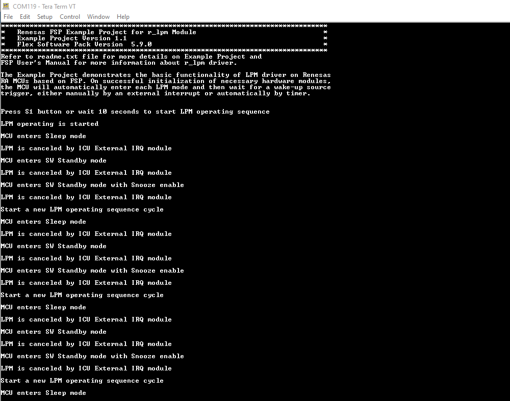
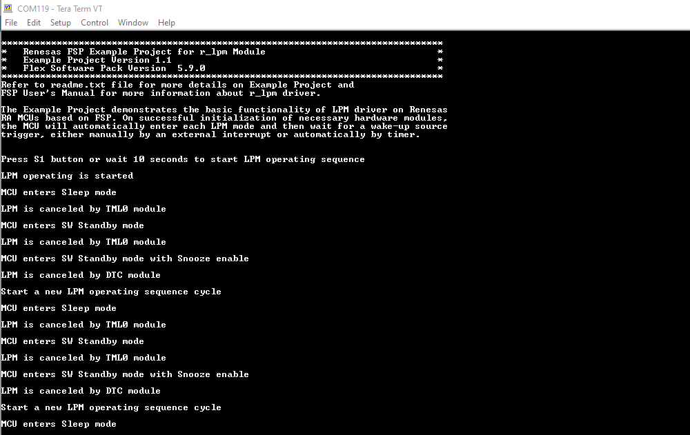

# Introduction #
This project demonstrates the basic functionalities of the Low Power Mode module (LPM) on Renesas RA MCUs using Renesas FSP. The project also illustrates methods to reduce MCU power consumption and restore the pre-LPM states of peripheral modules. The EP will perform different low power mode transitions based on the user's selection of Low Power Mode, request, and cancel sources in the RA Configurator. The MCU will automatically enter each LPM mode and then wait for cancel sources to trigger manually by an external interrupt or automatically by a timer to exit LPM mode. Turn OFF the LED1 and display the LPM Mode Name before entering each LPM mode. Turn ON the LED1 and display the cancel source name after exiting each LPM mode. The EP log will print to the Host PC via the UART interface at a baud rate of 115200 bps. The LED2 will turn ON if an error occurs.

Please refer to the [Example Project Usage Guide](https://github.com/renesas/ra-fsp-examples/blob/master/example_projects/Example%20Project%20Usage%20Guide.pdf) 
for general information on example projects and [readme.txt](./readme.txt) for specifics of operation.

## Required Resources ## 
To build and run the LPM example project, the following resources are needed.

### Hardware ###
* 1 x Renesas RA board.
* 1 x USB cable for programing and debugging.
	* Type-C USB cable: MCK-RA6T2, MCK-RA4T1, MCK-RA6T3, MCK-RA8T1, FPB-RA0E1, FPB-RA8E1, EK-RA4L1
	* Mini USB cable: RSSK-RA6T1
	* Micro USB cable: the other boards
* For RA boards do not support J-Link On Board VCOM functionality: EK-RA2A1, EK-RA2E1, EK-RA2E2, EK-RA2L1, EK-RA4M1, EK-RA4M2, EK-RA4M3,EK-RA4W1, EK-RA6M1, EK-RA6M2, EK-RA6M3, EK-RA6M3G, EK-RA6M4, EK-RA6M5, FPB-RA4E1, FPB-RA6E1, MCK-RA6T2, RSSK-RA6T1
	* 1 x USB to UART Converter (e.g, Pmod USBUART: https://digilent.com/shop/pmod-usbuart-usb-to-uart-interface/)
		* Jumper JP1 placement is LCL-VCC pins (The attached system board is powered independently from the Pmod USBUART).
	* 1 x Micro USB cable for boards have to use Pmod USBUART.
* For RSSK-RA6T1, MCK-RA4T1, MCK-RA6T3, MCK-RA8T1:
	* 1 x Pmod BTN.

Refer to [readme.txt](./readme.txt) for information on how to connect the hardware.

### Software ###
* Renesas Flexible Software Package (FSP): Version 5.9.0
* e2 studio: Version 2025-04
* GCC ARM Embedded Toolchain: Version 13.2.1.arm-13-7
* Terminal Console Application: Tera Term or a similar application

Refer to the software required section in [Example Project Usage Guide](https://github.com/renesas/ra-fsp-examples/blob/master/example_projects/Example%20Project%20Usage%20Guide.pdf)

## Related Collateral References ##
The following documents can be referred to for enhancing your understanding of 
the operation of this example project:
- [FSP User Manual on GitHub](https://renesas.github.io/fsp/)
- [FSP Known Issues](https://github.com/renesas/fsp/issues)

# Project Notes #
## System Level Block Diagram ##
High level block diagram of the system is as shown below:
 

**For FPB-RA0E1, FPB-RA0E2:**

## FSP Modules Used ##
List all the various modules that are used in this example project. Refer to the FSP User Manual for further details on each module listed below.

| Module Name | Usage | Searchable Keyword  |
|-------------|-----------------------------------------------|-----------------------------------------------|
| LPM | LPM is used to configure power cancellation, mode selection and return the MCU to low power mode to reduce power consumption. | r_lpm |
| ULPT / AGT | ULPT/AGT is used to automatically cancel LPM modes; it is used as the request source and end source in snooze mode if the MCU supports this mode. | r_ulpt / r_agt |
| External IRQ | External IRQ is used to manually cancel the LPM modes. | r_icu |
| DTC | DTC is used to automatically cancel Snooze mode, only used on MCUs that support Snooze mode. | r_dtc |
| SCI UART | SCI UART is used to print the log of the example project to the terminal application. | r_sci_uart / r_sci_b_uart |

**For FPB-RA0E1, FPB-RA0E2:**

| Module Name | Usage | Searchable Keyword  |
|-------------|-----------------------------------------------|-----------------------------------------------|
| TML | TML is used to automatically cancel LPM modes. | r_tml |
| UART | UART is used to print the log of the example project to the terminal application. | r_uarta |

## Example Project Coverage ###
**Transition sequences**
|   Transition sequence   |   Supported MCU Lines  |
|-----------|----------------------|
| Normal → Sleep → Normal | Supported by all MCU lines | 
| Normal → Deep Sleep → Normal | Supported by RA8 MCU lines |
| Normal → SW Standby → Normal | Supported by all MCU lines |
| Normal → SW Standby → Snooze → SW Standby → Snooze → Normal | Supported by all MCU lines except RA8 MCU lines |
| Normal → Deep SW Standby → Normal | Supported by RA4E2, RA4M2, RA4M3, RA4E1, RA4T1, RA6 MCU lines, and RA8 MCU lines |

**Cancel/End sources selected for the MCU only support Sleep, SW Standby, and Snooze modes**
|   Board   |   Cancel Sleep mode  |   Cancel SW Standby mode   |   Cancel Snooze mode   |  Request / End Snooze mode   |
|-----------|----------------------|----------------------------|------------------------|------------------------------|
| EK-RA2A1 | IRQ6 AGT1_AGTI | IRQ6 AGT1_AGTI | DTC_COMPLETE | AGT1_AGTI |
| EK-RA2L1 | IRQ3 AGT1_AGTI | IRQ3 AGT1_AGTI | DTC_COMPLETE | AGT1_AGTI |
| EK-RA2E1 | IRQ3 AGT1_AGTI | IRQ3 AGT1_AGTI | DTC_COMPLETE | AGT1_AGTI |
| EK-RA2E2 | IRQ1 AGT1_AGTI | IRQ1 AGT1_AGTI | DTC_COMPLETE | AGT1_AGTI |
| EK-RA4M1 | IRQ0 AGT1_AGTI | IRQ0 AGT1_AGTI | DTC_COMPLETE | AGT1_AGTI |
| EK-RA4W1 | IRQ4 AGT1_AGTI | IRQ4 AGT1_AGTI | DTC_COMPLETE | AGT1_AGTI |
| FPB-RA2E3 | IRQ0 AGT1_AGTI | IRQ0 AGT1_AGTI | DTC_COMPLETE | AGT1_AGTI |
| EK-RA2A2 | IRQ0 AGTW1_AGTI | IRQ0 AGTW1_AGTI | DTC_COMPLETE | AGTW1_AGTI |
| FPB-RA0E1| IRQ0 TML32_ITL_OR | IRQ0 TML32_ITL_OR | DTC_COMPLETE | DTCENST1_ST33 |
| EK-RA4L1| IRQ6 AGT1_AGTI | IRQ6 AGT1_AGTI | DTC_COMPLETE | AGT1_AGTI |
| FPB-RA0E2| IRQ0 TML32_ITL_OR | IRQ0 TML32_ITL_OR | DTC_COMPLETE | DTCENST1_ST33 |

**Cancel/End sources selected for the MCU only support Sleep, SW Standby, Snooze mode, and Deep SW Standby modes**
|   Board   |   Cancel Sleep mode  |   Cancel SW Standby mode   |   Cancel Snooze mode   |  Request / End Snooze mode   |   Cancel Deep SW Standby mode   |
|-----------|----------------------|----------------------------|------------------------|------------------------------|---------------------------------|
| EK-RA4M2 | IRQ10-DS AGT1_AGTI | IRQ10-DS AGT1_AGTI | DTC_COMPLETE | AGT1_AGTI | IRQ10-DS AGT1_AGTI |
| EK-RA4M3 | IRQ10-DS AGT1_AGTI | IRQ10-DS AGT1_AGTI | DTC_COMPLETE | AGT1_AGTI | IRQ10-DS AGT1_AGTI |
| EK-RA6M1 | IRQ0-DS AGT1_AGTI | IRQ0-DS AGT1_AGTI | DTC_COMPLETE | AGT1_AGTI | IRQ0-DS AGT1_AGTI |
| EK-RA6M2 | IRQ0-DS AGT1_AGTI | IRQ0-DS AGT1_AGTI | DTC_COMPLETE | AGT1_AGTI | IRQ0-DS AGT1_AGTI |
| EK-RA6M3 | IRQ13-DS AGT1_AGTI | IRQ13-DS AGT1_AGTI | DTC_COMPLETE | AGT1_AGTI | IRQ13-DS AGT1_AGTI |
| EK-RA6M3G | IRQ13-DS AGT1_AGTI | IRQ13-DS AGT1_AGTI | DTC_COMPLETE | AGT1_AGTI | IRQ13-DS AGT1_AGTI |
| EK-RA6M4 | IRQ10-DS AGT1_AGTI | IRQ10-DS AGT1_AGTI | DTC_COMPLETE | AGT1_AGTI | IRQ10-DS AGT1_AGTI |
| EK-RA6M5 | IRQ10-DS AGT1_AGTI | IRQ10-DS AGT1_AGTI | DTC_COMPLETE | AGT1_AGTI | IRQ10-DS AGT1_AGTI |
| EK-RA4E2 | IRQ10-DS AGT1_AGTI | IRQ10-DS AGT1_AGTI | DTC_COMPLETE | AGT1_AGTI | IRQ10-DS AGT1_AGTI |
| EK-RA6E2 | IRQ10-DS AGT1_AGTI | IRQ10-DS AGT1_AGTI | DTC_COMPLETE | AGT1_AGTI | IRQ10-DS AGT1_AGTI |
| FPB-RA4E1 | IRQ1-DS AGT1_AGTI | IRQ1-DS AGT1_AGTI | DTC_COMPLETE | AGT1_AGTI | IRQ1-DS AGT1_AGTI |
| FPB-RA6E1 | IRQ1-DS AGT1_AGTI | IRQ1-DS AGT1_AGTI | DTC_COMPLETE | AGT1_AGTI | IRQ1-DS AGT1_AGTI |
| MCK-RA4T1 | IRQ14-DS AGT1_AGTI | IRQ14-DS AGT1_AGTI | DTC_COMPLETE | AGT1_AGTI | IRQ14-DS AGT1_AGTI |
| MCK-RA6T2 | IRQ12-DS AGT1_AGTI | IRQ12-DS AGT1_AGTI | DTC_COMPLETE | AGT1_AGTI | IRQ12-DS AGT1_AGTI |
| MCK-RA6T3 | IRQ14-DS AGT1_AGTI | IRQ14-DS AGT1_AGTI | DTC_COMPLETE | AGT1_AGTI | IRQ14-DS AGT1_AGTI |
| RSSK-RA6T1 | IRQ6-DS AGT1_AGTI | IRQ6-DS AGT1_AGTI | DTC_COMPLETE | AGT1_AGTI | IRQ6-DS AGT1_AGTI |

**Cancel/End sources selected for MCU only support Sleep, Deep Slep, SW Standby, and Deep SW Standby modes**
|   Mode   |   Cancel Sleep mode  |   Cancel Deep Sleep mode   |   Cancel SW Standby mode   |   Cancel Deep SW Standby mode   |
|----------|----------------------|----------------------------|----------------------------|---------------------------------|
| EK-RA8M1 | IRQ13-DS ULPT0_ULPTI | IRQ13-DS ULPT0_ULPTI | IRQ13-DS ULPT0_ULPTI | IRQ13-DS ULPT0_ULPTI |
| EK-RA8D1 | IRQ13-DS ULPT0_ULPTI | IRQ13-DS ULPT0_ULPTI | IRQ13-DS ULPT0_ULPTI | IRQ13-DS ULPT0_ULPTI |
| MCK-RA8T1 | IRQ3-DS ULPT0_ULPTI  | IRQ3-DS ULPT0_ULPTI  | IRQ3-DS ULPT0_ULPTI  | IRQ3-DS ULPT0_ULPTI  |
| FPB-RA8E1 | IRQ13-DS ULPT0_ULPTI  | IRQ13-DS ULPT0_ULPTI  | IRQ13-DS ULPT0_ULPTI  | IRQ13-DS ULPT0_ULPTI  |

## Module Configuration Notes ##
This section describes FSP Configurator properties which are important or different than those selected by default. 

**Configuration Properties for Sleep mode LPM instance**
|   Module Property Path and Identifier   |   Default Value   |   Used Value   |   Reason   |
|-----------------------------------------|-------------------|----------------|------------|
| configuration.xml > Stacks > g_lpm_sleep Low Power Modes (r_lpm) > Properties > Settings > Property > Module g_lpm_sleep Low Power Modes (r_lpm) > General > Low Power Mode | Sleep mode | Sleep mode | Select sleep mode for this LPM instance. |

**Configuration Properties for SW Standby mode LPM instance**
|   Module Property Path and Identifier   |   Default Value   |   Used Value   |   Reason   |
|-----------------------------------------|-------------------|----------------|------------|
| configuration.xml > Stacks > g_lpm_sw_standby Low Power Modes (r_lpm) > Properties > Settings > Property > Module g_lpm_sw_standby Low Power Modes (r_lpm) > General > Low Power Mode | Sleep mode | Software Standby mode | Select Software Standby mode for this LPM instance. |
| configuration.xml > Stacks > g_lpm_sw_standby Low Power Modes (r_lpm) > Properties > Settings > Property > Module g_lpm_sw_standby Low Power Modes (r_lpm) > Deep Sleep and Standby Options > Wake Sources > IRQ0 | ☐ | ☑ | Select IRQ0 interrupt as source to cancel SW Standby mode. |
| configuration.xml > Stacks > g_lpm_sw_standby Low Power Modes (r_lpm) > Properties > Settings > Property > Module g_lpm_sw_standby Low Power Modes (r_lpm) > Deep Sleep and Standby Options > Wake Sources > 32-bit interval timer interrupt | ☐ | ☑ | Select 32-bit interval timer interrupt as the source to cancel SW Standby mode. |

**Configuration Properties for Snooze mode LPM instance**  
|   Module Property Path and Identifier   |   Default Value   |   Used Value   |   Reason   |
|-----------------------------------------|-------------------|----------------|------------|
| configuration.xml > Stacks > g_lpm_sw_standby_with_snooze Low Power Modes (r_lpm) > Properties > Settings > Property > Module g_lpm_sw_standby_with_snooze Low Power Modes (r_lpm) > General > Low Power Mode | Sleep mode | Snooze mode | Select Snooze mode for this LPM instance. |
| configuration.xml > Stacks > g_lpm_sw_standby_with_snooze Low Power Modes (r_lpm) > Properties > Settings > Property > Module g_lpm_sw_standby_with_snooze Low Power Modes (r_lpm) > Deep Sleep and Standby Options > Wake Sources > IRQ0 | ☐ | ☑ | Select IRQ0 interrupt as source to cancel deep sleep mode. |
| configuration.xml > Stacks > g_lpm_sw_standby_with_snooze Low Power Modes (r_lpm) > Properties > Settings > Property > Module g_lpm_sw_standby_with_snooze Low Power Modes (r_lpm) > Deep Sleep and Standby Options > Snooze Options > DTC state in Snooze Mode | Disabled | Enabled | Enable wake from snooze from this source. |
| configuration.xml > Stacks > g_lpm_sw_standby_with_snooze Low Power Modes (r_lpm) > Properties > Settings > Property > Module g_lpm_sw_standby_with_snooze Low Power Modes (r_lpm) > Deep Sleep and Standby Options > Snooze Options > Snooze Cancel Source | None | DTC Transfer Complete | Select DTC Transfer Complete interrupt as the source to cancel snooze. |  

**Configuration Properties for using UART**
|   Module Property Path and Identifier   |   Default Value   |   Used Value   |   Reason   |
|-----------------------------------------|-------------------|----------------|------------|
| configuration.xml > Stacks > g_uart UART (r_uarta) > Properties > Settings > Property > Module g_uart UART (r_uarta) > General > Data Bits | 8bits | 8bits | Select the data bit length of 8 bits for a UART frame. |
| configuration.xml > Stacks > g_uart UART (r_uarta) > Properties > Settings > Property > Module g_uart UART (r_uarta) > General > Parity | None | None | Do not use the parity check feature. |
| configuration.xml > Stacks > g_uart UART (r_uarta) > Properties > Settings > Property > Module g_uart UART (r_uarta) > General > Stop Bits | 1bit | 1bit | Select the stop bit length of 1 bit for a UART frame. |
| configuration.xml > Stacks > g_uart UART (r_uarta) > Properties > Settings > Property > Module g_uart UART (r_uarta) > Baud > Baud Rate | 115200 | 115200 | Select a baud rate of 115200 bits per second. |
| configuration.xml > Stacks > g_uart UART (r_uarta) > Properties > Settings > Property > Module g_uart UART (r_uarta) > Interrupts > Callback | NULL | uart_callback | It is called from the interrupt service routine (ISR) upon UART transaction completion reporting the transaction status. |

**Configuration Properties for using TML**
|   Module Property Path and Identifier   |   Default Value   |   Used Value   |   Reason   |
|-----------------------------------------|-------------------|----------------|------------|
| configuration.xml > Stacks > g_timer_cancel_lpm 32-bit Interval Timer (r_tml) > Properties > Settings > Property > Module g_timer_cancel_lpm 32-bit Interval Timer (r_tml) > General > Channel Selection | 0 | 0 | Use TML Channel 0 to cancel LPM modes. |
| configuration.xml > Stacks > g_timer_cancel_lpm 32-bit Interval Timer (r_tml) > Properties > Settings > Property > Module g_timer_cancel_lpm 32-bit Interval Timer (r_tml) > General > Mode | 16-bit Counter Mode | 32-bit Counter Mode | Configure the ULPT timer in 32-bit Counter Mode. |
| configuration.xml > Stacks > g_timer_cancel_lpm 32-bit Interval Timer (r_tml) > Properties > Settings > Property > Module g_timer_cancel_lpm 32-bit Interval Timer (r_tml) > Counter Mode Settings > Period | 0x10000 | 10 | Set the periodic value for the TML timer. |
| configuration.xml > Stacks > g_timer_cancel_lpm 32-bit Interval Timer (r_tml) > Properties > Settings > Property > Module g_timer_cancel_lpm 32-bit Interval Timer (r_tml) > Counter Mode Settings > Period Unit | Raw Counts | Seconds | Set the periodic for the TML timer to 10 seconds. |
| configuration.xml > Stacks > g_timer_cancel_lpm 32-bit Interval Timer (r_tml) > Properties > Settings > Property > Module g_timer_cancel_lpm 32-bit Interval Timer (r_tml) > Interrupt > Callback function | NULL | timer_cancel_lpm_callback | It is called from the interrupt service routine (ISR) each time the timer period elapses. |
| configuration.xml > Stacks > g_timer_cancel_lpm 32-bit Interval Timer (r_tml) > Properties > Settings > Property > Module g_timer_cancel_lpm 32-bit Interval Timer (r_tml) > Interrupt > Priority | Disabled | Priority 3 | Select TML interrupt priority. |

**Configuration Properties for using External IRQ**
|   Module Property Path and Identifier   |   Default Value   |   Used Value   |   Reason   |
|-----------------------------------------|-------------------|----------------|------------|
| configuration.xml > Stacks > g_external_irq External IRQ (r_icu) > Properties > Settings > Property > Module g_external_irq External IRQ (r_icu) > Trigger | Rising | Falling | Detect button press using falling edge. |
| configuration.xml > Stacks > g_external_irq External IRQ (r_icu) > Properties > Settings > Property > Module g_external_irq External IRQ (r_icu) > Digital Filtering | Disabled | Disabled | Do not use digital filtering in LPM modes. |
| configuration.xml > Stacks > g_external_irq External IRQ (r_icu) > Properties > Settings > Property > Module g_external_irq External IRQ (r_icu) > Callback | NULL | external_irq_cancel_lpm_callback | It is called from the interrupt service routine (ISR) upon a falling edge is detected on the IRQ pin. |
| configuration.xml > Stacks > g_external_irq External IRQ (r_icu) > Properties > Settings > Property > Module g_external_irq External IRQ (r_icu) > Pin Interrupt Priority | Priority 12 | Priority 12 | Select the External IRQ interrupt priority. |

**Configuration Properties for using DTC**
|   Module Property Path and Identifier   |   Default Value   |   Used Value   |   Reason   |
|-----------------------------------------|-------------------|----------------|------------|
|   configuration.xml > Stacks > g_dtc_cancel_snooze Transfer (r_dtc) TML0 ITL OR (TML timer event) > Properties > Settings > Property > Module g_dtc_cancel_snooze Transfer (r_dtc) TML0 ITL OR (TML timer event) > Mode  |   Normal  |   Normal  |  One transfer per activation, transfer ends after Number of Transfer.   |
|   configuration.xml > Stacks > g_dtc_cancel_snooze Transfer (r_dtc) TML0 ITL OR (TML timer event) > Properties > Settings > Property > Module g_dtc_cancel_snooze Transfer (r_dtc) TML0 ITL OR (TML timer event) > Destination Address Mode  |   Fixed |   Fixed  |  Select the address mode for the destination.   |
|   configuration.xml > Stacks > g_dtc_cancel_snooze Transfer (r_dtc) TML0 ITL OR (TML timer event) > Properties > Settings > Property > Module g_dtc_cancel_snooze Transfer (r_dtc) TML0 ITL OR (TML timer event) > Interrupt Frequency |   After all transfers have completed  |   After each transfer |  Select to have interrupt after each transfer   |
|   configuration.xml > Stacks > g_dtc_cancel_snooze Transfer (r_dtc) TML0 ITL OR (TML timer event) > Properties > Settings > Property > Module g_dtc_cancel_snooze Transfer (r_dtc) TML0 ITL OR (TML timer event) > Number of Transfer  |   0  |   1  |  Specify the number of transfers to be performed. |
|   configuration.xml > Stacks > g_dtc_cancel_snooze Transfer (r_dtc) TML0 ITL OR (TML timer event) > Properties > Settings > Property > Module g_dtc_cancel_snooze Transfer (r_dtc) TML0 ITL OR (TML timer event) > Activation Source  |   Disable  |   TML0 ITL OR (TML timer event)  |  Select TML0 ITL OR (TML timer event) as the the DTC transfer start event. |

## API Usage ##
The table below lists the FSP provided API used at the application layer by this example project.

| API Name | Usage |
|-------------|--------------------------------------------------------------------------------|
| R_LPM_Open | This API is used to initialize the LMP module. |
| R_LPM_LowPowerModeEnter | This API is used to enter low power mode. |
| R_LPM_Close | This API is used to de-initialize the LMP module. |
| R_UARTA_Open | This API is used to initialize the UART module. |
| R_UARTA_Write | This API is used to perform a write operation via the UART interface. |
| R_UARTA_Close | This API is used to de-initialize the UART module. |
| R_ICU_ExternalIrqOpen | This API is used to initialize an IRQ input pin for use with the external interrupt interface. |
| R_ICU_ExternalIrqEnable | This API is used to enable external interrupts for a specified channel. |
| R_ICU_ExternalIrqDisable | This API is used to disable external interrupts for a specified channel. |
| R_ICU_ExternalIrqClose | This API is used to de-initialize the external interrupt channel. |
| R_TML_Open | This API is used to initialize the TML module. |
| R_TML_Start | This API is used to start the TML timer. |
| R_TML_Stop | This API is used to stop the TML timer. |
| R_TML_Reset | This API is used to reset the counter value of the TML timer. |
| R_TML_Close | This API is used to de-initialize the TML module. |
| R_DTC_Open | This API is used to initialize the DTC module. |
| R_DTC_Close | This API is used to de-initialize the DTC module. |
| R_DTC_Enable | This API is used to enable transfer on this activation source. |
| R_DTC_Disable | This API is used to disable transfer on this activation source. |
| R_BSP_SoftwareDelay | This API is used to delay a specified period of time. |

## Verifying operation ##
1. Download the example project to the RA board using the USB debug port. J-Link may be disconnected when MCU enter LPM mode stop debugging after downloading the EP.
2. Open a terminal application on the host PC and connect to the COM Port provided by the J-Link onboard or Pmod USBUART.
* The configuration parameters of the serial port on the terminal application are as follows:
    * Baud rate: 115200 bps
	* Data length: 8-bits  
	* Parity: none
	* Stop bit: 1-bit
	* Flow control: none
3. Power-cycle the kits.
* Power-cycle the kit is required to avoid influence of debugging into cancel LPM mode. When the influence happens. The log "LPM is canceled, but source has not been detected" will be printed.
4. Press the user push-button S1 or wait 10 seconds to enter and cancel LPM mode. It will turn OFF LED1 before entering each LPM mode and turn ON LED1 after exiting each LPM mode.
5. The LPM mode name will display on the terminal application before entering each LPM mode, and the canceling source name will display on the terminal application after exiting each LPM mode.

* The serial log when use push-button S1 to cancel/end lpm mode 

* The serial log when the EP automation cancel/end lpm mode

