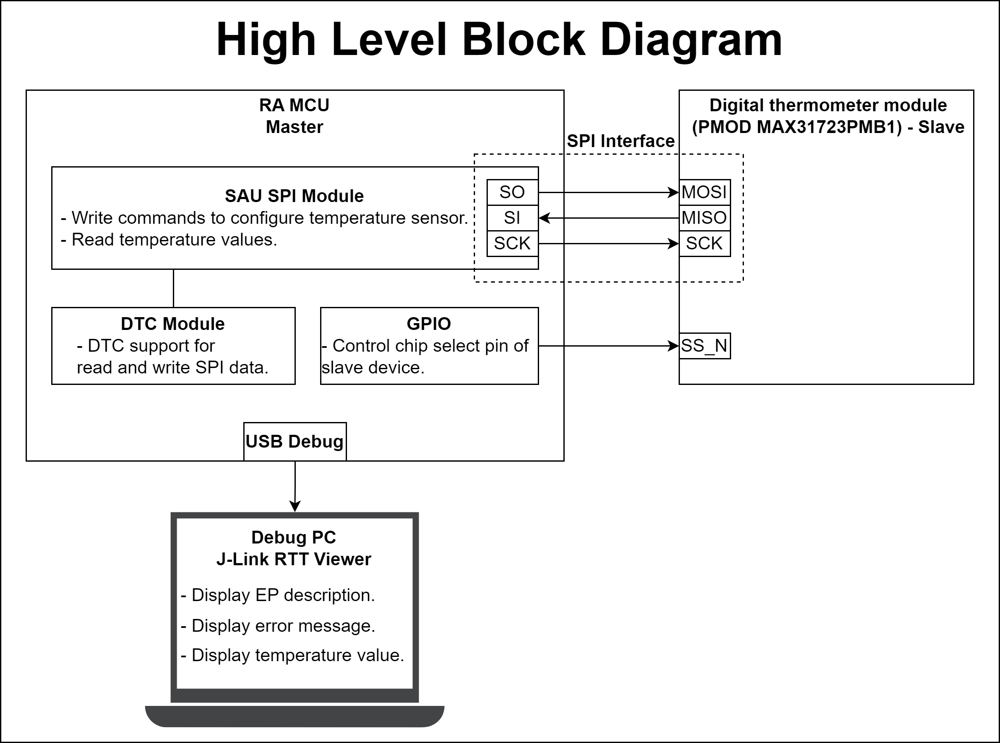
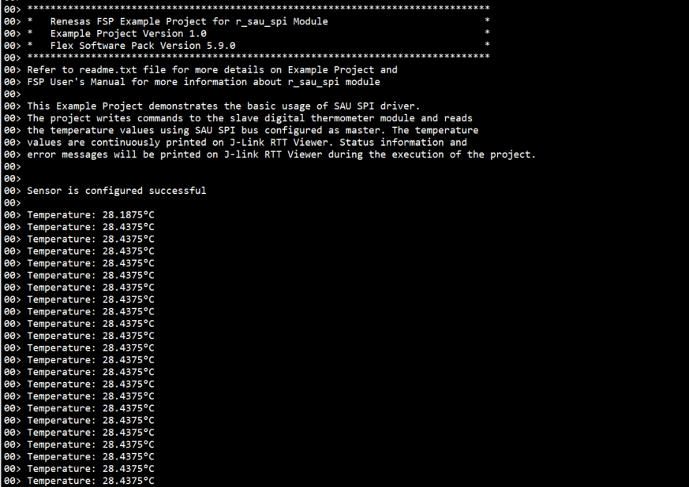

# Introduction #

This Example Project demonstrates the basic usage of SAU SPI driver. The project writes commands to the slave digital thermometer module, and reads the temperature values using SAU SPI bus configured as master. The temperature values are continuously printed on J-Link RTT Viewer. Status information and error messages will be printed on J-link RTT Viewer during the execution of the project.

Please refer to the [Example Project Usage Guide](https://github.com/renesas/ra-fsp-examples/blob/master/example_projects/Example%20Project%20Usage%20Guide.pdf) 
for general information on example projects and [readme.txt](./readme.txt) for specifics of operation.

## Required Resources ## 
To build and run the SAU SPI example project, the following resources are needed.

### Software ###
* Renesas Flexible Software Package (FSP): Version 5.9.0
* e2 studio: Version 2025-04
* SEGGER J-Link RTT Viewer: Version 8.12f
* GCC ARM Embedded Toolchain: Version 13.2.1.arm-13-7

Refer to the software required section in [Example Project Usage Guide](https://github.com/renesas/ra-fsp-examples/blob/master/example_projects/Example%20Project%20Usage%20Guide.pdf) for basic information on setting up and using the above software.

### Hardware ###
Supported RA Boards: FPB-RA0E1, FPB-RA0E2
* 1 x Renesas RA board.
* 1 x Type-C USB cable for programming and debugging.
* 1 x Digital thermometer module (PMOD MAX31723PMB1).
  * Link product: [PMOD MAX31723PMB1](https://www.mouser.com/ProductDetail/Analog-Devices-Maxim-Integrated/MAX31723PMB1?qs=UmMSjoC1xtH8e742i4OoUA%3D%3D).
  * Manufacturer Product Number: MAX31723PMB1#
* 1 x Host PC.

**Select SPI communication protocol on the PMOD MAX31723PMB1 by configuring the following jumper configurations on JP1:**

### Hardware Connections ###
* PMOD MAX31723PMB1:
	* Select SPI communication protocol on the PMOD by configuring the following jumper configurations on JP1:
    * Connect JP1-3 to JP1-5
    * Connect JP1-4 to JP1-6
    * Connect JP1-9 to JP1-10

* For FPB-RA0E1, FPB-RA0E2:
  * Connect the RA board to the host PC via a Type-C USB cable.
  * Connect PMOD MAX31723PMB1 (J1) to the RA board via the Pmod1 Port (PMOD1). Please carefully align pin 1 on the Temperature sensor with pin 1 on the PMOD1.

## Related Collateral References ##
The following documents can be referred to for enhancing your understanding of the operation of this example project:
- [FSP User Manual on GitHub](https://renesas.github.io/fsp/)
- [FSP Known Issues](https://github.com/renesas/fsp/issues)

# Project Notes #

## System Level Block Diagram ##
High level block diagram of the system is as shown below:
 

## FSP Modules Used ##
List all the various modules that are used in this example project. Refer to the FSP User Manual for further details on each module listed below.

| Module Name | Usage | Searchable Keyword  |
|-------------|-----------------------------------------------|-----------------------------------------------|
| SAU SPI | SAU SPI is used to communicate with the digital thermometer module. | r_sau_spi |
| I/O Port | I/O Port is used to drive SS_N pin of the digital thermometer module. | r_ioport|

## Module Configuration Notes ##
This section describes FSP Configurator properties which are important or different than those selected by default. 

The SAU channel depend on the board type, refer to [readme.txt](./readme.txt) for information on how to select the correct channel.

**Configuration Properties for using SAU SPI**

|   Module Property Path and Identifier   |   Default Value   |   Used Value   |   Reason   |
|-----------------------------------------|-------------------|----------------|------------|
| configuration.xml > Stacks > g_sau_spi SPI (r_sau_spi) > Properties > Settings > Property > Common > Enable Single Channel | Disable | 00 | Enable single channel to reduce code size if only channel 00 or 20 is to be configured for SAU SPI. |
| configuration.xml > Stacks > g_sau_spi SPI (r_sau_spi) > Properties > Settings > Property > Module g_sau_spi SPI (r_sau_spi) > Channel | 00 | 00 | Use SAU SPI Channel 00 to communicate with the digital thermometer module. |
| configuration.xml > Stacks > g_sau_spi SPI (r_sau_spi) > Properties > Settings > Property > Module g_sau_spi SPI (r_sau_spi) > Bitrate | 500000 | 5000000 | Use the fastest bitrate support by SAU SPI and the PMOD MAX31723PMB1 module.|
| configuration.xml > Stacks > g_sau_spi SPI (r_sau_spi) > Properties > Settings > Property > Module g_sau_spi SPI (r_sau_spi) > Callback | sau_spi_callback | sau_spi_callback | A user callback function that is called from the sau spi interrupts when a transfer is completed or an error has occurred. |
| configuration.xml > Stacks > g_sau_spi SPI (r_sau_spi) > Properties > Settings > Property > Module g_sau_spi SPI (r_sau_spi) > Transmit End Interrupt Priority | Priority 2 | Priority 2 | Select the transmit end interrupt priority. |
| configuration.xml > Stacks > g_sau_spi SPI (r_sau_spi) > Properties > Settings > Property > Common > DTC Support | Disable | Enable | Enable DTC Support. |

**Configuration Properties for using GPIO**

**For FPB-RA0E1:**
|   Module Property Path and Identifier   |   Default Value   |   Used Value   |   Reason   |
|-----------------------------------------|-------------------|----------------|------------|
| configuration.xml > Pins tab > Pin Selection > Ports > P1 > P103 > Pin Configuration > Mode | Disable | Output mode (Initial Low) | Use P103 as output to drive SS_N pin of slave device during transfer process. |

**For FPB-RA0E2:**
|   Module Property Path and Identifier   |   Default Value   |   Used Value   |   Reason   |
|-----------------------------------------|-------------------|----------------|------------|
| configuration.xml > Pins tab > Pin Selection > Ports > P2 > P207 > Pin Configuration > Mode | Disable | Output mode (Initial Low) | Use P207 as output to drive SS_N pin of slave device during transfer process. |

## API Usage ##
The table below lists the FSP provided API used at the application layer by this example project.

| API Name    | Usage                                                                          |
|-------------|--------------------------------------------------------------------------------|
| R_SAU_SPI_Open | This API is used to initialize the SAU SPI module. |
| R_SAU_SPI_Write | This API is used to configure the digital thermometer module. |
| R_SAU_SPI_WriteRead | This API is used to write command to the digital thermometer module and read temperature values. |
| R_SAU_SPI_Close | This API is used to de-initialize the SAU SPI module. |
| R_IOPORT_PinWrite | This API is used to drive Slave Select Pin during transmission. |
| R_BSP_SoftwareDelay | This API is used to delay a specified period of time. |

## Verifying operation ##
1. Import, generate and build the example project.
2. Connect Digital thermometers module to RA board.
3. Connect the RA board to the host PC.
4. Flash or debug the EP.
5. Open the RTT Viewer and view output log.
  
  
