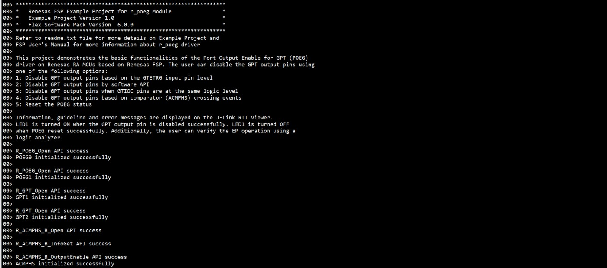
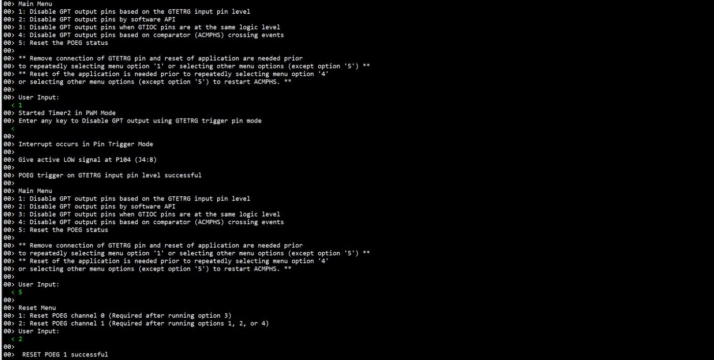
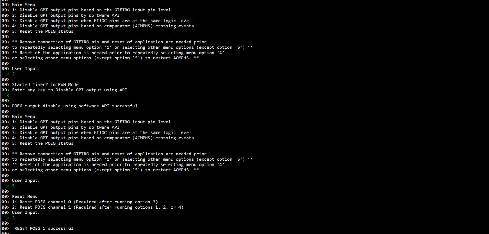
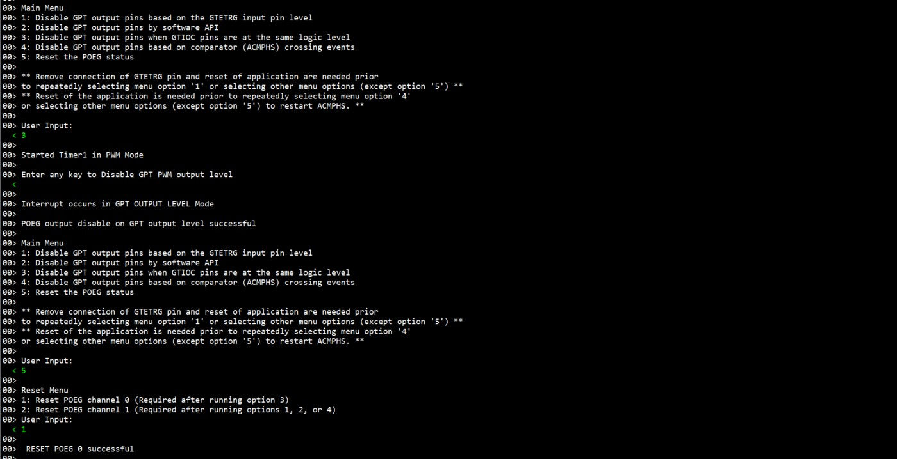
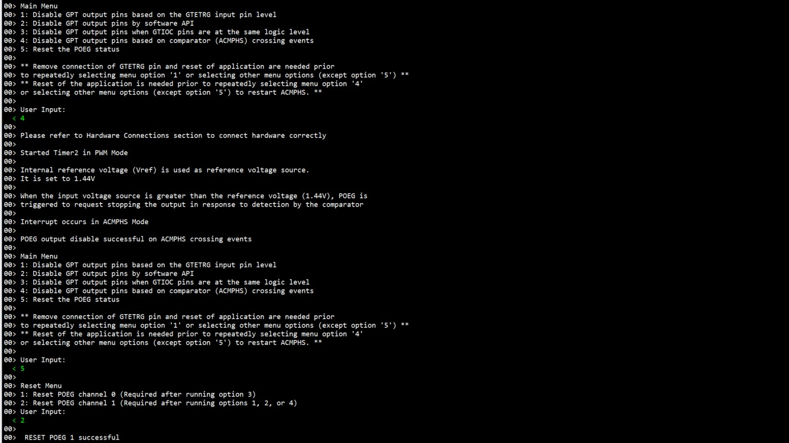
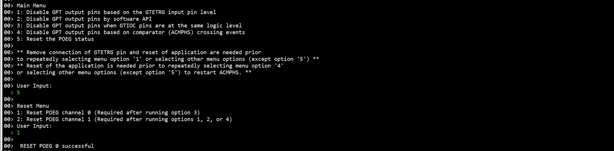
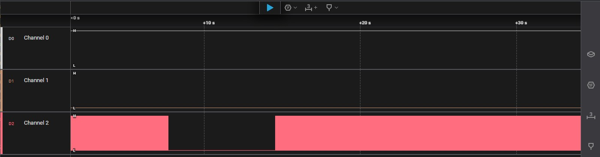
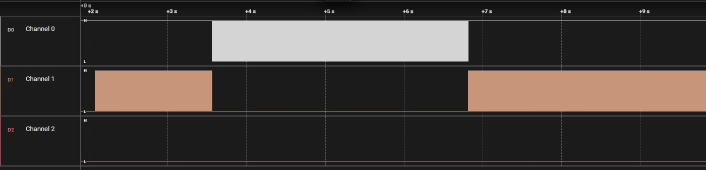

# Introduction #
This project demonstrates the basic functionalities of the Port Output Enable for GPT (POEG) driver on Renesas RA MCUs based on Renesas FSP. The user can disable the GPT output pins using one of the following options:
1. Disable GPT output pins based on the GTETRG input pin level.
2. Disable GPT output pins by software API.
3. Disable GPT output pins when GTIOC pins are at the same logic level.
4. Disable GPT output pins based on comparator (ACMPHS) crossing events.
5. Reset the POEG status.

Information, guideline and error messages are displayed on the J-Link RTT Viewer. LED1 is turned ON when the GPT output pin is disabled successfully. LED1 is turned OFF when POEG reset successfully. Additionally, the user can verify the EP operation using a logic analyzer.  

**Note:** EK-RA4L1, EK-RA2L2 boards do not support disabling GPT output pins based on comparator (ACMPHS) crossing events.

The user can refer the "Verifying Operation" section to run the example project properly.

Please refer to the [Example Project Usage Guide](https://github.com/renesas/ra-fsp-examples/blob/master/example_projects/Example%20Project%20Usage%20Guide.pdf) 
for general information on example projects and [readme.txt](./readme.txt) for specifics of operation.

## Required Resources ##
To build and run the POEG example project, the following resources are needed.

### Software ###
* Renesas Flexible Software Package (FSP): Version 6.3.0
* e2 studio: Version 2025-12
* SEGGER J-Link RTT Viewer: Version 8.92
* GCC ARM Embedded Toolchain: Version 13.2.1.arm-13-7

Refer to software requirements mentioned in [Example Project Usage Guide](https://github.com/renesas/ra-fsp-examples/blob/master/example_projects/Example%20Project%20Usage%20Guide.pdf)

### Hardware ###
Supported RA boards: EK-RA6M1, EK-RA6M2, EK-RA6M3, RSSK-RA6T1, MCK-RA4T1, MCK-RA6T2, MCK-RA6T3, EK-RA8D1, EK-RA8M1, MCK-RA8T1, FPB-RA8E1, EK-RA4L1, EK-RA8E2, EK-RA2L2, FPB-RA2T1.
* 1 x Renesas RA board.
* 1 x Type-C USB cable for programming and debugging.
* 1 x External Variable DC Power supply (For FPB-RA2T1).
* 1 x Logic Analyzer (e.g., Saleae logic) (Optional).
* Some jumper wires.

### Hardware Connections: ###
* Connect the USB Debug port on the RA board to the host PC via a Type-C USB cable.
* After selecting option 1, the user needs to give active LOW for GTETRG pin by:
  * For EK-RA6M1, EK-RA6M2:
    *	Connect GTETRG P104 (J3:39) to GND.

  * For EK-RA6M3: 		
	  * Connect GTETRG P104 (J1:3) to GND.

  * For RSSK-RA6T1: 		
	  * Connect GTETRG P104 (CNC:16) to GND.

  * For MCK-RA4T1: 		
	  *	Connect GTETRG P104 (CN3:12) to GND.

  * For MCK-RA6T2: 		
	  *	Connect GTETRG PA12 (CN6:12) to GND.

  * For MCK-RA6T3: 		
	  *	Connect GTETRG P104 (J4:12) to GND.

  * For EK-RA8D1: 		
	  *	Connect GTETRG P401 (J51:7) to GND.

  * For EK-RA8M1: 		
    *	Connect GTETRG P614 (J54:27) to GND.

  * For MCK-RA8T1: 		
	  *	Connect GTETRG P104 (CN4:8) to GND.

  * For FPB-RA8E1: 		
	  *	Connect GTETRG P104 (J1:45) to GND.

  * For EK-RA4L1: 		
	  *	Connect GTETRG P104 (J3:9) to GND.

  * For EK-RA8E2: 		
	  *	Connect GTETRG P614 (J37:9) to GND.

  * For EK-RA2L2: 		
    * Connect GTETRG P104 (J2:35) to GND.

  * For FPB-RA2T1:
    * Connect GTETRG  P104 (J4:8)  to GND.

* Before selecting option 4, the user needs to set up as shown below:
  * For MCK-RA6T2:
    * Connect PA07 (CN4:11) to PA00 (CN4:9).

  * For FPB-RA8E1:
    * Connect DA0 P014 (J1:34) to IVCMP0_2 (AN000) P004 (J1:20).

  * For EK-RA8E2:
    * Connect DA0 P014 (J17:2) to IVCMP0_2 (AN000) P004 (J4:12).

  * For FPB-RA2T1:
	  * Connect the positive output pin (V+) of the External Variable DC Power supply to CMPIN01 P015 (J4:14) of the RA board.
	  * Connect the ground (GND) of the External Variable DC Power supply to the ground (GND) of the RA board.

* Connect GPT output pins to Logic Analyzer to verify operations:
	* For EK-RA8E2:
		* Connect GTIOC0A P415 (J2:22) to Logic Analyzer Channel 0.
		*	Connect GTIOC0B P414 (J2:21) to Logic Analyzer Channel 1.
		*	Connect GTIOC5B P202 (J2:36) to Logic Analyzer Channel 2.
		*	Connect GND (J2:39) to Logic Analyzer GND.

  * For EK-RA2L2:
    * Connect GTIOC7A P302 (J2:23) to Logic Analyzer Channel 0.
    * Connect GTIOC7B P301 (J2:24) to Logic Analyzer Channel 1.
    * Connect GTIOC5B P501 (J3:4) to Logic Analyzer Channel 2.
    * Connect GND (J2:40) to Logic Analyzer GND. 

  * For FPB-RA2T1:
    * Connect GTIOC0A P208 (J3:16) to Logic Analyzer Channel 0.
    * Connect GTIOC0B P407 (J3:12) to Logic Analyzer Channel 1.
    * Connect GTIOC1B P913 (J3:15) to Logic Analyzer Channel 2.
    * Connect GND (J3:6) to Logic Analyzer GND.

## Related Collateral References ##
The following documents can be referred to for enhancing your understanding of 
the operation of this example project:
- [FSP User Manual on GitHub](https://renesas.github.io/fsp/)
- [FSP Known Issues](https://github.com/renesas/fsp/issues)

# Project Notes #

## System Level Block Diagram ##
 High level block diagram
 

For FPB-RA8E1, EK-RA8E2: Internal Reference Voltage (Vref) is used as reference voltage source and AN000 is used as input voltage source for ACMPHS module, which is supplied by output of DAC0. Internal Reference Voltage value is set to 1.18V (Equivalent to a digital value 1465). The user can enter DAC0 value within permitted range to provide an analog signal input for AN000.

For EK-RA4L1, EK-RA2L2: This board does not support ACMPHS.

For FPB-RA2T1: Internal Reference Voltage (Vref: 1.44V) is used as reference voltage source and CMPIN01 is used as input voltage source for ACMPHS module, which is supplied by external DC power supply. The user needs to provide an analog signal by using an external variable DC power supply, instead of inputting DAC values through the RTT Viewer. When the input voltage source is greater than the reference voltage (1.44V), POEG is triggered to request stopping the output in response to detection by the comparator.

## FSP Modules Used ##
List of all the various modules that are used in this project. Refer to the FSP User Manual for further details on each module listed below.

| Module Name | Usage  | Searchable Keyword (using New Stack > Search) |
|-------------|-----------------------------------------------|-----------------------------------------------|
| Port output enable for GPT  | Port output enable for GPT channel 0.   | r_poeg |
| Port output enable for GPT  | Port output enable for GPT channel 1.   | r_poeg |
| General PWM   | General PWM channel 0. | r_gpt |
| General PWM   | General PWM channel 1. | r_gpt |
| Comparator | Comparator High- Speed. | r_acmphs |
| DAC | DAC channel 0. | r_dac |
| DAC | DAC channel 1. | r_dac |

**For FPB-RA8E1, EK-RA8E2:**
| Module Name | Usage  | Searchable Keyword (using New Stack > Search) |
|-------------|-----------------------------------------------|-----------------------------------------------|
| Port output enable for GPT  | Port output enable for GPT channel 0.   | r_poeg |
| Port output enable for GPT  | Port output enable for GPT channel 1.   | r_poeg |
| General PWM   | General PWM channel 0. | r_gpt |
| General PWM   | General PWM channel 5. | r_gpt |
| Comparator | Comparator High- Speed. | r_acmphs |
| DAC | DAC channel 0. | r_dac |

**For EK-RA4L1, EK-RA2L2:**
| Module Name | Usage  | Searchable Keyword (using New Stack > Search) |
|-------------|-----------------------------------------------|-----------------------------------------------|
| Port output enable for GPT  | Port output enable for GPT channel 0.   | r_poeg |
| Port output enable for GPT  | Port output enable for GPT channel 1.   | r_poeg |
| General PWM   | General PWM channel 0. | r_gpt |
| General PWM   | General PWM channel 1. | r_gpt |

**For FPB-RA2T1:**
| Module Name | Usage  | Searchable Keyword (using New Stack > Search) |
|-------------|-----------------------------------------------|-----------------------------------------------|
| Port output enable for GPT  | Port output enable for GPT channel 0.   | r_poeg |
| Port output enable for GPT  | Port output enable for GPT channel 1.   | r_poeg |
| General PWM   | General PWM channel 0. | r_gpt |
| General PWM   | General PWM channel 1. | r_gpt |
| Comparator | Comparator High- Speed. | r_acmphs_b |

## Module Configuration Notes ##
This section describes FSP Configurator properties that are important or different from those selected by default. 

**Common Configuration Properties**

|   Module Property Path and Identifier   |   Default Value   |   Used Value   |   Reason   |
| :-------------------------------------: | :---------------: | :------------: | :--------: |
|   configuration.xml > BSP > Properties > Settings > Property > RA Common > Main stack size (bytes) |  0  | 0x400 | Change stack size to accommodate functions usage in the EP and avoid any runtime errors. |
|   configuration.xml > BSP > Properties > Settings > Property > RA Common > Heap size (bytes) |  0  | 0x400 | Change heap size to accommodate functions usage in the EP and avoid any runtime errors. |

**Configuration Properties for POEG channel 0**

|   Module Property Path and Identifier   |   Default Value   |   Used Value   |   Reason   |
| :-------------------------------------: | :---------------: | :------------: | :--------: |
| configuration.xml > Stacks > g_poeg0 Port Output Enable for GPT (r_poeg) > Properties > Settings > Property > Module g_poeg0 Port Output Enable for GPT (r_poeg) > General > Channel | 0 | 0 | POEG Channel. |
| configuration.xml > Stacks > g_poeg0 Port Output Enable for GPT (r_poeg) > Properties > Settings > Property > Module g_poeg0 Port Output Enable for GPT (r_poeg) > General > Trigger > GPT Output Level |☐ | ☑ | POEG Trigger. |
| configuration.xml > Stacks > g_poeg0 Port Output Enable for GPT (r_poeg) > Properties > Settings > Property > Module g_poeg0 Port Output Enable for GPT (r_poeg) > Input > GTETRG Polarity | Active High | Active Low| Select the polarity of the GTETRG pin. |
| configuration.xml > Stacks > g_poeg0 Port Output Enable for GPT (r_poeg) > Properties > Settings > Property > Module g_poeg0 Port Output Enable for GPT (r_poeg) > Input > GTETRG Noise Filter | Disabled | PCLKB/32 | Configure the noise filter for the GTETRG pin. |
| configuration.xml > Stacks > g_poeg0 Port Output Enable for GPT (r_poeg) > Properties > Settings > Property > Module g_poeg0 Port Output Enable for GPT (r_poeg) > Interrupts > Callback | NULL | channel0_user_callback | This property is used to specify  user callback function. |
| configuration.xml > Stacks > g_poeg0 Port Output Enable for GPT (r_poeg) > Properties > Settings > Property > Module g_poeg0 Port Output Enable for GPT (r_poeg) > Interrupts > Interrupt Priority | Priority 0 | Priority 1  | This property is used to select the POEG interrupt priority. |

**Configuration Properties for POEG channel 1**

|   Module Property Path and Identifier   |   Default Value   |   Used Value   |   Reason   |
| :-------------------------------------: | :---------------: | :------------: | :--------: |
| configuration.xml > Stacks >  g_poeg1 Port Output Enable for GPT (r_poeg) > Properties > Settings > Property > Module g_poeg1 Port Output Enable for GPT (r_poeg) > General > Channel | 0 | 1 | POEG Channel. |
| configuration.xml > Stacks > g_poeg1 Port Output Enable for GPT (r_poeg) > Properties > Settings > Property > Module g_poeg1 Port Output Enable for GPT (r_poeg) > General > Trigger > GTETRG Pin| ☐| ☑ | POEG Trigger. |
| configuration.xml > Stacks > g_poeg1 Port Output Enable for GPT (r_poeg) > Properties > Settings > Property > Module g_poeg1 Port Output Enable for GPT (r_poeg) > General > Trigger > ACMPHS0	| ☐| ☑ | POEG Trigger. |
| configuration.xml > Stacks > g_poeg1 Port Output Enable for GPT (r_poeg) > Properties > Settings > Property > Module g_poeg1 Port Output Enable for GPT (r_poeg) > Input > GTETRG Polarity | Active High | Active Low | Select the polarity of the GTETRG pin. |
| configuration.xml > Stacks > g_poeg1 Port Output Enable for GPT (r_poeg) > Properties > Settings > Property > Module g_poeg1 Port Output Enable for GPT (r_poeg) > Input > GTETRG Noise Filter | Disabled | PCLKB/32 | Configure the noise filter for the GTETRG pin. |
| configuration.xml > Stacks > g_poeg1 Port Output Enable for GPT (r_poeg) > Properties > Settings > Property > Module g_poeg1 Port Output Enable for GPT (r_poeg) > Interrupts > Callback | NULL | channel1_user_callback | This property is used to specify  user callback function. |
| configuration.xml > Stacks > g_poeg1 Port Output Enable for GPT (r_poeg) > Properties > Settings > Property > Module g_poeg1 Port Output Enable for GPT (r_poeg) > Interrupts > Interrupt Priority | Priority 0 | Priority 1  | This property is used to select the POEG interrupt priority. |

**Configuration Properties for Timer, General PWM 1**

|   Module Property Path and Identifier   |   Default Value   |   Used Value   |   Reason   |
| :-------------------------------------: | :---------------: | :------------: | :--------: |
| configuration.xml > Stacks > g_timer_pwm1 General PWM (r_gpt) > Properties > Settings > Property > Common > Pin Output Support | Disabled | Enabled with Extra features | Enables or disables support for outputting PWM waveforms on GTIOCx pins. |
| configuration.xml > Stacks > g_timer_pwm1 General PWM (r_gpt) > Properties > Settings > Property > Module g_timer_pwm1 Timer, Genernal PWM (r_gpt) > General > Channel | 0 | 0| This property is used to channel of GPT. |
| configuration.xml > Stacks > g_timer_pwm1 General PWM (r_gpt) > Properties > Settings > Property > Module g_timer_pwm1 Timer, Genernal PWM (r_gpt) > General > Mode | Periodic | Saw-wave PWM | This property is used to select the Mode selection. |
| configuration.xml > Stacks > g_timer_pwm1 General PWM (r_gpt) > Properties > Settings > Property > Module g_timer_pwm1 Timer, Genernal PWM (r_gpt) > General > Period | 0x10000 | 1000  | This property is used to select  the timer period. |
| configuration.xml > Stacks > g_timer_pwm1 General PWM (r_gpt) > Properties > Settings > Property > Module g_timer_pwm1 Timer, Genernal PWM (r_gpt) > Output > Duty Cycle Percent (only applicable in PWM mode) | 50 | 50 | This property is used to specify the timer duty cycle percent. Only used in PWM mode. |
| configuration.xml > Stacks > g_timer_pwm1 General PWM (r_gpt) > Properties > Settings > Property > Module g_timer_pwm1 Timer, Genernal PWM (r_gpt) > Output > GTIOCA Output Enabled | False | False | This property is used to Enable the output of GTIOCA on a pin. |
| configuration.xml > Stacks > g_timer_pwm1 General PWM (r_gpt) > Properties > Settings > Property > Module g_timer_pwm1 Timer, Genernal PWM (r_gpt) > Output > GTIOCB Output Enabled | False | True | This property is used to Enable the output of GTIOCB on a pin. |
| configuration.xml > Stacks > g_timer_pwm1 General PWM (r_gpt) > Properties > Settings > Property > Module g_timer_pwm1 Timer, Genernal PWM (r_gpt) > Output > Custom Waveform > Custom Waveform Enabled | Disable | Enable | This property is used to enable custom waveform generation using compare match events. |
| configuration.xml > Stacks > g_timer_pwm1 General PWM (r_gpt) > Properties > Settings > Property > Module g_timer_pwm1 Timer, Genernal PWM (r_gpt) > Output > Custom Waveform > GTIOA > Compare Match Output Level | Pin Level Retain | Pin Level Toggle | This property is used to toggle the GTIOA output level each time a compare match occurs. |
| configuration.xml > Stacks > g_timer_pwm1 General PWM (r_gpt) > Properties > Settings > Property > Module g_timer_pwm1 Timer, Genernal PWM (r_gpt) > Output > Custom Waveform > GTIOB > Compare Match Output Level | Pin Level Retain | Pin Level Toggle | This property is used to toggle the GTIOB output level each time a compare match occurs. |
| configuration.xml > Stacks > g_timer_pwm1 General PWM (r_gpt) > Properties > Settings > Property > Module g_timer_pwm1 Timer, Genernal PWM (r_gpt) > Extra Features > Output Disable > Output Disable POEG Trigger > GTIOCA and GTIOCB High Level | ☐ | ☑ | Select which POEG to link this GPT channel to. |
| configuration.xml > Stacks > g_timer_pwm1 General PWM (r_gpt) > Properties > Settings > Property > Module g_timer_pwm1 Timer, Genernal PWM (r_gpt) > Extra Features > Output Disable > POEG Link | POEG Channel 0| POEG Channel 0 | Select which POEG to link this GPT channel to. |
| configuration.xml > Stacks > g_timer_pwm1 General PWM (r_gpt) > Properties > Settings > Property > Module g_timer_pwm1 Timer, Genernal PWM (r_gpt) > Extra Features > Output Disable > GTIOCA Disable Setting | Disable Prohibited | Disable Prohibited | Select the disable setting for GTIOCA. |
| configuration.xml > Stacks > g_timer_pwm1 General PWM (r_gpt) > Properties > Settings > Property > Module g_timer_pwm1 Timer, Genernal PWM (r_gpt) > Extra Features > Output Disable > GTIOCB Disable Setting | Disable Prohibited | Level Low | Select the disable setting for GTIOCB. |
| configuration.xml > Stacks > g_timer_pwm1 General PWM (r_gpt) > Properties > Settings > Property > Module g_timer_pwm1 Timer, Genernal PWM (r_gpt) > Extra Features > Extra Features | Disabled | Enabled | Select whether to enable extra features on this channel. |

**Configuration Properties for Timer, General PWM 2**

|   Module Property Path and Identifier   |   Default Value   |   Used Value   |   Reason   |
| :-------------------------------------: | :---------------: | :------------: | :--------: |
| configuration.xml > Stacks > g_timer_pwm2 General PWM (r_gpt) > Properties > Settings > Property > Common > Pin Output Support | Disabled | Enabled with Extra features | Enables or disables support for outputting PWM waveforms on GTIOCx pins. |
| configuration.xml > Stacks > g_timer_pwm2 General PWM (r_gpt) > Properties > Settings > Property > Module g_timer_pwm2 Timer, Genernal PWM (r_gpt) > General > Channel | 0 | 1| This property is used to channel of GPT. |
| configuration.xml > Stacks > g_timer_pwm2 General PWM (r_gpt) > Properties > Settings > Property > Module g_timer_pwm2 Timer, Genernal PWM (r_gpt) > General > Mode | Periodic | Saw-wave PWM  | This property is used to select the Mode selection. |
| configuration.xml > Stacks > g_timer_pwm2 General PWM (r_gpt) > Properties > Settings > Property > Module g_timer_pwm2 Timer, Genernal PWM (r_gpt) > General > Period | 0x10000 | 1000  | This property is used to select  the timer period. |
| configuration.xml > Stacks > g_timer_pwm2 General PWM (r_gpt) > Properties > Settings > Property > Module g_timer_pwm2 Timer, Genernal PWM (r_gpt) > Output > Duty Cycle Percent (only applicable in PWM mode) | 50 | 50 | This property is used to specify the timer duty cycle percent. Only used in PWM mode. |
| configuration.xml > Stacks > g_timer_pwm2 General PWM (r_gpt) > Properties > Settings > Property > Module g_timer_pwm2 Timer, Genernal PWM (r_gpt) > Output > GTIOCA Output Enabled | False | False | This property is used to Enable the output of GTIOCA on a pin. |
| configuration.xml > Stacks > g_timer_pwm2 General PWM (r_gpt) > Properties > Settings > Property > Module g_timer_pwm2 Timer, Genernal PWM (r_gpt) > Output > GTIOCB Output Enabled | False | True | This property is used to Enable the output of GTIOCB on a pin. |
| configuration.xml > Stacks > g_timer_pwm2 General PWM (r_gpt) > Properties > Settings > Property > Module g_timer_pwm2 Timer, Genernal PWM (r_gpt) > Extra Features > Output Disable > POEG Link | POEG Channel 1| POEG Channel 1 | Select which POEG to link this GPT channel to. |
| configuration.xml > Stacks > g_timer_pwm2 General PWM (r_gpt) > Properties > Settings > Property > Module g_timer_pwm2 Timer, Genernal PWM (r_gpt) > Extra Features > Output Disable > GTIOCA Disable Setting | Disable Prohibited | Disable Prohibited | Select the disable setting for GTIOCA. |
| configuration.xml > Stacks > g_timer_pwm2 General PWM (r_gpt) > Properties > Settings > Property > Module g_timer_pwm2 Timer, Genernal PWM (r_gpt) > Extra Features > Output Disable > GTIOCB Disable Setting | Disable Prohibited | Level low | Select the disable setting for GTIOCB. |
| configuration.xml > Stacks > g_timer_pwm2 General PWM (r_gpt) > Properties > Settings > Property > Module g_timer_pwm2 Timer, Genernal PWM (r_gpt) > Extra Features > Extra Features | Disabled | Enabled | Select whether to enable extra features on this channel. |

**Configuration Properties for Comparator, High-Speed ACMPHS**

|   Module Property Path and Identifier   |   Default Value   |   Used Value   |   Reason   |
| :-------------------------------------: | :---------------: | :------------: | :--------: |
| configuration.xml > Stacks > g_comparator High Speed Comparator (r_acmphs_b) > Properties > Settings > Property > Module g_comparator Comparator, High-Speed (r_acmphs_b) > Channel | 0 | 0 | Enables the hardware channel. |
| configuration.xml > Stacks > g_comparator High Speed Comparator (r_acmphs_b) > Properties > Settings > Property > Module g_comparator Comparator, High-Speed (r_acmphs_b) > Trigger Edge Selector | Both Edge| Both Edge |  The trigger specifies when a comparator callback event should occur. |
| configuration.xml > Stacks > g_comparator High Speed Comparator (r_acmphs_b) > Properties > Settings > Property > Module g_comparator Comparator, High-Speed (r_acmphs_b) > Noise Filter | No Filter | Sampling at PCLKB/8 | This property is used to select the PCLK divisor for the hardware digital debounce filter. |
| configuration.xml > Stacks > g_comparator High Speed Comparator (r_acmphs_b) > Properties > Settings > Property > Module g_comparator Comparator, High-Speed (r_acmphs_b) > Callback | NULL | acmphs_user_callback | This property is used to specify acmphs callback. |
| configuration.xml > Stacks > g_comparator High Speed Comparator (r_acmphs_b) > Properties > Settings > Property > Module g_comparator Comparator, High-Speed (r_acmphs_b) > Comparator Interrupt Priority| Priority 0 | Priority 2 | This property is used to specify Comparator Interrupt Priority. |
| configuration.xml > Stacks > g_comparator High Speed Comparator (r_acmphs_b) > Properties > Settings > Property > Module g_comparator Comparator, High-Speed (r_acmphs_b) > Analog Input Voltage Source | MCU specific options| CMPIN01 (channel 0 only) |  Select the Analog input voltage source. |
| configuration.xml > Stacks > g_comparator High Speed Comparator (r_acmphs_b) > Properties > Settings > Property > Module g_comparator Comparator, High-Speed (r_acmphs_b) > Reference Voltage Input Source | MCU specific options| IVREF0 (channel 0 only) | Select the Analog reference voltage source. |
| configuration.xml > Stacks > g_comparator High Speed Comparator (r_acmphs_b) > Properties > Settings > Property > Pins > CMPIN01 | None | P015 | CMPIN01 is used as input voltage source for ACMPHS module. |

## API Usage ##

The table below lists the POEG basic APIs used at the application layer by this example project.

| API Name    | Usage                                                                          |
|-------------|--------------------------------------------------------------------------------|
|R_POEG_Open | This API is used to open the POEG instance. |
|R_POEG_Reset | This API is used to reset POEG status. |
|R_POEG_OutputDisable | This API is used to disable GPT output pins. |
|R_GPT_Open | This API is used to open the GPT instance. |
|R_GPT_Start | This API is used to start the GPT. |
|R_GPT_OutputEnable | This API is used to enable waveform output on the specified GPT GTIOC pin. |
|R_GPT_OutputDisable | This API is used to disable waveform output on the specified GPT GTIOC pin. |
|R_ACMPHS_Open | This API is used to open the ACMPHS instance. |
|R_ACMPHS_InfoGet | This API is used to get the ACMPHS Info. |
|R_ACMPHS_OutputEnable | This API is used enable output of the ACMPHS. |

## Verifying Operation ##
To run this example project, follow below instructions to observe the EP operation:
1. Import, Generate and Build the example project.
2. Connect the USB debug port on the RA board to the host PC via a Type-C USB cable.
3. Download/Debug the example project to the RA board.
4. Run the project and open J-Link RTT Viewer to see the output status.

**The EP information**  

5. For FPB-RA2T1: When using option 1 (triggering POEG by GTETRG input pin level) or option 2 (triggering POEG by software API), ensure that pin CMPIN01 P015 (J4:14), which is configured as the analog input voltage source and is in a high-impedance (Hi-Z) state, has a voltage lower than 1.44V. This helps prevent accidental triggering by the comparator detection signals (option 4).

6. To disable GPT output pins based on the GTETRG input pin level, enter "1": The POEG1 channel number corresponds to the GTETRG input pin which is used with this channel. GTETRG pin level (active LOW or active HIGH based on configuration) disables GPT output pins on the input level.
    * After selecting option "1", refer to the guidelines on RTT Viewer or "Hardware Connection" section to connect hardware properly. Then reset the respective POEG status by entering Menu option "5".
    * Remove connection of GTETRG pin and reset of application are needed prior to repeatedly selecting menu option "1", or selecting other options from the menu (except option "5")  
7. To disable GPT output pins by software API, enter "2": The GPT output pins are disabled on R_POEG_OutputDisable() software API. Then reset the respective POEG status by entering Menu option "5".

8. To disable GPT output pins when GTIOC pins are at the same logic level, enter "3": The GPT output pins are disabled when the GTIOC pins are on the same level. Then reset the respective POEG status by entering Menu option "5".
  
9. Before running menu option "4", refer to "Hardware Connections" section to connect hardware correctly. To disable GPT output pins based on comparator (ACMPHS) crossing events, enter "4": The GPT output pins are disabled on comparator crossing events. Then reset the respective POEG status by entering Menu option "5".
    * Reset of the application is needed prior to repeatedly selecting menu option "4" or selecting other menu options (except option "5") to restart DAC0, DAC1, and ACMPHS.
    * For FPB-RA8E1, EK-RA8E2:
	    * Internal Reference Voltage (Vref) is used as reference voltage source and AN000 is used as input voltage source for ACMPHS module, which is supplied by output of DAC0. The user can enter DAC0 value within permitted range to provide an analog signal input for AN000. Reset of the application is needed prior to repeatedly selecting menu option "4" or selecting other menu options (except option "5") to restart DAC0 and ACMPHS.
	    * Internal Reference Voltage (Vref) is used as reference voltage source, it is set to 1.18V (Equivalent to a digital value 1465).
	    * The user has to input DAC0 value in between (0 - 1400) or (1600 - 4095) to prevent voltage fluctuations caused by electrical noise, which may affect the comparator output.
    * For FPB-RA2T1:
	    * Internal Reference Voltage (Vref: 1.44V) is used as reference voltage source and CMPIN01 is used as input voltage source for ACMPHS module, which is supplied by external DC power supply. Reset of the application is needed prior to repeatedly selecting menu option "4" or selecting other menu options (except option "5") to restart ACMPHS.
	    * The user needs to provide an analog signal by using an external variable DC power supply, instead of inputting DAC values through the RTT Viewer. 
	    * When the input voltage source is greater than the reference voltage (1.44V), POEG is triggered to request stopping the output in response to detection by the comparator.    
  
10. To reset POEG channel 0 (Required after running option 3): enter "5", then enter "1". To reset POEG channel 1 (Required after running options 1, 2, or 4): enter "5", then enter "2".
	
11. Verify the POEG operation through output status on RTT Viewer, LED behavior or waveform on a Logic Analyzer (optional).

**POEG Output Disable On Input Pin Trigger J-Link RTT Viewer log**

	
**POEG Output Disable On Software API J-Link RTT Viewer log**

	
**POEG Output Disable On GPT Output Level J-Link RTT Viewer log**

	
**POEG Output Disable On ACMPHS Events J-Link RTT Viewer log**

	
**POEG POEG Reset Channel 0 J-Link RTT Viewer log**

**POEG POEG Reset Channel 1 J-Link RTT Viewer log**

### Callback Handlers
1. **channel0_user_callback()** disables the POEG0 interrupt to prevent it from firing continuously.
2. **channel1_user_callback()** disables the POEG1 interrupt to prevent it from firing continuously.
3. **acmphs_user_callback()** to toggle the flag of ACMPHS Events.

#### Special Topics ####
For FPB-RA2T1, the user must Close E8, E15 and Cut E10 to use P213 for LED1.

The table below lists the Supported Boards this example project.

| Boards	      | PIN Trigger	  |GPT Output level|ACMPHS Mode    |
|---------------|---------------|----------------|---------------|
|  EK-RA6M1     |    Y          |       Y        |   Y           |
|  EK-RA6M2     |    Y          |       Y        |   Y           |
|  EK-RA6M3     |    Y          |       Y        |   Y           |
|  RSSK-RA6T1   |    Y          |       Y        |   Y           |
|  MCK-RA4T1    |    Y          |       Y        |   Y           |
|  MCK-RA6T2    |    Y          |       Y        |   Y           |
|  MCK-RA6T3    |    Y          |       Y        |   Y           |
|  EK-RA8D1     |    Y          |       Y        |   Y           |
|  EK-RA8M1     |    Y          |       Y        |   Y           |
|  MCK-RA8T1    |    Y          |       Y        |   Y           |
|  FPB-RA8E1    |    Y          |       Y        |   Y           |
|  EK-RA4L1     |    Y          |       Y        |   N           |
|  EK-RA8E2     |    Y          |       Y        |   Y           |
|  EK-RA2L2     |    Y          |       Y        |   N           |
|  FPB-RA2T1    |    Y          |       Y        |   Y           |

The EP operation waveform with a Logic Analyzer as shown below:

The waveform below illustrate **POEG Option 1** disabling GPT output pins based on the GTETRG input pin level, followed by a reset using **POEG Option 5**:

  
  
The waveform below illustrate **POEG Option 2** disabling GPT output pins by software API, followed by a reset using **POEG Option 5**:

  

The waveform below illustrate **POEG Option 3** disabling GPT output pins when GTIOC pins are at the same logic level, followed by a reset using **POEG Option 5**:
  
  

The waveform below illustrate **POEG Option 4** disabling GPT output pins based on comparator (ACMPHS) crossing events, followed by a reset using **POEG Option 5**:
  
  
