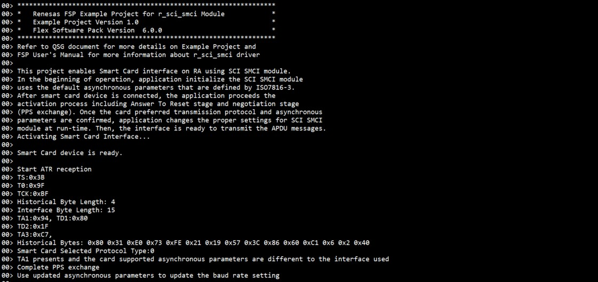
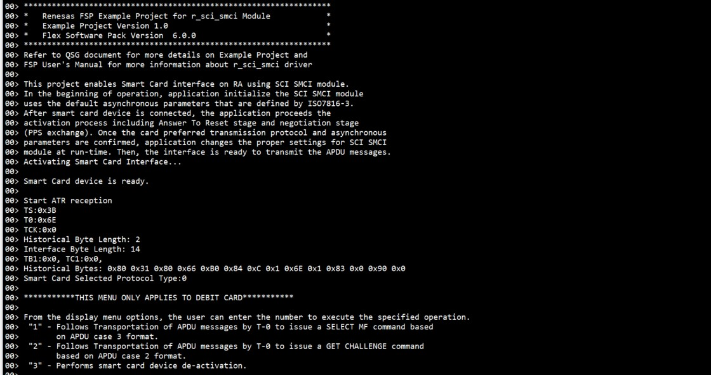

# Introduction #
This project demonstrates the basic functionalities of the SCI Smart Card Interface Device on Renesas RA MCUs based on Renesas FSP using SCI_SMCI module without RTOS. An ISO 7816-3 Smart Card is connected to the RA board, which is configured as SCI Smart Card Interface (please refer to the Table of Smart Card Connections). The application sets and configures baud rate for the smart card. This project also demonstrates the ATR proceeds in five steps: Initial character TS; Format bytes T0; Interface bytes TAi, TBi, TCi, TDi and variable number; Historical bytes, and the check byte TCK (optional) for SIM Card and Debit Card.

For the SIM Card, the application proceeds with the activation process including Answer To Reset (ATR) stage and negotiation stage will show (completed PPS exchange).

For the Debit Card, the user can follow the menu to do the test. The user can "Enter" value from Menu, and all information of the chip in the Smart Card connected to the RA board will be printed in the RTT Viewer.

Please refer to the [Example Project Usage Guide](https://github.com/renesas/ra-fsp-examples/blob/master/example_projects/Example%20Project%20Usage%20Guide.pdf) 
for general information on example projects and [readme.txt](./readme.txt) for specifics of the operation.

## Required Resources ##
To build and run the SCI_SMCI example project, the following resources are needed.

### Software ###
* Renesas Flexible Software Package (FSP): Version 6.1.0
* e2 studio: Version 2025-07
* SEGGER J-Link RTT Viewer: Version 8.58
* GCC ARM Embedded Toolchain: Version 13.2.1.arm-13-7

Refer to software requirements mentioned in [Example Project Usage Guide](https://github.com/renesas/ra-fsp-examples/blob/master/example_projects/Example%20Project%20Usage%20Guide.pdf)

### Hardware ###
* 1 x Renesas RA board. 
* 1 x Type-C USB cable for programming and debugging.
* 1 x SIM Card (the standard SIM, Micro SIM or Nano SIM and) with wires connection soldered are ready on SIM or socket.
* 1 x Debit Card and ISO 7816-3 Card (Should be used ISO 7816-3 AT88SC0104C) if the user would like to test for both.
* 1 x Resistor (from 1k to 4.7k Ohms).
* 9 x Jumper wires.

### Hardware Connections: ###
* For EK-RA6M5:
	* Connect a Micro USB cable to PC and the other end to the debug port (J10) on the RA board.

	* SIM or Debit Card connect to EK-RA6M5 pins:  

	| SIM or Debit Card        |        | EK-RA6M5 		|
	|:------------------------:|:------:|:-------------:|  
	| 1. Pin 1 VCC             | ---->  | P804  	    |
	| 2. Pin 2 RESET           | ---->  | P803			|
	| 3. Pin 3 SCK             | ---->  | P612 			|
	| 4. GND 		           | ---->  | GND  			|
	| 5. Pin DETECT	           | ---->  | P708 = MCU's Detect Pin (Open) 		|
	| 6. Pin I/O 		       | ---->  | P613 and P614 |

* For EK-RA4L1:
	* Connect a Type-C USB cable to PC and the other end to the debug port (J10) on the RA board.
		
	* SIM or Debit Card connect to EK-RA4L1 pins:   

	| SIM or Debit Card        |        | EK-RA4L1 		|
	|:------------------------:|:------:|:-------------:|  
	| 1. Pin 1 VCC             | ---->  | P700 (J2:36)   				|
	| 2. Pin 2 RESET           | ---->  | P205 (J2:3)					|
	| 3. Pin 3 SCK             | ---->  | P303 (J2:9)					|
	| 4. Pin 4 GND             | ---->  | GND  							|
	| 5. Pin DETECT	           | ---->  | P105 (J3:12) = MCU's Detect Pin (Open) 					|
	| 6. Pin I/O               | ---->  | P301 (J4:8) and P302 (J4:9)   | 

* For EK-RA2L2:
	* Connect a Micro USB cable to PC and the other end to the debug port (J10) on the RA board.
		
	* SIM or Debit Card connect to EK-RA2L2 pins:   

	| SIM or Debit Card        |        | EK-RA2L2 		|
	|:------------------------:|:------:|:-------------:|  
	| 1. Pin 1 VCC             | ---->  | P111 (J2:29)    				|
	| 2. Pin 2 RESET           | ---->  | P104 (J2:35)					|
	| 3. Pin 3 SCK             | ---->  | P102 (J2:37)					|
	| 4. Pin 4 GND             | ---->  | GND  							|
	| 5. Pin DETECT	           | ---->  | P206 (J2:15) = MCU's Detect Pin (Open) 					|
	| 6. Pin I/O               | ---->  | P410 (J2:6) and P411 (J2:5)   | 

* For FPB-RA2T1:
	* Connect a Type-C USB cable to PC and the other end to the debug port (CN6) on the RA board.
		
	* SIM or Debit Card connect to FPB-RA2T1 pins:   

	| SIM or Debit Card        |        | FPB-RA2T1 		|
	|:------------------------:|:------:|:-------------:|  
	| 1. Pin 1 VCC             | ---->  | P915 (J3:13)   				|
	| 2. Pin 2 RESET           | ---->  | P914 (J3:14)					|
	| 3. Pin 3 SCK             | ---->  | P102 (J4:10)					|
	| 4. Pin 4 GND             | ---->  | GND  							|
	| 5. Pin DETECT	           | ---->  | P105 (J4:14) = MCU's Detect Pin (Open) 					|
	| 6. Pin I/O               | ---->  | P100 (J4:12) and P101 (J4:11)   | 
	
**Note:**
1) Pins for Pin I/O must be tied together, pulled up to VCC via a resistor from 1k to 4.7k Ohms (using 1k Ohms for EK-RA2L2), and connected to the DATA line of the connected card.

2) If a Smart Card Socket is unavailable: Pin 5 (DETECT) of the card does not need to connect to the MCU's DETECT Pin. However, the MCU's Detect Pin must be pulled high to 3.3V (high = Smart Card inserted).

## Related Collateral References ##
The following documents can be referred to for enhancing your understanding of 
the operation of this example project:
- [FSP User Manual on GitHub](https://renesas.github.io/fsp/)

# Project Notes #
## System Level Block Diagram ##

## FSP Modules Used ##
List all the various modules that are used in this example project. Refer to the FSP User Manual for further details on each module listed below.

| Module Name | Usage  | Searchable Keyword (using New Stack > Search) |
| :---------: | :---------------: | :------------: |
| I/O Port | This module is used communicate with Host machine to perform write/read operations. | r_ioport |
| SMCI | This module provides Driver support configuration read/write between RA device and Smart Card. | r_sci_smci |
| External IRQ| Supports configuring interrupts for IRQ pins on the target MCUs. | r_icu|
| Timer General PWM | The GPT module is used count events, generate a periodic interrupt, output a periodic or PWM. |r_gpt|

## Module Configuration Notes ##
This section describes FSP Configurator properties that are important or different from those selected by default. 

**Common Configuration Properties**

|   Module Property Path and Identifier   |   Default Value   |   Used Value   |   Reason   |
| :-------------------------------------: | :---------------: | :------------: | :--------: |
|   configuration.xml > Stacks > g_smci0 SMCI (r_sci_smci) > Properties > Settings > Property > Module g_smci0 SMCI (r_sci_smci) > General > Channel |0 | 0 | Selected this channel to set connectivity of SCI (TXD/RXD/SCK).  |
|   configuration.xml > Stacks > g_smci0 SMCI (r_sci_smci) > Properties > Settings > Property > Module g_smci0 SMCI (r_sci_smci) > Baud > Baud Rate |9600 | 10700 | Enter the desired baud rate. If the requested baud rate cannot be achieved within the acceptable error rate, the error mark and percent error rate are printed in a comment in the generated smci_baud_setting_t structure.  |
|   configuration.xml > Stacks > g_smci0 SMCI (r_sci_smci) > Properties > Settings > Property > Pins > TXD/RXD/SCK |TXD0/RXD0/SCK0 | TXD0/RXD0/SCK0 | Selected and set Transmit/Receive and Clock channel.  |
|   configuration.xml > Stacks > g_ext_irq_smc_detect External IRQ (r_icu) > Properties > Settings > Property > Module g_ext_irq_smc_detect External IRQ (r_icu) > Name | g_external_irq0 | g_ext_irq_smc_detect | Assigned a name for external IRQ Smart Card detection function.  |
|   configuration.xml > Stacks > g_ext_irq_smc_detect External IRQ (r_icu) > Properties > Settings > Property > Module g_ext_irq_smc_detect External IRQ (r_icu) > Channel | 0 | 2 |Select channel available for interrupt.  |
|   configuration.xml > Stacks > g_ext_irq_smc_detect External IRQ (r_icu)> Properties > Settings > Property > Module g_ext_irq_smc_detect External IRQ (r_icu) > Callback | NULL | smart_card_detection_cb | Assigned callback function for detection card.  |
|   configuration.xml > Stacks > g_ext_irq_smc_detect External IRQ (r_icu) > Properties > Settings > Property > Pins > IRQ2 | None| P015 | Select Interruption pin to detect with or without Smart Card.  |
|   configuration.xml > Stacks > g_smci_etu_count_timer Timer, General PWM (r_gpt) > Properties > Settings > Property > Module g_smci_etu_count_timer Timer, General PWM (r_gpt) > General > Name | g_timer0 | g_smci_etu_count_timer | Assigned a name for the etu timer function.  |
|   configuration.xml > Stacks > g_smci_etu_count_timer Timer, General PWM (r_gpt) > Properties > Settings > Property > Module g_smci_etu_count_timer Timer, General PWM (r_gpt) > General > Period  | 0x10000 | 1 | Set to 1 timing for PWM.  |
|   configuration.xml > Stacks > g_smci_etu_count_timer Timer, General PWM (r_gpt) > Properties > Settings > Property > Module g_smci_etu_count_timer Timer, General PWM (r_gpt) > General > Period Unit | Raw Counts | Seconds | Select unit counting using Seconds.  |
|   configuration.xml > Stacks > g_smci_etu_count_timer Timer, General PWM (r_gpt) > Properties > Settings > Property > Module g_smci_etu_count_timer Timer, General PWM (r_gpt) > Interrupts > Callback | NULL | receiveExpireCallback | Assign a name for Call back expire function.  |
|   configuration.xml > Stacks > g_smci_etu_count_timer Timer, General PWM (r_gpt) > Properties > Settings > Property > Module g_smci_etu_count_timer Timer, General PWM (r_gpt) > Interrupts > Overflow/Crest Interrupt Priority | Disable | Priority 3 | Set Priority Level.  |

## API Usage ##

The table below lists the FSP provided API used at the application layer by this example project.

| API Name    | Usage                                                                          |
|-------------|--------------------------------------------------------------------------------|
| R_SCI_SMCI_Open | This API is used to open SCI in Smart Card Interface Mode. |
| R_SCI_SMCI_BaudCalculate | This API is used to calculate baud rate register settings. |
| R_SCI_SMCI_BaudSet | This API is used to update the baud rate. |
| R_SCI_SMCI_ClockControl | This API is used to enable or disable the SMCI clock to control the start of the activation or de-activation. |
| R_SCI_SMCI_TransferModeSet | This API is used to change the peripheral settings based on provided transfer mode and data convention type. |
| R_SCI_SMCI_Read | This API is used to read from Smart Card device.  The read buffer is used until the read is complete. |
| R_ICU_ExternalIrqOpen | This API is used to detect the smart card. |
| R_GPT_PeriodSet | This API is used to set the calculated period may or may not. |
| R_GPT_Start | This API is used to start SMCI ETU count timer. |
| R_GPT_Reset | This API is used to reset SMCI ETU count timer. |
| R_GPT_Stop | This API is used to stop SMCI ETU count timer. |
| R_IOPORT_PinRead | This API is used to read the level or the value of a pin. |
| R_IOPORT_PinWrite | This API is used to set the level or the value of a pin. |

## Verifying operation ##
Import the EP and perform necessary changes in the project configuration. Please see the Module Configuration Notes section for more details.

The following is the procedure to operation this EP using sci_smci module:
1. Connect SIM Card or Debit Card to the board as mentioned in readme file.
2. Connect RA MCU board to the PC as mentioned in readme file.
3. Generate, build, and download the EP to the RA board.
4. Open the J-Link RTT Viewer to verify the Output status.

    The image below shows the output information of the SIM card after the ATR has responded and has been displayed on J-Link RTT Viewer:  
	
	
    The image below shows the output information of the Debit card after the ATR has responded and has been displayed on J-Link RTT Viewer:  
	
	
	Follow the instructions displayed on the RTT Viewer as shown above.  
	a. Enter '1' to issue a SELECT MF command based on the APDU Case 3 format.  
	
	
	b. Enter '2' to issue a GET CHALLENGE command based on the APDU Case 2 format.  
	
	
	c. **Note:** If a Smart Card Socket is unavailable, the user must reconnect the MCU's DETECT pin from 3.3V to GND (low = Smart Card removed). Then enter '3' to perform smart card device de-activation.  

	Below image show the Output Information of the smart card device de-activation and displayed on J-Link RTT Viewer:  
	
	
	d. **Note:** If a Smart Card Socket is unavailable, the user must reconnect the MCU's DETECT pin from GND to 3.3V (high = Smart Card inserted), so the MCU will detect smart card.  

	Below image show the Output Information of the smart card device after reinserted and displayed on J-Link RTT Viewer:
	
