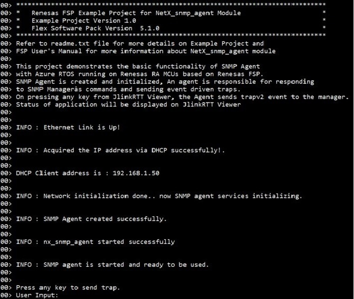
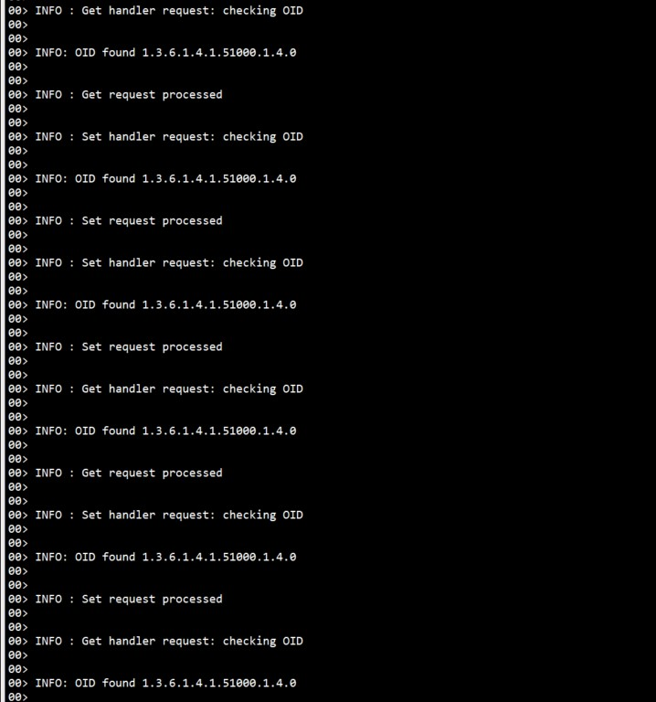
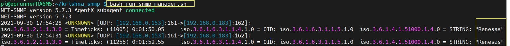

# Introduction #

The sample code accompanying this file shows the operation of a NetX Duo SNMP Agent on a RA MCU using Azure RTOS. 
In this sample code, a NetX Duo IP instance is created with IP address as (default 0.0.0.0 - Not assigned).  
The NetX stack is enabled for UDP, ICMP, ARP. SNMP is a protocol that utilizes the connectionless User Datagram Protocol (UDP) services to perform its management function. 
SNMP Agent creates its own packet pool based on the settings minimum packet payload size and number of packets in the packet pool.

Once SNMP Agent is created and initialized,  An agent is responsible for responding to SNMP Manager’s commands and sending event driven traps. 
On pressing any key from JlinkRTTViewer, the Agent sends trap event to the manager.

The status messages, client's info, and the code flow informational messages as part of the initialization are displayed on the JlinkRTTViewer.

NetX Duo SNMP Agent is compliant with [RFC1157](https://www.rfc-editor.org/rfc/rfc1157.html), [RFC1155](https://www.rfc-editor.org/rfc/rfc1155.html),
[RFC1215](https://www.rfc-editor.org/rfc/rfc1215.html), [RFC1901](https://www.rfc-editor.org/rfc/rfc1901.html), [RFC1905](https://www.rfc-editor.org/rfc/rfc1905.html),
[RFC1906](https://www.rfc-editor.org/rfc/rfc1906.html), [RFC1907](https://www.rfc-editor.org/rfc/rfc1907.html), [RFC1908](https://www.rfc-editor.org/rfc/rfc1908.html),
[RFC2571](https://www.rfc-editor.org/rfc/rfc2571.html), [RFC2572](https://www.rfc-editor.org/rfc/rfc2572.html), [RFC2574](https://www.rfc-editor.org/rfc/rfc2574.html),
[RFC2575](https://www.rfc-editor.org/rfc/rfc2575.html), [RFC3414](https://www.rfc-editor.org/rfc/rfc3414.html) and related RFCs.

Please refer to the [Example Project Usage Guide](https://github.com/renesas/ra-fsp-examples/blob/master/example_projects/Example%20Project%20Usage%20Guide.pdf) 
for general information on example projects and [readme.txt](./readme.txt) for specifics of the operation.

## Required Resources ##
To build and run the SNMP Agent example project, the following resources are needed.

### Hardware ###
* Renesas RA™ MCU kit with Ethernet Support
* Micro USB cable (For MCK-RA8T1: Type C USB cable)
* Ethernet Switch
* Ethernet Cable CAT5/6 (LAN Cable)
* Linux PC or Raspbery pi to run the SNMP Manager
* Windows PC for viewing RTT outputs.
* Router for Internet access or LAN connecting to the Internet

Refer to [readme.txt](./readme.txt) for information on how to connect the hardware.

### Software ###
Refer to software requirements mentioned in [Example Project Usage Guide](https://github.com/renesas/ra-fsp-examples/blob/master/example_projects/Example%20Project%20Usage%20Guide.pdf)

## Related Collateral References ##
The following documents can be referred to for enhancing your understanding of 
the operation of this example project:
- [FSP User Manual on GitHub](https://renesas.github.io/fsp/)
- [FSP Known Issues](https://github.com/renesas/fsp/issues)
- [Azure SNMP Documentation](https://docs.microsoft.com/en-us/azure/rtos/netx-duo/netx-duo-snmp/chapter1)

# Project Notes #

## System Level Block Diagram ##

## FSP Modules Used ##
List all the various modules that are used in this example project. Refer to the FSP User Manual for further details on each module listed below.

| Module Name | Usage  | Searchable Keyword (using New Stack > Search) |
|-------------|-----------------------------------------------|-----------------------------------------------|
| NetX Duo SNMP  Agent| To get access of NetX SNMP Agent library for responding to SNMP manager command and sending event driven trap. | snmp |
| NetX Duo IP Instance | For IP communication the NetX IP instance needs to be used. SNMP Agent uses the IPV4. | NetX Duo IP|
| NetX Duo Packet Pool | Packet Pool Module is used to send and receive the created data packets over UDP network.  | NetX Duo Packet Pool |
| NetX Duo Ethernet driver | Ethernet connection is required for physical connection to connect over network. | NetX Duo Ethernet Driver |
| NetX Duo DHCP IPv4 Client | DHCPv4 module is used to obtain IP address and to automate the process of configuring devices on IP networks, and any communication protocol based on UDP or TCP. | dhcp |

## Module Configuration Notes ##
This section describes FSP Configurator properties that are important or different from those selected by default. 

|   Module Property Path and Identifier   |   Default Value   |   Used Value   |   Reason   |
| :-------------------------------------: | :---------------: | :------------: | :--------: |
|   configuration.xml -> BSP > Properties > Settings > Property > Heap Size (bytes)| 0 |0x400| Heap size is required for standard library functions to be used as per FSP requirements. |
|   configuration.xml -> SNMP Thread > Settings > Property > Thread > priority  |   1   |   14   |   SNMP thread priority is lowered to allow the IP thread to process incoming packets at the fastest rate possible.   |
|   configuration.xml -> RTT Thread > Settings > Property > Thread > priority  |   1   |   15  |   RTT thread priority is lowered to allow the SNMP and IP threads to process incoming packets at the fastest rate possible.   |

## API Usage ##

The table below lists the SNMP Agent and DHCP CLient API used at the application layer by this example project.

| API Name    | Usage                                                                          |
|-------------|--------------------------------------------------------------------------------|
|nx_snmp_agent_create|This API creates a SNMP Agent.|
|nx_snmp_agent_private_string_set|This API set the SNMP agent private string|
|nx_snmp_agent_public_string_set|This API set the SNMP agent public string|
|nx_snmp_agent_context_engine_set|This API sets the context engine of the SNMP Agent. It is only applicable for SNMPv3 processing.|
|nx_snmp_agent_md5_key_create|This service creates a MD5 key that can be used for authentication and encryption.|
|nx_snmp_agent_authenticate_key_use|This service specifies the key to be used for authentication parameters in the SNMPv3.|
|nx_snmp_agent_privacy_key_use|This service specifies that the previously created key is to be used for encryption and decryption of SNMPv3 response messages.|
|nx_snmp_agent_auth_trap_key_use|This service specify authentication key for trap messages.|
|nx_snmp_agent_priv_trap_key_use|This service specify encryption key for trap messages.|
|nx_snmp_agent_start|This service binds the UDP socket to the SNMP port 161 and starts the SNMP Agent .|
|nx_snmp_agent_trapv2_send|This API sends SNMP agentv2 trap to an SNMP Manager.|
|nx_snmp_object_compare|This service compares the supplied object ID with the reference object ID.|
|nx_snmp_object_integer_get|This service sets the object ID (in ASCII SIM notation) at the address specified by the destination pointer with the object ID in the NetX object data structure|
|nx_snmp_object_integer_set|This service sets the integer at the address specified by the destination pointer with the integer value in the NetX object data structure.|
|nx_system_initialize|This function initializes the various components and system data structures.|
|nx_packet_pool_create|This API creates a packet pool of the specified packet size in the memory area supplied by the user.|
|nx_ip_address_get|This API retrieves IP address and its subnet mask of the primary network interface.|
|nx_ip_create|This API creates an IP instance with the user supplied IP address and network driver.|
|nx_udp_enable|This API enables the UDP service.|
|nx_icmp_enable|This service enables the Internet Control Message Protocol (ICMP) component for the specified IP instance.|
|nx_ip_status_check|This service checks and optionally waits for the specified status of a previously created IP instance. |
|nx_dhcp_create|This service creates a DHCP instance for the previously created IP instance.|
|nx_dhcp_packet_pool_set|This service allows the application to create the DHCP Client packet pool|
|nx_dhcp_start|This service starts DHCP processing on all interfaces enabled for DHCP.|

## Verifying operation ##
Import, Build and Debug the EP(see section Starting Development of **FSP User Manual**). After running the EP, open RTT viewer to see the output.
Before running the example project, refer to the below steps for hardware connections :
* Connect RA MCU debug port to the host PC via a micro USB cable. 
* Connect an Ethernet cable to the RJ45 connector on RA MCU via ethernet switch/hub which is connected to Router or LAN where DHCP server is residing.
* Run the SNMP Agent code on RA MCU.
* For running the SNMP Manager services, user need to follow steps as described under **[Special Topics](#special-topics)**.     
  Note: Linux machine or Raspberry pi is used as the Machine which runs the SNMP Manager services.
* Verify SNMP Agent Example Project operation on the RA MCU using Jlink RTTViewer. 

Below image showcases the hardware connection setup required for running the EP :

Below images showcases the output on JLinkRTT_Viewer :

 

## Special Topics ##
* Steps to run the shell scripts :   
  To install SNMP Manager and trap server manually, user can run following shell scripts on linux or Raspberry pi terminal.
  1. Open the linux terminal and run the shell script [install_snmp_manager.sh](images/install_snmp_manager.sh) which will install SNMP manager services.
    Refer screenshot below:
	
	
	 **Note:** In case the shell script [install_snmp_manager.sh](images/install_snmp_manager.sh) fails to execute, User should open linux or Raspberry pi terminal and execute below command to perform SNMP manager package installation.               
	   1. sudo apt install snmptrapd
	   2. sudo apt install snmpd
	   3. sudo apt install snmp
		   
  2. Open the file **snmptrapd.conf** using command **"vim /etc/snmp/snmptrapd.conf"**.
  
  3. Copy the below command and paste it to the end of the snmptrapd.conf file, save and close the file. 
       
	   authCommunity log,execute,net public  
	   createUser -e 0x8000c73803003055234455 public SHA "authpassword" DES "privpassword"  
	   authUser log public
	 
	   Refer the screenshot below:
	   
	  
	 
  4. Run the shell script [snmp_manager_agent_test.sh](snmp_manager_agent_test.sh) to perform SET,GET,GETNEXT operation with different version of SNMP agent.
     Refer the screenshot below:
	 
	 
	  **Note:** User should update IP address of RA kit inside [snmp_manager_agent_test.sh](snmp_manager_agent_test.sh), the RA board IP address is displayed on JLink RTT viewer.
	    Refer the screenshot below:
			  
	     IP address")
		  
	    Open [run_snmp_manager.sh](run_snmp_manager.sh) shell script and update the variable **AGENT_ADDR** with  IP address of RA kit.  
		Refer the screenshot below :
			  
	    
		  
  5. Run the shell script [run_snmp_manager.sh](run_snmp_manager.sh) to verify the trap event sent by snmp agent.
     Refer the screenshot below:
	 
	 
  
  
* User need to change the SNMP Manager's IP address in **"snmp_agent_ep.h"** file from the Default to the Users SNMP Manager (Linux or Raspberry Pi machine's) IP address.
  Refer screenshot below:
  
  
  