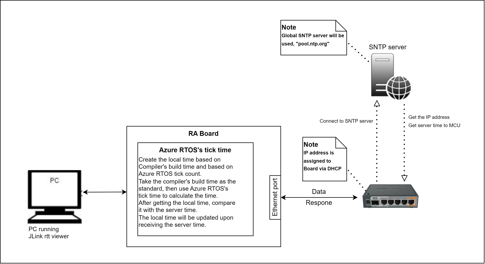
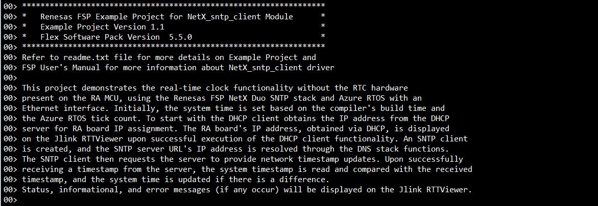
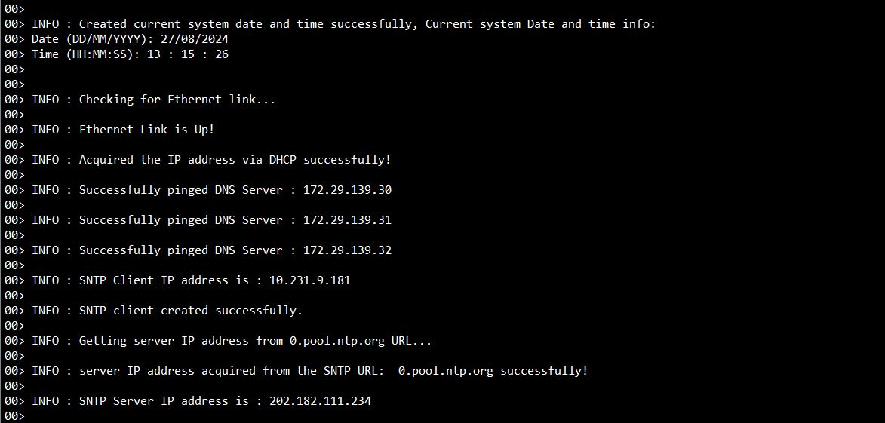
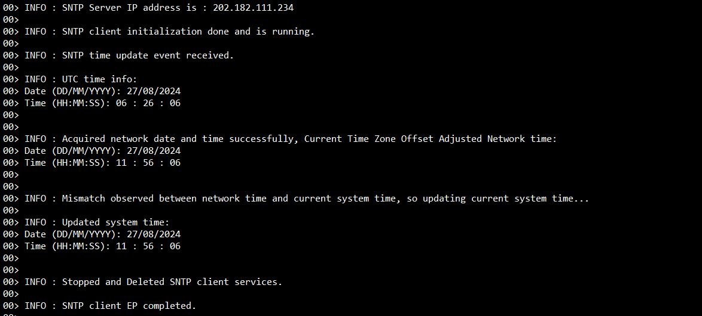
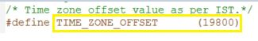
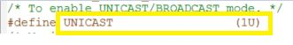

# Introduction #
This Example Project focuses on creating and maintaining an alternative system time in the absence of the RTC (Real-Time Clock) module on the MCK-RA8T1 Board.
Its primary function is to create an SNTP client and update the system time from a global SNTP server to ensure accurate system time.

This project demonstrates the real-time clock functionality without the RTC hardware present on the RA MCU, using the Renesas FSP NetX Duo SNTP stack and Azure RTOS with an Ethernet interface. Initially, the system time is set based on the compiler's build time and the Azure RTOS tick count. To start with the DHCP client obtains the IP address from the DHCP server for RA board IP assignment. The RA board's IP address, obtained via DHCP, is displayed on the Jlink RTTViewer upon successful execution of the DHCP client functionality. An SNTP client is created, and the SNTP server URL's IP address is resolved through the DNS stack functions. The SNTP client then requests the server to provide network timestamp updates. Upon successfully receiving a timestamp from the server, the system timestamp is read and compared with the received timestamp, and the system time is updated if there is a difference. Status, informational, and error messages (if any occur) will be displayed on the Jlink RTTViewer.

The sample code accompanying this file shows the operation of a NetX Duo SNTP Client on a RA MCU using Azure RTOS. 
In this sample code, a NetX Duo IP instance is created with IP address as (default 0.0.0.0 - Not assigned).  
The NetX stack is enabled for UDP, ICMP, ARP. SNTP Client uses the UDP protocol to perform time updates using a simple, stateless protocol. 
SNTP Client creates its own packet pool based on the settings minimum packet payload size and number of packets in the packet pool.
It uses the DHCP client to get the IP address from the DHCP server and DNS Client to resolve the IP address for the ntp pool server url using the DNS lookup.

Once SNTP Client is created and initialized, the Client polls its SNTP Server on regular intervals and waits to receive a reply from that Server. 
When one is received, the Client verifies that the reply contains a valid time update by applying a set of ‘sanity checks’ recommended by [RFC 4330](https://datatracker.ietf.org/doc/html/rfc4330). 
The Client then applies the time difference, if any, with the Server clock to System clock.

NetX Duo SNTP Client is compliant with [RFC1769](https://www.rfc-editor.org/rfc/rfc1769.html) and related RFCs.

Please refer to the [Example Project Usage Guide](https://github.com/renesas/ra-fsp-examples/blob/master/example_projects/Example%20Project%20Usage%20Guide.pdf) 
for general information on example projects and [readme.txt](./readme.txt) for specifics of the operation.

## Required Resources ##
The following resources are needed to build and run the example project.

### Hardware ###
* Renesas RA™ MCU kit with Ethernet Support: MCK-RA8T1
* Type C USB cable
* Ethernet Switch
* Ethernet Cable CAT5/6 (LAN Cable)
* Windows PC for viewing RTT outputs.
* Router for Internet access or LAN connecting to the Internet

Refer to [readme.txt](./readme.txt) for information on how to connect the hardware.

### Software ###
Refer to software requirements mentioned in [Example Project Usage Guide](https://github.com/renesas/ra-fsp-examples/blob/master/example_projects/Example%20Project%20Usage%20Guide.pdf)

## Related Collateral References ##
The following documents can be referred to for enhancing your understanding of 
the operation of this example project:
- [FSP User Manual on GitHub](https://renesas.github.io/fsp/)
- [FSP Known Issues](https://github.com/renesas/fsp/issues)

# Project Notes #

## System Level Block Diagram ##

## FSP Modules Used ##
List all the various modules that are used in this example project. Refer to the FSP User Manual for further details on each module listed below.

| Module Name | Usage  | Searchable Keyword (using New Stack > Search) |
|-------------|-----------------------------------------------|-----------------------------------------------|
| NetX Duo SNTP  Client| To get access of NetX SNTP  client library for client connection. | sntp |
| NetX Duo IP Instance | For IP communication the NetX IP instance needs to be used. SNTP  Client uses the IPV4. | NetX Duo IP|
| NetX Duo Packet Pool | Packet Pool Module is used to send and receive the created data packets over UDP network.  | NetX Duo Packet Pool |
| NetX Duo Ethernet driver | Ethernet connection is required for physical connection to connect over network. | NetX Duo Ethernet Driver |
| NetX Duo DHCP IPv4 Client | DHCPv4 module is used to obtain IP address and to automate the process of configuring devices on IP networks, by using network services such as DNS, SNTP, and any communication protocol based on UDP or TCP. | dhcp |
| NetX Duo DNS Client | DNS Module is used as network service to get the IP address of the Domain (Server) to which the SNTP  client is getting connected. | NetX Duo DNS Client |

## Module Configuration Notes ##
This section describes FSP Configurator properties that are important or different from those selected by default. 

|   Module Property Path and Identifier   |   Default Value   |   Used Value   |   Reason   |
| :-------------------------------------: | :---------------: | :------------: | :--------: |
|   configuration.xml -> BSP > Properties > Settings > Property > Heap Size (bytes)| 0 |0x400| Heap size is required for standard library functions to be used as per FSP requirements. |
|   configuration.xml -> SNTP Client Thread > Settings > Property > Thread > priority  |   1   |   2   |   SNTP Client thread priority is lowered to allow the IP thread to process incoming packets at the fastest rate possible.   |
|   configuration.xml -> RTT Thread > Settings > Property > Thread > priority  |   1   |   3   |   RTT thread priority is lowered to allow the SNTP Client and IP threads to process incoming packets at the fastest rate possible.   |

## API Usage ##

The table below lists the SNTP Client, DHCP CLient and DNS Client API used at the application layer by this example project.

| API Name    | Usage                                                                          |
|-------------|--------------------------------------------------------------------------------|
|nx_sntp_client_create|This API creates a SNTP Client.|
|nx_sntp_client_set_time_update_notify|This API set the SNTP update callback.|
|nx_sntp_client_initialize_unicast|This API set up the SNTP Client to run in unicast mode.|
|nx_sntp_client_initialize_broadcast|This API set up the SNTP Client to run in broadcast mode.|
|nx_sntp_client_set_local_time|This API set the SNTP Client local time.|
|nx_sntp_client_run_unicast|This API runs the Client in unicast mode.|
|nx_sntp_client_run_broadcast|This API runs the Client in broadcast mode.|
|nx_sntp_client_receiving_updates|This API indicates if Client is receiving valid updates.|
|nx_sntp_client_get_local_time_extended|This API gets the extended SNTP Client local time.|
|nx_sntp_client_utility_display_date_time|This API convert an NTP Time to Date and Time string.|
|nx_sntp_client_stop|This API stops the SNTP Client service.|
|nx_sntp_client_delete|This API deletes an SNTP Client.|
|nx_system_initialize|This function initializes the various components and system data structures.|
|nx_packet_pool_create|This API creates a packet pool of the specified packet size in the memory area supplied by the user.|
|nx_ip_address_get|This API retrieves IP address and its subnet mask of the primary network interface.|
|nx_ip_create|This API creates an IP instance with the user supplied IP address and network driver.|
|nx_arp_enable|This API enables the ARP.|
|nx_udp_enable|This API enables the UDP service.|
|nx_icmp_enable|This service enables the Internet Control Message Protocol (ICMP) component for the specified IP instance.|
|nx_ip_status_check|This service checks and optionally waits for the specified status of a previously created IP instance. |
|nx_dhcp_create|This service creates a DHCP instance for the previously created IP instance.|
|nx_dhcp_packet_pool_set|This service allows the application to create the DHCP Client packet pool.|
|nx_dhcp_start|This service starts DHCP processing on all interfaces enabled for DHCP.|
|nx_dhcp_user_option_retrieve|This service retrieves the specified DHCP option from the DHCP options buffer on the first interface enabled for DHCP found on the DHCP Client record.|
|nx_dns_create|This service creates a DNS Client instance for the previously created IP instance.|
|nx_dns_packet_pool_set|This service sets a previously created packet pool as the DNS Client packet pool.|
|nx_dns_server_add|This service adds an IPv4 DNS Server to the server list.|
|nx_dns_host_by_name_get|This service requests IP address, from one or more DNS Servers previously specified by the application.|

## Verifying operation ##
Import the Example Project (Note: Users need to check and update the **TIME_ZONE_OFFSET** macro mentioned in the **Special Topics** Section to display the correct local time for their time zone), Build and Debug the EP(see section Starting Development of **FSP User Manual**). After running the EP, open RTT viewer to see the output.
Before running the example project, refer to the below steps for hardware connections :
* Connect RA MCU debug port to the host PC via a type C USB cable. 
* Connect an Ethernet cable to the RJ45 connector on RA MCU via ethernet switch/hub which is connected to Router or LAN where DHCP server is residing.
* A DHCP Server needs to exist on the network to assign  an IP address to the RA MCU running this SNTP Client Example Project.

Hardware connection setup is required to run the EP reference to "SNTP Client Block Diagram" image in the **System Level Block Diagram** section above

Below images showcases the output on JLinkRTT_Viewer :

## Special Topics ##

* SNTP servers provide UTC (Universal Time Coordinates) time. Depending on the location where the EP is running this needs to be adjusted to the local time. Users can set the **TIME_ZONE_OFFSET** macro value present in the **src\vir_time.h** file as shown in below image, so that the proper local time adjusted and displayed on the RTT console.

         
  Refer [timezone](https://www.epochconverter.com/timezones) for getting **TIME_ZONE_OFFSET** macro value as per required timezone. 
  
* To select unicast/broadcast mode, Configure the **UNICAST** macro value to '1' for unicast mode and '0' for broadcast mode in the **src\sntp_client_ep.h** file as shown in below image.

   
  
  **Note:** Currently EP works only in unicast mode. Broadcast mode is unsupported on this EP because no timestamp update is getting received in this mode.