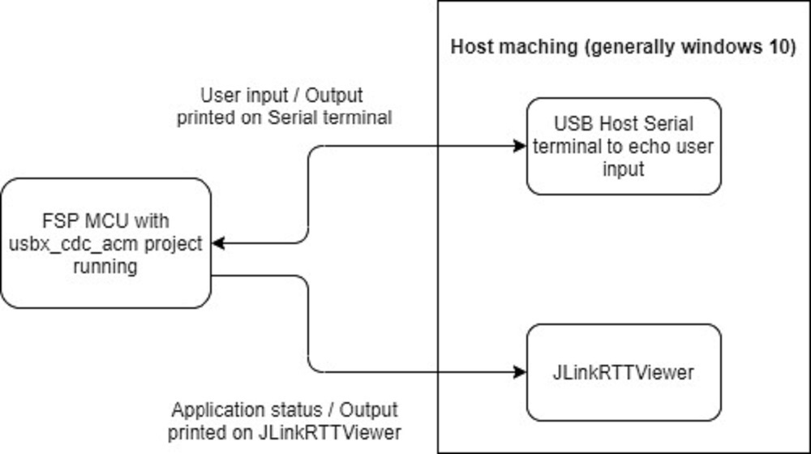
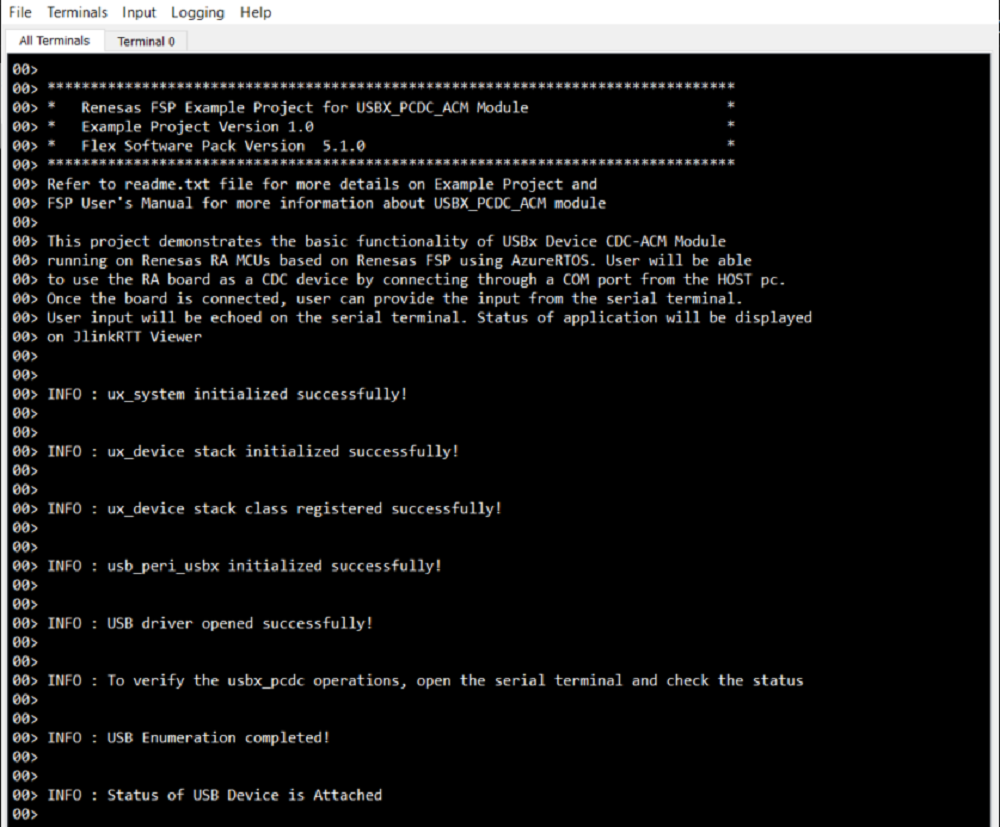
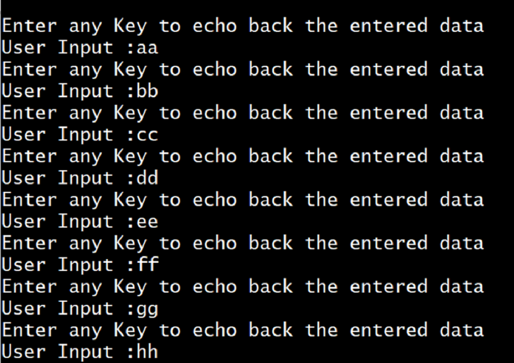

# Introduction #

This project demonstrates the basic functionality of USBX Device CDC ACM module on Renesas RA MCUs based on Renesas FSP using AzureRTOS. In this example project, user will use the RA board as a CDC device which will enumerate as a COM port when connected to the host PC. Once the COM port is enabled, user can provide input from the Serial terminal. User input will be echoed on the serial terminal. The application status messages will be displayed on the Jlink RTT Viewer. 

Please refer to the [Example Project Usage Guide](https://github.com/renesas/ra-fsp-examples/blob/master/example_projects/Example%20Project%20Usage%20Guide.pdf) 
for general information on example projects and [readme.txt](./readme.txt) for specifics of operation.

## Required Resources ##
To build and run the USBX PCDC ACM example project, the following resources are needed.

### Hardware ###
* Renesas RA™ MCU kit.
* 2x Micro USB cables (For MCK-RA8T1: 2x Type C cables).
* HOST Machine.

Refer to [readme.txt](./readme.txt) for information on how to connect the hardware.

### Software ###
1. Refer to the software required section in [Example Project Usage Guide](https://github.com/renesas/ra-fsp-examples/blob/master/example_projects/Example%20Project%20Usage%20Guide.pdf)
2. Refer to [Special Topics](#special-topics) for more information of USBX pcdc setup.

 
## Related Collateral References ##
The following documents can be referred to for enhancing your understanding of 
the operation of this example project:
- [FSP User Manual on GitHub](https://renesas.github.io/fsp/)
- [FSP Known Issues](https://github.com/renesas/fsp/issues)

# Project Notes #

## System Level Block Diagram ##
 High level block diagram
 
 

## FSP Modules Used ##
List all the various modules that are used in this example project. Refer to the FSP User Manual for further details on each module listed below.

| Module Name | Usage | Searchable Keyword  |
|-------------|-----------------------------------------------|-----------------------------------------------|
|USBX PCDC| USBX PCDC is used communicate with Host machine to perform write/read operations from the user input and echoed the same on serial terminal.| rm_usbx_port|
| USB Basic Driver | USB driver is required for hardware configuration on RA MCU. |r_usb_basic|
|DMAC Transfer |DMAC is used to transfer the usb data for faster process.  | r_dmac  |

## Module Configuration Notes ##
This section describes FSP Configurator properties which are important or different than those selected by default. 

**Common Configuration Properties**

|   Module Property Path and Identifier   |   Default Value   |   Used Value   |   Reason   |
| :-------------------------------------: | :---------------: | :------------: | :--------: |
| configuration.xml -> PCDC ACM Thread -> Properties > Settings > Property >Common > Timer> Timer Ticks Per Second |100 | 1000 |The default ticks should be 1000 indicating 1 tick per millisecond.|
| configuration.xml -> PCDC ACM Thread -> Properties > Settings > Property >Thread > Priority| 1 | 15 |PCDC ACM thread priority is lowered to allow the other usb operations at faster rate.|
| configuration.xml -> RTT Thread -> Properties > Settings > Property >Thread > Priority| 1 | 16 | RTT thread priority is lowered to allow the USBX PCDC ACM data process at the fastest rate possible.|
| configuration.xml -> PCDC ACM Thread Stacks -> g_basic0 Instance > Properties > Settings > Property > Common >DMA Support| Disable | Enable | DMA is used to offload CPU usage, to transfer the usb data for faster process.|

**Configuration Properties if USB Speed as High Speed**

|   Module Property Path and Identifier   |   Default Value   |   Used Value   |   Reason   |
| :-------------------------------------: | :---------------: | :------------: | :--------: |
| configuration.xml -> PCDC ACM Thread Stacks -> g_basic0 Instance > Properties > Settings > Property > Common >DMA Source Address| DMA Disabled | HS Address | USB basic driver is configured **USB Speed** as **Hi Speed**. Accordingly, DMA Source Address should provide with **HS Address**.|
| configuration.xml -> PCDC ACM Thread Stacks -> g_basic0 Instance > Properties > Settings > Property > Common >DMA Destination Address| DMA Disabled | HS Address | USB basic driver is configured **USB speed** as **Hi Speed**. Accordingly, DMA Destination Address should provided with **HS Address**.|
| configuration.xml -> PCDC ACM Thread Stacks -> g_basic0 Instance > Properties > Settings > Property > Module g_basic0 USB Driver on r_usb_basic > USB Speed| Full Speed | Hi Speed | USB Speed is configured as **Hi Speed**. According to the USB Speed, DMA settings should be updated.|
| configuration.xml -> PCDC ACM Thread Stacks -> g_basic0 Instance > Properties > Settings > Property > Module g_basic0 USB Driver on r_usb_basic > USB Module Number| USB_IP0 Port | USB_IP1 Port | This property is used to specify USB module number to be used as per configured USB speed.|
| configuration.xml -> PCDC ACM Thread Stacks -> g_transfer0 Transfer Driver on r_dmac Instance > Properties > Settings > Property > Module g_transfer0 Transfer driver > Transfer Size| 2 | 4 |The transfer size of DMA for **High Speed** requires **4 Bytes**.|
| configuration.xml -> PCDC ACM Thread Stacks -> g_transfer0 Transfer Driver on r_dmac Instance > Properties > Settings > Property > Module g_transfer0 Transfer driver > Activation Source| No ELC Trigger | USBHS FIFO 1 (DMA Transfer request 1)  |This is an event trigger for DMA transfer 0 instance for destination pointer address. |
| configuration.xml -> PCDC ACM Thread Stacks -> g_transfer1 Transfer Driver on r_dmac Instance > Properties > Settings > Property > Module g_transfer1 Transfer driver > Transfer Size| 2 | 4 |The transfer size of DMA for **High Speed** requires **4 Bytes**.
| configuration.xml -> PCDC ACM Thread Stacks -> g_transfer1 Transfer Driver on r_dmac Instance > Properties > Settings > Property > Module g_transfer1 Transfer driver > Activation Source| No ELC Trigger | USBHS FIFO 0 (DMA Transfer request 0)  |This is an event trigger for DMA transfer 1 instance for source pointer address.|

**Configuration Properties if USB Speed as Full Speed**

|   Module Property Path and Identifier   |   Default Value   |   Used Value   |   Reason   |
| :-------------------------------------: | :---------------: | :------------: | :--------: |
| configuration.xml -> PCDC ACM Thread Stacks -> g_basic0 Instance > Properties > Settings > Property > Common >DMA Source Address| DMA Disabled | FS Address | USB basic driver is configured **USB Speed** as **Full Speed**. Accordingly, DMA Source Address should provide with **FS Address**.|
| configuration.xml -> PCDC ACM Thread Stacks -> g_basic0 Instance > Properties > Settings > Property > Common >DMA Destination Address| DMA Disabled | FS Address | USB basic driver is configured **USB speed** as **Full Speed**. Accordingly, DMA Destination Address should provided with **FS Address**.|
| configuration.xml -> PCDC ACM Thread Stacks -> g_transfer0 Transfer Driver on r_dmac Instance > Properties > Settings > Property > Module g_transfer0 Transfer driver > Activation Source| No ELC Trigger | USBFS FIFO 1 (DMA Transfer request 1)  |This is an event trigger for DMA transfer 0 instance for destination pointer address. |
| configuration.xml -> PCDC ACM Thread Stacks -> g_transfer1 Transfer Driver on r_dmac Instance > Properties > Settings > Property > Module g_transfer1 Transfer driver > Activation Source| No ELC Trigger | USBFS FIFO 0 (DMA Transfer request 0)  |This is an event trigger for DMA transfer 1 instance for source pointer address.|

Refer to [User Callback Handlers](#user-callback-handlers) section for user callback

The table below lists the FSP provided API used at the application layer by this example project.

| API Name    | Usage                                                                          |
|-------------|--------------------------------------------------------------------------------|
|[ux_system_initialize](https://docs.microsoft.com/en-us/azure/rtos/usbx/usbx-device-stack-2#initialization-of-usbx-resources)|This API is used to initialize the USBX system. |
|[ux_device_stack_initialize](https://docs.microsoft.com/en-us/azure/rtos/usbx/usbx-device-stack-4#ux_device_stack_initialize)|This API is used to initialize the USBX device stack.  |
|[ux_device_stack_class_register](https://docs.microsoft.com/en-us/azure/rtos/usbx/usbx-device-stack-4#ux_device_stack_class_register)|This API is used to registers the slave class to the slave stack.|
|usb_peri_usbx_initialize|This API is used to initialize the usb module.|
|[ux_device_class_cdc_acm_write](https://docs.microsoft.com/en-us/azure/rtos/usbx/usbx-device-stack-5#ux_device_class_cdc_acm_write)|This API writes to the CDC class.|
|[ux_device_class_cdc_acm_read](https://docs.microsoft.com/en-us/azure/rtos/usbx/usbx-device-stack-5#ux_device_class_cdc_acm_read) |This API reads from the CDC class.|
|R_USB_Open|This API opens the USB basic driver.|

Refer to [USBX Device Class Considerations](https://docs.microsoft.com/en-us/azure/rtos/usbx/usbx-device-stack-5#usb-device-cdc-acm-class) for more details of API used.

## Verifying operation ##

Import, Build and Debug the EP(see section Starting Development of FSP User Manual). After running the EP, open RTT viewer to see the output status of ep.
Open any serial terminal (preferably Tera Term) for providing user input to view the echoed data.

**Note:** To view echoed data, **local echo** in serial terminal should be enabled.

1. Below images showcases the output on **JLinkRTT_Viewer** :

 

2. Below image showcases the sample output on **Serial Terminal** :

 
 
3. Below image showcases the device enumeration in device manager. User can update the Vendor ID and Product ID of their own devices in descriptor file.

 

### Special Topics 
#### Developing Descriptor
1. Refer **Descriptor** section in [Device Class (rm_usbx_port)](https://renesas.github.io/fsp/group___u_s_b_x.html) for developing the descriptor. We can take template file of required usb combination from mentioned path in above link and use the same in source folder by removing the **.template** file extension.

#### User Callback Handlers
1. **usbx_status_callback()** which handles the USB Attach and Removed events.
2. **ux_cdc_device0_instance_activate()** and **ux_cdc_device0_instance_deactivate()** which handles the device stack enumeration events.

#### USBX_PCDC Example Project Limitations

1. Limitation in **ZLP**. When the data transfer is an exact multiple of MaxPacketSize (requested_length), **ZLP handler** should be added after the USB Write call to indicate end of transfer.
