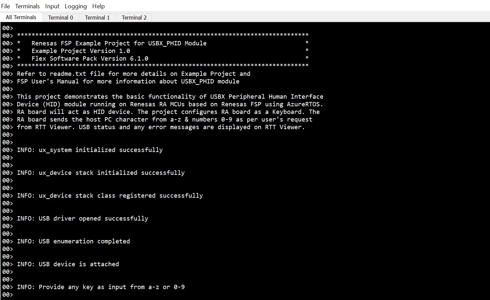
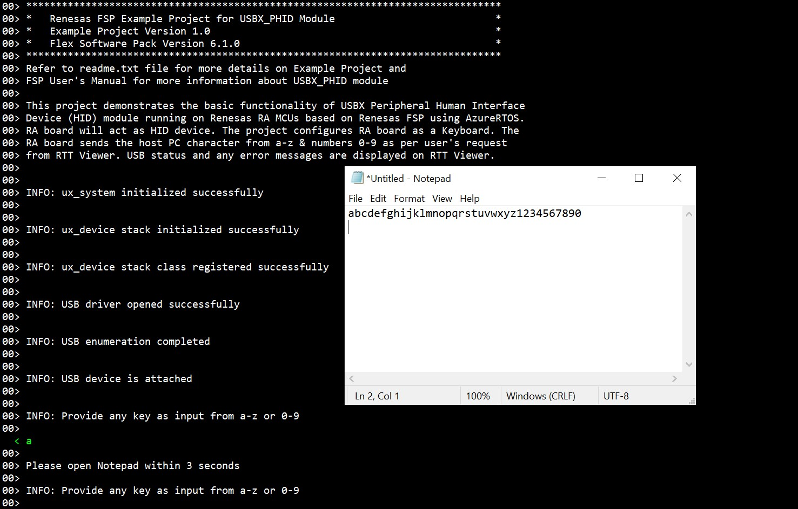

# Introduction #
This project demonstrates basic functionality of USBX Peripheral Human Interface Device Class module on Renesas RA MCUs based on Renesas FSP using Azure RTOS. The user will be able to use RA board as a keyboard (HID Device) by connecting it to the Host PC. Once the board is connected, the user can provide any input from RTT Viewer to send characters from a - z & numbers 0 - 9 from RA board to host PC. USB status and any error messages are displayed on RTT Viewer.

Please refer to the [Example Project Usage Guide](https://github.com/renesas/ra-fsp-examples/blob/master/example_projects/Example%20Project%20Usage%20Guide.pdf) for general information on example projects and [readme.txt](./readme.txt) for specifics of operation.

## Required Resources ##
To build and run the USBX PHID example project, the following resources are needed.

### Software ###
* Renesas Flexible Software Package (FSP): Version 6.3.0
* e2 studio: Version 2025-12
* SEGGER J-Link RTT Viewer: Version 8.92
* LLVM Embedded Toolchain for ARM: Version 21.1.1

* Refer to the software required section in [Example Project Usage Guide](https://github.com/renesas/ra-fsp-examples/blob/master/example_projects/Example%20Project%20Usage%20Guide.pdf)
* Refer to [Special Topics](#special-topics) for more information of USBX PHID setup.

### Hardware ###
* Supported RA boards: EK-RA4M2, EK-RA4M3, EK-RA6M1, EK-RA6M2, EK-RA6M3, EK-RA6M4, EK-RA6M5, EK-RA4E2, EK-RA6E2, EK-RA8M1, EK-RA8D1, MCK-RA8T1, EK-RA4L1, EK-RA8E2, EK-RA8P1, MCK-RA8T2
    * 1 x Renesas RA board.
    * 2 x Type-C USB cables.
    * 1 x PC with at least 2 USB ports.

### Hardware Connections ###
* For EK-RA4M2, EK-RA4M3, EK-RA6M3, EK-RA6M4, EK-RA6M5, EK-RA8M1, EK-RA8D1:	
    * Jumper J12: Connect pins 2-3.
    * Connect Jumper J15 pins.
    * Connect the RA board USB FS port (J11) to the PC via a micro USB cable.
    * Connect the RA board USB debug port (J10) to the PC via a micro USB cable for EP debugging.

* For EK-RA6M1, EK-RA6M2:
    * Connect the RA board USB FS port (J11) to the PC via a micro USB cable.
    * Connect the RA board USB debug port (J9) to the PC via a micro USB cable for EP debugging.

* For EK-RA4E2, EK-RA6E2:
    * Connect the RA board USB FS port (J11) to the PC via a micro USB cable.
    * Connect the RA board USB debug port (J10) to the PC via a micro USB cable for EP debugging.

* For MCK-RA8T1:
    * Jumper JP9: Connect pins 2-3.
    * Connect Jumper JP10 pins.
    * Connect the RA board USB FS port (CN14) to the PC via a Type-C USB cable.
    * Connect the RA board USB debug port (CN11) to the PC via a Type-C USB cable for EP debugging.

* For EK-RA4L1:
    * Turn ON S4-4 to select USB device mode.
    * Set J17 jumper to pins 2-3, Set J7 jumper to use P407 for USBFS VBUS.
    * Connect the RA board USB FS port (J11) to the PC via a Type-C USB cable.
    * Connect the RA board USB debug port (J10) to the PC via a Type-C USB cable for EP debugging.

* For EK-RA8E2, EK-RA8P1:
    * Connect the RA board USB FS port (J11) to the PC via a Type-C USB cable.
    * Connect the RA board USB debug port (J10) to the PC via a Type-C USB cable for EP debugging.

* For MCK-RA8T2:
    * Jumper JP6: Connect pins 2-3.
    * Connect Jumper JP7 pins.
    * Connect the RA board USB FS port (CN18) to the PC via a Type-C USB cable.
    * Connect the RA board USB debug port (CN13) to the PC via a Type-C USB cable for EP debugging.

## Related Collateral References ##
The following documents can be referred to for enhancing your understanding of the operation of this example project:
- [FSP User Manual on GitHub](https://renesas.github.io/fsp/)
- [FSP Known Issues](https://github.com/renesas/fsp/issues)

# Project Notes #

## System Level Block Diagram ##
 High level block diagram
 

## FSP Modules Used ##
List of all the various modules that are used in this example project. Refer to the FSP User Manual for further details on each module listed below.

| Module Name | Usage | Searchable Keyword |
|-------------|-----------------------------------------------|-----------------------------------------------|
| USBX PHID | USBX PHID is used to send character data from the device to the host machine over the USB HID interface. | rm_usbx_port |
| USB Basic Driver | USB driver is required for hardware configuration on RA MCU. | r_usb_basic |

## Module Configuration Notes ##
This section describes FSP Configurator properties which are important or different than those selected by default. 

**Common Configuration Properties**  
|   Module Property Path and Identifier   |   Default Value   |   Used Value   |   Reason   |
| :-------------------------------------: | :---------------: | :------------: | :--------: |
| configuration.xml > Stacks > PHID Thread > Properties > Settings > Property > Common > Timer> Timer Ticks Per Second |100 | 1000 | The default ticks should be 1000 indicating 1 tick per millisecond. |
| configuration.xml > Stacks > PHID Thread > Properties > Settings > Property > Thread > Priority | 1 | 21 | PHID thread priority is lowered to allow the other USB operations at faster rate. |
| configuration.xml > Stacks > RTT Thread > Properties > Settings > Property > Thread > Priority | 1 | 22 | RTT thread priority is lowered to allow the USBX PHID data process at the fastest rate possible. |

Refer to [User Callback Handlers](#user-callback-handlers) section for user callback

The table below lists the FSP provided API used at the application layer by this example project.
| API Name    | Usage                                                                          |
|-------------|--------------------------------------------------------------------------------|
| [ux_system_initialize](https://docs.microsoft.com/en-us/azure/rtos/usbx/usbx-device-stack-2#initialization-of-usbx-resources) | This API is used to initialize the USBX system. |
| [ux_system_uninitialize](https://docs.microsoft.com/en-us/azure/rtos/usbx/usbx-device-stack-2#uninitialization-of-usbx-resources) | This API is used to uninitialize the USBX system. |
| [ux_device_stack_initialize](https://docs.microsoft.com/en-us/azure/rtos/usbx/usbx-device-stack-4#ux_device_stack_initialize) | This API is used to initialize the USBX device stack. |
| [ux_device_stack_uninitialize](https://docs.microsoft.com/en-us/azure/rtos/usbx/usbx-device-stack-4#ux_device_stack_uninitialize) | This API is used to uninitialize the USBX device stack. |
| [ux_device_stack_class_register](https://docs.microsoft.com/en-us/azure/rtos/usbx/usbx-device-stack-4#ux_device_stack_class_register) | This API is used to register the USB device slave class. |
| [ux_device_stack_class_unregister](https://docs.microsoft.com/en-us/azure/rtos/usbx/usbx-device-stack-4#ux_device_stack_class_unregister) | This API is used to unregister the USB device class. |
| [ux_device_class_hid_event_set](https://docs.microsoft.com/en-us/azure/rtos/usbx/usbx-device-stack-5#ux_device_class_hid_event_set) | This API is used to set the PHID event. |
| R_USB_Open | This API is used to open the USB basic driver. |
| R_USB_Close | This API is used to close the USB basic driver. |

Refer to [USBX Device HID Class Considerations](https://docs.microsoft.com/en-us/azure/rtos/usbx/usbx-device-stack-5#usb-device-hid-class) for more details of API used.

## Verifying Operation ##

Import, build and debug the EP (see section Starting Development of FSP User Manual). After running the EP, open the J-Link RTT Viewer to see the output status of EP.

1. The output on **J-Link RTT Viewer**.

 
 
2. Keyboard keys were printed on the Notepad.

 
 
3. The device enumeration in Device Manager. The user can update the Vendor ID and Product ID of their own devices in descriptor file.

 

### Special Topics 
#### Developing Descriptor
1. Refer **Descriptors** section in [USBX Porting Layer (rm_usbx_port)](https://renesas.github.io/fsp/group___u_s_b_x.html) for developing the descriptor. We can take the template file of required USB combination from the mentioned path in above link and use the same in source folder by removing the **.template** file extension.

#### User Callback Handlers
1. **usbx_status_callback()** which handle the USB Attached and Removed events.
2. **ux_hid_device_instance_activate()** and **ux_hid_device_instance_deactivate()** which handles the device stack enumeration events.

#### Limitations of USBX PHID Example Project 
1. USBX PHID module does not support High-Speed USB mode.
2. This example project does not support OUT transfers (host to device).
3. The project may not function correctly on PCs with CrowdStrike security software installed.