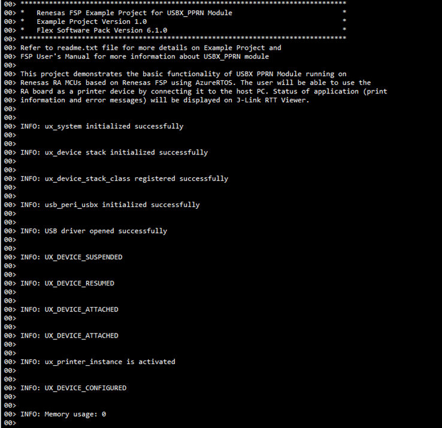
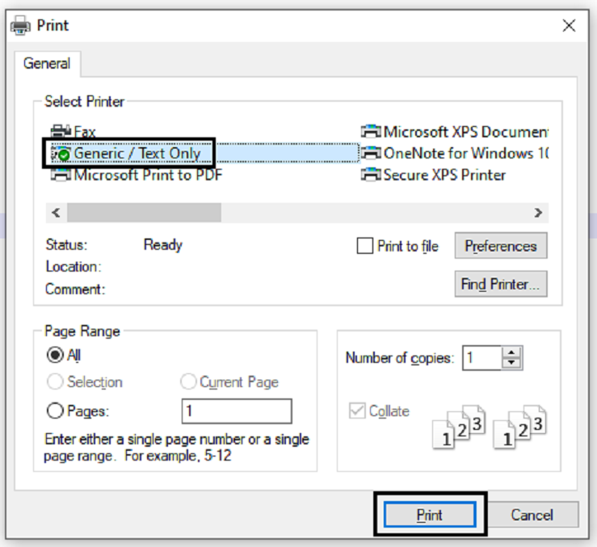

# Introduction #
This project demonstrates the basic functionality of the USBX Peripheral Printer driver on Renesas RA MCUs based on Renesas FSP using Azure RTOS. An RA MCU board will be connected to the PC where the RA board will act as a peripheral printer and the PC (Windows System) will act as a host device. A print command for a test file will be sent from the host PC, and printing data will be transferred from the host PC to MCU. The RA MCU will display Windows machine printer information, settings, and print data on the J-Link RTT Viewer. Error and info messages will be printed on J-Link RTT Viewer.

Please refer to the [Example Project Usage Guide](https://github.com/renesas/ra-fsp-examples/blob/master/example_projects/Example%20Project%20Usage%20Guide.pdf) for general information on example projects and [readme.txt](./readme.txt) for specifics of the operation.

## Required Resources ##
To build and run the USBX Peripheral Printer example project, the following resources are needed.

### Software ###
Refer to software requirements mentioned in [Example Project Usage Guide](https://github.com/renesas/ra-fsp-examples/blob/master/example_projects/Example%20Project%20Usage%20Guide.pdf)

### Hardware ###
Supported RA boards: EK-RA4M2, EK-RA4M3, EK-RA6M1, EK-RA6M2, EK-RA6M3, EK-RA6M4, EK-RA6M5, EK-RA4E2, EK-RA6E2, EK-RA8M1, EK-RA8D1, MCK-RA8T1, EK-RA4L1, EK-RA8E2, EK-RA8P1, MCK-RA8T2
* 1 x Renesas RA board.
* 2 x Type-C USB cables.
* 1 x Host PC with at least 2 USB ports.

### Hardware Connections ###
The user needs to confirm the default USB speed selection used in the example project prior to set up the hardware connection.

* For EK-RA4M2, EK-RA4M3, EK-RA6M3, EK-RA6M4, EK-RA6M5, EK-RA8M1, EK-RA8D1 (Full Speed):		
  * Jumper J12: Connect pins 2-3.
  * Connect Jumper J15 pins.
  * Connect the RA board USB FS port (J11) to the PC via a micro USB cable.
  * Connect the RA board USB debug port (J10) to the PC via a micro USB cable for EP debugging.

* For EK-RA6M1, EK-RA6M2 (Full Speed):
  * Connect the RA board USB FS port (J11) to the PC via a micro USB cable.
  * Connect the RA board USB debug port (J9) to the PC via a micro USB cable for EP debugging.

* For EK-RA4E2, EK-RA6E2 (Full Speed):
  * Connect the RA board USB FS port (J11) to the PC via a micro USB cable.
  * Connect the RA board USB debug port (J10) to the PC via a micro USB cable for EP debugging.

* For MCK-RA8T1 (Full Speed):
  * Jumper JP9: Connect pins 2-3.
  * Connect Jumper JP10 pins.
  * Connect the RA board USB FS port (CN14) to the PC via a Type-C USB cable.
  * Connect the RA board USB debug port (CN11) to the PC via a Type-C USB cable for EP debugging.

* For EK-RA4L1 (Full Speed):
  * Turn ON S4-4 to select USB device mode.
  * Set J17 jumper to pins 2-3, Set J7 jumper to use P407 for USBFS VBUS.
  * Connect the RA board USB FS port (J11) to the PC via a Type-C USB cable.
  * Connect the RA board USB debug port (J10) to the PC via a Type-C USB cable for EP debugging.

* For EK-RA8E2, EK-RA8P1 (Full Speed):
  * Connect the RA board USB FS port (J11) to the PC via a Type-C USB cable.
  * Connect the RA board USB debug port (J10) to the PC via a Type-C USB cable for EP debugging.

* For MCK-RA8T2 (Full Speed):
  * Jumper JP6: Connect pins 2-3.
  * Connect Jumper JP7 pins.
  * Connect the RA board USB FS port (CN18) to the PC via a Type-C USB cable.
  * Connect the RA board USB debug port (CN13) to the PC via a Type-C USB cable for EP debugging.

* For EK-RA6M3 (High Speed):
  * Jumper J7: Connect pins 2-3.
  * Connect Jumper J17 pins.
  * Connect the RA board USB HS port (J6) to the PC via a micro USB cable.
  * Connect the RA board USB debug port (J10) to the PC via a micro USB cable for EP debugging.

* For EK-RA6M5, EK-RA8M1, EK-RA8D1 (High Speed):  
  * Note: For EK-RA8D1, The user needs to turn OFF SW1-6 to use USBHS.
  * Jumper J7: Connect pins 2-3.
  * Connect Jumper J17 pins.
  * Connect the RA board USB HS port (J31) to the PC via a micro USB cable.
  * Connect the RA board USB debug port (J10) to the PC via a micro USB cable for EP debugging.		

* For EK-RA8P1 (High Speed):
  * Connect the RA board USB HS port (J7) to the PC via a Type-C USB cable.
  * Connect the RA board USB debug port (J10) to the PC via a Type-C USB cable for EP debugging.

## Related Collateral References ##
The following documents can be referred to for enhancing your understanding of the operation of this example project:
- [FSP User Manual on GitHub](https://renesas.github.io/fsp/)
- [FSP Known Issues](https://github.com/renesas/fsp/issues)

# Project Notes #
## System Level Block Diagram ##

## FSP Modules Used ##
List all the various modules that are used in this example project. Refer to the FSP User Manual for further details on each module listed below.
| Module Name | Usage  | Searchable Keyword (using New Stack > Search) |
| :---------: | :---------------: | :------------: |
| USBX PPRN | This module provides USBX Peripheral Printer class support on RA device. | USBX PPRN |
| USB Basic Driver | USB driver is required for hardware configuration on RA MCU. | r_usb_basic |

## Module Configuration Notes ##
This section describes FSP Configurator properties that are important or different from those selected by default. 

**Common Configuration Properties**
|   Module Property Path and Identifier   |   Default Value   |   Used Value   |   Reason   |
| :-------------------------------------: | :---------------: | :------------: | :--------: |
| configuration.xml > BSP > Properties > Settings > Property > RA Common > Main stack size (bytes) | 0x400 | 0x400 | Main Program thread stack is configured to store the local variables of different functions in the code. |
| configuration.xml > BSP > Properties > Settings > Property > RA Common > Heap size (bytes) | 0 | 0x400 | Heap size is required for standard library functions to be used. |
| configuration.xml > Stacks > USBX PPRN Read Thread > Properties > Settings > Property > Common > Timer > Timer Ticks Per Second | 100 | 1000 | The default ticks should be 1000 indicating 1 tick per millisecond. |
| configuration.xml > Stacks > USBX PPRN Thread > Properties > Settings > Property > Thread > Priority | 1 | 15 | USBX PPRN Thread priority is lowered to allow the other USB operations to be serviced at a faster rate. |
| configuration.xml > Stacks > USBX PPRN Read Thread > Properties > Settings > Property > Thread > Priority | 1 | 15 | USBX PPRN Read Thread priority is lowered to allow the other USB operations to be serviced at a faster rate. |
| configuration.xml > Stacks > RTT Thread > Properties > Settings > Property > Thread > Stack size (bytes) | 1024 | 4096 | The size of the RTT Thread Stack is increased so that data from any type of file can be printed on the J-Link RTT Viewer. |
| configuration.xml > Stacks > RTT Thread > Properties > Settings > Property > Thread > Priority | 1 | 16 | RTT thread priority is lowered to allow the internal thread taking priority. |

**Configuration Properties if USB Speed as High Speed**
|   Module Property Path and Identifier   |   Default Value   |   Used Value   |   Reason   |
| :-------------------------------------: | :---------------: | :------------: | :--------: |
| configuration.xml > Stacks > USBX PPRN Thread > g_basic0 USB (r_usb_basic) > Properties > Settings > Property > Module g_basic0 USB (r_usb_basic) > USB Speed | Full Speed | Hi Speed | USB Speed is configured as **Hi Speed**. |
| configuration.xml > Stacks > USBX PPRN Thread > g_basic0 USB (r_usb_basic) > Properties > Settings > Property > Module g_basic0 USB (r_usb_basic) > USB Module Number| USB_IP0 Port | USB_IP1 Port | This property is used to specify USB module number to be used as per configured USB speed. |

**Configuration Properties if USB Speed as Full Speed**
|   Module Property Path and Identifier   |   Default Value   |   Used Value   |   Reason   |
| :-------------------------------------: | :---------------: | :------------: | :--------: |
| configuration.xml > Stacks > USBX PPRN Thread > g_basic0 USB (r_usb_basic) > Properties > Settings > Property > Module g_basic0 USB (r_usb_basic) > USB Speed | Full Speed | Full Speed | USB Speed is configured as **Full Speed**. |
| configuration.xml > Stacks > USBX PPRN Thread > g_basic0 USB (r_usb_basic) > Properties > Settings > Property > Module g_basic0 USB (r_usb_basic) > USB Module Number| USB_IP0 Port | USB_IP0 Port | This property is used to specify USB module number to be used as per configured USB speed. |

## API Usage ##
The table below lists the FSP provided API used at the application layer by this example project.
| API Name    | Usage                                                                          |
|-------------|--------------------------------------------------------------------------------|
| [ux_system_initialize](https://docs.microsoft.com/en-us/azure/rtos/usbx/usbx-device-stack-2#initialization-of-usbx-resources) | This API is used to initialize the USBX system. |
| [ux_device_stack_initialize](https://docs.microsoft.com/en-us/azure/rtos/usbx/usbx-device-stack-4#ux_device_stack_initialize) | This API is used to initialize the USBX device stack. |
| [ux_device_stack_class_register](https://docs.microsoft.com/en-us/azure/rtos/usbx/usbx-device-stack-4#ux_device_stack_class_register) | This API is used to register a new USB device class. |
| [ux_device_class_printer_read](https://renesas.github.io/fsp/group___u_s_b_x.html) | This API is used to read from the Printer class and saves the received data in a buffer. |
| [usb_peri_usbx_initialize](https://renesas.github.io/fsp/group___u_s_b_x.html) | This API is used to process USB peripheral initialization. |
| [R_USB_Open](https://renesas.github.io/fsp/group___u_s_b_x.html) | This API is used to open the USB basic driver. |

Refer to [USBX Device Class Considerations](https://docs.microsoft.com/en-us/azure/rtos/usbx/usbx-device-stack-5#usb-device-cdc-acm-class) for more detailed information on the APIs used.

## Verifying Operation ##
If the USB speed configuration needs to be changed, import the EP and perform necessary changes in the project configuration. Please see the **Module Configuration Notes** section for more details. Furthermore, the following updates are needed in the example project.  
**Note:** The EP is set to support USB High Speed by default if the RA board supports USB High Speed.

  **For High Speed USB:** 
    
	Uncomment the macro HIGH_SPEED_CONFIG in usbx_pprn_ep.h 
	
  **For Full Speed USB:**
  
    Comment the macro HIGH_SPEED_CONFIG in usbx_pprn_ep.h
    
1. Generate, build, and download the USBX PPRN project to the RA board.  
2. Check the printer device status in Device Manager or in Windows settings.  
    The images below show the device enumeration of the printer in device manager and in Windows settings respectively:  
    

    

3. Open J-Link RTT Viewer to verify the initialization status.
    The image below shows the output on J-Link RTT Viewer:  
    

4. Once the USB initialization is complete, open any file (txt, docx, pdf, xlsx (Text Only)) to print the file using Generic / Text Only printer. After opening, give the print command or press *Ctrl+P* on the keyboard. This will invoke the print window.  
5. Select the **Generic/Text Only** device as the printer, and click on Print, as shown in the image below:  
    

    The image below shows the printing data on the J-Link RTT Viewer after a print command is given:  
    

## Special Topics ##
**Developing Descriptor**: A USB device provides information about itself in data structures called USB descriptors. 	

The host obtains descriptors from an attached device by sending various standard control requests to the default endpoint. Those requests specify the type of descriptor to retrieve. In response to such requests, the device sends descriptors that include information about the device, its configurations, interfaces, and the related endpoints.

* Refer **Descriptor** section in [Device Class (rm_usbx_port)](https://renesas.github.io/fsp/group___u_s_b_x.html) for developing the descriptor. We can take the template file (**rm_usbx_pcdc_descriptor.c.template**) of the required USB combination from **ra/fsp/src/rm_usbx_port** folder and use the same in the source folder by removing the **.template** file extension.
