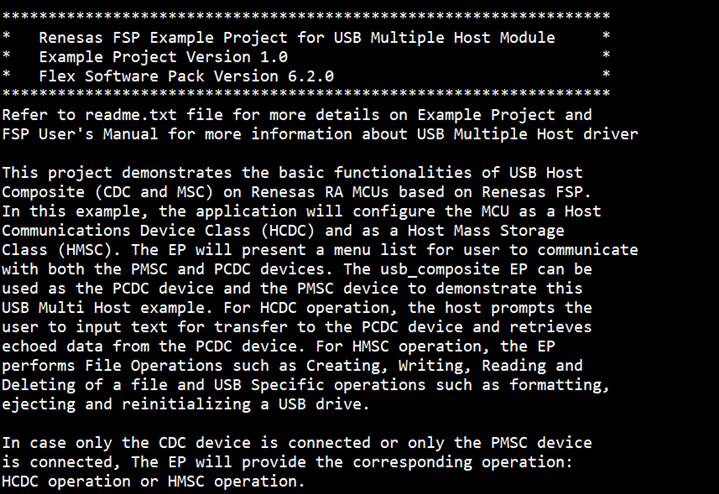
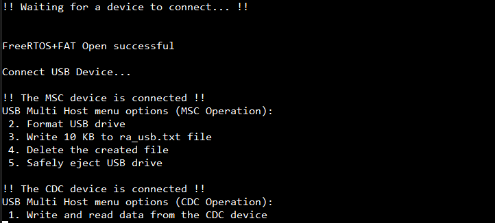
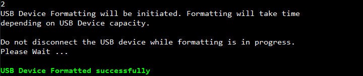
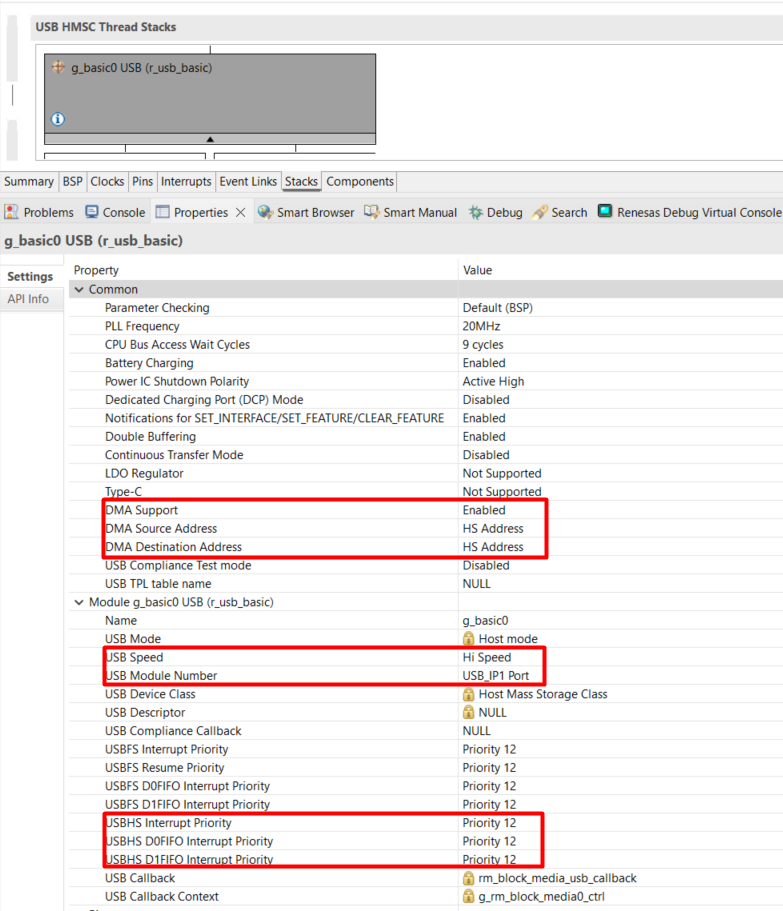

# Introduction #
This project demonstrates the basic functionalities of USB Host Composite (CDC and MSC) on Renesas RA MCUs based on Renesas FSP. In this example, the application will configure the MCU as a Host Communications Device Class (HCDC) and as a Host Mass StorageClass (HMSC). The EP will present a menu list for user to communicate with both the PMSC and PCDC devices. The usb_composite EP can be used as the PCDC device and the PMSC device to demonstrate this USB Multi Host example. For HCDC operation, the host prompts the user to input text for transfer to the PCDC device and retrieves echoed data from the PCDC device. For HMSC operation, the EP performs File Operations such as Creating, Writing, Reading and Deleting of a file and USB Specific operations such as formatting, ejecting and reinitializing a USB drive.

In case only the PCDC device is connected or only the PMSC device is connected, The EP will provide the corresponding operation: USB CDC operation or USB MSC operation.

Note: 
  - Information can be displayed using either the SEGGER J-Link RTT Viewer or a serial terminal (UART) via
    J-Link OB VCOM, depending on availability. If J-Link OB VCOM is unsupported, the example project defaults to
    the SEGGER J-Link RTT Viewer. If supported, it defaults to the serial terminal (UART).
  - To use the SEGGER J-Link RTT Viewer instead of the Serial Terminal, please refer to the instructions provided in 
    the "Special Topic" section.
  - RA boards supported for J-Link OB VCOM: EK-RA8D1, EK-RA8M1, MCK-RA8T1 and MCK-RA8T2.

Please refer to the [Example Project Usage Guide](https://github.com/renesas/ra-fsp-examples/blob/master/example_projects/Example%20Project%20Usage%20Guide.pdf) 
for general information on example projects and [readme.txt](./readme.txt) for specifics of operation.

## Required Resources ##
To build and run the usb host vendor example project, the following resources are needed.

### Software Requirements ###
* Renesas Flexible Software Package (FSP): Version 6.3.0
* e2 studio: Version 2025-12
* SEGGER J-Link RTT Viewer: Version 8.92
* LLVM Embedded Toolchain for ARM: Version 21.1.1
* Serial Terminal Console Application: Tera Term or a similar application

### Hardware ###
Supported RA boards: EK-RA4M2, EK-RA4M3, EK-RA6M3, EK-RA6M4, EK-RA6M5, EK-RA8D1, EK-RA8M1, MCK-RA8T1, MCK-RA8T2
*	2 x Renesas RA boards:
    * 1 x RA board runs the usb_composite EP or usb_pcdc EP (optional).
    * 1 x RA board runs the USB Multi-Host EP.
* 3 x USB cables.
    * 2 x USB cables for programming and debugging.
    * 1 x Type-C USB cable used to connect the RA board 1 to the RA board 2 through OTG cable.
* 1 x USB Flash Drive (optional).  
* 1 x OTG cable: Type-C to USB Host (Female).

### Hardware Connections ###
The USB Multi-Host Example Project configures the USB speed mode as follows:  
* For EK-RA4M2, EK-RA4M3, EK-RA6M4:
  * Full-Speed
    * Set jumper J12 to pins 1-2.
    * Remove the jumper from J15.
    * Connect the USB device to the J11 connector using a micro USB host cable.
    * Connect the micro USB end of the micro USB device cable to micro-AB USB Debug port (J10) of the RA board and Connect the other end of this cable to the USB port of the host PC. 

* For EK-RA6M3, EK-RA6M3G:
  * High-Speed (Default)  
    * Set jumper J7 to pins 1-2.
    * Remove the jumper from J17.
    * Connect the USB device to the J6 connector using a micro USB Host cable.
    * Connect the micro USB end of the micro USB device cable to micro-AB USB Debug port (J10) of the RA board and Connect the other end of this cable to the USB port of the host PC.

  * Full-Speed  
    * Set jumper J12 to pins 1-2.
    * Remove the jumper from J15.
    * Connect the USB device to the J11 connector using a micro USB host cable.
    * Connect the micro USB end of the micro USB device cable to micro-AB USB Debug port (J10) of the RA board and Connect the other end of this cable to the USB port of the host PC.

* For EK-RA6M5, EK-RA8M1, EK-RA8D1:  
  * High-Speed (Default for EK-RA8D1)
    * For EK-RA8D1, the user needs to turn off SW1-6 to use USB HS.		
    * Set jumper J7 to pins 1-2.
    * Remove the jumper from J17.
    * Connect the USB device to the J31 connector using a micro USB host cable.
    * Connect the micro USB end of the micro USB device cable to micro-AB USB Debug port (J10) of the RA board and Connect the other end of this cable to the USB port of the host PC.

  * Full-Speed (Default for EK-RA6M5 and EK-RA8M1)
    * Set jumper J12 to pins 1-2.
    * Remove the jumper from J15.
    * Connect the USB device to the J11 connector using a micro USB host cable.
    * Connect the micro USB end of the micro USB device cable to micro-AB USB Debug port (J10) of the RA board and Connect the other end of this cable to the USB port of the host PC.

* For MCK-RA8T1:
  * Full-Speed
    * Set jumper JP9 to pins 1-2.
    * Remove the jumper from JP10.
    * Connect the USB device to the CN14 connector using a Type-C USB host cable.
    * Connect the Type-C USB end of the Type-C USB device cable to Type-C USB Debug port (CN11) of the RA board and Connect the other end of this cable to the USB port of the host PC.

* For MCK-RA8T2:
  * Full-Speed
    * Set jumper JP6 to pins 1-2.
    * Remove the jumper from JP7.
    * Connect the USB device to the CN13 connector using a Type-C USB host cable.
    * Connect the Type-C USB end of the Type-C USB device cable to Type-C USB Debug port (CN18) of the RA board and Connect the other end of this cable to the USB port of the host PC.

  Note: To change to another USB speed mode, please refer to the Special Topic section.

Snapshots of hardware connections:

 

## Related Collateral References ##
The following documents can be referred to for enhancing your understanding of 
the operation of this example project:
- [FSP User Manual on GitHub](https://renesas.github.io/fsp/)
- [FSP Known Issues](https://github.com/renesas/fsp/issues)

# Project Notes #

## System Level Block Diagram ##

  

## FSP Modules Used ##
List all the various modules that are used in this example project. Refer to the FSP User Manual for further details on each module listed below.

| Module Name | Usage  | Searchable Keyword (using New Stack > Search) |
|-------------|-----------------------------------------------|-----------------------------------------------|
| FreeRTOS+FAT | The FreeRTOS+FAT port provides notifications for insertion and removal of removable media and provides initialization functions required by FreeRTOS+FAT. | rm_freertos_plus_fat |
| Block Media USB | Middleware to implement the block media interface on USB mass storage devices. | rm_block_media_usb |
| USB HMSC | This module provides a USB Host Mass storage class support on RA device. Using USB HMSC in combination with a file system it is possible to communicate with USB storage devices. | r_usb_hmsc |
| USB Basic Driver | USB driver operates in combination with the device class drivers provided by Renesas to form a complete USB stack. | r_usb_basic |
| FreeRTOS Heap 4 | FreeRTOS Heap is required for FreeRTOS standard Library Functions. | FreeRTOS heap 4 |
| USB HCDC | USB HCDC is used for data transfer to and from a CDC peripheral device. | r_usb_hcdc |
| DMAC Transfer | DMAC is used to transfer the USB data to offload MCU usage. | r_dmac |

## Module Configuration Notes ##
This section describes FSP Configurator properties which are important or different than those selected by default. 

|   Module Property Path and Identifier   |   Default Value   |   Used Value   |   Reason   |
| :-------------------------------------: | :---------------: | :------------: | :--------: |
| configuration.xml > Stacks > Threads > USB HMSC Thread > Properties > Settings > Property > Thread > Stack size (bytes) | 1024 | 4096 | This is changed to handle its worst-case function call nesting and local variable usage. |
| configuration.xml > Stacks > Threads > USB HMSC Thread > Properties > Settings > Property > Thread > Priority | 1 | 3 | This is changed to set thread priority. |
| configuration.xml > Stacks > Threads > USB HMSC Thread > Properties > Settings > Property > Common > Memory Allocation > Support Dynamic Allocation | Disabled | Enabled | RTOS objects can be created using RAM that is automatically allocated from the FreeRTOS heap. |
| configuration.xml > Stacks > Threads > USB HMSC Thread > Properties > Settings > Property > Common > Memory Allocation > Total Heap Size | 0 | 61440 | This is changed because Dynamic Allocation support is enabled, so application makes use of amount of RAM available in the FreeRTOS heap. |
| configuration.xml > Stacks > Threads > USB HMSC Thread > Properties > Settings > Property > Common > General > Use Mutexes. | Disabled | Enabled | This is changed to use Mutexes. |
| configuration.xml > Stacks > Threads > USB HMSC Thread > Properties > Settings > Property > Common > General > Use Recurisve Mutexes. | Disabled | Enabled | This is changed to use Recurisve Mutexes. |
| configuration.xml > Stacks > Threads > USB HMSC Thread > FreeRTOS+FAT > FreeRTOS+FAT Port for RA (rm_freertos_plus_fat) > Properties > Settings > Property > Module FreeRTOS+FAT Port for RA > Callback | NULL | free_rtos_fat_callback | As RTOS is used, so the callback function is set and this callback function will notify user about occurrence of usb events. |
| configuration.xml > Stacks > Threads > USB HMSC Thread > g_hmsc0 USB HMSC (r_usb_hmsc) > Properties > Settings > Property > Common > USB Hub Multi MSC | Disabled | Enabled | Enable HUB support for MSC-MSC. |
| configuration.xml > Stacks > Threads > USB HMSC Thread > FreeRTOS+FAT > FreeRTOS+FAT Port for RA (rm_freertos_plus_fat) > g_basic0 USB (r_usb_basic) > Properties > Settings > Property > Common > DMA/DTC Support | Disabled | Enabled | DMAC is used to handle the USB data transfer to offload MCU usage. |
| configuration.xml > Stacks > Threads > USB HCDC Thread > Properties > Settings > Property > Thread > Stack Size | 1024 | 4096 | This is changed to handle its worst-case function call nesting and local variable usage. |
| configuration.xml > Stacks > Threads > USB HCDC Thread > Properties > Settings > Property > Thread > Priority | 1 | 2 | This is changed to set thread priority. |
| configuration.xml > Stacks > Threads > USB HCDC Thread > g_hcdc0 USB HCDC (r_usb_hcdc) > Properties > Settings > Property > Common > USB Hub Multi CDC | Disabled | Enabled | Enable HUB support for CDC-CDC. |

**Configuration Properties if USB Speed as High Speed**

|   Module Property Path and Identifier   |   Default Value   |   Used Value   |   Reason   |
| :-------------------------------------: | :---------------: | :------------: | :--------: |
| configuration.xml > Stacks > Threads > USB HMSC Thread > FreeRTOS+FAT > FreeRTOS+FAT Port for RA (rm_freertos_plus_fat) > g_basic0 USB (r_usb_basic) > Properties > Settings > Property > Common > DMA/DTC Source Address | DMA Disabled | HS Address | USB basic driver is configured **USB Speed** as **Hi Speed**. Accordingly, DMA Source Address should provide with **HS Address**. |
| configuration.xml > Stacks > Threads > USB HMSC Thread > FreeRTOS+FAT > FreeRTOS+FAT Port for RA (rm_freertos_plus_fat) > g_basic0 USB (r_usb_basic) > Properties > Settings > Property > Common > DMA/DTC Destination Address | Disabled | HS Address | USB basic driver is configured **USB Speed** as **Hi Speed**. Accordingly, DMA Source Address should provide with **HS Address**. |
| configuration.xml > Stacks > Threads > USB HMSC Thread > FreeRTOS+FAT > FreeRTOS+FAT Port for RA (rm_freertos_plus_fat) > g_basic0 USB (r_usb_basic) > Properties > Settings > Property > Module g_basic0 USB (r_usb_basic) > USB Speed | Full Speed | Hi Speed | USB Speed is configured as **Hi Speed**. |
| configuration.xml > Stacks > Threads > USB HMSC Thread > FreeRTOS+FAT > FreeRTOS+FAT Port for RA (rm_freertos_plus_fat) > g_basic0 USB (r_usb_basic) > Properties > Settings > Property > Module g_basic0 USB (r_usb_basic) > USB Module Number | USB_IP0 Port | USB_IP1 Port | This property is used to specify USB module number to be used as per configured USB speed. |
| configuration.xml > Stacks > Threads > USB HMSC Thread > FreeRTOS+FAT > FreeRTOS+FAT Port for RA (rm_freertos_plus_fat) > g_basic0 USB (r_usb_basic) > g_transfer0 Transfer (r_dmac) USBHS FIFO 1 (DMA transfer request 1) > Properties > Settings > Property > Module g_transfer0 Transfer (r_dmac) > Transfer Size | 2 Bytes | 4 Bytes | The transfer size of DMA for **High Speed** requires **4 Bytes**. |
| configuration.xml > Stacks > Threads > USB HMSC Thread > FreeRTOS+FAT > FreeRTOS+FAT Port for RA (rm_freertos_plus_fat) > g_basic0 USB (r_usb_basic) > g_transfer0 Transfer (r_dmac) USBHS FIFO 1 (DMA transfer request 1) > Properties > Settings > Property > Module g_transfer0 Transfer (r_dmac) > Activation Source | No ELC Trigger | USBHS FIFO 1 (DMA transfer request 1) | This is an event trigger for DMA transfer 1 instance for source pointer address. |
| configuration.xml > Stacks > Threads > USB HMSC Thread > FreeRTOS+FAT > FreeRTOS+FAT Port for RA (rm_freertos_plus_fat) > g_basic0 USB (r_usb_basic) > g_transfer1 Transfer (r_dmac) USBHS FIFO 0 (DMA transfer request 0) > Properties > Settings > Property > Module g_transfer1 Transfer (r_dmac) > Transfer Size | 2 Bytes | 4 Bytes | The transfer size of DMA for **High Speed** requires **4 Bytes**. |
| configuration.xml > Stacks > Threads > USB HMSC Thread > FreeRTOS+FAT > FreeRTOS+FAT Port for RA (rm_freertos_plus_fat) > g_basic0 USB (r_usb_basic) > g_transfer1 Transfer (r_dmac) USBHS FIFO 0 (DMA transfer request 0) > Properties > Settings > Property > Module g_transfer1 Transfer (r_dmac) > Activation Source | No ELC Trigger | USBHS FIFO 0 (DMA transfer request 0) | This is an event trigger for DMA transfer 0 instance for source pointer address. |

**Configuration Properties if USB Speed as Full Speed**
|   Module Property Path and Identifier   |   Default Value   |   Used Value   |   Reason   |
| :-------------------------------------: | :---------------: | :------------: | :--------: |
| configuration.xml > Stacks > Threads > USB HMSC Thread > FreeRTOS+FAT > FreeRTOS+FAT Port for RA (rm_freertos_plus_fat) > g_basic0 USB (r_usb_basic) > Properties > Settings > Property > Common > DMA/DTC Source Address | DMA Disabled | FS Address | USB basic driver is configured **USB Speed** as **Full Speed**. Accordingly, DMA Source Address should provide with **FS Address**. |
| configuration.xml > Stacks > Threads > USB HMSC Thread > FreeRTOS+FAT > FreeRTOS+FAT Port for RA (rm_freertos_plus_fat) > g_basic0 USB (r_usb_basic) > Properties > Settings > Property > Common > DMA/DTC Destination Address | Disabled | FS Address | USB basic driver is configured **USB Speed** as **Full Speed**. Accordingly, DMA Source Address should provide with **FS Address**. |
| configuration.xml > Stacks > Threads > USB HMSC Thread > FreeRTOS+FAT > FreeRTOS+FAT Port for RA (rm_freertos_plus_fat) > g_basic0 USB (r_usb_basic) > Properties > Settings > Property > Module g_basic0 USB (r_usb_basic) > USB Speed | Full Speed | Full Speed | USB Speed is configured as **Full Speed**. |
| configuration.xml > Stacks > Threads > USB HMSC Thread > FreeRTOS+FAT > FreeRTOS+FAT Port for RA (rm_freertos_plus_fat) > g_basic0 USB (r_usb_basic) > Properties > Settings > Property > Module g_basic0 USB (r_usb_basic) > USB Module Number | USB_IP0 Port | USB_IP0 Port | This property is used to specify USB module number to be used as per configured USB speed. |
| configuration.xml > Stacks > Threads > USB HMSC Thread > FreeRTOS+FAT > FreeRTOS+FAT Port for RA (rm_freertos_plus_fat) > g_basic0 USB (r_usb_basic) > g_transfer0 Transfer (r_dmac) USBFS FIFO 1 (DMA/DTC transfer request 1) > Properties > Settings > Property > Module g_transfer0 Transfer (r_dmac) > Transfer Size | 2 Bytes | 2 Bytes | The transfer size of DMA for **Full Speed** requires **2 Bytes**. |
| configuration.xml > Stacks > Threads > USB HMSC Thread > FreeRTOS+FAT > FreeRTOS+FAT Port for RA (rm_freertos_plus_fat) > g_basic0 USB (r_usb_basic) > g_transfer0 Transfer (r_dmac) USBFS FIFO 1 (DMA/DTC transfer request 1) > Properties > Settings > Property > Module g_transfer0 Transfer (r_dmac) > Activation Source | No ELC Trigger | USBFS FIFO 1 (DMA/DTC transfer request 1) | This is an event trigger for DMA transfer 1 instance for source pointer address. |
| configuration.xml > Stacks > Threads > USB HMSC Thread > FreeRTOS+FAT > FreeRTOS+FAT Port for RA (rm_freertos_plus_fat) > g_basic0 USB (r_usb_basic) > g_transfer1 Transfer (r_dmac) USBFS FIFO 0 (DMA/DTC transfer request 0) > Properties > Settings > Property > Module g_transfer1 Transfer (r_dmac) > Transfer Size | 2 Bytes | 2 Bytes | The transfer size of DMA for **Full Speed** requires **2 Bytes**. |
| configuration.xml > Stacks > Threads > USB HMSC Thread > FreeRTOS+FAT > FreeRTOS+FAT Port for RA (rm_freertos_plus_fat) > g_basic0 USB (r_usb_basic) > g_transfer1 Transfer (r_dmac) USBFS FIFO 0 (DMA/DTC transfer request 0) > Properties > Settings > Property > Module g_transfer1 Transfer (r_dmac) > Activation Source | No ELC Trigger | USBFS FIFO 0 (DMA/DTC transfer request 0) | This is an event trigger for DMA transfer 0 instance for source pointer address. |

For EK-RA4M2, EK-RA4M3, EK-RA6M4, MCK-RA8T1, MCK-RA8T2: 
|   Module Property Path and Identifier   |   Default Value   |   Used Value   |   Reason   |
| :-------------------------------------: | :---------------: | :------------: | :--------: |
| configuration.xml > Stacks > Threads > USB HMSC Thread > Properties > Settings > Property > Thread > Stack size (bytes) | 1024 | 4096 | This is changed to handle its worst-case function call nesting and local variable usage. |
| configuration.xml > Stacks > Threads > USB HMSC Thread > Properties > Settings > Property > Thread > Priority | 1 | 3 | This is changed to set thread priority. |
| configuration.xml > Stacks > Threads > USB HMSC Thread > Properties > Settings > Property > Common > Memory Allocation > Support Dynamic Allocation | Disabled |  Enabled | RTOS objects can be created using RAM that is automatically allocated from the FreeRTOS heap. |
| configuration.xml > Stacks > Threads > USB HMSC Thread > Properties > Settings > Property > Common > Memory Allocation > Total Heap Size | 0 | 61440 | This is changed because Dynamic Allocation support is enabled, so application makes use of amount of RAM available in the FreeRTOS heap. |
| configuration.xml > Stacks > Threads > USB HMSC Thread > Properties > Settings > Property > Common > General > Use Mutexes | Disabled | Enabled | This is changed to use Mutexes. |
| configuration.xml > Stacks > Threads > USB HMSC Thread > Properties > Settings > Property > Common > General > Use Recurisve Mutexes | Disabled | Enabled | This is changed to use Recurisve Mutexes |
| configuration.xml > Stacks > Threads > USB HMSC Thread > FreeRTOS+FAT > FreeRTOS+FAT Port for RA > Properties > Settings > Property > Module FreeRTOS+FAT Port for RA > Callback | NULL | free_rtos_fat_callback | As RTOS is used, so the callback function is set and this callback function will notify user about occurrence of usb events. |
| configuration.xml > Stacks > Threads > USB HMSC Thread > FreeRTOS+FAT > FreeRTOS+FAT Port for RA > g_basic0 USB > Properties > Settings > Property > Common > DMA Support | Disabled | Enabled | DMAC is used to handle the USB data transfer to offload MCU usage. |
| configuration.xml > Stacks > Threads > USB HMSC Thread > FreeRTOS+FAT > FreeRTOS+FAT Port for RA > g_basic0 USB > Properties > Settings > Property > Common > DMA Source Address | DMA Disabled | FS Address | USB basic driver is configured USB Speed as Full Speed. Accordingly, DMA Source Address should provide with FS Address. |
| configuration.xml > Stacks > Threads > USB HMSC Thread > FreeRTOS+FAT > FreeRTOS+FAT Port for RA > g_basic0 USB > Properties > Settings > Property > Common > DMA Destination Address | Disabled | FS Address | USB basic driver is configured USB Speed as Full Speed. Accordingly, DMA Source Address should provide with FS Address. |
| configuration.xml > Stacks > Threads > USB HMSC Thread > FreeRTOS+FAT > FreeRTOS+FAT Port for RA > g_basic0 USB > g_transfer0 Transfer > Properties > Settings > Property > Module g_transfer0 Transfer > Activation Source | No ELC Trigger | USBFS FIFO 1 | This is an event trigger for DMA transfer 1 instance for source pointer address. |
| configuration.xml > Stacks > Threads > USB HMSC Thread > FreeRTOS+FAT > FreeRTOS+FAT Port for RA > g_basic0 USB > g_transfer1 Transfer > Properties > Settings > Property > Module g_transfer1 Transfer > Activation Source | No ELC Trigger | USBFS FIFO 0 | This is an event trigger for DMA transfer 0 instance for source pointer address. |
| configuration.xml > Stacks > Threads > USB HCDC Thread > Properties > Settings > Property > Thread > Stack size (bytes) | 1024 | 4096 | This is changed to handle its worst-case function call nesting and local variable usage. |
| configuration.xml > Stacks > Threads > USB HCDC Thread > Properties > Settings > Property > Thread > Priority | 1 | 2 | This is changed to set thread priority. |

## API Usage ##

The table below lists the FSP provided API used at the application layer by this example project.

| API Name    | Usage                                                                          |
|-------------|--------------------------------------------------------------------------------|
|RM_FREERTOS_PLUS_FAT_Open | This is API used to initialize lower layer media device. |
|RM_FREERTOS_PLUS_FAT_MediaInit | This is API used to initialize the media device. |
|RM_FREERTOS_PLUS_FAT_DiskInit | This is API used to nitialize a FreeRTOS+FAT disk structure. |
|RM_FREERTOS_PLUS_FAT_DiskDeinit | This is API used to deinitialize a FreeRTOS+FAT disk structure. |
|RM_FREERTOS_PLUS_FAT_Close | This is API used to close media device. |
|ff_fopen | This is API used to open a file. |
|ff_fclose | This is API used to flush then close a file. |
|ff_fread | This is API used to read data from a file. |
|ff_fwrite | This is API used to write data to a file. |
|ff_remove | This is API used to remove (delete, or unlink) a file. |
|FF_Format | This is API used to format a partition of a disk. |
|FF_Mount | This is API used to mount the Specified partition. |
|FF_FS_Add | This is API used to add a mounted partition to the FreeRTOS-Plus-FAT virtual file system. |
|stdioGET_ERRNO | This is API used to get the error code. |
|R_USB_HostControlTransfer | This is API used to perform settings and transmission processing when transmitting a setup packet. |
|R_USB_Write | This is API used to request USB data write. |
|R_USB_Read | This is API used to request USB data read. |
|R_SCI_B_UART_Open | This is API used to initialize the UART driver. |
|R_SCI_B_UART_Write | This is API used to write data to the UART interface. |
|R_SCI_B_UART_Read | This is API used to read data to the UART interface. |
|R_SCI_B_UART_Abort | This is API used to abort the read process when the USB device is disconnected. |
|R_SCI_B_UART_Close | This is API used to deinitialize the UART driver.|

## Verifying operation ##

1. Import the example project.

    By default, the EP supports the serial terminal:

    * Define USE_VIRTUAL_COM = 1 macro in Project Properties -> C/C++ Build -> Settings -> Tool Settings -> Compiler -> Includes -> Macro Defines (-D)

    To use SEGGER J-Link RTT Viewer, please follow the instructions as below:

    * Define USE_VIRTUAL_COM = 0 macro in Project Properties -> C/C++ Build -> Settings -> Tool Settings -> Compiler -> Includes -> Macro Defines (-D)

    * Note: By default, for RA boards that do not support J-Link OB VCOM (EK-RA4M2, EK-RA4M3, EK-RA6M3,EK-RA6M3G, EK-RA6M4, and EK-RA6M5), the EP information is printed via the J-Link RTT Viewer.
    
2. Double click Configuration.xml file, and click Generate Project Content. Next, build the project.
3. Connect the RA MCU debug port to the host PC via a Type-C USB cable.
4. Open a serial terminal application on the host PC (Tera Term) and connect to the COM Port provided by the J-Link onboard or open J-link RTT Viewer (In case user selected SEGGER J-Link RTT Viewer).

   * Note: For using the serial terminal:
        * Please ensure that the connection to the RTT Viewer has been terminated if it was previously established.
        * The COM port is provided by the J-Link onboard, with a baud rate of 115200 bps, a data length of 8 bits, no parity check, one stop bit, and no flow control.

5. Debug or flash the EP project to the RA board.
6. After the main menu is displayed on the serial terminal application, the user can select options to perform USB operations.
  * The images below showcase the output on the serial terminal application (Tera Term)
    * Option 1: Connecting to the CDC and MSC devices (usb_composite EP)

      The EP information :
      
      

      The CDC and MSC devices are connected: 

      

      Write and read operation:

      

      Format disk: Due to limitations in RAM size on the MCU, it is unable to format the USB drive (FAT16 or FAT32) when testing with the usb_composite EP.

      
      
      Write 10k data from app_buffer to ra_usb.txt operation:

      
   
      Delete the created file operation:

      

      Safety Eject USB drive operation:

        

      Re-initialize USB drive operation:

        

      Notify USB Device is disconnected without first using the Eject option and waiting for USB to reconnect:

        
  
    * Option 2: Connecting to a USB flash drive

      The MSC device is conneted: 

      

      Format disk:

      

      Write 10k data from app_buffer to ra_usb.txt operation:

      

      Delete the created file operation:

      

      Safety Eject USB drive operation:

        

      Re-initialize USB drive operation:

        

      Notify USB Device is disconnected without first using the Eject option and waiting for USB to reconnect:

        

    * Option 3: Connecting to CDC device (usb_pcdc EP)

      The CDC device is conneted: 

      

      Get kit information from CDC device operation:

      

      Get next step information from CDC device operation:

      

      Remove the CDC device:

      

## Special Topic ##
To change USB speed mode, users can refer to the following configuration:

* USB High-speed configuration with DMAC support:

 

 

 

 * USB Full-speed configuration with DMAC support:

 

 

 

Special notes:

* For HMSC operation:
	1) Format the USB drive (with FAT16/FAT32 file system) before performing any operation. Due to limitations in RAM size on MCU, we are  unable to format (FAT16 or FAT32) the USB drive when testing with composite EP.
	2) Data written can also be manually verified in file ra_usb.txt.
	3) User is expected to execute "safely_eject" option before removing USB else further file operations may fail and USB data may get corrupted.
	4) If USB is removed without "safely_eject" option, user is recommended to perform "safely_eject" and re-initialise USB. This will make sure no USB operations fail after unexpected removal of USB.
* For CDC operation: The user is expected to enter data not exceeding 64 bytes in size.
	   